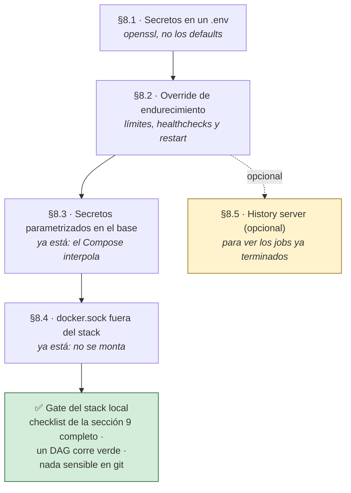

# El stack local, bloque por bloque

> Tramo I del stack: el entorno donde desarrollás y donde todo tiene que funcionar
> **antes** de tocar AWS. Cómo está construido el `docker-compose.yml` (HDFS + Spark +
> Jupyter + Airflow 3), el porqué de cada decisión y cómo endurecerlo sin romper la
> comodidad del desarrollo.

> [!IMPORTANT]
> **Dev y prod no son lo mismo, y la diferencia es deliberada.** Este Compose es el
> entorno de **desarrollo local**, self-contained: trae su propio HDFS y su propio
> cluster Spark. En **producción** la arquitectura es híbrida: Airflow sigue
> orquestando desde una EC2 chica, pero el cómputo Spark se delega a **EMR
> Serverless** y el storage es **S3** (`s3a://`) — **sin HDFS**. Se desarrolla acá y
> se despliega allá; el stack local no cambia. Ver
> [02](02-produccion-aws-terraform.md) y [03](03-arquitectura.md).
>
> **Qué implica en la práctica**: un job que dependa de rutas `hdfs://` escritas a
> mano funciona acá y falla allá. Parametrizá la URI base desde el principio (el
> ejemplo 13 de [04](04-ejemplos-locales.md) muestra cómo).

> **En este documento: LEER (~40 min) y EJECUTAR el endurecimiento de la sección 8.**
> **Salís con**: entender por qué cada servicio está donde está —no solo cómo
> levantarlo—, y con el stack endurecido lo suficiente para que sea un laboratorio y
> no una máquina abierta.

**Qué hacés en cada sección:**

| Sección | Qué hacés | Detalle |
|---|---|---|
| **1–2** | **Leer** (~10 min) | El mapa de los 4 subsistemas y el patrón de anclas YAML que evita repetir configuración |
| **3–6** | **Leer** (~20 min) | Un subsistema por sección: HDFS, Spark, Jupyter, Airflow. Se leen en orden: cada uno asume el anterior |
| **7** | **Leer** (~5 min) | Red, volúmenes y orden de arranque — por qué `depends_on` no alcanza |
| **8** | **Ejecutar** (~20 min) | Endurecimiento: secretos, límites, healthchecks, `docker.sock`. Es lo único que cambia archivos |
| **9** | **Consultar** | El checklist de calidad, para verificar antes de pasar a producción |

> [!TIP]
> **Si lo que querés es *usar* el stack, no entenderlo**, este no es el documento:
> andá a [04 — Ejemplos locales](04-ejemplos-locales.md), que arranca con levantar,
> verificar, apagar y reanudar. Volvé acá cuando algo no haga lo que esperabas.

## Índice

1. [Visión general](#1-visión-general)
2. [El patrón de anclas YAML](#2-el-patrón-de-anclas-yaml)
3. [Almacenamiento: HDFS](#3-almacenamiento-hdfs)
4. [Cómputo: Spark standalone](#4-cómputo-spark-standalone)
5. [Cliente interactivo: Jupyter](#5-cliente-interactivo-jupyter)
6. [Orquestación: Airflow 3](#6-orquestación-airflow-3)
7. [Redes, volúmenes y orden de arranque](#7-redes-volúmenes-y-orden-de-arranque)
8. [Endurecimiento del stack local](#8-endurecimiento-del-stack-local)
9. [Checklist de calidad](#9-checklist-de-calidad)

---

## 1. Visión general

> **En esta sección: LEER, ~5 min.**
> **Salís con**: el mapa de los 4 subsistemas y la regla de red que explica la mitad
> de los errores de conexión de este stack.

El Compose levanta cuatro subsistemas en una sola red de Docker (`hadoopnet`):

| Subsistema | Servicios | Rol |
|---|---|---|
| Almacenamiento | `hdfs-namenode`, `hdfs-datanode` | Sistema de archivos distribuido |
| Cómputo | `spark-master`, `spark-worker` | Cluster Spark 4.0.3 standalone |
| Interactivo | `jupyter` | Driver PySpark para trabajo exploratorio |
| Orquestación | `airflow-*` (5) + `airflow-db` | Airflow 3.2.2 + Postgres 16 |

**Los comandos del día a día están en el `Taskfile.yml` de la raíz**, versionado, para que sean los
mismos en tu máquina y en el CI. Estas son las tasks locales; el archivo ya incluye también las de
producción, cuyo orden explica la [guía 02 §3.0b](02-produccion-aws-terraform.md#30b-el-orquestador-de-comandos-taskfileyml):

| Task | Qué hace |
|---|---|
| `task local:check` | Valida secretos, permisos y el Compose efectivo sin arrancar servicios |
| `task local:up` | Valida y levanta los cuatro subsistemas con el override endurecido |
| `task local:down` | Baja el stack **conservando** los volúmenes (los datos de HDFS y Postgres siguen ahí) |
| `task test` | Pruebas reproducibles de DAGs, contratos y transformaciones dentro de la imagen Airflow |
| `task doc:check` | Los dos validadores de la documentación — no tocan AWS |
| `task --list` | El catálogo completo, incluidas las tasks de producción de la [guía 02](02-produccion-aws-terraform.md) |

No son obligatorias: cada bloque de esta guía muestra el comando `docker compose` completo, porque
lo que se explica acá es el Compose, no el atajo. El Taskfile es para después, cuando ya lo conocés.

Regla base: dentro de una red de Compose, el nombre del servicio **es** el hostname DNS. Por eso
`spark://spark-master:7077` y `hdfs://hdfs-namenode:9000` resuelven solos. Nunca uses `localhost`
entre contenedores: dentro de un contenedor, `localhost` es ese mismo contenedor.

```
                         red: hadoopnet
  ┌────────────────┐   ┌──────────────┐   ┌──────────────────────────┐
  │  HDFS          │   │  Spark       │   │  Airflow 3               │
  │  namenode :9000│◄──┤ master :7077 │◄──┤ scheduler / dag-processor│
  │  datanode      │   │ worker       │   │ api-server / triggerer   │
  └────────────────┘   └──────┬───────┘   │ init (one-shot)          │
                              │           └────────────┬─────────────┘
                        ┌─────▼────┐            ┌──────▼──────┐
                        │ jupyter  │            │ postgres 16 │
                        └──────────┘            └─────────────┘
```

---

## 2. El patrón de anclas YAML

> **En esta sección: LEER, ~5 min.**
> **Salís con**: saber por qué el Compose no repite 20 líneas por servicio, y cómo
> tocar la configuración común sin editarla en cinco lugares.

Es la sección que hace legible todo lo que viene después: si no reconocés `&anchor` y
`<<: *anchor`, los bloques de las secciones 3–6 van a parecer incompletos.

```yaml
x-airflow-common: &airflow-common
  image: pyspark_stack-airflow:3.2.2
  build:
    context: .
    dockerfile: Dockerfile.airflow
  environment: &airflow-common-env
    AIRFLOW__CORE__EXECUTOR: LocalExecutor
    ...
  volumes: [...]
  networks: [hadoopnet]
```

- `x-airflow-common:` — cualquier clave con prefijo `x-` es una *extension field*: Compose la ignora
  como servicio y solo sirve de plantilla.
- `&airflow-common` — define un ancla YAML: «guardá este bloque».
- `<<: *airflow-common` — el *merge* en cada servicio: «pegá acá el bloque anclado».

Airflow 3 partió el monolito en cinco procesos que comparten imagen, entorno y volúmenes. Sin este
patrón habría cinco copias idénticas de unas 40 líneas.

**Por qué `image:` y `build:` juntos:** con ambos, Compose construye la imagen una vez y le asigna
ese tag; los cinco servicios `airflow-*` la reutilizan. Sin el `image:` explícito, cada servicio
podría construir la suya: cinco imágenes duplicadas de unos 7 GB, y el riesgo de que un `up` agarre
una imagen vieja.

Variables de entorno clave:

| Variable | Por qué |
|---|---|
| `AIRFLOW__CORE__EXECUTOR: LocalExecutor` | Las tasks corren como procesos locales del scheduler. No requiere Celery ni Redis; alcanza para desarrollo y cargas moderadas. |
| `AIRFLOW__CORE__AUTH_MANAGER: ...FabAuthManager` | En Airflow 3 el RBAC se movió al provider FAB. Sin esto, `airflow users create` no existe. |
| `AIRFLOW__DATABASE__SQL_ALCHEMY_CONN` | La conexión a la BD se mudó de `[core]` a `[database]` en Airflow 3. |
| `AIRFLOW__CORE__LOAD_EXAMPLES: 'False'` | No ensuciar la UI con DAGs de ejemplo. |
| `AIRFLOW__CORE__EXECUTION_API_SERVER_URL` | Nuevo en Airflow 3: scheduler y tasks hablan con el api-server por la Task Execution API. Debe apuntar a `http://airflow-apiserver:8080/...`, nunca a localhost. |
| `AIRFLOW__API_AUTH__JWT_SECRET` | Reemplaza al viejo `WEBSERVER__SECRET_KEY`; firma los JWT que autentican a las tasks. |
| `AIRFLOW_UID: 50000` | UID del usuario `airflow` dentro de la imagen; alinea permisos con los volúmenes montados. |

Volúmenes compartidos:

```yaml
  volumes:
    - ./dags:/opt/airflow/dags
    - ./spark-apps:/opt/spark-apps                                        # jobs compartidos con el cluster
    - ./hadoop-config/core-site.xml:/opt/hadoop/etc/hadoop/core-site.xml  # config del cliente HDFS
```

> El stack **no** monta `docker.sock`: ningún DAG usa `DockerOperator`. Montarlo daría control del
> host a los cinco procesos de Airflow que heredan este ancla (§8.4).

---

## 3. Almacenamiento: HDFS

> **En esta sección: LEER, ~5 min.**
> **Salís con**: entender el par namenode/datanode y por qué su volumen es lo único
> del stack que no se puede recrear alegremente.

> [!NOTE]
> **HDFS es solo local.** En producción no existe: el storage es S3 (`s3a://`). Está
> acá para que puedas practicar el modelo de archivos distribuido sin pagar nada, no
> porque sea el destino. Los ejemplos que lo usan lo dicen explícitamente
> ([04 — ejemplo 6](04-ejemplos-locales.md)).

```yaml
  hdfs-namenode:
    image: chandravenkat/hadoop-namenode@sha256:51ad92...   # el "índice" (metadatos)
    environment:
      - CLUSTER_NAME=hadoop-cluster
      - CORE_CONF_fs_defaultFS=hdfs://hdfs-namenode:9000
    ports: ["9870:9870"]                                    # UI web de HDFS
    volumes: [hdfs-nn-data:/hadoop/dfs/name, ./spark-apps:/opt/spark-apps]

  hdfs-datanode:
    image: chandravenkat/hadoop-datanode@sha256:ddf6e9...   # guarda los bloques reales
    depends_on: [hdfs-namenode]
    environment:
      - CORE_CONF_fs_defaultFS=hdfs://hdfs-namenode:9000
      - HDFS_CONF_dfs_replication=1
    volumes: [hdfs-dn-data:/hadoop/dfs/data, ./spark-apps:/opt/spark-apps]
```

- **Namenode y datanode:** el namenode guarda metadatos (qué bloque vive dónde), el datanode guarda
  los datos. Por eso el datanode declara `depends_on: hdfs-namenode`.
- **`CORE_CONF_*` / `HDFS_CONF_*`:** las imágenes de este estilo traducen esas variables a entradas
  de `core-site.xml` y `hdfs-site.xml` durante el arranque.
- **`dfs_replication=1`:** con un solo datanode, replicar no aporta nada y genera warnings de bloques
  *under-replicated*.
- **Imágenes fijadas por `@sha256`:** pin inmutable, reproducibilidad exacta frente a un tag mutable
  como `:latest`.
- **Volúmenes nombrados:** los datos sobreviven a `docker compose down`; solo `down -v` los borra.

---

## 4. Cómputo: Spark standalone

> **En esta sección: LEER, ~5 min.**
> **Salís con**: el modelo master/worker, y de dónde sale la URL
> `spark://spark-master:7077` que van a usar todos los `spark-submit`.

> [!NOTE]
> **En producción este cluster no existe**: el cómputo se delega a EMR Serverless
> ([02 §6.4](02-produccion-aws-terraform.md#64-cómputo-spark-emr-serverless)). Lo que **sí** viaja
> es tu código: la lógica de transformación es la misma y por eso conviene mantenerla
> sin I/O acoplado (ejemplo 20 de [04](04-ejemplos-locales.md)).

```yaml
  spark-master:
    build: { context: ., dockerfile: Dockerfile.spark }
    image: pyspark_stack-spark:4.0.3
    entrypoint: ["/opt/spark/bin/spark-class"]
    command: ["org.apache.spark.deploy.master.Master",
              "--host", "spark-master", "--port", "7077", "--webui-port", "8080"]
    ports: ["7077:7077", "8081:8080"]

  spark-worker:
    image: pyspark_stack-spark:4.0.3
    depends_on: [spark-master]
    entrypoint: ["/opt/spark/bin/spark-class"]
    command: ["org.apache.spark.deploy.worker.Worker", "spark://spark-master:7077"]
```

La decisión no obvia es el `entrypoint`. La imagen oficial `apache/spark` está pensada para
`spark-submit` y Kubernetes, no para un cluster standalone persistente: los scripts
`sbin/start-master.sh` y `start-worker.sh` **daemonizan**, el script termina y Docker mata el
contenedor (PID 1 terminado → `Exited(0)`). La solución es arrancar la clase Java en foreground con
`spark-class`, de modo que el proceso Master/Worker sea el PID 1.

- `--host spark-master`: el master anuncia ese hostname para que el worker y los drivers lo
  encuentren; debe coincidir con el nombre del servicio.
- `8081:8080`: la UI del master corre en el `8080` interno y se publica en `8081` para evitar
  colisiones con otras herramientas; Airflow se publica por separado en el host `8082`.
- `Dockerfile.spark` instala Python 3.12 (la base trae 3.10) y fija `PYSPARK_PYTHON=python3.12`: los
  executors deben correr el mismo minor de Python que el driver o Spark aborta con
  `[PYTHON_VERSION_MISMATCH]`.

> `spark-history-server` está comentado en el Compose. Descomentarlo da la UI de jobs terminados
> leyendo `./spark-events` (§8.5).

---

## 5. Cliente interactivo: Jupyter

> **En esta sección: LEER, ~5 min.**
> **Salís con**: entender que Jupyter acá es un **driver de PySpark**, no un servicio
> más: se conecta al master y ejecuta en los workers.

> [!WARNING]
> **Jupyter corre bajo el perfil `dev` y no debe llegar a producción.** Sin token es
> ejecución remota de código para cualquiera que alcance el puerto — por eso
> `JUPYTER_TOKEN` está en el checklist de la sección 9 y por eso el stack de
> producción ([02 §14.1](02-produccion-aws-terraform.md#141-docker-composeprodyml--base)) no lo
> incluye.

```yaml
  jupyter:
    build: { context: ., dockerfile: Dockerfile.jupyter }
    image: pyspark_stack-jupyter:4.0.3
    profiles: ["dev"]                      # solo arranca bajo el perfil dev
    ports: ["8888:8888", "4055:4040"]
    depends_on: [spark-master]
    volumes:
      - ./notebooks:/opt/notebooks
      - ./spark-apps:/opt/spark-apps
      - ./spark-events:/tmp/spark-events
    environment:
      - SPARK_MASTER=spark://spark-master:7077
      - PYSPARK_PYTHON=python3.12
      - PYSPARK_DRIVER_PYTHON=python3.12
      - JUPYTER_TOKEN=${JUPYTER_TOKEN:-}
```

- **`profiles: ["dev"]`:** Jupyter es una herramienta de desarrollo. Un `docker compose up` pelado no
  lo levanta: hace falta `COMPOSE_PROFILES=dev` en el `.env` (así viene en `.env.example`) o
  `docker compose --profile dev up`.

  > **Es la primera vez que hace falta un `.env`.** Si todavía no lo creaste, alcanza con
  > `cp .env.example .env` para seguir leyendo: el resto del Compose usa `${VAR:-default}`, así que
  > el stack levanta igual sin él. Los valores fuertes —y el `JUPYTER_TOKEN` de acá abajo— se
  > completan en [§8.1](#81-secretos-en-un-env), que es donde el `.env` local queda cerrado.
  > A diferencia del `.env` de producción (guía 02 §13.4), este es un solo archivo escrito a mano:
  > no se genera ni crece por secciones.
- **`Dockerfile.jupyter` se construye sobre `apache/spark:4.0.3`**, no sobre la clásica
  `jupyter/pyspark-notebook`, que solo llega a Spark 3.5. Así el driver corre exactamente el mismo
  Spark que el cluster; encima se agregan JupyterLab y Python 3.12.
- **`4055:4040`:** la Spark UI del driver vive en el `4040` interno y se publica en `4055` para no
  chocar con otros drivers.
- **`JUPYTER_TOKEN` explícito:** Compose usa el `.env` para sustituir en el YAML, no lo inyecta en el
  proceso. Sin esta línea el token nunca llega al contenedor y JupyterLab levanta **sin
  autenticación**.

---

## 6. Orquestación: Airflow 3

> **En esta sección: LEER, ~10 min.** Es la más densa del documento.
> **Salís con**: saber qué hace cada uno de los 5 procesos de Airflow 3 y por qué el
> monolito `webserver`+`scheduler` de Airflow 2 ya no existe.

Importa más que las otras porque **Airflow es lo único de este Compose que sobrevive
tal cual a producción**: la EC2 corre estos mismos procesos
([02 §14.1](02-produccion-aws-terraform.md#141-docker-composeprodyml--base)). Lo que cambia allá es
lo que los rodea, no ellos.

Airflow 3 separó el viejo monolito (`webserver` + `scheduler`) en procesos independientes; todos
heredan de `*airflow-common`:

```yaml
  airflow-init:          # one-shot: migra el esquema y crea el admin, luego termina
    <<: *airflow-common
    depends_on: { airflow-db: { condition: service_healthy } }
    command: >
      bash -c "
        airflow db migrate &&
        airflow fab-db migrate &&
        (airflow users create --username ${AIRFLOW_ADMIN_USER:-admin} ... ||
         airflow users reset-password --username ${AIRFLOW_ADMIN_USER:-admin} ...)"

  airflow-apiserver:     # UI + API REST (antes 'webserver'); 8080 interno
    <<: *airflow-common
    restart: always
    command: api-server
    ports: ["8082:8080"]
    depends_on:
      airflow-init: { condition: service_completed_successfully }

  airflow-scheduler:     { command: scheduler }       # decide qué corre y cuándo
  airflow-dag-processor: { command: dag-processor }   # parsea los DAGs (nuevo en Airflow 3)
  airflow-triggerer:     { command: triggerer }       # operadores deferrables
```

| Servicio | Rol | Nota de Airflow 3 |
|---|---|---|
| `airflow-init` | Migra el esquema y crea el admin, luego sale | `db migrate` reemplaza a `db upgrade`; `fab-db migrate` crea las tablas de auth |
| `airflow-apiserver` | Sirve UI y API REST | Reemplaza a `webserver`; firma y valida los JWT |
| `airflow-scheduler` | Programa y despacha tasks | Ya no parsea DAGs |
| `airflow-dag-processor` | Parsea los `.py` de `dags/` | Proceso nuevo y separado |
| `airflow-triggerer` | Corre operadores deferrables (I/O async) | Estándar en Airflow 3 |
| `airflow-log-cleaner` | Aplica edad y tope de tamaño al volumen de logs | Servicio operativo del stack, no un proceso de Airflow |

Dependencias de arranque:

- `airflow-db: condition: service_healthy` → esperar a que Postgres pase su healthcheck
  (`pg_isready`), no solo a que el contenedor exista.
- `airflow-init: condition: service_completed_successfully` → los procesos long-running esperan a que
  la migración termine bien. Evita el clásico «la tabla no existe».

```yaml
  airflow-db:
    image: postgres:16.14-bookworm@sha256:64154d0babcb1741988719e703419af0382b19953706149f9872fbd0f438efa8
    environment:
      - POSTGRES_USER=${POSTGRES_USER:-airflow}
      - POSTGRES_PASSWORD=${POSTGRES_PASSWORD:?define POSTGRES_PASSWORD en .env}
      - POSTGRES_DB=${POSTGRES_DB:-airflow}
    volumes: [postgres_data:/var/lib/postgresql/data]
    healthcheck:
      test: ["CMD", "pg_isready", "-U", "${POSTGRES_USER:-airflow}"]
      interval: 5s
      timeout: 5s
      retries: 10
```

El healthcheck es justamente lo que habilita el `condition: service_healthy`: sin él, Compose solo
sabe que el contenedor arrancó, no que la base acepta conexiones.

---

## 7. Redes, volúmenes y orden de arranque

> **En esta sección: LEER, ~5 min.**
> **Salís con**: entender por qué `depends_on` no alcanza y qué volumen perdés si
> corrés `docker compose down -v` sin pensarlo.

> **La regla que más se olvida**: `depends_on` espera a que el contenedor **arranque**,
> no a que el servicio **esté listo**. Sin healthcheck, Airflow puede intentar migrar
> contra un Postgres que todavía no acepta conexiones, fallar, y dejarte un error que
> no menciona a Postgres por ningún lado. Es exactamente lo que resuelve la
> sección 8.2.

```yaml
volumes:
  postgres_data:   # BD de Airflow
  hdfs-nn-data:    # metadatos de HDFS
  hdfs-dn-data:    # bloques de HDFS
  airflow_logs:    # task logs persistentes con retención acotada

networks:
  hadoopnet:       # una sola red bridge; DNS por nombre de servicio
```

- **Volúmenes nombrados:** los gestiona Docker en `/var/lib/docker/volumes`; su ciclo de vida es el
  de §3.
- **Bind mounts** (`./dags`, `./spark-apps`): carpetas del host mapeadas dentro del contenedor,
  ideales para editar código en caliente.
- **Una sola red** simplifica el DNS. En producción se podría segmentar (datos y orquestación) para
  aislar tráfico.

Orden efectivo de arranque, resuelto por `depends_on`:

```
airflow-db (healthy)
    └─► airflow-init (completa la migración)
            └─► apiserver, scheduler, dag-processor, triggerer, log-cleaner
hdfs-namenode ─► hdfs-datanode
spark-master  ─► spark-worker
spark-master  ─► jupyter   (solo bajo el perfil dev; no espera al worker)
```

Que el master esté arriba no garantiza que haya workers registrados: un notebook lanzado demasiado
pronto queda esperando executors.

---

## 8. Endurecimiento del stack local

> **En esta sección: EJECUTAR, ~20 min.** Es la única que cambia archivos.
> **Salís con**: secretos propios en un `.env` fuera de git, límites de memoria,
> healthchecks reales, logs persistentes pero acotados y `docker.sock` fuera del stack.

### Mapa del camino — sección 8

**Antes de empezar, el prerrequisito** es completar `.env` y ejecutar `task local:check`.



**Reglas de esta sección:**

- **El endurecimiento de recursos va en el override versionado.** Los controles que deben estar
  siempre activos —secretos obligatorios, loopback y rotación de logs— viven en el Compose base.
- **`.env` nunca se commitea.** Está en `.gitignore`; `.env.example` es el que viaja,
  con placeholders. Un secreto commiteado sigue en la historia aunque lo borres
  después.
- **El build no recibe el repositorio completo.** `.dockerignore` sólo permite
  `requirements.txt`, que es el único archivo copiado por los Dockerfiles.
- **No existen defaults para secretos.** Si falta uno, Compose aborta antes de crear contenedores;
  `task local:check` además rechaza longitudes y valores conocidos inseguros.

> **Gotcha §8.1 — cambiar `POSTGRES_PASSWORD` con el volumen ya creado no hace nada.**
> Postgres solo aplica esas variables al **inicializar** el volumen de datos. Si ya
> levantaste el stack con la contraseña vieja, la nueva se ignora en silencio y vas a
> creer que la rotaste. Hay que recrear el volumen (perdiendo la metadata de Airflow)
> o cambiarla por SQL dentro del contenedor.

Lo que es aceptable en desarrollo pero no en producción:

| # | Problema | Riesgo | Estado |
|---|---|---|---|
| 1 | Secretos con defaults débiles | Arranque accidental con credenciales conocidas | Resuelto: obligatorios + gate local (§8.1) |
| 2 | Sin `restart` en HDFS, Spark y Jupyter | Un crash deja el servicio caído | Resuelto en override versionado (§8.2) |
| 3 | Sin healthchecks salvo en Postgres | `depends_on` no sabe si el servicio *funciona* | Resuelto en base/override (§8.2) |
| 4 | Sin límites de recursos | Un job de Spark puede comerse toda la RAM del host | Resuelto en override versionado (§8.2) |
| 5 | Jupyter sin token | Cualquiera en la red entra | Resuelto: token obligatorio y puerto loopback (§8.1) |
| 6 | Montaje de `docker.sock` | Control del host para todos los procesos de Airflow | Resuelto: no se monta (§8.4) |
| 7 | Clave `version:` obsoleta | Warning en cada comando de Compose | Resuelto: eliminada |
| 8 | Logs locales sin límite | El disco puede llenarse aunque los contenedores sigan sanos | Resuelto: rotación + retención acotada |

### Política de logs aplicada

El Compose base ya protege las dos clases de logs, sin depender del override de endurecimiento:

- `stdout/stderr` de **todos** los contenedores usa `json-file` con `max-size: 10m` y
  `max-file: 3`: cada servicio conserva aproximadamente 30 MiB como máximo.
- Los task logs de Airflow viven en el volumen nombrado `airflow_logs`, por lo que sobreviven a
  una recreación de contenedores y a `docker compose down`.
- `airflow-log-cleaner` revisa cada 15 minutos: elimina archivos de más de 30 días y, si el volumen
  aún supera 1 GiB, borra primero los más antiguos. La edad conserva contexto y el tope protege
  también ante una tormenta de logs. Los valores se parametrizan en `.env`:

```dotenv
AIRFLOW_LOCAL_LOG_RETENTION_DAYS=30
AIRFLOW_LOCAL_LOG_MAX_SIZE_MB=1024
AIRFLOW_LOG_CLEANUP_INTERVAL_MINUTES=15
```

Una poda inmediata y una comprobación de espacio se pueden ejecutar así:

```bash
docker compose run --rm --no-deps airflow-log-cleaner bash /opt/pyspark-stack/scripts/prune-airflow-logs.sh --once
docker compose exec airflow-log-cleaner du -sh /opt/airflow/logs
```

`docker compose down -v` sí elimina deliberadamente `airflow_logs`, Postgres y HDFS; no lo use
como parada rutinaria. La retención por edad limita el histórico y la rotación limita ráfagas de
los contenedores. En producción, la copia durable va a S3 y se elimina del host tras subirla
([guía 02 §14.1](02-produccion-aws-terraform.md#141-docker-composeprodyml--base)).

### 8.1 Secretos en un `.env`

El Compose base exige los secretos por interpolación (§8.3); generá un valor distinto para cada
variable y protegé el archivo:

```bash
cp .env.example .env
chmod 600 .env
openssl rand -hex 32      # ejecutar cuatro veces y pegar un valor diferente en cada secreto
```

```dotenv
COMPOSE_PROFILES=dev                 # "dev" levanta Jupyter; vacío para no levantarlo
POSTGRES_USER=airflow
POSTGRES_PASSWORD=<openssl rand -hex 24>
POSTGRES_DB=airflow
AIRFLOW_JWT_SECRET=<openssl rand -hex 32>
AIRFLOW_ADMIN_USER=admin
AIRFLOW_ADMIN_PASSWORD=<valor fuerte>
AIRFLOW_LOCAL_LOG_RETENTION_DAYS=30
AIRFLOW_LOCAL_LOG_MAX_SIZE_MB=1024
AIRFLOW_LOG_CLEANUP_INTERVAL_MINUTES=15
JUPYTER_TOKEN=<token largo>
```

### 8.2 Override de endurecimiento

Usá un override que Compose fusiona para añadir `restart`, healthchecks y límites de memoria. La
rotación y retención de logs ya están en el Compose base y no se duplican aquí.

El archivo [`docker-compose.local-hardened.yml`](../docker-compose.local-hardened.yml) ya está
versionado. `task local:up` siempre lo combina con el Compose base:

```bash
task local:check
task local:up
```

> Este override endurece el **stack local completo**, útil si querés correrlo así en una sola
> máquina. No confundir con producción: el Compose de producción de la
> [guía 02 §14.1](02-produccion-aws-terraform.md) **no levanta** HDFS ni Spark —en la EC2 solo corren
> Airflow, Postgres y el monitoreo— porque el cómputo va a EMR Serverless y el storage a S3.

### 8.3 Secretos parametrizados en el Compose base

Ya está aplicado: el Compose usa `${VAR:?mensaje}` para los cuatro secretos. Sin `.env`, o con un
valor vacío, la expansión falla antes de arrancar.

```yaml
  airflow-db:
    environment:
      - POSTGRES_USER=${POSTGRES_USER:-airflow}
      - POSTGRES_PASSWORD=${POSTGRES_PASSWORD:?define POSTGRES_PASSWORD en .env}
      - POSTGRES_DB=${POSTGRES_DB:-airflow}
```

```yaml
x-airflow-common: &airflow-common
  environment: &airflow-common-env
    AIRFLOW__DATABASE__SQL_ALCHEMY_CONN: postgresql+psycopg2://${POSTGRES_USER:-airflow}:${POSTGRES_PASSWORD:?define POSTGRES_PASSWORD en .env}@airflow-db:5432/${POSTGRES_DB:-airflow}
    AIRFLOW__API_AUTH__JWT_SECRET: '${AIRFLOW_JWT_SECRET:?define AIRFLOW_JWT_SECRET en .env}'
```

> Los nombres de usuario y base conservan defaults no sensibles; las contraseñas, JWT y token no.
> El Compose de producción deberá cargarlos desde SSM antes de arrancar
> ([guía 02 §13](02-produccion-aws-terraform.md)).

### 8.4 Mantener `docker.sock` fuera del stack

El Compose actual no monta el socket, y no conviene agregarlo:

```yaml
    - /var/run/docker.sock:/var/run/docker.sock   # no agregar
```

Si algún caso futuro exige `DockerOperator`, aislalo en un ejecutor dedicado y evaluá un socket-proxy
con API limitada. No lo heredes en api-server, scheduler, triggerer y dag-processor a la vez.

### 8.5 Añadir el history-server (opcional)

Descomentá el bloque `spark-history-server` del Compose y arrancalo: leerá `./spark-events` y dará la
UI de jobs terminados en `:18080`. Acordate de poner `spark.eventLog.enabled true` en
`spark-events/spark-defaults.conf` — hoy está en `false` porque sin History Server los event logs
quedaban huérfanos ([06 §2, incidente #4](referencia/06-historial-de-incidentes.md)).

---

## 9. Checklist de calidad

> **En esta sección: VERIFICAR antes de pasar a producción.**
> **Salís con**: la confirmación de que el Tramo I está sano — que es el gate de
> entrada del Tramo II ([02](02-produccion-aws-terraform.md)).

- [ ] `.env` fuera de git y con secretos generados con `openssl`.
- [ ] `AIRFLOW_JWT_SECRET` único por entorno.
- [ ] `JUPYTER_TOKEN` no vacío (solo aplica en local: en producción Jupyter no corre).
- [x] `restart: unless-stopped` en todos los servicios long-running mediante el override.
- [x] Healthchecks en HDFS, Spark y Jupyter, no solo en Postgres.
- [x] Límites de memoria por servicio (`deploy.resources.limits`).
- [x] Rotación de logs Docker y retención de task logs de Airflow.
- [x] `docker.sock` fuera del stack.
- [x] Imágenes base externas pineadas por versión y `@sha256`.
- [ ] Backup de los volúmenes de Postgres y del namenode de HDFS.

> **Siguiente paso:** [02 — Producción en AWS](02-produccion-aws-terraform.md) para el despliegue
> completo, o [03 — Arquitectura](03-arquitectura.md) para el mapa conceptual.
