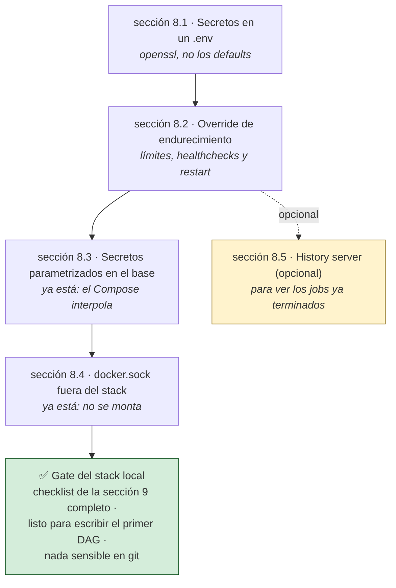

# El stack local, bloque por bloque

> Tramo I del stack: el entorno donde desarrollás y donde todo tiene que funcionar
> **antes** de tocar AWS. Cómo está construido el `docker-compose.yml` (HDFS + Spark +
> Jupyter + Airflow 3), el porqué de cada decisión y cómo endurecerlo sin romper la
> comodidad del desarrollo.

> [!IMPORTANT]
> **Dev y prod no son lo mismo, y la diferencia es deliberada.** Este Compose es el
> entorno de **desarrollo local**, self-contained: trae su propio HDFS y su propio
> cluster Spark. En **producción** la arquitectura es híbrida: Airflow sigue
> orquestando desde una EC2 chica, pero el cómputo Spark se delega a **EMR
> Serverless** y el storage es **S3** (`s3a://`) — **sin HDFS**. Se desarrolla acá y
> se despliega allá; el stack local no cambia. Ver
> [02](02-produccion-aws-terraform.md) y [03](03-arquitectura.md).
>
> **Qué implica en la práctica**: un job que dependa de rutas `hdfs://` escritas a
> mano funciona acá y falla allá. Parametrizá la URI base desde el principio; el
> contrato local está en [06 — Medallion desde cero](06-medallion-desde-cero.md#3-preparar-el-entorno-una-sola-vez).

> **En este documento: CREAR (~30 min), LEER (~40 min) y EJECUTAR el endurecimiento de la sección 8.**
> **Salís con**: entender por qué cada servicio está donde está —no solo cómo
> levantarlo—, y con el stack endurecido lo suficiente para que sea un laboratorio y
> no una máquina abierta.

## 0. Construcción incremental del entorno

> **En esta sección: CREAR, ~30 min.** El checkout no trae los archivos de infraestructura:
> los generás una vez, en este orden, copiando cada bloque completo. Esta sección es la fuente
> canónica de `docker-compose.yml`, los Dockerfiles, los Taskfiles modulares y sus archivos de soporte.
>
> **Salís con**: una raíz lista para ejecutar `task local:check`, sin configuración oculta ni
> archivos de infraestructura preinstalados.

Todos los comandos y rutas de esta sección parten de la raíz del proyecto. Primero, creá los
directorios que recibirán los archivos y el código que escribirás más adelante:

```bash
mkdir -p dags dags/guia dags/medallion dags/medallion_dags \
  hadoop-config ops notebooks spark-apps/projects spark-events taskfiles
```

Para cada bloque siguiente: **CREAR** el archivo indicado, copiá su contenido completo y guardalo
con ese nombre exacto. No combines bloques ni cambies rutas. Si ya existe un archivo porque retomás
la guía, comparalo con el bloque antes de reemplazarlo.

### 0.1 · Proteger secretos y artefactos locales

**CREAR:** `.gitignore`

```gitignore
# --- Secretos / entorno ---
.env
# Overrides locales del cargador de contexto (guía 02, sección 3.1): rutas y perfil de TU máquina.
# El patrón `.env` de arriba NO lo cubre: gitignore compara nombres completos, y este se
# llama prod.env. Commitearlo apuntaría los comandos de otra persona a tu cuenta o tu clave.
**/prod.env
*.pem
*.key

# --- Terraform ---
**/.terraform/*
*.tfstate
*.tfstate.*
*.tfvars
!*.tfvars.example
**/tfplan
# .terraform.lock.hcl SI se versiona: pinea las versiones exactas de los providers, para que un
# init de hoy y uno de dentro de 6 meses instalen lo mismo (mismo criterio que COMPOSE_VERSION).

# --- Config de monitoreo con credenciales ---
monitoring/alertmanager/alertmanager.yml

# --- Python ---
**/__pycache__/
*.py[cod]
.venv/
.ipynb_checkpoints/

# --- Spark ---
# Se ignoran los event logs, pero la config de eventLog sí se versiona:
spark-events/*
!spark-events/spark-defaults.conf

# --- Salidas de notebooks ejecutados ---
notebooks/**/output/
spark-apps/notebook-output/

# --- Salidas y logs de ejecucion (resultados, no fuente) ---
spark-apps/shared_output/
spark-apps/logs/
# Área de trabajo del taller 06: los .py que escribís siguiendo los ejemplos
# y sus salidas. Es un laboratorio personal, no fuente del proyecto.
spark-apps/ejemplos/

# --- Lambdas empaquetadas ---
**/lambda/*.zip
infra/modules/*/*.zip

# --- SO / editor ---
.DS_Store
*.swp
```

### 0.2 · Aislar el contexto de build

**CREAR:** `.dockerignore`

```
# Las imágenes sólo copian este archivo. No enviar .env, state, datos ni el repo completo al daemon.
**
!requirements.txt
```

### 0.3 · Declarar los providers de Airflow

**CREAR:** `requirements.txt`

```text
# Providers para Airflow 3.2.2 (Python 3.14).
# Versiones tomadas del constraints file oficial constraints-3.2.2/constraints-3.14.txt.
# - apache-spark: SparkSubmitOperator para lanzar los jobs contra el cluster standalone.
# - fab: necesario en Airflow 3 para el FabAuthManager y el comando `airflow users create`.
# pyspark==4.2.0 se instala aparte en Dockerfile.airflow (sin constraints) para casar con el cluster Spark 4.2.0.
apache-airflow-providers-apache-spark==6.0.2
apache-airflow-providers-fab==3.6.4
# Producción: EmrServerlessStartJobOperator. Pin compatible con Airflow 3.2.2/Python 3.14.
apache-airflow-providers-amazon[aiobotocore]==9.29.0
```

### 0.4 · Construir la imagen de Airflow

**CREAR:** `Dockerfile.airflow`

```dockerfile
# Airflow 3.2.2 (rama 3.2, la mas madura a jul-2026) sobre Python 3.14 + Spark 4.2.0.
# Stack "lo mas actual manteniendo estabilidad": Python 3.14 obliga a PySpark >= 4.1 (4.0.x
# solo declara soporte hasta 3.13 y su cloudpickle no serializa contra el bytecode de 3.14).
# Se usa Spark 4.2.0, que requiere Java 17 -> se instala Temurin (Adoptium) JDK 17 desde
# tarball (bookworm no trae openjdk-11; y Spark 4 ya no soporta Java 11).
FROM apache/spark:4.2.0-scala2.13-java17-python3-ubuntu@sha256:84a4eedb1abcf36a90808d5a1310e3e910b78c85d85aaa1599e31af5f862ed59 AS spark-runtime

FROM apache/airflow:3.2.2-python3.14@sha256:db1b6917b2460637faa28fda794fa2c419f4618c7a79062f2e863a62cfc1132f

ARG AIRFLOW_VERSION=3.2.2
ARG PYTHON_VERSION=3.14
ARG SPARK_VERSION=4.2.0
# JDK 17 (x86_64). Si cambias de arquitectura, ajusta esta URL de Adoptium.
ARG TEMURIN_JDK_URL=https://github.com/adoptium/temurin17-binaries/releases/download/jdk-17.0.18%2B8/OpenJDK17U-jdk_x64_linux_hotspot_17.0.18_8.tar.gz

USER root

# ----------------------------
#  Install Java 17 (Temurin). Spark se copia de su imagen oficial pineada y cacheable.
# ----------------------------
RUN apt-get update && \
    apt-get install -y --no-install-recommends curl procps && \
    apt-get clean && rm -rf /var/lib/apt/lists/* && \
    mkdir -p /opt/java && \
    curl -fSL --retry 5 --retry-all-errors --retry-delay 3 "${TEMURIN_JDK_URL}" -o /tmp/temurin.tar.gz && \
    curl -fSL --retry 5 --retry-all-errors --retry-delay 3 "${TEMURIN_JDK_URL}.sha256.txt" -o /tmp/temurin.sha256 && \
    printf '%s  %s\n' "$(awk '{print $1}' /tmp/temurin.sha256)" /tmp/temurin.tar.gz | sha256sum -c - && \
    tar -xzf /tmp/temurin.tar.gz -C /opt/java --strip-components=1 && \
    rm -f /tmp/temurin.tar.gz /tmp/temurin.sha256

COPY --from=spark-runtime /opt/spark /opt/spark

ENV JAVA_HOME=/opt/java
ENV SPARK_HOME=/opt/spark
ENV PATH="${PATH}:${JAVA_HOME}/bin:${SPARK_HOME}/bin"

# ----------------------------
# 🔁 Switch back to airflow user and install Python providers
#    Se usa el constraints file OFICIAL de Airflow 3.2.2 para no romper la version de airflow.
# ----------------------------
USER airflow
COPY requirements.txt /
RUN pip install --no-cache-dir -r /requirements.txt \
      --constraint "https://raw.githubusercontent.com/apache/airflow/constraints-${AIRFLOW_VERSION}/constraints-${PYTHON_VERSION}.txt"

# pyspark 4.2.0 SIN constraints: debe casar con el cluster Spark 4.2.0.
RUN pip install --no-cache-dir 'pyspark[sql]==4.2.0' 'pytest==8.4.2'
```

### 0.5 · Construir la imagen de Spark

**CREAR:** `Dockerfile.spark`

```dockerfile
# Cluster Spark 4.2.0 (master/worker) con Python 3.14.
# La imagen oficial apache/spark:4.2.0 es Ubuntu 22.04 -> trae Python 3.10, pero el driver
# (Airflow, Python 3.14) exige que los executors corran el MISMO minor de Python
# ([PYTHON_VERSION_MISMATCH] si no). Se instala Python 3.14 desde el PPA deadsnakes y se
# fuerza PYSPARK_PYTHON=python3.14 para que los workers PySpark casen con el driver.
FROM apache/spark:4.2.0-scala2.13-java17-python3-ubuntu@sha256:84a4eedb1abcf36a90808d5a1310e3e910b78c85d85aaa1599e31af5f862ed59

USER root

RUN apt-get update && \
    apt-get install -y --no-install-recommends software-properties-common && \
    add-apt-repository -y ppa:deadsnakes/ppa && \
    apt-get update && \
    apt-get install -y --no-install-recommends python3.14 python3.14-venv && \
    python3.14 -m ensurepip --upgrade && \
    python3.14 -m pip install --no-cache-dir \
      'numpy==2.4.6' 'pandas==2.3.3' 'pyarrow==24.0.0' && \
    apt-get purge -y software-properties-common && apt-get autoremove -y && \
    apt-get clean && rm -rf /var/lib/apt/lists/*

# El runtime PySpark ya forma parte de /opt/spark en la imagen oficial. Se instalan
# solo los extras de pandas UDF, alineados con el driver Airflow. Reinstalar el paquete
# PySpark de 434 MB duplica artefactos, alarga el build y agrega un punto de fallo.

# Los executors PySpark arrancan con este interprete (debe casar con el driver 3.14).
ENV PYSPARK_PYTHON=python3.14
ENV PYSPARK_DRIVER_PYTHON=python3.14

# --- Conector S3A: habilita leer/escribir s3a:// usando el rol IAM de la EC2 (sin keys) ---
# Spark 4.2.0 empaqueta Hadoop 3.5.0 => hadoop-aws debe ser 3.5.0 y el AWS SDK v2 el que
# declara esa version (bundle 2.35.4). Si aparece ClassNotFound/NoSuchMethod de S3A, ajusta estas versiones.
ARG HADOOP_AWS_VERSION=3.5.0
ARG AWS_SDK_BUNDLE_VERSION=2.35.4
# hadoop-aws 3.5.0 declara ademas el Analytics Accelerator (solo se carga con
# fs.s3a.input.stream.type=analytics, pero sin el jar seria NoClassDefFoundError).
ARG AAL_VERSION=1.3.1
RUN curl -fSL "https://repo1.maven.org/maven2/org/apache/hadoop/hadoop-aws/${HADOOP_AWS_VERSION}/hadoop-aws-${HADOOP_AWS_VERSION}.jar" \
      -o "/opt/spark/jars/hadoop-aws-${HADOOP_AWS_VERSION}.jar" && \
    curl -fSL "https://repo1.maven.org/maven2/org/apache/hadoop/hadoop-aws/${HADOOP_AWS_VERSION}/hadoop-aws-${HADOOP_AWS_VERSION}.jar.sha1" -o /tmp/hadoop-aws.jar.sha1 && \
    printf '%s  %s\n' "$(tr -d '\r\n ' </tmp/hadoop-aws.jar.sha1)" "/opt/spark/jars/hadoop-aws-${HADOOP_AWS_VERSION}.jar" | sha1sum -c - && \
    curl -fSL "https://repo1.maven.org/maven2/software/amazon/awssdk/bundle/${AWS_SDK_BUNDLE_VERSION}/bundle-${AWS_SDK_BUNDLE_VERSION}.jar" \
      -o "/opt/spark/jars/bundle-${AWS_SDK_BUNDLE_VERSION}.jar" && \
    curl -fSL "https://repo1.maven.org/maven2/software/amazon/awssdk/bundle/${AWS_SDK_BUNDLE_VERSION}/bundle-${AWS_SDK_BUNDLE_VERSION}.jar.sha1" -o /tmp/aws-bundle.jar.sha1 && \
    printf '%s  %s\n' "$(tr -d '\r\n ' </tmp/aws-bundle.jar.sha1)" "/opt/spark/jars/bundle-${AWS_SDK_BUNDLE_VERSION}.jar" | sha1sum -c - && \
    curl -fSL "https://repo1.maven.org/maven2/software/amazon/s3/analyticsaccelerator/analyticsaccelerator-s3/${AAL_VERSION}/analyticsaccelerator-s3-${AAL_VERSION}.jar" \
      -o "/opt/spark/jars/analyticsaccelerator-s3-${AAL_VERSION}.jar" && \
    curl -fSL "https://repo1.maven.org/maven2/software/amazon/s3/analyticsaccelerator/analyticsaccelerator-s3/${AAL_VERSION}/analyticsaccelerator-s3-${AAL_VERSION}.jar.sha1" -o /tmp/aal.jar.sha1 && \
    printf '%s  %s\n' "$(tr -d '\r\n ' </tmp/aal.jar.sha1)" "/opt/spark/jars/analyticsaccelerator-s3-${AAL_VERSION}.jar" | sha1sum -c - && \
    rm -f /tmp/hadoop-aws.jar.sha1 /tmp/aws-bundle.jar.sha1 /tmp/aal.jar.sha1

USER spark
```

### 0.6 · Construir la imagen de Jupyter

**CREAR:** `Dockerfile.jupyter`

```dockerfile
# Jupyter sobre la imagen OFICIAL de Spark 4.2.0 (Java 17 ya incluido).
# La base trae Python 3.10, pero el cluster corre Python 3.14 -> se instala Python 3.14
# (deadsnakes) para que el driver del notebook case con los executors (evita PYTHON_VERSION_MISMATCH).
# (jupyter/pyspark-notebook solo llega a Spark 3.5, por eso no se usa.)
FROM apache/spark:4.2.0-scala2.13-java17-python3-ubuntu@sha256:84a4eedb1abcf36a90808d5a1310e3e910b78c85d85aaa1599e31af5f862ed59

USER root
RUN apt-get update && \
    apt-get install -y --no-install-recommends software-properties-common && \
    add-apt-repository -y ppa:deadsnakes/ppa && \
    apt-get update && \
    apt-get install -y --no-install-recommends python3.14 python3.14-venv && \
    python3.14 -m ensurepip --upgrade && \
    python3.14 -m pip install --no-cache-dir \
      'jupyterlab==4.6.3' 'pytest==8.4.2' 'six==1.17.0' \
      'numpy==2.4.6' 'pandas==2.3.3' 'pyarrow==24.0.0' && \
    apt-get purge -y software-properties-common && apt-get autoremove -y && \
    apt-get clean && rm -rf /var/lib/apt/lists/* && \
    mkdir -p /opt/notebooks

# --- Conector S3A: habilita s3a:// desde el notebook usando el rol IAM de la EC2 ---
ARG HADOOP_AWS_VERSION=3.5.0
ARG AWS_SDK_BUNDLE_VERSION=2.35.4
# hadoop-aws 3.5.0 declara ademas el Analytics Accelerator (solo se carga con
# fs.s3a.input.stream.type=analytics, pero sin el jar seria NoClassDefFoundError).
ARG AAL_VERSION=1.3.1
RUN curl -fSL "https://repo1.maven.org/maven2/org/apache/hadoop/hadoop-aws/${HADOOP_AWS_VERSION}/hadoop-aws-${HADOOP_AWS_VERSION}.jar" \
      -o "/opt/spark/jars/hadoop-aws-${HADOOP_AWS_VERSION}.jar" && \
    curl -fSL "https://repo1.maven.org/maven2/org/apache/hadoop/hadoop-aws/${HADOOP_AWS_VERSION}/hadoop-aws-${HADOOP_AWS_VERSION}.jar.sha1" -o /tmp/hadoop-aws.jar.sha1 && \
    printf '%s  %s\n' "$(tr -d '\r\n ' </tmp/hadoop-aws.jar.sha1)" "/opt/spark/jars/hadoop-aws-${HADOOP_AWS_VERSION}.jar" | sha1sum -c - && \
    curl -fSL "https://repo1.maven.org/maven2/software/amazon/awssdk/bundle/${AWS_SDK_BUNDLE_VERSION}/bundle-${AWS_SDK_BUNDLE_VERSION}.jar" \
      -o "/opt/spark/jars/bundle-${AWS_SDK_BUNDLE_VERSION}.jar" && \
    curl -fSL "https://repo1.maven.org/maven2/software/amazon/awssdk/bundle/${AWS_SDK_BUNDLE_VERSION}/bundle-${AWS_SDK_BUNDLE_VERSION}.jar.sha1" -o /tmp/aws-bundle.jar.sha1 && \
    printf '%s  %s\n' "$(tr -d '\r\n ' </tmp/aws-bundle.jar.sha1)" "/opt/spark/jars/bundle-${AWS_SDK_BUNDLE_VERSION}.jar" | sha1sum -c - && \
    curl -fSL "https://repo1.maven.org/maven2/software/amazon/s3/analyticsaccelerator/analyticsaccelerator-s3/${AAL_VERSION}/analyticsaccelerator-s3-${AAL_VERSION}.jar" \
      -o "/opt/spark/jars/analyticsaccelerator-s3-${AAL_VERSION}.jar" && \
    curl -fSL "https://repo1.maven.org/maven2/software/amazon/s3/analyticsaccelerator/analyticsaccelerator-s3/${AAL_VERSION}/analyticsaccelerator-s3-${AAL_VERSION}.jar.sha1" -o /tmp/aal.jar.sha1 && \
    printf '%s  %s\n' "$(tr -d '\r\n ' </tmp/aal.jar.sha1)" "/opt/spark/jars/analyticsaccelerator-s3-${AAL_VERSION}.jar" | sha1sum -c - && \
    rm -f /tmp/hadoop-aws.jar.sha1 /tmp/aws-bundle.jar.sha1 /tmp/aal.jar.sha1

WORKDIR /opt/notebooks
EXPOSE 8888

# El driver del notebook y los executors usan Python 3.14 (igual que el cluster).
ENV PYSPARK_PYTHON=python3.14
ENV PYSPARK_DRIVER_PYTHON=python3.14
# La distribución oficial ya incluye PySpark y Py4J; se exponen al Python de Jupyter
# sin descargar una segunda copia de 434 MB desde PyPI.
ENV PYTHONPATH=/opt/spark/python:/opt/spark/python/lib/py4j-0.10.9.9-src.zip

# Token controlado por la env var JUPYTER_TOKEN (sh expande la variable y exec
# entrega las señales directamente a JupyterLab):
#  - sin definir/vacia -> sin token (entorno local de practica, igual que antes);
#  - definida (override de prod, ver docs/02, sección 14.1, docker-compose.prod.yml) -> token obligatorio.
CMD ["sh", "-c", "exec python3.14 -m jupyterlab --ip=0.0.0.0 --port=8888 --no-browser --allow-root --ServerApp.token=\"${JUPYTER_TOKEN:-}\" --ServerApp.password= --ServerApp.root_dir=/opt/notebooks"]
```

### 0.7 · Preparar el History Server opcional

**CREAR:** `Dockerfile.history`

```dockerfile
# Spark History Server 4.2.0 — misma imagen oficial que el cluster (Java 17), para poder
# leer los event logs que generan master/worker/driver 4.2.0.
# Se arranca la clase en foreground con spark-class: sbin/start-history-server.sh daemoniza
# y el contenedor saldria con Exited(0) (mismo patron que master/worker en el compose).
FROM apache/spark:4.2.0-scala2.13-java17-python3-ubuntu

# Lee los event logs de /tmp/spark-events (bind-mount de ./spark-events en el compose).
ENV SPARK_HISTORY_OPTS="-Dspark.history.fs.logDirectory=file:/tmp/spark-events"

EXPOSE 18080

ENTRYPOINT ["/opt/spark/bin/spark-class"]
CMD ["org.apache.spark.deploy.history.HistoryServer"]
```

### 0.8 · Configurar el cliente HDFS

**CREAR:** `hadoop-config/core-site.xml`

```xml
<configuration>
  <property>
    <name>fs.defaultFS</name>
    <value>hdfs://hdfs-namenode:9000</value>
  </property>
</configuration>
```

### 0.9 · Declarar los orígenes de datos

**CREAR:** `ops/sources.env`

```dotenv
# Orígenes de datos propios de cada proyecto medallion.
#
# Descomentá la variable del proyecto y apuntala a tu archivo en HDFS. Sin valor, el DAG
# usa su fixture mínimo de ejemplo. Los cambios se aplican al recrear los contenedores:
#
#   Seguí docs/06-medallion-desde-cero.md sección 3 para preparar HDFS y subir el archivo.
#   task local:up                                             # aplica este archivo
#
# El DAG de cada proyecto declara el formato y las columnas que espera.
# Los orígenes JSON son JSON Lines: un objeto por línea, sin corchete envolvente.
# Este archivo se versiona: no pongas acá credenciales ni rutas con secretos.

# --- Un origen por proyecto ------------------------------------------------------
#CUSTOMER_360_SOURCE_URI=hdfs://hdfs-namenode:9000/lakehouse/landing/customer_360/customers.json
#DAILY_SALES_SOURCE_URI=hdfs://hdfs-namenode:9000/lakehouse/landing/daily_sales/sales.csv
#FRAUD_SIGNALS_SOURCE_URI=hdfs://hdfs-namenode:9000/lakehouse/landing/fraud_signals/alerts.json
#INVENTORY_SNAPSHOT_SOURCE_URI=hdfs://hdfs-namenode:9000/lakehouse/landing/inventory_snapshot/stock.csv
#MARKETING_ATTRIBUTION_SOURCE_URI=hdfs://hdfs-namenode:9000/lakehouse/landing/marketing_attribution/touchpoints.json
#PAYMENT_RECONCILIATION_SOURCE_URI=hdfs://hdfs-namenode:9000/lakehouse/landing/payment_reconciliation/payments.csv
#PRODUCT_CATALOG_SOURCE_URI=hdfs://hdfs-namenode:9000/lakehouse/landing/product_catalog/products.json
#SUPPLIER_PERFORMANCE_SOURCE_URI=hdfs://hdfs-namenode:9000/lakehouse/landing/supplier_performance/deliveries.csv
#SUPPORT_TICKETS_SOURCE_URI=hdfs://hdfs-namenode:9000/lakehouse/landing/support_tickets/tickets.json
#WEB_EVENTS_SOURCE_URI=hdfs://hdfs-namenode:9000/lakehouse/landing/web_events/events.json

# --- Varios orígenes por proyecto: se pueden definir de a uno -------------------
#AML_TRANSACTIONS_SOURCE_URI=hdfs://hdfs-namenode:9000/lakehouse/landing/aml_transaction_monitoring/transactions.json
#AML_CUSTOMERS_SOURCE_URI=hdfs://hdfs-namenode:9000/lakehouse/landing/aml_transaction_monitoring/customers.json
#AML_WATCHLIST_SOURCE_URI=hdfs://hdfs-namenode:9000/lakehouse/landing/aml_transaction_monitoring/watchlist.csv

#CHURN_CUSTOMERS_SOURCE_URI=hdfs://hdfs-namenode:9000/lakehouse/landing/customer_churn_features/customers.json
#CHURN_SUBSCRIPTIONS_SOURCE_URI=hdfs://hdfs-namenode:9000/lakehouse/landing/customer_churn_features/subscriptions.json
#CHURN_USAGE_SOURCE_URI=hdfs://hdfs-namenode:9000/lakehouse/landing/customer_churn_features/usage.csv
#CHURN_TICKETS_SOURCE_URI=hdfs://hdfs-namenode:9000/lakehouse/landing/customer_churn_features/tickets.json

#DEMAND_SALES_SOURCE_URI=hdfs://hdfs-namenode:9000/lakehouse/landing/demand_forecasting/sales.csv
#DEMAND_PROMOTIONS_SOURCE_URI=hdfs://hdfs-namenode:9000/lakehouse/landing/demand_forecasting/promotions.json
#DEMAND_INVENTORY_SOURCE_URI=hdfs://hdfs-namenode:9000/lakehouse/landing/demand_forecasting/inventory.json

#OTIF_ORDERS_SOURCE_URI=hdfs://hdfs-namenode:9000/lakehouse/landing/order_fulfillment_otif/orders.json
#OTIF_FULFILLMENT_SOURCE_URI=hdfs://hdfs-namenode:9000/lakehouse/landing/order_fulfillment_otif/fulfillment.json
#OTIF_DELIVERY_SOURCE_URI=hdfs://hdfs-namenode:9000/lakehouse/landing/order_fulfillment_otif/delivery.csv

#SUBSCRIPTION_EVENTS_SOURCE_URI=hdfs://hdfs-namenode:9000/lakehouse/landing/subscription_revenue/events.json
#SUBSCRIPTION_INVOICES_SOURCE_URI=hdfs://hdfs-namenode:9000/lakehouse/landing/subscription_revenue/invoices.json
#SUBSCRIPTION_ACCOUNTS_SOURCE_URI=hdfs://hdfs-namenode:9000/lakehouse/landing/subscription_revenue/accounts.json
#SUBSCRIPTION_FX_SOURCE_URI=hdfs://hdfs-namenode:9000/lakehouse/landing/subscription_revenue/fx_rates.csv
```

### 0.10 · Limitar los logs de Airflow

**CREAR:** `ops/airflow_log_retention.sh`

```bash
#!/usr/bin/env bash
set -euo pipefail

readonly LOG_DIR="/opt/airflow/logs"
readonly RETENTION_DAYS="${AIRFLOW_LOCAL_LOG_RETENTION_DAYS:-30}"
readonly MAX_SIZE_MB="${AIRFLOW_LOCAL_LOG_MAX_SIZE_MB:-1024}"
readonly INTERVAL_MINUTES="${AIRFLOW_LOG_CLEANUP_INTERVAL_MINUTES:-15}"

for value in "$RETENTION_DAYS" "$MAX_SIZE_MB" "$INTERVAL_MINUTES"; do
  if [[ ! "$value" =~ ^[1-9][0-9]*$ ]]; then
    echo "log retention values must be positive integers" >&2
    exit 2
  fi
done

mkdir -p "$LOG_DIR"

directory_size_bytes() {
  du -sb "$LOG_DIR" | awk '{print $1}'
}

trim_to_size_limit() {
  local -r max_bytes=$((MAX_SIZE_MB * 1024 * 1024))
  local current_bytes
  current_bytes="$(directory_size_bytes)"
  (( current_bytes <= max_bytes )) && return 0

  while IFS= read -r -d '' entry; do
    local path="${entry#* }"
    rm -f -- "$path"
    current_bytes="$(directory_size_bytes)"
    (( current_bytes <= max_bytes )) && break
  done < <(find "$LOG_DIR" -type f -printf '%T@ %p\0' | sort -z -n)
}

prune_once() {
  find "$LOG_DIR" -type f -mtime "+$RETENTION_DAYS" -delete
  trim_to_size_limit
  find "$LOG_DIR" -depth -type d -empty -delete
}

case "${1:-}" in
  --once)
    prune_once
    exit 0
    ;;
  "") ;;
  *)
    echo "usage: $0 [--once]" >&2
    exit 2
    ;;
esac

while true; do
  prune_once
  sleep "$((INTERVAL_MINUTES * 60))"
done
```

### 0.11 · Preparar eventos de Spark

**CREAR:** `spark-events/spark-defaults.conf`

```
# Desactivado: el spark-history-server está comentado en docker-compose.yml,
# por lo que los event logs no tienen consumidor y quedaban huérfanos.
# Para reactivar el historial: poner esto en 'true' y descomentar el
# servicio spark-history-server en docker-compose.yml.
spark.eventLog.enabled           false
spark.eventLog.dir               file:/tmp/spark-events
spark.history.fs.logDirectory    file:/tmp/spark-events
```

### 0.12 · Definir el stack base

**CREAR:** `docker-compose.yml`

```yaml
# -----------------------------------------------------------------------------
# Config comun de los servicios de Airflow 3.2.2 (LocalExecutor).
# Airflow 3 parte el monolito: api-server (UI+API), scheduler, dag-processor y triggerer
# son procesos independientes que comparten esta misma imagen, env y volumenes.
# -----------------------------------------------------------------------------
x-default-logging: &default-logging
  driver: json-file
  options:
    max-size: "10m"
    max-file: "3"

x-airflow-common: &airflow-common
  # image + build compartidos: la imagen se construye UNA vez y los 5 servicios airflow-*
  # la reutilizan (evita 5 imagenes duplicadas de ~7GB y que 'up' agarre una imagen vieja).
  image: pyspark_stack-airflow:3.2.2
  build:
    context: .
    dockerfile: Dockerfile.airflow
  environment: &airflow-common-env
    AIRFLOW__CORE__EXECUTOR: LocalExecutor
    # Un DAG local lanza drivers Spark desde el scheduler. Limitar la concurrencia
    # evita que un backfill cree decenas de JVM/Python a la vez; las tareas quedan
    # en cola, no se descartan. Los valores se pueden ampliar desde .env.
    AIRFLOW__CORE__PARALLELISM: ${AIRFLOW_PARALLELISM:-2}
    AIRFLOW__CORE__MAX_ACTIVE_TASKS_PER_DAG: ${AIRFLOW_MAX_ACTIVE_TASKS_PER_DAG:-2}
    # Con 15 DAGs educativos un solo parser es suficiente y evita otro intérprete
    # Python residente. Aumentarlo solo cuando el parseo sea el cuello de botella.
    AIRFLOW__DAG_PROCESSOR__PARSING_PROCESSES: ${AIRFLOW_DAG_PARSING_PROCESSES:-1}
    # En Airflow 3 la creacion de usuarios/RBAC vive en el provider FAB:
    AIRFLOW__CORE__AUTH_MANAGER: airflow.providers.fab.auth_manager.fab_auth_manager.FabAuthManager
    # SQL_ALCHEMY_CONN se movio de [core] a [database] en Airflow 3:
    AIRFLOW__DATABASE__SQL_ALCHEMY_CONN: postgresql+psycopg2://${POSTGRES_USER:-airflow}:${POSTGRES_PASSWORD:?define POSTGRES_PASSWORD en .env}@airflow-db:5432/${POSTGRES_DB:-airflow}
    AIRFLOW__CORE__LOAD_EXAMPLES: 'False'
    # El scheduler/worker habla con el api-server via la Task Execution API (nuevo en Airflow 3).
    # OJO: debe apuntar al hostname del contenedor api-server, NO a localhost:
    AIRFLOW__CORE__EXECUTION_API_SERVER_URL: 'http://airflow-apiserver:8080/execution/'
    # Reemplaza al viejo WEBSERVER__SECRET_KEY: el api-server firma tokens JWT.
    AIRFLOW__API_AUTH__JWT_SECRET: '${AIRFLOW_JWT_SECRET:?define AIRFLOW_JWT_SECRET en .env}'
    AIRFLOW_UID: 50000
    # Contrato de persistencia de los DAGs medallion: todas las capas y archivos
    # operativos se escriben en HDFS, nunca en el filesystem efimero de Airflow.
    LAKEHOUSE_ROOT: 'hdfs://hdfs-namenode:9000/lakehouse'
    HADOOP_CONF_DIR: /opt/hadoop/etc/hadoop
    SPARK_MASTER: 'spark://spark-master:7077'
    # El driver Airflow corre con Python 3.14. Spark propaga este ejecutable a
    # cada executor; sin declararlo usaría `python3` (3.10 en la imagen base).
    PYSPARK_PYTHON: python3.14
    PYSPARK_DRIVER_PYTHON: python3.14
    # dags/ contiene el paquete medallion compartido; spark-apps/projects queda
    # disponible para entrypoints externos sin mezclar ambos tipos de codigo.
    PYTHONPATH: /opt/airflow/dags:/opt/spark-apps/projects
  # Origenes de datos propios: <PROYECTO>_SOURCE_URI se define en ops/sources.env,
  # sin editar el Compose. Vacio o comentado -> el DAG usa su fixture de ejemplo.
  env_file:
    - ./ops/sources.env
  volumes:
    - ./dags:/opt/airflow/dags
    - ./spark-apps:/opt/spark-apps
    - ./hadoop-config/core-site.xml:/opt/hadoop/etc/hadoop/core-site.xml
    # Persiste los task logs entre recreaciones. airflow-log-cleaner aplica la retencion.
    - airflow_logs:/opt/airflow/logs
  logging: *default-logging
  networks:
    - hadoopnet

services:
  hdfs-namenode:
    #image: bde2020/hadoop-namenode:2.0.0-hadoop3.2.1-java8
    image: chandravenkat/hadoop-namenode@sha256:51ad9293ec52083c5003ef0aaab00c3dd7d6335ddf495cc1257f97a272cab4c0
    container_name: hdfs-namenode
    environment:
      - CLUSTER_NAME=hadoop-cluster
      - CORE_CONF_fs_defaultFS=hdfs://hdfs-namenode:9000
      - HDFS_CONF_dfs_webhdfs_enabled=true
    ports:
      - "127.0.0.1:9870:9870"
    volumes:
      - hdfs-nn-data:/hadoop/dfs/name
      - ./spark-apps:/opt/spark-apps
    healthcheck:
      test: ["CMD", "curl", "-f", "http://localhost:9870"]
      interval: 15s
      timeout: 5s
      retries: 5
    logging: *default-logging
    networks:
      - hadoopnet

  # Inicializacion idempotente del namespace local. HDFS simple-auth resuelve el
  # usuario desde cada contenedor; 0777 se limita a este laboratorio local y
  # permite que los executors Spark creen los directorios de staging/commit.
  hdfs-init:
    image: chandravenkat/hadoop-namenode@sha256:51ad9293ec52083c5003ef0aaab00c3dd7d6335ddf495cc1257f97a272cab4c0
    container_name: hdfs-init
    entrypoint: ["/bin/bash", "-c"]
    command:
      - |
        until hdfs dfs -fs hdfs://hdfs-namenode:9000 -ls / >/dev/null 2>&1; do sleep 2; done
        hdfs dfs -fs hdfs://hdfs-namenode:9000 -mkdir -p /lakehouse
        hdfs dfs -fs hdfs://hdfs-namenode:9000 -chmod 0777 /lakehouse
        hdfs dfs -fs hdfs://hdfs-namenode:9000 -mkdir -p /lakehouse/landing
        hdfs dfs -fs hdfs://hdfs-namenode:9000 -chmod 0777 /lakehouse/landing
    depends_on:
      hdfs-namenode:
        condition: service_healthy
    logging: *default-logging
    networks:
      - hadoopnet

  hdfs-datanode:
    #image: bde2020/hadoop-datanode:2.0.0-hadoop3.2.1-java8
    image: chandravenkat/hadoop-datanode@sha256:ddf6e9ad55af4f73d2ccb6da31d9e3331ffb94d5f046126db4f40aa348d484bf
    container_name: hdfs-datanode
    depends_on:
      - hdfs-namenode
    environment:
      - CLUSTER_NAME=hadoop-cluster
      - CORE_CONF_fs_defaultFS=hdfs://hdfs-namenode:9000
      - HDFS_CONF_dfs_replication=1
      - HDFS_CONF_dfs_webhdfs_enabled=true
    volumes:
      - hdfs-dn-data:/hadoop/dfs/data
      - ./spark-apps:/opt/spark-apps
    healthcheck:
      test: ["CMD", "curl", "-f", "http://localhost:9864"]
      interval: 30s
      timeout: 10s
      retries: 5
    logging: *default-logging
    networks:
      - hadoopnet

  # Cluster Spark 4.2.0 (imagen oficial Apache, Java 17 + Python 3 para los executors PySpark).
  # La imagen apache/spark esta pensada para spark-submit/k8s, asi que se arranca el master/worker
  # standalone en foreground con spark-class (sbin/start-*.sh daemonizan y el contenedor saldria).
  spark-master:
    build:
      context: .
      dockerfile: Dockerfile.spark
    image: pyspark_stack-spark:4.2.0
    container_name: spark-master
    entrypoint: ["/opt/spark/bin/spark-class"]
    command: ["org.apache.spark.deploy.master.Master", "--host", "spark-master", "--port", "7077", "--webui-port", "8080"]
    ports:
      - "127.0.0.1:7077:7077"
      - "127.0.0.1:8081:8080"
    volumes:
      - ./spark-apps:/opt/spark-apps
      - ./spark-events:/tmp/spark-events
    logging: *default-logging
    networks:
      - hadoopnet

  spark-worker:
    build:
      context: .
      dockerfile: Dockerfile.spark
    image: pyspark_stack-spark:4.2.0
    container_name: spark-worker
    depends_on:
      - spark-master
    entrypoint: ["/opt/spark/bin/spark-class"]
    # No anunciar todos los cores del portatil: cada task PySpark crea procesos
    # Python. Dos cores y 2 GiB alcanzan para el laboratorio y dejan RAM al host.
    command:
      - org.apache.spark.deploy.worker.Worker
      - --cores
      - ${SPARK_WORKER_CORES:-2}
      - --memory
      - ${SPARK_WORKER_MEMORY:-2g}
      - spark://spark-master:7077
    volumes:
      - ./spark-apps:/opt/spark-apps
    networks:
      - hadoopnet
    healthcheck:
      test: ["CMD", "curl", "-f", "http://localhost:8081"]
      interval: 30s
      timeout: 10s
      retries: 5
    logging: *default-logging

#  spark-history-server:
#    build:
#      context: .
#      dockerfile: Dockerfile.history
#    image: pyspark_stack-spark-history:4.2.0
#    container_name: spark-history
#    entrypoint: ["/opt/spark/bin/spark-class"]
#    command: ["org.apache.spark.deploy.history.HistoryServer"]
#    ports:
#      - "18080:18080"
#    volumes:
#      - ./spark-events:/tmp/spark-events
#      - ./spark-events/spark-defaults.conf:/opt/spark/conf/spark-defaults.conf
#    environment:
#      - SPARK_HISTORY_OPTS=-Dspark.history.fs.logDirectory=file:/tmp/spark-events
#    networks:
#      - hadoopnet

  # Jupyter con pyspark 4.2.0 (mismo Spark que el cluster). Se construye desde Dockerfile.jupyter
  # (base apache/spark:4.2.0) porque jupyter/pyspark-notebook solo ofrece hasta Spark 3.5.
  jupyter:
    build:
      context: .
      dockerfile: Dockerfile.jupyter
    image: pyspark_stack-jupyter:4.2.0
    container_name: jupyter-notebook
    # Jupyter es herramienta de DESARROLLO (explorar/depurar antes de promover a DAG).
    # En prod el ETL corre por Airflow y los .ipynb por papermill (headless, sin este server),
    # así que aquí queda bajo el perfil "dev": solo arranca si COMPOSE_PROFILES=dev (ver .env.example)
    # o con `docker compose --profile dev up`. Un `docker compose up` "pelado" (prod) NO lo levanta.
    profiles: ["dev"]
    ports:
      - "127.0.0.1:8888:8888"
      - "127.0.0.1:4055:4040"
    volumes:
      - ./notebooks:/opt/notebooks
      - ./spark-apps:/opt/spark-apps
      - ./spark-events:/tmp/spark-events
    depends_on:
      - spark-master
    networks:
      - hadoopnet
    environment:
      # Notebook driver -> conecta al master standalone y a HDFS.
      - SPARK_MASTER=spark://spark-master:7077
      # python3.14 explicito: 'python3' en esta base (Ubuntu 22.04) es 3.10 y pisaria el ENV
      # del Dockerfile -> [PYTHON_VERSION_MISMATCH] contra los executors (3.14) del cluster.
      - PYSPARK_PYTHON=python3.14
      - PYSPARK_DRIVER_PYTHON=python3.14
      # Sin esta línea el token del .env nunca llega al contenedor: compose usa el .env para
      # sustituir en el YAML, no lo inyecta en el proceso. Dockerfile.jupyter lo lee como
      # --ServerApp.token="${JUPYTER_TOKEN:-}" y, vacío, levanta JupyterLab SIN token.
      - JUPYTER_TOKEN=${JUPYTER_TOKEN:?define JUPYTER_TOKEN en .env}
    healthcheck:
      test: ["CMD", "python3.14", "-c", "import urllib.request; urllib.request.urlopen('http://localhost:8888/api', timeout=5)"]
      interval: 30s
      timeout: 10s
      retries: 5
    logging: *default-logging

  airflow-db:
    image: postgres:16.14-bookworm@sha256:64154d0babcb1741988719e703419af0382b19953706149f9872fbd0f438efa8
    container_name: airflow-db
    environment:
      - POSTGRES_USER=${POSTGRES_USER:-airflow}
      - POSTGRES_PASSWORD=${POSTGRES_PASSWORD:?define POSTGRES_PASSWORD en .env}
      - POSTGRES_DB=${POSTGRES_DB:-airflow}
    volumes:
      - postgres_data:/var/lib/postgresql/data
    healthcheck:
      test: ["CMD", "pg_isready", "-U", "${POSTGRES_USER:-airflow}"]
      interval: 5s
      timeout: 5s
      retries: 10
    logging: *default-logging
    networks:
      - hadoopnet

  # Init one-shot: migra el esquema (core + FAB) y crea el usuario admin, luego sale.
  # `airflow db migrate` reemplaza al viejo `airflow db upgrade`.
  # `airflow fab-db migrate` crea las tablas de auth de FAB (ab_user, ab_role, ...), nuevas en Airflow 3.
  airflow-init:
    <<: *airflow-common
    container_name: airflow-init
    depends_on:
      airflow-db:
        condition: service_healthy
      hdfs-init:
        condition: service_completed_successfully
    command: >
      bash -c "
        airflow db migrate &&
        airflow fab-db migrate &&
        (airflow users create --username ${AIRFLOW_ADMIN_USER:-admin} --firstname Admin --lastname User --role Admin --email admin@example.com --password ${AIRFLOW_ADMIN_PASSWORD:?define AIRFLOW_ADMIN_PASSWORD en .env} ||
         airflow users reset-password --username ${AIRFLOW_ADMIN_USER:-admin} --password ${AIRFLOW_ADMIN_PASSWORD:?define AIRFLOW_ADMIN_PASSWORD en .env})"

  # UI + API REST (antes 'airflow webserver'). Sirve en 8080 dentro del contenedor.
  airflow-apiserver:
    <<: *airflow-common
    container_name: airflow-apiserver
    restart: always
    command: api-server
    ports:
      - "127.0.0.1:8082:8080"
    depends_on:
      airflow-db:
        condition: service_healthy
      airflow-init:
        condition: service_completed_successfully

  airflow-scheduler:
    <<: *airflow-common
    container_name: airflow-scheduler
    restart: always
    command: scheduler
    depends_on:
      airflow-db:
        condition: service_healthy
      airflow-init:
        condition: service_completed_successfully

  # Nuevo en Airflow 3: el parsing de DAGs corre en un proceso propio, ya no dentro del scheduler.
  airflow-dag-processor:
    <<: *airflow-common
    container_name: airflow-dag-processor
    restart: always
    command: dag-processor
    depends_on:
      airflow-db:
        condition: service_healthy
      airflow-init:
        condition: service_completed_successfully

  # Ejecuta operadores deferrables (opcional pero recomendado; estandar en Airflow 3).
  airflow-triggerer:
    <<: *airflow-common
    container_name: airflow-triggerer
    restart: always
    command: triggerer
    depends_on:
      airflow-db:
        condition: service_healthy
      airflow-init:
        condition: service_completed_successfully

  # Airflow no elimina por si solo los task logs locales. Este servicio comparte el volumen y
  # aplica periodicamente edad + tamano maximo; evita que la persistencia crezca sin limite.
  airflow-log-cleaner:
    <<: *airflow-common
    container_name: airflow-log-cleaner
    restart: unless-stopped
    environment:
      <<: *airflow-common-env
      AIRFLOW_LOCAL_LOG_RETENTION_DAYS: ${AIRFLOW_LOCAL_LOG_RETENTION_DAYS:-30}
      AIRFLOW_LOCAL_LOG_MAX_SIZE_MB: ${AIRFLOW_LOCAL_LOG_MAX_SIZE_MB:-1024}
      AIRFLOW_LOG_CLEANUP_INTERVAL_MINUTES: ${AIRFLOW_LOG_CLEANUP_INTERVAL_MINUTES:-15}
    volumes:
      - airflow_logs:/opt/airflow/logs
      - ./ops/airflow_log_retention.sh:/opt/pyspark-stack/ops/airflow_log_retention.sh:ro
    command: ["bash", "/opt/pyspark-stack/ops/airflow_log_retention.sh"]
    depends_on:
      airflow-init:
        condition: service_completed_successfully

volumes:
  postgres_data:
  hdfs-nn-data:
  hdfs-dn-data:
  airflow_logs:

networks:
  hadoopnet:
```

### 0.13 · Endurecer el stack local

**CREAR:** `docker-compose.local-hardened.yml`

```yaml
services:
  hdfs-namenode:
    restart: unless-stopped
    healthcheck:
      test: ["CMD", "curl", "-f", "http://localhost:9870"]
      interval: 15s
      timeout: 5s
      retries: 5
    deploy: {resources: {limits: {memory: "${HDFS_NAMENODE_MEMORY_LIMIT:-1g}"}}}

  hdfs-datanode:
    restart: unless-stopped
    deploy: {resources: {limits: {memory: "${HDFS_DATANODE_MEMORY_LIMIT:-1g}"}}}

  spark-master:
    restart: unless-stopped
    healthcheck:
      test: ["CMD", "curl", "-f", "http://localhost:8080"]
      interval: 15s
      timeout: 5s
      retries: 5
    deploy: {resources: {limits: {memory: "${SPARK_MASTER_MEMORY_LIMIT:-512m}"}}}

  spark-worker:
    restart: unless-stopped
    # Debe ser mayor que SPARK_WORKER_MEMORY para dejar espacio al JVM del worker.
    deploy: {resources: {limits: {memory: "${SPARK_WORKER_MEMORY_LIMIT:-3g}"}}}

  jupyter:
    restart: unless-stopped
    deploy: {resources: {limits: {memory: "${JUPYTER_MEMORY_LIMIT:-2g}"}}}

  airflow-db:
    restart: unless-stopped
    deploy: {resources: {limits: {memory: "${POSTGRES_MEMORY_LIMIT:-512m}"}}}

  airflow-apiserver:
    restart: unless-stopped
    deploy: {resources: {limits: {memory: "${AIRFLOW_APISERVER_MEMORY_LIMIT:-512m}"}}}

  airflow-scheduler:
    restart: unless-stopped
    # El scheduler aloja LocalExecutor y los drivers Spark; por eso conserva más
    # margen que los demás procesos de control de Airflow.
    deploy: {resources: {limits: {memory: "${AIRFLOW_SCHEDULER_MEMORY_LIMIT:-1536m}"}}}

  airflow-dag-processor:
    restart: unless-stopped
    deploy: {resources: {limits: {memory: "${AIRFLOW_DAG_PROCESSOR_MEMORY_LIMIT:-512m}"}}}

  airflow-triggerer:
    restart: unless-stopped
    deploy: {resources: {limits: {memory: "${AIRFLOW_TRIGGERER_MEMORY_LIMIT:-512m}"}}}

  airflow-log-cleaner:
    restart: unless-stopped
    deploy: {resources: {limits: {memory: "${AIRFLOW_LOG_CLEANER_MEMORY_LIMIT:-128m}"}}}
```

### 0.14 · Crear el template de configuración local

**CREAR:** `.env.example`

```dotenv
# Copiá este archivo a .env y completalo. NO commitear .env (ya está en .gitignore).
# Estos valores son para el stack LOCAL: en producción los secretos se generan fuertes y se cargan
# desde AWS SSM (ver docs/02-produccion-aws-terraform.md sección 13).

# El arranque normal incluye Jupyter para conservar el laboratorio completo.
COMPOSE_PROFILES=dev

# Perfil local equilibrado: procesa los mismos DAGs, pero serializa como máximo dos tasks Spark
# y usa un worker de 2 cores. Aumentá solo para pruebas de capacidad.
SPARK_WORKER_CORES=2
SPARK_WORKER_MEMORY=2g
AIRFLOW_PARALLELISM=2
AIRFLOW_MAX_ACTIVE_TASKS_PER_DAG=2
AIRFLOW_DAG_PARSING_PROCESSES=1

# Techos de memoria del override local. No son memoria reservada: son el máximo de cada contenedor.
# SPARK_WORKER_MEMORY_LIMIT debe ser mayor que SPARK_WORKER_MEMORY.
HDFS_NAMENODE_MEMORY_LIMIT=1g
HDFS_DATANODE_MEMORY_LIMIT=1g
SPARK_MASTER_MEMORY_LIMIT=512m
SPARK_WORKER_MEMORY_LIMIT=3g
JUPYTER_MEMORY_LIMIT=2g
POSTGRES_MEMORY_LIMIT=512m
AIRFLOW_APISERVER_MEMORY_LIMIT=512m
AIRFLOW_SCHEDULER_MEMORY_LIMIT=1536m
AIRFLOW_DAG_PROCESSOR_MEMORY_LIMIT=512m
AIRFLOW_TRIGGERER_MEMORY_LIMIT=512m
AIRFLOW_LOG_CLEANER_MEMORY_LIMIT=128m

POSTGRES_USER=airflow
POSTGRES_PASSWORD=                   # obligatorio: openssl rand -hex 24
POSTGRES_DB=airflow

AIRFLOW_JWT_SECRET=                  # obligatorio: openssl rand -hex 32
AIRFLOW_ADMIN_USER=admin
AIRFLOW_ADMIN_PASSWORD=              # obligatorio: openssl rand -hex 24

# Los task logs sobreviven a recreaciones de contenedores, pero se podan para no crecer sin limite.
AIRFLOW_LOCAL_LOG_RETENTION_DAYS=30
AIRFLOW_LOCAL_LOG_MAX_SIZE_MB=1024
AIRFLOW_LOG_CLEANUP_INTERVAL_MINUTES=15

JUPYTER_TOKEN=                       # obligatorio con perfil dev: openssl rand -hex 32
```

### 0.15 · Crear los comandos repetibles

El orquestador local se divide en dos archivos: un lanzador en la raíz y el módulo de tareas
locales. En esta guía solo se crean y usan esos dos archivos.

**CREAR Y GUARDAR desde la raíz del repositorio:** `./Taskfile.yml`

En el explorador de VS Code, seleccione la carpeta raíz `pyspark_stack` —**no** `docs/`— y cree
el archivo `Taskfile.yml` allí. Es el lanzador: no pegue este bloque dentro de
`taskfiles/Taskfile.local.yml`.

```yaml
version: "3"

# Lanzador del stack local. Sus tareas viven en el módulo local.
includes:
  local:
    taskfile: ./taskfiles/Taskfile.local.yml

tasks:
  default:
    desc: "Ayuda del stack local"
    cmds:
      - task local:default
```

**CREAR Y GUARDAR desde la raíz del repositorio:** `./taskfiles/Taskfile.local.yml`

En el explorador, abra la carpeta `pyspark_stack/taskfiles/` creada al inicio de la sección y cree
allí `Taskfile.local.yml`; **no** lo guarde en `docs/`, ni al lado de `Taskfile.yml` en la raíz.
Este bloque es un **archivo completo**, no un fragmento. Al terminar la guía local deben existir
ambos archivos: el lanzador de la raíz y este módulo. `task --list-all` debe mostrar `local:*`.

```yaml
version: "3"

vars:
  LOCAL_COMPOSE: docker compose -f docker-compose.yml -f docker-compose.local-hardened.yml

tasks:
  default:
    desc: "Ayuda del módulo local"
    silent: true
    cmds:
      - |
        echo "pyspark_stack · plataforma local de datos con Airflow + Spark + HDFS"
        echo
        echo "── PRIMERA VEZ ──────────────────────────────────────────────────────────"
        echo "  1  cp .env.example .env"
        echo "  2  chmod 600 .env"
        echo "  3  completá los cuatro secretos con: openssl rand -hex 32"
        echo "  4  task local:up"
        echo "  5  task local:urls"
        echo
        echo "Necesitás Docker y Docker Compose; el stack completo tiene un techo de ~11.1 GiB."
        echo
        echo "── ESCRIBIR LOS PIPELINES ────────────────────────────────────────────────"
        echo "  dags/ arranca vacío. El código de los 15 proyectos está en la guía:"
        echo "      docs/06-medallion-desde-cero.md   (copy-paste, en orden)"
        echo "  task local:gate             verifica que los 15 estén escritos"
        echo
        echo "── OPERACIÓN LOCAL ───────────────────────────────────────────────────────"
        echo "  task local:up               levanta el stack completo (incluido Jupyter)"
        echo "  task local:up-dev           levanta núcleo + Jupyter para notebooks"
        echo "  task local:smoke            valida Web Events contra Spark + HDFS"
        echo "  task local:down             lo apaga y conserva los volúmenes"
        echo "  task local:check            valida .env, estructura y Compose"
        echo "  task local:urls             lista URLs y estados"
        echo "  task local:credentials      muestra los accesos locales"
        echo

  check:
    desc: "Valida secretos, permisos y configuración efectiva del stack local"
    cmds:
      - |
        test -f .env || { echo "Falta .env" >&2; exit 1; }
        test "$(stat -c %a .env)" = 600 || { echo ".env debe tener permisos 0600" >&2; exit 1; }
        for key in POSTGRES_PASSWORD AIRFLOW_JWT_SECRET AIRFLOW_ADMIN_PASSWORD JUPYTER_TOKEN; do
          value="$(sed -n "s/^$key=//p" .env | tail -n 1)"
          test "${#value}" -ge 24 || { echo "$key falta o es corto" >&2; exit 1; }
        done
        # dags/ empieza vacío: el código de los pipelines se escribe siguiendo la guía 06.
        test -d dags || { echo "Falta la carpeta dags/" >&2; exit 1; }
        test "$(find dags -maxdepth 1 -name '*_dag.py' -type f | wc -l)" -eq 0 || {
          echo "Los DAGs deben estar clasificados en dags/medallion_dags/ o dags/guia/" >&2; exit 1;
        }
        test -f ops/airflow_log_retention.sh || { echo "Falta el limpiador de logs" >&2; exit 1; }
        test -f ops/sources.env || { echo "Falta ops/sources.env con los orígenes de datos" >&2; exit 1; }
      - '{{.LOCAL_COMPOSE}} config --quiet'

  gate:
    desc: "Verifica que los 15 proyectos de la guía 06 están escritos"
    cmds:
      - |
        test -f dags/medallion/runtime.py || { echo "Falta dags/medallion/runtime.py (guía 06, sección 13)" >&2; exit 1; }
        count="$(find dags/medallion_dags -maxdepth 1 -name '*_medallion_dag.py' -type f 2>/dev/null | wc -l)"
        test "$count" -eq 15 || { echo "Hay $count de 15 proyectos en dags/medallion_dags (guía 06)" >&2; exit 1; }
        echo "Guía 06 completa: runtime + 15 proyectos medallion"

  up:
    desc: "Valida el entorno y levanta el stack local completo"
    deps: [check]
    cmds:
      - '{{.LOCAL_COMPOSE}} up -d --build'

  up-dev:
    desc: "Valida el entorno y levanta el núcleo más Jupyter para trabajar con notebooks"
    deps: [check]
    cmds:
      - 'COMPOSE_PROFILES=dev {{.LOCAL_COMPOSE}} up -d --build'

  resources:
    desc: "Muestra CPU, memoria y procesos de los contenedores que están arriba"
    cmds:
      - 'docker stats --no-stream'

  down:
    desc: "Baja todos los perfiles del stack local conservando los volúmenes"
    cmds:
      # Incluye Jupyter aunque COMPOSE_PROFILES esté vacío: de otro modo un notebook
      # iniciado antes como perfil dev quedaría consumiendo recursos en segundo plano.
      - 'COMPOSE_PROFILES=dev {{.LOCAL_COMPOSE}} down'

  smoke:
    desc: "Ejecuta Web Events Bronze/Silver/Gold contra Spark y HDFS reales"
    deps: [check]
    preconditions:
      - sh: test -f dags/medallion_dags/web_events_medallion_dag.py
        msg: "Falta el proyecto Web Events. Escribilo siguiendo docs/06-medallion-desde-cero.md sección 16"
    cmds:
      - |
        set -eu
        run_date="${RUN_DATE:-$(date -u +%F)}"
        {{.LOCAL_COMPOSE}} exec -T -e MEDALLION_SMOKE_RUN_DATE="$run_date" airflow-scheduler python -c '
        import os
        from airflow.dag_processing.dagbag import DagBag
        bag = DagBag("/opt/airflow/dags", include_examples=False)
        assert not bag.import_errors, bag.import_errors
        dag = bag.dags["medallion_web_events"]
        for task in dag.task_group.topological_sort():
            task.python_callable(run_date=os.environ["MEDALLION_SMOKE_RUN_DATE"])
        '
        for layer in bronze silver gold quality quarantine; do
          {{.LOCAL_COMPOSE}} exec -T hdfs-namenode hdfs dfs -test -e "/lakehouse/$layer/web_events/run_date=$run_date/_SUCCESS"
        done
        echo "Smoke medallion OK: web_events run_date=$run_date"

  credentials:
    desc: "Muestra los accesos locales de Airflow y Jupyter desde .env"
    preconditions:
      - sh: test -f .env
        msg: "Falta .env. Crealo con: cp .env.example .env"
    cmds:
      - |
        value() { sed -n "s/^$1=//p" .env | tail -n 1; }
        user="$(value AIRFLOW_ADMIN_USER)"; password="$(value AIRFLOW_ADMIN_PASSWORD)"; token="$(value JUPYTER_TOKEN)"
        [ -n "$user" ] && [ -n "$password" ] && [ -n "$token" ] || { echo "Faltan credenciales en .env. Ejecutá: task local:check" >&2; exit 1; }
        echo "No compartas esta salida: contiene secretos locales."
        echo "Airflow: http://localhost:8082  usuario: $user  contraseña: $password"
        echo "Jupyter: http://localhost:8888/?token=$token"

  urls:
    desc: "Lista las URLs del stack local y marca cuáles están arriba"
    silent: true
    cmds:
      - |
        up="$({{.LOCAL_COMPOSE}} ps --services --status running)"
        state() { echo "$up" | grep -qx "$1" && echo arriba || echo apagado; }
        printf '%-14s %-24s %s\n' SERVICIO URL ESTADO
        printf '%-14s %-24s %s\n' Airflow http://localhost:8082 "$(state airflow-apiserver)"
        printf '%-14s %-24s %s\n' Jupyter http://localhost:8888 "$(state jupyter)"
        printf '%-14s %-24s %s\n' "Spark master" http://localhost:8081 "$(state spark-master)"
        printf '%-14s %-24s %s\n' "Spark jobs" http://localhost:4055 "$(state jupyter)"
        printf '%-14s %-24s %s\n' HDFS http://localhost:9870 "$(state hdfs-namenode)"
        echo "Spark jobs es la UI del driver de Jupyter: responde solo mientras un notebook tiene sesión abierta."
```

**GUARDAR Y VERIFICAR** antes de seguir con `.env`:

```bash
test -f ./Taskfile.yml || { echo "Falta ./Taskfile.yml" >&2; exit 1; }
test -f ./taskfiles/Taskfile.local.yml || { echo "Falta ./taskfiles/Taskfile.local.yml" >&2; exit 1; }
task --list-all  # debe mostrar default y local:check, local:up, ...
```

El único archivo que todavía falta es `.env`: se crea a partir del template en [sección 8.1](#81-secretos-en-un-env),
donde también completás sus secretos y verificás sus permisos. Después podés continuar con la
explicación de cada componente o ir directo a [sección 9.1](#91-arrancar).

---


## Cómo ejecutar esta guía (contrato de copy-paste)

### Antes de empezar

Necesitás Docker Engine con Compose v2 y `task`. El stack completo tiene límites que suman aproximadamente
**11.1 GiB**; son techos, no memoria reservada. Para pruebas de capacidad podés ampliar los valores de `.env`; reservá entonces RAM adicional,
además de espacio libre para imágenes, volúmenes y logs.

**EJECUTAR** desde la raíz del proyecto (la carpeta que contiene `docker-compose.yml`) para comprobar las herramientas:

```bash
docker --version
docker compose version
task --version
```

Si alguno de los tres comandos falla, instalá esa herramienta antes de continuar. No ejecutes todavía
`docker compose up`: primero necesitás crear `.env` en la sección 8.1.

Primero completá sección 0: ahí creás todos los archivos de infraestructura desde bloques completos. Los
apartados 1–7 explican los archivos que acabás de crear; sus fragmentos YAML son solo de lectura y
no se vuelven a copiar. Los pasos ejecutables de operación están en la sección 8 y sección 9 y usan siempre la raíz
del repositorio como directorio de trabajo:
la carpeta que contiene `docker-compose.yml` y `Taskfile.yml`.

Cada instrucción que modifica algo indica una de estas acciones:

| Marca | Acción exacta |
|---|---|
| **CREAR** | Creá el archivo en la ruta indicada. Si ya existe, no ejecutes el bloque: seguí la instrucción de editar. |
| **REEMPLAZAR** | Sustituí el contenido completo del archivo indicado. Es una operación destructiva y se señala antes. |
| **EDITAR** | Abrí el archivo existente en la ruta indicada y cambiá solo la línea o bloque citado. No pegues el fragmento al final. |
| **EJECUTAR** | Pegá el bloque en una terminal ubicada en la raíz del proyecto; no crea ni edita archivos salvo que el texto lo diga. |

Antes de cada bloque **EJECUTAR** posterior a la sección 0, verificá dónde estás:

```bash
pwd                         # debe terminar en /pyspark_stack
test -f docker-compose.yml  # debe imprimir nada y devolver éxito
```

No uses los bloques YAML de las secciones 2–7 como archivos completos: son recortes para explicar
el Compose creado en la sección 0. Los bloques completos y copiables viven exclusivamente en la sección 0. El template
`.env.example` se crea en la sección 0.14; el archivo `.env` se crea y completa en la sección 8.1.

### Cómo leer los bloques de la guía

Cada bloque indica su archivo y su tipo. La regla es simple:

| Si dice | Significa |
|---|---|
| **Configuración Compose** | Es un recorte de `docker-compose.yml` en la raíz. No es código PySpark y no se pega en otro `.yml`. |
| **Configuración Dockerfile** | Es un recorte de un `Dockerfile` de la raíz. Define cómo se construye una imagen; no se ejecuta en Python. |
| **Código propio** | Es un `.py` de `dags/` o `spark-apps/`. Ese sí es código del proyecto. |
| **Comando** | Se ejecuta en una terminal desde la raíz del proyecto. |

En las secciones 2–7 todos los YAML son **Configuración Compose**. Son el mismo archivo
`docker-compose.yml` en la raíz del proyecto, mostrado por partes para poder leerlo.

### Ruta corta para usar el stack

Si tu objetivo es usarlo hoy y no estudiar cada servicio, seguí solo este orden:

1. Completá [sección 0](#0-construcción-incremental-del-entorno) y creá/completá `.env` en [sección 8.1](#81-secretos-en-un-env).
2. Ejecutá [sección 9.1](#91-arrancar) para levantarlo y [sección 9.1.1](#911-gate-confirmar-que-el-stack-completo-está-listo) para validarlo.
3. Escribí el primer pipeline en [06 — Medallion desde cero](06-medallion-desde-cero.md#4-proyecto-00--hello_lakehouse). El smoke test queda disponible después de completar Web Events (sección 16).
4. Abrí una URL de [sección 9.2](#92-urls). Para apagarlo sin perder datos, usá [sección 9.4](#94-bajar).

Las secciones 1–7 quedan como referencia para entender o diagnosticar el stack.

**Qué hacés en cada sección:**

| Sección | Qué hacés | Detalle |
|---|---|---|
| **0** | **Crear** (~30 min) | Generás Dockerfiles, Compose, Taskfiles modulares y soportes desde bloques completos |
| **1–2** | **Leer** (~10 min) | El mapa de los 4 subsistemas y el patrón de anclas YAML que evita repetir configuración |
| **3–6** | **Leer** (~20 min) | Un subsistema por sección: HDFS, Spark, Jupyter, Airflow. Se leen en orden: cada uno asume el anterior |
| **7** | **Leer** (~5 min) | Red, volúmenes y orden de arranque — por qué `depends_on` no alcanza |
| **8** | **Ejecutar** (~20 min) | Completás `.env` y validás el endurecimiento creado en la sección 0 |
| **9** | **Ejecutar** (~5 min) | Arrancás, verificás, accedés y bajás el stack |

> [!TIP]
> **Si lo que querés es *usar* el stack, no entenderlo**, seguí el taller
> [06 — Medallion desde cero](06-medallion-desde-cero.md). Ahí escribís y probás los quince
> pipelines medallion; volvé acá cuando algo del entorno no haga lo que esperabas.

## Índice

0. [Construcción incremental del entorno](#0-construcción-incremental-del-entorno)
1. [Visión general](#1-visión-general)
2. [El patrón de anclas YAML](#2-el-patrón-de-anclas-yaml)
3. [Almacenamiento: HDFS](#3-almacenamiento-hdfs)
4. [Cómputo: Spark standalone](#4-cómputo-spark-standalone)
5. [Cliente interactivo: Jupyter](#5-cliente-interactivo-jupyter)
6. [Orquestación: Airflow 3](#6-orquestación-airflow-3)
7. [Redes, volúmenes y orden de arranque](#7-redes-volúmenes-y-orden-de-arranque)
8. [Endurecimiento del stack local](#8-endurecimiento-del-stack-local)
9. [Operar el stack: arrancar, acceder y bajar](#9-operar-el-stack-arrancar-acceder-y-bajar)
10. [Checklist de calidad](#10-checklist-de-calidad)

---

## 1. Visión general

> **En esta sección: LEER, ~5 min.**
> **Salís con**: el mapa de los 4 subsistemas y la regla de red que explica la mitad
> de los errores de conexión de este stack.

El Compose levanta cuatro subsistemas en una sola red de Docker (`hadoopnet`):

| Subsistema | Servicios | Rol |
|---|---|---|
| Almacenamiento | `hdfs-namenode`, `hdfs-datanode` | Sistema de archivos distribuido |
| Cómputo | `spark-master`, `spark-worker` | Cluster Spark 4.2.0 standalone |
| Interactivo | `jupyter` | Driver PySpark para trabajo exploratorio |
| Orquestación | `airflow-*` (6) + `airflow-db` | Airflow 3.2.2 + Postgres 16 |

**Los comandos del día a día se resuelven desde el `Taskfile.yml` de la raíz**, pero viven en
`taskfiles/Taskfile.local.yml`, que creaste en la sección 0.15.

| Task | Qué hace |
|---|---|
| `task local:check` | Valida secretos, permisos y el Compose efectivo sin arrancar servicios |
| `task local:up` | Valida y levanta los cuatro subsistemas con el override endurecido |
| `task local:smoke` | Ejecuta Web Events end-to-end y exige evidencias en las cinco capas HDFS, después de escribirlo en la guía 06, sección 16 |
| `task local:down` | Baja el stack **conservando** los volúmenes (los datos de HDFS y Postgres siguen ahí) |
| `task local:credentials` | Muestra los accesos locales de Airflow y la URL con token de Jupyter |
| `task local:urls` | Lista las URLs locales y marca qué servicio está arriba |
| `task --list-all` | El catálogo completo de módulos y tareas disponibles en este checkout |

No son obligatorias: cuando la guía invoca Compose directamente muestra los dos archivos que lo
componen. El módulo local es un atajo repetible para el uso diario, una vez que ya conocés el stack.
Este checkout no contiene tareas ni artefactos de producción; la guía 02 sigue siendo referencia.

Regla base: dentro de una red de Compose, el nombre del servicio **es** el hostname DNS. Por eso
`spark://spark-master:7077` y `hdfs://hdfs-namenode:9000` resuelven solos. Nunca uses `localhost`
entre contenedores: dentro de un contenedor, `localhost` es ese mismo contenedor.

```
                         red: hadoopnet
  ┌────────────────┐   ┌──────────────┐   ┌──────────────────────────┐
  │  HDFS          │   │  Spark       │   │  Airflow 3               │
  │  namenode :9000│◄──┤ master :7077 │◄──┤ scheduler / dag-processor│
  │  datanode      │   │ worker       │   │ api-server / triggerer   │
  └────────────────┘   └──────┬───────┘   │ init (one-shot)          │
                              │           └────────────┬─────────────┘
                        ┌─────▼────┐            ┌──────▼──────┐
                        │ jupyter  │            │ postgres 16 │
                        └──────────┘            └─────────────┘
```

---

## 2. El patrón de anclas YAML

> **En esta sección: LEER, ~5 min.**
> **Salís con**: saber por qué el Compose no repite 20 líneas por servicio, y cómo
> tocar la configuración común sin editarla en cinco lugares.

Es la sección que hace legible todo lo que viene después: si no reconocés `&anchor` y
`<<: *anchor`, los bloques de las secciones 3–6 van a parecer incompletos.

**Archivo:** `docker-compose.yml`
**Tipo:** configuración Compose compartida; no es un servicio ni código propio.
**Acción:** solo leer.

```yaml
x-airflow-common: &airflow-common
  image: pyspark_stack-airflow:3.2.2
  build:
    context: .
    dockerfile: Dockerfile.airflow
  environment: &airflow-common-env
    AIRFLOW__CORE__EXECUTOR: LocalExecutor
    ...
  volumes: [...]
  networks: [hadoopnet]
```

- `x-airflow-common:` — cualquier clave con prefijo `x-` es una *extension field*: Compose la ignora
  como servicio y solo sirve de plantilla.
- `&airflow-common` — define un ancla YAML: «guardá este bloque».
- `<<: *airflow-common` — el *merge* en cada servicio: «pegá acá el bloque anclado».

Los cuatro procesos persistentes de Airflow y el inicializador comparten imagen, entorno y
volúmenes. Sin este patrón habría cinco copias idénticas de unas 40 líneas.

**Por qué `image:` y `build:` juntos:** con ambos, Compose construye la imagen una vez y le asigna
ese tag; los cinco servicios principales de Airflow la reutilizan. Sin el `image:` explícito, cada
servicio podría construir la suya: cinco imágenes duplicadas de unos 7 GB, y el riesgo de que un `up` agarre
una imagen vieja.

Variables de entorno clave:

| Variable | Por qué |
|---|---|
| `AIRFLOW__CORE__EXECUTOR: LocalExecutor` | Las tasks corren como procesos locales del scheduler. No requiere Celery ni Redis; alcanza para desarrollo y cargas moderadas. |
| `AIRFLOW__CORE__AUTH_MANAGER: ...FabAuthManager` | En Airflow 3 el RBAC se movió al provider FAB. Sin esto, `airflow users create` no existe. |
| `AIRFLOW__DATABASE__SQL_ALCHEMY_CONN` | La conexión a la BD se mudó de `[core]` a `[database]` en Airflow 3. |
| `AIRFLOW__CORE__LOAD_EXAMPLES: 'False'` | No ensuciar la UI con DAGs de ejemplo. |
| `AIRFLOW__CORE__EXECUTION_API_SERVER_URL` | Nuevo en Airflow 3: scheduler y tasks hablan con el api-server por la Task Execution API. Debe apuntar a `http://airflow-apiserver:8080/...`, nunca a localhost. |
| `AIRFLOW__API_AUTH__JWT_SECRET` | Reemplaza al viejo `WEBSERVER__SECRET_KEY`; firma los JWT que autentican a las tasks. |
| `AIRFLOW_UID: 50000` | UID del usuario `airflow` dentro de la imagen; alinea permisos con los volúmenes montados. |

Volúmenes compartidos:

**Archivo:** `docker-compose.yml`, dentro de `x-airflow-common`.
**Tipo:** configuración Compose; los directorios de la izquierda (`./dags` y
`./spark-apps`) sí contienen código propio, pero estas líneas solo los montan dentro de Airflow.

```yaml
  volumes:
    - ./dags:/opt/airflow/dags
    - ./spark-apps:/opt/spark-apps                                        # jobs compartidos con el cluster
    - ./hadoop-config/core-site.xml:/opt/hadoop/etc/hadoop/core-site.xml  # config del cliente HDFS
```

> El stack **no** monta `docker.sock`: ningún DAG usa `DockerOperator`. Montarlo daría control del
> host a los servicios de Airflow que heredan este ancla (sección 8.4).

---

## 3. Almacenamiento: HDFS

> **En esta sección: LEER, ~5 min.**
> **Salís con**: entender el par namenode/datanode y por qué su volumen es lo único
> del stack que no se puede recrear alegremente.

> [!NOTE]
> **HDFS es solo local.** En producción no existe: el storage es S3 (`s3a://`). Está
> acá para que puedas practicar el modelo de archivos distribuido sin pagar nada, no
> porque sea el destino. El layout obligatorio se documenta en
> [06 — Medallion desde cero, sección 3](06-medallion-desde-cero.md#3-preparar-el-entorno-una-sola-vez).

**Archivo:** `docker-compose.yml`, servicios `hdfs-namenode` y `hdfs-datanode`.
**Tipo:** configuración Compose; no es código HDFS ni hay que crear un segundo YAML.
**Acción:** solo leer.

```yaml
  hdfs-namenode:
    image: chandravenkat/hadoop-namenode@sha256:51ad92...
    environment:
      - CLUSTER_NAME=hadoop-cluster
      - CORE_CONF_fs_defaultFS=hdfs://hdfs-namenode:9000
    ports: ["127.0.0.1:9870:9870"]
    volumes: [hdfs-nn-data:/hadoop/dfs/name, ./spark-apps:/opt/spark-apps]

  hdfs-datanode:
    image: chandravenkat/hadoop-datanode@sha256:ddf6e9...
    depends_on: [hdfs-namenode]
    environment:
      - CORE_CONF_fs_defaultFS=hdfs://hdfs-namenode:9000
      - HDFS_CONF_dfs_replication=1
    volumes: [hdfs-dn-data:/hadoop/dfs/data, ./spark-apps:/opt/spark-apps]
```

- **Namenode y datanode:** el namenode guarda metadatos (qué bloque vive dónde), el datanode guarda
  los datos. Por eso el datanode declara `depends_on: hdfs-namenode`.
- **`CORE_CONF_*` / `HDFS_CONF_*`:** las imágenes de este estilo traducen esas variables a entradas
  de `core-site.xml` y `hdfs-site.xml` durante el arranque.
- **`dfs_replication=1`:** con un solo datanode, replicar no aporta nada y genera warnings de bloques
  *under-replicated*.
- **Imágenes fijadas por `@sha256`:** pin inmutable, reproducibilidad exacta frente a un tag mutable
  como `:latest`.
- **Volúmenes nombrados:** los datos sobreviven a `docker compose down`; solo `down -v` los borra.

---

## 4. Cómputo: Spark standalone

> **En esta sección: LEER, ~5 min.**
> **Salís con**: el modelo master/worker, y de dónde sale la URL
> `spark://spark-master:7077` que van a usar todos los `spark-submit`.

> [!NOTE]
> **En producción este cluster no existe**: el cómputo se delega a EMR Serverless
> ([guía 02, sección 6.4](02-produccion-aws-terraform.md#64-cómputo-spark-emr-serverless)). Lo que **sí** viaja
> es tu código: la lógica de transformación es la misma y por eso conviene mantenerla
> desacoplada del I/O mediante el runtime compartido.

**Archivo:** `docker-compose.yml`, servicios `spark-master` y `spark-worker`.
**Tipo:** configuración Compose; inicia procesos de Spark, no contiene una transformación PySpark.
**Acción:** solo leer.

```yaml
  spark-master:
    build: { context: ., dockerfile: Dockerfile.spark }
    image: pyspark_stack-spark:4.2.0
    entrypoint: ["/opt/spark/bin/spark-class"]
    command: ["org.apache.spark.deploy.master.Master",
              "--host", "spark-master", "--port", "7077", "--webui-port", "8080"]
    ports: ["127.0.0.1:7077:7077", "127.0.0.1:8081:8080"]

  spark-worker:
    build: { context: ., dockerfile: Dockerfile.spark }
    image: pyspark_stack-spark:4.2.0
    depends_on: [spark-master]
    entrypoint: ["/opt/spark/bin/spark-class"]
    command: ["org.apache.spark.deploy.worker.Worker", "spark://spark-master:7077"]
```

La decisión no obvia es el `entrypoint`. La imagen oficial `apache/spark` está pensada para
`spark-submit` y Kubernetes, no para un cluster standalone persistente: los scripts
`sbin/start-master.sh` y `start-worker.sh` **daemonizan**, el script termina y Docker mata el
contenedor (PID 1 terminado → `Exited(0)`). La solución es arrancar la clase Java en foreground con
`spark-class`, de modo que el proceso Master/Worker sea el PID 1.

- `--host spark-master`: el master anuncia ese hostname para que el worker y los drivers lo
  encuentren; debe coincidir con el nombre del servicio.
- `8081:8080`: la UI del master corre en el `8080` interno y se publica en `8081` para evitar
  colisiones con otras herramientas; Airflow se publica por separado en el host `8082`.
- `Dockerfile.spark` instala Python 3.14 (la base trae 3.10) y fija `PYSPARK_PYTHON=python3.14`: los
  executors deben correr el mismo minor de Python que el driver o Spark aborta con
  `[PYTHON_VERSION_MISMATCH]`.
- El worker anuncia por defecto 2 cores y 2 GiB: alcanza para los ejemplos y evita que el portátil
  quede monopolizado. `SPARK_WORKER_CORES` y `SPARK_WORKER_MEMORY` permiten ampliar esa capacidad
  desde `.env` sin modificar el Compose.

**Archivo relacionado:** `Dockerfile.spark`.
**Tipo:** configuración Docker propia. Define la imagen `pyspark_stack-spark:4.2.0`; no es un job
de Spark ni se ejecuta con `spark-submit`.

> `spark-history-server` está comentado en el Compose. Descomentarlo da la UI de jobs terminados
> leyendo `./spark-events` (sección 8.5).

---

## 5. Cliente interactivo: Jupyter

> **En esta sección: LEER, ~5 min.**
> **Salís con**: entender que Jupyter acá es un **driver de PySpark**, no un servicio
> más: se conecta al master y ejecuta en los workers.

> [!WARNING]
> **Jupyter corre bajo el perfil `dev` y no debe llegar a producción.** Sin token es
> ejecución remota de código para cualquiera que alcance el puerto — por eso
> `JUPYTER_TOKEN` está en el checklist de la sección 9 y por eso el stack de
> producción ([guía 02, sección 14.1](02-produccion-aws-terraform.md#141-docker-composeprodyml--base)) no lo
> incluye.

**Archivo:** `docker-compose.yml`, servicio `jupyter`.
**Tipo:** configuración Compose; el contenido que escribas en `./notebooks` sí será código propio.
**Acción:** solo leer.

```yaml
  jupyter:
    build: { context: ., dockerfile: Dockerfile.jupyter }
    image: pyspark_stack-jupyter:4.2.0
    profiles: ["dev"]                      # solo arranca bajo el perfil dev
    ports: ["127.0.0.1:8888:8888", "127.0.0.1:4055:4040"]
    depends_on: [spark-master]
    volumes:
      - ./notebooks:/opt/notebooks
      - ./spark-apps:/opt/spark-apps
      - ./spark-events:/tmp/spark-events
    environment:
      - SPARK_MASTER=spark://spark-master:7077
      - PYSPARK_PYTHON=python3.14
      - PYSPARK_DRIVER_PYTHON=python3.14
      - JUPYTER_TOKEN=${JUPYTER_TOKEN:?define JUPYTER_TOKEN en .env}
```

- **`profiles: ["dev"]`:** Jupyter es una herramienta de desarrollo. El template activa
  `COMPOSE_PROFILES=dev`, por lo que el laboratorio completo se inicia normalmente. También podés
  usar `task local:up-dev` o `docker compose --profile dev up` de forma explícita.

  > **No crees el `.env` todavía solo para leer esta sección.** La creación completa y verificable
  > está en [sección 8.1](#81-secretos-en-un-env). A diferencia del `.env` de producción (guía 02, sección 13.4),
  > este es un único archivo local: se crea una vez en la raíz del repositorio y no crece por
  > secciones.
- **`Dockerfile.jupyter` se construye sobre `apache/spark:4.2.0`**, no sobre la clásica
  `jupyter/pyspark-notebook`, que solo llega a Spark 3.5. Así el driver corre exactamente el mismo
  Spark que el cluster; encima se agregan JupyterLab y Python 3.14.
- **`4055:4040`:** la Spark UI del driver vive en el `4040` interno y se publica en `4055` para no
  chocar con otros drivers.
- **`JUPYTER_TOKEN` explícito:** Compose usa el `.env` para sustituir en el YAML, no lo inyecta en el
  proceso. Sin esta línea el token nunca llega al contenedor y JupyterLab levanta **sin
  autenticación**.

**Archivo relacionado:** `Dockerfile.jupyter`.
**Tipo:** configuración Docker propia. Construye la imagen de Jupyter; los notebooks reales están
en `notebooks/` y son los que contienen tu código.

---

## 6. Orquestación: Airflow 3

> **En esta sección: LEER, ~10 min.** Es la más densa del documento.
> **Salís con**: saber qué hace cada proceso de Airflow 3 y por qué el
> monolito `webserver`+`scheduler` de Airflow 2 ya no existe.

Importa más que las otras porque **Airflow es lo único de este Compose que sobrevive
tal cual a producción**: la EC2 corre estos mismos procesos
([guía 02, sección 14.1](02-produccion-aws-terraform.md#141-docker-composeprodyml--base)). Lo que cambia allá es
lo que los rodea, no ellos.

Airflow 3 separó el viejo monolito (`webserver` + `scheduler`) en procesos independientes; todos
heredan de `*airflow-common`.

**Archivo:** `docker-compose.yml`, servicios `airflow-*`.
**Tipo:** configuración Compose; los DAGs que Airflow lee son código propio dentro de
`dags/`, pero no aparecen en este bloque.
**Acción:** solo leer.

```yaml
  airflow-init:
    <<: *airflow-common
    depends_on: { airflow-db: { condition: service_healthy } }
    command: >
      bash -c "
        airflow db migrate &&
        airflow fab-db migrate &&
        (airflow users create --username ${AIRFLOW_ADMIN_USER:-admin} ... ||
         airflow users reset-password --username ${AIRFLOW_ADMIN_USER:-admin} ...)"

  airflow-apiserver:
    <<: *airflow-common
    restart: always
    command: api-server
    ports: ["127.0.0.1:8082:8080"]
    depends_on:
      airflow-init: { condition: service_completed_successfully }

  airflow-scheduler:     { command: scheduler }
  airflow-dag-processor: { command: dag-processor }
  airflow-triggerer:     { command: triggerer }
```

| Servicio | Rol | Nota de Airflow 3 |
|---|---|---|
| `airflow-init` | Migra el esquema y crea el admin, luego sale | `db migrate` reemplaza a `db upgrade`; `fab-db migrate` crea las tablas de auth |
| `airflow-apiserver` | Sirve UI y API REST | Reemplaza a `webserver`; firma y valida los JWT |
| `airflow-scheduler` | Programa y despacha tasks | Ya no parsea DAGs |
| `airflow-dag-processor` | Parsea los `.py` de `dags/` | Proceso nuevo y separado |
| `airflow-triggerer` | Corre operadores deferrables (I/O async) | Estándar en Airflow 3 |
| `airflow-log-cleaner` | Aplica edad y tope de tamaño al volumen de logs | Servicio operativo del stack, no un proceso de Airflow |

Dependencias de arranque:

- `airflow-db: condition: service_healthy` → esperar a que Postgres pase su healthcheck
  (`pg_isready`), no solo a que el contenedor exista.
- `airflow-init: condition: service_completed_successfully` → los procesos long-running esperan a que
  la migración termine bien. Evita el clásico «la tabla no existe».

**Archivo:** `docker-compose.yml`, servicio `airflow-db`.
**Tipo:** configuración Compose de Postgres; no es SQL ni código propio.
**Acción:** solo leer.

```yaml
  airflow-db:
    image: postgres:16.14-bookworm@sha256:64154d0babcb1741988719e703419af0382b19953706149f9872fbd0f438efa8
    environment:
      - POSTGRES_USER=${POSTGRES_USER:-airflow}
      - POSTGRES_PASSWORD=${POSTGRES_PASSWORD:?define POSTGRES_PASSWORD en .env}
      - POSTGRES_DB=${POSTGRES_DB:-airflow}
    volumes: [postgres_data:/var/lib/postgresql/data]
    healthcheck:
      test: ["CMD", "pg_isready", "-U", "${POSTGRES_USER:-airflow}"]
      interval: 5s
      timeout: 5s
      retries: 10
```

El healthcheck es justamente lo que habilita el `condition: service_healthy`: sin él, Compose solo
sabe que el contenedor arrancó, no que la base acepta conexiones.

---

## 7. Redes, volúmenes y orden de arranque

> **En esta sección: LEER, ~5 min.**
> **Salís con**: entender por qué `depends_on` no alcanza y qué volumen perdés si
> corrés `docker compose down -v` sin pensarlo.

> **La regla que más se olvida**: `depends_on` espera a que el contenedor **arranque**,
> no a que el servicio **esté listo**. Sin healthcheck, Airflow puede intentar migrar
> contra un Postgres que todavía no acepta conexiones, fallar, y dejarte un error que
> no menciona a Postgres por ningún lado. Es exactamente lo que resuelve la
> sección 8.2.

**Archivo:** `docker-compose.yml`, secciones finales `volumes` y `networks`.
**Tipo:** configuración Compose global; no se agrega dentro de un servicio.
**Acción:** solo leer.

```yaml
volumes:
  postgres_data:   # BD de Airflow
  hdfs-nn-data:    # metadatos de HDFS
  hdfs-dn-data:    # bloques de HDFS
  airflow_logs:    # task logs persistentes con retención acotada

networks:
  hadoopnet:       # una sola red bridge; DNS por nombre de servicio
```

- **Volúmenes nombrados:** los gestiona Docker en `/var/lib/docker/volumes`; su ciclo de vida es el
  de la sección 3.
- **Bind mounts** (`./dags`, `./spark-apps`): carpetas del host mapeadas dentro del contenedor,
  ideales para editar código en caliente.
- **Una sola red** simplifica el DNS. En producción se podría segmentar (datos y orquestación) para
  aislar tráfico.

Orden efectivo de arranque, resuelto por `depends_on`:

```
airflow-db (healthy)
    └─► airflow-init (completa la migración)
            └─► apiserver, scheduler, dag-processor, triggerer, log-cleaner
hdfs-namenode ─► hdfs-datanode
spark-master  ─► spark-worker
spark-master  ─► jupyter   (solo bajo el perfil dev; no espera al worker)
```

Que el master esté arriba no garantiza que haya workers registrados: un notebook lanzado demasiado
pronto queda esperando executors.

---

## 8. Endurecimiento del stack local

> **En esta sección: EJECUTAR, ~20 min.** Completás el único archivo local no versionado (`.env`)
> y validás el endurecimiento que creaste en la sección 0.
> **Salís con**: secretos propios en un `.env` fuera de git, límites de memoria,
> healthchecks reales, logs persistentes pero acotados y `docker.sock` fuera del stack.

### Mapa del camino — sección 8

**Antes de empezar, el prerrequisito** es completar `.env` y ejecutar `task local:check`.



**Reglas de esta sección:**

- **El endurecimiento de recursos va en el override creado en la sección 0.13.** Los controles que deben estar
  siempre activos —secretos obligatorios, loopback y rotación de logs— viven en el Compose base.
- **`.env` nunca se commitea.** Está en `.gitignore`; `.env.example` es el que viaja,
  con placeholders. Un secreto commiteado sigue en la historia aunque lo borres
  después.
- **El build no recibe el repositorio completo.** `.dockerignore` sólo permite
  `requirements.txt`, que es el único archivo copiado por los Dockerfiles.
- **No existen defaults para secretos.** Si falta uno, Compose aborta antes de crear contenedores;
  `task local:check` además rechaza longitudes y valores conocidos inseguros.

> **Punto de atención — sección 8.1:** cambiar `POSTGRES_PASSWORD` con el volumen ya creado no hace nada.**
> Postgres solo aplica esas variables al **inicializar** el volumen de datos. Si ya
> levantaste el stack con la contraseña vieja, la nueva se ignora en silencio y vas a
> creer que la rotaste. Hay que recrear el volumen (perdiendo la metadata de Airflow)
> o cambiarla por SQL dentro del contenedor.

Lo que es aceptable en desarrollo pero no en producción:

| # | Problema | Riesgo | Estado |
|---|---|---|---|
| 1 | Secretos con defaults débiles | Arranque accidental con credenciales conocidas | Resuelto: obligatorios + gate local (sección 8.1) |
| 2 | Sin `restart` en HDFS, Spark y Jupyter | Un crash deja el servicio caído | Resuelto en el override de la sección 0.13 (sección 8.2) |
| 3 | Sin healthchecks salvo en Postgres | `depends_on` no sabe si el servicio *funciona* | Resuelto en base/override (sección 8.2) |
| 4 | Sin límites de recursos | Un job de Spark puede comerse toda la RAM del host | Resuelto en el override de la sección 0.13 (sección 8.2) |
| 5 | Jupyter sin token | Cualquiera en la red entra | Resuelto: token obligatorio y puerto loopback (sección 8.1) |
| 6 | Montaje de `docker.sock` | Control del host para todos los procesos de Airflow | Resuelto: no se monta (sección 8.4) |
| 7 | Clave `version:` obsoleta | Warning en cada comando de Compose | Resuelto: eliminada |
| 8 | Logs locales sin límite | El disco puede llenarse aunque los contenedores sigan sanos | Resuelto: rotación + retención acotada |

### Política de logs aplicada

El Compose base ya protege las dos clases de logs, sin depender del override de endurecimiento:

- `stdout/stderr` de **todos** los contenedores usa `json-file` con `max-size: 10m` y
  `max-file: 3`: cada servicio conserva aproximadamente 30 MiB como máximo.
- Los task logs de Airflow viven en el volumen nombrado `airflow_logs`, por lo que sobreviven a
  una recreación de contenedores y a `docker compose down`.
- `airflow-log-cleaner` revisa cada 15 minutos: elimina archivos de más de 30 días y, si el volumen
  aún supera 1 GiB, borra primero los más antiguos. La edad conserva contexto y el tope protege
  también ante una tormenta de logs. Los valores se parametrizan en `.env`:

```dotenv
AIRFLOW_LOCAL_LOG_RETENTION_DAYS=30
AIRFLOW_LOCAL_LOG_MAX_SIZE_MB=1024
AIRFLOW_LOG_CLEANUP_INTERVAL_MINUTES=15
```

Una poda inmediata y una comprobación de espacio se pueden ejecutar así:

```bash
docker compose -f docker-compose.yml -f docker-compose.local-hardened.yml run --rm --no-deps airflow-log-cleaner bash /opt/pyspark-stack/ops/airflow_log_retention.sh --once
docker compose -f docker-compose.yml -f docker-compose.local-hardened.yml exec airflow-log-cleaner du -sh /opt/airflow/logs
```

`docker compose down -v` sí elimina deliberadamente `airflow_logs`, Postgres y HDFS; no lo use
como parada rutinaria. La retención por edad limita el histórico y la rotación limita ráfagas de
los contenedores. En producción, la copia durable va a S3 y se elimina del host tras subirla
([guía 02, sección 14.1](02-produccion-aws-terraform.md#141-docker-composeprodyml--base)).

### 8.1 Secretos en un `.env`

**Ubicación:** `.env` (la raíz del repositorio, junto a
`docker-compose.yml`). **No** va dentro de `docs/`, `dags/` ni `scripts/`.

#### Primera instalación — CREAR `.env`

**Precondición:** no debe existir `.env`. El bloque crea el archivo desde el template, conserva
los comentarios y deja en blanco únicamente los cuatro valores secretos. Después los completás en
el mismo archivo; no crees un segundo `.env`.

```bash
test ! -e .env || { echo '.env ya existe: usá el procedimiento EDITAR de abajo'; exit 1; }
cp .env.example .env
chmod 600 .env
```

#### Completar secretos — EDITAR `.env`

Abrí **el archivo que acabás de crear** y reemplazá solo el texto vacío después de `=` en estas
cuatro líneas. Conservá los demás nombres y valores del template. Para cada valor, ejecutá el
comando indicado en una terminal, copiá su salida y pegala a la derecha del `=`.

| Línea que editás en `.env` | Ejecutá para generar el valor | Resultado esperado |
|---|---|---|
| `POSTGRES_PASSWORD=` | `openssl rand -hex 24` | 48 caracteres hexadecimales |
| `AIRFLOW_JWT_SECRET=` | `openssl rand -hex 32` | 64 caracteres hexadecimales |
| `AIRFLOW_ADMIN_PASSWORD=` | `openssl rand -hex 24` | 48 caracteres hexadecimales |
| `JUPYTER_TOKEN=` | `openssl rand -hex 32` | 64 caracteres hexadecimales |

Al terminar, las cuatro líneas tienen este aspecto (los valores mostrados son marcadores: no los
copies literalmente):

```dotenv
POSTGRES_PASSWORD=<valor-generado-para-postgres>
AIRFLOW_JWT_SECRET=<valor-generado-para-jwt>
AIRFLOW_ADMIN_PASSWORD=<valor-generado-para-admin>
JUPYTER_TOKEN=<valor-generado-para-jupyter>
```

#### Si `.env` ya existe — EDITAR, no copiar ni reemplazar

No vuelvas a ejecutar `cp .env.example .env`: sobreescribiría tu configuración local. Abrí
`.env`, completá solo los valores que estén vacíos y mantené el permiso privado:

```bash
chmod 600 .env
task local:check
```

Si `task local:check` falla, corregí la línea que indique y repetilo. No avances a la sección 8.2 hasta que
termine correctamente.

### 8.2 Override de endurecimiento

Usá un override que Compose fusiona para añadir `restart`, healthchecks y límites de memoria. La
rotación y retención de logs ya están en el Compose base y no se duplican aquí.

**Archivo creado en la sección 0.13, no editar ni copiar de nuevo:**
`docker-compose.local-hardened.yml`. `task local:up` siempre lo combina con el Compose base. En
el camino normal de esta guía, solo verificás que Docker pueda fusionarlo; no pegues sus servicios dentro de
`docker-compose.yml`:

```bash
task local:check
```

**Resultado esperado:** el comando termina con código 0 y no imprime errores de interpolación ni
de YAML. El arranque viene en la sección 9.1, después de terminar las decisiones opcionales de esta sección.

> Este override endurece el **stack local completo**, útil si querés correrlo así en una sola
> máquina. No confundir con producción: el Compose de producción de la
> [guía 02, sección 14.1](02-produccion-aws-terraform.md) **no levanta** HDFS ni Spark —en la EC2 solo corren
> Airflow, Postgres y el monitoreo— porque el cómputo va a EMR Serverless y el storage a S3.

### 8.3 Secretos parametrizados en el Compose base

**Archivo creado en la sección 0.12, solo lectura en esta sección:** `docker-compose.yml`. Ya está aplicado:
el Compose usa `${VAR:?mensaje}` para los cuatro secretos. No pegues estos fragmentos ni añadas otra
sección `environment:`; son evidencia de lo que validaste en la sección 8.1. Sin `.env`, o con un valor
vacío, la expansión falla antes de arrancar.

**Recorte 1:** servicio `airflow-db` del mismo archivo. **Tipo:** configuración Compose.

```yaml
  airflow-db:
    environment:
      - POSTGRES_USER=${POSTGRES_USER:-airflow}
      - POSTGRES_PASSWORD=${POSTGRES_PASSWORD:?define POSTGRES_PASSWORD en .env}
      - POSTGRES_DB=${POSTGRES_DB:-airflow}
```

**Recorte 2:** ancla `x-airflow-common` del mismo archivo. **Tipo:** configuración Compose.

```yaml
x-airflow-common: &airflow-common
  environment: &airflow-common-env
    AIRFLOW__DATABASE__SQL_ALCHEMY_CONN: postgresql+psycopg2://${POSTGRES_USER:-airflow}:${POSTGRES_PASSWORD:?define POSTGRES_PASSWORD en .env}@airflow-db:5432/${POSTGRES_DB:-airflow}
    AIRFLOW__API_AUTH__JWT_SECRET: '${AIRFLOW_JWT_SECRET:?define AIRFLOW_JWT_SECRET en .env}'
```

> Los nombres de usuario y base conservan defaults no sensibles; las contraseñas, JWT y token no.
> El Compose de producción deberá cargarlos desde SSM antes de arrancar
> ([guía 02, sección 13](02-produccion-aws-terraform.md)).

### 8.4 Mantener `docker.sock` fuera del stack

**No hay acción de archivo.** El Compose actual no monta el socket; verificá que no agregaste esta
línea en `docker-compose.yml` ni en `docker-compose.local-hardened.yml`:

**Tipo:** ejemplo de configuración prohibida; esta línea no debe existir en ningún archivo.

```yaml
    - /var/run/docker.sock:/var/run/docker.sock   # no agregar
```

Si algún caso futuro exige `DockerOperator`, aislalo en un ejecutor dedicado y evaluá un socket-proxy
con API limitada. No lo heredes en api-server, scheduler, triggerer y dag-processor a la vez.

### 8.5 Añadir el history-server (opcional)

Elegí esta opción solo si necesitás consultar jobs de Spark **ya terminados**. Cambia dos archivos
que creaste desde la guía; conviene hacerlo en una rama y conservar el cambio en Git.

1. **EDITAR** `docker-compose.yml`. Buscá el bloque completo que comienza con
   `#  spark-history-server:` (cerca del servicio `spark-worker`) y quitá el `#` inicial de **cada
   una de sus líneas**, hasta antes del comentario `# Jupyter con pyspark`. No pegues un segundo
   servicio al final del archivo. Dentro de ese bloque, reemplazá la publicación
   `"18080:18080"` por `"127.0.0.1:18080:18080"` para que la UI quede limitada a tu máquina.
2. **EDITAR** `spark-events/spark-defaults.conf`. Reemplazá exactamente la línea
   existente `spark.eventLog.enabled           false` por:

   ```properties
   spark.eventLog.enabled           true
   ```

3. **EJECUTAR** desde la raíz del proyecto para reconstruir/arrancar el servicio nuevo:

   ```bash
   task local:up
   docker compose -f docker-compose.yml -f docker-compose.local-hardened.yml ps spark-history-server
   ```

   El servicio queda disponible en <http://localhost:18080>. Si no vas a usar el History Server,
   dejá ambos archivos como están: los event logs quedarían sin consumidor.

---

## 9. Operar el stack: arrancar, acceder y bajar

> **En esta sección: EJECUTAR, ~5 min.**
> **Salís con**: el stack corriendo, las cuatro UIs abiertas con sus credenciales, y
> el comando de apagado que conserva tus datos.

**Directorio para todos los comandos de esta sección:** la raíz del proyecto. Esta sección no crea
ni edita archivos: usa el `.env` que creaste y validaste en la sección 8.1.

### 9.1 Arrancar

**EJECUTAR:**

```bash
task local:check   # valida los cuatro secretos, el chmod 600 y el Compose combinado
task local:up      # construye lo que falte y levanta el stack en segundo plano
```

`local:up` depende de `local:check`: si falta el `.env`, un secreto es débil o el archivo no es
privado, aborta antes de tocar Docker.

La primera vez construye las tres imágenes propias y descarga las imágenes base, dependencias de
Python y el bundle del SDK de AWS; puede mover varios GiB y tardar varios minutos según tu conexión.
Las corridas siguientes reutilizan la caché y suelen ser mucho más rápidas.

Un build largo no muestra nada hasta terminar. Para verlo avanzar en vivo:

**EJECUTAR solo si necesitás ver el progreso del primer build:**

```bash
# --progress va ANTES del subcomando: en "up" es una flag desconocida
docker compose --progress plain -f docker-compose.yml -f docker-compose.local-hardened.yml up -d --build
```

Verificá el resultado:

**EJECUTAR para verificar el arranque:**

```bash
docker compose -f docker-compose.yml -f docker-compose.local-hardened.yml ps
# los servicios persistentes; airflow-init y hdfs-init terminan con código 0
```

`airflow-init` corre las migraciones y crea el usuario admin: sale con código 0 y no vuelve a
levantar. Los cuatro procesos persistentes de Airflow y el servicio de retención de logs arrancan
recién cuando ese init termina.

### 9.1.1 Gate: confirmar que el stack completo está listo

No abras Jupyter ni ejecutes un ejemplo todavía. Con `COMPOSE_PROFILES=dev` (el valor del template),
**EJECUTAR** estos cuatro comandos, en este orden; cada uno debe terminar sin error:

```bash
docker exec spark-master curl -fsS http://localhost:8080 >/dev/null
docker exec hdfs-namenode hdfs dfs -ls /
docker exec airflow-scheduler airflow dags list
docker exec jupyter-notebook python3.14 -c 'import os; from pyspark.sql import SparkSession; spark = SparkSession.builder.master(os.environ["SPARK_MASTER"]).getOrCreate(); print(spark.range(1).count()); spark.stop()'
```

El último comando crea un trabajo mínimo: confirma que Jupyter llega al master y que Spark tiene un
worker disponible. Si dejaste `COMPOSE_PROFILES` vacío, Jupyter no arranca por diseño: omití ese
cuarto comando y no uses su URL.

Si los comandos que correspondan terminan correctamente, están listos Spark, HDFS, Airflow y Jupyter.
Después de completar Web Events en [06 sección 16](06-medallion-desde-cero.md#16-proyecto-03--web-events),
ejecutá `task local:smoke`. En un checkout recién clonado ese comando falla de forma esperada hasta
que exista ese DAG. Si uno de los cuatro checks anteriores falla, no ejecutes los pipelines: revisá `docker compose -f docker-compose.yml -f
docker-compose.local-hardened.yml ps` y resolvé ese servicio primero.

### 9.2 URLs

Todo queda atado a `127.0.0.1`, nada expuesto fuera de tu máquina.

| Servicio | URL | Para qué |
|---|---|---|
| Airflow | <http://localhost:8082> | activar y monitorear los DAGs |
| Jupyter | <http://localhost:8888> | notebooks contra el clúster Spark |
| Spark Master | <http://localhost:8081> | workers registrados y apps en curso |
| HDFS NameNode | <http://localhost:9870> | explorar el filesystem y los bloques |
| Spark app UI | <http://localhost:4055> | detalle de jobs de la sesión de Jupyter |

Dos comportamientos normales que parecen fallas: el puerto **4055** no responde hasta que un
notebook crea una `SparkSession`, y el **apiserver de Airflow** tarda unos 30 segundos más que el
resto en contestar después de figurar `Up`.

### 9.3 Credenciales

Viven en el `.env`, que está fuera de git (sección 8.1). Para mostrarlas cuando las necesites, ejecutá:

```bash
task local:credentials
```

La tarea imprime el usuario y contraseña de Airflow, y la URL de Jupyter con su token. No compartas
su salida ni la pegues en tickets, chats o capturas.

Si necesitás leer los valores directamente desde `.env`:

```bash
grep -E '^(AIRFLOW_ADMIN_USER|AIRFLOW_ADMIN_PASSWORD)=' .env
echo "http://localhost:8888/?token=$(grep '^JUPYTER_TOKEN=' .env | cut -d= -f2)"
```

Los DAGs que agregues en `dags/` se cargan **pausados**, que es el default de Airflow: activalos
desde la UI cuando estés listo para ejecutarlos.

### 9.4 Bajar

Tres niveles, de menos a más destructivo:

| Qué querés | Comando | Qué pasa con los datos |
|---|---|---|
| Pausar y retomar después | `docker compose -f docker-compose.yml -f docker-compose.local-hardened.yml stop` | intactos, los contenedores siguen existiendo |
| Liberar los contenedores | `task local:down` | intactos, los cuatro volúmenes sobreviven |
| Empezar de cero | `docker compose -f docker-compose.yml -f docker-compose.local-hardened.yml down -v` | **se borran** los cuatro volúmenes |

`task local:down` es el apagado de todos los días: borra contenedores y red, y conserva
`postgres_data`, `hdfs-nn-data`, `hdfs-dn-data` y `airflow_logs`. Al volver a subir encontrás tus
DAGs, su historial y los datos en HDFS.

> **`down -v` es irreversible.** Te llevás puesta la base de Airflow —usuarios, historial de runs,
> conexiones—, todos los bloques de HDFS y los task logs. Es lo que hay que hacer si rotaste
> `POSTGRES_PASSWORD` en el `.env`, porque el volumen viejo conserva la contraseña anterior y
> `airflow-db` no autentica. Al levantar de nuevo, `airflow-init` recrea la base desde cero.

---

## 10. Checklist de calidad

> **En esta sección: VERIFICAR antes de pasar a producción.**
> **Salís con**: la confirmación de que el Tramo I está sano — que es el gate de
> entrada del Tramo II ([02](02-produccion-aws-terraform.md)).

- [ ] `.env` fuera de git y con secretos generados con `openssl`.
- [ ] `AIRFLOW_JWT_SECRET` único por entorno.
- [ ] `JUPYTER_TOKEN` no vacío (solo aplica en local: en producción Jupyter no corre).
- [x] `restart: unless-stopped` en todos los servicios long-running mediante el override.
- [x] Healthchecks en HDFS, Spark y Jupyter, no solo en Postgres.
- [x] Límites de memoria por servicio (`deploy.resources.limits`).
- [x] Rotación de logs Docker y retención de task logs de Airflow.
- [x] `docker.sock` fuera del stack.
- [x] Imágenes base externas pineadas por versión y `@sha256`.
- [ ] Backup de los volúmenes de Postgres y del namenode de HDFS.

> **Siguiente paso:** [03 — Arquitectura](03-arquitectura.md) para el mapa conceptual. La guía
> [02 — Producción en AWS](02-produccion-aws-terraform.md) es arquitectura objetivo y no un
> despliegue ejecutable desde este checkout.
