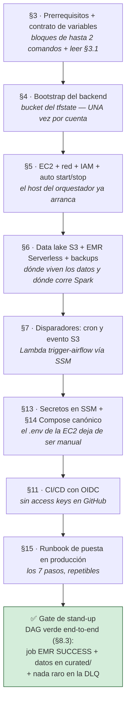
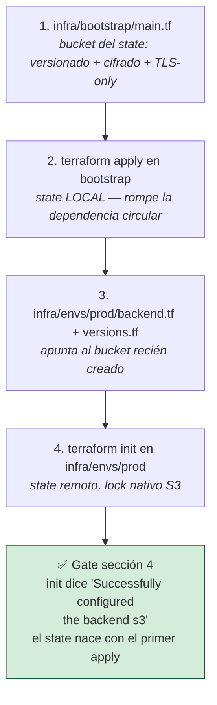
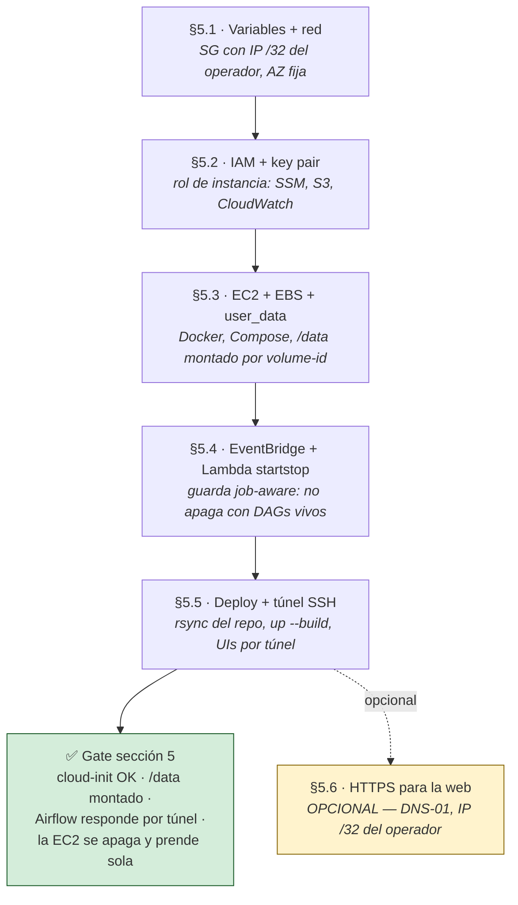
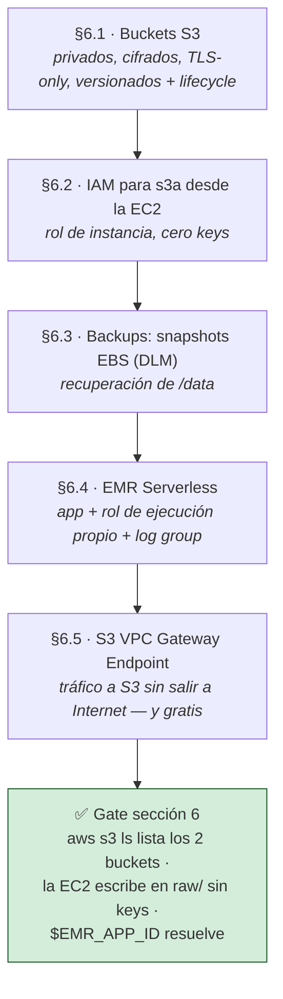
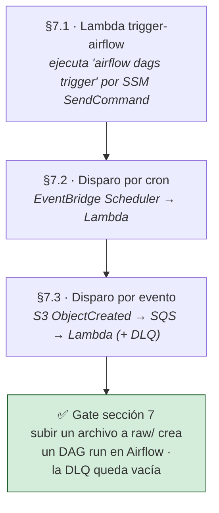
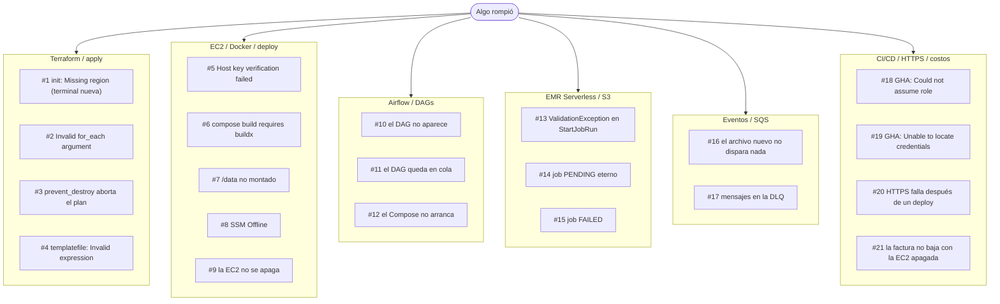
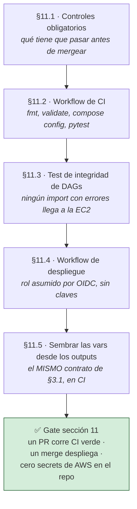
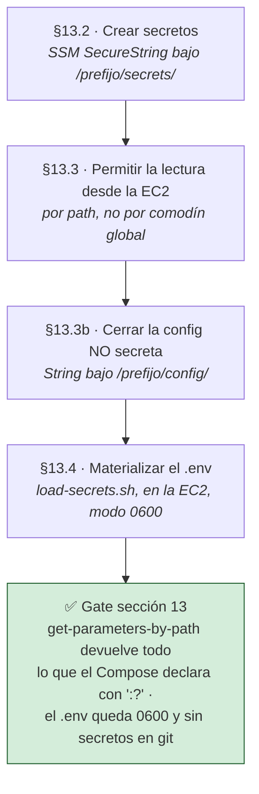
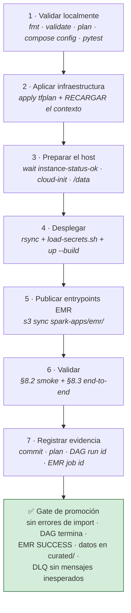
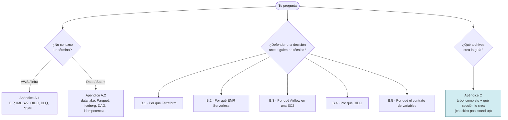

# Producción en AWS para DataOps — arquitectura de referencia

> [!CAUTION]
> **No ejecutable desde este checkout.** El árbol actual no contiene `infra/`, los scripts de
> producción, los Compose productivos ni los entrypoints de EMR que esta guía ilustra. Conservá este
> documento como diseño y referencia de implementación; no ejecutes sus `task`, `terraform`, `aws`
> ni comandos de despliegue hasta restaurar y validar esos artefactos en una rama de producción.

> [!WARNING]
> **Laboratorio controlado, no exposición productiva segura** ([ADR-002](adr/ADR-002-plano-de-control-single-node.md)). Airflow, Postgres y monitoreo comparten una EC2.
> Las UIs usan túnel SSH; §5.6 permite HTTPS únicamente desde la IP `/32` del operador.
> Para datos reales son obligatorias [§13](#13-hardening-y-secretos), [§18](#18-gobierno-resiliencia-y-costos) y un estándar de gobierno y operaciones formal.
> No incluye alta disponibilidad: la EC2 sigue siendo un punto único de fallo.

> Este tramo promueve a AWS el **contrato del orquestador** validado en [local](01-stack-local.md).
> Spark cambia de runtime: local usa 4.2.0 y `emr-7.13.0`, Spark 3.5.6; §6.4 prueba compatibilidad.
> Terraform se construye por módulos con state S3 bloqueado y apply incremental.
> La EC2 se apaga fuera de horario para que el costo siga al uso.

> [!IMPORTANT]
> **Estado: guía completa, sin desplegar de extremo a extremo en AWS.**
> Observabilidad, Iceberg, dbt, Great Expectations, OpenLineage y CD son arquitectura objetivo; consulte la [matriz de estado](README.md).
> El job EMR y la publicación son referencias incompletas: no se autorizan para datos reales hasta consumir el manifest inmutable y publicar después del gate.

> [!IMPORTANT]
> **Un comando por terminal, siempre el mismo.** Parado en la raíz del repo, antes de
> cualquier `terraform`, `aws`, `ssh` o `rsync` de este documento:
>
> ```bash
> source ./scripts/prod-env.sh   # EN TU MÁQUINA, una vez por terminal
> ```
>
> Convierte los outputs de Terraform en variables (`public_ip` → `$PUBLIC_IP`), y por
> eso ningún bloque de la guía lleva un ID, una IP ni un bucket escrito adentro.
> **Devuelve dos resultados según el estado de la infraestructura; ambos son válidos:**
>
> | Cuándo | Qué imprime | Qué significa |
> |---|---|---|
> | §1 a §5.1, antes del primer `apply` del entorno | `contexto parcial — …` (no existe la carpeta, falta el `init`, o el state no publicó outputs) | **Esperado, no es un fallo**: no hay nada que leer todavía. Los comandos de esas secciones (`aws sts`, `terraform init/apply`) no usan ninguna variable del contrato |
> | Desde el `apply` de [§5.1](#51-variables-y-red) | `Contexto de producción … lectura fresca del state` | El contexto real **crece con cada sección**; todo recurso aún no aplicado aparece como `— (sin definir aún)` |
>
> Después de un `apply` con outputs, ejecute `PROD_ENV_REFRESH=1 source ./scripts/prod-env.sh`.
> El cargador cachea 15 minutos; un nombre vacío indica terminal sin contexto o caché vieja.
> El contrato completo está en [§3.1](#31-contrato-de-variables-de-entorno-léalo-antes-de-copiar-cualquier-comando).

**Arquitectura — solo lectura.** Una **EC2 `t3.large`** con Elastic IP ejecuta en Docker el orquestador (**Airflow 3** + **Postgres**) y, opcionalmente, el monitoreo.
El **cómputo Spark** vive en **EMR Serverless**, escala a cero y usa su propio rol; el **data lake** es S3 (`raw/` → `curated/`).
**Lambda `trigger-airflow`** dispara DAGs vía SSM por cron o eventos S3/SQS; **Lambda `startstop`** apaga la EC2 sin cortar DAGs.
**DLM** respalda el EBS, **Athena** ofrece SQL y **GitHub Actions con OIDC** valida y despliega sin access keys.

Regla mental: **almacenar es barato y constante; computar es lo que cuesta, y solo
durante la ejecución.** Por eso Spark vive en EMR Serverless, la EC2 se apaga fuera de
horario y el data lake vive en S3. **~$35/mes** con auto start/stop 8h×22d
(~$83/mes si permanece encendida 24/7) — el desglose está en [§2](#2-costo).

## Cómo leer esta guía

**Cada bloque indica dónde se ejecuta.** Respete ese contexto: existen exactamente tres y no son
intercambiables.

| Contexto | Qué es | Cómo lo marca esta guía |
|---|---|---|
| **Local** | Equipo del operador, ubicado en la raíz del repositorio, con credenciales AWS y el contexto cargado | Una línea `**Dónde:** terminal local` o un comentario `# EN TU MÁQUINA`. Es el contexto predeterminado si el bloque no indica otro |
| **En la EC2** | Dentro de la instancia: mediante `ssh`, `$SSH "$SSH_TARGET" "..."` o SSM. Allí no existen `terraform` ni el perfil AWS local: las credenciales provienen del **rol de instancia** mediante IMDSv2 | Un comentario `# EN LA EC2` o el comando remoto que encapsula la ejecución |
| **En CI** | GitHub Actions, con el rol asumido por OIDC | El bloque es un `.yml` de workflow (§11) |

No es cosmético: local comprueba que el recurso **existe**; CI comprueba que el **rol OIDC tiene permiso**.
No copie bloques de CI en una terminal local: las credenciales administrativas pueden ocultar
permisos faltantes del rol real.

**Cuatro reglas que rigen todo el documento:**

1. **Terraform es la fuente de verdad.** Nada a mano en la consola: el próximo `apply`
   revierte el cambio en silencio. Si el recurso ya se creó manualmente, ejecute `terraform import` antes
   del siguiente apply. Los desplegables «🖱️ A mano en la consola AWS» y la
   camino equivalente por consola (retirado de este checkout) sirve para entender qué crea
   cada bloque, no para mezclar los dos caminos sobre el mismo recurso.
2. **Los comandos no se editan.** IDs, IPs, cuentas y buckets salen de variables ([§3.1](#31-contrato-de-variables-de-entorno-léalo-antes-de-copiar-cualquier-comando)).
   Un `<valor>` representa únicamente una decisión humana, como un dominio o job id.
   Cambie `pyspark-stack` únicamente mediante `var.name_prefix`. Los validadores sostienen el contrato.
3. **El orden de las secciones representa las dependencias reales.** §4 crea el bucket del
   state, §5 la EC2 que §6 y §7 necesitan, §13 publica en SSM lo que §14 consume al
   arrancar. Omitirlo provoca fallos tardíos y poco descriptivos: un `$EMR_APP_ID` vacío genera
   un `ValidationException` de la API, no «falta aplicar §6.4».
4. **Las decisiones ya están tomadas.** El *por qué* de la topología y de lo que quedó
   afuera vive en [`docs/03-arquitectura.md`](03-arquitectura.md) y, con sus
   alternativas descartadas, en los [ADR](adr/README.md). Cambiar una implica
   reescribir secciones, no parchear un bloque.

> **Qué existe en el repositorio y qué debe crear el operador.** Hay un proyecto local y una
> composición Terraform parcial. El resto de producción se crea desde esta guía:
>
> | Ruta | Estado | Acción requerida |
> |---|---|---|
> | `infra/bootstrap/`, `infra/envs/prod/`, módulos `network` y `orchestrator` | **existen parcialmente** | Validar y revisar; no equivalen a un entorno desplegado |
> | Módulos storage, EMR, Lambdas, gobierno y demás producción | **por crear** | **Escribirlos**, probarlos y revisarlos antes de desplegar |
> | `Taskfile.yml` | **existe**, con el resultado final | Usarlo directamente; los bloques de §3.0b, §5.5, §6.4, §8, §10.1, §13.4 y §15 muestran cómo crece por etapas |
> | `Dockerfile.airflow.prod` | **por crear** | **Pegarlo** de [§5.5](#55-desplegar-subir-código-y-túnel-ssh) |
> | `docker-compose.prod.yml` (+ `.https.yml`, + `.monitoring.yml`) | **por crear** | **Pegarlo** de [§14.1](#141-docker-composeprodyml--base), [§5.6](#56-exponer-la-web-de-airflow-https-nativo-acceso-desde-la-ip-del-operador) y [§14.2](#142-docker-composeprodmonitoringyml--override-de-observabilidad) |
> | `scripts/load-secrets.sh`, `scripts/update-sg-ip.sh` | **por crear** | **Pegarlo** de [§13.4](#134-materializar-env) y [§5.1](#51-variables-y-red) |
> | `monitoring/` (Prometheus, Grafana, Alertmanager, Loki) | **por crear** | **Pegarlo** de [§12.2](#122-prometheus) y §14.2 — es *roadmap*, no bloquea el primer despliegue |
> | `dags/customer_etl_emr_dag.py`, `spark-apps/emr/` | **por crear** | **Pegarlo** de [§6.6](#66-dag-ejecutable-de-referencia) y [§6.4](#64-cómputo-spark-emr-serverless) |
> | `.github/workflows/` | **por crear** | **Pegarlo** en [§11](#11-cicd-con-github-actions-y-oidc) |
>
> Ya existen y no se modifican: `scripts/prod-env.sh`, los dos validadores y el stack local.
> Incluye Compose, Dockerfiles, Hadoop, DAGs, jobs, notebooks y `tests/test_dag_integrity.py`.
>
> Corolario: `task infra:validate` sólo comprueba el HCL que ya existe; no valida módulos que siguen
> siendo texto en esta guía. Los validadores documentales comprueban referencias y comandos, no la
> conducta real de AWS.

> [!IMPORTANT]
> **Gate de entrada:** no inicie el Tramo II sin el stack local en estado correcto:
> `task local:up` sano ([`01-stack-local.md`](01-stack-local.md)), `task test` en verde y una
> ejecución local completa ([`04-dataops-local.md`](04-dataops-local.md)).
> Diagnosticar un DAG con errores en AWS consume tiempo de EMR y es más lento que hacerlo en Docker.

## Índice

Cada tramo usa lo que dejó el anterior; dentro de cada uno, las secciones se leen en orden.

**1 · Fundamentos — LEER (~15 min).** Arquitectura, costo y contrato de variables. §3.1
define de dónde sale cada valor de cada comando.

1. [Panorama de la arquitectura](#1-panorama-de-la-arquitectura) · [1.1 Ciclo de vida: los 4 modos](#11-ciclo-de-vida-los-4-modos)
2. [Costo](#2-costo)
3. [Prerrequisitos](#3-prerrequisitos) · [3.1 Contrato de variables de entorno](#31-contrato-de-variables-de-entorno-léalo-antes-de-copiar-cualquier-comando)
4. [Fundamentos: backend Terraform](#4-fundamentos-backend-terraform)

**2 · Núcleo — ESCRIBIR Y APLICAR.** El primer `apply` que crea infraestructura.

5. [Núcleo: EC2 con Docker](#5-núcleo-ec2-con-docker) — [5.1 Variables y red](#51-variables-y-red) · [5.2 IAM + key pair](#52-iam--key-pair) · [5.3 EC2 + EBS + user_data](#53-ec2--ebs--user_data) · [5.4 EventBridge + Lambda startstop](#54-automatización-eventbridge--lambda) · [5.5 Deploy y túnel SSH](#55-desplegar-subir-código-y-túnel-ssh) · [5.6 HTTPS para la web](#56-exponer-la-web-de-airflow-https-nativo-acceso-desde-la-ip-del-operador)

**3 · Datos y cómputo — ESCRIBIR Y APLICAR.** S3, EMR Serverless y disparadores, una vez
que la EC2 arranca.

6. [Data lake en S3](#6-data-lake-en-s3) — [6.1 Buckets](#61-buckets-s3) · [6.2 IAM para `s3a`](#62-iam-permitir-s3a-a-la-ec2-sin-keys) · [6.3 Backups](#63-backups-dump-postgresql--snapshots-ebs-dlm) · [6.4 EMR Serverless](#64-cómputo-spark-emr-serverless) · [6.5 VPC Endpoint](#65-s3-vpc-gateway-endpoint) · [6.6 DAG ejecutable](#66-dag-ejecutable-de-referencia)
7. [Orquestación por cron y por evento](#7-orquestación-lambda-trigger-airflow-ssm--eventbridge--event-driven) — [7.1 Lambda `trigger-airflow`](#71-lambda-que-dispara-los-dags-vía-ssm) · [7.2 Disparo por cron](#72-disparo-por-cron-eventbridge-scheduler) · [7.3 Disparo por evento S3](#73-disparo-por-evento-archivo-nuevo-en-s3-vía-sqs)

**4 · Operación — EJECUTAR.** El día a día y el punto de entrada después de cada `apply`.

8. [Operación diaria y diagnóstico](#8-operación-diaria-y-diagnóstico) — [8.4 Comandos del día a día](#84-comandos-de-operación-diaria) · [8.6 Diagnóstico rápido](#86-diagnóstico-rápido)
9. [Patrones de tareas DataOps](#9-patrones-de-tareas-dataops) — [9.2 Contrato mínimo de un DAG](#92-contrato-mínimo-de-un-dag-productivo) · [9.4 DAG de referencia para EMR](#94-dag-de-referencia-para-emr-serverless) · [9.5 Idempotencia](#95-idempotencia)
10. [Flujo de desarrollo y despliegue](#10-flujo-de-desarrollo-y-despliegue)

**5 · Entrega — EJECUTAR antes del primer despliegue formal.** §12 es *roadmap*; §13 es
obligatoria si el stack va a ver datos reales.

11. [CI/CD con GitHub Actions y OIDC](#11-cicd-con-github-actions-y-oidc) — [11.3 Test de integridad de DAGs](#113-test-de-integridad-de-dags) · [11.4 Workflow de despliegue](#114-workflow-de-despliegue) · [11.5 El mismo contrato en CI](#115-el-mismo-contrato-en-ci-sembrar-las-vars-desde-los-outputs)
12. [Observabilidad e incidentes](#12-observabilidad-e-incidentes) — [12.2 Prometheus](#122-prometheus)
13. [Hardening y secretos](#13-hardening-y-secretos) — [13.4 Materializar `.env`](#134-materializar-env)
14. [Compose canónico de producción](#14-compose-canónico-de-producción) — [14.1 Base](#141-docker-composeprodyml--base) · [14.2 Override de observabilidad](#142-docker-composeprodmonitoringyml--override-de-observabilidad)
15. [Runbook de puesta en producción](#15-runbook-de-puesta-en-producción)

**6 · Evolución — CONSULTAR cuando haga falta.** No se lee de corrido; lo marcado
*roadmap* es diseño, no runbook.

16. [Athena e Iceberg](#16-athena-e-iceberg) — [16.3 Mantenimiento Iceberg](#163-mantenimiento-iceberg)
17. [Qué motor usar para cada tarea](#17-qué-motor-usar-para-cada-tarea)
18. [Gobierno, resiliencia y costos](#18-gobierno-resiliencia-y-costos) — [18.1 DLQ según el origen](#181-dlq-según-el-origen) · [18.3 Budget](#183-budget)
19. [Transformaciones con dbt](#19-transformaciones-con-dbt)
20. [Calidad de datos](#20-calidad-de-datos)
21. [Control de cambios y límites](#21-control-de-cambios-y-límites) — [21.1 Límites aceptados](#211-límites-aceptados) · [21.4 Teardown](#214-teardown)
22. [Lineage con OpenLineage](#22-lineage-con-openlineage)

[Apéndices](#apéndices): [A · Glosario](#apéndice-a--glosario) · [B · Por qué cada herramienta](#apéndice-b--por-qué-cada-herramienta-lectura-opcional) · [C · Mapa de archivos](#apéndice-c--mapa-de-archivos-que-crea-la-guía) · [Referencias oficiales](#referencias-operativas-oficiales)

---

## 1. Panorama de la arquitectura

> **LEER, ~10 min.** Resultado: mapa de ejecución y modo actual del ciclo de vida
> (en la primera implementación, STAND-UP).

La topología completa. El detalle conceptual y los diagramas están en
[`docs/03-arquitectura.md`](03-arquitectura.md); esta guía es el cómo.

```text
                    ┌──────────── EC2 t3.large (Elastic IP) ─────────────────┐
 EventBridge  ──►   │  docker compose (solo ORQUESTADOR, casi idle):          │
  · cron ETL        │   Airflow (5) + Postgres                                │
  · start/stop  ──► │   MONITOREO: Prometheus · Grafana · Alertmanager · Loki │
      │             └───────┬───────────────┬──────────────────┬─────────────┘
      ▼                     │ StartJobRun    │ s3a:// (rol IAM)  │ /data (EBS gp3)
  Lambda trigger-airflow    ▼                ▼                   ▼
  Lambda startstop   ┌──────────────┐  ┌────────────────┐  (snapshots EBS · DLM)
                     │ EMR          │  │ S3 data lake   │  ◄── ObjectCreated raw/ ──►
                     │ Serverless   │─►│ raw/curated/…  │        Lambda trigger-airflow
                     │ (Spark)      │  └────────────────┘
                     └──────────────┘
```

Airflow (en la EC2) dispara cada job Spark con `EmrServerlessStartJobOperator` y lo pollea con
`EmrServerlessJobSensor`; EMR Serverless lee/escribe `s3a://` con **su propio** rol de ejecución.
La EC2 nunca corre Spark: solo orquesta.

### 1.1 Ciclo de vida: los 4 modos

El sistema tiene 4 modos. Cada uno responde a una pregunta concreta, y saber en cuál
determina qué comandos corresponden:

| Modo | Pregunta que responde | Tiempo | Costo después |
|---|---|---|---|
| **STAND-UP** | «Es la primera vez, parto de cero» | 3–4 h | ~$35/mes (operando) |
| **OPERACIÓN** | «Ya está construido, lo uso día a día» | — | ~$35/mes |
| **PAUSA LARGA** | «No lo voy a usar por semanas, pero no quiero perder nada» | 5 min | ~$14/mes (EBS + snapshots + EIP + S3) |
| **TEARDOWN** | «Terminé el proyecto, que no facture nada» | 30–45 min | $0/mes |

```text
                          stand-up (§4 → §15)
            (vacío) ─────────────────────────► OPERANDO (~$35/mes)
                                                  │  ▲
                                    stop manual   │  │  start manual
                                     (§8.4)       │  │   (§8.4)
                                                  ▼  │
                                              PAUSADO (~$14/mes)
                                                  │
                                             teardown (§21.4)
                                                  │
                                                  ▼
                                              (vacío)
```

**OPERANDO ↔ PAUSADO no tiene procedimiento**: es el mismo `stop`/`start` que la Lambda
de [§5.4](#54-automatización-eventbridge--lambda) hace sola todos los días. El EBS `/data`
conserva Postgres y la metadata de Airflow, la EIP conserva la dirección y S3 el data
lake: nada que migrar ni exportar.

> **Regla de oro**: pausar es reversible; **teardown NO** — destruye el EBS de datos,
> vacía los buckets con versionado y borra el backend del state. Por eso está sin
> automatizar ([§21.4](#214-teardown)).

#### El camino del STAND-UP

Este es el único objetivo de la primera ejecución. Los otros tres modos corresponden a operación
([§8.4](#84-comandos-de-operación-diaria), [§21.4](#214-teardown)).



**Tiempo total**: 3–4 h la primera vez, con §3 OK y el stack local probado. Casi todo es
copy-paste y esperas de AWS.

#### Acciones excluidas del stand-up

- **Observabilidad** (§12, §14.2): *roadmap*. El stack arranca sin `monitoring/`.
- **Iceberg, dbt, Great Expectations, OpenLineage** (§16, §19, §20, §22): diseño, no
  runbook. El job de referencia escribe Parquet.
- **HTTPS público** ([§5.6](#56-exponer-la-web-de-airflow-https-nativo-acceso-desde-la-ip-del-operador)):
  opcional. Con `airflow_domain = ""` las UIs van por túnel SSH, que es el default.
- **Alta disponibilidad**: fuera de alcance ([§21.1](#211-límites-aceptados)).

---

## 2. Costo

> **LEER, ~5 min.** Resultado: costo estimado y palancas que lo modifican.

Las decisiones de §5–§7 (tamaño de la EC2, EMR Serverless en vez de cluster, EIP, `gp3`)
salen de esta tabla.

> Precios aproximados de us-east-1 (on-demand), estimados en julio de 2026. Valide en
> [calculator.aws](https://calculator.aws). Escenario **real**: ~2 GB/día, 3 corridas/semana
> (≈13/mes) de Spark en EMR Serverless, con ~50 GB acumulados en el data lake.

| Ítem | US$/mes (auto start/stop 8h×22d) |
|---|---|
| EC2 `t3.large` (Airflow + Postgres + monitoreo) | ~12 |
| EMR Serverless (pago por uso, ~13 corridas/mes) | ~9 |
| EBS gp3 (root 40 + data 30) + snapshots DLM | ~9 |
| S3 data lake (~50 GB) + requests | ~1.5 |
| IPv4 pública (EIP; AWS la cobra desde feb-2024, asociada o no) | ~3.6 |
| Lambda + EventBridge + SSM | ~0 (free tier) |
| **Total** | **~35/mes** |

La `t3.large` (2 vCPU/8 GB) alcanza porque no corre Spark: queda casi idle entre corridas.
EMR Serverless ejecuta el cómputo pesado y escala a cero. **Variante 24/7**: ~**$83/mes**.
Con menor volumen, EMR ronda ~$5 → ~**$31** / ~**$79**. El monitoreo comparte la EC2.

### Self-managed vs managed: ¿cuándo cada uno?

Comparación aproximada (us-east-1, datos chicos, ~20 tareas/día):

| Opción | Cómo cobra | ~US$/mes a esta escala | Ops | Cuándo gana |
|---|---|---|---|---|
| **EMR Serverless** (este stack, cómputo) | vCPU-seg + GB-seg, escala a cero | ~9 (+ S3) | AWS | **Spark pequeño o esporádico con operación mínima → opción elegida** |
| **Airflow en EC2 pequeña** (este stack, orquestación) | tiempo encendido (flat) | ~12 (~35 total) | Equipo | orquestador liviano y portable, sin lock-in |
| **Spark self-managed en EC2** (una instancia grande) | tiempo encendido (flat) | ~34 compute | Equipo | consolidar cargas Spark sostenidas en una instancia ya contratada; HDFS real |
| **Glue Spark** | DPU-hora (mín 2 DPU + 1 min por corrida) | ~44 | AWS | pocos jobs/día, ecosistema Glue |
| **EMR on EC2** (clásico) | fleet EC2 + ~25% recargo | ~120–160 | Equipo (clúster) | TB sostenidos, multi-nodo |
| **MWAA** (solo orquestación) | entorno siempre encendido | ~350+ | AWS | evitar a esta escala |

Regla: **uso bajo o esporádico + mínima ops → serverless**, con Airflow en una EC2 pequeña.
**Spark sostenido muchas horas → self-managed** en una instancia ya pagada, con HDFS real.
Glue paga mínimos de 2 DPU y 1 minuto; EMR on EC2 y MWAA están sobredimensionados a esta escala.

---

## 3. Prerrequisitos

> **EJECUTAR (~5 min) + LEER §3.1 (~10 min).** Resultado: herramientas y origen de valores verificados.
> [§3.1](#31-contrato-de-variables-de-entorno-léalo-antes-de-copiar-cualquier-comando) es obligatorio:
> omitirlo produce variables vacías y errores tardíos como `ValidationException`.

Se asume una cuenta AWS con permisos sobre EC2, S3, IAM, Lambda, EventBridge y EMR Serverless.
Primero confirme la identidad y la versión de Terraform:

```bash
aws configure && aws sts get-caller-identity   # credenciales con permisos EC2/S3/IAM/Lambda...
terraform -version                             # >= 1.10 (el backend usa use_lockfile, §4)
```

Después verifique las herramientas auxiliares:

```bash
jq --version                                   # lo usan los bloques que arman JSON y leen outputs
task --version                                 # go-task: el orquestador de §3.0b — taskfile.dev
```

Cree la clave únicamente si todavía no existe:

```bash
ssh-keygen -t ed25519 -f ~/.ssh/pyspark_stack -C "pyspark_stack"   # solo si no existe el par
```

### 3.0 Estructura de infraestructura: composición y módulos

La infra es una **composición**: `infra/envs/prod/` no declara un solo `resource` — instancia
módulos y conecta sus salidas. Cada módulo de `infra/modules/` es una unidad encapsulada con
interfaz pública (`variables.tf` de entrada, `outputs.tf` de salida).

```text
infra/
├── bootstrap/                          # crea una sola vez el bucket del backend; state LOCAL
│   └── main.tf                         # §4
├── envs/
│   └── prod/                           # la COMPOSICIÓN: un backend, un state, cero resources
│       ├── versions.tf                 # §4  — required_version + providers + default_tags
│       ├── backend.tf                  # §4  — S3 + use_lockfile
│       ├── variables.tf                # §4 nace con aws_region; §5.1 agrega las demás entradas
│       ├── terraform.tfvars            # §5.1 — valores locales (NO se versiona)
│       ├── main.tf                     # crece: un bloque module "X" por sección
│       └── outputs.tf                  # el contrato de §3.1, siempre module.X.algo
├── modules/                            # unidades encapsuladas; no conocen el entorno consumidor
│   ├── _shared/                        # §5.2 — trust policies JSON que comparten los módulos
│   ├── network/                        # §5.1 + §6.5 — SG, subnet/AZ, VPC endpoint de S3
│   ├── orchestrator/                   # §5.2 + §5.3 — key pair, rol de instancia, EC2 + EBS + EIP
│   │   └── user_data.sh.tftpl
│   ├── scheduler/                      # §5.4 — Lambda startstop + reglas de EventBridge
│   ├── https/                          # §5.6 — OPCIONAL: Route 53 + permiso DNS-01 de certbot
│   │   └── policies/route53-certbot.json.tftpl
│   ├── storage/                        # §6.1 + §6.2 — buckets del lake y permiso s3a de la EC2
│   ├── backups/                        # §6.3 — DLM: snapshots del EBS de datos
│   ├── emr/                            # §6.4 — app EMR Serverless + rol de ejecución del job
│   ├── triggers/                       # §7 — Lambda trigger-airflow, cron y evento S3 (SQS)
│   ├── secrets/                        # §13 — parámetros SSM y su permiso de lectura
│   ├── cicd/                           # §11 — OIDC + rol de despliegue de GitHub Actions
│   ├── athena/                         # §16 — workgroup de consumo SQL
│   └── governance/                     # §18 — presupuesto, anomalías de costo y alarmas de DLQ
└── lambdas/                            # el código Python, fuera de los módulos que lo empaquetan
    ├── startstop.py                    # §5.4
    └── trigger_airflow.py              # §7.1
```

**Cree el esqueleto vacío** y complete un módulo por vez:

```bash
for d in infra/bootstrap infra/envs/prod infra/lambdas \
         infra/modules/{_shared,network,orchestrator,scheduler,https/policies,storage,backups,emr,triggers,secrets,cicd,athena,governance}; do
  mkdir -p "$d"
done
find infra -type d | sort
```

<details>
<summary><strong>Por qué módulos y no veinte <code>.tf</code> en una sola carpeta</strong> (opcional)</summary>

Un módulo raíz plano funciona hasta que crece: namespace compartido, cualquier `resource`
referenciando a cualquier otro sin declararlo. Con composición:

- **El acoplamiento es visible.** Que EMR sea invocable desde la EC2 no es un
  `aws_iam_role_policy` perdido en un `iam.tf` de 400 líneas: es `module.emr` recibiendo
  `instance_role_name = module.orchestrator.instance_role_name`, en una línea que se lee.
- **El radio de cambio se reduce.** Un cambio en `modules/triggers/` limita el plan a ese módulo.
- **El entorno se clona.** Un `envs/dev/` es copiar `envs/prod/` y cambiar `terraform.tfvars`.

El costo: tres archivos por módulo en vez de uno, y todo valor que cruza una frontera se
declara `variable` de un lado y `output` del otro. A cambio, §18 sigue siendo copy-paste
igual que §5.

</details>

**El bucle de trabajo, idéntico de §5 a §18** — cuatro pasos:

| Paso | Acción | Herramienta |
|---|---|---|
| 1 | Cree `variables.tf`, `main.tf` y `outputs.tf` del módulo | Bloques de la sección |
| 2 | **Valide el módulo aislado**, sin backend ni credenciales | `terraform -chdir=infra/modules/<mod> init -backend=false && terraform -chdir=infra/modules/<mod> validate` |
| 3 | Agregue `module "<mod>"` al final de `envs/prod/main.tf` | Bloque «Componer» de la sección |
| 4 | Aplique **solo ese módulo** y verifique el checkpoint | `terraform -chdir=infra/envs/prod apply -target=module.<mod>` |

Validar el módulo primero atrapa errores antes del `apply`; aplicarlo por separado localiza el fallo.
El [Taskfile de §3.0b](#30b-el-orquestador-de-comandos-taskfileyml) reduce el ciclo a **dos comandos** iguales en cada sección.

```text
task infra:validate MODULE="<mod>"   # paso 2: valida el módulo aislado
task infra:apply    MODULE="<mod>"   # paso 4: apply -target de ese módulo
```

**Cuando un módulo falla a mitad del apply**, Terraform no hace rollback: lo que se creó,
queda. Los cinco modos de falla — ninguno se arregla borrando el state:

| Síntoma | Causa probable | Acción correctiva |
|---|---|---|
| `Error: Unsupported attribute: module.X has no output "y"` | El módulo se compuso antes de agregar `outputs.tf` | Agregue `outputs.tf` al módulo y repita el `apply`; no modifique la composición |
| `Error acquiring the state lock` | Otro `apply` está activo o terminó sin liberar el lock | Confirme que no existe otro proceso y ejecute `terraform -chdir=infra/envs/prod force-unlock <LOCK_ID>` |
| El apply crea **más** recursos de los esperados | `-target` incluyó una dependencia todavía no aplicada | Es correcto si el plan coincide con el grafo; revíselo antes de confirmar |
| `EntityAlreadyExists` / `BucketAlreadyExists` | El recurso existe en AWS pero no en el state | Importe el recurso a su address de módulo antes de aplicar; no elimine recursos que contengan datos |
| El apply termina OK pero `output` no devuelve nada | El output existe en el módulo, pero no en `envs/prod/outputs.tf` | Publique el output en el entorno, como indica §3.1 |

> **`-target` es un andamio, no una forma de operar.** Un plan con `-target` es parcial por
> definición: sirve para levantar el stack por capas la primera vez y para aislar un error.
> Con todo arriba, **todo cambio va por `plan`/`apply` completos** (§15, §21.2). Usarlo
> para evitar cambios no comprendidos indica que el plan completo todavía no está listo para aprobarse.

> El árbol de arriba es el resultado final: cada módulo aparece cuando su sección lo crea.
> `bootstrap` corre una vez y tiene state local; todo lo demás vive en **un solo backend y
> un solo state**, el de `infra/envs/prod`.

### 3.0b El orquestador de comandos: `Taskfile.yml`

El bucle de §3.0 se repite catorce veces, el deploy otras tantas y el runbook de §15 los
encadena. Escritos a mano serían catorce copias divergiendo, más una quinceava en el CI
(§11.2). Se definen **una sola vez**: el operador y CI ejecutan la misma task.

El archivo versionado ya contiene el resultado final: tasks locales y productivas. La tabla de
La tabla indica en qué etapa nace cada bloque y su dependencia; si se parte del repositorio,
no debe agregarlo nuevamente. `check-doc-env.py` evita divergencias entre la guía y el archivo.

| Bloque incremental | Se incorpora en | Consumidor |
|---|---|---|
| `vars:` + `infra:*` (7 tasks) | **en esta guía** | §4 en adelante |
| `prod:trust-host` · `prod:wait` · `prod:deploy` · `prod:tunnel` | [§5.5](#55-desplegar-subir-código-y-túnel-ssh) | §5.5, §15 |
| `emr:sync` | [§6.4](#64-cómputo-spark-emr-serverless) | §6.4, §15 |
| `prod:status` · `prod:smoke` · `prod:e2e` · `prod:logs` | [§8](#8-operación-diaria-y-diagnóstico) | operación diaria |
| `dev:sync` | [§10.1](#101-iteración-rápida) | iteración de DAGs |
| `prod:secrets` | [§13.4](#134-materializar-env) | materialización; la rotación coordinada está en §13.4.1 |
| `release:check` · `release:apply` · `release:deploy` | [§15](#15-runbook-de-puesta-en-producción) | cada promoción |

Requiere [go-task](https://taskfile.dev/installation/), incluido en el bloque de §3.

**1 — las tres variables** del bloque `vars:`:

```yaml
vars:
  ENV_DIR: infra/envs/prod
  MODULES: infra/modules
  CTX: 'set -a; source ./scripts/prod-env.sh >/dev/null; set +a;'   # el subshell no hereda el contexto
```

**2 — las tasks de infraestructura** dentro de `tasks:`:

```yaml
  # ── infraestructura ──────────────────────────────────────────────────────────

  infra:bootstrap:
    desc: "§4 — crea el bucket del state. State local, una vez por cuenta"
    cmds:
      - terraform -chdir=infra/bootstrap init
      - terraform -chdir=infra/bootstrap apply

  infra:fmt:
    desc: "Formatea infra/ (lo que infra:validate solo verifica)"
    cmds:
      - terraform fmt -recursive infra/

  infra:validate:
    desc: "fmt -check + validate de los módulos y del entorno. MODULE=<n> acota. Sin credenciales"
    cmds:
      - terraform fmt -check -recursive infra/
      - |
        # Solo los módulos que ya tienen .tf: §3.0 crea los 13 directorios de una vez.
        for m in $(if [ -n "{{.MODULE}}" ]; then
                     for x in {{.MODULE}}; do echo "{{.MODULES}}/$x"; done
                   else echo {{.MODULES}}/*; fi); do
          if ! ls "$m"/*.tf >/dev/null 2>&1; then
            # Vacío sin MODULE: aún no está implementado. Vacío CON MODULE: nombre incorrecto.
            [ -z "{{.MODULE}}" ] || { echo "sin .tf en $m — ¿el nombre está bien escrito?" >&2; exit 1; }
            continue
          fi
          terraform -chdir="$m" init -backend=false -input=false >/dev/null
          terraform -chdir="$m" validate || exit 1
        done
      - |
        # Las trust policies de §5.2 son JSON suelto: terraform no las mira.
        for f in {{.MODULES}}/_shared/*.json; do
          [ -e "$f" ] || continue
          jq -e . "$f" >/dev/null
        done
      - |
        # La composición, en cuanto exista.
        [ -f {{.ENV_DIR}}/main.tf ] || exit 0
        terraform -chdir={{.ENV_DIR}} init -backend=false -input=false >/dev/null
        terraform -chdir={{.ENV_DIR}} validate

  infra:init:
    desc: "init contra el backend S3. Hace falta tras componer un módulo nuevo"
    cmds:
      - terraform -chdir={{.ENV_DIR}} init

  infra:plan:
    desc: "Plan completo guardado en tfplan. Es el que se revisa antes de aplicar"
    deps: [infra:init]
    cmds:
      - terraform -chdir={{.ENV_DIR}} plan -out=tfplan
      - terraform -chdir={{.ENV_DIR}} show tfplan

  infra:apply:
    desc: "Aplica. MODULE=<n> aplica solo ese módulo; acepta varios entre comillas"
    deps: [infra:init]
    cmds:
      - |
        if [ -n "{{.MODULE}}" ]; then
          targets=""
          for x in {{.MODULE}}; do targets="$targets -target=module.$x"; done
          terraform -chdir={{.ENV_DIR}} apply $targets
        else
          terraform -chdir={{.ENV_DIR}} apply
        fi

  infra:output:
    desc: "Todos los outputs. NAME=<output> devuelve uno solo, en crudo"
    cmds:
      - |
        if [ -n "{{.NAME}}" ]; then
          terraform -chdir={{.ENV_DIR}} output -raw {{.NAME}}
        else
          terraform -chdir={{.ENV_DIR}} output
        fi

```

> **Los bloques YAML de la guía son la fuente de verdad de las tasks de producción**; las
> locales viven solo en el archivo. Editar una sin la otra las hace divergir, y
> `check-doc-env.py` compara cada bloque contra `Taskfile.yml` en cada corrida.

Comprobalo ya: estas líneas corren sin credenciales AWS y sin un solo `.tf` escrito.

```bash
task --list          # las 7 de infra, junto a las locales que ya estaban
task doc:check       # una de las locales: los dos validadores de documentación
```

Con el esqueleto vacío, la validación debe terminar en cero sin tocar AWS:

```bash
task infra:validate
```

#### Convención utilizada desde este punto

Cada bloque ejecutable muestra **la task arriba** y el comando crudo en un desplegable «Qué
corre por dentro». La task es la interfaz operativa; el desplegable documenta su implementación
cuando sea necesario aislar manualmente un fallo.

Los bloques visibles tienen como máximo dos comandos y las explicaciones, cuatro líneas. Los
archivos completos, tablas y desplegables conservan el detalle técnico dentro de esta misma guía.

**Tres cosas que el Taskfile no hace, a propósito:**

- **No reemplaza `source ./scripts/prod-env.sh`.** Una task corre en un subshell: lee el
  contexto, no lo exporta a la terminal actual. Por eso `release:apply` solicita recargarlo.
- **No aplica sin revisión del plan.** El runbook se divide en tres tasks porque
  entre `release:check` y `release:apply` existe una aprobación humana. Una task única de despliegue
  reduciría la aprobación a una confirmación mecánica y permitiría reemplazar una instancia por error.
- **No oculta el comando.** Si la task falla, el operador puede ejecutar el comando interno
  sin leer el YAML.

**Mantenimiento: la sección que enseña una operación repetible es la dueña de su task.** Un
comando que aparece dos veces en la guía y no está en el Taskfile es una copia esperando a
divergir.

---

### 3.1 Contrato de variables de entorno (léalo antes de copiar cualquier comando)

Ningún comando lleva un ID, IP, account id o bucket escrito a mano: todos leen variables de **Terraform**.
Un `i-0abc…` caduca al recrear la instancia; un placeholder puede ejecutar contra el lugar equivocado.
Con este contrato, el mismo bloque funciona en otra cuenta, región o `name_prefix` sin editarlo.

**Regla:** *si AWS o Terraform determinan un valor, publíquelo como `output`; si depende del
entorno local, defina un valor predeterminado que el cargador permita sobrescribir.*

#### La cadena completa

```text
recurso .tf  ──►  output en outputs.tf  ──►  scripts/prod-env.sh  ──►  $VARIABLE en el comando
 (§5…§18)          nombre snake_case          exporta TODO           copy-paste sin editar
                                              en MAYÚSCULAS
```

#### Las tres fuentes y la acción requerida

Ningún bloque de este documento vuelve a calcular lo que un paso anterior ya dejó resuelto:

| Fuente | Qué aporta | Acción requerida |
|---|---|---|
| `terraform output` (en `infra/envs/prod`) | **Fuente de verdad.** Recursos creados por la guía | Declare el output en la misma sección que crea el recurso |
| `scripts/prod-env.sh` | Exporta outputs en MAYÚSCULAS y deriva valores locales | Ejecute `source ./scripts/prod-env.sh` una vez por terminal; no edite el script |
| `.env` **en la EC2** | Lo que consume el Compose de producción dentro del host | **Nada.** Lo genera `scripts/load-secrets.sh` desde SSM ([§13.4](#134-materializar-env)). Editarlo a mano se pierde en el próximo deploy |

#### El cargador: `scripts/prod-env.sh`

**Ya está en el repo** y no se modifica: las secciones agregan outputs de Terraform, no código al cargador.
Su bucle exporta todo `terraform output -json`; un recurso nuevo queda disponible automáticamente.
Si `infra/envs/prod` aún no existe, informa `contexto parcial`, carga los valores locales y continúa.
El detalle está en [§5.5, Paso 0c](#55-desplegar-subir-código-y-túnel-ssh).

#### Escalabilidad: qué agregar y dónde cuando la infra crece

Es lo que hace que §18 siga siendo copy-paste igual que §5. Un recurso operable nuevo toca
**dos lugares y ninguno más**:

| Paso | Archivo | Elemento agregado | Ejemplo |
|---|---|---|---|
| 1 | `infra/modules/<mod>/main.tf` | el recurso | `aws_sqs_queue.trigger_events` (§7.3) |
| 2 | `infra/modules/<mod>/outputs.tf` | la salida del módulo | `output "sqs_trigger_queue_url" { value = aws_sqs_queue.trigger_events.url }` |
| 3 | `infra/envs/prod/outputs.tf` | **el mismo output, re-publicado por el entorno** | `output "sqs_trigger_queue_url" { value = module.triggers.sqs_trigger_queue_url }` |
| — | `scripts/prod-env.sh` | **nada**: el bucle lo exporta solo | queda disponible como `$SQS_TRIGGER_QUEUE_URL` |
| 4 | comando operativo | consume la variable | `aws sqs get-queue-attributes --queue-url "$SQS_TRIGGER_QUEUE_URL"` |

Cinco convenciones que evitan que esto se degrade:

- **`snake_case` en el output → `SCREAMING_SNAKE_CASE` en la shell.** Traducción mecánica.
- **Sufijo por tipo**: `_id`, `_arn`, `_name`, `_url`, `_uri` (S3), `_bucket`, `_ip`.
- **El output guarda el hecho; el cargador, la derivación.** `artifacts_bucket` es output;
  `s3://…/emr/logs` sale de `EMR_LOGS_URI` en el script. Un cambio de rutas toca un lugar.
- **Un output es una API, no documentación.** Renombrar = agregar el nuevo, migrar los usos,
  retire el anterior después de migrar todos los consumidores.
- **Nada de secretos en outputs**: van a SSM (§13); un output los deja en claro en el state.
- **La sección que crea el recurso agrega su output en el mismo `apply`.** Un output
  declarado más abajo que su primer uso deja la variable vacía al copiar el bloque, y
  `aws s3 cp … "s3:///raw/x"` no falla como un comando bien formado.

#### Ejemplo completo: agregar un recurso operable

El recorrido de la DLQ del trigger muestra las cuatro etapas. **No copie
nada de este ejemplo**; el código ejecutable vive en [§18.1](#181-dlq-según-el-origen):

```text
1. modules/triggers/main.tf     resource "aws_sqs_queue" "trigger_airflow_dlq" { ... }
                   └─ el recurso, en el módulo dueño de la cola primaria (§18.1)

2. modules/triggers/outputs.tf  output "sqs_trigger_dlq_url" { value = ....url }
   envs/prod/outputs.tf         output "sqs_trigger_dlq_url" { value = module.triggers.… }
                   └─ las dos, en la MISMA sección: nunca "para después"

3. terraform apply      +  PROD_ENV_REFRESH=1 source ./scripts/prod-env.sh
                   └─ apply publica el output; refresh lo carga en la terminal

4. aws sqs get-queue-attributes --queue-url "$SQS_TRIGGER_DLQ_URL" ...
                   └─ ya es usable, sin haber tocado prod-env.sh ni una línea
```

`PROD_ENV_REFRESH=1` en el paso 3 no es opcional: el cargador cachea el state 15 minutos y
sin él el paso 4 corre con la URL vacía. Por eso cada `apply` que agrega outputs va seguido
de un refresh en el bloque siguiente.

**Por qué no un `.env.prod` a mano**: es la misma trampa que el valor pegado, centralizada —
se desincroniza en silencio en cuanto Terraform recrea algo. El state ya es el inventario
real; `prod-env.sh` lo lee, no lo duplica. El único archivo a mano es
`infra/envs/prod/prod.env`, para los valores que Terraform no conoce (clave SSH y perfil local).

---

## 4. Fundamentos: backend Terraform

> **EJECUTAR, ~10 min. Una sola vez por cuenta AWS.** Resultado: bucket de `tfstate`
> creado, versionado y cifrado, y un `terraform init` que valida contra él.

### Mapa del camino — sección 4

**Prerrequisitos** (verificados en §3):

- `aws sts get-caller-identity` responde, y el `Account` es el de **producción**.
- `terraform -version` ≥ 1.10 — el backend usa `use_lockfile`, que no existe antes.
- La región está definida y no se cambiará durante el recorrido (mover un backend con
  state adentro es una migración, no un `apply`).



**Reglas de esta sección:**

- **El bootstrap tiene state LOCAL a propósito**: mover su state al bucket que él mismo crea
  es la dependencia circular que esta sección rompe.
- **No hay tabla DynamoDB** ([ADR-004](adr/ADR-004-backend-s3-con-use-lockfile.md)): el lock
  lo hace S3 con `use_lockfile` (un objeto `<key>.tflock` por *conditional write*). Agregarla
  es pagar por algo que ya no se usa.
- **El nombre del bucket lleva el account id adentro.** Los nombres son globales: sin el
  sufijo, el `apply` falla con `BucketAlreadyExists` contra el bucket de un desconocido.

> **Gotcha §4 — el bucket sobrevive al `destroy`.** `infra/bootstrap` se destruye al final de
> completo y solo con el bucket vacío. Si se invierte el orden, desaparece el state de
> `infra/envs/prod` y quedan recursos activos fuera del control de Terraform.

El backend S3 debe existir antes de que Terraform pueda almacenar allí su propio estado.
Se crea con un mini-Terraform de **state local**, una sola vez.

**`infra/bootstrap/main.tf`**:

```hcl
terraform {
  required_version = ">= 1.6"
  required_providers { aws = { source = "hashicorp/aws", version = "~> 5.0" } }
  # sin backend => state LOCAL (intencional: este stack crea el backend).
}
provider "aws" { region = "us-east-1" }

locals {
  state_bucket = "pyspark-stack-tfstate-tu-sufijo-2026"   # único global: reemplace "tu-sufijo"
}

resource "aws_s3_bucket" "tfstate" {
  bucket = local.state_bucket
  lifecycle { prevent_destroy = true }
}
resource "aws_s3_bucket_versioning" "tfstate" {
  bucket = aws_s3_bucket.tfstate.id
  versioning_configuration { status = "Enabled" }
}
resource "aws_s3_bucket_server_side_encryption_configuration" "tfstate" {
  bucket = aws_s3_bucket.tfstate.id
  rule {
    apply_server_side_encryption_by_default {
      sse_algorithm = "AES256"
    }
  }
}
resource "aws_s3_bucket_public_access_block" "tfstate" {
  bucket                  = aws_s3_bucket.tfstate.id
  block_public_acls       = true
  block_public_policy     = true
  ignore_public_acls      = true
  restrict_public_buckets = true
}

output "state_bucket" { value = local.state_bucket }
# El lock del state lo hace S3 nativamente (use_lockfile en el backend de abajo), con un objeto
# <key>.tflock por conditional write. Por eso no hay tabla DynamoDB: ya no hace falta.
```

```bash
task infra:bootstrap
```

<details>
<summary>Qué corre por dentro</summary>

```bash
terraform -chdir=infra/bootstrap init
terraform -chdir=infra/bootstrap apply
```

Es el único `chdir` de la guía que no apunta a `infra/envs/prod`: el bootstrap tiene su **propio
state, local**, y por eso no comparte ni el backend ni las tasks `infra:plan`/`infra:apply`.

</details>

> **`apply` sin `plan -out` solo durante la construcción (§4–§7)**: es interactivo, muestra
> el plan y todavía no hay datos que perder. Con el stack en producción, todo cambio pasa por
> `plan -out=tfplan` + `apply tfplan` (§15, §21.2), y el
> checklist de readiness externo exige esa evidencia.

<details>
<summary>🖱️ A mano en la consola AWS — backend del state (S3)</summary>

1. **S3 → Create bucket**: nombre `pyspark-stack-tfstate-<sufijo-único>`, región `us-east-1`.
   *Bucket Versioning*: **Enable** · *Default encryption*: SSE-S3/AES256 (viene por defecto) ·
   *Block Public Access*: las 4 casillas activadas (default).
2. Listo: el bloque `backend "s3"` de abajo apunta a este bucket por nombre. No hay que crear nada
   más — el lock lo maneja S3 con `use_lockfile`, sin tabla DynamoDB.

</details>

**Backend** — un solo state remoto para toda la infra de producción. Simplifica el copy-paste
a costa de agrandar el radio de cada `plan/apply`: por eso el state se versiona, se bloquea y
se revisa con `plan` antes de aplicar.

```hcl
# infra/envs/prod/backend.tf
terraform {
  backend "s3" {
    bucket         = "pyspark-stack-tfstate-tu-sufijo-2026"   # el mismo del bootstrap
    key            = "pyspark-stack-prod/terraform.tfstate"
    region         = "us-east-1"
    use_lockfile   = true   # lock nativo de S3 (conditional writes); reemplaza a dynamodb_table
    encrypt        = true
  }
}
```

**Versiones y provider** (`infra/envs/prod/versions.tf`). Va en el entorno, no en los módulos:
un módulo que fija su propio `provider` no se puede reutilizar en otra región ni otra cuenta.
Los módulos declaran los providers requeridos y heredan esta configuración:

Primero nace `infra/envs/prod/variables.tf`; sin esta declaración, el `init` siguiente falla
porque `versions.tf` referencia una variable que Terraform todavía no conoce:

```hcl
# infra/envs/prod/variables.tf
variable "aws_region" {
  type    = string
  default = "us-east-1"
}
```

```hcl
# infra/envs/prod/versions.tf
terraform {
  required_version = ">= 1.10"   # use_lockfile (backend.tf) no existe antes de 1.10
  required_providers {
    aws     = { source = "hashicorp/aws", version = "~> 5.0" }
    random  = { source = "hashicorp/random", version = "~> 3.0" }
    archive = { source = "hashicorp/archive", version = "~> 2.0" }  # para zippear la Lambda
  }
}
provider "aws" {
  region = var.aws_region
  default_tags {
    tags = { Project = "pyspark-stack", ManagedBy = "terraform", Env = "prod" }
  }
}
```

**La composición — `infra/envs/prod/main.tf`.** Cree **solo el esqueleto** con los dos `data` de
identidad de la cuenta. Es el único archivo de la guía que no se pega entero — crece
apendeando un `module "X"` por sección:

```hcl
# infra/envs/prod/main.tf
# Identidad de la cuenta: se resuelve una vez aquí y llega a los módulos como argumento explícito,
# en vez de que cada módulo repita el data source.
data "aws_caller_identity" "current" {}
data "aws_region" "current" {}

locals {
  account_id = data.aws_caller_identity.current.account_id
  region     = data.aws_region.current.name
}
```

| Bloque incremental | Se agrega en | Implementación del módulo |
|---|---|---|
| `module "network"` | [§5.1](#51-variables-y-red) | §5.1 (+ el endpoint de S3 en §6.5) |
| `module "orchestrator"` | [§5.3](#53-ec2--ebs--user_data) | §5.2 y §5.3 |
| `module "scheduler"` | [§5.4](#54-automatización-eventbridge--lambda) | §5.4 |
| `module "https"` (opcional) | [§5.6](#56-exponer-la-web-de-airflow-https-nativo-acceso-desde-la-ip-del-operador) | §5.6 |
| `module "storage"` | [§6.1](#61-buckets-s3) | §6.1 y §6.2 |
| `module "backups"` | [§6.3](#63-backups-dump-postgresql--snapshots-ebs-dlm) | §6.3 |
| `module "emr"` | [§6.4](#64-cómputo-spark-emr-serverless) | §6.4 |
| `module "triggers"` | [§7.1](#71-lambda-que-dispara-los-dags-vía-ssm) | §7.1–§7.3 |
| `module "cicd"` | [§11.4](#114-workflow-de-despliegue) | §11.4 |
| `module "secrets"` | [§13.3](#133-permitir-lectura-desde-ec2) | §13.3 |
| `module "athena"` | [§16.1](#161-workgroup) | §16.1 |
| `module "governance"` | [§18.3](#183-budget) | §18.3–§18.4 |

> **No agregue todos los módulos a la vez.** Cada `module "X"` referencia outputs anteriores;
> con módulos todavía vacíos, `validate` falla con
> *Unsupported attribute*.

```bash
# Verifique el bucket creado por bootstrap sin repetir su nombre.
TFSTATE_BUCKET="$(terraform -chdir=infra/bootstrap output -raw state_bucket)"
aws s3api head-bucket --bucket "$TFSTATE_BUCKET"                            # sin error = existe
```

```bash
# el backend responde y la composición (todavía sin módulos) inicializa
task infra:init
```

<details>
<summary>Qué corre por dentro</summary>

```bash
terraform -chdir=infra/envs/prod init
```

Debe indicar *«Successfully configured the backend "s3"»*. Repita `init` al agregar
un módulo nuevo: su `source` local se instala en el `init`, y sin eso el `plan` siguiente
falla con *Module not installed*.

</details>

✅ **Gate §4** — `init` configura el backend S3. Todavía no esperes un objeto `.tfstate`:
S3 lo recibe cuando el primer `apply` de §5.1 escribe estado remoto.

---

## 5. Núcleo: EC2 con Docker

> **ESCRIBIR y APLICAR, ~60–90 min.** Resultado: una EC2
> corriendo Airflow y Postgres en Docker, `/data` en un EBS aparte, IP estable, apagado
> automático fuera de horario y las UIs por túnel SSH.

### Mapa del camino — sección 5

**Prerrequisitos**:

- §4 aplicada: `terraform -chdir=infra/envs/prod init` termina OK contra el backend S3.
- Existe el par de claves SSH de §3 y se conoce la IP pública del operador.
- El stack local está operativo: se despliega el mismo contrato de Airflow/Postgres, con Spark y HDFS
  retirados. Los jobs Spark se certifican aparte contra EMR en §6.4.



**Reglas de esta sección:**

- **La AZ va fija y explícita, nunca `data.aws_subnets.default.ids[0]`.** La API de
  AWS no garantiza el orden de esa lista: un `apply` futuro puede devolver otra
  subnet, la EC2 se recrea, el EBS `/data` queda forzado a reemplazo (un EBS no se
  mueve de AZ) y el `prevent_destroy` aborta el plan entero.
- **El disco de datos se resuelve por el ID del volumen, jamás por «el primer
  NVMe».** La enumeración cambia entre boots y formatear el dispositivo equivocado
  es destructivo e irreversible.
- **`user_data.sh.tftpl` es una plantilla de Terraform, comentarios incluidos.**
  Toda variable Bash agregada requiere el símbolo de pesos duplicado; de lo contrario, el
  `apply` falla con `Invalid expression` o `vars map does not contain key`.
- **Las versiones van pineadas.** `dnf update -y` en cada recreación hace que dos
  boots produzcan hosts distintos; actualice la AMI mediante una ventana de cambio.

> **Gotcha §5.5 — «Host key verification failed» tras un `apply`.** Si el plan **reemplazó**
> la instancia (`-/+`, al tocar el SG, el `user_data` o la AMI), la EIP es la misma pero la
> host key no, y `rsync` falla antes de copiar datos. Elimine la entrada obsoleta después de
> aplicar: si no hubo reemplazo, no hace nada.

> **Gotcha §5.4 — el stop que «no funciona» suele ser la guarda funcionando.**
> `{"msg": "N DAG run(s) activos, no apago"}` es la respuesta correcta. Pruebe el apagado sin
> DAGs en vuelo antes de declararlo un bug.

La EC2 corre un `docker-compose.prod.yml` propio (§14.1): solo el orquestador, sin Spark ni
HDFS. Todo por **túnel SSH**, con una excepción explícita — la web de Airflow por HTTPS
restringida a la IP del operador (§5.6). Grafana, Prometheus y Loki continúan solo por túnel.

### 5.1 Variables y red

> **ESCRIBIR, ~15 min.** La subsección crea un security group al aplicar.
> **Antes del apply:** genere `terraform.tfvars` con §5.1.6; no use una IP de ejemplo.
> de ejemplo, porque impediría el acceso SSH cuando se cree la instancia.
> **Resultado:** entradas declaradas y módulo de red aplicado.

Dos archivos distintos: `envs/prod/variables.tf` son las perillas **de todo el stack** (las
se configura en `terraform.tfvars`); `modules/network/variables.tf` define el contrato del módulo.
Ante la duda: si la elige el operador, va en el entorno; si la necesita el módulo para
funcionar, va en el módulo.

#### 5.1.1 `infra/envs/prod/variables.tf` — las entradas del entorno

```hcl
# infra/envs/prod/variables.tf (continuación del aws_region creado en §4)
# Prefijo único: todos los recursos lo interpolan como "${var.name_prefix}-...".
variable "name_prefix" {
  type    = string
  default = "pyspark-stack"
}
# AZ fija y explícita. Antes la subnet salía de data.aws_subnets.default.ids[0], y la API de AWS
# NO garantiza el orden de esa lista: si un apply futuro devolvía otra subnet en otra AZ, la EC2
# se recreaba, el volumen /data quedaba forzado a reemplazo (un EBS no se mueve de AZ) y el
# prevent_destroy abortaba el plan entero, sin salida salvo editar el lifecycle a mano.
# Tiene que pertenecer a var.aws_region.
variable "availability_zone" {
  type    = string
  default = "us-east-1a"

  validation {
    condition = (
      startswith(var.availability_zone, var.aws_region) &&
      length(var.availability_zone) == length(var.aws_region) + 1 &&
      can(regex("[a-z]$", var.availability_zone))
    )
    error_message = "availability_zone debe ser una AZ estándar de aws_region, por ejemplo us-east-1a."
  }
}
variable "instance_type" {
  type = string
  # t3.large (2 vCPU/8 GB) corre SOLO el orquestador: Airflow + Postgres + monitoreo, casi idle
  # entre corridas. Spark se ejecuta en EMR Serverless (§6.4), por lo que ya no requiere la
  # CPU dedicada de m6i: un burstable (t3) es lo correcto y bastante más barato. (Antes se
  # desaconsejaba t3 porque las JVMs de Spark degradan en burstable; ese motivo se mudó a EMR
  # Serverless, que tiene su propio cómputo dedicado por-job.)
  default = "t3.large"
}
variable "ami_id" {
  description = "AMI AL2023 x86_64 resuelta y fijada en terraform.tfvars para esta release."
  type        = string
  validation {
    condition     = can(regex("^ami-[0-9a-f]+$", var.ami_id))
    error_message = "ami_id debe ser un ID de AMI explícito; no use most_recent."
  }
}
variable "root_volume_gb" {
  type    = number
  default = 40
}
variable "data_volume_gb" {
  type    = number
  # gp3 crece online (aws ec2 modify-volume + xfs_growfs, sin downtime) pero NO se achica:
  # comience con poco espacio y amplíelo cuando HostDiskAlmostFull (§12.4) lo indique. Sin HDFS, /data
  # tiene Postgres + 15d de Prometheus + 7d de Loki → 30 GB sobran a esta escala. gp3 da 3000 IOPS
  # / 125 MB/s independientes del tamaño, así que un disco más grande no rinde más, solo cuesta más.
  default = 30
}
variable "my_ip_cidr" {
  description = "IP /32 del operador: única fuente permitida para SSH y la web de Airflow."
  type        = string

  validation {
    condition = (
      can(regex("^([0-9]{1,3}\\.){3}[0-9]{1,3}/32$", var.my_ip_cidr)) &&
      can(cidrhost(var.my_ip_cidr, 0))
    )
    error_message = "my_ip_cidr debe ser un CIDR IPv4 /32 válido, por ejemplo 203.0.113.10/32."
  }
}
variable "ssh_public_key" {
  description = "Contenido de ~/.ssh/pyspark_stack.pub"
  type        = string

  # Sin validation, un Enter en blanco en el prompt interactivo (cuando falta esta línea en
  # tfvars) pasa "" a aws_key_pair y el error recién aparece del lado de AWS: MissingParameter:
  # PublicKeyMaterial, sin decir qué variable lo causó.
  validation {
    condition     = can(regex("^(ssh-ed25519|ssh-rsa|ecdsa-sha2-nistp[0-9]+) ", var.ssh_public_key))
    error_message = "ssh_public_key debe ser una clave pública SSH válida (ssh-ed25519/ssh-rsa/ecdsa-...), por ejemplo el contenido de ~/.ssh/pyspark_stack.pub. No puede estar vacío."
  }
}
# --- Web de Airflow por HTTPS (§5.6). Mantenga airflow_domain = "" para usar solo túnel. ---
variable "airflow_domain" {
  description = "FQDN de la web de Airflow, p.ej. airflow.midominio.com. Vacío = no exponer (solo túnel SSH)."
  type        = string
  default     = ""
}
variable "dns_zone" {
  description = "Hosted zone de Route 53 donde vive airflow_domain, p.ej. midominio.com (sin punto final)."
  type        = string
  default     = ""
}
variable "letsencrypt_email" {
  description = "Email para el registro de Let's Encrypt (avisos de expiración del cert)."
  type        = string
  default     = ""
}
# Usado recién en §18 (Budgets, Cost Anomaly Detection, alarma de la DLQ) — con default vacío como
# airflow_domain/dns_zone/letsencrypt_email: no bloquea los `apply` de las secciones 5-17, que no lo
# usan. Defina un valor real antes de aplicar §18; sin él, las notificaciones no tienen destino.
variable "alert_email" {
  description = "Email para alertas de gobierno/costo (Budgets, Cost Anomaly Detection, DLQ de Lambdas). §18."
  type        = string
  default     = ""
}
# Usadas recién en §11.4 (rol de OIDC). Con default vacío no bloquean los apply de §5-§10.
variable "github_org"  {
  type    = string
  default = ""
}
variable "github_repo" {
  type    = string
  default = ""
}
# Horarios de auto start/stop (UTC). Ajústelos a la zona operativa.
variable "start_cron" {
  type    = string
  default = "cron(0 11 ? * MON-FRI *)" # 08:00 ART
}
variable "stop_cron" {
  type    = string
  default = "cron(0 22 ? * MON-FRI *)" # 19:00 ART
}
```

> **Un módulo no hereda las variables del entorno.** Eso no existe en Terraform: `var.name_prefix`
> dentro de `modules/network/` es *otra* variable, que el entorno le pasa como argumento. La
> identidad de la cuenta (`local.account_id`, `local.region`) ya quedó resuelta en el `main.tf` de
> [§4](#4-fundamentos-backend-terraform) y baja igual: como argumento.

#### 5.1.2 `infra/modules/network/variables.tf` — el contrato del módulo

El módulo expone solo cuatro entradas. Al migrar el stack a una VPC propia, cambia su `main.tf`,
pero la interfaz permanece estable.

```hcl
# infra/modules/network/variables.tf
variable "name_prefix" { type = string }

variable "availability_zone" {
  description = "AZ fija de subnet, EC2 y EBS."
  type        = string
}

variable "my_ip_cidr" {
  description = "IP /32 del operador: única fuente permitida para SSH y la web."
  type        = string
}

variable "airflow_domain" {
  description = "Vacío = sin regla 443 (§5.6)."
  type        = string
  default     = ""
}
```

#### 5.1.3 `infra/modules/network/main.tf` — la implementación

```hcl
# infra/modules/network/main.tf
data "aws_vpc" "default" {
  default = true
}
data "aws_subnets" "default" {
  filter {
    name   = "vpc-id"
    values = [data.aws_vpc.default.id]
  }
  # Sin este filtro, ids[0] es "la que devolvió la API primero" y puede cambiar entre applies.
  filter {
    name   = "availability-zone"
    values = [var.availability_zone]
  }
}

resource "aws_security_group" "pyspark" {
  name        = "${var.name_prefix}-sg"
  # OJO: AWS solo acepta a-zA-Z0-9 y . _-:/()#,@[]+=&;{}!$* en las descripciones de SG.
  # Nada de comillas simples ni acentos: fallan con InvalidParameterValue al crear el grupo.
  description = "SSH desde mi IP. Web de Airflow (443) desde mi IP si airflow_domain no esta vacio. Resto por tunel."
  vpc_id      = data.aws_vpc.default.id
  ingress {
    description = "SSH desde mi IP"
    from_port   = 22
    to_port     = 22
    protocol    = "tcp"
    cidr_blocks = [var.my_ip_cidr]
  }
  # HTTPS de Airflow solo si se configuró airflow_domain (§5.6), desde la IP del operador.
  # Vacío el dominio => 0 reglas 443 => nada expuesto (comportamiento original).
  dynamic "ingress" {
    for_each = var.airflow_domain == "" ? [] : [1]
    content {
      description = "HTTPS web de Airflow desde mi IP"
      from_port   = 443
      to_port     = 443
      protocol    = "tcp"
      cidr_blocks = [var.my_ip_cidr]
    }
  }
  egress {
    from_port   = 0
    to_port     = 0
    protocol    = "-1"
    cidr_blocks = ["0.0.0.0/0"]
  }
}
```

#### 5.1.4 `infra/modules/network/outputs.tf` — lo único que sale

El entorno solo puede usar lo declarado aquí:

```hcl
# infra/modules/network/outputs.tf
output "vpc_id"            { value = data.aws_vpc.default.id }
output "subnet_id"         { value = data.aws_subnets.default.ids[0] }
output "security_group_id" { value = aws_security_group.pyspark.id }
```

> `ids[0]` **sí** es seguro en este caso; el segundo `filter` del `data` garantiza que la lista ya
> está restringida a `var.availability_zone`, así que cualquier elemento sirve y ninguno se mueve
> de AZ entre applies. Sin ese filtro, este mismo índice es el bug que describe la primera regla de
> la sección.

#### 5.1.5 Componer: agregar `module "network"` a `infra/envs/prod/main.tf`

Ubíquelo **debajo** del bloque `locals` creado en §4; no lo reemplace:

```hcl
module "network" {
  source            = "../../modules/network"
  name_prefix       = var.name_prefix
  availability_zone = var.availability_zone
  my_ip_cidr        = var.my_ip_cidr
  airflow_domain    = var.airflow_domain
}
```

**Primer `outputs.tf` del entorno:** aquí nace el contrato de §3.1; cada sección
le agrega los suyos. El entorno no publica recursos: publica salidas de módulos.

```hcl
# infra/envs/prod/outputs.tf
# Identidad del stack: sin esto, cada comando tendría que asumir el prefijo y la región,
# y repetir `aws sts get-caller-identity` para el account id.
output "name_prefix" { value = var.name_prefix }
output "aws_region"  { value = var.aws_region }
output "account_id"  { value = local.account_id }

# Lo consume scripts/update-sg-ip.sh (más abajo, Opción B), para no buscar el SG por nombre.
output "security_group_id" { value = module.network.security_group_id }
```

#### 5.1.6 Validar y aplicar (~1 min)

Las dos entradas obligatorias deben existir antes del primer plan. Genere el archivo con valores
reales; el mismo archivo seguirá creciendo en §5.6, §11 y §18:

```bash
AMI_ID="$(aws ssm get-parameter --name /aws/service/ami-amazon-linux-latest/al2023-ami-kernel-default-x86_64 --query Parameter.Value --output text)"
cat > infra/envs/prod/terraform.tfvars <<EOF
my_ip_cidr     = "$(curl -fsS https://checkip.amazonaws.com)/32"
ssh_public_key = "$(cat ~/.ssh/pyspark_stack.pub)"
ami_id         = "$AMI_ID"
EOF
```

Primero valide el módulo aislado; después aplique la composición contra AWS:

```bash
task infra:validate MODULE=network   # el módulo aislado: Success! The configuration is valid.
task infra:apply MODULE=network      # init + apply -target: crea SOLO este módulo
```

<details>
<summary>Qué corre por dentro</summary>

```bash
terraform fmt -check -recursive infra/               # si falla, `task infra:fmt` lo reformatea
terraform -chdir=infra/modules/network init -backend=false
terraform -chdir=infra/modules/network validate      # Success! The configuration is valid.

terraform -chdir=infra/envs/prod init                # instala el módulo recién compuesto
terraform -chdir=infra/envs/prod apply -target=module.network
```

- `fmt -check` no reescribe nada — para arreglar el formato, `task infra:fmt`.
- `init -backend=false` valida el módulo **sin credenciales ni state**: por eso corre en CI (§11.2).
- El `init` de la composición instala el `source` del módulo nuevo. Sin él, *Module not installed*.

</details>

**Qué tiene que decir el plan**: `1 to add, 0 to change, 0 to destroy` — un solo
`aws_security_group`. Los `data` no cuentan: se leen, no se crean. Si aparecen más recursos,
agregó el bloque `module` en una ubicación incorrecta.

> **Checkpoint §5.1** — el output tiene que resolver, no solo el apply terminar:
>
> ```bash
> terraform -chdir=infra/envs/prod output -raw security_group_id   # sg-0a1b2c…
> ```
>
> *Warning: No outputs found* indica que `apply` no se ejecutó o que el `output` quedó en el
> archivo del módulo en lugar del entorno. **Resultado en la consola:** VPC → Security groups →
> `pyspark-stack-sg` con **una** regla de entrada (SSH desde la IP `/32` del operador); la regla 443 aparece
> cuando se configure `airflow_domain` en §5.6.
>
> **Este apply activa el contrato de §3.1.** Recargue con
> `PROD_ENV_REFRESH=1 source ./scripts/prod-env.sh`; el contexto dejará de ser parcial.
> El contexto crecerá en cada sección y marcará lo que aún no esté definido.

> **Gotcha §5.1 — `ids[0]` vacío.** Si la AZ no tiene subnet en la VPC default, el apply falla con
> *Invalid index*; no es un problema de permisos y el mensaje no identifica la AZ. Verifique antes:
> `aws ec2 describe-subnets --filters Name=default-for-az,Values=true --query 'Subnets[].AvailabilityZone'`

<details>
<summary>🖱️ A mano en la consola AWS — security group</summary>

1. **VPC → Security groups → Create security group**: nombre `pyspark-stack-sg`, VPC: la *default*.
2. *Inbound rules* → Type `SSH` (TCP 22), Source **My IP** (IP `/32` del operador). Para exponer la web de
   Airflow (§5.6), agregue una segunda regla: Type `HTTPS` (TCP 443), Source **My IP**.
3. *Outbound rules*: dejar la default (todo permitido).
4. Verifique que no exista inbound para 8082/9090/3000 ni para otros puertos de UI: se accede
   solo por túnel SSH. La única UI publicable es Airflow por 443 (§5.6); la Spark UI vive en la
   consola de EMR Serverless, no en la EC2.

</details>

> **Si cambia la IP del cliente**: la EIP mantiene estable al *servidor*; lo que se
> desactualiza es `var.my_ip_cidr`, la IP `/32` usada como *Source* de las reglas 22 y 443. Nunca
> edites el SG en la consola: mientras Terraform gestione esas reglas, el próximo `apply` revierte.
>
> ⚠️ **Es mantenimiento posterior al primer apply.** Seleccione una sola opción; son
> excluyentes.
>
> **Opción A — Terraform mantiene la gestión (recomendada).** Actualice `terraform.tfvars` y
> aplique:
>
> ```bash
> sed -i "s#^my_ip_cidr .*#my_ip_cidr = \"$(curl -s https://checkip.amazonaws.com)/32\"#" infra/envs/prod/terraform.tfvars
> task infra:apply
> ```
>
> Este mantenimiento ocurre cuando ya existe la regla creada en §5.1.
> Si el `sed` no cambia el diff, detenete: el archivo quedó incompleto y no conviene aplicar.
>
> ⚠️ **No use `-var "my_ip_cidr=..."` sin actualizar `tfvars`.** El flag solo afecta ese comando;
> el siguiente `apply` sin variables reaplica el valor anterior del archivo y **corta el acceso
> SSH vigente**. Otro apply podría restaurar el CIDR anterior y volver a bloquear el acceso.
>
> **Opción B — script CLI.** Úsela solo si la IP del operador cambia con frecuencia.
> Exige `ignore_changes = [ingress]`, descarta la opción A y requiere permisos Describe/Modify
> sobre security groups y sus reglas.

<details>
<summary>📜 Opción B — script <code>scripts/update-sg-ip.sh</code></summary>

Actualiza el `/32` de las reglas 22 y 443 sin tocar sus IDs, y saltea el 443 si no lo expusiste.
Sin el `ignore_changes` y los permisos de arriba, el próximo `apply` pisa el cambio. Es
mantenimiento posterior: depende del output `security_group_id`, que no existe hasta el primer
`apply`.

```bash
#!/usr/bin/env bash
# scripts/update-sg-ip.sh — actualiza la IP del cliente en las reglas 22 y 443 del SG.
set -euo pipefail

# Contexto de §3.1: exporta AWS_REGION y SECURITY_GROUP_ID sin buscar el SG por
# nombre. Buscarlo por nombre asume el prefijo "pyspark-stack" y falla en silencio (SG_ID
# vacío) si cambió var.name_prefix o existe otro SG homónimo en otra VPC.
source "$(dirname "$0")/prod-env.sh"

MYIP="$(curl -s https://checkip.amazonaws.com)/32"
echo "IP actual: $MYIP  ·  SG: $SECURITY_GROUP_ID  ·  región: $AWS_REGION"

for PORT in 22 443; do
  RULE_ID=$(aws ec2 describe-security-group-rules --region "$AWS_REGION" \
    --filters "Name=group-id,Values=$SECURITY_GROUP_ID" \
    --query "SecurityGroupRules[?FromPort==\`$PORT\` && IsEgress==\`false\` && IpProtocol=='tcp'].SecurityGroupRuleId | [0]" \
    --output text)
  [ "$RULE_ID" = "None" ] || [ -z "$RULE_ID" ] && { echo "puerto $PORT: sin regla, salto"; continue; }
  aws ec2 modify-security-group-rules --region "$AWS_REGION" --group-id "$SECURITY_GROUP_ID" \
    --security-group-rules "SecurityGroupRuleId=$RULE_ID,SecurityGroupRule={IpProtocol=tcp,FromPort=$PORT,ToPort=$PORT,CidrIpv4=$MYIP,Description=auto-mi-ip}"
  echo "puerto $PORT: regla $RULE_ID -> $MYIP"
done
```

> Depende del output `security_group_id`, que se declara unas líneas más arriba en esta misma
> subsección y existe recién **después** de su `apply`. Corrido antes, `prod-env.sh` no lo exporta
> y falla con `SECURITY_GROUP_ID: unbound variable` — el error correcto: avisa en vez de modificar
> el SG equivocado.

</details>

### 5.2 IAM + key pair

> **ESCRIBIR, ~10 min.** Esta subsección todavía no aplica recursos.
> **No ejecute** `apply` al terminar esta subsección. El módulo queda incompleto: tiene rol, pero no
> instancia— y un `validate` sobre él pasa igual. El apply único es al final de §5.3.
> **Resultado:** interfaz del módulo e identidad del host (key pair y rol).

El módulo `orchestrator` administra el host. Se define en dos subsecciones —identidad aquí y
máquina en §5.3— y se valida y aplica una sola vez al finalizar.

#### 5.2.1 `infra/modules/orchestrator/variables.tf`

```hcl
# infra/modules/orchestrator/variables.tf
variable "name_prefix" { type = string }

variable "instance_type"    { type = string }
variable "ami_id"           { type = string }
variable "root_volume_gb"   { type = number }
variable "data_volume_gb"   { type = number }
variable "availability_zone" { type = string }
variable "ssh_public_key"   { type = string }

# Del módulo network: entran como valor, no como referencia cruzada.
variable "subnet_id"         { type = string }
variable "security_group_id" { type = string }
```

#### 5.2.2 `infra/modules/_shared/` — los trust policies, una sola vez

Antes del `main.tf`, los *trust policies*. Cinco roles de esta guía (EC2, dos Lambdas, EventBridge
Scheduler, DLM, EMR) necesitan el mismo documento «este servicio puede asumirme», que en HCL son
ocho líneas idénticas por rol. Van una sola vez, como JSON, en una carpeta que comparten los
módulos.

**Cree los cinco archivos en una sola operación**; los módulos posteriores los reutilizan:

```bash
for svc in ec2 lambda scheduler dlm emr-serverless; do
  cat > "infra/modules/_shared/assume-$svc.json" <<EOF
{
  "Version": "2012-10-17",
  "Statement": [{
    "Effect": "Allow",
    "Principal": { "Service": "$svc.amazonaws.com" },
    "Action": "sts:AssumeRole"
  }]
}
EOF
done
jq -e . infra/modules/_shared/assume-*.json > /dev/null && echo "los 5 son JSON válido"
```

> `${path.module}/../_shared/` es la única ruta de esta guía que sale de un
> módulo. Es el precio de no repetir el documento seis veces; la alternativa —un módulo
> `iam-trust` que devuelva strings— agrega una capa para ahorrar cinco archivos JSON.

#### 5.2.3 `infra/modules/orchestrator/main.tf` — key pair y rol de instancia

Los tres recursos van al mismo archivo, uno debajo del otro. El rol nace con **un solo** permiso
(SSM); los módulos propietarios de cada recurso adjuntan los demás permisos.

```hcl
# infra/modules/orchestrator/main.tf
resource "aws_key_pair" "pyspark" {
  key_name   = "${var.name_prefix}-key"
  public_key = var.ssh_public_key
}

resource "aws_iam_role" "ec2" {
  name               = "${var.name_prefix}-ec2-role"
  assume_role_policy = file("${path.module}/../_shared/assume-ec2.json")
}
resource "aws_iam_role_policy_attachment" "ssm" {
  role       = aws_iam_role.ec2.name
  policy_arn = "arn:aws:iam::aws:policy/AmazonSSMManagedInstanceCore"   # entrar sin abrir puertos
}
resource "aws_iam_instance_profile" "ec2" {
  name = "${var.name_prefix}-ec2-profile"
  role = aws_iam_role.ec2.name
}
```

<details>
<summary>🖱️ A mano en la consola AWS — key pair + rol de la EC2</summary>

1. **EC2 → Key pairs → Actions → Import key pair**: nombre `pyspark-stack-key`; copie el
   contenido de `~/.ssh/pyspark_stack.pub`.
2. **IAM → Roles → Create role** → *Trusted entity*: **AWS service → EC2**.
3. Adjunte la managed policy **`AmazonSSMManagedInstanceCore`** para habilitar SSM sin puertos.
4. Nombre `pyspark-stack-ec2-role` → *Create role*. Al asignarle el rol a la EC2 desde la
   consola, el *instance profile* homónimo se crea solo.

</details>

### 5.3 EC2 + EBS + user_data

> **ESCRIBIR y APLICAR, ~20 min; el apply toma 3–4 min.**
> **Resultado:** EC2 operativa y `/data` en un EBS separado que sobrevive a la recreación de la
> instancia, e IP estable.

#### 5.3.1 `infra/modules/orchestrator/main.tf` — la máquina

Continúe en el **mismo archivo** de §5.2. Fija la AMI en `terraform.tfvars`, exige IMDSv2 con
`hop_limit = 2`, ancla el EBS a una AZ y recrea la instancia al cambiar `user_data`. Actualice
`ami_id` en una PR dedicada y revise explícitamente el reemplazo del host.

```hcl
# infra/modules/orchestrator/main.tf  (continuación)
resource "aws_instance" "pyspark" {
  ami                    = var.ami_id
  instance_type          = var.instance_type
  key_name               = aws_key_pair.pyspark.key_name
  vpc_security_group_ids = [var.security_group_id]
  subnet_id              = var.subnet_id
  iam_instance_profile   = aws_iam_instance_profile.ec2.name

  root_block_device {
    volume_size = var.root_volume_gb
    volume_type = "gp3"
    encrypted   = true
  }
  user_data = templatefile("${path.module}/user_data.sh.tftpl", {
    # Identificador exacto del EBS persistente. El script lo usa para resolver el NVMe correcto
    # antes de montar o formatear; no depende del orden nvme1n1/nvme2n1.
    data_volume_id = aws_ebs_volume.data.id
    parameter_prefix = "/${var.name_prefix}"
  })
  user_data_replace_on_change = true

  # IMDSv2 obligatorio: un SSRF en Airflow/Grafana no puede robar las credenciales
  # del instance profile. hop_limit = 2: los contenedores llegan al IMDS cruzando el bridge
  # de Docker (+1 hop); con el default (1) el token no llega y s3a con rol IAM falla.
  metadata_options {
    http_tokens                 = "required"
    http_endpoint               = "enabled"
    http_put_response_hop_limit = 2
  }

  # Name = "<prefix>-node" (el workflow de CI busca la instancia por este tag);
  # AutoStartStop = "true" (inventario/costos; la Lambda opera por INSTANCE_ID).
  tags = {
    Name          = "${var.name_prefix}-node"
    AutoStartStop = "true"
  }
}

# EIP: sin ella, cada stop/start cambiaría la IP pública (túneles SSH, output public_ip).
# Costo: AWS cobra toda IPv4 pública (~$3.6/mes, ver tabla de §2), asociada o no.
resource "aws_eip" "pyspark" {
  domain = "vpc"
  tags   = { Name = "${var.name_prefix}-eip" }
}
resource "aws_eip_association" "pyspark" {
  instance_id   = aws_instance.pyspark.id
  allocation_id = aws_eip.pyspark.id
}

resource "aws_ebs_volume" "data" {
  # De la variable, NO de aws_instance.pyspark.availability_zone: así el volumen no se arrastra
  # detrás de la instancia si esta se recrea, y la AZ es un dato fijo del stack.
  availability_zone = var.availability_zone
  size              = var.data_volume_gb
  type              = "gp3"
  encrypted         = true
  tags              = { Name = "${var.name_prefix}-data" } # ← el DLM (backups) respalda por este tag
  lifecycle {
    prevent_destroy = true # el disco de estado (Postgres/Prometheus/Loki) NO se borra por accidente
  }
}
resource "aws_volume_attachment" "data" {
  device_name = "/dev/xvdf"
  volume_id   = aws_ebs_volume.data.id
  instance_id = aws_instance.pyspark.id
}
```

#### 5.3.2 `infra/modules/orchestrator/user_data.sh.tftpl`

Instala Docker y prepara el disco de datos. Es el único archivo de la guía que **no** es HCL pero lo
procesa Terraform: cada `$` de bash que quieras conservar necesita ir duplicado.

```bash
#!/bin/bash
set -euxo pipefail
# Bootstrap no secreto: vincula de forma explícita este host con el prefijo Terraform.
printf 'PARAMETER_PREFIX=%q\n' '${parameter_prefix}' > /etc/pyspark-stack.env
chmod 600 /etc/pyspark-stack.env
# Instala solo las dependencias requeridas. Los parches del sistema deben aplicarse mediante
# una actualización controlada de la AMI o una ventana de mantenimiento; `dnf update -y` en cada
# recreación hace que dos boots puedan producir hosts distintos.
dnf install -y docker git && systemctl enable --now docker

# Versiones exactas y binarios verificados por checksum: un boot no consume silenciosamente otra
# release. Actualice versión y checksum mediante un cambio controlado.
COMPOSE_VERSION=v5.3.1
BUILDX_VERSION=v0.35.0
DOCKER_CONFIG=/usr/local/lib/docker
mkdir -p $DOCKER_CONFIG/cli-plugins
# OJO: templatefile() trata TODO este archivo como plantilla, comentarios incluidos. Cualquier
# apertura de variable sin escapar rompe el parseo ("Invalid expression") aunque esté dentro de
# un comentario, o -si el parseo no rompe- Terraform la interpreta como variable SUYA y falla
# ("vars map does not contain key"). Para que bash expanda una variable en el boot hay que
# escribirla con el símbolo de pesos duplicado antes de la llave, como en la línea de abajo. Todo
# Toda variable Bash entre llaves que se agregue a este archivo requiere el mismo escape.
curl --fail --silent --show-error --location --retry 5 --retry-all-errors "https://github.com/docker/compose/releases/download/$${COMPOSE_VERSION}/docker-compose-linux-x86_64" \
  -o $DOCKER_CONFIG/cli-plugins/docker-compose
curl --fail --silent --show-error --location "https://github.com/docker/compose/releases/download/$${COMPOSE_VERSION}/docker-compose-linux-x86_64.sha256" \
  -o /tmp/docker-compose.sha256
(cd $DOCKER_CONFIG/cli-plugins && sha256sum -c /tmp/docker-compose.sha256)
chmod +x $DOCKER_CONFIG/cli-plugins/docker-compose
# El paquete `docker` de dnf en AL2023 no trae buildx (o trae uno viejo): sin esto, el deploy
# falla con "compose build requires buildx 0.17.0 or later" al ejecutar `up --build`.
curl --fail --silent --show-error --location --retry 5 --retry-all-errors "https://github.com/docker/buildx/releases/download/$${BUILDX_VERSION}/buildx-$${BUILDX_VERSION}.linux-amd64" \
  -o /tmp/buildx-$${BUILDX_VERSION}.linux-amd64
curl --fail --silent --show-error --location "https://github.com/docker/buildx/releases/download/$${BUILDX_VERSION}/checksums.txt" \
  -o /tmp/buildx-checksums.txt
(cd /tmp && grep " buildx-$${BUILDX_VERSION}.linux-amd64$" buildx-checksums.txt | sha256sum -c -)
install -m 0755 /tmp/buildx-$${BUILDX_VERSION}.linux-amd64 $DOCKER_CONFIG/cli-plugins/docker-buildx
chmod +x $DOCKER_CONFIG/cli-plugins/docker-buildx
usermod -aG docker ec2-user

# Disco de datos: resolver el NVMe por el ID exacto del volumen EBS recibido desde Terraform.
# AWS expone el serial como vol0123... (sin guion); nunca seleccionar "el primer nvme" porque la
# enumeración puede cambiar entre boots y formatear el dispositivo equivocado sería destructivo.
EXPECTED_VOLUME_ID="${data_volume_id}"
EXPECTED_SERIAL="$(printf '%s' "$EXPECTED_VOLUME_ID" | tr -d '-')"
DATA_DEV=""

for _ in $(seq 1 60); do
  while read -r dev serial; do
    if [ "$serial" = "$EXPECTED_SERIAL" ]; then
      DATA_DEV="/dev/$dev"
      break
    fi
  done < <(lsblk -ndo NAME,SERIAL)

  [ -n "$DATA_DEV" ] && break
  sleep 2
done

if [ -z "$DATA_DEV" ]; then
  echo "ERROR: no se encontró el volumen EBS esperado $EXPECTED_VOLUME_ID" >&2
  exit 1
fi

ROOT_SOURCE="$(findmnt -n -o SOURCE /)"
ROOT_PARENT="$(lsblk -n -o PKNAME "$ROOT_SOURCE" | head -n1)"
ROOT_DEV="/dev/$${ROOT_PARENT:-$(basename "$ROOT_SOURCE")}"
if [ "$DATA_DEV" = "$ROOT_DEV" ]; then
  echo "ERROR: el volumen de datos resuelto coincide con el dispositivo root" >&2
  exit 1
fi

if ! blkid "$DATA_DEV" >/dev/null 2>&1; then
  # Solo formatea el volumen exacto y únicamente si no tiene filesystem.
  mkfs -t xfs "$DATA_DEV"
fi

mkdir -p /data
mountpoint -q /data || mount "$DATA_DEV" /data
DATA_UUID="$(blkid -s UUID -o value "$DATA_DEV")"
grep -q "UUID=$DATA_UUID " /etc/fstab || echo "UUID=$DATA_UUID /data xfs defaults,nofail 0 2" >> /etc/fstab

chown -R ec2-user:ec2-user /data
# Bind mounts del compose de prod. Los UID están ligados a las imágenes pineadas; validar los
# permisos al actualizar imágenes.
mkdir -p /data/postgres /data/airflow-logs /data/backups/postgres /data/prometheus /data/grafana /data/loki
chown 50000:0     /data/airflow-logs
printf 'e /data/airflow-logs - - - 7d\n' > /etc/tmpfiles.d/airflow-logs.conf
chown 65534:65534 /data/prometheus
chown 472:472     /data/grafana
chown 10001:10001 /data/loki
echo 'vm.max_map_count=262144' > /etc/sysctl.d/99-pyspark.conf && sysctl --system
```

> **El nombre del archivo debe ser exacto: `user_data.sh.tftpl`, sin espacio final.** `templatefile()`
> resuelve la ruta literal, y el shell o editor usado para crear el archivo puede introducir un espacio
> al final del nombre si se copió desde el texto de esta guía. El síntoma es confuso porque
> `ls` no lo muestra:
>
> ```
> Error: Invalid function argument
>   on modules/orchestrator/main.tf line 29, in resource "aws_instance" "pyspark":
>   Invalid value for "path" parameter: no file exists at "./user_data.sh.tftpl"
> ```
>
> Verifique y corrija antes de revisar el HCL:
>
> ```bash
> ls -1b infra/modules/orchestrator | cat -A | grep tftpl        # un '\ $' al final delata el espacio
> find infra -name '* '                          # lista archivos con espacio final
> ```
>
> Si el archivo contiene un espacio final, corríjalo y valide nuevamente:
>
> ```bash
> mv "infra/modules/orchestrator/user_data.sh.tftpl " infra/modules/orchestrator/user_data.sh.tftpl
> terraform -chdir=infra/envs/prod validate
> ```

<details>
<summary>🖱️ A mano en la consola AWS — EC2 + EBS + Elastic IP</summary>

1. **EC2 → Launch instance**: nombre `pyspark-stack-node` · AMI **Amazon Linux 2023 (x86_64)** ·
   tipo **t3.large** (solo orquestador; Spark corre en EMR Serverless) · key pair `pyspark-stack-key`.
2. *Network settings* → **Select existing security group** → `pyspark-stack-sg`.
3. *Configure storage*: root **40 GiB gp3, Encrypted** · *Add new volume* → **30 GiB gp3,
   Encrypted**, device `/dev/xvdf` (gp3 permite ampliar en línea; consulte la nota de la
   variable `data_volume_gb`).
4. *Advanced details*:
   - **IAM instance profile** → `pyspark-stack-ec2-role`.
   - **Metadata version** → **V2 only (token required)** (IMDSv2 obligatorio) y **Metadata
     response hop limit** → **2** (sin esto los contenedores no alcanzan el IMDS y `s3a://`
     falla por credenciales).
   - **User data** → copie el script anterior sin modificaciones.
5. *Tags*: `Name=pyspark-stack-node` y **`AutoStartStop=true`** para inventario y costos; el
   workflow de CI busca por `Name` y la Lambda recibe el ID exacto.
6. **EC2 → Elastic IPs → Allocate Elastic IP address** → *Actions → Associate* con la instancia
   (sin EIP, la IP pública cambia en cada stop/start del ahorro automático).
7. **EC2 → Volumes**: etiquete el volumen de datos (30 GiB) con `Name=pyspark-stack-data`
   — el wizard de Launch instance no lo etiqueta, y sin ese tag el DLM de §6.3 no respalda nada.

</details>

#### 5.3.3 `infra/modules/orchestrator/outputs.tf`

`instance_role_name` es la salida clave de toda la guía: los módulos posteriores (storage, emr,
secrets, scheduler) le cuelgan **sus** permisos a este rol sin tocar este módulo.

```hcl
# infra/modules/orchestrator/outputs.tf
output "instance_id"     { value = aws_instance.pyspark.id }
output "public_ip"       { value = aws_eip.pyspark.public_ip }
output "data_volume_id"  { value = aws_ebs_volume.data.id }
output "key_name"        { value = aws_key_pair.pyspark.key_name }

# Punto de extensión: cada módulo adjunta aquí su propia policy.
output "instance_role_name" { value = aws_iam_role.ec2.name }
output "instance_role_arn"  { value = aws_iam_role.ec2.arn }
```

#### 5.3.4 Componer: agregar `module "orchestrator"` a `infra/envs/prod/main.tf`

```hcl
module "orchestrator" {
  source            = "../../modules/orchestrator"
  name_prefix       = var.name_prefix
  instance_type     = var.instance_type
  ami_id            = var.ami_id
  root_volume_gb    = var.root_volume_gb
  data_volume_gb    = var.data_volume_gb
  availability_zone = var.availability_zone
  ssh_public_key    = var.ssh_public_key
  subnet_id         = module.network.subnet_id
  security_group_id = module.network.security_group_id
}
```

#### 5.3.5 Validar y aplicar (~3-4 min: el boot de la EC2 domina)

```bash
task infra:validate MODULE=orchestrator
task infra:apply MODULE=orchestrator
```

<details>
<summary>Qué corre por dentro</summary>

```bash
terraform fmt -check -recursive infra/
terraform -chdir=infra/modules/orchestrator init -backend=false
terraform -chdir=infra/modules/orchestrator validate

terraform -chdir=infra/envs/prod init
terraform -chdir=infra/envs/prod apply -target=module.orchestrator
```

</details>

**Qué tiene que decir el plan**: `9 to add` — key pair, rol, attachment, instance profile,
instancia, EIP + asociación, volumen y su attachment. Si dice `1 to destroy` sobre el
`aws_security_group`, la composición incluye una dependencia inesperada: cancele y revise
`security_group_id` antes de confirmar.

> **Checkpoint §5.3** — el state y la máquina, en ese orden:
>
> ```bash
> terraform -chdir=infra/envs/prod state list | grep module.orchestrator   # 9 recursos
> terraform -chdir=infra/envs/prod output -raw public_ip
> ```
>
> **Resultado en la consola:** EC2 → Instances → `pyspark-stack-node` en `running` con el tag
> `AutoStartStop=true`; Volumes → **dos** (root 40 GiB + `pyspark-stack-data` 30 GiB, ambos
> *Encrypted*); Elastic IPs → una, asociada. Que la instancia esté `running` no significa que el
> `user_data` haya terminado: eso se verifica en §5.5 con `cloud-init status`.

> **Gotcha §5.3 — el `.tftpl` se busca dentro del módulo.** `templatefile("${path.module}/…")`
> resuelve ahora contra `infra/modules/orchestrator/`, no contra la carpeta anterior. Si permanece en
> otro lado, el error es *Invalid function argument: no file exists at* y aparece en `validate`,
> antes de tocar AWS. El `-target` no lo evita.

> **Gotcha §5.3 (2) — `prevent_destroy` en el volumen de datos bloquea el `destroy` entero.** No
> saltea ese recurso: aborta el plan completo, incluido `terraform destroy -target=module.orchestrator`.
> Es a propósito (§21.4 explica cómo hacer el teardown), pero enterarse en medio de un teardown es
> tarde.

### 5.4 Automatización: EventBridge + Lambda

> **ESCRIBIR y APLICAR, ~15 min.**
> No valide `stop` con un DAG activo: la guarda debe impedir el apagado.
> job-aware devolviendo «no apago» es el comportamiento correcto.
> **Resultado:** encendido y apagado programados sin interrumpir DAGs activos.

#### 5.4.1 El código de la Lambda

Una Lambda prende y apaga la EC2, disparada por cron desde EventBridge Scheduler. Va Lambda y
no una llamada directa de Scheduler a EC2 porque ahí vive la guarda implementada: no apagar con
un DAG corriendo. El encendido sigue el horario y las alertas viven en gobierno (§18); esta Lambda
no inspecciona colas ni publica SNS. Convierte ~$60/mes fijos en ~12 (8h×22d).

**`infra/lambdas/startstop.py`:** el handler `stop` consulta antes si hay DAG runs activos y,
si los hay, no apaga — apagado *job-aware*: con varios DAGs, se apaga cuando termina el
último (§10.3).

```python
import os
import time
import boto3

ec2 = boto3.client("ec2")
ssm = boto3.client("ssm")
TARGET_INSTANCE_ID = os.environ["INSTANCE_ID"]

def _dags_activos(instance_id):
    """Cuenta los DAG runs en estado 'running' DENTRO de la EC2, vía SSM SendCommand.
    Guardia anti-corte: si hay alguno, NO apagamos (otro DAG sigue corriendo). Ante cualquier
    duda (comando fallido, salida no numérica) es conservador y devuelve >0 → no apagar."""
    # Airflow 3: contamos los DAG runs 'running' consultando la metadata DB desde el scheduler.
    # (Alternativas equivalentes: `airflow jobs check --job-type SchedulerJob` para salud del
    #  scheduler, o `airflow dags list-runs --state running` filtrando por DAG.)
    py = ("from airflow.models.dagrun import DagRun;"
          "from airflow.utils.state import DagRunState;"
          "print(len(DagRun.find(state=DagRunState.RUNNING)))")
    cmd = f'docker exec airflow-scheduler python -c "{py}"'
    resp = ssm.send_command(
        InstanceIds=[instance_id],
        DocumentName="AWS-RunShellScript",
        Comment="startstop: chequeo de DAG runs activos",
        Parameters={"commands": [cmd]},
    )
    cid = resp["Command"]["CommandId"]
    inv = {"Status": "Pending"}
    for _ in range(20):                       # espera hasta ~40s a que el comando termine
        time.sleep(2)
        inv = ssm.get_command_invocation(CommandId=cid, InstanceId=instance_id)
        if inv["Status"] in ("Success", "Failed", "TimedOut", "Cancelled"):
            break
    if inv["Status"] != "Success":
        return 1                              # no pudimos verificar → conservador: no apagar
    try:
        return int(inv["StandardOutputContent"].strip().splitlines()[-1])
    except (ValueError, IndexError):
        return 1

def handler(event, context):
    """Prende o apaga únicamente la EC2 recibida por INSTANCE_ID.
    event = {"action": "start"} | {"action": "stop"} | {"action": "stop", "force": true}
    El stop es JOB-AWARE: no apaga si hay DAG runs corriendo (§10.3).
    Con force=true apaga igual; se reserva para una intervención manual de emergencia."""
    action   = event.get("action", "stop")

    # El DAG invoca de forma asíncrona mientras su última task aún figura running. La espera
    # acotada permite que Airflow confirme SUCCESS antes de que la guarda consulte los DAG runs.
    delay = min(max(int(event.get("delay_seconds", 0)), 0), 60)
    if action == "stop" and delay:
        time.sleep(delay)

    # Esta Lambda pertenece a una instancia concreta. Filtrar solo por un tag compartido podría
    # apagar otro stack de la misma cuenta.
    resp = ec2.describe_instances(InstanceIds=[TARGET_INSTANCE_ID])
    wanted_state = "stopped" if action == "start" else "running"
    ids = [i["InstanceId"] for r in resp["Reservations"] for i in r["Instances"]
           if i["State"]["Name"] == wanted_state]
    if not ids:
        return {"msg": "instancia sin transición pendiente", "action": action}

    if action == "start":
        ec2.start_instances(InstanceIds=ids)
    else:
        # --- GUARDIA ANTI-CORTE: no apagar si algún DAG sigue corriendo (§10.3) ---
        # La task request_safe_stop del DAG (§6.6) invoca esta Lambda al terminar (trigger_rule=all_done);
        # con varios DAGs en vuelo, solo el ÚLTIMO en terminar la deja apagar.
        #
        # force=True saltea el guard y se conserva únicamente para una intervención manual de
        # emergencia. El schedule normal no lo envía: un control de costo no debe interrumpir un
        # DAG legítimo ni dejar a Airflow sin registrar correctamente el estado final.
        if event.get("force"):
            ec2.stop_instances(InstanceIds=ids)
            return {"action": action, "instances": ids, "forced": True}

        # Evaluar todas las instancias encontradas. El diseño normal tiene una sola, pero esta
        # iteración evita detener otras instancias etiquetadas si el stack se amplía o se duplica.
        blocked = {}
        safe_to_stop = []
        for instance_id in ids:
            activos = _dags_activos(instance_id)
            if activos > 0:
                blocked[instance_id] = activos
            else:
                safe_to_stop.append(instance_id)

        if safe_to_stop:
            ec2.stop_instances(InstanceIds=safe_to_stop)
        if blocked:
            return {
                "action": action,
                "stopped": safe_to_stop,
                "blocked": blocked,
                "msg": "hay DAG runs activos o el estado no pudo verificarse",
            }

    return {"action": action, "instances": ids}
```

#### 5.4.2 `infra/modules/scheduler/variables.tf`

Recibe únicamente la instancia administrada y la ruta del código Lambda:

```hcl
# infra/modules/scheduler/variables.tf
variable "name_prefix" { type = string }
variable "instance_id" { type = string }
variable "account_id"  { type = string }
variable "region"      { type = string }
variable "start_cron"  { type = string }
variable "stop_cron"   { type = string }

variable "lambdas_src_dir" {
  description = "Ruta a infra/lambdas/ desde el entorno que compone."
  type        = string
}

variable "log_retention_days" {
  type    = number
  default = 14
}
```

#### 5.4.3 `infra/modules/scheduler/main.tf`

Cinco piezas en un archivo: el zip, el rol de la Lambda con su política, el log group, la función y
los dos schedules con el rol que los invoca.

```hcl
# infra/modules/scheduler/main.tf
data "archive_file" "startstop" {
  type        = "zip"
  source_file = "${var.lambdas_src_dir}/startstop.py"
  output_path = "${path.module}/startstop.zip"   # artefacto de build: va al .gitignore
}

resource "aws_iam_role" "lambda" {
  name               = "${var.name_prefix}-startstop-lambda"
  assume_role_policy = file("${path.module}/../_shared/assume-lambda.json")
}

data "aws_iam_policy_document" "lambda" {
  statement {
    actions   = ["ec2:DescribeInstances"]
    resources = ["*"]                       # Describe no admite ARN específico
  }
  statement {
    actions   = ["ec2:StartInstances", "ec2:StopInstances"]
    resources = ["arn:aws:ec2:${var.region}:${var.account_id}:instance/${var.instance_id}"]
  }
  # Guardia anti-corte: el handler `stop` consulta los DAG runs activos vía SSM antes de apagar.
  statement {
    actions = ["ssm:SendCommand"]
    resources = [
      "arn:aws:ec2:${var.region}:${var.account_id}:instance/${var.instance_id}",
      "arn:aws:ssm:${var.region}::document/AWS-RunShellScript",
    ]
  }
  statement {
    actions   = ["ssm:GetCommandInvocation"]
    resources = ["*"]
  }
  statement {
    actions   = ["logs:CreateLogGroup", "logs:CreateLogStream", "logs:PutLogEvents"]
    resources = ["arn:aws:logs:*:*:*"]
  }
}
resource "aws_iam_role_policy" "lambda" {
  name   = "startstop-policy"
  role   = aws_iam_role.lambda.id
  policy = data.aws_iam_policy_document.lambda.json
}

# Sin esto, Lambda crea el log group solo en la primera invocación, con retención INFINITA por
# defecto — a este volumen no pesa en dólares, pero es basura acumulándose para
# siempre por descuido. `depends_on` en la Lambda de abajo es necesario: si Lambda llega primero,
# auto-crea el log group y este `resource` falla con ResourceAlreadyExistsException al aplicar.
resource "aws_cloudwatch_log_group" "startstop" {
  name              = "/aws/lambda/${var.name_prefix}-startstop"
  retention_in_days = var.log_retention_days
}

resource "aws_lambda_function" "startstop" {
  function_name    = "${var.name_prefix}-startstop"
  filename         = data.archive_file.startstop.output_path
  source_code_hash = data.archive_file.startstop.output_base64sha256
  handler          = "startstop.handler"
  runtime          = "python3.12"
  role             = aws_iam_role.lambda.arn
  timeout          = 120   # el guard job-aware espera al SSM SendCommand (chequeo de DAG runs)
  environment {
    variables = { INSTANCE_ID = var.instance_id }
  }
  depends_on = [aws_cloudwatch_log_group.startstop]
}

# Rol que EventBridge Scheduler asume para invocar la Lambda.
resource "aws_iam_role" "scheduler" {
  name               = "${var.name_prefix}-startstop-scheduler"
  assume_role_policy = file("${path.module}/../_shared/assume-scheduler.json")
}
resource "aws_iam_role_policy" "scheduler" {
  name = "invoke-lambda"
  role = aws_iam_role.scheduler.id
  policy = jsonencode({
    Version = "2012-10-17"
    Statement = [{
      Effect = "Allow", Action = "lambda:InvokeFunction",
      Resource = aws_lambda_function.startstop.arn
    }]
  })
}

resource "aws_scheduler_schedule" "start" {
  name                         = "${var.name_prefix}-start"
  schedule_expression          = var.start_cron
  schedule_expression_timezone = "UTC"
  flexible_time_window { mode = "OFF" }
  target {
    arn      = aws_lambda_function.startstop.arn
    role_arn = aws_iam_role.scheduler.arn
    input    = jsonencode({ action = "start" })
  }
}
resource "aws_scheduler_schedule" "stop" {
  name                         = "${var.name_prefix}-stop"
  schedule_expression          = var.stop_cron
  schedule_expression_timezone = "UTC"
  flexible_time_window { mode = "OFF" }
  target {
    arn      = aws_lambda_function.startstop.arn
    role_arn = aws_iam_role.scheduler.arn
    # El schedule usa el mismo guard job-aware que el apagado disparado por los DAGs. Si el
    # estado no puede verificarse o hay ejecuciones activas, no apaga y deja evidencia en logs.
    # `force=true` queda disponible solo para una invocación manual de emergencia.
    input    = jsonencode({ action = "stop" })
  }
}

# Configuración que el DAG consume como Airflow Variable (§6.6 y §14.1).
resource "aws_ssm_parameter" "startstop_lambda_name" {
  name  = "/${var.name_prefix}/config/startstop_lambda_name"
  type  = "String"
  value = aws_lambda_function.startstop.function_name
}
```

#### 5.4.4 `infra/modules/scheduler/outputs.tf`

```hcl
# infra/modules/scheduler/outputs.tf
output "lambda_startstop_name" { value = aws_lambda_function.startstop.function_name }
output "lambda_startstop_arn"  { value = aws_lambda_function.startstop.arn }
output "schedule_start_name"   { value = aws_scheduler_schedule.start.name }
output "schedule_stop_name"    { value = aws_scheduler_schedule.stop.name }
```

#### 5.4.5 Componer: agregar `module "scheduler"` a `infra/envs/prod/main.tf`

```hcl
module "scheduler" {
  source          = "../../modules/scheduler"
  name_prefix     = var.name_prefix
  account_id      = local.account_id
  region          = local.region
  instance_id     = module.orchestrator.instance_id
  start_cron      = var.start_cron
  stop_cron       = var.stop_cron
  lambdas_src_dir = "${path.module}/../../lambdas"
}
```

#### 5.4.6 Validar y aplicar (~1 min)

```bash
task infra:validate MODULE=scheduler
task infra:apply MODULE=scheduler
```

<details>
<summary>Qué corre por dentro</summary>

```bash
terraform fmt -check -recursive infra/
terraform -chdir=infra/modules/scheduler init -backend=false
terraform -chdir=infra/modules/scheduler validate

terraform -chdir=infra/envs/prod init
terraform -chdir=infra/envs/prod apply -target=module.scheduler
```

</details>

**Resultado esperado del plan:** `9 to add`. Los dos `aws_scheduler_schedule` quedan **activos
desde este apply**: si la ventana de apagado está próxima, la EC2 se detendrá incluso durante una
sesión operativa. Para pausarlos, defina `state = "DISABLED"` en cada schedule.

> **Checkpoint §5.4** — no alcanza con que exista la Lambda; tiene que operar su instancia:
>
> ```bash
> PROD_ENV_REFRESH=1 source ./scripts/prod-env.sh
> aws lambda invoke --function-name "$LAMBDA_STARTSTOP_NAME" \
>   --cli-binary-format raw-in-base64-out --payload '{"action":"start"}' /dev/stdout
> ```
>
> Debe devolver el identificador `i-…` en `instances` o indicar que la instancia ya estaba
> encendida. **En la consola debe aparecer**: Lambda → Functions →
> `pyspark-stack-startstop`; EventBridge → Scheduler → Schedules → dos, en estado *Enabled*.

> **Gotcha §5.4 — el `.zip` es un artefacto de build, no fuente.** `archive_file` lo escribe dentro
> del módulo en cada `apply`. Agregue `infra/modules/*/*.zip` a `.gitignore`; si se versiona, el
> `source_code_hash` difiere entre máquinas y Terraform informa cambios inexistentes en cada plan.

> **Gotcha §5.4 (2) — `lambdas_src_dir` es relativo al ENTORNO, no al módulo.** Se pasa como
> `"${path.module}/../../lambdas"` desde `envs/prod/main.tf`. Si se define relativo al módulo, el
> `validate` pasa (la ruta se evalúa en plan) y el apply falla con *no such file or directory*.

Al volver a prender, Docker recupera los servicios con `restart: unless-stopped`; la
recuperación se confirma con los health checks y el smoke test de §8.

<details>
<summary>🖱️ A mano en la consola AWS — Lambda startstop + schedules</summary>

1. **Lambda → Create function**: *Author from scratch*, nombre `pyspark-stack-startstop`,
   runtime **Python 3.12** → copie `startstop.py` en el editor (`lambda_function.py`)
   y en *Runtime settings → Edit* cambie el handler a **`lambda_function.handler`** (el valor
   de la consola es `lambda_function.lambda_handler`, pero el código define `def handler`).
2. *Configuration → General configuration*: timeout **120 s** (el guard job-aware espera al SSM
   SendCommand). *Environment variables*: `INSTANCE_ID=<id de la EC2>`.
3. *Configuration → Permissions* → clic en el rol de ejecución → **Add permissions → Create
   inline policy** → pestaña JSON → copie los permisos de Terraform (`ec2:DescribeInstances` en
   `*`; `ec2:StartInstances`/`StopInstances` solo sobre el ARN de la instancia;
   `ssm:SendCommand` sobre el ARN de la instancia y `AWS-RunShellScript`, más
   `ssm:GetCommandInvocation` en `*` para el chequeo de DAGs activos antes de apagar).
4. **EventBridge → Scheduler → Create schedule** ×2, ambos con *Flexible time window* **Off**
   y timezone **UTC** (la consola crea sola el rol que invoca la Lambda):
   - `pyspark-stack-start`: cron `0 11 ? * MON-FRI *` → target la Lambda, payload
     `{"action": "start"}`.
   - `pyspark-stack-stop`: cron `0 22 ? * MON-FRI *` → payload `{"action": "stop"}`.

</details>

> EventBridge Scheduler vs Rules: usamos Scheduler porque soporta cron con timezone nativo y un
> solo target limpio. Podría llamar a EC2 directo (universal target) sin Lambda, pero la Lambda
> permite personalizar: no apagar con jobs activos, notificar, etc.

Cuatro propiedades de diseño que el ciclo de stop/start conserva:

1. **`t3.large` burstable alcanza** — la EC2 solo orquesta: carga liviana y a ráfagas, el perfil
   para el que los `t3` acumulan CPU credits. La CPU dedicada que Spark exigía se mudó a EMR
   Serverless (§6.4).
2. **EBS `gp3`, no `gp2`** — IOPS y throughput constantes (3000 IOPS / 125 MB/s), sin el burst
   balance de `gp2` que se agota.
3. **Los datos persisten** — el *stop* conserva root y `/data`; el lake vive en S3.
4. **Docker recupera el stack** con `restart: unless-stopped`, lo que no reemplaza validar
   `/data`, Postgres y Airflow después del arranque.

> El único costo es el *cold start* de EMR Serverless tras un idle (~1-2 min, aprovisionar
> workers): el precio de escalar a cero, no una degradación sostenida.

```bash
# Verifique después del apply de §5.5 y con el contexto cargado.
aws lambda invoke --function-name "$LAMBDA_STARTSTOP_NAME" \
  --cli-binary-format raw-in-base64-out --payload '{"action":"stop"}' /dev/stdout
# debe listar la instancia prevista o indicar que no había una transición pendiente.
# Nota: con el guard job-aware, si el chequeo SSM ve DAGs corriendo (o no puede verificar) devuelve
# {"msg": "N DAG run(s) activos, no apago"} es correcto; pruebe sin DAGs activos.
```

### 5.5 Desplegar, subir código y túnel SSH

Amplíe el `outputs.tf` creado en §5.1 con las salidas de §5.3 y §5.4. **Agregue; no reemplace**:
los cuatro outputs de §5.1 siguen haciendo falta.

```hcl
# infra/envs/prod/outputs.tf (continuación)
# CONTRATO CON LA LÍNEA DE COMANDOS. scripts/prod-env.sh exporta cada uno de estos outputs
# como variable en MAYÚSCULAS (public_ip → $PUBLIC_IP). Regla: si un comando de la guía lo
# necesita, se define aquí. No incluya secretos: se almacenan en SSM (§13).

# ── Cómputo/red
# public_ip sale de la EIP (estable entre stop/start), no de la IP efímera de la instancia.
output "public_ip"         { value = module.orchestrator.public_ip }
output "instance_id"       { value = module.orchestrator.instance_id }
output "availability_zone" { value = var.availability_zone }
output "data_volume_id"    { value = module.orchestrator.data_volume_id }   # crecimiento online del disco (§12.4)

# ── Automatización de §5.4: los comandos invocan por nombre, no por ARN.
output "lambda_startstop_name" { value = module.scheduler.lambda_startstop_name }
output "schedule_start_name"   { value = module.scheduler.schedule_start_name }
output "schedule_stop_name"    { value = module.scheduler.schedule_stop_name }

# ── Comodidad: comandos listos para pegar, ya resueltos con los valores reales.
output "tunnel_command" {
  # Solo Airflow (8082). Spark ya no corre en la EC2 (EMR Serverless), así que no hay UI 8081/9870
  # que tunelizar, y Jupyter no se usa en producción. Con HTTPS (§5.6), se accede directamente a
  # https://${var.airflow_domain}; el túnel a 8082 queda opcional y genera una advertencia
  # de cert en localhost:8082, porque el api-server ya sirve TLS del FQDN).
  #
  # Usa la clave y el usuario predeterminados: Terraform no conoce las rutas del equipo local. Si
  # cambió SSH_KEY o SSH_USER en prod.env, el comando canónico es `task prod:tunnel`
  # ($SSH -L 8082:localhost:8082 "$SSH_TARGET"), que sí los respeta. Este output es comodidad.
  value = "ssh -i ~/.ssh/pyspark_stack -L 8082:localhost:8082 ec2-user@${module.orchestrator.public_ip}"
}
```

> **Por qué publicar `name_prefix`, `aws_region` y `account_id`.** Bash no conoce variables Terraform.
> Los outputs evitan repetir descubrimientos y mantienen `apply` y terminal sobre los mismos valores.
> Si cambia la región en `terraform.tfvars`, los comandos la siguen automáticamente.

`terraform.tfvars` ya existe desde §5.1, con la IP y la clave que necesitó el primer apply.
No vuelva a crearlo: conservarlo evita que un paso posterior elimine opciones ya agregadas.

**Paso 0 — cree `docker-compose.prod.yml` en la raíz local.** No es un override que se
fusiona con `docker-compose.yml`: es standalone y arranca solo con `-f docker-compose.prod.yml`,
sin Spark, HDFS ni Jupyter. Ejecutar `docker compose up` sin `-f` sobre el archivo de desarrollo
levantaría Spark standalone y HDFS en la EC2 orquestadora — justo lo que este stack evita.

**Paso 0b — cree `Dockerfile.airflow.prod`** sin reemplazar el Dockerfile de desarrollo.
Dev instala JDK, Spark y Hadoop para `spark-submit`; producción llama a EMR Serverless por API.
Separarlos evita ~1.2 GB, minutos de build y una descarga innecesaria:

```dockerfile
# Dockerfile.airflow.prod — imagen de PRODUCCIÓN (EC2 orquestador). A propósito NO instala
# JDK/Spark/Hadoop como Dockerfile.airflow: Airflow no ejecuta spark-submit local en producción.
FROM apache/airflow:3.2.2-python3.12

ARG AIRFLOW_VERSION=3.2.2
ARG PYTHON_VERSION=3.12

USER airflow
COPY requirements.txt /
RUN pip install --no-cache-dir -r /requirements.txt \
      --constraint "https://raw.githubusercontent.com/apache/airflow/constraints-${AIRFLOW_VERSION}/constraints-${PYTHON_VERSION}.txt"
```

Los providers de `requirements.txt` son paquetes Python puros: importan bien sin Java ni Spark
instalados, y solo fallarían al correr `spark-submit`, cosa que en prod no pasa.

Versión **mínima** (Airflow + Postgres), lo justo para que §5.5 termine con un stack en pie. La
definitiva —EMR Serverless, secretos desde SSM, límites de memoria y métricas— se entrega
completa en **§14.1** y reemplaza el archivo entero. No lo parchees por partes:

```yaml
# docker-compose.prod.yml — stack de PRODUCCIÓN, standalone (un solo archivo, sin merge).
# Arranque mínimo: Airflow + Postgres. Sin Spark/HDFS (esos jobs van a EMR Serverless, §6.4) y sin
# Jupyter (no se usa en prod: exploración interactiva queda para el dev local, docs/01).
# La versión definitiva de este archivo está en §14.1 (y el monitoreo, en su override §14.2).
#   docker compose -f docker-compose.prod.yml up -d --build
x-airflow-common: &airflow-common
  image: pyspark_stack-airflow-prod:3.2.2
  build:
    context: .
    dockerfile: Dockerfile.airflow.prod   # liviana (Paso 0b): sin JDK/Spark/Hadoop
  environment: &airflow-common-env
    AIRFLOW__CORE__EXECUTOR: LocalExecutor
    AIRFLOW__CORE__AUTH_MANAGER: airflow.providers.fab.auth_manager.fab_auth_manager.FabAuthManager
    AIRFLOW__DATABASE__SQL_ALCHEMY_CONN: postgresql+psycopg2://${POSTGRES_USER:-airflow}:${POSTGRES_PASSWORD:-airflow}@airflow-db:5432/${POSTGRES_DB:-airflow}
    AIRFLOW__CORE__LOAD_EXAMPLES: 'False'
    # El scheduler/worker habla con el api-server via la Task Execution API (Airflow 3); debe
    # apuntar al hostname del contenedor, NO a localhost.
    AIRFLOW__CORE__EXECUTION_API_SERVER_URL: 'http://airflow-apiserver:8080/execution/'
    AIRFLOW__API_AUTH__JWT_SECRET: '${AIRFLOW_JWT_SECRET:-change-me-in-prod}'
    AIRFLOW_UID: 50000
  volumes:
    - ./dags:/opt/airflow/dags
  # Sin este bloque por servicio, `restart`/`logging` no se hereda mediante `<<: *airflow-common`.
  restart: unless-stopped
  logging:
    driver: json-file
    options: { max-size: "10m", max-file: "3" }
  networks:
    - platform

services:
  airflow-db:
    image: postgres:16.14-bookworm
    container_name: airflow-db
    restart: unless-stopped
    logging: { driver: json-file, options: { max-size: "10m", max-file: "3" } }
    deploy: { resources: { limits: { memory: 512m } } } # calibrado a t3.large 8GB, sin Spark compitiendo
    environment:
      - POSTGRES_USER=${POSTGRES_USER:-airflow}
      - POSTGRES_PASSWORD=${POSTGRES_PASSWORD:-airflow}
      - POSTGRES_DB=${POSTGRES_DB:-airflow}
    volumes:
      - /data/postgres:/var/lib/postgresql/data   # EBS persistente (§5.3), no un volumen Docker
    healthcheck:
      test: ["CMD", "pg_isready", "-U", "${POSTGRES_USER:-airflow}"]
      interval: 5s
      timeout: 5s
      retries: 10
    networks:
      - platform

  # Init one-shot: migra el esquema (core + FAB) y crea el admin, luego sale.
  airflow-init:
    <<: *airflow-common
    container_name: airflow-init
    restart: "no"   # one-shot: pisa el `unless-stopped` heredado, no reintenta en loop
    depends_on:
      airflow-db: { condition: service_healthy }
    command: >
      bash -c "
        airflow db migrate &&
        airflow fab-db migrate &&
        airflow users create --username ${AIRFLOW_ADMIN_USER:-admin} --firstname Admin --lastname User --role Admin --email admin@example.com --password ${AIRFLOW_ADMIN_PASSWORD:-admin} || true"

  airflow-apiserver:
    <<: *airflow-common
    container_name: airflow-apiserver
    command: api-server
    ports:
      - 127.0.0.1:8082:8080   # solo túnel SSH; §5.6 agrega 443 al exponer la web
    depends_on:
      airflow-db: { condition: service_healthy }
      airflow-init: { condition: service_completed_successfully }

  airflow-scheduler:
    <<: *airflow-common
    container_name: airflow-scheduler
    command: scheduler
    depends_on:
      airflow-db: { condition: service_healthy }
      airflow-init: { condition: service_completed_successfully }

  airflow-dag-processor:
    <<: *airflow-common
    container_name: airflow-dag-processor
    command: dag-processor
    depends_on:
      airflow-db: { condition: service_healthy }
      airflow-init: { condition: service_completed_successfully }

  airflow-triggerer:
    <<: *airflow-common
    container_name: airflow-triggerer
    command: triggerer
    depends_on:
      airflow-db: { condition: service_healthy }
      airflow-init: { condition: service_completed_successfully }

networks:
  platform:
```

**Paso 0c — `scripts/prod-env.sh`: nada que crear.** Ya está en el repo
(un cargador de contexto que debe restaurarse junto con la infraestructura) y no se toca en toda la guía: las secciones
siguientes agregan `output`s a Terraform, nunca código al script. Se omite deliberadamente porque
duplicarlo permitiría que la documentación divergiera del archivo ejecutado.

Sus seis piezas, todas comentadas en el archivo:

| Pieza | Qué resuelve |
|---|---|
| El bucle de `jq` sobre `terraform output -json` | **El motor.** No tiene una lista de variables: exporta en MAYÚSCULAS *todo* output que exista (`public_ip` → `$PUBLIC_IP`). Agregar un recurso es declarar su `output`; el cargador no se modifica |
| Caché con TTL (`PROD_ENV_TTL`, 900 s) | `terraform output` baja el state de S3 en cada llamada (~1-2 s). Con 20 comandos por sesión se nota. `PROD_ENV_REFRESH=1` la ignora |
| `PROD_ENV_SOURCE=discover` | El mismo contrato **sin** Terraform: descubre la infra por tags y nombres. El equivalente por consola fue retirado de este checkout |
| Derivadas (`SSH_TARGET`, `RAW_URI`, `EMR_ENTRYPOINTS_URI`, …) | Se calculan una vez y solo si existe su base; una sección pendiente deja la variable vacía en lugar de producir una URI inválida |
| Contexto parcial | Si `infra/envs/prod` aún no existe o el state no publicó outputs, **informa y continúa**: el mismo `source` sirve desde §1 y comienza a obtener valores cuando están disponibles |
| `prod-env.sh --check` | Muestra qué quedó definido y qué falta. La lista de obligatorias crece con la guía |
| `infra/envs/prod/prod.env` | Overrides locales **no versionados** (perfil AWS y clave SSH). Es lo único que el script no puede deducir |

**Cómo se usa:** una vez por terminal, desde cualquier directorio del repo. `source` es
obligatorio — ejecutado como `./scripts/prod-env.sh`, los `export` mueren con el proceso y solo
verías el `--check`.

```bash
source ./scripts/prod-env.sh     # exporta el contexto en la shell actual
./scripts/prod-env.sh --check    # qué hay definido y qué falta (no exporta nada)
```

A esta altura ya trae los cuatro outputs de §5.1 (`$NAME_PREFIX`, `$AWS_REGION`, `$ACCOUNT_ID`,
`$SECURITY_GROUP_ID`); `$INSTANCE_ID` y `$PUBLIC_IP` aparecen recién con el apply del Paso 1, que
es por lo que el Paso 2 recarga. Para cargarlo al entrar al repo,
`echo 'source ./scripts/prod-env.sh' > .envrc` (con direnv, opcional).

**Paso 0d — las tres tasks de deploy**, apendeadas a `tasks:` en `Taskfile.yml` a
continuación de las de infraestructura de [§3.0b](#30b-el-orquestador-de-comandos-taskfileyml):

```yaml
  # ── operación ────────────────────────────────────────────────────────────────

  prod:wait:
    desc: "§5.5 — espera el boot: status-ok, cloud-init y /data montado"
    cmds:
      - |
        {{.CTX}}
        aws ec2 wait instance-status-ok --instance-ids "$INSTANCE_ID"
        $SSH -o StrictHostKeyChecking=yes "$SSH_TARGET" \
          'cloud-init status --wait && mountpoint /data && systemctl is-active docker'

  prod:trust-host:
    desc: "§5.5 — registra la host key obtenida por el canal autenticado SSM"
    cmds:
      - |
        {{.CTX}}
        aws ec2 wait instance-status-ok --instance-ids "$INSTANCE_ID"
        for _ in $(seq 1 60); do
          [ "$(aws ssm describe-instance-information --filters "Key=InstanceIds,Values=$INSTANCE_ID" \
            --query 'InstanceInformationList[0].PingStatus' --output text)" = "Online" ] && break
          sleep 10
        done
        PARAMS='{"commands":["cat /etc/ssh/ssh_host_ed25519_key.pub"]}'
        CMD_ID="$(aws ssm send-command --instance-ids "$INSTANCE_ID" \
          --document-name AWS-RunShellScript --parameters "$PARAMS" \
          --query 'Command.CommandId' --output text)"
        aws ssm wait command-executed --command-id "$CMD_ID" --instance-id "$INSTANCE_ID"
        HOST_KEY="$(aws ssm get-command-invocation --command-id "$CMD_ID" --instance-id "$INSTANCE_ID" \
          --query StandardOutputContent --output text | awk 'NF >= 2 {print $1, $2; exit}')"
        printf '%s\n' "$HOST_KEY" | grep -Eq '^ssh-ed25519 [A-Za-z0-9+/=]+$'
        mkdir -p "$HOME/.ssh"; touch "$HOME/.ssh/known_hosts"; chmod 700 "$HOME/.ssh"; chmod 600 "$HOME/.ssh/known_hosts"
        ssh-keygen -f "$HOME/.ssh/known_hosts" -R "$PUBLIC_IP" >/dev/null 2>&1 || true
        printf '%s %s\n' "$PUBLIC_IP" "$HOST_KEY" >> "$HOME/.ssh/known_hosts"

  prod:deploy:
    desc: "§5.5 y §15 paso 4 — rsync del repo + load-secrets + up --build"
    cmds:
      - |
        {{.CTX}}
        COMPOSE_ARGS="-f $COMPOSE_PROD"
        [ "${PROD_HTTPS:-0}" = 1 ] && COMPOSE_ARGS="$COMPOSE_ARGS -f docker-compose.prod.https.yml"
        [ "${PROD_MONITORING:-0}" = 1 ] && COMPOSE_ARGS="$COMPOSE_ARGS -f docker-compose.prod.monitoring.yml"
        rsync -az --exclude '.git' --exclude 'infra' --exclude '.env' --exclude '__pycache__' \
          -e "$RSYNC_SSH" ./ "$SSH_TARGET:$REMOTE_DIR/"
        # load-secrets.sh existe recién desde §13.4; antes de eso esta línea no hace nada.
        $SSH "$SSH_TARGET" "cd $REMOTE_DIR && \
          if [ -x scripts/load-secrets.sh ]; then ./scripts/load-secrets.sh; fi && \
          docker compose $COMPOSE_ARGS up -d --build"

  prod:tunnel:
    desc: "§5.5 — túnel a la UI de Airflow en localhost:8082. Ocupa la terminal"
    interactive: true
    cmds:
      - |
        {{.CTX}}
        $SSH -L 8082:localhost:8082 "$SSH_TARGET"
```

Continúe con los cinco pasos de infraestructura y despliegue. **Ejecútelos desde la raíz** (una task se ejecuta
desde donde está el `Taskfile.yml`). Del 3 al 5 no aparece ni un valor escrito a mano.

**Pasos 1–2 — crear la infraestructura y cargar sus outputs:**

```bash
task infra:apply
PROD_ENV_REFRESH=1 source ./scripts/prod-env.sh
```

**Paso 3 — comprobar el contexto y esperar el boot:**

```bash
./scripts/prod-env.sh --check
task prod:trust-host
```

La clave queda obtenida por SSM, un canal autenticado por IAM; después SSH opera en modo estricto:

```bash
task prod:wait
```

**Pasos 4–5 — desplegar y abrir el túnel:**

```bash
task prod:deploy
task prod:tunnel
```

<details>
<summary>Qué corre por dentro</summary>

```bash
# 1 — infra:init + infra:apply
terraform -chdir=infra/envs/prod init
terraform -chdir=infra/envs/prod apply

# 3 — prod:trust-host + prod:wait
task prod:trust-host
aws ec2 wait instance-status-ok --instance-ids "$INSTANCE_ID"
$SSH -o StrictHostKeyChecking=yes "$SSH_TARGET" \
  'cloud-init status --wait && mountpoint /data && systemctl is-active docker'

# 4 — prod:deploy
rsync -az --exclude '.git' --exclude 'infra' --exclude '.env' --exclude '__pycache__' \
  -e "$RSYNC_SSH" ./ "$SSH_TARGET:$REMOTE_DIR/"
$SSH "$SSH_TARGET" \
  "cd $REMOTE_DIR && docker compose -f $COMPOSE_PROD up -d --build"

# 5 — prod:tunnel
$SSH -L 8082:localhost:8082 "$SSH_TARGET"
```

`prod:deploy` incluye una línea que aún no produce cambios: si existe
`scripts/load-secrets.sh` (aparece en §13.4), lo corre **antes** del `up`. Por eso la misma task
sirve para este primer arranque con defaults débiles y para el despliegue con secretos de §15.

</details>

Las tasks sourcean el contexto adentro, pero el paso 2 sigue siendo tuyo: los comandos sueltos
los comandos posteriores requieren las variables en la terminal actual; una task no puede exportarlas allí.

**Las líneas que parecen de más, y por qué ninguna lo es:**

| Línea | Por qué está |
|---|---|
| `PROD_ENV_REFRESH=1` | Si §5.1 ejecutó `update-sg-ip.sh`, puede existir una caché anterior a la EC2. Un `source` sin refresh devuelve ese contexto, sin `PUBLIC_IP`, y `prod:deploy` no puede resolver el host |
| `aws ec2 wait instance-status-ok` | La instancia figura `running` bastante antes de que termine el `user_data`. Sin el wait, el `rsync` falla con *connection refused*: `sshd` todavía no levantó |
| `prod:trust-host` | Obtiene la clave Ed25519 por SSM/IAM, valida su forma y reemplaza la entrada exacta de la EIP; `release:deploy` puede repetirlo porque la confianza viene del canal autenticado, no de TOFU |
| `StrictHostKeyChecking=yes` | Todo SSH posterior falla cerrado si la clave difiere de la registrada por SSM; un cambio de host igualmente debe estar explicado por el plan revisado |
| `--exclude '.env'` y `--exclude 'infra'` | El `.env` local pertenece a desarrollo; en EC2 lo genera `load-secrets.sh`. `infra/` permanece local y `docker-compose.prod.yml` sí se sincroniza |

> **`$SSH` y las comillas.** `$SSH` (`ssh -i <clave>`) se expande en varias palabras a
> propósito: es un prefijo de comando, no un argumento. El comando remoto va entre comillas
> **simples** si la expansión ocurre en la EC2, **dobles** si el valor tiene que resolverse en
> el entorno local antes del envío (`prod:deploy` las necesita para `$REMOTE_DIR` y `$COMPOSE_PROD`).

> **`.env`: nada todavía.** El Compose mínimo usa `${VAR:-default}` para arrancar antes de SSM.
> Son credenciales débiles y temporales. En §14.1 pasan a ser obligatorias (`:?`),
> con valores fuertes de §13.2 e inventario en [§13.4](#134-materializar-env).

Con el túnel abierto, Airflow está en `localhost:8082`; §5.6 habilita acceso HTTPS directo. La
UI de Spark y sus logs viven en la consola de EMR, CloudWatch y S3 (§12.1); Jupyter no corre en
prod.

> **Lo aplicado hasta este punto es el núcleo, no la infraestructura final.** §6–§7, §11 y §13 agregan módulos y
> cada una tiene su propio `apply` — no hace falta adelantarlo. Lo mismo con el Compose: §14.1
> lo reemplaza por la versión con monitoreo, secretos y hardening.

---

### 5.6 Exponer la web de Airflow (HTTPS nativo, acceso desde la IP del operador)

**Opcional:** si el túnel SSH a `localhost:8082` cubre el requisito, omita esta sección. Publica
**solo la web de Airflow**, con 443 abierto únicamente desde `var.my_ip_cidr`; el resto de las
UIs sigue por túnel. Quedan dos modos explícitos:

- túnel: `docker compose -f docker-compose.prod.yml ...`;
- HTTPS: `docker compose -f docker-compose.prod.yml -f docker-compose.prod.https.yml ...`.

**Siga los pasos en orden** y no cree el override antes de emitir el certificado: referencia
variables y rutas que todavía no existen.

1. configurar dominio, zona DNS y correo en Terraform;
2. aplicar Terraform y comprobar que el dominio resuelve a la EIP;
3. emitir el certificado en la EC2;
4. configurar las variables HTTPS en el `.env` de la EC2;
5. crear el override en el repo local, subirlo y arrancar ambos archivos;
6. verificar HTTPS y dejar configurada la renovación.

Cuatro piezas, todas parametrizadas (nada hardcodeado — sale de `terraform output`):

1. **DNS** — un `A record` `airflow.midominio.com → EIP` de la EC2, gestionado por Terraform.
2. **Cert** — Let's Encrypt por **DNS-01** con `certbot/dns-route53`: usa el **rol de la EC2** para
   crear el TXT del reto en Route 53. **No abre el puerto 80** y mantiene el SG restringido a la IP del operador.
3. **TLS nativo** — el `api-server` de Airflow sirve HTTPS él mismo (`AIRFLOW__API__SSL_CERT/KEY`).
   Cero contenedores extra. (En Airflow 3 la config del webserver se mudó a la sección **`[api]`**;
   los nombres `AIRFLOW__API__SSL_CERT` / `SSL_KEY` / `BASE_URL` son los de 3.2, verificados contra la
   [config reference oficial](https://airflow.apache.org/docs/apache-airflow/stable/configurations-ref.html)
   — ya **no** son los `AIRFLOW__WEBSERVER__*` de Airflow 2.)
4. **SG** — 443 abierto **solo a `var.my_ip_cidr`** (ya lo agregó el `dynamic "ingress"` de §5.1).

> **Problema:** Airflow 3 sirve UI, REST y Task Execution API en el mismo puerto.
> Con TLS, `airflow-apiserver` no coincide con el certificado público y las tasks fallan.
> Ver [howto](https://airflow.apache.org/docs/apache-airflow/stable/howto/run-with-self-signed-certificate.html),
> [#55147](https://github.com/apache/airflow/issues/55147) y [#53493](https://github.com/apache/airflow/issues/53493).
>
> Un SAN interno solo funciona con certificados propios; Let's Encrypt firma dominios públicos.
> Para un certificado público, use **alias de red = FQDN** y apunte `EXECUTION_API_SERVER_URL` allí.
> La verificación usa CAs públicas y el tráfico permanece dentro del bridge Docker.

**Terraform — el módulo `https`** (todo condicionado a `var.airflow_domain`: vacío ⇒ no crea nada):

```hcl
# infra/modules/https/variables.tf
variable "name_prefix"        { type = string }
variable "airflow_domain"     { type = string }
variable "dns_zone"           { type = string }
variable "letsencrypt_email"  { type = string }

variable "public_ip" {
  description = "EIP de la EC2: destino del registro A."
  type        = string
}

variable "instance_role_name" {
  description = "Rol de la EC2 al que se le cuelga el permiso DNS-01."
  type        = string
}
```

```hcl
# infra/modules/https/main.tf
data "aws_route53_zone" "main" {
  count = var.airflow_domain == "" ? 0 : 1
  name  = var.dns_zone                # p.ej. "midominio.com" (la hosted zone, sin punto final)
}

# A record airflow.midominio.com -> EIP estable de EC2 (§5.3). TTL corto para facilitar rotación.
resource "aws_route53_record" "airflow" {
  count   = var.airflow_domain == "" ? 0 : 1
  zone_id = data.aws_route53_zone.main[0].zone_id
  name    = var.airflow_domain
  type    = "A"
  ttl     = 300
  records = [var.public_ip]
}

# Deja que certbot (en la EC2, con el rol de instancia) resuelva el reto DNS-01 tocando SOLO esta
# zona. La política va en un .json aparte y se inyecta el zone_id con templatefile (bloque de abajo).
resource "aws_iam_role_policy" "ec2_route53_certbot" {
  count = var.airflow_domain == "" ? 0 : 1
  name  = "ec2-route53-certbot"
  role  = var.instance_role_name
  policy = templatefile("${path.module}/policies/route53-certbot.json.tftpl", {
    zone_id = data.aws_route53_zone.main[0].zone_id
  })
}
```

**Política separada — cree `infra/modules/https/policies/route53-certbot.json.tftpl`** con:

```json
{
  "Version": "2012-10-17",
  "Statement": [
    { "Sid": "Route53ChangeRecordsInZone", "Effect": "Allow",
      "Action": ["route53:ChangeResourceRecordSets"],
      "Resource": ["arn:aws:route53:::hostedzone/${zone_id}"] },
    { "Sid": "Route53ReadForDns01", "Effect": "Allow",
      "Action": ["route53:GetChange", "route53:ListHostedZones", "route53:ListResourceRecordSets"],
      "Resource": ["*"] }
  ]
}
```

> **Convención del repositorio:** las políticas IAM que no son inline viven en `infra/modules/<módulo>/policies/*.json` (o `.json.tftpl`
> si requieren interpolación, como `zone_id`) y el archivo `.tf` las referencia mediante
> `file()`/`templatefile()`. Las políticas inline de §6.2/§16.3 pueden migrarse al mismo esquema.

```hcl
# infra/modules/https/outputs.tf
output "airflow_domain" { value = var.airflow_domain }
output "airflow_url" {
  value = var.airflow_domain == "" ? "(no expuesto: solo túnel SSH)" : "https://${var.airflow_domain}"
}
output "letsencrypt_email" { value = var.letsencrypt_email }
```

#### Componer: agregar `module "https"` a `infra/envs/prod/main.tf`

```hcl
module "https" {
  source             = "../../modules/https"
  name_prefix        = var.name_prefix
  airflow_domain     = var.airflow_domain
  dns_zone           = var.dns_zone
  letsencrypt_email  = var.letsencrypt_email
  public_ip          = module.orchestrator.public_ip
  instance_role_name = module.orchestrator.instance_role_name
}
```

> Con `airflow_domain = ""` el módulo se instancia igual pero **no crea nada**: los `count` de
> adentro quedan en 0. Por eso no hace falta un `count` en el `module` ni sacarlo de la
> composición para no exponer la web.

**Terraform — outputs:** agréguelos a `infra/envs/prod/outputs.tf`; los pasos posteriores los consumen.

```hcl
# infra/envs/prod/outputs.tf — agregue estas tres salidas al final del archivo existente. No
# los pegues en terraform.tfvars: outputs van en un output "..." { value = ... }, tfvars son
# asignaciones sueltas (bloque de abajo) — mezclarlos rompe el parseo de Terraform.
output "airflow_domain"    { value = module.https.airflow_domain }
output "airflow_url"       { value = module.https.airflow_url }
# Lo consume el comando de emisión del cert (abajo), para no repetir el email a mano.
output "letsencrypt_email" { value = module.https.letsencrypt_email }
```

<details>
<summary>🖱️ A mano en la consola AWS — A record + permiso DNS-01 del rol EC2</summary>

1. **Route 53 → Hosted zones** → abra la zona (`midominio.com`) → **Create record**:
   *Record name* `airflow` (o el subdominio elegido) · *Record type* **A** · *Value* la **Elastic
   IP** de la EC2 (§5.3, output `public_ip`) · *TTL* `300` · routing **Simple**.
2. Registre el **Hosted zone ID** de la zona; el paso 3 lo requiere.
3. **IAM → Roles** → el rol de la EC2 (`pyspark-stack-ec2-role`) → *Add permissions → Create
   inline policy → JSON*. Copie el documento de `policies/route53-certbot.json.tftpl`
   reemplazando `${zone_id}` por el ID del paso 2. Nombre: `ec2-route53-certbot`.
4. Verifique con `dig +short airflow.midominio.com`: debe devolver la Elastic IP antes de
   pedir el certificado. Sin el paso 3, certbot falla al crear el registro TXT del reto DNS-01.

**El alcance importa:** la política habilita `route53:ChangeResourceRecordSets` **solo** sobre esa
zona. Ampliarla a `*` permitiría que cualquier proceso de la EC2 modifique todos los registros.

</details>

**Defina las variables** en `terraform.tfvars` (creado en §5.1); vacías mantienen el servicio privado:

```hcl
# infra/envs/prod/terraform.tfvars — agregue estas tres líneas al archivo existente (my_ip_cidr,
# ssh_public_key, §4). Es el ÚNICO archivo donde va esta sintaxis de asignación suelta.
airflow_domain    = "airflow.midominio.com"   # el FQDN de la web
dns_zone          = "midominio.com"           # hosted zone administrada en Route 53
letsencrypt_email = "tu@email.com"
```

**Emitir el cert (una vez), todo con `terraform output`** — cero literales a mano:

Cuatro pasos, **desde la raíz del repo** (igual que la §5.5). Los pasos 3 y 4 usan las variables que
define el segundo; ejecute ambos en la misma terminal.

**Paso 1 — validar y aplicar el módulo HTTPS:**

```bash
task infra:validate MODULE=https
task infra:apply MODULE=https
```

**Pasos 2–3 — recargar el contexto y comprobar el DNS:**

```bash
PROD_ENV_REFRESH=1 source ./scripts/prod-env.sh
dig +short "$AIRFLOW_DOMAIN"
```

**Paso 4 — emitir el certificado una sola vez:**

```bash
$SSH "$SSH_TARGET" "
  sudo docker run --rm -v /data/certs:/etc/letsencrypt certbot/dns-route53 certonly \
    --dns-route53 -d '$AIRFLOW_DOMAIN' -m '$LETSENCRYPT_EMAIL' --agree-tos -n &&
  sudo chmod -R g+rX /data/certs
"
```

> **Gotcha §5.6 — el rate limit de Let's Encrypt no perdona los reintentos a ciegas.** Son **5
> fallos por hora y dominio**: solicitar antes de la propagación consume intentos y
> el límite puede bloquear la emisión durante una hora. El `dig` del paso 3 es el gate del paso 4.

| Paso | Lo que conviene saber |
|---|---|
| 3 | Si `dig` no responde, espere la propagación. Solicitar antes hace fallar la emisión; Let's Encrypt limita los fallos por hora y dominio |
| 4 | Desafío **DNS-01**: certbot crea un TXT temporal con el rol de EC2 mediante IMDS y lo elimina al terminar. No abre el puerto 80; el SG solo permite la IP del operador |
| 4 | El `chmod` es obligatorio. El `api-server` usa gid 0 y, sin permiso de grupo, no puede leer `privkey.pem`: el contenedor inicia y falla |

El cert queda en `/data/certs/live/$AIRFLOW_DOMAIN/{fullchain.pem,privkey.pem}` (en el EBS,
sobrevive al stop/start de la EC2).

**Variables HTTPS.** El FQDN viaja como `AIRFLOW_DOMAIN` (no es secreto), junto con cuatro
variables derivadas: `AIRFLOW_BASE_URL`, `AIRFLOW_EXECUTION_API_URL`, `AIRFLOW_SSL_CERT` y
`AIRFLOW_SSL_KEY`. Genere los valores localmente si necesita inspeccionarlos:

```bash
# EN TU MÁQUINA (repo local) — misma terminal donde corriste terraform: infra/ y su state
# viven acá, no en la EC2 (§5.5). $AIRFLOW_DOMAIN ya está cargado por prod-env.sh.
{
  echo "AIRFLOW_DOMAIN=$AIRFLOW_DOMAIN"
  echo "AIRFLOW_BASE_URL=https://$AIRFLOW_DOMAIN"
  echo "AIRFLOW_EXECUTION_API_URL=https://$AIRFLOW_DOMAIN:8080/execution/"
  echo "AIRFLOW_SSL_CERT=/opt/airflow/certs/live/$AIRFLOW_DOMAIN/fullchain.pem"
  echo "AIRFLOW_SSL_KEY=/opt/airflow/certs/live/$AIRFLOW_DOMAIN/privkey.pem"
}
```

No van al `.env` local: `rsync` lo excluye y Compose las lee en la EC2. Dos caminos —
**recomendado**, publicarlas en SSM (abajo) y dejar que `load-secrets.sh` las baje; o
**directo**, escribirlas en el `.env` remoto:

  ```bash
  $SSH "$SSH_TARGET" "cd $REMOTE_DIR && \
    touch .env && \
    sed -i '/^AIRFLOW_\\(DOMAIN\\|BASE_URL\\|EXECUTION_API_URL\\|SSL_CERT\\|SSL_KEY\\)=/d' .env && \
    printf '%s\n' \
      'AIRFLOW_DOMAIN=$AIRFLOW_DOMAIN' \
      'AIRFLOW_BASE_URL=https://$AIRFLOW_DOMAIN' \
      'AIRFLOW_EXECUTION_API_URL=https://$AIRFLOW_DOMAIN:8080/execution/' \
      'AIRFLOW_SSL_CERT=/opt/airflow/certs/live/$AIRFLOW_DOMAIN/fullchain.pem' \
      'AIRFLOW_SSL_KEY=/opt/airflow/certs/live/$AIRFLOW_DOMAIN/privkey.pem' >> .env"
  ```

El `sed` borra los valores anteriores antes de agregar los actuales: repetirlo no duplica nada.

> ⚠️ **El camino directo no sobrevive a §13.4.** `load-secrets.sh` genera el `.env` desde cero
> (`>`, no `>>`) y borra estas cinco líneas; como el override las declara con `:?`, el siguiente
> `up -d` aborta. Para continuar hasta §13, el bloque siguiente **es obligatorio**.

**Terraform — cinco parámetros en SSM:** agréguelos a `infra/modules/https/main.tf`; se derivan del
`var.airflow_domain` que usa el A record: no hay un segundo lugar donde desincronizarse.

```hcl
# infra/modules/https/main.tf (continuación) — las 5 variables HTTPS del .env.
# Con airflow_domain vacío el mapa queda vacío y for_each no crea ninguno: sin dominio
# no hay override HTTPS que alimentar, y publicar parámetros vacíos solo ensucia el .env.
locals {
  airflow_https_env = var.airflow_domain == "" ? {} : {
    airflow_domain            = var.airflow_domain
    airflow_base_url          = "https://${var.airflow_domain}"
    airflow_execution_api_url = "https://${var.airflow_domain}:8080/execution/"
    airflow_ssl_cert          = "/opt/airflow/certs/live/${var.airflow_domain}/fullchain.pem"
    airflow_ssl_key           = "/opt/airflow/certs/live/${var.airflow_domain}/privkey.pem"
  }
}

resource "aws_ssm_parameter" "airflow_https" {
  for_each = local.airflow_https_env
  name     = "/${var.name_prefix}/config/${each.key}"
  type     = "String"
  value    = each.value
}
```

```bash
task infra:apply MODULE=https
aws ssm get-parameters-by-path --path "/${NAME_PREFIX}/config" --recursive \
  --query 'Parameters[].Name' --output text     # deben aparecer las 5 airflow_*
```

Misma regla que §3.1, aplicada al `.env`: **la sección que introduce una variable es la que la
publica**. Inventario completo en §13.4.

**Compose — el override**, recién ahora, en la raíz del repo local:

```yaml
# docker-compose.prod.https.yml
# Se usa siempre junto con docker-compose.prod.yml; no se arranca por separado.
services:
  airflow-apiserver:
    environment:
      AIRFLOW__API__SSL_CERT: '${AIRFLOW_SSL_CERT:?AIRFLOW_SSL_CERT requerido para HTTPS}'
      AIRFLOW__API__SSL_KEY: '${AIRFLOW_SSL_KEY:?AIRFLOW_SSL_KEY requerido para HTTPS}'
      AIRFLOW__API__BASE_URL: '${AIRFLOW_BASE_URL:?AIRFLOW_BASE_URL requerido para HTTPS}'
      AIRFLOW__CORE__EXECUTION_API_SERVER_URL: '${AIRFLOW_EXECUTION_API_URL:?AIRFLOW_EXECUTION_API_URL requerido para HTTPS}'
    ports:
      - "443:8080"
    volumes:
      - /data/certs:/opt/airflow/certs:ro
    networks:
      platform:
        aliases:
          - '${AIRFLOW_DOMAIN:?AIRFLOW_DOMAIN requerido para HTTPS}'

  # Todos los procesos que consumen la Task Execution API deben usar el mismo endpoint TLS.
  airflow-scheduler:
    environment: &https-execution-api
      AIRFLOW__CORE__EXECUTION_API_SERVER_URL: '${AIRFLOW_EXECUTION_API_URL:?AIRFLOW_EXECUTION_API_URL requerido para HTTPS}'
  airflow-dag-processor:
    environment: *https-execution-api
  airflow-triggerer:
    environment: *https-execution-api
```

Conserva el 8082 y los volúmenes del base, agrega el 443, los certificados y el alias interno, y
actualiza el Execution API en scheduler, dag-processor y triggerer; dejar alguno en HTTP rompe tasks.
Se monta `/data/certs` completo porque los archivos de `live/` son symlinks relativos a
`archive/`. Los `:?` cortan el `up` si falta una variable: nunca publica HTTP plano en 443.

**Renovación automática (una vez, EN LA EC2).** `certbot renew` es no-op con más de 30 días de
margen; corre semanal y recarga el cert reiniciando el api-server:

```bash
echo '0 3 * * 1 root docker run --rm -v /data/certs:/etc/letsencrypt certbot/dns-route53 renew --quiet && chmod -R g+rX /data/certs && docker restart airflow-apiserver' \
  | sudo tee /etc/cron.d/airflow-cert-renew
```

> **Chequeo previo — ¿el `.env` de la EC2 tiene las cinco variables?** El override usa `:?`, por lo
> que `docker compose config` se detiene con un mensaje claro si falta alguna. Verifique también que
> los archivos del certificado son legibles antes de arrancar:
> ```bash
> $SSH "$SSH_TARGET" \
>   'cd ~/pyspark_stack &&
>    grep -E "^AIRFLOW_(DOMAIN|BASE_URL|EXECUTION_API_URL|SSL_CERT|SSL_KEY)=" .env &&
>    DOMAIN=$(sed -n "s/^AIRFLOW_DOMAIN=//p" .env | tail -1) &&
>    sudo test -r "/data/certs/live/$DOMAIN/fullchain.pem" &&
>    sudo test -r "/data/certs/live/$DOMAIN/privkey.pem"'
> ```

**Verificar** — dos partes, cada una en su máquina:

```bash
# 1) Subir el override y desplegarlo junto al compose base
rsync -avz --exclude '.git' --exclude 'infra' --exclude '.env' --exclude '__pycache__' \
  -e "$RSYNC_SSH" ./ "$SSH_TARGET:$REMOTE_DIR/"
$SSH "$SSH_TARGET" \
  "cd $REMOTE_DIR &&
   docker compose -f $COMPOSE_PROD -f docker-compose.prod.https.yml config --quiet &&
   docker compose -f $COMPOSE_PROD -f docker-compose.prod.https.yml up -d"
```

Después verifique desde la terminal local; debe responder `200` o `302`:

```bash
# 2) Verificar desde afuera: 200 o 302
curl -sSfI "$AIRFLOW_URL/" | head -1
```

> **`airflow-init Exited` es lo esperado**, y las repeticiones son el redraw del spinner de
> Compose: es one-shot (migra el esquema, crea el admin, sale en 0). Los que tienen que quedar
> `Running` son `apiserver`, `scheduler`, `dag-processor` y `triggerer`. Si el que figura
> `Exited` es **apiserver**, consulte `docker logs airflow-apiserver --tail 50`.

Desde **otra IP** el `curl` tiene que cortar por timeout: el SG solo deja pasar 443 a
`var.my_ip_cidr`. Si responde, revise la regla antes de continuar. Ingrese con el usuario **admin**
y la password que generó SSM (§13.1); la restricción por IP es defensa en profundidad sobre el
login de Airflow, no un reemplazo.

> **La URL canónica ya está publicada en el state:**
> ```bash
> terraform -chdir=infra/envs/prod output -raw airflow_url
> # → https://airflow.midominio.com — antes de este §5.6 (sin DNS/TLS) era el túnel a
> #   localhost:8082 (tunnel_command, §5.5); después de este paso es esta URL pública directa.
> ```

> **Efecto en el túnel (§5.5):** con TLS activo, Airflow va por la URL pública y el `-L 8082`
> deja de ser el acceso principal. Puede transportar HTTPS, pero el navegador advertirá que el
> certificado pertenece al FQDN y no a `localhost`. El túnel sigue para Grafana, Prometheus y Loki (§12.3).

<details>
<summary>🖱️ Alternativa: Caddy (reverse-proxy con auto-cert) en vez de TLS nativo</summary>

Caddy renueva el cert solo (sin certbot ni cron) y evita el gotcha del alias: Airflow queda en
HTTP plano y Caddy termina el TLS. **Pero** su emisión automática (HTTP-01/TLS-ALPN) necesita el
puerto 80 abierto al mundo. Con el SG limitado a la IP del operador, debe compilar Caddy con
`caddy-dns/route53` para DNS-01. Por eso TLS nativo es más directo en este diseño. Para usar Caddy:

```yaml
# docker-compose.prod.yml — reemplaza el bloque TLS del api-server por este proxy
services:
  caddy:
    image: caddy:2
    restart: always
    ports: ["80:80", "443:443"]        # requiere 80 y 443 en el SG; HTTP-01 suele exigir acceso público
    volumes:
      - ./monitoring/caddy/Caddyfile:/etc/caddy/Caddyfile:ro
      - /data/caddy:/data
    networks: [platform]
```

```caddyfile
# monitoring/caddy/Caddyfile
{$AIRFLOW_DOMAIN} {
    reverse_proxy airflow-apiserver:8080
}
```

Con Caddy, **no configure** `AIRFLOW__API__SSL_*` ni el alias, y no cambie `EXECUTION_API_SERVER_URL`
(el api-server sigue en HTTP interno). Trade-off: un contenedor más y el puerto 80 abierto (o build DNS).

</details>

---

## 6. Data lake en S3

> **ESCRIBIR y APLICAR, ~40 min.** Resultado: buckets privados, EC2 y EMR
> leyendo y escribiendo `s3a://` **sin access keys**, snapshots automáticos del EBS y una
> aplicación de EMR Serverless lista para recibir un `StartJobRun`.

### Mapa del camino — sección 6

**Prerrequisitos**:

- §5 aplicada y la EC2 responde (`aws ssm describe-instance-information` la muestra `Online`).
- Contexto recargado: `PROD_ENV_REFRESH=1 source ./scripts/prod-env.sh`.



**Reglas de esta sección:**

- **EMR Serverless usa su PROPIO rol de ejecución, no el de la EC2.** Autorizar S3 para EC2
  no autoriza al job Spark. Son dos identidades y dos ámbitos de permisos distintos.
- **Los nombres de bucket llevan el account id y salen de un `output`.** Nunca los
  tipees: es lo que impide que un comando corra contra la cuenta de otro.
- **El versionado de S3 y los snapshots del EBS no son una prueba de restauración.**
  Un backup no está validado hasta completar al menos una restauración (§21.3).

> **Gotcha §6.1 — el `for_each` de los buckets necesita claves conocidas en tiempo de
> plan.** Un `toset` de ids computados falla en el **primer** `apply` con
> `Invalid for_each argument`; un map con claves estáticas y valores computados
> funciona. Es la diferencia entre un plan que corre y uno que ni siquiera se dibuja.

Sin HDFS en prod, **todo el dato vive en S3**: durable, barato, y origen y destino de los ETL
(`raw/ → curated/ → analytics/`). Los jobs de EMR Serverless lo leen con `s3a://` y su propio rol
de ejecución (§6.4); las tasks Python de Airflow usan `s3://` con el rol de la EC2. En ambos
casos, sin access keys en disco.

### 6.1 Buckets S3

> **ESCRIBIR y APLICAR, ~10 min.** Resultado: dos buckets privados, cifrados,
> solo-TLS, versionados) y sus nombres publicados en SSM. **No subas datos todavía**: el permiso
> `s3a` de la EC2 llega en §6.2 y sin él el primer `s3 cp` da `AccessDenied`.

#### 6.1.1 `infra/modules/storage/variables.tf`

```hcl
# infra/modules/storage/variables.tf
variable "name_prefix" { type = string }
variable "account_id"  { type = string }

variable "instance_role_name" {
  description = "Rol de la EC2 al que este módulo le adjunta el permiso s3a (§6.2)."
  type        = string
}
```

#### 6.1.2 `infra/modules/storage/main.tf`

Todo en el mismo archivo, un bloque debajo del otro. El `for_each` sobre un map de keys estáticas
no es cosmético: con un `toset` de ids computados, el primer apply falla.

```hcl
# infra/modules/storage/main.tf
locals {
  datalake  = "${var.name_prefix}-datalake-${var.account_id}"
  artifacts = "${var.name_prefix}-artifacts-${var.account_id}"   # scripts + logs + deploy/
}

resource "aws_s3_bucket" "datalake" {
  bucket = local.datalake
  # OJO con la semántica: prevent_destroy NO saltea este recurso, ABORTA el `terraform destroy`
  # completo. Para el teardown de §21.4, retire primero esta línea. El bucket versionado también
  # requiere eliminar todas las versiones y delete markers antes de destroy.
  # versiones y los delete markers (o agregar `force_destroy = true`).
  lifecycle { prevent_destroy = true }
}
resource "aws_s3_bucket" "artifacts" { bucket = local.artifacts }

# for_each necesita keys conocidas en tiempo de plan: un toset de ids fallaría en el PRIMER
# apply con "Invalid for_each argument"; un map con keys estáticas y values computados funciona.
locals {
  buckets = {
    datalake  = aws_s3_bucket.datalake.id
    artifacts = aws_s3_bucket.artifacts.id
  }
}

# Privados + cifrados + solo-TLS + versionado, para ambos buckets.
resource "aws_s3_bucket_public_access_block" "all" {
  for_each                = local.buckets
  bucket                  = each.value
  block_public_acls       = true
  block_public_policy     = true
  ignore_public_acls      = true
  restrict_public_buckets = true
}
resource "aws_s3_bucket_server_side_encryption_configuration" "all" {
  for_each = local.buckets
  bucket   = each.value
  rule {
    apply_server_side_encryption_by_default {
      sse_algorithm = "AES256"
    }
  }
}
resource "aws_s3_bucket_versioning" "all" {
  for_each = local.buckets
  bucket   = each.value
  versioning_configuration { status = "Enabled" }
}
resource "aws_s3_bucket_policy" "tls_only" {
  for_each = local.buckets
  bucket   = each.value
  policy = jsonencode({
    Version = "2012-10-17"
    Statement = [{
      Sid = "DenyInsecureTransport", Effect = "Deny", Principal = "*", Action = "s3:*",
      Resource  = ["arn:aws:s3:::${each.value}", "arn:aws:s3:::${each.value}/*"],
      Condition = { Bool = { "aws:SecureTransport" = "false" } }
    }]
  })
}

# Lifecycle por capa: solo raw grande se archiva. Los metadatos activos de Iceberg en
# curated/analytics permanecen en STANDARD para no penalizar cada consulta.
resource "aws_s3_bucket_lifecycle_configuration" "datalake" {
  bucket = aws_s3_bucket.datalake.id
  rule {
    id     = "raw-tiering-large-objects"
    status = "Enabled"
    filter {
      and {
        prefix                   = "raw/"
        object_size_greater_than = 131072
      }
    }
    transition {
      days          = 30
      storage_class = "STANDARD_IA"
    }
    transition {
      days          = 90
      storage_class = "GLACIER_IR"
    }
  }

  rule {
    id     = "version-and-upload-housekeeping"
    status = "Enabled"
    filter {}
    noncurrent_version_expiration { noncurrent_days = 90 }
    abort_incomplete_multipart_upload { days_after_initiation = 7 }
  }
}

# Logs operativos: no se transicionan uno a uno a Glacier porque suelen ser objetos pequenos y
# el costo de requests/recuperacion puede superar el ahorro. Se conservan 90 dias y expiran.
resource "aws_s3_bucket_lifecycle_configuration" "artifacts" {
  bucket = aws_s3_bucket.artifacts.id

  rule {
    id     = "airflow-logs-expire"
    status = "Enabled"
    filter { prefix = "logs/airflow/" }
    expiration { days = 90 }
  }

  rule {
    id     = "emr-logs-expire"
    status = "Enabled"
    filter { prefix = "emr/logs/" }
    expiration { days = 90 }
  }

  rule {
    id     = "artifact-version-and-upload-housekeeping"
    status = "Enabled"
    filter {}
    noncurrent_version_expiration { noncurrent_days = 30 }
    abort_incomplete_multipart_upload { days_after_initiation = 7 }
  }
}

```

#### 6.1.3 `infra/modules/storage/outputs.tf`

```hcl
# infra/modules/storage/outputs.tf
output "datalake_bucket"  { value = aws_s3_bucket.datalake.id }
output "artifacts_bucket" { value = aws_s3_bucket.artifacts.id }
output "datalake_arn"     { value = aws_s3_bucket.datalake.arn }
output "artifacts_arn"    { value = aws_s3_bucket.artifacts.arn }
```

#### 6.1.4 Componer: agregar `module "storage"` a `infra/envs/prod/main.tf`

```hcl
module "storage" {
  source             = "../../modules/storage"
  name_prefix        = var.name_prefix
  account_id         = local.account_id
  instance_role_name = module.orchestrator.instance_role_name
}
```

```hcl
# infra/envs/prod/outputs.tf (continuación). Los nombres de bucket llevan el account id
# adentro: publicarlos evita que cada comando repita `aws sts get-caller-identity` y que
# alguien pegue el bucket de otra cuenta. De acá salen $DATALAKE_BUCKET y $ARTIFACTS_BUCKET,
# y de ellos prod-env.sh deriva $RAW_URI, $CURATED_URI, $EMR_ENTRYPOINTS_URI, $EMR_LOGS_URI
# y $ATHENA_RESULTS_URI.
output "datalake_bucket"  { value = module.storage.datalake_bucket }
output "artifacts_bucket" { value = module.storage.artifacts_bucket }
```

<details>
<summary>🖱️ A mano en la consola AWS — buckets del data lake</summary>

1. **S3 → Create bucket** ×2: `pyspark-stack-datalake-<account-id>` y
   `pyspark-stack-artifacts-<account-id>` (us-east-1). En ambos: *Block Public Access* activado
   (default) · *Bucket Versioning* **Enable** · cifrado SSE-S3 (default).
2. Política solo-TLS: en cada bucket → *Permissions → Bucket policy* → copie el JSON
   `DenyInsecureTransport` del Terraform (ajustando el nombre del bucket en los dos ARN).
3. Lifecycle del datalake: *Management → Create lifecycle rule* → nombre `tiering`, alcance
   todo el bucket → transiciones: **Standard-IA a los 30 días** y **Glacier Instant Retrieval a
   los 90**.
4. En `artifacts`, cree dos reglas de expiración a **90 días**, una para `logs/airflow/` y otra
   para `emr/logs/`; agregue limpieza de versiones no actuales a 30 días y multipart incompletos
   a 7 días. No archive cada log pequeño a Glacier.
5. Opcional: *Create folder* para `raw/`, `curated/`, `analytics/`; también se crean con
   la primera escritura.

</details>

#### 6.1.5 Validar y aplicar (~1 min)

```bash
task infra:validate MODULE=storage
task infra:apply MODULE=storage
```

<details>
<summary>Qué corre por dentro</summary>

```bash
terraform fmt -check -recursive infra/
terraform -chdir=infra/modules/storage init -backend=false && terraform -chdir=infra/modules/storage validate

terraform -chdir=infra/envs/prod init
terraform -chdir=infra/envs/prod apply -target=module.storage
```

</details>

**Qué tiene que decir el plan**: `12 to add` — 2 buckets + 4×2 configuraciones (PAB, SSE,
versioning, policy) + 2 lifecycle. Ningún `destroy`: si aparece uno sobre un bucket, el nombre
cambió (`name_prefix`, por ejemplo) y existe riesgo de pérdida de datos. **Cancele el apply.**

> **Checkpoint §6.1** — los buckets por su nombre real, no por un prefijo asumido:
>
> ```bash
> PROD_ENV_REFRESH=1 source ./scripts/prod-env.sh
> aws s3api head-bucket --bucket "$DATALAKE_BUCKET"  && echo "datalake  ok"
> ```
>
> El segundo bucket debe responder igual:
>
> ```bash
> aws s3api head-bucket --bucket "$ARTIFACTS_BUCKET" && echo "artifacts ok"
> ```
>
> **Resultado en la consola:** S3 → Buckets → ambos, *Access: Bucket and objects not public*,
> versioning **Enabled**; el datalake con `tiering` y artifacts con expiración de logs. Vacíos: el
> primer objeto lo escribe §6.2.

> **Gotcha §6.1 — `prevent_destroy` en el datalake aborta el plan entero, no solo ese recurso.**
> Un `terraform destroy` (o un `-target` que lo alcance) falla completo hasta que borres esa línea.
> Incluso después de retirarla, `destroy` devuelve `BucketNotEmpty`: con versionado también debe eliminar
> versiones y *delete markers*. El procedimiento está en §21.4.

**`.env` — esta sección agrega `DATALAKE_BUCKET` y `ARTIFACTS_BUCKET`**, que el Compose de §14.1
expone al DAG de §6.6. La EC2 no puede leer el state (§13.3b), así que los valores viajan por
Parameter Store, publicados acá —donde se crean los buckets— y no en una sección posterior:

```hcl
# infra/modules/storage/main.tf — agregue al final. Cada variable del .env se publica en el
# módulo que crea su recurso: el nombre sale del propio aws_s3_bucket, no de una convención
# repetida en otro archivo.
resource "aws_ssm_parameter" "datalake_bucket" {
  name  = "/${var.name_prefix}/config/datalake_bucket"
  type  = "String"
  value = aws_s3_bucket.datalake.id
}

resource "aws_ssm_parameter" "artifacts_bucket" {
  name  = "/${var.name_prefix}/config/artifacts_bucket"
  type  = "String"
  value = aws_s3_bucket.artifacts.id
}
```

```bash
task infra:apply MODULE=storage
# El último segmento del path es el nombre de la variable en el .env:
#   /pyspark-stack/config/datalake_bucket  →  DATALAKE_BUCKET
aws ssm get-parameters-by-path --path "/${NAME_PREFIX}/config" \
  --query 'Parameters[].[Name,Value]' --output text
```

El inventario acumulado del `.env` está en [§13.4](#134-materializar-env).

### 6.2 IAM: permitir s3a a la EC2 (sin keys)

Una política sobre el **rol de la EC2** para que las tasks Python de Airflow (pandas/`s3fs`)
lean y escriban en S3 con el instance profile, sin keys. Los jobs Spark **no** usan este rol:
corren en EMR Serverless con el suyo (§6.4).

**El permiso vive en `storage`, no en el módulo de la EC2**: *el módulo que crea el recurso es
el que otorga el acceso* ([ADR-006](adr/ADR-006-el-modulo-que-crea-otorga.md)). Borrar
`module.storage` se lleva su policy y no deja permisos huérfanos.

```hcl
# infra/modules/storage/main.tf   (continuación)
data "aws_iam_policy_document" "ec2_s3" {
  statement {
    actions   = ["s3:GetObject", "s3:PutObject", "s3:DeleteObject"]
    resources = ["${aws_s3_bucket.datalake.arn}/*", "${aws_s3_bucket.artifacts.arn}/*"]
  }
  statement {
    actions   = ["s3:ListBucket", "s3:GetBucketLocation"]
    resources = [aws_s3_bucket.datalake.arn, aws_s3_bucket.artifacts.arn]
  }
}
resource "aws_iam_role_policy" "ec2_s3" {
  name   = "ec2-s3a"
  role   = var.instance_role_name
  policy = data.aws_iam_policy_document.ec2_s3.json
}
```

<details>
<summary>🖱️ A mano en la consola AWS — permisos s3a del rol EC2</summary>

1. **IAM → Roles → `pyspark-stack-ec2-role` → Add permissions → Create inline policy** →
   pestaña JSON.
2. Copie el documento de Terraform: `s3:GetObject/PutObject/DeleteObject` sobre
   `arn:aws:s3:::pyspark-stack-datalake-<acct>/*` y `.../artifacts-<acct>/*`, más
   `s3:ListBucket` + `s3:GetBucketLocation` sobre los ARN de los buckets (sin `/*`).
3. Nombre `ec2-s3a` → *Create policy*. No hay que tocar la EC2: el rol ya está asociado y los
   contenedores toman las credenciales del instance profile al instante.

</details>

En los jobs PySpark (§6.4) las rutas van a `s3a://`; el rol de ejecución de EMR resuelve las
credenciales solo:

```python
df = spark.read.csv(f"s3a://{DATALAKE}/raw/customers.csv", header=True)
df.write.mode("overwrite").parquet(f"s3a://{DATALAKE}/curated/customers")
```

En las tasks Python de Airflow, el mismo dato con `s3://` (pandas + `s3fs` toman el instance
profile):

```bash
# Verifique.
task infra:apply   # crea la policy ec2-s3a de arriba — sin esto el s3 cp de abajo da AccessDenied
PROD_ENV_REFRESH=1 source ./scripts/prod-env.sh
```

Desde la EC2, verifique el rol de instancia y no las credenciales locales:

```bash
# desde la EC2 para probar el instance profile, no las credenciales locales. Comillas dobles:
# $RAW_URI tiene que resolverse acá y viajar ya expandido.
$SSH "$SSH_TARGET" \
  "aws s3 cp /etc/hostname '$RAW_URI/smoke-iam.txt'"
```

### 6.3 Backups: dump PostgreSQL + snapshots EBS (DLM)

`/data` guarda Postgres y monitoreo. DLM toma snapshots del volumen y el backup lógico de §6.3.6
protege PostgreSQL con un formato restaurable y una copia fuera del host.

> **ESCRIBIR y APLICAR, ~10 min. Resultado:** snapshots diarios, 7 días de retención, dump lógico
> diario y objetivos de recuperación verificables.

#### 6.3.1 `infra/modules/backups/variables.tf`

```hcl
# infra/modules/backups/variables.tf
variable "name_prefix" { type = string }

variable "retain_snapshots" {
  type    = number
  default = 7
}
```

#### 6.3.2 `infra/modules/backups/main.tf`

```hcl
# infra/modules/backups/main.tf
resource "aws_iam_role" "dlm" {
  name               = "${var.name_prefix}-dlm"
  assume_role_policy = file("${path.module}/../_shared/assume-dlm.json")
}
resource "aws_iam_role_policy_attachment" "dlm" {
  role       = aws_iam_role.dlm.name
  policy_arn = "arn:aws:iam::aws:policy/service-role/AWSDataLifecycleManagerServiceRole"
}
resource "aws_dlm_lifecycle_policy" "data" {
  description        = "Snapshots diarios del volumen de datos" # sin '/': DLM solo admite [0-9A-Za-z _-]
  execution_role_arn = aws_iam_role.dlm.arn
  state              = "ENABLED"
  policy_details {
    resource_types = ["VOLUME"]
    target_tags    = { Name = "${var.name_prefix}-data" }   # el tag del aws_ebs_volume.data
    schedule {
      name = "diario-7d"
      create_rule {
        interval      = 24
        interval_unit = "HOURS"
        times         = ["05:00"]
      }
      retain_rule { count = var.retain_snapshots }
      tags_to_add = { SnapshotCreator = "dlm" }
      copy_tags   = true
    }
  }
}
```

<details>
<summary>🖱️ A mano en la consola AWS — snapshots automáticos (DLM)</summary>

1. **EC2 → Elastic Block Store → Lifecycle Manager → Create lifecycle policy** → tipo
   **EBS snapshot policy**.
2. *Target resources*: **Volume**, con tag `Name = pyspark-stack-data`.
3. *Schedule*: frecuencia **cada 24 h** a las **05:00 UTC**, retención **7** snapshots ·
   *Copy tags from source*: activado.
4. *IAM role*: mantenga **Default role** (la consola usa el service role de DLM) · estado
   **Enable policy** → *Create*.

</details>

> Para recuperar el host completo, cree un volumen desde el snapshot y móntelo en `/data`. Para
> PostgreSQL prefiera el dump lógico más reciente de artifacts y valide la restauración (§6.3.6).

#### 6.3.3 `infra/modules/backups/outputs.tf`

```hcl
# infra/modules/backups/outputs.tf
output "dlm_policy_id" { value = aws_dlm_lifecycle_policy.data.id }
```

#### 6.3.4 Componer: agregar `module "backups"` a `infra/envs/prod/main.tf`

```hcl
module "backups" {
  source      = "../../modules/backups"
  name_prefix = var.name_prefix
}
```

> No recibe el `volume_id`: DLM selecciona por **tag**, que pone `module.orchestrator`. Es
> acoplamiento por convención y no por interfaz — el precio de usar DLM, y la razón del gotcha
> de más abajo.

#### 6.3.5 Validar y aplicar (~1 min)

```bash
task infra:validate MODULE=backups
task infra:apply MODULE=backups
```

<details>
<summary>Qué corre por dentro</summary>

```bash
terraform fmt -check -recursive infra/
terraform -chdir=infra/modules/backups init -backend=false && terraform -chdir=infra/modules/backups validate

terraform -chdir=infra/envs/prod init
terraform -chdir=infra/envs/prod apply -target=module.backups
```

</details>

> **Checkpoint §6.3** — la policy existe y está habilitada:
>
> ```bash
> aws dlm get-lifecycle-policies --query 'Policies[].State'   # ["ENABLED"]
> ```
>
> **Resultado en la consola:** EC2 → Lifecycle Manager → una policy *Enabled*. El primer snapshot
> aparecerá en la siguiente ventana de las 05:00 UTC; no se espera inmediatamente.

> **Gotcha §6.3 — el acoplamiento es por tag y falla en silencio.** DLM selecciona volúmenes con
> `Name = <prefijo>-data`, un tag que pone `module.orchestrator`. Si alguien lo cambia, DLM sigue
> `ENABLED` sin producir snapshots. Verifique el vínculo real
> con `aws ec2 describe-volumes --filters Name=tag:Name,Values="${NAME_PREFIX}-data" --query 'Volumes[].VolumeId'`.

#### 6.3.6 Backup consistente de PostgreSQL y objetivos de recuperación

El snapshot EBS es crash-consistent, no reemplaza un backup lógico. Defina **RPO objetivo 24 h** y
**RTO objetivo 2 h** para este laboratorio; si el negocio exige menos, aumente frecuencia y capacidad.

**Archivo en la EC2:** `/usr/local/sbin/backup-airflow-db`.

```bash
#!/usr/bin/env bash
set -euo pipefail
. /home/ec2-user/pyspark_stack/.env
POSTGRES_USER="${POSTGRES_USER:?POSTGRES_USER ausente en .env}"
POSTGRES_DB="${POSTGRES_DB:?POSTGRES_DB ausente en .env}"
STAMP="$(date -u +%Y%m%dT%H%M%SZ)"
TMP="/data/backups/postgres/.airflow-${STAMP}.dump.tmp"
OUT="/data/backups/postgres/airflow-${STAMP}.dump"
docker exec airflow-db pg_dump -U "$POSTGRES_USER" -d "$POSTGRES_DB" -Fc > "$TMP"
mv "$TMP" "$OUT"
aws s3 cp "$OUT" "s3://${ARTIFACTS_BUCKET}/backups/postgres/$(basename "$OUT")"
find /data/backups/postgres -type f -name 'airflow-*.dump' -mtime +7 -delete
```

Instale un timer a las 04:30 UTC, antes del snapshot DLM de las 05:00, con
`OnCalendar=*-*-* 04:30:00 UTC`, `Persistent=true` y `ExecStart=/usr/local/sbin/backup-airflow-db`.
El servicio debe usar `Type=oneshot`; habilítelo con `systemctl enable --now airflow-db-backup.timer`.

Cada trimestre restaure el dump en una base vacía con `pg_restore --clean --if-exists`, levante
Airflow, ejecute `prod:smoke` y un DAG controlado, y registre tiempos. El gate es RPO ≤24 h y RTO
≤2 h; un snapshot existente sin una restauración probada no cuenta como backup aprobado.

### 6.4 Cómputo Spark: EMR Serverless

Spark **salió de la EC2** ([ADR-001](adr/ADR-001-emr-serverless-para-spark.md)): los jobs corren
en **EMR Serverless**, que arranca solo cuando llega un job, escala a cero al quedar idle y paga
por vCPU-seg + GB-seg. Cuesta ~1–2 min de cold start y ahorra el cluster. Airflow dispara con
`EmrServerlessStartJobOperator` en modo deferrable (§6.6).

> **Compatibilidad y soporte:** `emr-7.13.0` ejecuta Spark 3.5.6, no el Spark 4.2.0 local, y su
> soporte estándar termina el 21-abr-2028. Antes del primer despliegue verifique el
> [ciclo de soporte](https://docs.aws.amazon.com/emr/latest/ReleaseGuide/emr-7130-release.html),
> seleccione una release soportada y repita `wordcount` y ETL antes de promoverla.

> **ESCRIBIR y APLICAR, ~20 min.** Resultado: aplicación Spark con escalado a cero, rol dedicado
> y la EC2 autorizada únicamente para enviar jobs. **No agregue `network_configuration` sin un
> requisito de conectividad privada**: obliga a usar NAT para acceder a S3 y suma ~$33/mes.

#### 6.4.1 `infra/modules/emr/variables.tf`

```hcl
# infra/modules/emr/variables.tf
variable "name_prefix" { type = string }
variable "account_id"  { type = string }
variable "region"      { type = string }

# Del módulo storage: el job solo puede tocar estos dos buckets.
variable "datalake_arn"  { type = string }
variable "artifacts_arn" { type = string }

variable "instance_role_name" {
  description = "Rol de la EC2: recibe el permiso de submit + PassRole (bloque C)."
  type        = string
}

variable "log_retention_days" {
  type    = number
  default = 30
}
```

#### 6.4.2 `infra/modules/emr/main.tf` — la aplicación

```hcl
# infra/modules/emr/main.tf
resource "aws_emrserverless_application" "spark" {
  name          = "${var.name_prefix}-spark"
  type          = "SPARK"
  release_label = "emr-7.13.0"

  # Arranca sola al recibir un job y se apaga tras 15 min idle → escala a cero, cero mantenimiento.
  auto_start_configuration { enabled = true }
  auto_stop_configuration {
    enabled              = true
    idle_timeout_minutes = 15
  }

  # Techo de capacidad: acota el gasto máximo aunque un job pida de más.
  maximum_capacity {
    cpu    = "16 vCPU"
    memory = "64 GB"
  }

  # network_configuration: NO hace falta para jobs S3-only (EMR sale por el service network de AWS).
  # Solo si el job accede a recursos privados de la VPC. Requiere declarar ambas variables y
  # pasarlas desde module.network:
  #   network_configuration {
  #     subnet_ids         = [var.subnet_id]
  #     security_group_ids = [var.security_group_id]
  #   }
}
```

#### 6.4.3 El rol de ejecución del job (least-privilege)

En el mismo archivo, debajo de la app. EMR Serverless asume **este** rol para correr el Spark:
solo toca los dos buckets y escribe sus logs.

```hcl
resource "aws_iam_role" "emr_job" {
  name               = "${var.name_prefix}-emr-serverless-job"
  assume_role_policy = file("${path.module}/../_shared/assume-emr-serverless.json")
}

data "aws_iam_policy_document" "emr_job" {
  statement {
    sid       = "S3ReadWriteData"
    actions   = ["s3:GetObject", "s3:PutObject", "s3:DeleteObject"]
    resources = ["${var.datalake_arn}/*", "${var.artifacts_arn}/*"]
  }
  statement {
    sid       = "S3List"
    actions   = ["s3:ListBucket", "s3:GetBucketLocation"]
    resources = [var.datalake_arn, var.artifacts_arn]
  }
  statement {   # el job escribe sus logs a este log group (cifrado, con retención — abajo)
    sid       = "CloudWatchLogs"
    actions   = ["logs:CreateLogGroup", "logs:CreateLogStream", "logs:PutLogEvents"]
    resources = ["arn:aws:logs:${var.region}:${var.account_id}:log-group:/aws/emr-serverless/*"]
  }
  # Tablas Iceberg (§16.1): el catálogo es Glue (GlueCatalog de Iceberg), así que el job necesita
  # leer/crear/actualizar la metadata de tabla ahí — sin esto el CREATE TABLE/INSERT del job falla
  # con AccessDenied al intentar registrar el snapshot nuevo en Glue.
  statement {
    sid     = "GlueCatalogIceberg"
    actions = [
      "glue:GetDatabase", "glue:GetTable", "glue:GetTables",
      "glue:CreateTable", "glue:UpdateTable",
    ]
    resources = [
      "arn:aws:glue:${var.region}:${var.account_id}:catalog",
      aws_glue_catalog_database.analytics.arn,
      # Las tablas NO cuelgan del ARN database/...: Glue usa table/<database>/*.
      "arn:aws:glue:${var.region}:${var.account_id}:table/${aws_glue_catalog_database.analytics.name}/*",
    ]
  }
}
resource "aws_iam_role_policy" "emr_job" {
  name   = "emr-serverless-job"
  role   = aws_iam_role.emr_job.id
  policy = data.aws_iam_policy_document.emr_job.json
}

# Logs del job cifrados con retención acotada (CloudWatch Logs cifra en reposo por defecto con
# clave administrada por AWS; para una KMS propia, agregue kms_key_id).
resource "aws_cloudwatch_log_group" "emr" {
  name              = "/aws/emr-serverless/${var.name_prefix}"
  retention_in_days = var.log_retention_days
}

# Base de datos en el Glue Data Catalog: el catálogo lógico donde Iceberg (§16.1) registra las
# tablas de curated/analytics. Va acá (no en §16, que es la sección opcional de Athena) porque lo
# necesita el job Spark para escribir Iceberg, independientemente del uso posterior de Athena.
resource "aws_glue_catalog_database" "analytics" {
  name = "${replace(var.name_prefix, "-", "_")}_analytics"   # Glue no admite '-' en el nombre
}
```

**Config Iceberg del job** (se suma a los `sparkSubmitParameters` del DAG de §6.6). El runtime
`emr-7.13.0` trae el conector embebido: solo hay que declarar el catálogo apuntando a Glue.

```text
--conf spark.sql.extensions=org.apache.iceberg.spark.extensions.IcebergSparkSessionExtensions
--conf spark.sql.catalog.glue_catalog=org.apache.iceberg.spark.SparkCatalog
--conf spark.sql.catalog.glue_catalog.catalog-impl=org.apache.iceberg.aws.glue.GlueCatalog
--conf spark.sql.catalog.glue_catalog.warehouse=s3://<datalake>/
--conf spark.sql.catalog.glue_catalog.io-impl=org.apache.iceberg.aws.s3.S3FileIO
```

Con eso el job escribe con `.writeTo(...).createOrReplace()` la primera vez y `.append()` o
`.overwritePartitions()` después, **en reemplazo** de `df.write.mode("overwrite").parquet(...)`.

#### 6.4.4 Extensión del rol de la EC2 — al final del mismo `main.tf`

Para que Airflow envíe y consulte jobs, y **pase** el rol de ejecución a EMR Serverless. El
`iam:PassRole` con `iam:PassedToService` es la barrera: ese rol solo puede pasarse a EMR
Serverless.

```hcl
# infra/modules/emr/main.tf   (continuación — permisos EMR Serverless para el rol de la EC2)
data "aws_iam_policy_document" "ec2_emr" {
  statement {
    sid = "EmrServerlessSubmit"
    actions = [
      "emr-serverless:StartJobRun",
      "emr-serverless:GetJobRun",
      "emr-serverless:StartApplication",
      "emr-serverless:GetApplication",
    ]
    # ARN de la app + sus jobruns (GetJobRun opera sobre el sub-recurso jobruns/*).
    resources = [
      aws_emrserverless_application.spark.arn,
      "${aws_emrserverless_application.spark.arn}/jobruns/*",
    ]
  }
  statement {
    # ListApplications NO tiene resource type en IAM: exige "*", no se puede acotar por ARN.
    # Lo usa scripts/load-secrets.sh (§13.1) para resolver EMR_APP_ID. Sin este statement el
    # script falla con AccessDenied por `set -euo pipefail` y NO genera el archivo .env.
    sid       = "EmrServerlessList"
    actions   = ["emr-serverless:ListApplications"]
    resources = ["*"]
  }
  statement {
    sid       = "PassEmrJobRole"
    actions   = ["iam:PassRole"]
    resources = [aws_iam_role.emr_job.arn]
    condition {
      test     = "StringEquals"
      variable = "iam:PassedToService"
      values   = ["emr-serverless.amazonaws.com"]
    }
  }
}
resource "aws_iam_role_policy" "ec2_emr" {
  name   = "ec2-emr-serverless"
  role   = var.instance_role_name
  policy = data.aws_iam_policy_document.ec2_emr.json
}
```

> El permiso para que Airflow invoque la Lambda de apagado (`request_safe_stop` del DAG, §6.6) **no**
> va acá: lo otorga `module.scheduler`, que es el dueño de esa Lambda. Son dos archivos suyos:

```hcl
# infra/modules/scheduler/variables.tf  (agregar)
variable "instance_role_name" { type = string }
```

```hcl
# infra/modules/scheduler/main.tf   (continuación)
data "aws_iam_policy_document" "ec2_invoke_startstop" {
  statement {
    sid       = "InvokeStartStopLambda"
    actions   = ["lambda:InvokeFunction"]
    resources = [aws_lambda_function.startstop.arn]
  }
}
resource "aws_iam_role_policy" "ec2_invoke_startstop" {
  name   = "ec2-invoke-startstop"
  role   = var.instance_role_name
  policy = data.aws_iam_policy_document.ec2_invoke_startstop.json
}
```

```hcl
# infra/modules/emr/outputs.tf
output "emr_app_id"       { value = aws_emrserverless_application.spark.id }
output "emr_job_role_arn" { value = aws_iam_role.emr_job.arn }
output "emr_log_group"    { value = aws_cloudwatch_log_group.emr.name }
output "glue_database"    { value = aws_glue_catalog_database.analytics.name }
```

**`.env` — esta sección agrega `EMR_APP_ID` y `EMR_JOB_ROLE_ARN`**, los dos valores que el DAG de
§6.6 pasa a `EmrServerlessStartJobOperator`. El output anterior sirve a la terminal; este
bloque, a la EC2, que no tiene state:

```hcl
# infra/modules/emr/main.tf — agregue al final.
resource "aws_ssm_parameter" "emr_app_id" {
  name  = "/${var.name_prefix}/config/emr_app_id"
  type  = "String"
  value = aws_emrserverless_application.spark.id
}

resource "aws_ssm_parameter" "emr_job_role_arn" {
  name  = "/${var.name_prefix}/config/emr_job_role_arn"
  type  = "String"
  value = aws_iam_role.emr_job.arn
}

resource "aws_ssm_parameter" "emr_log_group" {
  name  = "/${var.name_prefix}/config/emr_log_group"
  type  = "String"
  value = aws_cloudwatch_log_group.emr.name
}
```

#### 6.4.5 Componer: agregar `module "emr"` a `infra/envs/prod/main.tf`

```hcl
module "emr" {
  source             = "../../modules/emr"
  name_prefix        = var.name_prefix
  account_id         = local.account_id
  region             = local.region
  datalake_arn       = module.storage.datalake_arn
  artifacts_arn      = module.storage.artifacts_arn
  instance_role_name = module.orchestrator.instance_role_name
}
```

Y en `infra/envs/prod/outputs.tf`:

```hcl
output "emr_app_id"       { value = module.emr.emr_app_id }
output "emr_job_role_arn" { value = module.emr.emr_job_role_arn }
output "emr_log_group"    { value = module.emr.emr_log_group }
```

Agregue a `module "scheduler"` la entrada que habilita el apagado consciente de los jobs:

```hcl
  instance_role_name = module.orchestrator.instance_role_name
```

#### 6.4.6 Validar y aplicar (~2 min)

```bash
task infra:validate MODULE="emr scheduler"
task infra:apply MODULE="emr scheduler"
```

<details>
<summary>Qué corre por dentro</summary>

```bash
terraform fmt -check -recursive infra/
terraform -chdir=infra/modules/emr init -backend=false && terraform -chdir=infra/modules/emr validate

terraform -chdir=infra/envs/prod init
terraform -chdir=infra/envs/prod apply -target=module.emr -target=module.scheduler
```

`MODULE` acepta varios nombres separados por espacio: construye un `-target` por cada uno y los envía
en **un solo plan**, que no es lo mismo que dos `apply` seguidos — ves el efecto conjunto antes
de confirmar.

</details>

Los dos `-target` juntos no son un descuido: `module.scheduler` recibe acá su
`instance_role_name`, así que su plan también cambió.

> **Checkpoint §6.4** — la app tiene que existir *y* estar en un estado que acepte jobs:
>
> ```bash
> PROD_ENV_REFRESH=1 source ./scripts/prod-env.sh
> aws emr-serverless get-application --application-id "$EMR_APP_ID" \
>   --query 'application.{id:applicationId,state:state}'
> ```
>
> El parámetro que consumirá Airflow también debe existir:
>
> ```bash
> aws ssm get-parameters-by-path --path "/${NAME_PREFIX}/config" \
>   --query 'Parameters[?ends_with(Name, `emr_app_id`)].[Name,Value]' --output text
> ```
>
> `state: CREATED` o `STOPPED` son correctos — la app arranca sola con el primer job. **En la
> resultado en la consola es**: EMR → EMR Serverless → Applications → una aplicación sin ejecuciones.

> **Gotcha §6.4 — la base de Glue no admite guiones.** Por eso el `replace(var.name_prefix, "-", "_")`.
> Si se elimina, AWS rechaza el apply con `Database name is invalid`; `validate`
> pasa igual, porque para Terraform es un string cualquiera.

#### 6.4.7 Los entrypoints PySpark (archivos nuevos, copy-paste)

Este es el código ejecutado por EMR. Cree `spark-apps/emr/` con dos archivos autosuficientes: sin
`.master()` (EMR inyecta master y recursos), leyendo y escribiendo en `s3a://`, con la config
por-job en `sparkSubmitParameters`. El CD sincroniza esta carpeta —y solo esta, no el resto de
`spark-apps/`, que es dev local— a `s3://<artifacts>/emr/` en cada deploy (§11.3).

`spark-apps/emr/customer_etl.py` — lee `raw/`, calcula el segmento de lealtad y escribe Parquet
particionado por fecha en `curated/`:

> [!WARNING]
> **Referencia educativa, no artefacto productivo.** Aunque recibe `manifest_key`, lee tres rutas
> fijas y escribe directo en `curated/`. Antes de desplegarlo, implementá objetos/versiones exactos,
> esquemas, reconciliación, staging y promoción posterior al gate. El repo no añade ese despliegue.

```python
"""customer_etl para EMR Serverless — S3 in/out, sin HDFS, sin master hardcodeado.

Se sube a s3://<artifacts>/emr/customer_etl.py (deploy, §11.3) y lo ejecuta
EmrServerlessStartJobOperator (dags/customer_etl_emr_dag.py, §6.6).

Args: 1) datalake_bucket  2) run_date (YYYY-MM-DD)  3) manifest_key que autorizó el lote.
"""
import sys

from pyspark.sql import SparkSession


def main(datalake: str, run_date: str, manifest_key: str) -> None:
    if manifest_key != "scheduled" and not manifest_key.startswith("raw/manifests/customer_etl/"):
        raise ValueError(f"manifest fuera del contrato customer_etl: {manifest_key}")
    print(f"Procesando lote autorizado por s3://{datalake}/{manifest_key}")
    base = f"s3a://{datalake}"
    raw = f"{base}/raw/customer_etl"
    out = f"{base}/curated/customer_loyalty/dt={run_date}"

    # Sin .master(): EMR Serverless inyecta master/recursos. La config de Spark viaja
    # por-job en sparkSubmitParameters (no hay spark-defaults.conf local en prod).
    spark = SparkSession.builder.appName("CustomerLoyaltyETL").getOrCreate()

    spark.read.option("header", True).csv(f"{raw}/orders.csv").createOrReplaceTempView("orders")
    spark.read.option("multiline", "true").json(f"{raw}/products.json").createOrReplaceTempView(
        "products"
    )
    spark.read.option("header", True).csv(f"{raw}/customers.csv").createOrReplaceTempView(
        "customers"
    )

    df = spark.sql("""
        WITH enriched AS (
            SELECT o.order_id, o.customer_id, o.product_id, o.quantity, o.order_date,
                   p.category, p.unit_price, o.quantity * p.unit_price AS total_price
            FROM orders o JOIN products p ON o.product_id = p.product_id
        ),
        metrics AS (
            SELECT customer_id,
                   COUNT(order_id) AS total_orders,
                   SUM(total_price) AS total_spent,
                   COUNT(DISTINCT order_date) AS days_active,
                   COUNT(DISTINCT category) AS categories_bought
            FROM enriched GROUP BY customer_id
        )
        SELECT m.customer_id, c.customer_name, c.city, c.state, c.signup_date,
               m.total_orders, m.total_spent, m.days_active, m.categories_bought,
               CASE
                   WHEN m.total_orders >= 3 AND m.days_active >= 2 AND m.categories_bought >= 2
                       THEN 'Premium'
                   WHEN m.total_orders >= 2 AND (m.days_active >= 2 OR m.categories_bought >= 2)
                       THEN 'Engaged'
                   ELSE 'Casual'
               END AS loyalty_status
        FROM metrics m JOIN customers c ON m.customer_id = c.customer_id
    """)

    # Parquet particionado por fecha: barato de escanear por Athena (§16, partition projection).
    df.write.mode("overwrite").parquet(out)
    spark.stop()


if __name__ == "__main__":
    if len(sys.argv) != 4:
        print("Uso: customer_etl.py <datalake_bucket> <run_date> <manifest_key>")
        sys.exit(1)
    main(sys.argv[1], sys.argv[2], sys.argv[3])
```

`spark-apps/emr/wordcount.py` — el "hola mundo" de Spark en EMR, para validar la app de punta a punta
sin depender de datos en `raw/`:

```python
"""wordcount para EMR Serverless — self-contained, sin master hardcodeado.

Args: 1) output_uri (opcional): s3a://.../analytics/wordcount ; si falta, solo imprime.
"""
# El import mantiene las anotaciones inertes y evita acoplar este ejemplo al minor exacto de
# Python del release EMR elegido. Verifique el runtime real como parte del smoke test.
from __future__ import annotations

import sys

from pyspark.sql import SparkSession


def main(output_uri: str | None) -> None:
    spark = SparkSession.builder.appName("WordCount").getOrCreate()
    lines = [
        "spark hadoop spark airflow",
        "hadoop hdfs spark etl",
        "airflow dag spark etl etl",
    ]
    counts = (
        spark.sparkContext.parallelize(lines)
        .flatMap(str.split)
        .map(lambda w: (w, 1))
        .reduceByKey(lambda a, b: a + b)
        .sortBy(lambda kv: kv[1], ascending=False)
    )
    rows = counts.collect()
    for word, count in rows:
        print(f"{word}\t{count}")
    if output_uri:
        spark.createDataFrame(rows, ["word", "count"]).write.mode("overwrite").parquet(output_uri)
    spark.stop()


if __name__ == "__main__":
    main(sys.argv[1] if len(sys.argv) > 1 else None)
```

#### 6.4.8 Empaquetado y submit

Los entrypoints de §6.4.7 se publican en `s3://<artifacts>/emr/`: es lo que EMR ejecuta. La
task que lo hace se apendea al `Taskfile.yml`, y el CD la reusa en cada deploy (§11.3):

```yaml
  emr:sync:
    desc: "§6.4 — publica spark-apps/emr/ en artifacts: es lo que EMR ejecuta"
    cmds:
      - |
        {{.CTX}}
        aws s3 sync spark-apps/emr/ "$EMR_ENTRYPOINTS_URI/" --delete
```

```bash
# Recargue el contexto: este apply publicó emr_app_id y emr_job_role_arn.
PROD_ENV_REFRESH=1 source ./scripts/prod-env.sh
task emr:sync
```

Los logs van a `$EMR_LOGS_URI`. El `StartJobRun` de abajo es el equivalente CLI de lo que arma
el operator de Airflow, y no tiene un solo valor escrito a mano:

```bash
aws emr-serverless start-job-run \
  --application-id "$EMR_APP_ID" \
  --execution-role-arn "$EMR_JOB_ROLE_ARN" \
  --job-driver "$(jq -nc \
      --arg entry "$EMR_ENTRYPOINTS_URI/wordcount.py" \
      --arg bucket "$DATALAKE_BUCKET" \
      '{sparkSubmit: {
          entryPoint: $entry,
          entryPointArguments: [$bucket, "2026-07-16"],
          sparkSubmitParameters: "--conf spark.executor.cores=2 --conf spark.executor.memory=4g --conf spark.executor.instances=2"
        }}')" \
  --configuration-overrides "$(jq -nc \
      --arg logs "$EMR_LOGS_URI/" \
      '{monitoringConfiguration: {s3MonitoringConfiguration: {logUri: $logs}}}')"
```

> **Por qué `jq -nc` y no un JSON pegado.** Entre comillas simples bash no expande, así que el
> `$EMR_ENTRYPOINTS_URI` viajaría literal; entre dobles habría que escapar cada `"` del JSON.
> `jq -nc --arg` lo arma con los valores ya resueltos y escapados.
>
> El `entryPoint` apunta a `wordcount.py` a propósito: no depende de datos previos y sirve de
> primer smoke test. `customer_etl.py` necesita `orders.csv`, `products.json` y `customers.csv`
> en `$RAW_URI/customer_etl/`.

La config de Spark va **por-job**, no en un `spark-defaults.conf`: en EMR Serverless no hay
instancia donde montarlo. Los logs van a S3 y a CloudWatch, y la UI de Spark de cada corrida se
abre desde la consola de EMR.

<details>
<summary>🖱️ A mano en la consola AWS — EMR Serverless (app + rol del job)</summary>

1. **EMR → EMR Serverless → Get started / Create application**: nombre `pyspark-stack-spark`, tipo
   **Spark**, release **emr-7.13.0**. *Application setup options*: **Custom** →
   - **Auto-start**: On · **Auto-stop**: On, *idle timeout* **15 min**.
   - **Maximum capacity**: **16 vCPU / 64 GB** (techo de gasto).
   - *Network*: manténgala fuera de la VPC para jobs S3-only. Agregue VPC solo para acceder a
     recursos privados de la red.
2. **IAM → Roles → Create role** → *Trusted entity*: **Custom trust policy** con principal
   `emr-serverless.amazonaws.com` (`sts:AssumeRole`). Nombre `pyspark-stack-emr-serverless-job`.
   Inline policy JSON con los statements del Terraform (S3 R/W sobre `datalake/*` y `artifacts/*`,
   `s3:ListBucket`/`GetBucketLocation` sobre los dos buckets, y `logs:*` sobre
   `/aws/emr-serverless/*`). **Sin Glue.**
3. **CloudWatch → Log groups → Create**: `/aws/emr-serverless/pyspark-stack`, *Retention* **30 días**
   (cifrado en reposo por defecto).
4. Agregue al rol de EC2 (`pyspark-stack-ec2-role`) una inline policy con
   `emr-serverless:StartJobRun/GetJobRun/StartApplication/GetApplication` sobre el ARN de la app
   (+ `.../jobruns/*`) y `iam:PassRole` sobre el ARN del rol del job con condición
   `iam:PassedToService = emr-serverless.amazonaws.com`. Agregue además
   `lambda:InvokeFunction` sobre el ARN de la Lambda `pyspark-stack-startstop`, para que la task
   `request_safe_stop` del DAG (§6.6) pueda apagar la EC2 al terminar.
5. **Publique los entrypoints**: `aws s3 sync spark-apps/emr/ s3://pyspark-stack-artifacts-<acct>/emr/`
   (el CI/CD lo hace solo, §11.3).

</details>

```bash
# Verifique.
task infra:apply MODULE=emr
PROD_ENV_REFRESH=1 source ./scripts/prod-env.sh
```

Verifique la aplicación y luego publique los entrypoints:

```bash
# La app por su id real, no filtrando por un nombre asumido:
aws emr-serverless get-application --application-id "$EMR_APP_ID" \
  --query 'application.{id:applicationId,name:name,state:state}'
aws s3 sync spark-apps/emr/ "$EMR_ENTRYPOINTS_URI/"
```

### 6.5 S3 VPC Gateway Endpoint

Para que el tráfico **EC2↔S3** no salga a internet: menos superficie de ataque y **gratis** (el
gateway endpoint de S3 no cobra ni por hora ni por GB).

> **No cubre a EMR Serverless.** Un gateway endpoint inyecta una ruta en la route table de la
> VPC, así que solo afecta a ENIs tuyas. La app EMR corre sin `network_configuration` (§6.4), en
> la red administrada de AWS: el endpoint no le aplica.

Amplía el módulo `network`, en dos archivos:

```hcl
# infra/modules/network/variables.tf  (agregar)
variable "region" { type = string }
```

Y en la composición, una línea más en `module "network"`: `region = local.region`.

```hcl
# infra/modules/network/main.tf  (agregar)
data "aws_route_tables" "default" {
  filter {
    name   = "vpc-id"
    values = [data.aws_vpc.default.id]
  }
}
resource "aws_vpc_endpoint" "s3" {
  vpc_id            = data.aws_vpc.default.id
  service_name      = "com.amazonaws.${var.region}.s3"
  vpc_endpoint_type = "Gateway"
  route_table_ids   = data.aws_route_tables.default.ids
  tags              = { Name = "${var.name_prefix}-s3-endpoint" }
}
```

<details>
<summary>🖱️ A mano en la consola AWS — S3 VPC Gateway Endpoint</summary>

1. **VPC → Endpoints → Create endpoint**: *Service category* **AWS services** → busque
   `com.amazonaws.<region>.s3` con *Type* **Gateway** (no Interface).
2. *VPC*: la **default**. *Route tables*: seleccione todas las de la VPC default; así el tráfico a
   S3 se enruta por el endpoint).
3. *Policy*: **Full access** (los buckets ya están cerrados con sus bucket policies) → *Create*.
   Es gratis y no cobra transferencia.

</details>

```bash
# Verifique.
task infra:apply   # crea el gateway endpoint de arriba
# El nombre del servicio lleva la región adentro: con $AWS_REGION esto sigue funcionando
# si el stack se migra a otra región.
aws ec2 describe-vpc-endpoints \
  --filters "Name=service-name,Values=com.amazonaws.${AWS_REGION}.s3" \
  --query 'VpcEndpoints[].[VpcEndpointId,State]' --output table
```

### 6.6 DAG ejecutable de referencia

El disparador de §7 necesita un DAG existente. Cree ahora
`dags/customer_etl_emr_dag.py`; §9 explica el contrato de diseño que cumple.

```python
from datetime import datetime, timedelta, timezone

import boto3
from airflow.providers.amazon.aws.operators.emr import EmrServerlessStartJobOperator
from airflow.sdk import DAG, Variable, task


with DAG(
    dag_id="customer_etl_emr",
    start_date=datetime(2026, 1, 1, tzinfo=timezone.utc),
    schedule=None,
    catchup=False,
    max_active_runs=1,
    default_args={
        "owner": "data-eng",
        "retries": 2,
        "retry_delay": timedelta(minutes=3),
        "execution_timeout": timedelta(hours=2),
    },
    tags=["prod", "emr", "customer"],
) as dag:
    run_emr = EmrServerlessStartJobOperator(
        task_id="run_customer_etl",
        name="customer-etl-{{ ts_nodash }}",
        application_id="{{ var.value.emr_app_id }}",
        execution_role_arn="{{ var.value.emr_job_role_arn }}",
        deferrable=True,
        job_driver={
            "sparkSubmit": {
                "entryPoint": "s3://{{ var.value.artifacts }}/emr/customer_etl.py",
                "entryPointArguments": [
                    "{{ dag_run.conf.get('bucket', var.value.datalake) }}",
                    "{{ dag_run.conf.get('run_date', ds) }}",
                    "{{ dag_run.conf.get('key', 'scheduled') }}",
                ],
                "sparkSubmitParameters": (
                    "--conf spark.executor.cores=2 "
                    "--conf spark.executor.memory=4g"
                ),
            }
        },
        configuration_overrides={
            "monitoringConfiguration": {
                "s3MonitoringConfiguration": {
                    "logUri": "s3://{{ var.value.artifacts }}/emr/logs/"
                },
                "cloudWatchLoggingConfiguration": {
                    "enabled": True,
                    "logGroupName": "{{ var.value.emr_log_group }}",
                },
            }
        },
    )

    @task(trigger_rule="all_done")
    def request_safe_stop() -> None:
        boto3.client("lambda").invoke(
            FunctionName=Variable.get("startstop_lambda_name"),
            InvocationType="Event",
            Payload=b'{"action":"stop","delay_seconds":30}',
        )

    run_emr >> request_safe_stop()
```

Subilo antes de crear los disparadores. El segundo comando confirma que Airflow lo importó:

```bash
task prod:deploy
$SSH "$SSH_TARGET" "docker exec airflow-scheduler airflow dags list | grep customer_etl_emr"
```

---

## 7. Orquestación: Lambda trigger-airflow (SSM) + EventBridge + event-driven

> **ESCRIBIR y APLICAR, ~30 min.** Resultado: DAGs invocables desde fuera de la EC2 mediante dos
> maneras —por reloj y por archivo nuevo en `raw/`— sin exponer la API de Airflow.

### Mapa del camino — sección 7

**Prerrequisitos**:

- §5 y §6 aplicadas; la EC2 aparece `Online` en SSM y el bucket del lake existe.
- Un DAG que exista de verdad en la EC2 para disparar (el de [§6.6](#66-dag-ejecutable-de-referencia), o
  cualquiera que Airflow ya importe sin errores).



**Reglas de esta sección:**

- **El disparo va por SSM, no por la API REST de Airflow.** Es lo que permite que la
  API siga sin exponerse: la Lambda no necesita ruta de red a la EC2, solo permiso
  IAM sobre el ARN de esa instancia y ese documento.
- **SQS va en el medio del evento de S3 a propósito.** S3 no reintenta; SQS sí, y la
  DLQ conserva el mensaje fallido en lugar de perderlo. Un evento perdido en un data
  lake es un dato que nunca llegó y que nadie va a notar.
- **La idempotencia es responsabilidad del DAG, no del disparador.** S3 puede
  entregar el mismo evento más de una vez: procese de forma idempotente con `bucket`+`key`+`sequencer`
  y escriba particiones completas ([§9.5](#95-idempotencia)).

> **Gotcha §7.3 — una DLQ vacía no demuestra que el pipeline funcione.** Solo indica que nada
> falló *después* de llegar a SQS. Si el filtro de prefijo o sufijo del evento de S3
> no coincide, el mensaje nunca llega y la DLQ permanece vacía mientras no se
> procesa nada. Verifique siempre el DAG run; una DLQ vacía no basta.

Airflow corre dentro de la EC2, y la web de §5.6 no sirve para automatizar: la Lambda no está en
la IP del operador, y ampliar el SG para incluirla no es aceptable. El disparo usa una **Lambda que
ejecuta `airflow dags trigger` vía SSM `SendCommand`**, sin abrir puertos. Mismo patrón para los
dos disparadores.

### 7.1 Lambda que dispara los DAGs vía SSM

Además de disparar el DAG: **(a)** inicia la EC2 cuando está detenida y espera a que el
transporte reintente en unos minutos (SQS para eventos S3, el retry async de Lambda para el
cron) en vez de fallar en silencio; **(b)** un **contrato de datos** liviano rechaza archivos con
columnas faltantes antes de gastar cómputo de EMR, con `csv`/`json` de la stdlib y sin layers.

```python
# infra/lambdas/trigger_airflow.py
import os
import csv
import json
import hashlib
import shlex
import time
import urllib.parse
import boto3

ssm = boto3.client("ssm")
ec2 = boto3.client("ec2")
s3  = boto3.client("s3")

INSTANCE_ID = os.environ["INSTANCE_ID"]
DEFAULT_DAG = os.environ.get("DEFAULT_DAG", "customer_etl_emr")

# Contrato mínimo de los tres objetos que debe declarar un manifest customer_etl. Los objetos
# desconocidos se rechazan: el manifest es el único evento que dispara cómputo.
CONTRACTS = {
    "orders.csv":    {"order_id", "customer_id", "product_id", "quantity", "order_date"},
    "customers.csv": {"customer_id", "customer_name", "city", "state", "signup_date"},
    "products.json": {"product_id", "category", "unit_price"},
}


class ContractViolation(Exception):
    pass


def _peek_columns(bucket, key):
    """Lee los primeros ~2 KB del objeto (Range GET, NO descarga el archivo entero) y devuelve
    sus columnas. CSV: el header. JSON: las keys del primer registro (soporta array u objeto)."""
    body = s3.get_object(Bucket=bucket, Key=key, Range="bytes=0-2047")["Body"].read()
    head = body.decode("utf-8", errors="replace")
    if key.endswith(".csv"):
        return set(next(csv.reader([head.splitlines()[0]])))
    if key.endswith(".json"):
        # products.json es un array multilínea (ver docs/04 Ej. 7): el Range GET puede cortar a
        # mitad de objeto. "Mejor esfuerzo": si no parsea con la muestra, NO bloqueamos — un falso
        # negativo acá es preferible a un falso positivo que frena un archivo válido.
        try:
            data = json.loads(head)
        except json.JSONDecodeError:
            return None
        first = data[0] if isinstance(data, list) and data else data
        return set(first.keys()) if isinstance(first, dict) else None
    return None


def _validar_objeto(bucket, key):
    esperado = CONTRACTS.get(key.rsplit("/", 1)[-1])
    if esperado is None:
        raise ContractViolation(f"objeto no permitido en manifest: {key}")
    columnas = _peek_columns(bucket, key)
    if columnas is None:
        return
    faltan = esperado - columnas
    if faltan:
        raise ContractViolation(f"{key}: faltan columnas {sorted(faltan)} (esperadas {sorted(esperado)})")


def _validar_manifest(bucket, key):
    if not key.startswith("raw/manifests/customer_etl/") or not key.endswith(".json"):
        raise ContractViolation(f"manifest fuera de ruta: {key}")
    manifest = json.loads(s3.get_object(Bucket=bucket, Key=key)["Body"].read())
    objects = manifest.get("objects")
    run_date = manifest.get("run_date")
    if not isinstance(objects, list) or not objects or not isinstance(run_date, str):
        raise ContractViolation("manifest requiere run_date y objects no vacío")
    names = {obj.rsplit("/", 1)[-1] for obj in objects}
    if names != set(CONTRACTS):
        raise ContractViolation(f"manifest debe declarar exactamente {sorted(CONTRACTS)}")
    for object_key in objects:
        _validar_objeto(bucket, object_key)
    return run_date


def _ec2_lista(instance_id):
    """True si la instancia está running Y el agente SSM está Online. Si está stopped, dispara el
    start (idempotente) y devuelve False: NO esperamos adentro de la Lambda con un sleep — eso solo
    quema tiempo de ejecución sin ganar nada. El caller propaga el estado "todavía no" para que el
    transporte reintente en unos minutos."""
    state = ec2.describe_instances(InstanceIds=[instance_id]) \
               ["Reservations"][0]["Instances"][0]["State"]["Name"]
    if state == "stopped":
        ec2.start_instances(InstanceIds=[instance_id])
        return False
    if state != "running":  # pending, stopping, shutting-down
        return False
    infos = ssm.describe_instance_information(
        Filters=[{"Key": "InstanceIds", "Values": [instance_id]}]
    )["InstanceInformationList"]
    return bool(infos) and infos[0]["PingStatus"] == "Online"


def _disparar_dag(dag, conf, run_id=None):
    trigger = f"airflow dags trigger {shlex.quote(dag)}"
    if run_id:
        # Determinístico (derivado de bucket+key): si SQS reintenta un mensaje que YA disparó el
        # DAG con éxito, `airflow dags trigger` con el MISMO --run-id falla en vez de crear un
        # segundo dagrun para el mismo archivo. Sin esto, el retry (que es lo que
        # nos da la resiliencia de §7.3) podía convertirse en un doble-procesamiento silencioso.
        trigger += f" --run-id {shlex.quote(run_id)}"
    if conf:
        trigger += f" --conf {shlex.quote(json.dumps(conf))}"
    resp = ssm.send_command(
        InstanceIds=[INSTANCE_ID],
        DocumentName="AWS-RunShellScript",
        Comment=f"trigger airflow dag {dag}",
        Parameters={"commands": [f"docker exec airflow-scheduler {trigger}"]},
    )
    command_id = resp["Command"]["CommandId"]
    invocation = {"Status": "Pending"}
    for _ in range(20):
        time.sleep(2)
        try:
            invocation = ssm.get_command_invocation(
                CommandId=command_id, InstanceId=INSTANCE_ID
            )
        except ssm.exceptions.InvocationDoesNotExist:
            continue
        if invocation["Status"] in ("Success", "Failed", "TimedOut", "Cancelled"):
            break
    if invocation["Status"] == "Success":
        return command_id
    detail = (
        invocation.get("StandardErrorContent", "")
        + invocation.get("StandardOutputContent", "")
    )
    if run_id and "already exists" in detail.lower():
        return command_id
    raise RuntimeError(f"SSM no disparó el DAG: {invocation['Status']} — {detail[-500:]}")


def handler(event, context):
    """Dos formas de entrada:
    - Cron (EventBridge Scheduler, invocación async directa): {"dag": "customer_etl_emr"}.
    - Evento S3 (vía la cola SQS primaria, §7.3): {"Records": [{"body": "<S3 event JSON>"}]}.
    """
    bucket = key = run_id = None
    if "Records" in event and event["Records"] and "body" in event["Records"][0]:
        # batch_size=1 (§7.3): un mensaje SQS = un evento S3 = una invocación.
        s3_event = json.loads(event["Records"][0]["body"])["Records"][0]
        rec = s3_event["s3"]
        key = urllib.parse.unquote_plus(rec["object"]["key"])  # S3 codifica espacios/especiales
        bucket = rec["bucket"]["name"]
        sequencer = rec["object"].get("sequencer", "")
        version_id = rec["object"].get("versionId", "")
        run_date = _validar_manifest(bucket, key)
        dag, conf = DEFAULT_DAG, {"bucket": bucket, "key": key, "run_date": run_date}
        # El mismo mensaje conserva identidad; una nueva versión de la misma key sí puede correr.
        identity = f"{bucket}/{key}/{version_id}/{sequencer}"
        run_id = "s3-" + hashlib.sha256(identity.encode()).hexdigest()[:20]
    else:
        dag, conf = event.get("dag", DEFAULT_DAG), {}

    if not _ec2_lista(INSTANCE_ID):
        # Se propaga sin capturar: dispara el retry de SQS (evento S3) o el retry async de Lambda
        # (cron) — a los pocos minutos la EC2 ya debería estar arriba y este mismo intento pasa.
        raise RuntimeError(f"EC2 {INSTANCE_ID} no está lista todavía (arrancando); reintentar")

    return {"dag": dag, "conf": conf, "commandId": _disparar_dag(dag, conf, run_id)}
```

> **Por qué no un `time.sleep()` esperando el boot.** Tarda ~2-5 min: bloquear la Lambda ahí se
> factura por duración y arriesga el timeout. Devolver «todavía no» y dejar que reintente el
> transporte es gratis — SQS ya tiene visibility timeout y redrive, y el cron el retry async.

> **ESCRIBIR y APLICAR, ~15 min. Resultado:** DAGs invocables desde fuera de la EC2 y la
> instancia prendiéndose sola si el evento la encuentra apagada. **No abras el puerto de la API
> de Airflow «para disparar por HTTP»**: todo §7 existe para no hacerlo.

#### 7.1.1 `infra/modules/triggers/variables.tf`

```hcl
# infra/modules/triggers/variables.tf
variable "name_prefix" { type = string }
variable "account_id"  { type = string }
variable "region"      { type = string }
variable "instance_id" { type = string }

# Del módulo storage: la notificación ObjectCreated y el permiso de lectura (§7.3).
variable "datalake_bucket" { type = string }
variable "datalake_arn"    { type = string }

variable "lambdas_src_dir" { type = string }

variable "daily_etl_cron" {
  type    = string
  default = "cron(30 11 ? * MON-FRI *)"
}

variable "log_retention_days" {
  type    = number
  default = 14
}
```

#### 7.1.2 `infra/modules/triggers/main.tf`

Mismo patrón que `scheduler`: zip, rol con su política, log group y función. La política es lo
que importa — cada `statement` acota a un recurso concreto salvo donde la API no lo permite, y
eso queda anotado en el bloque.

```hcl
# infra/modules/triggers/main.tf
data "archive_file" "trigger_airflow" {
  type        = "zip"
  source_file = "${var.lambdas_src_dir}/trigger_airflow.py"
  output_path = "${path.module}/trigger_airflow.zip"
}

resource "aws_iam_role" "trigger_airflow" {
  name               = "${var.name_prefix}-trigger-airflow"
  assume_role_policy = file("${path.module}/../_shared/assume-lambda.json")
}
data "aws_iam_policy_document" "trigger_airflow" {
  statement {   # solo puede enviar el comando a la instancia prevista
    actions   = ["ssm:SendCommand"]
    resources = [
      "arn:aws:ec2:${var.region}:${var.account_id}:instance/${var.instance_id}",
      "arn:aws:ssm:${var.region}::document/AWS-RunShellScript",
    ]
  }
  statement {
    actions   = ["ssm:GetCommandInvocation", "ssm:ListCommandInvocations", "ssm:DescribeInstanceInformation"]
    resources = ["*"]   # DescribeInstanceInformation no admite ARN de recurso
  }
  statement {   # DescribeInstances no admite ARN de recurso (a diferencia de StartInstances, abajo)
    sid       = "DescribeEc2"
    actions   = ["ec2:DescribeInstances"]
    resources = ["*"]
  }
  statement {   # arrancar la EC2 si el evento la encuentra apagada (§7.1) — SOLO nuestra instancia,
    # nunca "*": StartInstances sí admite scoping por ARN a diferencia de Describe.
    sid       = "StartEc2IfStopped"
    actions   = ["ec2:StartInstances"]
    resources = ["arn:aws:ec2:${var.region}:${var.account_id}:instance/${var.instance_id}"]
  }
  statement {   # el contrato de datos (§7.1) hace un Range GET del objeto que disparó el evento
    sid       = "ContractPeek"
    actions   = ["s3:GetObject"]
    resources = ["${var.datalake_arn}/raw/*"]
  }
  # OJO: el permiso para consumir la cola SQS NO va acá. La cola se crea en §7.3, y referenciarla
  # ahora haría fallar el `apply` de esta sección con "Reference to undeclared resource". §7.3
  # agrega ese statement junto con la cola.
  statement {
    actions   = ["logs:CreateLogGroup", "logs:CreateLogStream", "logs:PutLogEvents"]
    resources = ["arn:aws:logs:*:*:*"]
  }
}
resource "aws_iam_role_policy" "trigger_airflow" {
  name   = "trigger-airflow"
  role   = aws_iam_role.trigger_airflow.id
  policy = data.aws_iam_policy_document.trigger_airflow.json
}
# Mismo criterio que §5.4: retención acotada, no infinita.
resource "aws_cloudwatch_log_group" "trigger_airflow" {
  name              = "/aws/lambda/${var.name_prefix}-trigger-airflow"
  retention_in_days = var.log_retention_days
}

resource "aws_lambda_function" "trigger_airflow" {
  function_name    = "${var.name_prefix}-trigger-airflow"
  filename         = data.archive_file.trigger_airflow.output_path
  source_code_hash = data.archive_file.trigger_airflow.output_base64sha256
  handler          = "trigger_airflow.handler"
  runtime          = "python3.12"
  role             = aws_iam_role.trigger_airflow.arn
  timeout          = 60
  # Techo de invocaciones concurrentes: sin esto, subir 50
  # archivos a la vez dispara hasta 50 invocaciones en paralelo, cada una intentando un
  # EmrServerlessStartJobOperator contra un `maximum_capacity` de 16 vCPU (§6.4). Con el límite en 2,
  # SQS deja el resto de los mensajes en cola (no los pierde, no los reintenta antes de tiempo) y se
  # van procesando de a poco. Complementa —no reemplaza— el `max_active_runs=1` del DAG (§6.6).
  reserved_concurrent_executions = 2
  environment {
    variables = {
      INSTANCE_ID = var.instance_id
      DEFAULT_DAG = "customer_etl_emr" # el DAG de producción (EMR Serverless, §6.6) — no el flujo dev local
    }
  }
  # dead_letter_config todavía NO va acá: la cola aws_sqs_queue.trigger_airflow_dlq se declara
  # en §18.1; esa sección vuelve a ESTE resource para agregar el bloque sin duplicarlo.
  # Agregarlo ahora hace fallar el apply con "Reference to undeclared resource".
  depends_on = [aws_cloudwatch_log_group.trigger_airflow]
}
```

**La salida del módulo y su re-publicación** (regla de §3.1). Los `lambda invoke` de §7, §8 y §15
la consumen como `$LAMBDA_TRIGGER_NAME`:

#### 7.1.3 `infra/modules/triggers/outputs.tf`

```hcl
# infra/modules/triggers/outputs.tf
output "lambda_trigger_name" { value = aws_lambda_function.trigger_airflow.function_name }
```

#### 7.1.4 Componer: agregar `module "triggers"` a `infra/envs/prod/main.tf`

```hcl
module "triggers" {
  source          = "../../modules/triggers"
  name_prefix     = var.name_prefix
  account_id      = local.account_id
  region          = local.region
  instance_id     = module.orchestrator.instance_id
  datalake_bucket = module.storage.datalake_bucket
  datalake_arn    = module.storage.datalake_arn
  lambdas_src_dir = "${path.module}/../../lambdas"
}
```

```hcl
# infra/envs/prod/outputs.tf (continuación)
output "lambda_trigger_name" { value = module.triggers.lambda_trigger_name }
```

#### 7.1.5 Validar y aplicar (~1 min)

```bash
task infra:validate MODULE=triggers
task infra:apply MODULE=triggers
```

<details>
<summary>Qué corre por dentro</summary>

```bash
terraform fmt -check -recursive infra/
terraform -chdir=infra/modules/triggers init -backend=false && terraform -chdir=infra/modules/triggers validate

terraform -chdir=infra/envs/prod init
terraform -chdir=infra/envs/prod apply -target=module.triggers
```

</details>

> **Checkpoint §7.1** — invocar la Lambda tiene que disparar un DAG run de verdad:
>
> ```bash
> PROD_ENV_REFRESH=1 source ./scripts/prod-env.sh
> aws lambda invoke --function-name "$LAMBDA_TRIGGER_NAME" \
>   --cli-binary-format raw-in-base64-out --payload '{}' /dev/stdout
> ```
>
> En este punto, un `AccessDeniedException` suele indicar que el agente SSM está offline, no un
> fallo de política. Compruébelo
> con `aws ssm describe-instance-information` antes de tocar IAM.

> **Gotcha §7.1 — `-target=module.triggers` sin `module.storage` aplicado.** El módulo referencia
> `var.datalake_arn`; si el bucket no existe todavía, el grafo lo arrastra y el apply crea *también*
> storage. No es un error, pero amplía el plan: revíselo antes de
> confirmar.

<details>
<summary>🖱️ A mano en la consola AWS — Lambda trigger-airflow</summary>

1. **Lambda → Create function**: nombre `pyspark-stack-trigger-airflow`, runtime **Python 3.12**
   → copie `trigger_airflow.py` en el editor y cambie el handler a **`lambda_function.handler`**
   (*Runtime settings → Edit*; el código define `def handler`, no `lambda_handler`).
   *Configuration → General*: timeout **60 s**.
2. *Environment variables*: `INSTANCE_ID=<i-xxxxxxxx>` (instancia administrada) y
   `DEFAULT_DAG=customer_etl_emr` (el DAG de producción, §6.6).
3. Agregue al rol de ejecución (*Permissions*) una inline policy JSON con los statements del
   Terraform: `ssm:SendCommand` **solo** sobre el ARN de la instancia y sobre
   `arn:aws:ssm:us-east-1::document/AWS-RunShellScript`, más
   `ssm:GetCommandInvocation`/`ListCommandInvocations` (los logs ya los cubre el basic execution
   role que crea la consola).
4. Probala con *Test* → evento `{"dag": "customer_etl_emr"}` → en la EC2 debería aparecer un
   DAG run nuevo (`airflow dags list-runs customer_etl_emr`).

</details>

```bash
# Verifique.
task infra:apply   # crea la Lambda trigger-airflow + su rol de arriba
PROD_ENV_REFRESH=1 source ./scripts/prod-env.sh   # publica lambda_trigger_name
```

Confirme SSM y después invoque la Lambda:

```bash
# el agente SSM Online es prerrequisito de toda la §7
aws ssm describe-instance-information \
  --query "InstanceInformationList[?InstanceId=='$INSTANCE_ID'].PingStatus"   # ["Online"]
aws lambda invoke --function-name "$LAMBDA_TRIGGER_NAME" \
  --cli-binary-format raw-in-base64-out --payload '{"dag":"customer_etl_emr"}' /dev/stdout
```

Como el DAG de §6.6 ya está desplegado, verifique su ejecución:

```bash
# en la EC2: dag_id posicional (en Airflow 3 no existe -d)
docker compose exec -T airflow-scheduler airflow dags list-runs customer_etl_emr
```

> Si aparece `DAG ... not found`, el deploy de §6.6 no llegó a la EC2. Corregilo antes de crear
> cron o eventos: un disparador verde con un DAG inexistente es una pérdida silenciosa.

### 7.2 Disparo por cron (EventBridge Scheduler)

```hcl
# infra/modules/triggers/main.tf  (continuación)
resource "aws_iam_role" "sched_etl" {
  name               = "${var.name_prefix}-etl-scheduler"
  assume_role_policy = file("${path.module}/../_shared/assume-scheduler.json")
}
resource "aws_iam_role_policy" "sched_etl" {
  name = "invoke-trigger"
  role = aws_iam_role.sched_etl.id
  policy = jsonencode({ Version = "2012-10-17", Statement = [{
    Effect = "Allow", Action = "lambda:InvokeFunction",
    Resource = aws_lambda_function.trigger_airflow.arn }] })
}
resource "aws_scheduler_schedule" "daily_etl" {
  name = "${var.name_prefix}-daily-etl"
  # 12:00 UTC, L-V: dentro de la ventana de encendido (start 11:00 / stop 22:00 UTC, §5.4).
  # Fuera de la ventana, el SendCommand se perdería en silencio (§7.1).
  schedule_expression          = var.daily_etl_cron
  schedule_expression_timezone = "UTC"
  flexible_time_window { mode = "OFF" }
  target {
    arn      = aws_lambda_function.trigger_airflow.arn
    role_arn = aws_iam_role.sched_etl.arn
    input    = jsonencode({ dag = "customer_etl_emr" }) # DAG de producción (§6.6)
  }
}
```

<details>
<summary>🖱️ A mano en la consola AWS — cron del ETL</summary>

1. **EventBridge → Scheduler → Create schedule**: nombre `pyspark-stack-daily-etl`.
2. *Recurring* → cron **`0 12 ? * MON-FRI *`** (UTC — dentro de la ventana de encendido del
   auto start/stop) · *Flexible time window*: **Off**.
3. *Target*: **AWS Lambda → Invoke** → `pyspark-stack-trigger-airflow` → *Payload*:
   `{"dag": "customer_etl_emr"}`.
4. El rol de invocación lo crea la consola automáticamente → *Create schedule*.

</details>

**Terraform — outputs**:

```hcl
# infra/modules/triggers/outputs.tf (continuación)
output "schedule_daily_etl_name" { value = aws_scheduler_schedule.daily_etl.name }
```

```hcl
# infra/envs/prod/outputs.tf (continuación)
output "schedule_daily_etl_name" { value = module.triggers.schedule_daily_etl_name }
```

```bash
# Verifique.
task infra:apply   # crea el schedule + su rol de invocación de arriba
PROD_ENV_REFRESH=1 source ./scripts/prod-env.sh
```

Consulte los tres schedules con un solo bucle:

```bash
# Los tres schedules del stack (start/stop de §5.4 + este), consultados por su nombre real:
for S in "$SCHEDULE_START_NAME" "$SCHEDULE_STOP_NAME" "$SCHEDULE_DAILY_ETL_NAME"; do
  aws scheduler get-schedule --name "$S" \
    --query '{name:Name,state:State,cron:ScheduleExpression}' --output text
done
```

### 7.3 Disparo por evento (archivo nuevo en S3, vía SQS)

S3 no invoca la Lambda directamente: escribe el evento en una cola **SQS primaria**.
La Lambda consume un mensaje por invocación (`batch_size=1`). Si falla, el mensaje no se borra:
vuelve a ser visible después del *visibility timeout* y se reprocesa automáticamente.

```hcl
# infra/modules/triggers/main.tf  (continuación)

# Cola primaria: S3 escribe acá, no invoca la Lambda directo (eso es lo que habilita el retry
# transparente de §7.1). visibility_timeout ~6x el timeout de la Lambda (60s) Y suficiente para
# cubrir un boot completo de la EC2 (~2-5 min, §5.5): 360s cumple las dos cosas a la vez.
resource "aws_sqs_queue" "trigger_events" {
  name                       = "${var.name_prefix}-trigger-events"
  visibility_timeout_seconds = 360
  # redrive_policy todavía NO va acá: la cola aws_sqs_queue.trigger_airflow_dlq se declara en
  # §18.1; esa sección vuelve a este resource para agregar el bloque. Agregarlo ahora hace fallar
  # el `apply` de esta sección con "Reference to undeclared resource".
}

# Permite que S3 (y SOLO el bucket datalake) escriba en la cola.
data "aws_iam_policy_document" "trigger_events_queue" {
  statement {
    sid       = "AllowS3Send"
    actions   = ["sqs:SendMessage"]
    resources = [aws_sqs_queue.trigger_events.arn]
    principals {
      type        = "Service"
      identifiers = ["s3.amazonaws.com"]
    }
    condition {
      test     = "ArnEquals"
      variable = "aws:SourceArn"
      values   = [var.datalake_arn]
    }
  }
}
resource "aws_sqs_queue_policy" "trigger_events" {
  queue_url = aws_sqs_queue.trigger_events.id
  policy    = data.aws_iam_policy_document.trigger_events_queue.json
}

resource "aws_s3_bucket_notification" "on_upload" {
  bucket = var.datalake_bucket
  queue {
    queue_arn     = aws_sqs_queue.trigger_events.arn
    events        = ["s3:ObjectCreated:*"]
    filter_prefix = "raw/manifests/customer_etl/"
    filter_suffix = ".json"
  }
  depends_on = [aws_sqs_queue_policy.trigger_events]
}

# La Lambda consume la cola. No hace falta aws_lambda_permission (eso es para invocación directa
# por un servicio): acá Lambda hace polling de SQS, y para eso necesita el statement de abajo.
resource "aws_lambda_event_source_mapping" "trigger_events" {
  event_source_arn = aws_sqs_queue.trigger_events.arn
  function_name    = aws_lambda_function.trigger_airflow.arn
  batch_size       = 1   # 1 manifest completo = 1 invocación
}
```

**Agregue ahora el permiso de consumo** al `aws_iam_policy_document "trigger_airflow"` de §7.1. Es el
statement omitido en esa sección porque la cola aún no existía. Sin él, el event source mapping
queda creado pero en estado `Disabled` y los mensajes se acumulan sin que nadie los lea:

```hcl
# infra/modules/triggers/main.tf — dentro de data "aws_iam_policy_document" "trigger_airflow" (§7.1)
  statement {
    sid       = "ConsumeTriggerQueue"
    actions   = ["sqs:ReceiveMessage", "sqs:DeleteMessage", "sqs:GetQueueAttributes"]
    resources = [aws_sqs_queue.trigger_events.arn]
  }
```

<details>
<summary>🖱️ A mano en la consola AWS — evento S3 → SQS → Lambda</summary>

1. **SQS → Create queue** → *Standard* → nombre `pyspark-stack-trigger-events` → *Visibility
   timeout* **360 seconds** → *Dead-letter queue*: **Enabled**, cola `pyspark-stack-trigger-airflow-dlq`
   (la de §18.1), *Maximum receives* **5** → **Create queue**.
2. En esa cola → **Access policy** → copie el statement que permite `s3.amazonaws.com` con
   `aws:SourceArn` = el ARN del bucket datalake (el JSON del Terraform de arriba).
3. **S3 → bucket `pyspark-stack-datalake-…` → Properties → Event notifications → Create event
   notification** → nombre `customer-etl-ready` · *Prefix*: `raw/manifests/customer_etl/` ·
   *Suffix*: `.json` · *Event types*: **All object create
   events** · *Destination*: **SQS queue** → `pyspark-stack-trigger-events`.
4. **Lambda → `pyspark-stack-trigger-airflow` → Configuration → Triggers → Add trigger** → **SQS**
   → la misma cola → *Batch size* **1** → **Add**.

</details>

> El evento se emite solamente al publicar un manifest JSON después de cargar los tres objetos.
> El DAG recibe bucket, key y run_date por `dag_run.conf`; archivos parciales, marcadores y nombres
> desconocidos no disparan EMR. Una sobreescritura legítima obtiene otro `sequencer` y otro run id.

**Terraform — outputs.** La URL de la cola incluye región y account ID: publíquela en lugar de
componerla a mano.

```hcl
# infra/modules/triggers/outputs.tf (continuación)
output "sqs_trigger_queue_url" { value = aws_sqs_queue.trigger_events.url }
output "sqs_trigger_queue_arn" { value = aws_sqs_queue.trigger_events.arn }
```

```hcl
# infra/envs/prod/outputs.tf (continuación)
output "sqs_trigger_queue_url" { value = module.triggers.sqs_trigger_queue_url }
output "sqs_trigger_queue_arn" { value = module.triggers.sqs_trigger_queue_arn }
```

```bash
# Verifique.
task infra:apply   # crea la cola SQS + la notificación S3 de arriba
PROD_ENV_REFRESH=1 source ./scripts/prod-env.sh
```

La cola debe existir y mostrar sus atributos:

```bash
aws sqs get-queue-attributes --queue-url "$SQS_TRIGGER_QUEUE_URL" \
  --attribute-names ApproximateNumberOfMessages VisibilityTimeout
```

> Verifique el reintento: apague la EC2, cargue un archivo en `raw/` y consulte
> `ApproximateNumberOfMessagesNotVisible` en la cola. El mensaje queda ahí hasta que la EC2 esté
> arriba y el DAG se dispare solo, sin que reinicies nada.

---

## 8. Operación diaria y diagnóstico

> **EJECUTAR después de cada `apply`; CONSULTAR ante un fallo. Resultado:** contexto
> cargado, un smoke test que prueba que la plataforma —no solo Terraform— quedó operativa, y
> una prueba end-to-end.

Después de un `apply`, comience por §8.1; ante una alerta, utilice
[§8.6](#86-diagnóstico-rápido) y avance hacia la causa. Orden de diagnóstico:

```text
AWS → EC2/SSM → Docker → Airflow → EMR Serverless → datos → alertas
```

Detenga el análisis en la primera capa que falle: no diagnostique un DAG mientras SSM esté offline
o el scheduler
caído.

**Las cuatro tasks de operación**, apendeadas a `tasks:` en `Taskfile.yml` — una por
subsección desde este punto:

```yaml
  prod:status:
    desc: "§8.1 — estado real: EC2, agente SSM y contenedores"
    cmds:
      - |
        {{.CTX}}
        aws ec2 describe-instances --instance-ids "$INSTANCE_ID" \
          --query 'Reservations[].Instances[].{id:InstanceId,state:State.Name,ip:PublicIpAddress}' --output table
        aws ssm describe-instance-information \
          --filters "Key=InstanceIds,Values=$INSTANCE_ID" \
          --query 'InstanceInformationList[].PingStatus' --output text
        $SSH "$SSH_TARGET" "docker ps --format '{{`{{.Names}}`}}\t{{`{{.Status}}`}}'" || true

  prod:smoke:
    desc: "§8.2 — smoke test por SSM: el mismo canal que usan las automatizaciones"
    cmds:
      # No `terraform validate` suelto: sin init previo falla con "Module not installed".
      - task: infra:validate
      - |
        {{.CTX}}
        aws ec2 wait instance-status-ok --instance-ids "$INSTANCE_ID"
        aws ssm describe-instance-information \
          --filters "Key=InstanceIds,Values=$INSTANCE_ID" \
          --query 'InstanceInformationList[0].PingStatus' --output text
        aws emr-serverless get-application --application-id "$EMR_APP_ID" \
          --query 'application.state' --output text
      - |
        {{.CTX}}
        COMPOSE_ARGS="-f $COMPOSE_PROD"
        [ "${PROD_HTTPS:-0}" = 1 ] && COMPOSE_ARGS="$COMPOSE_ARGS -f docker-compose.prod.https.yml"
        [ "${PROD_MONITORING:-0}" = 1 ] && COMPOSE_ARGS="$COMPOSE_ARGS -f docker-compose.prod.monitoring.yml"
        PARAMS="$(jq -nc --arg dir "$REMOTE_DIR" --arg compose "$COMPOSE_ARGS" '{commands: [
          "cd \($dir)",
          "mountpoint /data",
          "docker compose \($compose) config --quiet",
          "docker compose \($compose) ps",
          "docker compose \($compose) exec -T airflow-scheduler airflow dags list-import-errors --output json"
        ]}')"
        CMD_ID="$(aws ssm send-command --instance-ids "$INSTANCE_ID" \
          --document-name AWS-RunShellScript --parameters "$PARAMS" \
          --query 'Command.CommandId' --output text)"
        aws ssm wait command-executed --command-id "$CMD_ID" --instance-id "$INSTANCE_ID" || true
        aws ssm get-command-invocation --command-id "$CMD_ID" --instance-id "$INSTANCE_ID" \
          --query '{status:Status,stdout:StandardOutputContent,stderr:StandardErrorContent}'
        # El gate: cualquier estado que no sea Success hace fallar la task.
        [ "$(aws ssm get-command-invocation --command-id "$CMD_ID" \
             --instance-id "$INSTANCE_ID" --query Status --output text)" = "Success" ]

  prod:e2e:
    desc: "§8.3 — espera Lambda → SSM → Airflow → EMR y exige SUCCESS. DAG=<id> para otro DAG"
    vars:
      DAG: '{{.DAG | default "customer_etl_emr"}}'
    cmds:
      - |
        {{.CTX}}
        OLD_JOB_ID="$(aws emr-serverless list-job-runs --application-id "$EMR_APP_ID" \
          --query 'sort_by(jobRuns,&createdAt)[-1].id' --output text)"
        aws lambda invoke --function-name "$LAMBDA_TRIGGER_NAME" \
          --cli-binary-format raw-in-base64-out \
          --payload '{"dag":"{{.DAG}}","conf":{"source":"task-e2e"}}' \
          /tmp/trigger-response.json
        cat /tmp/trigger-response.json
        CMD_ID="$(jq -r '.commandId // empty' /tmp/trigger-response.json)"   # 200 solo dice que atendió
        [ -n "$CMD_ID" ] || { echo "la Lambda no devolvió commandId — revise su log"; exit 1; }
        aws ssm wait command-executed --command-id "$CMD_ID" --instance-id "$INSTANCE_ID" || true
        aws ssm get-command-invocation --command-id "$CMD_ID" --instance-id "$INSTANCE_ID"
        [ "$(aws ssm get-command-invocation --command-id "$CMD_ID" --instance-id "$INSTANCE_ID" \
             --query Status --output text)" = "Success" ]
        JOB_ID=""
        for _ in $(seq 1 40); do
          JOB_ID="$(aws emr-serverless list-job-runs --application-id "$EMR_APP_ID" \
            --query 'sort_by(jobRuns,&createdAt)[-1].id' --output text)"
          [ -n "$JOB_ID" ] && [ "$JOB_ID" != "None" ] && [ "$JOB_ID" != "$OLD_JOB_ID" ] && break
          sleep 15
        done
        [ -n "$JOB_ID" ] && [ "$JOB_ID" != "None" ] && [ "$JOB_ID" != "$OLD_JOB_ID" ] || \
          { echo "Airflow no creó un job EMR nuevo en 10 minutos" >&2; exit 1; }
        for _ in $(seq 1 80); do
          STATE="$(aws emr-serverless get-job-run --application-id "$EMR_APP_ID" \
            --job-run-id "$JOB_ID" --query 'jobRun.state' --output text)"
          case "$STATE" in SUCCESS) break ;; FAILED|CANCELLED|CANCELLING) break ;; esac
          sleep 15
        done
        aws emr-serverless get-job-run --application-id "$EMR_APP_ID" --job-run-id "$JOB_ID" \
          --query 'jobRun.{id:jobRunId,state:state,detail:stateDetails}'
        [ "$STATE" = "SUCCESS" ]
        if [ "{{.DAG}}" = "customer_etl_emr" ]; then
          KEY_COUNT="$(aws s3api list-objects-v2 --bucket "$DATALAKE_BUCKET" \
            --prefix "curated/customer_loyalty/dt=$(date -u +%F)/" --max-items 1 \
            --query KeyCount --output text)"
          [ "$KEY_COUNT" -gt 0 ]
        fi

  prod:logs:
    desc: "§8.6 — último job de EMR y logs de los contenedores"
    cmds:
      - |
        {{.CTX}}
        COMPOSE_ARGS="-f $COMPOSE_PROD"
        [ "${PROD_HTTPS:-0}" = 1 ] && COMPOSE_ARGS="$COMPOSE_ARGS -f docker-compose.prod.https.yml"
        [ "${PROD_MONITORING:-0}" = 1 ] && COMPOSE_ARGS="$COMPOSE_ARGS -f docker-compose.prod.monitoring.yml"
        aws emr-serverless list-job-runs --application-id "$EMR_APP_ID" \
          --query 'sort_by(jobRuns,&createdAt)[-1].[id,state,stateDetails]' --output text
        $SSH "$SSH_TARGET" "cd $REMOTE_DIR && docker compose $COMPOSE_ARGS logs --tail=50"
```

### 8.1 Cargar el contexto de producción

**Dónde:** terminal local. Con §4–§7 aplicadas, el contrato de §3.1 está completo y un solo
comando deja el contexto entero.

```bash
source ./scripts/prod-env.sh
```

Verifique antes de continuar. `--check` lista lo definido e identifica lo pendiente; el
`get-caller-identity` confirma que la operación ocurre **en la cuenta prevista**:

```bash
./scripts/prod-env.sh --check
aws sts get-caller-identity
```

Después, contraste la operación con el state:

```bash
task prod:status                          # EC2, agente SSM y contenedores en una sola operación
task infra:output                         # el state crudo; NAME=public_ip devuelve uno solo
```

Salida esperada (con §4–§7 aplicadas, todas las obligatorias con valor):

```text
Contexto de producción  (fuente: terraform · región: us-east-1)
  lectura fresca del state
  AWS_REGION               us-east-1
  NAME_PREFIX              pyspark-stack
  ACCOUNT_ID               123456789012
  INSTANCE_ID              i-0a1b2c3d4e5f67890
  PUBLIC_IP                203.0.113.10
  DATALAKE_BUCKET          pyspark-stack-datalake-123456789012
  ARTIFACTS_BUCKET         pyspark-stack-artifacts-123456789012
  EMR_APP_ID               00fabc123def4gh5
  SQS_TRIGGER_QUEUE_URL    https://sqs.us-east-1.amazonaws.com/123456789012/pyspark-stack-trigger-events
  AIRFLOW_URL              https://airflow.midominio.com

  ok: contexto completo
```

`— (sin definir aún)` indica que falta aplicar la sección que crea el recurso.
Ejemplos: `AIRFLOW_URL` → §5.6, `EMR_APP_ID` → §6.4 y `SQS_TRIGGER_QUEUE_URL` → §7.3.
Si aparece `caché de hace Ns`, recárguelo con `PROD_ENV_REFRESH=1`; puede ser anterior al último apply.

> **Desde este punto, todos los comandos requieren este contexto cargado.** Ante `unbound variable`
> o un argumento vacío, verifique primero el contexto y después el comando.

### 8.2 Smoke test después de un cambio

**Dónde:** terminal local. Demuestra que la plataforma —no solo Terraform— quedó operativa.

```bash
task prod:smoke
```

La task corre las dos mitades de abajo —los chequeos de AWS y el `send-command` por SSM— y falla
si el comando remoto no termina en `Success`. El desglose está porque cada mitad se diagnostica
distinto y es el procedimiento manual ante un fallo.

<details>
<summary>Qué corre por dentro — 1: la infra y los servicios</summary>

```bash
task infra:validate     # fmt -check de infra/ + validate de cada módulo y del entorno

aws ec2 wait instance-status-ok --instance-ids "$INSTANCE_ID"

aws ssm describe-instance-information \
  --filters "Key=InstanceIds,Values=$INSTANCE_ID" \
  --query 'InstanceInformationList[0].PingStatus' \
  --output text

aws emr-serverless get-application \
  --application-id "$EMR_APP_ID" \
  --query 'application.state' \
  --output text
```

</details>

Esperado: SSM devuelve `Online`, y EMR Serverless `CREATED`, `STARTED` o `STOPPED` — ninguno es
un error, la aplicación arranca sola al recibir un job.

<details>
<summary>Qué corre por dentro — 2: el host, por el mismo canal que las automatizaciones</summary>

```bash
# jq arma el JSON con $REMOTE_DIR y $COMPOSE_PROD ya resueltos: dentro de comillas simples
# bash no expandiría nada, y con dobles habría que escapar cada comilla del JSON.
PARAMS="$(jq -nc --arg dir "$REMOTE_DIR" --arg compose "$COMPOSE_PROD" '{commands: [
  "cd \($dir)",
  "mountpoint /data",
  "docker compose -f \($compose) config --quiet",
  "docker compose -f \($compose) ps",
  "docker compose -f \($compose) exec -T airflow-scheduler airflow dags list-import-errors --output json"
]}')"

COMMAND_ID="$(aws ssm send-command \
  --instance-ids "$INSTANCE_ID" \
  --document-name AWS-RunShellScript \
  --parameters "$PARAMS" \
  --query 'Command.CommandId' \
  --output text)"

aws ssm wait command-executed \
  --command-id "$COMMAND_ID" \
  --instance-id "$INSTANCE_ID"

aws ssm get-command-invocation \
  --command-id "$COMMAND_ID" \
  --instance-id "$INSTANCE_ID" \
  --query '{status:Status,stdout:StandardOutputContent,stderr:StandardErrorContent}'
```

SSM, y no SSH, es el canal que usan las dos Lambdas (§5.4 y §7.1). Si SSH funciona pero
esto falla, el problema es el agente o el rol de instancia, no la red.

</details>

El comando debe finalizar con `Success`. La lista JSON de errores de importación debe estar vacía.

### 8.3 Prueba end-to-end

**Dónde:** terminal local, después del smoke test. Comprueba Lambda → SSM → Airflow → EMR
Serverless.

> **Prerrequisito:** el DAG y el entrypoint de §6.4–§6.6 están desplegados, y existen
> `orders.csv`, `products.json` y `customers.csv` bajo `$RAW_URI/customer_etl/`.

```bash
task prod:e2e                      # o task prod:e2e DAG=otro_dag
```

La task confirma SSM, detecta un job EMR nuevo, espera su estado terminal y exige `SUCCESS`.
Para el DAG de referencia también exige al menos un objeto en la partición `curated/` del día.

<details>
<summary>Qué corre por dentro</summary>

```bash
aws lambda invoke \
  --function-name "$LAMBDA_TRIGGER_NAME" \
  --cli-binary-format raw-in-base64-out \
  --payload '{"dag":"customer_etl_emr","conf":{"source":"manual-smoke"}}' \
  /tmp/trigger-response.json

cat /tmp/trigger-response.json

COMMAND_ID="$(jq -r '.commandId' /tmp/trigger-response.json)"

aws ssm wait command-executed \
  --command-id "$COMMAND_ID" \
  --instance-id "$INSTANCE_ID"

aws ssm get-command-invocation \
  --command-id "$COMMAND_ID" \
  --instance-id "$INSTANCE_ID"

# Después compara el último job con el capturado antes del invoke, consulta get-job-run
# cada 15 s y falla si no termina en SUCCESS. El bloque canónico completo vive en prod:e2e.
```

</details>

Para validar el camino por archivo:

```bash
printf 'ready\n' | aws s3 cp - "s3://${DATALAKE_BUCKET}/diagnostics/$(date -u +%Y%m%dT%H%M%SZ)/iam.txt"

aws sqs get-queue-attributes \
  --queue-url "$SQS_TRIGGER_QUEUE_URL" \
  --attribute-names ApproximateNumberOfMessages ApproximateNumberOfMessagesNotVisible
```

S3 entrega **al menos una vez** y puede duplicar o desordenar: el DAG y el job tienen que ser
idempotentes. `max_active_runs=1` limita concurrencia, no duplicados.

### 8.4 Comandos de operación diaria

| Necesidad | Comando o fuente |
|---|---|
| Encender la EC2 | Lambda `startstop` con `{"action":"start"}` |
| Apagar con guardia | Lambda `startstop` con `{"action":"stop"}` |
| Forzar apagado | `{"action":"stop","force":true}` solo durante un incidente |
| Disparar un DAG | Lambda `trigger-airflow` |
| Ver jobs Spark | `aws emr-serverless list-job-runs` — el último, con sus logs: `task prod:logs` |
| Ver un job | `aws emr-serverless get-job-run` |
| Cancelar un job | `aws emr-serverless cancel-job-run` |
| Ver el stack | `task prod:status` (EC2 + agente SSM + contenedores) |
| Ver errores de DAG | `task prod:smoke`, o `airflow dags list-import-errors --output json` |
| Ver colas pendientes | métricas o atributos de SQS |

Invocaciones manuales:

```bash
aws lambda invoke \
  --function-name "$LAMBDA_STARTSTOP_NAME" \
  --cli-binary-format raw-in-base64-out \
  --payload '{"action":"start"}' \
  /dev/stdout

aws lambda invoke \
  --function-name "$LAMBDA_TRIGGER_NAME" \
  --cli-binary-format raw-in-base64-out \
  --payload '{"dag":"customer_etl_emr"}' \
  /dev/stdout
```

### 8.5 Teardown seguro

Los `prevent_destroy` y el versionado de S3 están para impedir una eliminación accidental. El
procedimiento completo, en [§21.4](#214-teardown). No corras `terraform destroy` contra
producción.

### 8.6 Diagnóstico rápido

> **Use esta sección como referencia.** Busque **por fase, no por el texto
> literal**: el mismo mensaje aparece por causas distintas según la capa.

#### Los 3 comandos de entrada

Un minuto, y resuelven la mayoría:

```bash
aws sts get-caller-identity          # 1. ¿hay autenticación en la cuenta prevista?
./scripts/prod-env.sh --check        # 2. ¿el contexto está completo, o falta una sección?
```

Solo si ambas validaciones pasan, compruebe SSM:

```bash
aws ssm describe-instance-information \
  --filters "Key=InstanceIds,Values=$INSTANCE_ID" \
  --query 'InstanceInformationList[0].PingStatus' --output text   # 3. ¿la EC2 contesta?
```

Si falla el paso 1, revise el perfil AWS local. Si el paso 2 muestra variables sin definir, aplique la
sección que crea ese recurso ([§8.1](#81-cargar-el-contexto-de-producción)). Si el 3 no dice
`Online`, **detenga el diagnóstico en esa capa**: ningún componente interno puede diagnosticarse
con el host caído.

#### Por dónde entrar



#### Catálogo

| # | Síntoma | Causa | Fix |
|---|---|---|---|
| 1 | `terraform init` falla con `Missing region value`, o `bucket`/`key` vacíos | Terminal nueva sin contexto. Típico al volver al proyecto después de cerrar la sesión | `source ./scripts/prod-env.sh` y repetir. Si sigue vacío, `./scripts/prod-env.sh --check` dice cuál falta ([§3.1](#31-contrato-de-variables-de-entorno-léalo-antes-de-copiar-cualquier-comando)) |
| 2 | `terraform plan` falla con `Invalid for_each argument` en los buckets | El `for_each` recibe un `toset` de ids **computados**: en el primer apply todavía no existen | Usar un map con claves estáticas y valores computados, como en [§6.1](#61-buckets-s3) |
| 3 | `apply` aborta: `Instance cannot be destroyed` / `prevent_destroy` sobre el EBS | El plan intenta recrear la EC2 en **otra AZ**, y un EBS no se mueve de AZ | No edite `lifecycle`; determine por qué cambió la AZ. La causa habitual es una lista de subnets sin orden estable ([§5.1](#51-variables-y-red)) |
| 4 | `apply` falla con `Invalid expression` o `vars map does not contain key` en `user_data` | Una variable Bash sin escapar dentro de `user_data.sh.tftpl`. `templatefile()` procesa **todo** el archivo, incluidos los comentarios | Duplique el símbolo de pesos en toda variable Bash del template ([§5.3](#53-ec2--ebs--user_data)) |
| 5 | `rsync`/`ssh` falla con `Host key verification failed` o `REMOTE HOST IDENTIFICATION HAS CHANGED` | El `apply` **reemplazó** la instancia (`-/+` en el plan); la EIP es la misma pero la host key es nueva | Limpiar la entrada vieja de `known_hosts` para esa IP y reintentar ([§5.5](#55-desplegar-subir-código-y-túnel-ssh)) |
| 6 | `docker compose up --build` falla con `compose build requires buildx 0.17.0 or later` | El paquete `docker` de AL2023 no incluye una versión compatible de buildx | El `user_data` de [§5.3](#53-ec2--ebs--user_data) lo instala; si aparece el error, revise `/var/log/cloud-init-output.log` |
| 7 | `mountpoint /data` falla; Postgres inicia vacío | `user_data` no terminó o no encontró el volumen por su ID | Ejecute `cloud-init status --wait` y revise el log. No monte el primer NVMe manualmente: podría formatear el disco incorrecto ([§5.3](#53-ec2--ebs--user_data)) |
| 8 | SSM muestra la instancia `Offline` (o no la muestra) | Boot incompleto, agente SSM caído, o al rol de instancia le falta la policy | Verificar estado de la EC2 → `cloud-init status` → rol y policy de [§5.2](#52-iam--key-pair). Sin SSM no funciona ningún disparo de [§7.1](#71-lambda-que-dispara-los-dags-vía-ssm) |
| 9 | La EC2 no se apaga en el horario configurado | La guarda detectó DAG runs activos o no pudo verificarlos | Es el comportamiento previsto. Confírmelo invocando la Lambda: si responde `N DAG run(s) activos, no apago`, no requiere corrección ([§5.4](#54-automatización-eventbridge--lambda)) |
| 10 | Un DAG nuevo no aparece en la UI | Error de import: dependencia faltante o error de sintaxis | `airflow dags list-import-errors` dentro del contenedor. Que no aparezca en la UI **no** significa que Airflow no lo vio: significa que lo vio y no lo pudo importar. El test de [§11.3](#113-test-de-integridad-de-dags) atrapa esto antes de desplegar |
| 11 | El DAG aparece pero queda en cola | DAG pausado, scheduler caído o pool sin capacidad | Revisar, en ese orden: estado del toggle, `docker ps` del scheduler, pools de Airflow |
| 12 | El stack no arranca: `variable is not set` / un servicio queda `Exited` | Una variable que el Compose declara con `:?` no existe en el `.env` | El `.env` sale de SSM: revisar el inventario de [§13.4](#134-materializar-env) y que el parámetro exista bajo `/<prefijo>/config/` |
| 13 | `StartJobRun` falla con `ValidationException` | `$EMR_APP_ID` vacío: falta aplicar [§6.4](#64-cómputo-spark-emr-serverless), o el contexto es anterior a ese apply | `PROD_ENV_REFRESH=1 source ./scripts/prod-env.sh`. Es el caso canónico de por qué existe §3.1 |
| 14 | El job de EMR queda en `PENDING` mucho tiempo | Cuota de vCPU de la cuenta, o límite de concurrencia de la aplicación | Revisar Service Quotas para EMR Serverless y `maximumCapacity` de la app ([§6.4](#64-cómputo-spark-emr-serverless)) |
| 15 | El job de EMR termina en `FAILED` | Los permisos S3 se asignaron al rol de EC2, pero el job usa su propio rol de ejecución. Otras causas: código o memoria | Revise primero `stateDetails` y después los logs de S3. Ante `AccessDenied`, corrija el rol de [§6.4](#64-cómputo-spark-emr-serverless), no el de [§6.2](#62-iam-permitir-s3a-a-la-ec2-sin-keys) |
| 16 | Se cargan datos pero no ocurre nada. La DLQ está vacía | Falta publicar el manifest o no coincide con `raw/manifests/customer_etl/*.json`; el evento **nunca se generó** | Publique el manifest al final del lote y verifique el filtro de [§7.3](#73-disparo-por-evento-archivo-nuevo-en-s3-vía-sqs) |
| 17 | Hay mensajes en la DLQ | La Lambda falló al procesar el evento: permisos, SSM offline o DAG inexistente | Lea el mensaje, corrija la causa y reprocese con el mismo `bucket`+`key`+`sequencer`. La alarma se define en [§18.1](#181-dlq-según-el-origen) |
| 18 | GitHub Actions: `Could not assume role` | El `sub` del trust policy no coincide con `repo:<org>/<repo>:*` reales | Corrija `github_org`/`github_repo` y vuelva a aplicar. Un error aquí no falla al aplicar: aparece en el primer workflow ([§11.4](#114-workflow-de-despliegue)) |
| 19 | GitHub Actions: `Unable to locate credentials` | Falta `permissions: id-token: write` en el job | Agregarlo al YAML. Parece un problema de AWS y es de GitHub: sin eso no se emite el token OIDC ([§11.4](#114-workflow-de-despliegue)) |
| 20 | El HTTPS de Airflow funcionaba y se rompió después de un deploy | Las 5 variables HTTPS se escribieron a mano en el `.env` de la EC2. `load-secrets.sh` regenera ese archivo **desde cero** y las borró | Publicarlas en SSM, que es donde tienen que vivir ([§5.6](#56-exponer-la-web-de-airflow-https-nativo-acceso-desde-la-ip-del-operador) y [§13.4](#134-materializar-env)) |
| 21 | La factura no baja aunque la EC2 esté apagada | EBS, snapshots y la IPv4 pública facturan con la instancia apagada; la EIP se cobra **asociada o no** | Es esperado: PAUSA LARGA cuesta ~$14/mes, no $0 ([§1.1](#11-ciclo-de-vida-los-4-modos)). Para llegar a $0 debe destruir la infraestructura ([§21.4](#214-teardown)). Si el costo es mayor, revise presupuesto y anomalías ([§18.3](#183-budget)) |

> **No asumas que el error es de la fase donde aparece.** Un `AccessDenied` sobre S3 puede ser
> el rol de la EC2 ([§6.2](#62-iam-permitir-s3a-a-la-ec2-sin-keys)), el de ejecución de EMR
> ([§6.4](#64-cómputo-spark-emr-serverless)) o el de OIDC ([§11.4](#114-workflow-de-despliegue)):
> mismo síntoma, tres correcciones distintas. Identifique **qué principal IAM** realizó la llamada.
>
> **Agregue una fila** cuando resolver un error requiera más de 30 minutos.

Para un job EMR fallido:

```bash
# El último job corrido, sin copiar un id a mano (el id es lo único que no puede salir
# de un output: cambia en cada corrida). Para uno puntual: JOB_ID="<job-id>".
JOB_ID="$(aws emr-serverless list-job-runs --application-id "$EMR_APP_ID" \
  --query 'sort_by(jobRuns, &createdAt)[-1].id' --output text)"

aws emr-serverless get-job-run \
  --application-id "$EMR_APP_ID" \
  --job-run-id "$JOB_ID" \
  --query 'jobRun.{state:state,detail:stateDetails,driver:jobDriver}'
```

Después consulte CloudWatch. `task prod:logs` resume también el último job y los contenedores:

```bash
task prod:logs
aws logs tail "$EMR_LOG_GROUP" --since 30m --follow
```

Para los logs completos del driver y executors en S3:

```bash
JOB_ID="$(aws emr-serverless list-job-runs --application-id "$EMR_APP_ID" --query 'sort_by(jobRuns, &createdAt)[-1].id' --output text)"
aws s3 ls "$EMR_LOGS_URI/applications/$EMR_APP_ID/jobs/$JOB_ID/" --recursive | head
```

---

## 9. Patrones de tareas DataOps

> **LEER (~10 min) y ESCRIBIR el DAG de referencia. Resultado:** criterio para elegir motor,
> el contrato mínimo de un DAG productivo y `dags/customer_etl_emr_dag.py` escrito.

Estas reglas son las que hacen seguro a §7: un disparador que puede ejecutar el mismo DAG dos
veces solo es aceptable si el DAG es idempotente ([§9.5](#95-idempotencia)).

### 9.1 Elegir el motor

| Trabajo | Motor recomendado | Razón |
|---|---|---|
| API, archivo pequeño, control o notificación | Python en Airflow | arranque rápido |
| joins, ventanas o grandes volúmenes | PySpark en EMR Serverless | cómputo elástico |
| transformación SQL repetible | dbt sobre Athena | modelo versionado y testeable |
| validación puntual de una tabla | Athena o Python | menor complejidad |

No use Spark por costumbre: iniciar un job distribuido no compensa para archivos pequeños.

### 9.2 Contrato mínimo de un DAG productivo

Todo DAG nuevo debe definir:

- `owner`, `retries`, `retry_delay` y `execution_timeout`.
- `catchup=False`, salvo que exista un plan explícito de *backfill*.
- `max_active_runs` y, si corresponde, un pool.
- escritura idempotente por partición, clave de negocio o `MERGE`.
- `deferrable=True` en operadores EMR para liberar el worker mientras espera.
- parámetros de entrada mediante `dag_run.conf`, no rutas rígidas.
- logs con `run_id`, `bucket`, `key`, partición y job ID.

### 9.3 Dependencias

**Archivo:** `requirements.txt`. Solo las dependencias adicionales de producción: se suman a los
providers del stack local, no los reemplazan.

```text
apache-airflow-providers-amazon[aiobotocore]==9.29.0
pandas
pyarrow
s3fs
boto3
```

El pin del provider debe coincidir con el constraints usado por la imagen Airflow. No actualices
Airflow, providers y Python en el mismo cambio.

### 9.4 DAG de referencia para EMR Serverless

El archivo ya se creó y desplegó en [§6.6](#66-dag-ejecutable-de-referencia), antes de los
disparadores que lo consumen. Verifique aquí su contrato y amplíe el test de §11.3: espera EMR de
forma deferrable, usa variables de Airflow y solicita el apagado seguro al terminar.

### 9.5 Idempotencia

El job debe escribir un resultado repetible. Para una partición Parquet:

```python
(
    dataframe.dropDuplicates(["customer_id"])
    .write.mode("overwrite")
    .partitionBy("dt")
    .parquet(f"s3a://{datalake}/curated/customer")
)
```

Para actualizaciones concurrentes o por clave de negocio, Iceberg con `MERGE`: no simules un
upsert con Parquet suelto.

---

## 10. Flujo de desarrollo y despliegue

> **LEER, ~10 min. Resultado:** canales de despliegue definidos, iteración local sin esperar CI y
> procedimiento de reversión conocido.

La regla que ordena el resto: **una categoría por cambio** —infraestructura, imagen o
aplicación—. Mezclarlas obliga al rollback a adivinar cuál de las tres rompió.

```text
feature branch → CI → revisión → merge a main → OIDC → S3 → SSM → Airflow → EMR
```

### 10.1 Iteración rápida

**Archivo:** `scripts/deploy-dev.sh`.

```bash
#!/usr/bin/env bash
set -euo pipefail

# Un script no hereda el `source` de la terminal: debe cargarlo. Así se ejecuta
# igual desde una shell, cron o Makefile, siempre con los valores
# reales del state — nunca con una IP vieja pegada en el archivo.
source "$(dirname "$0")/prod-env.sh"

rsync -az --delete \
  --exclude __pycache__ \
  -e "$RSYNC_SSH" \
  dags spark-apps \
  "$SSH_TARGET:$REMOTE_DIR/"

$SSH "$SSH_TARGET" \
  "cd $REMOTE_DIR &&
   docker compose -f $COMPOSE_PROD exec -T airflow-dag-processor airflow dags reserialize &&
   docker compose -f $COMPOSE_PROD exec -T airflow-scheduler airflow dags list-import-errors --output json"
```

Su task, apendeada a `tasks:` en `Taskfile.yml`:

```yaml
  dev:sync:
    desc: "§10.1 — solo dags/ y spark-apps/ + reserialize. No es un despliegue"
    cmds:
      - ./scripts/deploy-dev.sh
```

```bash
chmod +x scripts/deploy-dev.sh
task dev:sync
```

Solo para desarrollo: sincroniza sin pasar por git ni CI, así que lo que queda en la EC2 puede
no coincidir con `main`. Producción va por el workflow de §11.4, el único camino auditable.

### 10.2 Qué se despliega

- `dags/`: baja a la EC2.
- `spark-apps/emr/`: queda en S3; EMR lo lee al iniciar cada job.
- `requirements.txt`, Dockerfile y Compose: requieren reconstruir la imagen.
- `infra/`: requiere `terraform plan` y aprobación separada.
- `monitoring/`: requiere validar configuración y reiniciar solo el servicio afectado.

### 10.3 Rollback

El rollback de aplicación es `git revert` seguido de un nuevo despliegue. No edite archivos en la EC2: dejaría
diferencias imposibles de auditar. Si el cambio tocó dependencias o Compose:

```bash
git revert COMMIT_SHA
git push origin main
```

Si el cambio afectó la imagen o Compose, reconstruya el commit revertido:

```bash
$SSH "$SSH_TARGET" \
  "cd $REMOTE_DIR &&
   docker compose -f $COMPOSE_PROD up -d --build"
```

---

## 11. CI/CD con GitHub Actions y OIDC

> **ESCRIBIR y CONFIGURAR, ~40 min. Resultado:** GitHub valida cada PR y despliega sin una
> sola access key guardada, y las `vars` del repo sembradas desde los outputs.

### Mapa del camino — sección 11

**Prerrequisitos**:

- §4–§7 aplicadas: los outputs que CI necesita ya existen en el state.
- Permisos de admin sobre el repo de GitHub (para crear el rol, las `vars` y las reglas de rama).
- Decidido qué rama es la que despliega (esta guía asume `main`).



**Reglas de esta sección:**

- **`[CI]` no se prueba en una terminal local.** Un bloque ejecutado con credenciales de
  admin no demuestra nada sobre el rol de OIDC. Son dos identidades distintas y el
  fallo típico —`Could not assume role`, o un `AccessDenied` en una sola acción— solo
  aparece del lado de GitHub.
- **El `sub` del trust policy es literal.** `repo:org/repo:*` tiene que coincidir con
  la organización y el repositorio reales; un error allí no falla al aplicar, sino en el primer
  workflow, con un mensaje que no identifica la causa.
- **El workflow necesita `permissions: id-token: write`.** Sin eso GitHub no emite el
  token OIDC y el paso de credenciales falla con `Unable to locate credentials`,
  que parece un problema de AWS y no lo es.

> **Gotcha §11.5 — las `vars` de GitHub se desactualizan solas.** Se siembran una vez
> desde los outputs, pero un `apply` que recrea la EC2 cambia el `instance_id` y las
> `vars` mantienen el valor anterior. Vuelva a configurarlas después de cualquier apply que
> reemplace recursos; de lo contrario, el deploy apuntará a un host inexistente.

OIDC evita guardar `AWS_ACCESS_KEY_ID` y `AWS_SECRET_ACCESS_KEY` en GitHub: el rol de despliegue
confía únicamente en el repositorio y el environment `production`.

### 11.1 Controles obligatorios

- CI no modifica AWS.
- CD usa `environment: production` con aprobadores.
- `id-token: write` solo existe en el job que asume el rol.
- El rol escribe únicamente en el bucket de artifacts y ejecuta SSM sobre la EC2 prevista.
- `terraform apply` no comparte el mismo rol que el despliegue de DAGs.

### 11.2 Workflow de CI

**Archivo:** `.github/workflows/ci.yml`.

El job de DAGs instala Airflow **con el mismo constraints file que `Dockerfile.airflow.prod`**
(§5.5). Es lo que hace que el CI sirva: con un `pip install -r requirements.txt` a secas, pip
resuelve otra versión, el `DagBag` se valida contra ella y un DAG puede pasar el CI y romper en
producción por un cambio de API entre minors.

```yaml
name: CI

on:
  pull_request:
  push:
    branches: [main]

permissions:
  contents: read

concurrency:
  group: ci-${{ github.ref }}
  cancel-in-progress: true

jobs:
  lint:
    runs-on: ubuntu-latest
    timeout-minutes: 10
    steps:
      - uses: actions/checkout@11bd71901bbe5b1630ceea73d27597364c9af683 # v4.2.2
      - uses: actions/setup-python@0b93645e9fea7318ecaed2b359559ac225c90a2b # v5.3.0
        with: { python-version: "3.12", cache: pip }
      - run: pip install ruff==0.14.3
      - run: ruff check dags spark-apps tests
      - run: ruff format --check dags spark-apps tests

  dag-validate:
    runs-on: ubuntu-latest
    timeout-minutes: 20
    steps:
      - uses: actions/checkout@11bd71901bbe5b1630ceea73d27597364c9af683 # v4.2.2
      - uses: actions/setup-python@0b93645e9fea7318ecaed2b359559ac225c90a2b # v5.3.0
        with: { python-version: "3.12", cache: pip }
      - name: Airflow 3.2.2 + providers (con constraints, igual que la imagen de prod)
        env:
          CONSTRAINTS: "https://raw.githubusercontent.com/apache/airflow/constraints-3.2.2/constraints-3.12.txt"
        run: |
          python -m pip install --upgrade pip
          pip install "apache-airflow==3.2.2" --constraint "$CONSTRAINTS"
          pip install -r requirements.txt --constraint "$CONSTRAINTS"
          pip install pytest
      - run: pytest -q tests/

  terraform:
    runs-on: ubuntu-latest
    timeout-minutes: 10
    steps:
      - uses: actions/checkout@11bd71901bbe5b1630ceea73d27597364c9af683 # v4.2.2
      - uses: hashicorp/setup-terraform@b9cd54a3c349d3f38e888155d616ced269862dd # v3.1.2
        with: { terraform_version: "1.10.5" }
      - run: go install github.com/go-task/task/v3/cmd/task@v3.45.4
      # Una sola línea: la misma task que usa el operador (§3.0b). Si CI duplicara los comandos,
      # a la tercera edición de la guía las dos copias dirían cosas distintas.
      - run: task infra:validate

  docs:
    runs-on: ubuntu-latest
    timeout-minutes: 5
    steps:
      - uses: actions/checkout@11bd71901bbe5b1630ceea73d27597364c9af683 # v4.2.2
      - run: go install github.com/go-task/task/v3/cmd/task@v3.45.4
      - run: task doc:check   # enlaces, anclas, § y contrato de variables

  compose:
    runs-on: ubuntu-latest
    timeout-minutes: 10
    steps:
      - uses: actions/checkout@11bd71901bbe5b1630ceea73d27597364c9af683 # v4.2.2
      - name: Validar el Compose de producción con valores de prueba
        # `config` interpola el .env: sin estas variables falla por indefinidas, y con secretos
        # reales no puede correr en CI. Valores dummy, nunca los de producción.
        run: |
          cat > .env <<'EOF'
          POSTGRES_USER=ci
          POSTGRES_PASSWORD=ci
          POSTGRES_DB=ci
          AIRFLOW_JWT_SECRET=ci
          AIRFLOW_ADMIN_USER=ci
          AIRFLOW_ADMIN_PASSWORD=ci
          AIRFLOW_DOMAIN=airflow.example.invalid
          AIRFLOW_BASE_URL=https://airflow.example.invalid:8080
          AIRFLOW_EXECUTION_API_URL=https://airflow.example.invalid:8080/execution/
          AIRFLOW_SSL_CERT=/run/tls/cert.pem
          AIRFLOW_SSL_KEY=/run/tls/key.pem
          GRAFANA_ADMIN_PASSWORD=ci
          EMR_APP_ID=ci
          EMR_JOB_ROLE_ARN=arn:aws:iam::000000000000:role/ci
          EMR_LOG_GROUP=/aws/emr-serverless/ci
          STARTSTOP_LAMBDA_NAME=ci
          DATALAKE_BUCKET=ci
          ARTIFACTS_BUCKET=ci
          EOF
          docker compose -f docker-compose.prod.yml config --quiet
          test ! -f docker-compose.prod.https.yml || docker compose -f docker-compose.prod.yml -f docker-compose.prod.https.yml config --quiet
          test ! -f docker-compose.prod.monitoring.yml || docker compose -f docker-compose.prod.yml -f docker-compose.prod.monitoring.yml config --quiet
          test ! -f docker-compose.prod.https.yml || test ! -f docker-compose.prod.monitoring.yml || docker compose -f docker-compose.prod.yml -f docker-compose.prod.https.yml -f docker-compose.prod.monitoring.yml config --quiet

  security:
    runs-on: ubuntu-latest
    timeout-minutes: 10
    steps:
      - uses: actions/checkout@11bd71901bbe5b1630ceea73d27597364c9af683 # v4.2.2
        with: { fetch-depth: 0 }
      - run: go install github.com/zricethezav/gitleaks/v8@v8.28.0
      - run: "$(go env GOPATH)/bin/gitleaks git --redact --verbose"
```

Ningún job de CI recibe credenciales de AWS: `id-token: write` aparece únicamente en el workflow de
despliegue (§11.4).

### 11.3 Test de integridad de DAGs

**Archivo:** `tests/test_dag_integrity.py` — el repositorio ya incluye la versión local; agregue el
contrato del DAG de producción creado en §6.6.

```python
from pathlib import Path

from airflow.models import DagBag


def _dag_bag() -> DagBag:
    return DagBag(
        dag_folder=str(Path(__file__).parents[1] / "dags"), include_examples=False
    )


def test_dags_import_without_errors() -> None:
    assert _dag_bag().import_errors == {}


def test_production_dag_contract() -> None:
    dag = _dag_bag().get_dag("customer_etl_emr")
    assert dag is not None
    assert dag.max_active_runs == 1
    assert {"run_customer_etl", "request_safe_stop"} <= set(dag.task_ids)


def test_dags_have_operational_defaults() -> None:
    for dag in _dag_bag().dags.values():
        for task in dag.tasks:
            assert task.owner
```

### 11.4 Workflow de despliegue

**Primero el rol que el workflow asume — el módulo `cicd`**, que crea el
`vars.AWS_DEPLOY_ROLE_ARN` que referencia el `deploy.yml`. El *OIDC provider* va como `resource`
porque se asume que no existe; si otro repo ya lo creó, cambialo por un `data`.

```hcl
# infra/modules/cicd/variables.tf
variable "name_prefix" { type = string }
variable "account_id"  { type = string }
variable "region"      { type = string }

variable "github_org"  { type = string }
variable "github_repo" { type = string }

variable "artifacts_arn" { type = string }
variable "instance_id"   { type = string }
```

```hcl
# infra/modules/cicd/main.tf
resource "aws_iam_openid_connect_provider" "github" {
  url             = "https://token.actions.githubusercontent.com"
  client_id_list  = ["sts.amazonaws.com"]
  thumbprint_list = ["6938fd4d98bab03faadb97b34396831e3780aea1"]
}

# El trust acota por repo Y por environment: un push a otra rama no obtiene el rol.
data "aws_iam_policy_document" "deploy_assume" {
  statement {
    actions = ["sts:AssumeRoleWithWebIdentity"]
    principals {
      type        = "Federated"
      identifiers = [aws_iam_openid_connect_provider.github.arn]
    }
    condition {
      test     = "StringEquals"
      variable = "token.actions.githubusercontent.com:aud"
      values   = ["sts.amazonaws.com"]
    }
    condition {
      test     = "StringEquals"
      variable = "token.actions.githubusercontent.com:sub"
      values   = ["repo:${var.github_org}/${var.github_repo}:environment:production"]
    }
  }
}

resource "aws_iam_role" "deploy" {
  name               = "${var.name_prefix}-gha-deploy"
  assume_role_policy = data.aws_iam_policy_document.deploy_assume.json
}

# Least privilege de §11.1: escribe en artifacts y envía SSM únicamente a esa instancia.
data "aws_iam_policy_document" "deploy" {
  statement {
    sid       = "SyncArtifacts"
    actions   = ["s3:PutObject", "s3:DeleteObject", "s3:ListBucket", "s3:GetObject"]
    resources = [var.artifacts_arn, "${var.artifacts_arn}/*"]
  }
  statement {
    sid     = "DeployViaSsm"
    actions = ["ssm:SendCommand"]
    resources = [
      "arn:aws:ec2:${var.region}:${var.account_id}:instance/${var.instance_id}",
      "arn:aws:ssm:${var.region}::document/AWS-RunShellScript",
    ]
  }
  statement {
    sid       = "ReadSsmResult"
    actions = [
      "ssm:GetCommandInvocation", "ssm:ListCommandInvocations",
      "ssm:DescribeInstanceInformation",
      "ec2:DescribeInstances", "ec2:DescribeInstanceStatus",
    ]
    resources = ["*"]
  }
  statement {
    sid       = "StartDeployTarget"
    actions   = ["ec2:StartInstances"]
    resources = ["arn:aws:ec2:${var.region}:${var.account_id}:instance/${var.instance_id}"]
  }
}

resource "aws_iam_role_policy" "deploy" {
  name   = "gha-deploy"
  role   = aws_iam_role.deploy.id
  policy = data.aws_iam_policy_document.deploy.json
}
```

```hcl
# infra/modules/cicd/outputs.tf
output "deploy_role_arn" { value = aws_iam_role.deploy.arn }
```

#### Componer: agregar `module "cicd"` a `infra/envs/prod/main.tf`

```hcl
module "cicd" {
  source        = "../../modules/cicd"
  name_prefix   = var.name_prefix
  account_id    = local.account_id
  region        = local.region
  github_org    = var.github_org
  github_repo   = var.github_repo
  artifacts_arn = module.storage.artifacts_arn
  instance_id   = module.orchestrator.instance_id
}
```

```hcl
# infra/envs/prod/outputs.tf (continuación)
output "deploy_role_arn" { value = module.cicd.deploy_role_arn }
```

```bash
task infra:validate MODULE=cicd
task infra:apply MODULE=cicd
```

<details>
<summary>Qué corre por dentro</summary>

```bash
terraform fmt -check -recursive infra/
terraform -chdir=infra/modules/cicd init -backend=false && terraform -chdir=infra/modules/cicd validate
terraform -chdir=infra/envs/prod init
terraform -chdir=infra/envs/prod apply -target=module.cicd
```

</details>

> **Checkpoint §11.4** — el rol existe y su trust apunta al repositorio previsto:
>
> ```bash
> PROD_ENV_REFRESH=1 source ./scripts/prod-env.sh
> aws iam get-role --role-name "${NAME_PREFIX}-gha-deploy" \
>   --query 'Role.AssumeRolePolicyDocument.Statement[0].Condition'
> ```
>
> El `sub` debe ser `repo:<org>/<repo>:environment:production`. Un error aquí no falla durante el
> apply: falla en el primer deploy, con un error que parece de credenciales.

> **Gotcha §11.4 — el OIDC provider es de la cuenta, no del stack.** Si otro repo ya lo creó, el
> apply falla con `EntityAlreadyExists`. Cambialo por un `data` y referencialo; no lo borres para
> recrearlo, le romperías el deploy al otro repo.

> Declare `github_org` y `github_repo` en `variables.tf` y asígnelos en `terraform.tfvars`. Como
> el `sub` del trust incluye `environment:production`, el job **tiene que** declarar
> `environment: production`; sin eso el runner falla con el mismo `Unable to locate credentials`
> de la fila 19 del catálogo de §8.6.

**Archivo:** `.github/workflows/deploy.yml`.

```yaml
name: Deploy

on:
  push:
    branches: [main]
    paths:
      - "dags/**"
      - "spark-apps/emr/**"
  workflow_dispatch:

permissions:
  contents: read
  id-token: write

concurrency:
  group: production-deploy
  cancel-in-progress: false

jobs:
  deploy:
    runs-on: ubuntu-latest
    environment: production
    steps:
      - uses: actions/checkout@11bd71901bbe5b1630ceea73d27597364c9af683 # v4.2.2

      - uses: aws-actions/configure-aws-credentials@v6.2.3
        with:
          role-to-assume: ${{ vars.AWS_DEPLOY_ROLE_ARN }}
          aws-region: ${{ vars.AWS_REGION }}

      - name: Publicar artifacts
        env:
          BUCKET: ${{ vars.ARTIFACTS_BUCKET }}
        run: |
          aws s3 sync dags/ "s3://$BUCKET/deploy/dags/" --delete
          aws s3 sync spark-apps/emr/ "s3://$BUCKET/emr/" --delete

      - name: Resolver EC2
        id: ec2
        env:
          NAME_PREFIX: ${{ vars.NAME_PREFIX }}
        run: |
          ID="$(aws ec2 describe-instances \
            --filters "Name=tag:Name,Values=${NAME_PREFIX}-node" \
                      "Name=instance-state-name,Values=pending,running,stopping,stopped" \
            --query 'Reservations[0].Instances[0].InstanceId' \
            --output text)"
          echo "id=$ID" >> "$GITHUB_OUTPUT"

      - name: Arrancar y esperar SSM
        if: steps.ec2.outputs.id != 'None' && steps.ec2.outputs.id != ''
        env:
          INSTANCE_ID: ${{ steps.ec2.outputs.id }}
        run: |
          STATE="$(aws ec2 describe-instances --instance-ids "$INSTANCE_ID" \
            --query 'Reservations[0].Instances[0].State.Name' --output text)"
          if [ "$STATE" = "stopping" ]; then aws ec2 wait instance-stopped --instance-ids "$INSTANCE_ID"; fi
          if [ "$STATE" = "stopped" ] || [ "$STATE" = "stopping" ]; then
            aws ec2 start-instances --instance-ids "$INSTANCE_ID" >/dev/null
          fi
          aws ec2 wait instance-status-ok --instance-ids "$INSTANCE_ID"
          PING=""
          for _ in $(seq 1 30); do
            PING="$(aws ssm describe-instance-information \
              --filters "Key=InstanceIds,Values=$INSTANCE_ID" \
              --query 'InstanceInformationList[0].PingStatus' --output text)"
            [ "$PING" = "Online" ] && break
            sleep 10
          done
          [ "$PING" = "Online" ]

      - name: Aplicar y validar
        if: steps.ec2.outputs.id != 'None' && steps.ec2.outputs.id != ''
        env:
          INSTANCE_ID: ${{ steps.ec2.outputs.id }}
          BUCKET: ${{ vars.ARTIFACTS_BUCKET }}
        run: |
          PARAMS="$(jq -nc --arg b "$BUCKET" '{
            commands: [
              "set -euo pipefail",
              "cd /home/ec2-user/pyspark_stack",
              ("aws s3 sync s3://" + $b + "/deploy/dags/ dags/ --delete"),
              "docker compose -f docker-compose.prod.yml exec -T airflow-dag-processor airflow dags reserialize",
              "docker compose -f docker-compose.prod.yml exec -T airflow-scheduler airflow dags list-import-errors --output json > /tmp/import-errors.json",
              "python3 -c \"import json; assert not json.load(open('/tmp/import-errors.json'))\""
            ]
          }')"

          COMMAND_ID="$(aws ssm send-command \
            --instance-ids "$INSTANCE_ID" \
            --document-name AWS-RunShellScript \
            --parameters "$PARAMS" \
            --query 'Command.CommandId' \
            --output text)"

          aws ssm wait command-executed \
            --command-id "$COMMAND_ID" \
            --instance-id "$INSTANCE_ID"

          aws ssm get-command-invocation \
            --command-id "$COMMAND_ID" \
            --instance-id "$INSTANCE_ID" \
            --query '{status:Status,stdout:StandardOutputContent,stderr:StandardErrorContent}'
```

Si la EC2 está apagada, el workflow la arranca y espera a que SSM quede `Online`; no marca el
deploy como completo dejando el código únicamente en S3.

### 11.5 El mismo contrato en CI: sembrar las `vars` desde los outputs

El workflow no puede sourcear `prod-env.sh`: no tiene el state, solo el rol OIDC. Su equivalente
son las **Repository variables** de GitHub, que también se cargan desde los outputs — un valor
introducido manualmente en la UI puede divergir y no queda visible en un diff.

Ejecute este bloque inicialmente y cada vez que CI requiera una variable nueva:

```bash
source ./scripts/prod-env.sh
gh variable set NAME_PREFIX      --body "$NAME_PREFIX"
```

`gh variable set` es idempotente: crea o actualiza. Configure las variables restantes de a dos:

```bash
gh variable set AWS_REGION       --body "$AWS_REGION"
gh variable set ARTIFACTS_BUCKET --body "$ARTIFACTS_BUCKET"
```

```bash
gh variable set DATALAKE_BUCKET  --body "$DATALAKE_BUCKET"
gh variable set EMR_APP_ID       --body "$EMR_APP_ID"
```

Confirme que pertenecen a esta cuenta:

```bash
gh variable list      # confirme que contiene los valores de esta cuenta
```

`AWS_DEPLOY_ROLE_ARN` sale del mismo lugar en cuanto §11.2 lo publique como output
(`output "deploy_role_arn"`), con `gh variable set AWS_DEPLOY_ROLE_ARN --body "$DEPLOY_ROLE_ARN"`.

> **Regla derivada de §3.1:** el output es la fuente; `prod-env.sh` lo carga en la terminal y
> `gh variable set` lo lleva a CI. Dos consumidores, un solo origen. Si CI y la terminal
> discrepan, el arreglo es volver a correr este bloque, no editar el workflow.

---

## 12. Observabilidad e incidentes

> **CONSULTAR. Es *roadmap* y no bloquea el primer despliegue. Resultado:** inventario de métricas
> y logs, más playbooks para los tres incidentes principales.

Sin `monitoring/` desplegado el diagnóstico sigue siendo posible —todo lo de
[§8.6](#86-diagnóstico-rápido) más CloudWatch; solo se pierde la señal *anticipada*.

> **Roadmap:** los archivos `monitoring/` no están versionados. El Compose que los levanta es el
> override de [§14.2](#142-docker-composeprodmonitoringyml--override-de-observabilidad); hasta
> que existan, se corre solo el archivo base.

### 12.1 Qué debe verse

| Capa | Señales mínimas | Fuente |
|---|---|---|
| EC2 | CPU, memoria, disco `/data`, estado | node-exporter, CloudWatch |
| Docker | reinicios, memoria, salud | cAdvisor, `docker compose ps` |
| Airflow | DAG success/failure/duration, scheduler | StatsD exporter |
| EMR | jobs failed/running, vCPU, memoria | CloudWatch `AWS/EMRServerless` |
| Orquestación | errores Lambda, edad SQS, DLQ | CloudWatch |
| Datos | filas, nulos, duplicados, frescura | checks del pipeline |

Prometheus, Grafana y Loki se apagan con la EC2: las alarmas críticas de SQS, Lambda, EMR y
costo tienen que vivir en CloudWatch/SNS para seguir operando con el host apagado.

### 12.2 Prometheus

**Archivo:** `monitoring/prometheus/prometheus.yml`.

```yaml
global:
  scrape_interval: 30s

rule_files:
  - /etc/prometheus/alerts.yml

alerting:
  alertmanagers:
    - static_configs:
        - targets: ["alertmanager:9093"]

scrape_configs:
  - job_name: prometheus
    static_configs:
      - targets: ["prometheus:9090"]

  - job_name: host
    static_configs:
      - targets: ["node-exporter:9100"]

  - job_name: containers
    static_configs:
      - targets: ["cadvisor:8080"]

  - job_name: airflow
    static_configs:
      - targets: ["statsd-exporter:9102"]
```

**Archivo:** `monitoring/prometheus/alerts.yml`.

```yaml
groups:
  - name: platform
    rules:
      - alert: HostDiskAlmostFull
        expr: 100 * (1 - node_filesystem_avail_bytes{mountpoint="/data"} / node_filesystem_size_bytes{mountpoint="/data"}) > 80
        for: 15m
        labels:
          severity: warning
        annotations:
          summary: "/data supera 80%"

      - alert: HostDiskCritical
        expr: 100 * (1 - node_filesystem_avail_bytes{mountpoint="/data"} / node_filesystem_size_bytes{mountpoint="/data"}) > 90
        for: 5m
        labels:
          severity: critical
        annotations:
          summary: "/data supera 90%; riesgo de parada de Postgres y Airflow"

      - alert: AirflowSchedulerMissing
        expr: absent(airflow_scheduler_heartbeat)
        for: 5m
        labels:
          severity: critical
        annotations:
          summary: "No hay heartbeat del scheduler"
```

Valide el nombre real de la métrica del scheduler en StatsD exporter antes de activar la segunda
regla; el mapping puede cambiar según la versión de Airflow.

**Archivo:** `monitoring/alloy/config.alloy`. Alloy reemplaza a Promtail, que ya terminó su ciclo
de vida, y descubre únicamente los contenedores del daemon local.

```alloy
discovery.docker "local" {
  host = "unix:///var/run/docker.sock"
}

loki.source.docker "local" {
  host       = "unix:///var/run/docker.sock"
  targets    = discovery.docker.local.targets
  forward_to = [loki.write.local.receiver]
}

loki.write "local" {
  endpoint { url = "http://loki:3100/loki/api/v1/push" }
}
```

**Archivo:** `monitoring/loki/loki-config.yml`. La retención debe estar activada explícitamente:
montar `/data/loki` sin este bloque solo hace persistente un crecimiento ilimitado.

```yaml
auth_enabled: false

server:
  http_listen_port: 3100

common:
  path_prefix: /loki
  replication_factor: 1
  ring:
    kvstore:
      store: inmemory

schema_config:
  configs:
    - from: 2024-01-01
      store: tsdb
      object_store: filesystem
      schema: v13
      index:
        prefix: index_
        period: 24h

storage_config:
  filesystem:
    directory: /loki/chunks

compactor:
  working_directory: /loki/compactor
  retention_enabled: true
  retention_delete_delay: 2h
  delete_request_store: filesystem

limits_config:
  retention_period: 168h  # 7 dias; subir a 15d solo si el EBS y el uso lo justifican
```

La política queda por fuente: Docker `3 × 10 MiB` por contenedor, Loki 7 días, Prometheus 15 días
y 5 GiB, CloudWatch Lambda 14 días, CloudWatch EMR 30 días y S3 Airflow/EMR 90 días. Backups y
CloudTrail no comparten estas reglas: tienen su propio RPO o requisito de auditoría.

### 12.3 Acceso

Los puertos locales se enlazan a `127.0.0.1` en Compose. Acceda mediante un túnel:

```bash
$SSH \
  -L 8082:127.0.0.1:8082 \
  -L 3000:127.0.0.1:3000 \
  -L 9090:127.0.0.1:9090 \
  -L 9093:127.0.0.1:9093 \
  -L 3100:127.0.0.1:3100 \
  "$SSH_TARGET"
```

Verifique la salud desde otra terminal:

```bash
curl -fsS http://127.0.0.1:3000/api/health
curl -fsS http://127.0.0.1:9090/-/healthy
```

```bash
curl -fsS http://127.0.0.1:9093/-/healthy
curl -fsS http://127.0.0.1:3100/ready
```

### 12.4 Playbooks

**DAG fallido**

1. Revise el log de la task.
2. Identifique si falló Airflow o el servicio remoto.
3. Si existe un job ID de EMR, revise `stateDetails` y los logs.
4. Corrija la causa; después limpie o reintente la task.

**Evento no procesado**

1. Verifique que el objeto cumple el prefijo y el sufijo.
2. Revise los mensajes visibles y no visibles en SQS.
3. Revise los errores y throttles de Lambda.
4. Revise la DLQ.
5. Reprocese con el mismo `bucket`, `key` y `sequencer`.

**EC2 sin espacio**

1. No borres `/data/postgres`.
2. Revise los logs de Docker, Loki y Prometheus.
3. Aplique retención o amplíe el EBS.
4. Cree un snapshot antes de modificar el volumen.

---

## 13. Hardening y secretos

> **ESCRIBIR y APLICAR, ~30 min. Resultado:** cero access keys en la EC2, Airflow y el
> `.env` y en GitHub; el `.env` de producción generado desde SSM en cada deploy; y un inventario
> que dice qué sección publica cada variable.

### Mapa del camino — sección 13

**Prerrequisito:** §5 aplicada; el rol de instancia ya existe y en esta sección solo se agregan permisos.



**Reglas de esta sección:**

- **El `.env` de la EC2 se regenera desde cero en cada deploy.** Cualquier línea que
  agregada manualmente dentro del host desaparece en el siguiente `load-secrets.sh`. Si
  una variable tiene que sobrevivir, se publica en SSM — no se edita el archivo.
- **Toda variable que el Compose interpole tiene que estar en el inventario de
  [§13.4](#134-materializar-env).** No es burocracia: `check-doc-env.py` lo verifica, porque una
  variable de Compose sin su parámetro en SSM impide el arranque del stack.
- **Un rol por identidad**: EC2, job de EMR, Lambda y GitHub tienen roles distintos.
  Un rol compartido convierte cualquier compromiso en un compromiso total.

> **Gotcha §13.4 — las cinco variables de HTTPS concentran la mayoría de los fallos.** Si se
> escriben en `.env` en lugar de publicarlas en SSM, el siguiente deploy las elimina cuando
> `load-secrets.sh` reescribe el archivo. Airflow pierde TLS sin señalar esta causa.

### 13.1 Reglas

- No guarde access keys en EC2, Airflow, `.env` o GitHub.
- Use roles distintos para EC2, EMR job, Lambda y GitHub.
- Restrinja SSM al ARN de la instancia y al documento requerido.
- Exija IMDSv2.
- Mantenga S3 privado, cifrado y con política `aws:SecureTransport`.
- Enlace las UIs a loopback o limite 443 a un `/32`.
- Habilite CloudTrail y revise Access Analyzer.
- No use tags flotantes como `latest`; actualice las imágenes mediante cambios controlados.

### 13.2 Crear secretos

**Dónde:** terminal administrativa, una sola vez.

```bash
source ./scripts/prod-env.sh          # $NAME_PREFIX mantiene el path alineado con el prefijo real
```

Defina una función que no imprima el secreto:

```bash
put_secret() {
  aws ssm put-parameter \
    --name "/${NAME_PREFIX}/secrets/$1" \
    --type SecureString \
    --value "$2" \
    --overwrite
}
```

Cree los cuatro secretos en dos bloques:

```bash
put_secret postgres_password "$(openssl rand -hex 24)"
put_secret airflow_jwt_secret "$(openssl rand -hex 32)"
```

```bash
put_secret airflow_admin_password "$(openssl rand -hex 20)"
put_secret grafana_admin_password "$(openssl rand -hex 20)"
```

No imprima los valores ni use `set -x`. Si crea `SecureString` con Terraform, recuerde
que el valor queda almacenado en el state.

### 13.3 Permitir lectura desde EC2

**Módulo:** `secrets`. Es el dueño del árbol `/<prefijo>/` en Parameter Store, así que también es
el que otorga su lectura.

```hcl
# infra/modules/secrets/variables.tf
variable "name_prefix"        { type = string }
variable "account_id"         { type = string }
variable "region"             { type = string }
variable "instance_role_name" { type = string }
```

```hcl
# infra/modules/secrets/main.tf
data "aws_iam_policy_document" "ec2_parameters" {
  statement {
    actions = [
      "ssm:GetParameter",
      "ssm:GetParameters",
      "ssm:GetParametersByPath",
    ]
    resources = [
      "arn:aws:ssm:${var.region}:${var.account_id}:parameter/${var.name_prefix}/*"
    ]
  }
}

resource "aws_iam_role_policy" "ec2_parameters" {
  name   = "${var.name_prefix}-parameters"
  role   = var.instance_role_name
  policy = data.aws_iam_policy_document.ec2_parameters.json
}
```

#### Componer: agregar `module "secrets"` a `infra/envs/prod/main.tf`

```hcl
module "secrets" {
  source             = "../../modules/secrets"
  name_prefix        = var.name_prefix
  account_id         = local.account_id
  region             = local.region
  instance_role_name = module.orchestrator.instance_role_name
}
```

```bash
task infra:validate MODULE=secrets
task infra:apply MODULE=secrets
```

<details>
<summary>Qué corre por dentro</summary>

```bash
terraform fmt -check -recursive infra/
terraform -chdir=infra/modules/secrets init -backend=false && terraform -chdir=infra/modules/secrets validate
terraform -chdir=infra/envs/prod init
terraform -chdir=infra/envs/prod apply -target=module.secrets
```

</details>

> **Checkpoint §13.3** — pruebe el permiso **desde la EC2**, con su rol, no con credenciales locales:
>
> ```bash
> $SSH "$SSH_TARGET" "aws ssm get-parameters-by-path --path /$NAME_PREFIX/config --query 'length(Parameters)'"
> ```
>
> Probarlo en una terminal administrativa no valida el rol de EC2. Es el mismo principio que separa los
> bloques locales de los de CI en toda la guía.

> **Gotcha §13.3 — el path y el ARN del permiso incluyen `/` inicial.** Sin la barra, el ARN no
> coincide con ningún parámetro; `load-secrets.sh` genera un `.env` vacío **sin informar un error**.

Agregue `kms:Decrypt` únicamente si usa una KMS administrada por el cliente y limite el recurso a
esa clave.

### 13.3b Cerrar la configuración no secreta en SSM

La EC2 no puede cargar `prod-env.sh`: no tiene Terraform ni acceso al state, pero necesita los mismos valores.
Reconstruirlos en el host duplicaría el prefijo; al cambiar `var.name_prefix`, Airflow apuntaría a recursos inexistentes.
Por eso Terraform publica la configuración y el host solo la consume.

Mismo contrato, otro transporte: **Terraform escribe los valores en SSM** y la EC2 los lee con el
instance profile que §13.3 acaba de habilitar.

**La mayor parte ya está publicada**, cada una donde se crea su recurso:

| Ya publicado | Sección | Archivo |
|---|---|---|
| `airflow_domain` + las otras 4 de HTTPS | §5.6 | `modules/https/` |
| `datalake_bucket`, `artifacts_bucket` | §6.1 | `modules/storage/` |
| `startstop_lambda_name` | §5.4 | `modules/scheduler/` |
| `emr_app_id`, `emr_job_role_arn`, `emr_log_group` | §6.4 | `modules/emr/` |

Acá se cierra el inventario con los dos que son del stack entero y no de un recurso puntual:

```hcl
# infra/modules/secrets/main.tf — los últimos dos valores no secretos del .env.
# Los de recursos concretos NO van acá: viven en el .tf de su sección (tabla de arriba).
# Duplicarlos daría dos aws_ssm_parameter con el mismo `name` y el apply fallaría.
# Nunca almacene secretos aquí: use SecureString (§13.2).
resource "aws_ssm_parameter" "config_aws_region" {
  name  = "/${var.name_prefix}/config/aws_region"
  type  = "String"
  value = var.region
}

resource "aws_ssm_parameter" "config_name_prefix" {
  name  = "/${var.name_prefix}/config/name_prefix"
  type  = "String"
  value = var.name_prefix
}
```

```bash
task infra:apply MODULE=secrets

# El inventario completo, tal como lo va a leer load-secrets.sh:
aws ssm get-parameters-by-path --path "/${NAME_PREFIX}/config" --recursive \
  --query 'Parameters[].{name:Name,value:Value}' --output table
```

**Para agregar una variable nueva al `.env`:** un `aws_ssm_parameter` en el `.tf` de la sección
que introduce el valor, con `name = "/${var.name_prefix}/config/<nombre>"`. Ni este archivo, ni
`load-secrets.sh`, ni el Compose cambian — la misma escalabilidad que el bucle de §3.1.

### 13.4 Materializar `.env`

#### Inventario del `.env` de producción

El `.env` de la EC2 **nunca se escribe a mano**: se genera desde SSM, y cada variable entra al
inventario en la sección que la necesita por primera vez. La columna *Se publica en* apunta al
copy-paste que la agrega:

| Variable | Origen | Se publica en | Quién la consume | Sin ella |
|---|---|---|---|---|
| `POSTGRES_USER` · `POSTGRES_DB` · `AIRFLOW_ADMIN_USER` | literal | el propio `load-secrets.sh` (abajo) | Postgres, `airflow-init` | Compose aborta (`:?`, §14.1) |
| `POSTGRES_PASSWORD` | SSM `SecureString` | §13.2 | Postgres, Airflow | Compose aborta |
| `AIRFLOW_JWT_SECRET` | SSM `SecureString` | §13.2 | API de Airflow | Compose aborta |
| `AIRFLOW_ADMIN_PASSWORD` | SSM `SecureString` | §13.2 | `airflow-init` | admin sin password |
| `GRAFANA_ADMIN_PASSWORD` | SSM `SecureString` | §13.2 | Grafana (§14.2) | Compose aborta con el override |
| `EMR_APP_ID` · `EMR_JOB_ROLE_ARN` · `EMR_LOG_GROUP` | SSM `String` | §6.4 — `modules/emr/` | DAG de §6.6 | Compose aborta |
| `STARTSTOP_LAMBDA_NAME` | SSM `String` | §5.4 — `modules/scheduler/` | cierre seguro del DAG | Compose aborta |
| `DATALAKE_BUCKET` · `ARTIFACTS_BUCKET` | SSM `String` | §6.1 — `modules/storage/` | DAG y jobs Spark | Compose aborta |
| `AIRFLOW_DOMAIN` · `AIRFLOW_BASE_URL` · `AIRFLOW_EXECUTION_API_URL` · `AIRFLOW_SSL_CERT` · `AIRFLOW_SSL_KEY` | SSM `String` | §5.6 — `modules/https/` | override HTTPS | Compose aborta con el override |
| `AWS_REGION` · `NAME_PREFIX` | SSM `String` | §13.3b — `modules/secrets/` | scripts en la EC2 | caen a defaults |
| `AIRFLOW_STATSD_ON` | opcional | — (default `False`) | métricas a StatsD (§14.2) | métricas apagadas |

Dos propiedades que hacen que esto escale sin volver a tocar el script:

- **Cada variable se publica en la sección que la introduce, no acá.** Un secreto nuevo es un
  `put_secret` más en §13.2; un valor derivado de la infra es un `aws_ssm_parameter` en el `.tf` de
  su propia sección — como §6.1 con los buckets, §6.4 con EMR y §5.6 con las cinco de HTTPS. Esta
  tabla solo las inventaría.
- **El nombre en SSM determina el nombre en el `.env`.** El último segmento del path pasa a
  mayúsculas: `/pyspark-stack/config/emr_app_id` → `EMR_APP_ID`. No hay una lista que mantener en
  paralelo, así que no puede desincronizarse.

> **Regla, en una línea:** todo lo que el Compose interpole tiene que estar en esta tabla. Si
> se agrega una variable a Compose pero no a SSM, el `:?` de §14.1 detiene el arranque con el nombre
> exacto que falta — falla al levantar, no en la primera corrida del DAG.

#### El script

**Archivo:** `scripts/load-secrets.sh`, ejecutado en la EC2.

```bash
#!/usr/bin/env bash
# scripts/load-secrets.sh — genera el .env de la EC2 desde SSM. Corre EN LA EC2.
set -euo pipefail
umask 077

# Único dato que el host necesita de antemano; lo inyecta el user_data (§5.3). Sin fallback:
# leer el prefijo de otro stack sería peor que abortar.
[ -r /etc/pyspark-stack.env ] || { echo "load-secrets: falta /etc/pyspark-stack.env" >&2; exit 1; }
PARAMETER_PREFIX=""
. /etc/pyspark-stack.env
: "${PARAMETER_PREFIX:?PARAMETER_PREFIX vacío en /etc/pyspark-stack.env}"
PREFIX="$PARAMETER_PREFIX"

# Región desde IMDSv2 (exige token, §13.1): mover el stack de región no toca el script.
IMDS_TOKEN="$(curl -sX PUT http://169.254.169.254/latest/api/token \
  -H 'X-aws-ec2-metadata-token-ttl-seconds: 60')"
export AWS_REGION="${AWS_REGION:-$(curl -s -H "X-aws-ec2-metadata-token: $IMDS_TOKEN" \
  http://169.254.169.254/latest/meta-data/placement/region)}"

# El motor: todo lo que cuelgue del prefijo se vuelve una línea del .env.
render_params() {
  aws ssm get-parameters-by-path \
    --path "$PREFIX" --recursive --with-decryption \
    --output json |
  jq -r '.Parameters[] | ((.Name | split("/")[-1] | ascii_upcase | gsub("-"; "_")) + "=" + (.Value | @json))'
}

PARAMS="$(render_params)"
[ -n "$PARAMS" ] || { echo "load-secrets: SSM no devolvió nada bajo $PREFIX" >&2; exit 1; }

TMP_ENV="$(mktemp .env.tmp.XXXXXX)"
trap 'rm -f "$TMP_ENV"' EXIT
{
  # Ni secreto ni infra: no justifican un parámetro en SSM.
  echo "POSTGRES_USER=airflow"
  echo "POSTGRES_DB=airflow"
  echo "AIRFLOW_ADMIN_USER=admin"
  echo "$PARAMS"
} > "$TMP_ENV"

chmod 600 "$TMP_ENV"

# Un basename repetido en /secrets y /config sería ambiguo: se rechaza antes de tocar .env.
DUPLICATES="$(cut -d= -f1 "$TMP_ENV" | sort | uniq -d)"
[ -z "$DUPLICATES" ] || { echo "load-secrets: claves duplicadas: $DUPLICATES" >&2; exit 1; }

# Falla acá y no en la primera corrida del DAG.
for required in POSTGRES_PASSWORD AIRFLOW_JWT_SECRET AIRFLOW_ADMIN_PASSWORD \
                EMR_APP_ID EMR_JOB_ROLE_ARN EMR_LOG_GROUP STARTSTOP_LAMBDA_NAME \
                DATALAKE_BUCKET ARTIFACTS_BUCKET; do
  grep -q "^${required}=." "$TMP_ENV" || { echo "load-secrets: falta $required en $PREFIX" >&2; exit 1; }
done
mv -f "$TMP_ENV" .env
trap - EXIT
echo "load-secrets: .env generado atómicamente con $(grep -c '=' .env) variables"
```

**Cómo se nombra cada variable.** Solo el último segmento del path cuenta, así que secretos y
configuración conviven sin colisionar mientras no repitas el basename:

| Parámetro en SSM | Tipo | Línea del `.env` |
|---|---|---|
| `/pyspark-stack/secrets/postgres_password` | SecureString (§13.2) | `POSTGRES_PASSWORD=...` |
| `/pyspark-stack/config/emr_app_id` | String (§13.3b) | `EMR_APP_ID=...` |

Es el gemelo de `prod-env.sh` para el host: mismo bucle genérico —un parámetro nuevo bajo el
prefijo aparece solo—, distinto transporte, porque en la EC2 no hay state que leer.

> **Por qué `AIRFLOW_ADMIN_PASSWORD` es obligatoria** aunque el Compose no la declare con `:?`:
> en `airflow-init` se usa como `$${...}`, que expande la shell del contenedor. Si falta,
> `airflow users create --password` se queda sin valor y el admin queda sin contraseña, sin un
> solo error. Este guard es su única defensa.

`.env` es efímero y tiene secretos: va en `.gitignore`, no viaja por rsync y se regenera en cada
host nuevo. El script se versiona en el repositorio, pero **se ejecuta en la EC2**, donde está el
instance profile; en el equipo local fallaría por permisos o almacenaría secretos de
producción en un `.env` local. Como nació después del `rsync` de §5.5, hay que subirlo:

```bash
# EN TU MÁQUINA, desde la raíz del repo
chmod +x scripts/load-secrets.sh          # rsync -a preserva el bit; sin esto, "Permission denied" en la EC2
task prod:deploy                          # a partir de acá el deploy incluye load-secrets.sh
```

Verifique por SSH que el archivo tenga modo `0600`:

```bash
# Verifique.
$SSH "$SSH_TARGET" "ls -l $REMOTE_DIR/.env"
# .env debe salir con permisos -rw------- (0600) y sin líneas vacías a la derecha del '='
```

Desde esta sección, `prod:deploy` cambia de comportamiento sin modificar el Taskfile: la línea
`if [ -x scripts/load-secrets.sh ]` deja de ser un no-op. Para regenerar solo el `.env`, sin
resincronizar el repositorio, agregue esta task:

```yaml
  prod:secrets:
    desc: "§13.4 — rematerializa .env desde SSM; no rota credenciales"
    cmds:
      - |
        {{.CTX}}
        COMPOSE_ARGS="-f $COMPOSE_PROD"
        [ "${PROD_HTTPS:-0}" = 1 ] && COMPOSE_ARGS="$COMPOSE_ARGS -f docker-compose.prod.https.yml"
        [ "${PROD_MONITORING:-0}" = 1 ] && COMPOSE_ARGS="$COMPOSE_ARGS -f docker-compose.prod.monitoring.yml"
        $SSH "$SSH_TARGET" "cd $REMOTE_DIR && ./scripts/load-secrets.sh && \
          docker compose $COMPOSE_ARGS up -d"
```

`prod:secrets` materializa configuración: **no es una rotación**. Cambiar únicamente el parámetro
de PostgreSQL desincroniza el secreto del rol persistido en el volumen y deja Airflow sin conexión.

#### 13.4.1 Rotación coordinada

Para PostgreSQL haga una transacción operativa: guarde el valor anterior, cambie el rol dentro del
motor, actualice SSM, rematerialice y compruebe Airflow. Si falla un paso, restaure motor y SSM con
el valor anterior antes de salir de la ventana.

<details>
<summary>Procedimiento reproducible para POSTGRES_PASSWORD</summary>

```bash
source ./scripts/prod-env.sh
OLD_PASSWORD="$(aws ssm get-parameter --name "/${NAME_PREFIX}/secrets/postgres_password" --with-decryption --query Parameter.Value --output text)"
NEW_PASSWORD="$(openssl rand -hex 24)"

set_db_password() {
  local encoded
  encoded="$(printf "ALTER ROLE airflow PASSWORD '%s';" "$1" | base64 -w0)"
  $SSH "$SSH_TARGET" "printf %s '$encoded' | base64 -d | docker exec -i airflow-db psql -v ON_ERROR_STOP=1 -U airflow -d airflow"
}

set_db_password "$NEW_PASSWORD"
if ! aws ssm put-parameter --name "/${NAME_PREFIX}/secrets/postgres_password" \
  --type SecureString --value "$NEW_PASSWORD" --overwrite; then
  set_db_password "$OLD_PASSWORD"
  exit 1
fi

if ! task prod:secrets || ! task prod:smoke; then
  set_db_password "$OLD_PASSWORD"
  aws ssm put-parameter --name "/${NAME_PREFIX}/secrets/postgres_password" \
    --type SecureString --value "$OLD_PASSWORD" --overwrite
  task prod:secrets
  exit 1
fi
unset OLD_PASSWORD NEW_PASSWORD
```

</details>

- **Airflow:** actualice `airflow_admin_password`, ejecute `task prod:secrets` y fuerce
  `docker compose ... run --rm airflow-init`; el init usa `reset-password` si el usuario existe.
- **Grafana:** actualice `grafana_admin_password`, rematerialice y ejecute dentro del servicio
  `grafana cli admin reset-admin-password "$GF_SECURITY_ADMIN_PASSWORD"`; la variable de arranque
  no cambia por sí sola un usuario persistido en `/data/grafana`.

### 13.5 Riesgos aceptados

`cAdvisor` se ejecuta con privilegios y Alloy lee `docker.sock`: no publique sus puertos ni
ejecute workloads de usuario dentro. Mantenga versiones fijas y elimínelos si CloudWatch
Container Insights cubre los requisitos.

---

## 14. Compose canónico de producción

> **ESCRIBIR, ~20 min. Resultado:** versión definitiva de `docker-compose.prod.yml`, que
> reemplaza al mínimo del Paso 0 de §5.5— y el override de observabilidad.

Los overrides son aditivos y se combinan con `-f`: base + HTTPS
([§5.6](#56-exponer-la-web-de-airflow-https-nativo-acceso-desde-la-ip-del-operador)) + monitoreo
([§14.2](#142-docker-composeprodmonitoringyml--override-de-observabilidad)); ninguno arranca por
separado. Spark, HDFS y Jupyter no corren en la EC2. Son **tres archivos**:

| Archivo | Contiene | Estado |
|---|---|---|
| `docker-compose.prod.yml` | Airflow + Postgres | Ejecutable hoy |
| `docker-compose.prod.https.yml` | TLS nativo y URL compartida del Execution API | Opcional; requiere §5.6 |
| `docker-compose.prod.monitoring.yml` | Prometheus, Grafana, Alertmanager, Loki y exporters | Requiere `monitoring/` (§12, roadmap) |

La separación no es cosmética: el monitoreo monta archivos de `./monitoring/**` que todavía no
existen. En un solo archivo, Docker crearía esas rutas como directorios vacíos de root y
Prometheus, Grafana y Loki entrarían en crash-loop con un error que no nombra la causa. Como
override, el stack base arranca limpio y el monitoreo se suma cuando su config exista y valide.

Las tasks usan un selector único: `PROD_HTTPS=1` agrega `.https.yml` y `PROD_MONITORING=1` agrega
`.monitoring.yml` en deploy, secretos, smoke, logs y `release:check`. Exporte las mismas flags durante
toda la promoción; con ambas apagadas se opera solamente el base.

### 14.1 `docker-compose.prod.yml` — base

**Archivo:** `docker-compose.prod.yml`.

```yaml
x-airflow-common: &airflow-common
  image: pyspark_stack-airflow-prod:3.2.2
  build:
    context: .
    dockerfile: Dockerfile.airflow.prod
  # release:check apunta PROD_ENV_FILE a un archivo temporal; en la EC2 usa .env.
  env_file: ["${PROD_ENV_FILE:-.env}"]
  environment: &airflow-env
    AIRFLOW__CORE__EXECUTOR: LocalExecutor
    AIRFLOW__CORE__AUTH_MANAGER: airflow.providers.fab.auth_manager.fab_auth_manager.FabAuthManager
    # `:?` en vez de `${VAR}` sin validación: si load-secrets.sh no corrió o falta un parámetro,
    # Compose ABORTA con el nombre de la variable. Con la forma pelada sustituye string vacío y
    # el stack arranca con Postgres sin password y el JWT en blanco, sin un solo error visible.
    AIRFLOW__DATABASE__SQL_ALCHEMY_CONN: postgresql+psycopg2://${POSTGRES_USER:?falta en .env, literal de §13.4}:${POSTGRES_PASSWORD:?falta en .env, se publica en §13.2}@airflow-db:5432/${POSTGRES_DB:?falta en .env, literal de §13.4}
    AIRFLOW__CORE__LOAD_EXAMPLES: "False"
    AIRFLOW__CORE__DAGS_ARE_PAUSED_AT_CREATION: "False"
    AIRFLOW__CORE__EXECUTION_API_SERVER_URL: http://airflow-apiserver:8080/execution/
    AIRFLOW__API_AUTH__JWT_SECRET: ${AIRFLOW_JWT_SECRET:?falta en .env, se publica en §13.2}
    AIRFLOW__DAG_PROCESSOR__REFRESH_INTERVAL: "30"
    # StatsD: `statsd-exporter` vive en el override de monitoreo (§14.2). Con STATSD_ON en True y
    # el override apagado, Airflow emite métricas por UDP a un host que no resuelve: UDP no falla,
    # no interrumpe el servicio, pero tampoco produce métricas. Actívelo junto con el override.
    AIRFLOW__METRICS__STATSD_ON: "${AIRFLOW_STATSD_ON:-False}"
    AIRFLOW__METRICS__STATSD_HOST: statsd-exporter
    AIRFLOW__METRICS__STATSD_PORT: "9125"
    AIRFLOW__METRICS__STATSD_PREFIX: airflow
    # Task logs durables sin llenar /data: boto3 usa el instance profile mediante aws_default.
    AIRFLOW_CONN_AWS_DEFAULT: aws://
    AIRFLOW__LOGGING__REMOTE_LOGGING: "True"
    AIRFLOW__LOGGING__REMOTE_BASE_LOG_FOLDER: s3://${ARTIFACTS_BUCKET:?falta en .env, se publica en §6.1}/logs/airflow
    AIRFLOW__LOGGING__REMOTE_LOG_CONN_ID: aws_default
    AIRFLOW__LOGGING__DELETE_LOCAL_LOGS: "True"
    AIRFLOW__LOGGING__ENCRYPT_S3_LOGS: "True"
    # Vacías, el DAG de §6.6 fallaría recién en la primera corrida (ValidationException de EMR),
    # no al levantar el stack. `:?` adelanta el error al `docker compose config`.
    AIRFLOW_VAR_EMR_APP_ID: ${EMR_APP_ID:?falta en .env, se publica en §6.4}
    AIRFLOW_VAR_EMR_JOB_ROLE_ARN: ${EMR_JOB_ROLE_ARN:?falta en .env, se publica en §6.4}
    AIRFLOW_VAR_EMR_LOG_GROUP: ${EMR_LOG_GROUP:?falta en .env, se publica en §6.4}
    AIRFLOW_VAR_STARTSTOP_LAMBDA_NAME: ${STARTSTOP_LAMBDA_NAME:?falta en .env, se publica en §5.4}
    AIRFLOW_VAR_DATALAKE: ${DATALAKE_BUCKET:?falta en .env, se publica en §6.1}
    AIRFLOW_VAR_ARTIFACTS: ${ARTIFACTS_BUCKET:?falta en .env, se publica en §6.1}
  volumes:
    - ./dags:/opt/airflow/dags:ro
    - /data/airflow-logs:/opt/airflow/logs
  restart: unless-stopped
  logging:
    driver: json-file
    options:
      max-size: 10m
      max-file: "3"
  deploy:
    resources:
      limits:
        memory: 1g
  networks: [platform]

x-common-logging: &common-logging
  logging:
    driver: json-file
    options:
      max-size: 10m
      max-file: "3"

services:
  airflow-db:
    image: postgres:16.14-bookworm
    container_name: airflow-db
    restart: unless-stopped
    <<: *common-logging
    environment:
      POSTGRES_USER: ${POSTGRES_USER:?falta en .env, literal de §13.4}
      POSTGRES_PASSWORD: ${POSTGRES_PASSWORD:?falta en .env, se publica en §13.2}
      POSTGRES_DB: ${POSTGRES_DB:?falta en .env, literal de §13.4}
    volumes:
      - /data/postgres:/var/lib/postgresql/data
    healthcheck:
      test: ["CMD-SHELL", "pg_isready -U ${POSTGRES_USER}"]
      interval: 5s
      timeout: 5s
      retries: 12
    deploy:
      resources:
        limits:
          memory: 768m
    networks: [platform]

  airflow-init:
    <<: *airflow-common
    container_name: airflow-init
    restart: "no"
    depends_on:
      airflow-db:
        condition: service_healthy
    command: >
      bash -euc '
        airflow db migrate;
        airflow fab-db migrate;
        if airflow users list | grep -q "$${AIRFLOW_ADMIN_USER}"; then
          airflow users reset-password
            --username "$${AIRFLOW_ADMIN_USER}"
            --password "$${AIRFLOW_ADMIN_PASSWORD}";
        else
          airflow users create
            --username "$${AIRFLOW_ADMIN_USER}"
            --firstname Admin
            --lastname User
            --role Admin
            --email admin@example.com
            --password "$${AIRFLOW_ADMIN_PASSWORD}";
        fi
      '

  airflow-apiserver:
    <<: *airflow-common
    container_name: airflow-apiserver
    command: api-server
    ports:
      - 127.0.0.1:8082:8080
    depends_on:
      airflow-db:
        condition: service_healthy
      airflow-init:
        condition: service_completed_successfully

  airflow-scheduler:
    <<: *airflow-common
    container_name: airflow-scheduler
    command: scheduler
    # Cuando incorpore dbt (§19) o Great Expectations (§20), agregue aquí sus montajes:
    #   - ./dbt:/opt/dbt:ro
    #   - ./quality:/opt/quality:ro
    # No los dejes declarados antes de que los directorios existan: Docker crearía carpetas
    # vacías propiedad de root y las tasks fallarían con "no such file" dentro del contenedor.
    depends_on:
      airflow-init:
        condition: service_completed_successfully

  airflow-dag-processor:
    <<: *airflow-common
    container_name: airflow-dag-processor
    command: dag-processor
    depends_on:
      airflow-init:
        condition: service_completed_successfully

  airflow-triggerer:
    <<: *airflow-common
    container_name: airflow-triggerer
    command: triggerer
    depends_on:
      airflow-init:
        condition: service_completed_successfully

  # S3 es el historico durable. Esta defensa secundaria limita archivos que no pudieron subirse
  # (fallo de red/IAM) para que /data no se llene antes de que intervenga una alarma.
  airflow-log-cleaner:
    <<: *airflow-common
    container_name: airflow-log-cleaner
    command: ["bash", "/opt/pyspark-stack/scripts/prune-airflow-logs.sh"]
    environment:
      <<: *airflow-env
      AIRFLOW_LOCAL_LOG_RETENTION_DAYS: "7"
      AIRFLOW_LOCAL_LOG_MAX_SIZE_MB: "1024"
      AIRFLOW_LOG_CLEANUP_INTERVAL_MINUTES: "15"
    volumes:
      - /data/airflow-logs:/opt/airflow/logs
      - ./scripts/prune-airflow-logs.sh:/opt/pyspark-stack/scripts/prune-airflow-logs.sh:ro
    depends_on:
      airflow-init:
        condition: service_completed_successfully

networks:
  platform:
```

El flujo normal es `task → S3 cifrado → borrar copia local`; el cleaner y `systemd-tmpfiles` son
defensas para cargas fallidas, no el archivo histórico. El prefijo `logs/airflow/` expira a 90 días
por el lifecycle de §6.1. Verifique después del primer DAG que el objeto exista en S3 y que el log
continúe visible desde la UI de Airflow antes de considerar habilitado este control.

**Arranque del stack base.** Reemplaza la versión mínima de §5.5. Primero publique el archivo
nuevo y luego inicie los servicios. Los dos primeros comandos se ejecutan localmente:

```bash
# ─── EN TU MÁQUINA ───────────────────────────────────────────────────────────
source ./scripts/prod-env.sh
rsync -avz --exclude '.git' --exclude 'infra' --exclude '.env' --exclude '__pycache__' \
  -e "$RSYNC_SSH" ./ "$SSH_TARGET:$REMOTE_DIR/"
```

Acceda a la EC2; los bloques siguientes se ejecutan dentro de esa sesión:

```bash
# ─── EN LA EC2 ───────────────────────────────────────────────────────────────
$SSH "$SSH_TARGET"
```

Dentro de la EC2, cargue los secretos y valide la configuración:

```bash
cd pyspark_stack
./scripts/load-secrets.sh                                   # regenera .env desde SSM (§13.4)
```

```bash
docker compose -f docker-compose.prod.yml config --quiet    # falla acá si falta alguna variable
docker compose -f docker-compose.prod.yml up -d --build
```

Verifique el estado:

```bash
docker compose -f docker-compose.prod.yml ps                # todos 'running', airflow-init 'exited (0)'
```

`up -d --build` reconstruye por el cambio en Compose. Si también cambió `requirements.txt` o el
Dockerfile, agregue `--no-cache` para evitar reutilizar capas antiguas de pip.

### 14.2 `docker-compose.prod.monitoring.yml` — override de observabilidad

> **Roadmap.** Aplique este override solo cuando `monitoring/` exista en el repositorio con las
> configuraciones de §12 y `config --quiet` pase con ambos archivos. Antes de eso, los bind mounts
> apuntan a rutas inexistentes.

**Archivo:** `docker-compose.prod.monitoring.yml`.

**`.env` — este override agrega dos variables** (inventario en [§13.4](#134-materializar-env)):

- `GRAFANA_ADMIN_PASSWORD`, con `:?`: sin ella el `config` aborta en vez de dejar Grafana con la
  contraseña predeterminada. Ya se creó en §13.2, por lo que `load-secrets.sh` la obtiene automáticamente.
- `AIRFLOW_STATSD_ON`, la única opcional del stack (default `False`). Airflow solo emite métricas
  con este override activo, porque `statsd-exporter` vive acá:

```bash
# EN LA EC2, después de load-secrets.sh: el .env se regenera de cero en cada corrida,
# así que esta línea va DESPUÉS, no antes (si no, la próxima regeneración la borra).
echo 'AIRFLOW_STATSD_ON=True' >> .env
docker compose -f docker-compose.prod.yml -f docker-compose.prod.monitoring.yml config --quiet
```

> Para conservarla después de cada `load-secrets.sh`, publíquela como `aws_ssm_parameter`
> (`/<prefijo>/config/airflow_statsd_on = "True"`) siguiendo §13.3b, en vez de escribirla a mano.

El ancla `&common-logging` se vuelve a declarar aquí porque las anclas YAML se resuelven **por archivo**:
referenciar la del base daría `undefined alias` en el `config`.

```yaml
x-common-logging: &common-logging
  logging:
    driver: json-file
    options:
      max-size: 10m
      max-file: "3"

services:
  # Reactiva las métricas de Airflow: el statsd-exporter existe recién con este override.
  airflow-scheduler:
    environment:
      AIRFLOW__METRICS__STATSD_ON: "True"

  prometheus:
    image: prom/prometheus:v2.54.1
    container_name: prometheus
    restart: unless-stopped
    <<: *common-logging
    command:
      - --config.file=/etc/prometheus/prometheus.yml
      - --storage.tsdb.path=/prometheus
      - --storage.tsdb.retention.time=15d
      - --storage.tsdb.retention.size=5GB
    volumes:
      - ./monitoring/prometheus/prometheus.yml:/etc/prometheus/prometheus.yml:ro
      - ./monitoring/prometheus/alerts.yml:/etc/prometheus/alerts.yml:ro
      - /data/prometheus:/prometheus
    ports:
      - 127.0.0.1:9090:9090
    networks: [platform]

  alertmanager:
    image: prom/alertmanager:v0.27.0
    container_name: alertmanager
    restart: unless-stopped
    <<: *common-logging
    command: ["--config.file=/etc/alertmanager/alertmanager.yml"]
    volumes:
      - ./monitoring/alertmanager/alertmanager.yml:/etc/alertmanager/alertmanager.yml:ro
    ports:
      - 127.0.0.1:9093:9093
    networks: [platform]

  grafana:
    image: grafana/grafana:11.2.0
    container_name: grafana
    restart: unless-stopped
    <<: *common-logging
    environment:
      GF_SECURITY_ADMIN_USER: admin
      GF_SECURITY_ADMIN_PASSWORD: ${GRAFANA_ADMIN_PASSWORD:?falta en .env, se publica en §13.2}
      GF_USERS_ALLOW_SIGN_UP: "false"
    volumes:
      - ./monitoring/grafana/provisioning:/etc/grafana/provisioning:ro
      - ./monitoring/grafana/dashboards:/var/lib/grafana/dashboards:ro
      - /data/grafana:/var/lib/grafana
    ports:
      - 127.0.0.1:3000:3000
    networks: [platform]

  node-exporter:
    image: prom/node-exporter:v1.8.2
    container_name: node-exporter
    restart: unless-stopped
    <<: *common-logging
    command:
      - --path.rootfs=/host
    pid: host
    volumes:
      - /:/host:ro,rslave
    networks: [platform]

  cadvisor:
    image: gcr.io/cadvisor/cadvisor:v0.49.1
    container_name: cadvisor
    restart: unless-stopped
    <<: *common-logging
    privileged: true
    volumes:
      - /:/rootfs:ro
      - /var/run:/var/run:ro
      - /sys:/sys:ro
      - /var/lib/docker:/var/lib/docker:ro
    networks: [platform]

  statsd-exporter:
    image: prom/statsd-exporter:v0.27.1
    container_name: statsd-exporter
    restart: unless-stopped
    <<: *common-logging
    command:
      - --statsd.mapping-config=/etc/statsd/statsd_mapping.yml
      - --statsd.listen-udp=:9125
      - --web.listen-address=:9102
    volumes:
      - ./monitoring/statsd/statsd_mapping.yml:/etc/statsd/statsd_mapping.yml:ro
    networks: [platform]

  loki:
    image: grafana/loki:3.1.1
    container_name: loki
    restart: unless-stopped
    <<: *common-logging
    command: ["-config.file=/etc/loki/loki-config.yml"]
    volumes:
      - ./monitoring/loki/loki-config.yml:/etc/loki/loki-config.yml:ro
      - /data/loki:/loki
    ports:
      - 127.0.0.1:3100:3100
    networks: [platform]

  alloy:
    image: grafana/alloy:v1.12.2
    container_name: alloy
    restart: unless-stopped
    <<: *common-logging
    command: ["run", "/etc/alloy/config.alloy"]
    volumes:
      - ./monitoring/alloy/config.alloy:/etc/alloy/config.alloy:ro
      - /var/run/docker.sock:/var/run/docker.sock:ro
    networks: [platform]

networks:
  platform:
```

Arranque con observabilidad — los dos archivos, juntos y en este orden:

```bash
./scripts/load-secrets.sh
docker compose -f docker-compose.prod.yml -f docker-compose.prod.monitoring.yml config --quiet
```

Inicie el override solo después de validarlo:

```bash
docker compose -f docker-compose.prod.yml -f docker-compose.prod.monitoring.yml up -d --build
```

Las UIs quedan en `127.0.0.1` y se acceden por túnel SSH (§12.3): ninguna se publica en el SG.

---

## 15. Runbook de puesta en producción

> **EJECUTAR los siete pasos en orden** durante **cada** promoción. **Resultado:** despliegue
> verificado y registrado con evidencia operativa.

### Mapa del camino — sección 15

**Prerrequisitos**:

- El árbol de producción completo: `infra/`, `docker-compose.prod.yml`, `scripts/` y
  los workflows. El checklist que lo verifica está en
  un checklist de readiness mantenido junto a los artefactos de producción.
- Árbol de trabajo limpio y commit etiquetado: si no se identifica el commit desplegado, el
  paso 7 no puede registrar nada.
- Ventana acordada: el paso 2 puede reemplazar la EC2 y cortar lo que esté corriendo.



**Reglas de esta sección:**

- **El paso 1 termina en una decisión, no en un comando.** Si el plan reemplaza la
  EC2, el EBS o un bucket sin que ese sea el objetivo explícito, **no apliques**:
  determine primero la causa.
- **Recargar el contexto entre el paso 2 y el 3 es obligatorio.** El `apply` pudo
  cambiar la IP, recrear la instancia o publicar outputs nuevos. Sin
  `PROD_ENV_REFRESH=1`, los pasos 3–5 operan contra el host viejo.
- **El paso 6 no es opcional aunque el 4 haya salido limpio.** `docker compose up`
  exitoso prueba que los contenedores arrancaron, no que el pipeline funciona.

> **Gotcha §15 — el paso 7 es el que convierte esto en ingeniería.** Sin commit, plan, DAG run
> id y EMR job id registrados, el despliegue es irreproducible y la próxima falla no tiene
> respuesta a «¿qué cambió?». Dos minutos.

**Las tres tasks del runbook**, el último bloque que se apendea al `Taskfile.yml`:

```yaml
  # ── promoción (§15) ──────────────────────────────────────────────────────────

  release:check:
    desc: "§15 paso 1 — fmt, validate, plan -out=tfplan, compose config y pytest. No aplica"
    cmds:
      - |
        {{.CTX}}
        ./scripts/prod-env.sh --check
        aws sts get-caller-identity
      - task: infra:validate
      - task: infra:plan
      - |
        {{.CTX}}
        COMPOSE_ARGS="-f $COMPOSE_PROD"
        [ "${PROD_HTTPS:-0}" = 1 ] && COMPOSE_ARGS="$COMPOSE_ARGS -f docker-compose.prod.https.yml"
        [ "${PROD_MONITORING:-0}" = 1 ] && COMPOSE_ARGS="$COMPOSE_ARGS -f docker-compose.prod.monitoring.yml"
        CHECK_ENV="$(mktemp)"
        trap 'rm -f "$CHECK_ENV"' EXIT
        printf '%s\n' \
          'POSTGRES_USER=check' 'POSTGRES_PASSWORD=check' 'POSTGRES_DB=check' \
          'AIRFLOW_JWT_SECRET=check' 'AIRFLOW_ADMIN_USER=check' 'AIRFLOW_ADMIN_PASSWORD=check' \
          'AIRFLOW_DOMAIN=airflow.example.invalid' 'AIRFLOW_BASE_URL=https://airflow.example.invalid:8080' \
          'AIRFLOW_EXECUTION_API_URL=https://airflow.example.invalid:8080/execution/' \
          'AIRFLOW_SSL_CERT=/run/tls/cert.pem' 'AIRFLOW_SSL_KEY=/run/tls/key.pem' \
          'GRAFANA_ADMIN_PASSWORD=check' \
          'EMR_APP_ID=check' 'EMR_JOB_ROLE_ARN=arn:aws:iam::000000000000:role/check' \
          'EMR_LOG_GROUP=/aws/emr-serverless/check' 'STARTSTOP_LAMBDA_NAME=check' \
          'DATALAKE_BUCKET=check' 'ARTIFACTS_BUCKET=check' > "$CHECK_ENV"
        PROD_ENV_FILE="$CHECK_ENV" docker compose --env-file "$CHECK_ENV" \
          $COMPOSE_ARGS config --quiet
      - pytest -q

  release:apply:
    desc: "§15 paso 2 — aplica el plan revisado (tfplan), no un apply sin plan guardado"
    cmds:
      - terraform -chdir={{.ENV_DIR}} apply tfplan
      - |
        echo "Recargue el contexto en su shell:"
        echo "  PROD_ENV_REFRESH=1 source ./scripts/prod-env.sh"

  release:deploy:
    desc: "§15 pasos 3-5 — esperar el host, desplegar y publicar los entrypoints"
    cmds:
      - task: prod:trust-host
      - task: prod:wait
      - task: prod:deploy
      - task: emr:sync
```

Los siete pasos son **cuatro comandos y una decisión**: entre el paso 1 y el 2 va lo único
que ninguna task debe automatizar: aprobar el plan.

**Paso 1 — cargar contexto y generar el plan:**

```bash
source ./scripts/prod-env.sh
task release:check
```

Revise el plan. Si reemplaza EC2, EBS o buckets fuera del alcance del cambio, detenga la promoción.

```bash
task release:apply
PROD_ENV_REFRESH=1 source ./scripts/prod-env.sh
```

**Pasos 3–6 — desplegar y ejecutar el smoke test:**

```bash
task release:deploy
task prod:smoke
```

**Paso 6 — cerrar con la prueba end-to-end:**

```bash
task prod:e2e
```

<details>
<summary>Qué corre por dentro — pasos 1 a 5</summary>

```bash
# ─── Paso 1: release:check ───
./scripts/prod-env.sh --check      # confirma el destino antes de aplicar
aws sts get-caller-identity
terraform fmt -check -recursive infra/
for m in infra/modules/*/; do terraform -chdir="$m" init -backend=false && terraform -chdir="$m" validate; done
terraform -chdir=infra/envs/prod init
terraform -chdir=infra/envs/prod validate
terraform -chdir=infra/envs/prod plan -out=tfplan
terraform -chdir=infra/envs/prod show tfplan
docker compose -f "$COMPOSE_PROD" config --quiet
pytest -q

# ─── Paso 2: release:apply ───
terraform -chdir=infra/envs/prod apply tfplan

# ─── Paso 3: prod:wait ───
aws ec2 wait instance-status-ok --instance-ids "$INSTANCE_ID"
$SSH "$SSH_TARGET" \
  "cloud-init status --wait &&
   mountpoint /data &&
   systemctl is-active docker"

# ─── Paso 4: prod:deploy ───
rsync -az --exclude .git --exclude .env --exclude infra \
  -e "$RSYNC_SSH" ./ "$SSH_TARGET:$REMOTE_DIR/"
$SSH "$SSH_TARGET" \
  "cd $REMOTE_DIR &&
   ./scripts/load-secrets.sh &&
   docker compose -f $COMPOSE_PROD up -d --build"

# ─── Paso 5: emr:sync ───
aws s3 sync spark-apps/emr/ "$EMR_ENTRYPOINTS_URI/" --delete
```

</details>

**El `source` sigue siendo tuyo y no una task**: `release:deploy` carga el contexto adentro, pero
los comandos ejecutados después no lo heredan. La recarga entre los pasos 2 y 3 es obligatoria;
sin ella, la operación apunta al host anterior.

### Paso 6 — Validar

`task prod:smoke` y `task prod:e2e` son §8.2 y §8.3. La promoción termina solo cuando:

- no existen errores de importación;
- el DAG termina;
- el job EMR termina en `SUCCESS`;
- los datos aparecen en `curated/`;
- las métricas y logs son consultables;
- no existen mensajes inesperados en DLQ.

### Paso 7 — Registrar evidencia

Registre el commit, el plan de Terraform, el DAG run ID, el EMR job ID y el resultado del smoke test.
Eso convierte un despliegue manual en un cambio auditable.

---

## 16. Athena e Iceberg

> **CONSULTAR. Es diseño, no runbook. Resultado:** workgroup de Athena aplicable
> hoy— y el plan de migración a Iceberg para cuando el Parquet plano deje de alcanzar.

El disparador para migrar es concreto: `MERGE`, *time travel* o evolución de esquema sin
reescribir. Antes de eso, Iceberg solo agrega mantenimiento ([§16.3](#163-mantenimiento-iceberg)).
Athena es para consumo SQL, controles y dbt; el ETL pesado sigue en Spark.

> **Roadmap:** el job actual escribe Parquet. Esto es el diseño de la migración, no el formato
> que se produce hoy.

### 16.1 Workgroup

**Módulo:** `athena`. Recibe el bucket de resultados y el nombre de la base que creó `module.emr`.

```hcl
# infra/modules/athena/variables.tf
variable "name_prefix"      { type = string }
variable "artifacts_bucket" { type = string }
```

> El módulo **no** recibe la base de Glue: la crea `module.emr` (§6.4) y el entorno la publica
> desde ahí. Un input que nadie lee es deuda — hace parecer que el módulo depende de algo que no.

```hcl
# infra/modules/athena/main.tf
resource "aws_athena_workgroup" "analytics" {
  name = "${var.name_prefix}-analytics"

  configuration {
    enforce_workgroup_configuration = true
    publish_cloudwatch_metrics_enabled = true
    bytes_scanned_cutoff_per_query     = 10737418240

    result_configuration {
      output_location = "s3://${var.artifacts_bucket}/athena-results/"
    }
  }
}
```

```hcl
# infra/modules/athena/outputs.tf
output "athena_workgroup" { value = aws_athena_workgroup.analytics.name }
```

#### Componer: agregar `module "athena"` a `infra/envs/prod/main.tf`

```hcl
module "athena" {
  source           = "../../modules/athena"
  name_prefix      = var.name_prefix
  artifacts_bucket = module.storage.artifacts_bucket
}
```

**Los outputs del entorno.** El nombre de la base de Glue no es el `name_prefix` tal cual (Glue no
acepta guiones): por eso sale de un output y no se reescribe a mano en cada consulta.

```hcl
# infra/envs/prod/outputs.tf (continuación)
output "athena_workgroup" { value = module.athena.athena_workgroup }
output "glue_database"    { value = module.emr.glue_database }
```

```bash
task infra:validate MODULE=athena
task infra:apply MODULE=athena
```

<details>
<summary>Qué corre por dentro</summary>

```bash
terraform fmt -check -recursive infra/
terraform -chdir=infra/modules/athena init -backend=false && terraform -chdir=infra/modules/athena validate
terraform -chdir=infra/envs/prod init
terraform -chdir=infra/envs/prod apply -target=module.athena
```

</details>

> **Gotcha §16.1 — no declare aquí la base de Glue.** La crea `module.emr` (§6.4), porque la
> necesita el job Spark aunque Athena no se utilice. Declararla de nuevo produce `AlreadyExistsException`
> en el apply, no en `validate`.

El corte de 10 GiB evita consultas accidentalmente costosas; ajústelo al tamaño real de las
tablas.

### 16.2 Consultas operativas

El SQL va plano por legibilidad. Para ejecutarlo sin escribir el workgroup ni la base a mano,
este runner recibe la base ya interpolada:

```bash
source ./scripts/prod-env.sh

athena() {   # uso: athena "SELECT ... FROM ${GLUE_DATABASE}.customer ..."
  local qid
  qid="$(aws athena start-query-execution \
    --work-group "$ATHENA_WORKGROUP" \
    --query-execution-context "Database=$GLUE_DATABASE" \
    --query-string "$1" \
    --query QueryExecutionId --output text)"
  aws athena get-query-execution --query-execution-id "$qid" \
    --query 'QueryExecution.Status.State' --output text
  aws athena get-query-results --query-execution-id "$qid" --output table
}
```

Ejecute la consulta con la función cargada en la misma terminal:

```bash
athena "SELECT dt, count(*) AS filas FROM ${GLUE_DATABASE}.customer
        WHERE dt >= current_date - interval '7' day GROUP BY dt ORDER BY dt DESC"
```

```sql
SELECT dt, count(*) AS filas
FROM pyspark_stack_analytics.customer
WHERE dt >= current_date - interval '7' day
GROUP BY dt
ORDER BY dt DESC;
```

Control de calidad:

```sql
SELECT
  count(*) AS filas,
  count_if(customer_id IS NULL) AS customer_id_nulo,
  count(*) - count(DISTINCT customer_id) AS duplicados
FROM pyspark_stack_analytics.customer_loyalty
WHERE dt = current_date;
```

El pipeline debe fallar si `customer_id_nulo > 0` o `duplicados > 0`.

### 16.3 Mantenimiento Iceberg

Ejecute el mantenimiento fuera de la ventana ETL:

```sql
OPTIMIZE pyspark_stack_analytics.customer
REWRITE DATA USING BIN_PACK
WHERE dt >= current_date - interval '7' day;

VACUUM pyspark_stack_analytics.customer;
```

La retención de snapshots debe respetar la política de auditoría y la necesidad de *time travel*.

---

## 17. Qué motor usar para cada tarea

> **CONSULTAR cuando dudes, ~5 min.** El criterio para no meter en Spark algo que resuelve un
> `boto3` de 20 líneas — el error de diseño más caro y más común de este stack.

Regla corta: si entra en memoria y no necesita paralelismo, **no es trabajo de Spark**. Un job de
EMR paga decenas de segundos de arranque que un script de Python no.

### 17.1 Python puro

Para APIs, archivos chicos y tareas de control:

```python
from airflow.sdk import task


@task(retries=2)
def validate_manifest(manifest: dict) -> None:
    required = {"bucket", "key", "checksum"}
    missing = required - manifest.keys()
    if missing:
        raise ValueError(f"Campos faltantes: {sorted(missing)}")
```

### 17.2 PySpark

Usalo cuando necesites distribución:

```python
from pyspark.sql import functions as F

clean = (
    raw.filter(F.col("customer_id").isNotNull())
    .dropDuplicates(["order_id"])
    .withColumn("dt", F.to_date("event_time"))
)
```

### 17.3 SQL/dbt

Usalo para modelos analíticos:

```sql
select
  customer_id,
  count(*) as orders,
  sum(total_amount) as revenue
from {{ ref('stg_orders') }}
group by customer_id
```

No mezcle los tres motores en un mismo paso sin necesidad: cada frontera agrega logs, permisos y
puntos de fallo.

---

## 18. Gobierno, resiliencia y costos

> **ESCRIBIR y APLICAR §18.1–§18.4 (~20 min); CONSULTAR §18.5. Resultado:** ningún fallo
> silencio —DLQ con alarma, presupuesto con aviso, detección de anomalías— y con las palancas de
> ahorro ordenadas por impacto.

> [!IMPORTANT]
> **Necesita un email de alertas configurado.** Las variables de notificación tienen default
> vacío para no bloquear los `apply` de §5–§17. Aplicar §18 sin darles valor crea los recursos
> con las alarmas **sin destino**: peor que no tenerlas, porque parecen cobertura.

### 18.1 DLQ según el origen

No existe una DLQ universal:

| Camino | Mecanismo correcto |
|---|---|
| S3 → SQS → Lambda | `redrive_policy` en la cola SQS |
| EventBridge Scheduler → Lambda | `dead_letter_config` y `retry_policy` del schedule |
| Invocación Lambda asíncrona directa | DLQ o destination de Lambda |

**Camino S3 → SQS → Lambda.** La cola primaria existe desde §7.3; aquí se agregan su DLQ,
`redrive_policy` y permisos.
Todo vive en `modules/triggers/` porque modifica recursos de ese módulo.
Separarlo en gobierno crearía una dependencia circular.

```hcl
# infra/modules/triggers/main.tf  (continuación)
resource "aws_sqs_queue" "trigger_airflow_dlq" {
  name                      = "${var.name_prefix}-trigger-airflow-dlq"
  message_retention_seconds = 1209600   # 14 días, el máximo
}
```

Ahora **agregue** el `redrive_policy` dentro de `aws_sqs_queue.trigger_events` de §7.3. No vuelva a
declarar el recurso: agregue un bloque. `maxReceiveCount = 5` concede margen a los
reintentos por EC2 apagada antes de mover el mensaje a la DLQ:

```hcl
  redrive_policy = jsonencode({
    deadLetterTargetArn = aws_sqs_queue.trigger_airflow_dlq.arn
    maxReceiveCount     = 5
  })
```

Y el `dead_letter_config` dentro del `aws_lambda_function.trigger_airflow` de §7.1, que cubre el otro
camino: la invocación **asíncrona** del cron, que no pasa por SQS y por lo tanto no tiene redrive:

```hcl
  dead_letter_config {
    target_arn = aws_sqs_queue.trigger_airflow_dlq.arn
  }
```

Sin este último permiso la Lambda no puede depositar el evento fallido y la DLQ queda vacía aunque
todo falle — el mismo error silencioso que la DLQ del Scheduler más abajo:

```hcl
resource "aws_iam_role_policy" "trigger_airflow_dlq" {
  name = "trigger-airflow-dlq"
  role = aws_iam_role.trigger_airflow.id      # el rol de §7.1
  policy = jsonencode({
    Version = "2012-10-17"
    Statement = [{
      Effect   = "Allow"
      Action   = "sqs:SendMessage"
      Resource = aws_sqs_queue.trigger_airflow_dlq.arn
    }]
  })
}

```

```hcl
# infra/modules/triggers/outputs.tf (continuación)
output "sqs_trigger_dlq_url"  { value = aws_sqs_queue.trigger_airflow_dlq.url }
output "sqs_trigger_dlq_arn"  { value = aws_sqs_queue.trigger_airflow_dlq.arn }
output "sqs_trigger_dlq_name" { value = aws_sqs_queue.trigger_airflow_dlq.name }   # dimensión de la alarma (§18.2)
```

```hcl
# infra/envs/prod/outputs.tf (continuación)
output "sqs_trigger_dlq_url" { value = module.triggers.sqs_trigger_dlq_url }
```

```bash
task infra:apply MODULE=triggers
PROD_ENV_REFRESH=1 source ./scripts/prod-env.sh
```

Verifique el redrive de la cola primaria y que la DLQ esté vacía:

```bash
# El redrive tiene que aparecer en la cola primaria, apuntando a la DLQ:
aws sqs get-queue-attributes \
  --queue-url "$SQS_TRIGGER_QUEUE_URL" \
  --attribute-names RedrivePolicy

# Y la DLQ debe existir y estar vacía en régimen normal:
aws sqs get-queue-attributes \
  --queue-url "$SQS_TRIGGER_DLQ_URL" \
  --attribute-names ApproximateNumberOfMessages
```

**Camino EventBridge Scheduler → Lambda.** Cree la DLQ, conceda permiso al rol del Scheduler y
después agregue `dead_letter_config` a cada `aws_scheduler_schedule`. Se implementa en
`modules/scheduler/`, dueño del rol y de dos de los tres schedules; el tercero (`etl_cron`, §7.2)
vive en `triggers`, así que `scheduler` publica el ARN y `triggers` lo recibe como variable.

```hcl
# infra/modules/scheduler/main.tf  (continuación)
resource "aws_sqs_queue" "scheduler_dlq" {
  name                      = "${var.name_prefix}-scheduler-dlq"
  message_retention_seconds = 1209600   # 14 días, el máximo
}

# Sin esto el schedule no puede depositar el evento fallido y la DLQ queda vacía aunque falle todo.
resource "aws_iam_role_policy" "scheduler_dlq" {
  name = "scheduler-dlq"
  role = aws_iam_role.scheduler.id      # el rol de §5.4
  policy = jsonencode({
    Version = "2012-10-17"
    Statement = [{
      Effect   = "Allow"
      Action   = "sqs:SendMessage"
      Resource = aws_sqs_queue.scheduler_dlq.arn
    }]
  })
}
```

Con la cola declarada, este bloque va dentro del `target` de cada `aws_scheduler_schedule`. En
`modules/scheduler/` la cola es un recurso local; en `modules/triggers/` entra por variable —
declarale `variable "scheduler_dlq_arn" { type = string }` y usala en lugar del `aws_sqs_queue`:

```hcl
  dead_letter_config {
    arn = aws_sqs_queue.scheduler_dlq.arn
  }

  retry_policy {
    maximum_event_age_in_seconds = 3600
    maximum_retry_attempts       = 5
  }
```

**Terraform — outputs**:

```hcl
# infra/modules/scheduler/outputs.tf (continuación)
output "sqs_scheduler_dlq_url"  { value = aws_sqs_queue.scheduler_dlq.url }
output "sqs_scheduler_dlq_arn"  { value = aws_sqs_queue.scheduler_dlq.arn }
output "sqs_scheduler_dlq_name" { value = aws_sqs_queue.scheduler_dlq.name }   # dimensión de la alarma (§18.2)
```

En la composición, pasale esa cola a `module "triggers"` (para el `dead_letter_config` de su
schedule) y vuelva a publicar la URL:

```hcl
# infra/envs/prod/main.tf — una línea más en module "triggers"
  scheduler_dlq_arn = module.scheduler.sqs_scheduler_dlq_arn

# infra/envs/prod/outputs.tf (continuación)
output "sqs_scheduler_dlq_url" { value = module.scheduler.sqs_scheduler_dlq_url }
```

```bash
# Verifique.
task infra:apply MODULE="scheduler triggers"
PROD_ENV_REFRESH=1 source ./scripts/prod-env.sh
```

La DLQ del Scheduler también debe estar vacía:

```bash
# Si hay mensajes acá, un schedule falló y el evento quedó guardado (14 días):
aws sqs get-queue-attributes --queue-url "$SQS_SCHEDULER_DLQ_URL" \
  --attribute-names ApproximateNumberOfMessages
```

### 18.2 Alarma sobre las DLQ

Un mensaje en una DLQ significa que algo falló **y nadie se enteró**: es lo primero que hay que
alarmar. El resto de la lista mínima —errores y throttles de Lambda, edad del mensaje más viejo
en SQS, jobs EMR fallidos, EC2 fuera de ventana, gasto real y proyectado— sigue el mismo patrón:
`aws_cloudwatch_metric_alarm` contra el mismo topic.

```hcl
# infra/modules/governance/main.tf
resource "aws_sns_topic" "alerts" {
  name = "${var.name_prefix}-alerts"
}

resource "aws_sns_topic_subscription" "email" {
  topic_arn = aws_sns_topic.alerts.arn
  protocol  = "email"
  endpoint  = var.alert_email   # AWS manda un mail de confirmación: hay que aceptarlo a mano
}

# Una alarma por cola: umbral 1, no 0. Con 0 la alarma nace en ALARM y nunca vuelve a OK.
resource "aws_cloudwatch_metric_alarm" "dlq" {
  for_each            = toset(var.dlq_names)
  alarm_name          = "${each.value}-mensajes"
  namespace           = "AWS/SQS"
  metric_name         = "ApproximateNumberOfMessagesVisible"
  dimensions          = { QueueName = each.value }
  statistic           = "Maximum"
  period              = 300
  evaluation_periods  = 1
  threshold           = 1
  comparison_operator = "GreaterThanOrEqualToThreshold"
  treat_missing_data  = "notBreaching"
  alarm_actions       = [aws_sns_topic.alerts.arn]
}
```

```hcl
# infra/modules/governance/outputs.tf
output "sns_topic_arn" { value = aws_sns_topic.alerts.arn }
```

> **Gotcha §18.2 — la suscripción por email permanece `PendingConfirmation` hasta confirmarla.**
> El `apply` finaliza correctamente aunque la alarma no tenga destino. Verifíquelo:
> `aws sns list-subscriptions-by-topic --topic-arn "$SNS_TOPIC_ARN" --query 'Subscriptions[].SubscriptionArn'`
> Si devuelve `PendingConfirmation`, complete la confirmación recibida por correo.

### 18.3 Budget

El último módulo: `governance`. No publica nada que otro módulo necesite, así que es el único que
se puede sacar de la composición sin romper el resto.

Primero agregue la entrada a `infra/envs/prod/variables.tf`. Se introduce aquí, no en §5.1:
declararla sin valor predeterminado al principio interrumpiría el recorrido incremental al solicitar
el presupuesto durante el primer apply.

```hcl
variable "monthly_budget_usd" {
  description = "Presupuesto mensual en USD. Obligatorio al habilitar gobierno."
  type        = number
}
```

```hcl
# infra/modules/governance/variables.tf
variable "name_prefix" { type = string }

variable "alert_email" {
  description = "Destino de Budgets, anomalías de costo y alarmas de DLQ."
  type        = string
}

variable "monthly_budget_usd" {
  description = "Presupuesto mensual. Sin default a propósito: obliga a elegir un número."
  type        = number
}

variable "dlq_names" {
  description = "Colas DLQ a vigilar, por nombre. De module.triggers y module.scheduler."
  type        = list(string)
  default     = []
}
```

```hcl
# infra/modules/governance/main.tf
resource "aws_budgets_budget" "monthly" {
  name         = "${var.name_prefix}-monthly"
  budget_type  = "COST"
  limit_amount = var.monthly_budget_usd
  limit_unit   = "USD"
  time_unit    = "MONTHLY"

  notification {
    comparison_operator        = "GREATER_THAN"
    threshold                  = 80
    threshold_type             = "PERCENTAGE"
    notification_type          = "ACTUAL"
    subscriber_email_addresses = [var.alert_email]
  }

  notification {
    comparison_operator        = "GREATER_THAN"
    threshold                  = 100
    threshold_type             = "PERCENTAGE"
    notification_type          = "FORECASTED"
    subscriber_email_addresses = [var.alert_email]
  }
}
```

No copie un monto de otra cuenta: calcule la línea base con Cost Explorer y agregue margen.

### 18.4 Cost Anomaly Detection y Access Analyzer

```hcl
# infra/modules/governance/main.tf  (continuación)
resource "aws_ce_anomaly_monitor" "services" {
  name              = "${var.name_prefix}-services"
  monitor_type      = "DIMENSIONAL"
  monitor_dimension = "SERVICE"
}

resource "aws_ce_anomaly_subscription" "daily_email" {
  name             = "${var.name_prefix}-daily-anomalies"
  frequency        = "DAILY"
  monitor_arn_list = [aws_ce_anomaly_monitor.services.arn]

  subscriber {
    type    = "EMAIL"
    address = var.alert_email
  }

  threshold_expression {
    dimension {
      key           = "ANOMALY_TOTAL_IMPACT_ABSOLUTE"
      match_options = ["GREATER_THAN_OR_EQUAL"]
      values        = ["10"]
    }
  }
}

resource "aws_accessanalyzer_analyzer" "account" {
  analyzer_name = "${var.name_prefix}-external-access"
  type          = "ACCOUNT"
}
```

El analizador de acceso externo es regional: cree uno en cada región con recursos compatibles.

#### Componer: agregar `module "governance"` a `infra/envs/prod/main.tf`

```hcl
module "governance" {
  source             = "../../modules/governance"
  name_prefix        = var.name_prefix
  alert_email        = var.alert_email
  monthly_budget_usd = var.monthly_budget_usd
  dlq_names = [
    module.triggers.sqs_trigger_dlq_name,
    module.scheduler.sqs_scheduler_dlq_name,
  ]
}
```

```bash
task infra:validate MODULE=governance
task infra:apply MODULE=governance
```

<details>
<summary>Qué corre por dentro</summary>

```bash
terraform fmt -check -recursive infra/
terraform -chdir=infra/modules/governance init -backend=false && terraform -chdir=infra/modules/governance validate
terraform -chdir=infra/envs/prod init
terraform -chdir=infra/envs/prod apply -target=module.governance
```

</details>

> **Gotcha §18.3 — Budgets y Cost Anomaly Detection son globales; las alarmas, no.** La API de
> Budgets vive en `us-east-1` y el provider la alcanza igual, pero las alarmas de CloudWatch sobre
> las DLQ son **regionales** y tienen que quedar en la región de las colas. Por eso este módulo
> mezcla ambas cosas y no se puede mover entero a otra región.

> Agregue `monthly_budget_usd` a `terraform.tfvars` junto con `alert_email`. Los módulos de DLQ
> tienen que publicar además su `..._dlq_name` para que las
> alarmas referencien la cola por dimensión `QueueName`.

### 18.5 Palancas de ahorro

En orden de impacto:

1. Evitar ejecuciones duplicadas: idempotencia y un evento centinela.
2. EMR sin capacidad preinicializada cuando la latencia no sea crítica.
3. Apagar la EC2 al terminar el último DAG.
4. Limitar capacidad máxima y duración de los jobs EMR.
5. Lifecycle en S3, logs y snapshots.
6. Revisar EIP, NAT Gateway y recursos sin uso.
7. Etiquetar `Environment`, `Service`, `Owner` y `CostCenter`.

La capacidad máxima de EMR es un límite de seguridad y costo, no una reserva.

---

## 19. Transformaciones con dbt

> **CONSULTAR. *Roadmap*: no existe un proyecto `dbt/` versionado. Resultado:** ubicación prevista de
> dbt en este pipeline y qué parte del SQL vale la pena mover ahí.

### 19.1 Estructura

```text
dbt/
├── dbt_project.yml
├── profiles.yml
├── models/
│   ├── staging/
│   └── marts/
└── tests/
```

### 19.2 Modelo

**Archivo:** `dbt/models/marts/customer_summary.sql`.

```sql
{{ config(materialized='table', format='parquet') }}

select
  customer_id,
  count(*) as orders,
  sum(total_amount) as revenue,
  max(order_ts) as last_order_ts
from {{ ref('stg_orders') }}
group by customer_id
```

### 19.3 Ejecución desde Airflow

```python
from datetime import timedelta

from airflow.providers.standard.operators.bash import BashOperator

dbt_build = BashOperator(
    task_id="dbt_build",
    bash_command=(
        "cd /opt/dbt && "
        "dbt deps && "
        "dbt build --target prod --select state:modified+"
    ),
    execution_timeout=timedelta(minutes=45),
)
```

En CI, database y prefijo S3 separados: un pull request nunca escribe en las tablas de producción.

---

## 20. Calidad de datos

> **LEER (~10 min) e implementar §20.1–§20.2 para servir datos reales.** Great Expectations
> es *roadmap*; los controles mínimos son obligatorios. **Resultado:** gate SQL que detiene el pipeline antes de
> publicar en `curated/`, en vez de descubrir el problema en un dashboard tres días después.

La calidad es una puerta antes de `curated`, no un reporte posterior: escriba primero en staging,
valide y promueva después ([§20.3](#203-orden-del-pipeline)). Un gate que consulta una tabla ya
publicada es un informe, no protección.

### 20.1 Controles mínimos

- esquema y tipos;
- clave primaria no nula;
- duplicados;
- rango y dominio;
- frescura;
- volumen frente a la línea base;
- integridad entre datasets.

### 20.2 Gate SQL desde Airflow

Configura la conexión Airflow `athena_default` con región, workgroup y ubicación de resultados.

```python
from airflow.providers.common.sql.operators.sql import SQLCheckOperator

quality_gate = SQLCheckOperator(
    task_id="quality_gate",
    conn_id="athena_default",
    sql="""
    SELECT
      count(*) > 0 AS tiene_filas,
      count_if(customer_id IS NULL) = 0 AS clave_completa,
      count(*) = count(DISTINCT customer_id) AS sin_duplicados
    FROM pyspark_stack_staging.customer_loyalty
    WHERE dt = DATE '{{ ds }}'
    """,
)
```

`SQLCheckOperator` convierte cada valor de la primera fila a booleano y falla si alguno es falso.
La tabla/vista de staging y su promoción todavía no están implementadas en la guía: son un bloqueo
de producción, no un nombre para copiar a ciegas. Para suites grandes, Great Expectations con
versión fijada y el checkpoint como task aparte.

### 20.3 Orden del pipeline

```text
ingesta raw → validación básica → ETL a staging → calidad/reconciliación
            → promoción a curated → dbt/analytics → lineage
```

Los datos que no pasan calidad no deben promoverse a `curated` ni `analytics`.

---

## 21. Control de cambios y límites

> **CONSULTAR antes de cada cambio; EJECUTAR §21.2 en todos. Resultado:** límites que este
> diseño acepta a conciencia, la secuencia de cambio seguro y el teardown —deliberadamente **sin
> automatizar**.

> [!WARNING]
> **[§21.4](#214-teardown) es destructivo e irreversible**: destruye el EBS `/data`, vacía los
> buckets con todas sus versiones y borra el backend del state. No hay «deshacer» ni script que
> lo automatiza deliberadamente. Si el objetivo es reducir el costo sin eliminar datos, detenga la EC2
> ([§1.1](#11-ciclo-de-vida-los-4-modos), modo PAUSA LARGA).

### 21.1 Límites aceptados

- Airflow, Postgres y monitoreo comparten una EC2.
- Cuando la EC2 está apagada, no hay UI ni alertas locales.
- El state de Terraform tiene un radio de impacto amplio.
- SSM permite ejecución remota privilegiada.
- EBS snapshots y S3 versioning no sustituyen una prueba de restauración.
- El apagado seguro prefiere mantener la EC2 encendida si no puede comprobar DAGs activos.

### 21.2 Cambio seguro

```bash
task release:check                        # fmt, validate, plan -out=tfplan, compose config y pytest
python -m compileall infra/lambdas dags spark-apps
```

<details>
<summary>Qué corre por dentro</summary>

```bash
terraform fmt -check -recursive infra/
terraform -chdir=infra/envs/prod init
terraform -chdir=infra/envs/prod validate
terraform -chdir=infra/envs/prod plan -out=tfplan
terraform -chdir=infra/envs/prod show tfplan

docker compose -f docker-compose.prod.yml config --quiet
pytest -q
```

El `-upgrade=false` es el default de `init`: un cambio no actualiza providers salvo que se lo
pidas.

</details>

Secuencia: **una** categoría por cambio (infra, imagen o aplicación) → revisar plan y diff →
desplegar por un solo canal → smoke test y corrida controlada → promover o revertir.

### 21.3 Recuperación

Pruebe trimestralmente:

1. crear una EC2 de recuperación;
2. adjuntar un snapshot de `/data`;
3. restaurar el último dump lógico de PostgreSQL desde `artifacts/backups/postgres/`;
4. regenerar `.env` desde SSM y levantar Airflow;
5. sincronizar DAGs desde artifacts y disparar un DAG de prueba;
6. comprobar **RPO ≤24 h** y **RTO ≤2 h**;
7. registrar tiempos, evidencia y problemas encontrados.

### 21.4 Teardown

El teardown de una plataforma con datos es destructivo. Debe:

- cancelar jobs EMR activos;
- destruir `infra/envs/prod` antes de `infra/bootstrap`;
- vaciar todas las versiones y delete markers de S3 solo con aprobación;
- desactivar temporalmente `prevent_destroy`;
- restaurar las guardas aunque el proceso falle;
- comprobar en AWS que no quedaron recursos facturando.

Automatizarlo solo tiene sentido en entornos descartables. Por eso **el Taskfile no trae ninguna
task de `destroy`**: es el único procedimiento de la guía que se escribe entero, a mano y mirando
cada plan.

---

## 22. Lineage con OpenLineage

> **CONSULTAR. *Roadmap*: no existe backend ni configuración versionada. Resultado:** alcance del
> lineage automático y criterios para decidir cuándo incorporarlo.

OpenLineage responde qué job produjo un dataset y qué entradas usó.

### 22.1 Cobertura

| Capa | Cobertura |
|---|---|
| Airflow | DAG, task, inputs y outputs declarados |
| dbt | modelos, dependencias y columnas |
| Spark | requiere el listener OpenLineage |

### 22.2 Recomendación

No use un archivo local como backend definitivo: varios procesos escriben al mismo archivo, el
host se apaga y EMR Serverless no llega a ese disco. Para evaluar alcanza; para producción, un
backend HTTP alcanzable y autenticado (Marquez u otro compatible).

Configuración Airflow:

```yaml
AIRFLOW__OPENLINEAGE__NAMESPACE: pyspark-stack-prod
AIRFLOW__OPENLINEAGE__TRANSPORT: >
  {"type":"http","url":"${OPENLINEAGE_URL}","auth":{"type":"api_key","apiKey":"${OPENLINEAGE_API_KEY}"}}
```

Configuración Spark:

```text
--conf spark.extraListeners=io.openlineage.spark.agent.OpenLineageSparkListener
--conf spark.openlineage.namespace=pyspark-stack-prod
--conf spark.openlineage.transport.type=http
--conf spark.openlineage.transport.url=<endpoint>
```

El endpoint debe ser accesible desde EMR Serverless. No exponga Marquez en la EC2 únicamente para
resolver lineage: evalúe red, autenticación, disponibilidad y costo.

---

## Apéndices

> **CONSULTAR. Nada que ejecutar.** Glosario (A), por qué cada herramienta (B) y el árbol de
> archivos que la guía crea (C), que sirve de checklist después del stand-up. Ninguno se lee de
> principio a fin; un operador DataOps con experiencia puede omitir el apéndice B.



### Apéndice A — Glosario

#### A.1 AWS e infraestructura

| Término | Qué es, en una frase |
|---|---|
| **AL2023** | Amazon Linux 2023, la AMI base de la EC2. Su paquete `docker` no trae buildx moderno: por eso el `user_data` lo instala aparte. |
| **AZ** (Availability Zone) | Datacenter dentro de una región. Un volumen EBS **no se mueve** entre AZ: por eso la AZ va fija y explícita ([§5.1](#51-variables-y-red)). |
| **Cost Anomaly Detection** | Servicio que aprende el patrón de gasto y alerta ante desvíos. Complementa el presupuesto: detecta cambios de comportamiento, no solo un techo ([§18.4](#184-cost-anomaly-detection-y-access-analyzer)). |
| **DLM** (Data Lifecycle Manager) | Crea snapshots del EBS por política; el dump lógico protege PostgreSQL ([§6.3](#63-backups-dump-postgresql--snapshots-ebs-dlm)). |
| **DLQ** (Dead Letter Queue) | Cola donde caen los mensajes que fallaron después de agotar reintentos. Sin ella, un evento que falla se pierde en silencio ([§18.1](#181-dlq-según-el-origen)). |
| **EBS gp3** | Disco de bloques. `gp3` desacopla IOPS del tamaño: rinde igual que `gp2` costando menos a este volumen. |
| **EIP** (Elastic IP) | IPv4 pública fija. Sobrevive a stop/start, lo que mantiene estables los túneles y el registro DNS. AWS la cobra **esté asociada o no**. |
| **EMR Serverless** | Spark gestionado que escala a cero: factura vCPU-segundo y GB-segundo solo durante el job. No requiere mantener un cluster ([§6.4](#64-cómputo-spark-emr-serverless)). |
| **EventBridge Scheduler** | Cron gestionado de AWS. Invoca la Lambda por horario, sin una máquina encendida esperando ([§7.2](#72-disparo-por-cron-eventbridge-scheduler)). |
| **IMDSv2** | Versión del servicio de metadatos de la instancia que exige un token por sesión. Bloquea la clase de SSRF que se robaba credenciales del rol. Obligatorio acá. |
| **OIDC** (OpenID Connect) | Federación de identidad: GitHub prueba quién es y AWS le presta un rol temporal. Reemplaza guardar `AWS_ACCESS_KEY_ID` en el repo ([§11.4](#114-workflow-de-despliegue)). |
| **`prevent_destroy`** | Guarda de Terraform que aborta cualquier plan que quiera destruir ese recurso. Está sobre el EBS y los buckets a propósito ([§21.1](#211-límites-aceptados)). |
| **SG** (Security Group) | Firewall con estado a nivel de instancia. Permite únicamente la IP `/32` del operador en 22 y, al activar §5.6, en 443. |
| **SSM** (Systems Manager) | Canal de administración sin puertos abiertos: `SendCommand` ejecuta en la EC2 sin SSH. Es cómo la Lambda dispara los DAGs ([§7.1](#71-lambda-que-dispara-los-dags-vía-ssm)). |
| **SSM Parameter Store** | Donde viven los secretos (`SecureString`) y la configuración no secreta (`String`). Es la fuente del `.env` de producción ([§13.4](#134-materializar-env)). |
| **`tfstate`** | El archivo donde Terraform registra qué creó. Vive en S3, versionado y cifrado. Perderlo significa recursos vivos que Terraform ya no reconoce ([§4](#4-fundamentos-backend-terraform)). |
| **`use_lockfile`** | Bloqueo de state nativo de S3 (≥ Terraform 1.10), por *conditional write*. Es por qué esta guía **no** tiene tabla DynamoDB. |
| **VPC Gateway Endpoint** | Ruta privada a S3 desde la VPC. No paga tránsito y no sale a Internet ([§6.5](#65-s3-vpc-gateway-endpoint)). |

#### A.2 Datos, Spark y orquestación

| Término | Qué es, en una frase |
|---|---|
| **`curated/`** | La capa lista para consumo: esquema estable, tipada, sin duplicados. Lo que leen Athena y los tableros. |
| **DAG** | El grafo de tareas de Airflow. Acá describe *qué orquestar*, no *qué computar*: el cómputo pesado se lo delega a EMR ([§9.2](#92-contrato-mínimo-de-un-dag-productivo)). |
| **Data lake** | El bucket de S3 donde el dato es durable y sobrevive a que la EC2 se recree. En este stack no hay HDFS en producción. |
| **Deferrable operator** | Operador de Airflow que libera el worker mientras espera. Importa acá: esperar un job de EMR bloqueando un slot es desperdiciar la EC2 chica. |
| **Great Expectations** | Framework de validación de datos declarativa. En esta guía es *roadmap* ([§20](#20-calidad-de-datos)); los controles mínimos SQL no lo son. |
| **Iceberg** | Formato de tabla con `MERGE`, *time travel* y evolución de esquema. Roadmap ([§16](#16-athena-e-iceberg)): el job de referencia escribe Parquet plano. |
| **Idempotencia** | Que correr dos veces con la misma entrada dé el mismo resultado. No es un lujo: S3 puede entregar el mismo evento más de una vez ([§9.5](#95-idempotencia)). |
| **OpenLineage** | Estándar para registrar de dónde salió cada dataset. Roadmap ([§22](#22-lineage-con-openlineage)). |
| **Parquet** | Formato columnar comprimido. Es lo que escribe el job de referencia y lo que lee Athena. |
| **`raw/`** | La capa de aterrizaje: el dato como llegó, sin transformar. Es lo que dispara el evento de [§7.3](#73-disparo-por-evento-archivo-nuevo-en-s3-vía-sqs). |
| **`s3a://`** | El conector de Hadoop/Spark para S3. Autentica con el rol de la identidad que corre el job, no con keys. |
| **`sequencer`** | Campo del evento de S3 que ordena las notificaciones de un mismo objeto. Es la clave para reprocesar sin duplicar. |
| **Sensor** | Tarea de Airflow que espera una condición. Acá, `EmrServerlessJobSensor` espera a que el job termine. |

### Apéndice B — Por qué cada herramienta (lectura opcional)

El argumento corto para cada pieza, del tipo que hace falta cuando alguien pregunta «¿y por qué
no simplemente…?».

#### B.1 Por qué Terraform y no la consola

La consola no muestra «qué cambió». Un `plan` permite revisar antes de modificar y el state mantiene el inventario.
Terraform exige aprendizaje y cuidado del state; el equivalente manual fue retirado de este checkout.
No mezcle ambos métodos sobre el mismo recurso.

#### B.2 Por qué EMR Serverless y no un cluster

Porque el uso es chico e infrecuente: ~13 corridas al mes. Un cluster —EMR on EC2 o Spark
self-managed— cobra por estar encendido, y a este volumen eso es pagar tiempo ocioso; Glue pierde
por sus mínimos facturables. Los números están en [§2](#2-costo). **Cuándo cambiaría**: con Spark
durante muchas horas diarias, una instancia de costo fijo puede ser más eficiente y aportar HDFS.

#### B.3 Por qué Airflow en una EC2 y no MWAA

Porque MWAA cobra un entorno siempre encendido —del orden de $350/mes— para orquestar un puñado
de DAGs que no computan nada pesado. Una `t3.large` hace lo mismo por ~$12 con auto start/stop, y
corre el mismo Compose que en local. El precio está declarado: punto único de fallo para Airflow,
Postgres y monitoreo ([§21.1](#211-límites-aceptados)).

#### B.4 Por qué OIDC y no un usuario de IAM con keys

Porque una access key en los secrets de GitHub es permanente, no rota sola, cualquiera con acceso
al repo la exfiltra y sigue válida después de que esa persona se fue. OIDC emite un token de
minutos atado a *ese* repo y *esa* rama por el `sub` del trust. El costo es un error nuevo,
`Could not assume role`, que está en el catálogo (#18).

#### B.5 Por qué un contrato de variables y no copiar los valores

Un `i-0abc…` pegado caduca y un valor manual puede funcionar contra el recurso equivocado.
El [contrato de §3.1](#31-contrato-de-variables-de-entorno-léalo-antes-de-copiar-cualquier-comando)
permite ejecutar sin editar en otra cuenta, región o máquina, y validarlo sin credenciales.

### Apéndice C — Mapa de archivos que crea la guía

Checklist después del stand-up: si un archivo no está, su sección no se aplicó. Nada de esto está
versionado salvo lo marcado con ✅.

```text
pyspark_stack/
├── infra/
│   ├── bootstrap/
│   │   └── main.tf                      §4    bucket del tfstate (state LOCAL, una vez)
│   ├── envs/prod/                             LA COMPOSICIÓN — cero resources adentro
│   │   ├── versions.tf                  §4    required_version + providers + default_tags
│   │   ├── backend.tf                   §4    apunta al bucket; use_lockfile
│   │   ├── variables.tf                 §4/§5.1 (+ HTTPS §5.6, + CI §11.4, + alertas §18)
│   │   ├── terraform.tfvars             §5.1  NO versionar (my_ip_cidr, ssh_public_key)
│   │   ├── main.tf                      §4    data de identidad + un module por sección
│   │   └── outputs.tf                   §5.1  el contrato: siempre module.X.algo
│   ├── modules/                               MÓDULOS — cada uno con variables/main/outputs
│   │   ├── _shared/                     §5.2  assume-{ec2,lambda,scheduler,dlm,emr-serverless}.json
│   │   ├── network/                     §5.1  SG + subnet/AZ (+ VPC endpoint §6.5)
│   │   ├── orchestrator/                §5.2  key pair + rol de instancia
│   │   │   ├── main.tf                  §5.3  EC2 + EBS + EIP
│   │   │   └── user_data.sh.tftpl       §5.3  ojo con el escape de variables de bash
│   │   ├── scheduler/                   §5.4  Lambda startstop + schedules (+ DLQ §18.1)
│   │   ├── https/                       §5.6  SOLO si se habilita HTTPS
│   │   │   └── policies/route53-certbot.json.tftpl   §5.6
│   │   ├── storage/                     §6.1  buckets + lifecycle + params (+ s3a §6.2)
│   │   ├── backups/                     §6.3  DLM
│   │   ├── emr/                         §6.4  aplicación + rol de ejecución + logs + Glue DB
│   │   ├── triggers/                    §7.1  Lambda trigger-airflow (+ cron §7.2, + SQS §7.3)
│   │   ├── secrets/                     §13.3 lectura de SSM + config no secreta
│   │   ├── cicd/                        §11.4 OIDC provider + rol de GitHub
│   │   ├── athena/                      §16.1 workgroup
│   │   └── governance/                  §18.3 budget, anomalías, alarmas de DLQ
│   └── lambdas/                               el código Python, fuera de los módulos
│       ├── startstop.py                 §5.4  guarda job-aware
│       └── trigger_airflow.py           §7.1  SSM SendCommand
├── Dockerfile.airflow.prod              §5.5  sin JDK/Spark/Hadoop: acá no hay spark-submit
├── docker-compose.prod.yml              §5.5 mínimo → §14.1 versión definitiva
├── docker-compose.prod.https.yml        §5.6  override, se usa junto al base
├── docker-compose.prod.monitoring.yml   §14.2 override, roadmap
├── monitoring/                          §12.2 + §14.2  Prometheus, Grafana, Alertmanager, Loki
├── dags/
│   └── customer_etl_emr_dag.py          §6.6  el DAG de referencia contra EMR
├── spark-apps/emr/                      §6.4  entrypoints que se suben a S3
├── Taskfile.yml                         ✅ versionado (tasks locales y productivas) · §3.0b explica las etapas
├── scripts/
│   ├── prod-env.sh                      ✅ versionado — el cargador. NO lo edites
│   ├── check-doc-links.py               ✅ versionado — validador de enlaces y §
│   ├── check-doc-env.py                 ✅ versionado — validador del contrato
│   ├── load-secrets.sh                  §13.4 corre EN LA EC2, genera el .env 0600
│   └── update-sg-ip.sh                  §5.1  actualiza la IP /32 del operador en el SG
└── .github/workflows/                   §11.2 CI · §11.4 despliegue con OIDC
```

**Lo que ya existe y no se toca**: el stack local completo (`docker-compose.yml`,
`Dockerfile.airflow|spark|jupyter|history`, `hadoop-config/`), los DAGs y jobs locales
(`dags/`, `spark-apps/customer_etl/`, `notebooks/`) y `tests/test_dag_integrity.py`.
---

## Referencias operativas oficiales

- [EMR Serverless: comportamiento de aplicaciones](https://docs.aws.amazon.com/emr/latest/EMR-Serverless-UserGuide/app-behavior.html)
- [EMR Serverless: métricas y monitoreo](https://docs.aws.amazon.com/emr/latest/EMR-Serverless-UserGuide/app-job-metrics.html)
- [EMR Serverless: almacenamiento de logs](https://docs.aws.amazon.com/emr/latest/EMR-Serverless-UserGuide/logging.html)
- [S3 Event Notifications](https://docs.aws.amazon.com/AmazonS3/latest/userguide/EventNotifications.html)
- [DLQ de EventBridge Scheduler](https://docs.aws.amazon.com/scheduler/latest/UserGuide/configuring-schedule-dlq.html)
- [IAM Access Analyzer](https://docs.aws.amazon.com/IAM/latest/UserGuide/what-is-access-analyzer.html)
- [Airflow: operadores deferrable](https://airflow.apache.org/docs/apache-airflow/stable/authoring-and-scheduling/deferring.html)
