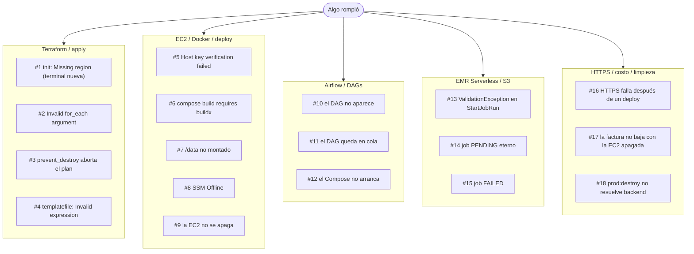

# Guía de producción en AWS con Terraform

> [!CAUTION]
> **Guía ejecutable, pero no materializada en este checkout.** Los artefactos de producción se crean
> desde los bloques siguientes en un workspace de despliegue. Ejecutarlos puede crear recursos
> facturables; avance en orden, revise cada plan y no confunda una guía completa con un entorno AWS
> ya desplegado o validado.

> [!IMPORTANT]
> Guía incremental de **copy/paste**: avance en orden y conserve lo creado. Cada bloque indica la
> acción y el lugar exactos. No modifique desde la consola AWS los recursos administrados por Terraform.

## Alcance y criterio de uso

Arquitectura de etapa A: Airflow 3 y Postgres en una EC2 `t3.large`, datos en S3, Spark en EMR
Serverless y despliegue con Terraform/Taskfile. Está pensada para una carga pequeña, un solo equipo
y datos no regulados. No hay alta disponibilidad: la EC2 es un punto único de fallo aceptado.

El recorrido implementa un objetivo único: desarrollar código localmente, publicarlo en Airflow y
ejecutar PySpark en EMR Serverless cuando el volumen exceda el entorno local. Incluye únicamente
los controles necesarios para desplegar, observar, recuperar y eliminar ese flujo con seguridad.

No cargue datos reales hasta completar las 11 secciones, probar una ejecución end-to-end, confirmar
las alertas externas y ensayar la recuperación de PostgreSQL. Las decisiones conceptuales viven en
[`docs/03-arquitectura.md`](03-arquitectura.md); este documento contiene las acciones ejecutables.

## Antes de ejecutar comandos

1. Trabaje siempre desde la raíz del repo.
2. Cree `scripts/prod-env.sh` en la sección 2.3.
3. Cargue contexto al abrir cada terminal:

```bash
source ./scripts/prod-env.sh   # EN TU MÁQUINA, una vez por terminal
```

Después de cada `apply`, vuelva a cargar `prod-env.sh`. El script lee outputs reales de Terraform;
no escriba IDs, IPs, buckets ni ARNs manualmente.

## Cómo leer esta guía

Los bloques están preparados para copiarse completos. La instrucción inmediatamente anterior define
qué hacer; no deduzca la acción únicamente por el lenguaje del bloque.

| Icono y rótulo | Acción exacta |
|---|---|
| 📝 **CREAR/COPIAR `<ruta>`** | Cree el archivo y copie el bloque completo. Si ya existe, compárelo antes de reemplazarlo |
| ➕ **AGREGAR a `<ruta>`** | Pegue el bloque donde se indica sin borrar lo creado en secciones anteriores |
| ♻️ **REEMPLAZAR en `<ruta>`** | Sustituya solo el bloque identificado |
| ▶️ **EJECUTAR — terminal local** | Pegue el bloque completo en una terminal situada en la raíz del repositorio |
| ▶️ **EJECUTAR — EC2** | Ejecute dentro de la instancia únicamente cuando se indique; el resto se ejecuta localmente |
| ✅ **VALIDAR/Checkpoint** | Compruebe el resultado esperado antes de avanzar |
| 🎯 **RESULTADO** | Estado que debe quedar al terminar una sección |
| ℹ️ **REFERENCIA — no ejecutar** | Contexto o patrón futuro; no se copia ni se aplica |
| 📍 **Dónde** / 📄 **Archivo** | Lugar exacto de ejecución o edición |
| 📌 **Regla/contrato** | Condición que debe conservarse durante todo el recorrido |
| ⚠️ **Advertencia** | Riesgo o condición que bloquea el avance seguro |

La guía es acumulativa: `main.tf`, `outputs.tf`, `variables.tf` y
`taskfiles/Taskfile.prod.yml` crecen por secciones. **AGREGAR** conserva el contenido previo y
**REFERENCIA — no ejecutar** identifica bloques informativos.

El contexto de ejecución se reconoce así:

| Contexto | Qué es | Cómo lo marca esta guía |
|---|---|---|
| **Local** | Equipo del operador, ubicado en la raíz del repositorio, con credenciales AWS y el contexto cargado | Una línea `📍 **Dónde:** terminal local` o un comentario `# EN TU MÁQUINA`. Es el contexto predeterminado si el bloque no indica otro |
| **En la EC2** | Dentro de la instancia: mediante `ssh`, `$SSH "$SSH_TARGET" "..."` o SSM. Allí no existen `terraform` ni el perfil AWS local: las credenciales provienen del **rol de instancia** mediante IMDSv2 | Un comentario `# EN LA EC2` o el comando remoto que encapsula la ejecución |

### Reglas de trabajo

1. Avance en orden y no omita checkpoints.
2. Terraform es la fuente de verdad. Si algo se creó a mano, impórtelo antes del siguiente `apply`.
3. No edite comandos salvo campos marcados como decisión humana (`<dominio>`, `<email>`, `<job-id>`).
4. Un `apply` exitoso confirma infraestructura; las secciones 8 y 10 validan el servicio.
5. `task prod:destroy` es el único camino aprobado para eliminar el entorno.

### Material de partida

Checklist de artefactos que la guía construye o usa:

| Ruta | Estado | Acción requerida |
|---|---|---|
| `infra/bootstrap/`, `infra/envs/prod/`, módulos `network` y `orchestrator` | **por crear** | Secciones 2 a 4 |
| Módulos `storage`, `backups`, `emr` y `secrets` | **por crear** | Secciones 6 y 10 |
| `Taskfile.yml` + `taskfiles/Taskfile.local.yml` | **prerrequisito local** | [Sección 0 de `01-stack-local.md`](01-stack-local.md#0-construcción-incremental-del-entorno) |
| `taskfiles/Taskfile.prod.yml` | **por crear y ampliar** | Secciones 1.4.2, 5, 6, 8, 9 y 10 |
| `Dockerfile.airflow.prod` y Compose de producción | **por crear** | Secciones 5, 10.7 y 11.3 |
| `scripts/prod-env.sh`, `scripts/load-secrets.sh`, `scripts/update-sg-ip.sh` | **por crear** | Secciones 2.3, 10.5 y 4.1 |
| `scripts/prod-destroy.sh` | **por crear** | Sección 10.10.4; motor único de `task prod:destroy` |
| `dags/customer_etl_emr_dag.py`, `spark-apps/emr/` | **por crear** | Secciones 7 y 6 |
| `monitoring/` y `docker-compose.prod.monitoring.yml` | **por crear** | Sección 11; no active `PROD_MONITORING=1` antes de su checkpoint |

### Gate de entrada

No inicie la infraestructura AWS hasta tener el stack local sano (`task local:up`), pruebas en verde
(`task test`) y una ejecución local completa siguiendo
[`06-medallion-desde-cero.md`](06-medallion-desde-cero.md). Diagnosticar un DAG defectuoso en AWS
consume tiempo de EMR y es más lento que hacerlo en Docker.

## Índice

Siga las 11 secciones en orden; cada checkpoint habilita la siguiente.

1. [Arquitectura y prerrequisitos](#1-arquitectura-y-prerrequisitos)
2. [Configuración de AWS y contrato de variables](#2-configuración-de-aws-y-contrato-de-variables)
3. [Terraform y estado remoto](#3-terraform-y-estado-remoto)
4. [Infraestructura base: red, IAM y EC2](#4-infraestructura-base-red-iam-y-ec2)
5. [Airflow en producción](#5-airflow-en-producción)
6. [S3 y cómputo con EMR Serverless](#6-s3-y-cómputo-con-emr-serverless)
7. [DAG de Airflow para EMR Serverless](#7-dag-de-airflow-para-emr-serverless)
8. [Validación técnica y end-to-end](#8-validación-técnica-y-end-to-end)
9. [Flujo diario de desarrollo y despliegue](#9-flujo-diario-de-desarrollo-y-despliegue)
10. [Operación, seguridad y limpieza](#10-operación-seguridad-y-limpieza)
11. [Observabilidad: Prometheus, Grafana y Loki](#11-observabilidad-prometheus-grafana-y-loki)

[Apéndice: mapa de archivos](#apéndice-mapa-de-archivos) · [Referencias oficiales](#referencias-operativas-oficiales)

### Mapa DevSecOps de las 11 secciones

La seguridad no se aplaza hasta la sección 10. Cada checkpoint debe producir evidencia sin
secretos y bloquea la sección siguiente si falla:

| Sección | Información sensible | Vulnerabilidad | Resiliencia / evidencia obligatoria |
|---|---|---|---|
| 1 | Clasificar cada dataset y asignar owner | Modelar amenazas y riesgo aceptado | SLO, RPO/RTO y límites documentados |
| 2 | Usar IAM Identity Center/STS; nunca access keys persistentes | MFA y sesión/cuenta/región verificadas | Identidad efímera y `prod.env` sin secretos |
| 3 | Tratar state y planes como secretos | Backend privado, cifrado, versionado y bloqueado | Recuperar una versión y conservar el plan aprobado |
| 4 | No poner secretos/PII en `user_data`, tags o nombres | IMDSv2, Inspector, Patch Manager y mínimo privilegio | EBS persistente, backup y apagado consciente de jobs |
| 5 | No imprimir entorno, Connections ni Variables | RBAC, TLS, dependencias e imagen escaneadas | Healthchecks, reinicio, backup y restore de metadatos |
| 6 | S3 privado; Macie cuando pueda existir PII | Policies y rol EMR acotados; cifrado verificado | Reintento EMR, cuotas, staging, idempotencia y cuarentena |
| 7 | Nunca enviar secretos/PII por `dag_run.conf` | Validar parámetros, rutas y código en revisión | Un job lógico, reintento AWS y cancelación al matar la task |
| 8 | Sanitizar logs y artefactos de prueba | Escanear secretos, IaC, dependencias e imágenes | Smoke, E2E y restore cumplen SLO/RPO/RTO |
| 9 | CI con OIDC/STS, sin credenciales persistentes | SBOM, firma/attestation y gate High/Critical | Build único, promoción inmutable y rollback ensayado |
| 10 | Rotar y auditar SSM/Secrets Manager | Revocar exposición y parchear dentro del SLA | Runbooks, break-glass, backup y recuperación probados |
| 11 | Redactar logs y limitar quién los consulta | Centralizar Inspector/Security Hub/GuardDuty/Macie | Alertas externas, heartbeat y simulacros con dueño |

Una excepción requiere owner, justificación, control compensatorio y fecha de caducidad. No se
aceptan excepciones permanentes ni evidencia que contenga valores secretos.

---

## 1. Arquitectura y prerrequisitos

> 🎯 **RESULTADO:** mapa de ejecución y modo actual del ciclo de vida.
>
> 🔐 **GATE DEVSECOPS 1:** clasificación, amenazas, SLO y RPO/RTO aprobados antes de usar datos reales.

La topología completa. El detalle conceptual y los diagramas están en
[`docs/03-arquitectura.md`](03-arquitectura.md); esta guía es el cómo.

```text
                    ┌──────────── EC2 t3.large (Elastic IP) ─────────────────┐
 Usuario/Taskfile ─► │  Docker Compose: Airflow + PostgreSQL                  │
                     │  Observabilidad: Prometheus · Grafana · Loki           │
                     └───────┬──────────────────────────────┬─────────────────┘
                             │ StartJobRun                  │ /data (EBS gp3)
                             ▼                              ▼
                     ┌──────────────┐               (snapshots EBS · DLM)
                     │ EMR          │
                     │ Serverless   │──────────────► S3 raw/curated/logs
                     └──────────────┘
```

Airflow (en la EC2) inicia y espera cada job con `EmrServerlessStartJobOperator(deferrable=True)`
sin ocupar un worker durante la espera. EMR Serverless lee/escribe `s3a://` con **su propio** rol
de ejecución. La EC2 nunca corre Spark: solo orquesta.

### 1.1 Ciclo de vida: los 4 modos

El sistema tiene 4 modos. Cada uno responde a una pregunta concreta, y saber en cuál
determina qué comandos corresponden:

| Modo | Pregunta que responde | Tiempo | Costo después |
|---|---|---|---|
| **STAND-UP** | «Es la primera vez, parto de cero» | 3–4 h | línea base medida en la cuenta |
| **OPERACIÓN** | «Ya está construido, lo uso día a día» | — | fijo + EMR/S3/logs por uso |
| **PAUSA LARGA** | «No lo voy a usar por semanas, pero no quiero perder nada» | 5 min | EBS + snapshots + IPv4 + S3 + logs |
| **TEARDOWN** | «Terminé el proyecto, que no facture nada» | 30–45 min | sin recursos de esta guía; revise cargos ajenos |

Pausar no destruye datos: apaga la EC2 y conserva EBS, EIP, S3 y snapshots. Teardown sí destruye
datos y state; se ejecuta solo con `task prod:destroy`, plan guardado y confirmación fuerte.

### 1.2 Gate de producción: qué falta y qué no se negocia

El stand-up demuestra que el camino técnico funciona; no autoriza datos reales. Complete este gate
antes de activar el DAG con cargas de negocio:

| Área | Mínimo exigido | Dónde cerrarlo |
|---|---|---|
| Propiedad | owner, clasificación/PII, retención y consumidores por dataset | contrato del data product |
| Calidad | esquema, frescura, volumen, duplicados, reconciliación y cuarentena antes de `curated` | sección 10.9 |
| Costo | tags, límites EMR, retenciones y revisión semanal | secciones 1.3, 6.4 y 11 |
| Seguridad | secretos en SSM, roles separados, rotación y parcheo/AMI con dueño | sección 10 |
| Red | SSH/HTTPS restringido al `/32` del operador | secciones 4.1 y 5.2 |
| Recuperación | dump lógico, snapshot y restore contra RPO 24 h / RTO 2 h | secciones 6.3 y 10.10 |
| Supply chain | imágenes fijadas, dependencias bloqueadas, tests y artefactos revisados | secciones 8 y 9 |
| Observabilidad | métricas, logs, dashboard y alarmas externas probadas | sección 11 |
| Disponibilidad | aceptación explícita del SPOF de la EC2 | sección 10.10 |

Si falta una fila, no es producción con datos reales: es laboratorio o preproducción.

---

### 1.3 Costos y criterio de capacidad

> 📋 **COMPLETAR antes del primer apply.** Resultado: línea base por servicio, tope mensual
> y límite por job. No use cifras históricas de una guía para aprobar gasto: precios, free tier,
> región, descuentos y volumen cambian.

Este diseño elimina el cómputo Spark ocioso, pero no hace que la plataforma sea gratis. Calcule en
[AWS Pricing Calculator](https://calculator.aws) para la región elegida y valide después con Cost
Explorer. Separe los cargos para que un pico tenga dueño y causa:

| Grupo | Fórmula de presupuesto | Control obligatorio |
|---|---|---|
| Orquestación | horas EC2 encendida × tarifa + EBS gp3 + snapshots + IPv4 pública | horario, alarma de CPU/espacio y revisión de créditos T3 |
| Spark | suma de `billedResourceUtilization` de cada job × precio regional de vCPU/GB/disco | `maximum_capacity`, concurrencia 1 y timeout por job (sección 6.4) |
| Lake | GiB-mes por clase + versiones no actuales + requests + transferencia | lifecycle por prefijo y expiración de logs (sección 6.1) |
| Operación | CloudWatch, backups y observabilidad local | retenciones explícitas y alarmas externas (sección 11) |
| Red | IPv4 pública, DNS y, si se introduce, NAT/PrivateLink | **no** cree NAT para cargas solo AWS sin modelar su coste |

Antes de producción, registre cuatro números: horas reales de EC2, GB-mes por prefijo S3,
percentil p95 de duración/uso facturado de EMR y gasto mensual de observabilidad/backups. Defina un
tope mensual con margen para un reintento completo; los límites de capacidad evitan excesos, pero
no interrumpen una carga que ya comenzó.

**Tamaño inicial, no promesa:** `t3.large` puede ser suficiente para Airflow, Postgres y el stack
mínimo sin Spark. Si se habilita Prometheus/Grafana/Loki, mida memoria, disco y créditos T3 durante
siete días antes de bajar o reservar capacidad. Una EC2 saturada es más cara que una talla correcta
si provoca reintentos de EMR. No active modo ilimitado de T3 sin alertar
`CPUSurplusCreditsCharged`.

#### 1.3.1 Self-managed vs managed: ¿cuándo cada uno?

Comparación de decisión; cotice todas las opciones con los mismos SLO, concurrencia y horas:

| Opción | Cómo cobra | Ops | Cuándo gana |
|---|---|---|---|
| **EMR Serverless** (este stack, cómputo) | vCPU-seg + GB-seg, escala a cero | AWS | **Spark pequeño o esporádico con operación mínima → opción elegida** |
| **Airflow en EC2 pequeña** (este stack, orquestación) | tiempo encendido | Equipo | orquestador liviano y portable, sin lock-in |
| **Spark self-managed en EC2** (una instancia grande) | tiempo encendido | Equipo | ejecución sostenida y capacidad ya contratada; asumir la operación |
| **Glue Spark** | DPU/worker por uso | AWS | preferencia por integración Glue y tarifa validada en la región |
| **EMR on EC2** (clásico) | fleet EC2 + cargo EMR | Equipo | TB sostenidos, multi-nodo y afinación de cluster |
| **MWAA** (solo orquestación) | entorno siempre encendido | AWS | cuando HA administrada justifique el coste |

Regla: **uso bajo o esporádico + mínima ops → serverless**, con Airflow en una EC2 pequeña.
**Spark sostenido muchas horas → self-managed** en una instancia ya pagada, con HDFS real.
EMR Serverless deja de ser la opción económica cuando la capacidad está ocupada gran parte del día
o si los cold starts incumplen el SLO. En ese caso, reevalúe el motor y el modelo de capacidad.

---

### 1.4 Prerrequisitos

> ▶️ **EJECUTAR y revisar la sección 2.** Resultado: herramientas y origen de valores verificados.
> La [sección 2](#2-configuración-de-aws-y-contrato-de-variables) es obligatoria:
> omitirlo produce variables vacías y errores tardíos como `ValidationException`.

Use una sesión AWS ya autenticada con permisos sobre EC2, S3, IAM, Lambda, EventBridge, SSM y EMR
Serverless. Si utiliza IAM Identity Center, ejecute antes `aws sso login --profile <perfil>` y
declare `AWS_PROFILE=<perfil>` en `infra/envs/prod/prod.env` cuando ese archivo exista.

▶️ **EJECUTAR — terminal local.** Verifique identidad y versiones antes de crear archivos:

```bash
aws --version
aws sts get-caller-identity
terraform version                              # >= 1.10 por use_lockfile del backend S3
jq --version
task --version                                 # go-task
ssh -V
rsync --version | head -n 1
curl --version | head -n 1
dig -v
docker compose version
python --version
pytest --version
```

Deténgase si la cuenta o el ARN no corresponden al entorno objetivo. Cree la clave SSH solo cuando
no exista y valide ambos archivos:

```bash
test -f ~/.ssh/pyspark_stack || ssh-keygen -t ed25519 -f ~/.ssh/pyspark_stack -C pyspark_stack
test -s ~/.ssh/pyspark_stack && test -s ~/.ssh/pyspark_stack.pub
```

#### 1.4.1 Estructura de infraestructura: composición y módulos

La infra es una **composición**: `infra/envs/prod/` no declara un solo `resource` — instancia
módulos y conecta sus salidas. Cada módulo de `infra/modules/` es una unidad encapsulada con
interfaz pública (`variables.tf` de entrada, `outputs.tf` de salida).

```text
infra/
├── bootstrap/                          # crea una sola vez el bucket del backend; state LOCAL
│   └── main.tf                         # sección 3
├── envs/
│   └── prod/                           # la COMPOSICIÓN: un backend, un state, cero resources
│       ├── versions.tf                 # sección 3 — required_version + providers + default_tags
│       ├── backend.tf                  # sección 3 — S3 + use_lockfile
│       ├── variables.tf                # sección 3 nace con aws_region; sección 4.1 agrega las entradas
│       ├── terraform.tfvars            # sección 4.1 — valores locales (NO se versiona)
│       ├── main.tf                     # crece: un bloque module "X" por sección
│       └── outputs.tf                  # contrato de la sección 2, siempre module.X.algo
├── modules/                            # unidades encapsuladas; no conocen el entorno consumidor
│   ├── _shared/                        # sección 4.2 — trusts compartidos de EC2, Lambda, Scheduler y DLM
│   ├── network/                        # secciones 4.1 y 6.5 — SG, subnet/AZ y endpoint S3
│   ├── orchestrator/                   # secciones 4.2 y 4.3 — rol, EC2, EBS y EIP
│   │   └── user_data.sh.tftpl
│   ├── scheduler/                      # sección 4.4 — encendido y apagado seguro
│   ├── https/                          # sección 5.2 — URL HTTPS opcional para Airflow
│   │   └── policies/route53-certbot.json.tftpl
│   ├── storage/                        # secciones 6.1/6.2 — buckets y acceso S3 del orquestador
│   ├── backups/                        # sección 6.3 — DLM: snapshots del EBS de datos
│   ├── emr/                            # sección 6.4 — app EMR Serverless + rol de ejecución del job
│   ├── secrets/                        # sección 10 — parámetros SSM y permiso de lectura
│   └── monitoring/                     # sección 11 — alarmas externas e IAM de Grafana
└── lambdas/                            # el código Python, fuera de los módulos que lo empaquetan
    └── startstop.py                    # sección 4.4
```

**Cree el esqueleto vacío** y complete un módulo por vez:

```bash
for d in infra/bootstrap infra/envs/prod infra/lambdas \
         infra/modules/{_shared,network,orchestrator,scheduler,https/policies,storage,backups,emr,secrets,monitoring}; do
  mkdir -p "$d"
done
find infra -type d | sort
```

**El bucle de trabajo, idéntico de la sección 3 a la sección 11** — cuatro pasos:

| Paso | Acción | Herramienta |
|---|---|---|
| 1 | Cree `variables.tf`, `main.tf` y `outputs.tf` del módulo | Bloques de la sección |
| 2 | **Valide el módulo aislado**, sin backend ni credenciales | `terraform -chdir=infra/modules/<mod> init -backend=false && terraform -chdir=infra/modules/<mod> validate` |
| 3 | Agregue `module "<mod>"` al final de `envs/prod/main.tf` | Bloque «Componer» de la sección |
| 4 | Revise y aplique **el plan completo** y verifique el checkpoint | `terraform -chdir=infra/envs/prod plan -out=tfplan && terraform -chdir=infra/envs/prod apply tfplan` |

Validar el módulo primero atrapa errores antes del `apply`; aplicarlo por separado localiza el fallo.
El [Taskfile de la sección 1.4.2](#142-el-orquestador-de-comandos-taskfileyml) estandariza el ciclo en
**tres acciones**: validar, generar/revisar el plan y aplicar ese mismo plan.

```text
task prod:infra:validate MODULE="<mod>"   # paso 2: valida el módulo aislado
task prod:infra:plan                     # paso 4: plan completo que se revisa
task prod:infra:apply                    # aplica el plan revisado; no usa -target
```

**Cuando un módulo falla a mitad del apply**, Terraform no hace rollback: lo que se creó,
queda. Los cinco modos de falla — ninguno se arregla borrando el state:

| Síntoma | Causa probable | Acción correctiva |
|---|---|---|
| `Error: Unsupported attribute: module.X has no output "y"` | El módulo se compuso antes de agregar `outputs.tf` | Agregue `outputs.tf` al módulo y repita el `apply`; no modifique la composición |
| `Error acquiring the state lock` | Otro `apply` está activo o terminó sin liberar el lock | Confirme que no existe otro proceso y ejecute `terraform -chdir=infra/envs/prod force-unlock <LOCK_ID>` |
| El plan completo crea **más** recursos de los esperados | quedó una dependencia o un cambio pendiente de una sección anterior | Deténgase, entienda el grafo y corrija la composición; no recorte el plan con `-target` |
| `EntityAlreadyExists` / `BucketAlreadyExists` | El recurso existe en AWS pero no en el state | Importe el recurso a su address de módulo antes de aplicar; no elimine recursos que contengan datos |
| El apply termina OK pero `output` no devuelve nada | El output existe en el módulo, pero no en `envs/prod/outputs.tf` | Publique el output en el entorno, como indica la sección 2 |

> ⚠️ **No use `-target` como recorrido normal.** Terraform lo reserva para recuperación o una
> limitación excepcional: puede ocultar drift y omitir cambios relacionados. La composición se
> construye por secciones, pero cada sección completa se revisa y aplica con el plan íntegro del
> entorno. Si el plan completo contiene cambios inesperados, se detiene y se investiga; no se
> recorta para forzar el avance.

> El árbol de arriba es el resultado final: cada módulo aparece cuando su sección lo crea.
> `bootstrap` corre una vez y tiene state local; todo lo demás vive en **un solo backend y
> un solo state**, el de `infra/envs/prod`.

#### 1.4.2 El orquestador de comandos: `Taskfile.yml`

Producción se opera por tasks, no por comandos memorizados. El lanzador raíz mantiene
separados `local:*` y `prod:*`; cada task se declara una sola vez en `taskfiles/Taskfile.prod.yml`.

Integre los bloques en este orden:

| Bloque incremental | Se incorpora en | Consumidor |
|---|---|---|
| variables de infraestructura + `infra:*` (7 tasks) + `destroy` | **en esta guía** | sección 4 en adelante; teardown disponible desde el inicio |
| `trust-host` · `wait` · `deploy` · `tunnel` | [sección 5.1](#51-desplegar-subir-código-y-túnel-ssh) | `task prod:<task>` |
| `emr:sync` · `emr:seed` | [sección 6.4](#64-cómputo-spark-emr-serverless) | publica código EMR y los inputs mínimos del DAG de referencia |
| `status` · `smoke` · `e2e` · `logs` | [sección 8](#8-validación-técnica-y-end-to-end) | operación diaria |
| `dev:sync` | [sección 9.6.1](#961-iteración-rápida) | `task prod:dev:sync` |
| `secrets` | [sección 10.5](#105-materializar-env) | `task prod:secrets` |
| `release:check` · `release:apply` · `release:deploy` | [sección 10.8](#108-runbook-de-puesta-en-producción) | cada promoción |
| `monitoring:tunnel` · `monitoring:check` | [sección 11](#11-observabilidad-prometheus-grafana-y-loki) | acceso y gate de observabilidad |

Después de modificar `taskfiles/Taskfile.prod.yml`, ejecute `task --list-all`. Deben aparecer
`local:*` y todas las `prod:*` completadas; si una desaparece, se editó el archivo equivocado.

Requiere [go-task](https://taskfile.dev/installation/), comprobado entre los prerrequisitos de la
sección 1.4.

**1 — `Taskfile.yml`.** Dentro de `includes:`, agregue producción sin tocar
`taskfiles/Taskfile.local.yml`:

```yaml
  prod:
    taskfile: ./taskfiles/Taskfile.prod.yml
    optional: true
```

**2 — `taskfiles/Taskfile.prod.yml`.** Cree el módulo de producción en `taskfiles/`, no en `docs/`
ni en el `Taskfile.yml` raíz:

```yaml
version: "3"

vars:
  ENV_DIR: infra/envs/prod
  MODULES: infra/modules
  CTX: 'set -a; . ./scripts/prod-env.sh >/dev/null; set +a;'   # el subshell no hereda el contexto

tasks:
  default:
    desc: "Ayuda del módulo de producción"
    silent: true
    cmds:
      - |
        echo "pyspark_stack · módulo de producción"
        echo "Infraestructura: task prod:infra:plan"
        echo "URLs e IDs:       task prod:infra:output  (no muestra secretos)"
        echo "Secretos:         se gestionan en AWS SSM; nunca se imprimen con task"
        echo "Teardown total:   task prod:destroy  (plan + confirmación fuerte)"
        echo "Catálogo:        task --list-all"

  destroy:
    desc: "Teardown total seguro — destruye prod + datos + bootstrap; exige confirmar cuenta/región/prefijo"
    interactive: true
    cmds:
      - bash ./scripts/prod-destroy.sh
```

`prod:destroy` queda disponible desde el inicio. Su implementación vive en
`scripts/prod-destroy.sh`; no replique lógica destructiva en YAML. Verifique:

```bash
bash -n ./scripts/prod-destroy.sh
git ls-files --error-unmatch scripts/prod-destroy.sh >/dev/null
task --list-all | grep 'prod:destroy'
```

En cualquier etapa se usa únicamente con `task prod:destroy`. Primero genera planes efímeros y
muestra cuenta, región, prefijo y recursos; no borra nada hasta recibir la frase exacta que imprime.
El contrato y las garantías completas están en la [sección 10.10.4](#10104-teardown).

**3 — tasks de infraestructura.** Agréguelas al final de `tasks:` en
`taskfiles/Taskfile.prod.yml`:

```yaml
  # ── infraestructura ──────────────────────────────────────────────────────────

  infra:bootstrap:
    desc: "sección 3 — crea el bucket del state. State local, una vez por cuenta"
    cmds:
      - terraform -chdir=infra/bootstrap init
      - terraform -chdir=infra/bootstrap plan -out=tfplan
      - terraform -chdir=infra/bootstrap apply tfplan

  infra:fmt:
    desc: "Formatea infra/ (lo que infra:validate solo verifica)"
    cmds:
      - terraform fmt -recursive infra/

  infra:validate:
    desc: "fmt -check + validate de los módulos y del entorno. MODULE=<n> acota. Sin credenciales"
    cmds:
      - terraform fmt -check -recursive infra/
      - |
        # Solo valida módulos con .tf; la sección 1.4.1 crea el esqueleto completo.
        for m in $(if [ -n "{{.MODULE}}" ]; then
                     for x in {{.MODULE}}; do echo "{{.MODULES}}/$x"; done
                   else echo {{.MODULES}}/*; fi); do
          if ! ls "$m"/*.tf >/dev/null 2>&1; then
            # Vacío sin MODULE: aún no está implementado. Vacío CON MODULE: nombre incorrecto.
            [ -z "{{.MODULE}}" ] || { echo "sin .tf en $m — ¿el nombre está bien escrito?" >&2; exit 1; }
            continue
          fi
          terraform -chdir="$m" init -backend=false -input=false >/dev/null
          terraform -chdir="$m" validate || exit 1
        done
      - |
        # Las trust policies de la sección 4.2 son JSON suelto: terraform no las mira.
        for f in {{.MODULES}}/_shared/*.json; do
          [ -e "$f" ] || continue
          jq -e . "$f" >/dev/null
        done
      - |
        # La composición, en cuanto exista.
        [ -f {{.ENV_DIR}}/main.tf ] || exit 0
        terraform -chdir={{.ENV_DIR}} init -backend=false -input=false >/dev/null
        terraform -chdir={{.ENV_DIR}} validate

  infra:init:
    desc: "init contra el backend S3. Hace falta tras componer un módulo nuevo"
    cmds:
      - terraform -chdir={{.ENV_DIR}} init

  infra:plan:
    desc: "Plan completo guardado en tfplan. Es el que se revisa antes de aplicar"
    deps: [infra:init]
    cmds:
      - terraform -chdir={{.ENV_DIR}} plan -out=tfplan
      - terraform -chdir={{.ENV_DIR}} show tfplan

  infra:apply:
    desc: "Aplica el plan completo aprobado; no admite -target"
    cmds:
      - test -f {{.ENV_DIR}}/tfplan || { echo "Falta {{.ENV_DIR}}/tfplan; ejecute task prod:infra:plan" >&2; exit 1; }
      - terraform -chdir={{.ENV_DIR}} apply tfplan

  infra:output:
    desc: "Muestra URLs e IDs publicados por Terraform; NAME=<output> devuelve uno (nunca secretos)"
    cmds:
      - |
        if [ -n "{{.NAME}}" ]; then
          terraform -chdir={{.ENV_DIR}} output -raw {{.NAME}}
        else
          terraform -chdir={{.ENV_DIR}} output
        fi

```

Después de guardar:

```bash
test -f ./taskfiles/Taskfile.prod.yml || { echo "Falta ./taskfiles/Taskfile.prod.yml" >&2; exit 1; }
task --list-all      # local:* y las 7 prod:infra:* recién incorporadas
```

Con el esqueleto vacío, la validación debe terminar en cero sin tocar AWS:

```bash
task prod:infra:validate
```

#### Convención utilizada desde este punto

La task es la interfaz operativa. Los comandos sueltos se usan solo para validar, diagnosticar o
crear archivos que todavía no existen.

Límites del Taskfile:

- **No reemplaza `source ./scripts/prod-env.sh`.** Una task corre en un subshell: lee el
  contexto, no lo exporta a la terminal actual. Por eso `release:apply` solicita recargarlo.
- **No aplica sin revisión del plan.** El runbook se divide en tres tasks porque
  entre `release:check` y `release:apply` existe una aprobación humana. Una task única de despliegue
  reduciría la aprobación a una confirmación mecánica y permitiría reemplazar una instancia por error.
- **No reemplaza el criterio del operador.** Si una task falla, revise el mensaje, el plan y los logs
  antes de repetirla.

**Mantenimiento: la sección que enseña una operación repetible es la dueña de su task.** Un
comando que aparece dos veces en la guía y no está en `taskfiles/Taskfile.prod.yml` es una copia esperando a
divergir.

### 1.5 Baseline DevSecOps y clasificación de datos

Registre por data product: `owner`, clasificación, finalidad, consumidores, ubicación, retención,
RPO, RTO y procedimiento de borrado. Use cuatro clases: **público**, **interno**, **confidencial** y
**restringido**. Nombres de recursos, tags, métricas, IDs de DAG y mensajes de log son metadatos
observables: nunca contienen PII, tokens, correos de clientes ni valores de negocio sensibles.

Esta arquitectura de una EC2 y una cuenta es válida para laboratorio y cargas internas o
confidenciales con riesgo aceptado. **Datos restringidos/regulados bloquean el alta** hasta separar
cuentas y funciones, usar red privada, claves KMS administradas por el cliente, auditoría central
inmutable, recuperación entre regiones y la aprobación de seguridad/compliance aplicable.

| Amenaza | Control preventivo | Detección/recuperación |
|---|---|---|
| Credencial humana robada | Identity Center/STS, MFA, mínimo privilegio | CloudTrail, revocar sesión, investigar acciones |
| Secreto expuesto en log/state | SSM/Secrets Manager, redacción, no outputs | hallazgo de secretos, rotación y nueva credencial |
| DAG o dependencia maliciosa | PR obligatoria, pins, SBOM y escaneo | rollback del artefacto y revisión de auditoría |
| EC2/AZ indisponible | S3 + backup EBS/DB; host recreable | restore probado contra RPO/RTO |
| Reintento que duplica datos | staging y publicación idempotente | reconciliación, cuarentena y replay controlado |
| Buckets con datos sensibles | bloqueo público, IAM/KMS y clasificación | Access Analyzer/Macie y alerta central |

---

## 2. Configuración de AWS y contrato de variables

> 🔐 **GATE DEVSECOPS 2:** opere con una identidad federada temporal, MFA y cuenta/región
> verificadas; `prod.env` solo puede contener contexto local, nunca credenciales ni contraseñas.

Ningún comando lleva un ID, IP, account id o bucket escrito a mano: todos leen variables de **Terraform**.
Un `i-0abc…` caduca al recrear la instancia; un placeholder puede ejecutar contra el lugar equivocado.
Con este contrato, el mismo bloque funciona en otra cuenta, región o `name_prefix` sin editarlo.

**Regla:** *si AWS o Terraform determinan un valor, publíquelo como `output`; si depende del
entorno local, defina un valor predeterminado que el cargador permita sobrescribir.*

### 2.1 Flujo de valores

```text
recurso .tf  ──►  output en outputs.tf  ──►  scripts/prod-env.sh  ──►  $VARIABLE en el comando
 (secciones 3–11)               nombre snake_case          exporta TODO           sin editar
                                              en MAYÚSCULAS
```

### 2.2 Fuentes de configuración

Ningún bloque de este documento vuelve a calcular lo que un paso anterior ya dejó resuelto:

| Fuente | Qué aporta | Acción requerida |
|---|---|---|
| `terraform output` (en `infra/envs/prod`) | **Fuente de verdad.** Recursos creados por la guía | Declare el output en la misma sección que crea el recurso |
| `scripts/prod-env.sh` | Exporta outputs en MAYÚSCULAS y deriva valores locales | Ejecute `source ./scripts/prod-env.sh` una vez por terminal; no edite el script |
| `.env` **en la EC2** | Lo que consume el Compose de producción dentro del host | **Nada.** Lo genera `scripts/load-secrets.sh` desde SSM ([sección 10.5](#105-materializar-env)). Editarlo a mano se pierde en el próximo deploy |

### 2.3 Cargador `scripts/prod-env.sh`

**Créelo ahora, una vez.** Este checkout no lo incluye. El cargador exporta todo
`terraform output -json`, deriva las rutas operativas y sigue en modo parcial antes del primer
apply. Las secciones posteriores agregan outputs, no listas de variables al script.

Mantenga el cuerpo compatible con shell POSIX: además de Bash, lo carga el intérprete de `task`.
La guía exige ejecutar desde la raíz; el script busca `Taskfile.yml` hacia arriba para validar ese
contexto sin depender de `BASH_SOURCE`.

**`scripts/prod-env.sh`:**

```bash
#!/usr/bin/env bash
# Cargue este script con `source`; `--check` solo valida y no exporta variables.
_pe_sourced=0; (return 0 2>/dev/null) && _pe_sourced=1
# Resuelva la raíz desde el directorio actual para funcionar igual en Bash y en task.
_pe_root="$PWD"; _pe_dir="$PWD"
while [ "$_pe_dir" != / ]; do
  [ -f "$_pe_dir/Taskfile.yml" ] && { _pe_root="$_pe_dir"; break; }
  _pe_dir="$(dirname "$_pe_dir")"
done
[ -f "$_pe_root/Taskfile.yml" ] || { echo "prod-env: ejecute desde el repositorio" >&2; [ "$_pe_sourced" -eq 1 ] && return 1 || exit 1; }
_pe_infra="${INFRA_DIR:-$_pe_root/infra/envs/prod}"

# Elimine outputs y derivadas de la carga anterior antes de leer el state actual.
_pe_known_outputs="AWS_REGION NAME_PREFIX ACCOUNT_ID INSTANCE_ID PUBLIC_IP DATALAKE_BUCKET ARTIFACTS_BUCKET EMR_APP_ID EMR_JOB_ROLE_ARN EMR_LOG_GROUP LAMBDA_STARTSTOP_NAME SCHEDULE_START_NAME SCHEDULE_STOP_NAME AIRFLOW_URL SNS_TOPIC_ARN"
_pe_derived="EMR_ENTRYPOINTS_URI EMR_LOGS_URI RAW_URI CURATED_URI SSH_TARGET SSH RSYNC_SSH PROD_HTTPS AWS_DEFAULT_REGION"
for _pe_old in ${_PE_OUTPUT_KEYS:-} $_pe_known_outputs $_pe_derived; do
  unset "$_pe_old"
done
_PE_OUTPUT_KEYS=""
export _PE_OUTPUT_KEYS

# Overrides locales del operador; mantenga este archivo fuera de Git y Terraform.
_pe_overrides="${PROD_ENV_FILE:-$_pe_infra/prod.env}"
if [ -r "$_pe_overrides" ]; then
  set -a
  . "$_pe_overrides"
  set +a
fi

# Solo valores locales; los identificadores de AWS siempre llegan como outputs.
export AWS_PAGER=""
export AWS_REGION="${AWS_REGION:-us-east-1}"
export AWS_DEFAULT_REGION="$AWS_REGION"
export SSH_KEY="${SSH_KEY:-$HOME/.ssh/pyspark_stack}"
export SSH_USER="${SSH_USER:-ec2-user}"
export REMOTE_DIR="${REMOTE_DIR:-/home/$SSH_USER/pyspark_stack}"
export COMPOSE_PROD="${COMPOSE_PROD:-docker-compose.prod.yml}"

if [ -d "$_pe_infra/.terraform" ]; then
  _pe_json="$(terraform -chdir="$_pe_infra" output -json)" || {
    echo "prod-env: terraform output falló; ejecute init o revise el state" >&2
    [ "$_pe_sourced" -eq 1 ] && return 1 || exit 1
  }
  if [ "$(printf '%s' "$_pe_json" | jq 'length')" -gt 0 ]; then
    _PE_OUTPUT_KEYS="$(printf '%s' "$_pe_json" | jq -r 'keys[] | select(test("^[A-Za-z_][A-Za-z0-9_]*$")) | ascii_upcase' | tr '\n' ' ')"
    export _PE_OUTPUT_KEYS
    eval "$(printf '%s' "$_pe_json" | jq -r '
      to_entries[]
      | select(.key | test("^[A-Za-z_][A-Za-z0-9_]*$"))
      | (.key | ascii_upcase) as $key
      | (.value.value | if type == "string" then . else tojson end) as $value
      | "export \($key)=\($value | @sh)"')"
  else
    echo "prod-env: contexto parcial — el state aún no tiene outputs" >&2
  fi
else
  echo "prod-env: contexto parcial — todavía no existe state inicializado" >&2
fi

# Derivadas: solo aparecen cuando existe su valor base.
[ -n "${ARTIFACTS_BUCKET:-}" ] && export EMR_ENTRYPOINTS_URI="s3://$ARTIFACTS_BUCKET/emr" EMR_LOGS_URI="s3://$ARTIFACTS_BUCKET/emr/logs"
[ -n "${DATALAKE_BUCKET:-}" ] && export RAW_URI="s3://$DATALAKE_BUCKET/raw" CURATED_URI="s3://$DATALAKE_BUCKET/curated"
[ -n "${PUBLIC_IP:-}" ] && export SSH_TARGET="$SSH_USER@$PUBLIC_IP" SSH="ssh -i $SSH_KEY -o StrictHostKeyChecking=yes" RSYNC_SSH="ssh -i $SSH_KEY -o StrictHostKeyChecking=yes"
# Si Terraform publica AIRFLOW_URL, todas las tasks usan HTTPS.
if [ -n "${AIRFLOW_URL:-}" ]; then
  export PROD_HTTPS=1
else
  export PROD_HTTPS=0
fi
export PROD_MONITORING="${PROD_MONITORING:-0}"

if [ "${1:-}" = "--check" ]; then
  _pe_strict=0
  [ "${2:-}" = "--strict" ] && _pe_strict=1
  _pe_missing=""
  printf 'Contexto de producción (fuente: terraform; lectura fresca del state)\n'
  _pe_required="AWS_REGION NAME_PREFIX ACCOUNT_ID INSTANCE_ID PUBLIC_IP DATALAKE_BUCKET ARTIFACTS_BUCKET EMR_APP_ID EMR_JOB_ROLE_ARN EMR_LOG_GROUP LAMBDA_STARTSTOP_NAME SCHEDULE_START_NAME SCHEDULE_STOP_NAME"
  _pe_optional="AIRFLOW_URL SNS_TOPIC_ARN PROD_HTTPS PROD_MONITORING"
  for _pe_var in $_pe_required $_pe_optional; do
    eval "_pe_value=\${$_pe_var:-}"
    printf '%-24s %s\n' "$_pe_var" "${_pe_value:-— (sin definir aún)}"
    case " $_pe_required " in *" $_pe_var "*) [ -n "${_pe_value:-}" ] || _pe_missing="$_pe_missing $_pe_var" ;; esac
  done
  if [ -n "$_pe_missing" ]; then
    echo "prod-env: contexto parcial; faltan:$_pe_missing" >&2
    # El modo normal informa durante el recorrido incremental. --strict es para un gate final.
    if [ "$_pe_strict" -eq 1 ]; then
      [ "$_pe_sourced" -eq 1 ] && return 1 || exit 1
    fi
  else
    echo 'prod-env: contexto completo'
  fi
fi
unset _pe_json _pe_value _pe_var _pe_missing _pe_required _pe_optional _pe_known_outputs _pe_derived _pe_old _pe_overrides _pe_infra _pe_root _pe_dir _pe_sourced _pe_strict
```

```bash
chmod +x scripts/prod-env.sh
source ./scripts/prod-env.sh
```

El script lee el state en cada carga a propósito: es más simple y evita usar un ID o IP obsoletos.
Después de cada `apply`, vuelva a ejecutar `source ./scripts/prod-env.sh`.
No use `PROD_ENV_REFRESH`: el script no mantiene caché.

### 2.4 Ampliar el contrato

Este contrato permite que las secciones posteriores crezcan sin editar el cargador. Un recurso
operable nuevo requiere tres declaraciones y un consumidor:

| Paso | Archivo | Elemento agregado | Ejemplo |
|---|---|---|---|
| 1 | `infra/modules/<mod>/main.tf` | el recurso | `aws_cloudwatch_log_group.emr` (sección 6.4) |
| 2 | `infra/modules/<mod>/outputs.tf` | la salida del módulo | `output "emr_log_group" { value = aws_cloudwatch_log_group.emr.name }` |
| 3 | `infra/envs/prod/outputs.tf` | **el mismo output, re-publicado por el entorno** | `output "emr_log_group" { value = module.emr.emr_log_group }` |
| — | `scripts/prod-env.sh` | **nada**: el bucle lo exporta solo | queda disponible como `$EMR_LOG_GROUP` |
| 4 | comando operativo | consume la variable | `aws logs tail "$EMR_LOG_GROUP" --since 1h` |

Seis convenciones evitan que esto se degrade:

- **`snake_case` en el output → `SCREAMING_SNAKE_CASE` en la shell.** Traducción mecánica.
- **Sufijo por tipo**: `_id`, `_arn`, `_name`, `_url`, `_uri` (S3), `_bucket`, `_ip`.
- **El output guarda el hecho; el cargador, la derivación.** `artifacts_bucket` es output;
  `s3://…/emr/logs` sale de `EMR_LOGS_URI` en el script. Un cambio de rutas toca un lugar.
- **Un output es una API, no documentación.** Renombrar = agregar el nuevo, migrar los usos,
  retire el anterior después de migrar todos los consumidores.
- **Nada de secretos en outputs**: van a SSM (sección 10); un output los deja en claro en el state.
- **La sección que crea el recurso agrega su output en el mismo `apply`.** Un output
  declarado más abajo que su primer uso deja la variable vacía al agregar el bloque, y
  `aws s3 cp … "s3:///raw/x"` no falla como un comando bien formado.

### 2.5 Agregar un recurso operable

El log group de EMR muestra las cuatro etapas del contrato:

```text
1. modules/emr/main.tf          resource "aws_cloudwatch_log_group" "emr" { ... }
                   └─ el recurso, en el módulo dueño de EMR (sección 6.4)

2. modules/emr/outputs.tf       output "emr_log_group" { value = ....name }
   envs/prod/outputs.tf         output "emr_log_group" { value = module.emr.emr_log_group }
                   └─ las dos, en la MISMA sección: nunca "para después"

3. terraform apply      +  source ./scripts/prod-env.sh
                   └─ apply publica el output; refresh lo carga en la terminal

4. aws logs tail "$EMR_LOG_GROUP" --since 1h
                   └─ ya es usable, sin haber tocado prod-env.sh ni una línea
```

El `source` del paso 3 siempre vuelve a leer el state; por eso cada `apply` que agrega outputs va
seguido de una recarga antes del siguiente comando operativo.

No mantenga un `.env.prod` con IDs de AWS. Se desincroniza cuando Terraform recrea recursos.
`prod-env.sh` lee el state; `infra/envs/prod/prod.env` queda reservado para valores locales que
Terraform no conoce, como perfil AWS y ruta de la clave SSH.

### 2.6 Identidad humana y archivos locales

El operador entra mediante IAM Identity Center o federación, obtiene credenciales STS de corta
duración y usa MFA. No use el usuario root ni cree access keys de IAM para CI o trabajo diario.
Antes de un cambio, valide sin imprimir credenciales:

```bash
umask 077
: "${AWS_PROFILE:?defina AWS_PROFILE en infra/envs/prod/prod.env}"
aws sso login --profile "$AWS_PROFILE"
CALLER_ARN="$(aws sts get-caller-identity --query Arn --output text)"
case "$CALLER_ARN" in *:root) echo "No opere producción como root" >&2; exit 1;; esac
printf 'Identidad: %s\nRegión: %s\n' "$CALLER_ARN" "$(aws configure get region --profile "$AWS_PROFILE")"

if grep -En '^(AWS_ACCESS_KEY_ID|AWS_SECRET_ACCESS_KEY|AWS_SESSION_TOKEN|.*PASSWORD|.*SECRET)=' \
  infra/envs/prod/prod.env; then
  echo "prod.env contiene material sensible; retírelo y rote lo expuesto" >&2
  exit 1
fi
```

`prod.env` puede guardar `AWS_PROFILE`, región y ruta de la clave SSH, con modo `0600`. La clave
privada también queda fuera de Git. El ARN y account ID son contexto operativo, no secretos, pero
se omiten de evidencia pública para no facilitar reconocimiento de la cuenta.

---

## 3. Terraform y estado remoto

> ▶️ **EJECUTAR. Una sola vez por cuenta AWS.** Resultado: bucket de `tfstate`
> creado, versionado y cifrado, y entorno de producción inicializado contra ese backend.
>
> 🔐 **GATE DEVSECOPS 3:** state y planes privados, cifrados, versionados y con locking; ningún
> secreto entra como variable, output, argumento de backend o artefacto de CI.

El backend debe existir antes de almacenar el state de producción. Por eso `infra/bootstrap`
conserva state local y se destruye únicamente al final de `task prod:destroy`.

### 3.1 CREAR `infra/bootstrap/main.tf`

Reemplace `tu-sufijo-2026` por un identificador globalmente único y conserve exactamente el mismo
nombre en `backend.tf` de la sección 3.3.

```hcl
terraform {
  required_version = ">= 1.10"
  required_providers {
    aws = { source = "hashicorp/aws", version = ">= 6.16, < 7.0" }
  }
}

provider "aws" { region = "us-east-1" }

locals {
  state_bucket = "pyspark-stack-tfstate-tu-sufijo-2026"
}

resource "aws_s3_bucket" "tfstate" {
  bucket = local.state_bucket
  lifecycle { prevent_destroy = true }
}

resource "aws_s3_bucket_versioning" "tfstate" {
  bucket = aws_s3_bucket.tfstate.id
  versioning_configuration { status = "Enabled" }
}

resource "aws_s3_bucket_server_side_encryption_configuration" "tfstate" {
  bucket = aws_s3_bucket.tfstate.id
  rule {
    apply_server_side_encryption_by_default { sse_algorithm = "AES256" }
  }
}

resource "aws_s3_bucket_public_access_block" "tfstate" {
  bucket                  = aws_s3_bucket.tfstate.id
  block_public_acls       = true
  block_public_policy     = true
  ignore_public_acls      = true
  restrict_public_buckets = true
}

resource "aws_s3_bucket_policy" "tfstate_tls_only" {
  bucket = aws_s3_bucket.tfstate.id
  policy = jsonencode({
    Version = "2012-10-17"
    Statement = [{
      Sid       = "DenyInsecureTransport"
      Effect    = "Deny"
      Principal = "*"
      Action    = "s3:*"
      Resource  = [aws_s3_bucket.tfstate.arn, "${aws_s3_bucket.tfstate.arn}/*"]
      Condition = { Bool = { "aws:SecureTransport" = "false" } }
    }]
  })
}

output "state_bucket" { value = local.state_bucket }
```

### 3.2 EJECUTAR — terminal local

```bash
task prod:infra:bootstrap
```

La task muestra el plan, guarda `infra/bootstrap/tfplan` y aplica ese mismo archivo. No continúe si
el plan contiene recursos distintos de los controles del bucket mostrados arriba.

### 3.3 CREAR los archivos base de `infra/envs/prod/`

📝 **CREAR `infra/envs/prod/backend.tf`.** Use el mismo bucket de la sección 3.1.

```hcl
terraform {
  backend "s3" {
    bucket       = "pyspark-stack-tfstate-tu-sufijo-2026"
    key          = "pyspark-stack-prod/terraform.tfstate"
    region       = "us-east-1"
    use_lockfile = true
    encrypt      = true
  }
}
```

📝 **CREAR `infra/envs/prod/variables.tf`.** Las secciones siguientes agregarán entradas al final.

```hcl
variable "aws_region" {
  type    = string
  default = "us-east-1"
}
```

📝 **CREAR `infra/envs/prod/versions.tf`.** Los módulos heredan este provider; no declare providers
dentro de cada módulo.

```hcl
terraform {
  required_version = ">= 1.10"
  required_providers {
    aws     = { source = "hashicorp/aws", version = ">= 6.16, < 7.0" }
    random  = { source = "hashicorp/random", version = "~> 3.0" }
    archive = { source = "hashicorp/archive", version = "~> 2.0" }
  }
}

provider "aws" {
  region = var.aws_region
  default_tags {
    tags = { Project = "pyspark-stack", ManagedBy = "terraform", Env = "prod" }
  }
}
```

📝 **CREAR `infra/envs/prod/main.tf`.** Este esqueleto crece únicamente mediante los bloques
`module` indicados en las secciones posteriores.

```hcl
data "aws_caller_identity" "current" {}
data "aws_region" "current" {}

locals {
  account_id = data.aws_caller_identity.current.account_id
  region     = data.aws_region.current.region
}
```

### 3.4 VALIDAR — terminal local

```bash
TFSTATE_BUCKET="$(terraform -chdir=infra/bootstrap output -raw state_bucket)"
aws s3api head-bucket --bucket "$TFSTATE_BUCKET"
BACKEND_BUCKET="$(awk -F'"' '/^[[:space:]]*bucket[[:space:]]*=/{print $2; exit}' infra/envs/prod/backend.tf)"
[ "$BACKEND_BUCKET" = "$TFSTATE_BUCKET" ] || {
  echo "backend.tf no usa el bucket creado: $TFSTATE_BUCKET" >&2
  exit 1
}
task prod:infra:init
task prod:infra:validate
```

Resultado esperado: `head-bucket` no imprime error, Terraform confirma el backend S3 y la
validación termina con código cero. El objeto de state remoto aparecerá después del primer `apply`
de la sección 4.1.

### 3.5 State y planes son información sensible

Marcar una variable `sensitive = true` solo oculta su presentación: el valor aún puede residir en
state o plan. Por eso los secretos se crean fuera de Terraform en la sección 10 y nunca se pasan
con `-var`, outputs, backend config, nombres o tags. El plan aprobado también se protege:

- `umask 077`, `tfplan` en `.gitignore`, acceso solo al ejecutor y retención mínima.
- Rol de CI limitado al bucket/key de este entorno y a su archivo `.tflock`; sin credenciales en
  argumentos de `terraform init`, `.terraform/`, variables del job o artefactos.
- Versioning permite recuperar state; locking evita dos escrituras, pero ninguno reemplaza la
  revisión del plan ni el backup.
- SSE-S3 es el baseline de esta guía. Use una CMK con administradores/usuarios separados cuando
  compliance requiera control de clave, y pruebe que el rol de recuperación puede descifrar.

Verifique el control, no el contenido:

```bash
chmod 600 infra/envs/prod/tfplan 2>/dev/null || true
aws s3api get-bucket-versioning --bucket "$TFSTATE_BUCKET"
aws s3api get-public-access-block --bucket "$TFSTATE_BUCKET"
aws s3api get-bucket-encryption --bucket "$TFSTATE_BUCKET"
```

El pipeline conserva el hash y la aprobación del plan, no publica `terraform show -json` como
artefacto abierto. Tras aplicar, retire el plan según la retención de CI y ensaye recuperar una
versión del state en un entorno aislado.

## 4. Infraestructura base: red, IAM y EC2

> 📝 **COPIAR EN ARCHIVOS y APLICAR.** Resultado: una EC2 preparada para Airflow y Postgres,
> `/data` en un EBS aparte, IP estable y schedules de encendido/apagado creados pero deshabilitados
> hasta completar el runbook.
>
> 🔐 **GATE DEVSECOPS 4:** roles mínimos, IMDSv2, host administrado por SSM, cobertura de
> vulnerabilidades/parches y recuperación del volumen demostradas.

### 4.1 Variables y red

> 📝 **COPIAR EN ARCHIVOS.** La subsección crea un security group al aplicar.
> ⚠️ **Antes del apply:** genere `terraform.tfvars` con la sección 4.1.6; una IP de ejemplo impediría el acceso SSH.
> 🎯 **Resultado:** entradas declaradas y módulo de red aplicado.

Dos archivos distintos: `envs/prod/variables.tf` contiene las perillas **de todo el stack** (se
configuran en `terraform.tfvars`); `modules/network/variables.tf` define el contrato del módulo.
Ante la duda: si la elige el operador, va en el entorno; si la necesita el módulo para
funcionar, va en el módulo.

#### 4.1.1 `infra/envs/prod/variables.tf` — las entradas del entorno

```hcl
# infra/envs/prod/variables.tf — prefijo único para nombrar recursos.
variable "name_prefix" {
  type    = string
  default = "pyspark-stack"

  validation {
    condition     = can(regex("^[a-z0-9][a-z0-9-]{1,30}[a-z0-9]$", var.name_prefix))
    error_message = "name_prefix debe tener 3-32 caracteres: minúsculas, números y guiones, sin guion inicial/final."
  }
}
# Fije una AZ de la región para evitar recrear la EC2 o intentar mover el EBS.
variable "availability_zone" {
  type    = string
  default = "us-east-1a"

  validation {
    condition = (
      startswith(var.availability_zone, var.aws_region) &&
      length(var.availability_zone) == length(var.aws_region) + 1 &&
      can(regex("[a-z]$", var.availability_zone))
    )
    error_message = "availability_zone debe ser una AZ estándar de aws_region, por ejemplo us-east-1a."
  }
}
variable "instance_type" {
  type = string
  # t3.large ejecuta solo Airflow, Postgres y monitoreo; Spark corre en EMR Serverless.
  default = "t3.large"
}
variable "ami_id" {
  description = "AMI AL2023 x86_64 resuelta y fijada en terraform.tfvars para esta release."
  type        = string
  validation {
    condition     = can(regex("^ami-[0-9a-f]+$", var.ami_id))
    error_message = "ami_id debe ser un ID de AMI explícito; no use most_recent."
  }
}
variable "root_volume_gb" {
  type    = number
  default = 40
}
variable "data_volume_gb" {
  type = number
  # gp3 crece en línea pero no se reduce; amplíelo cuando alerte DataDiskAlmostFull.
  default = 30
}
variable "my_ip_cidr" {
  description = "IP /32 del operador: única fuente permitida para SSH y la web de Airflow."
  type        = string

  validation {
    condition = (
      can(regex("^([0-9]{1,3}\\.){3}[0-9]{1,3}/32$", var.my_ip_cidr)) &&
      can(cidrhost(var.my_ip_cidr, 0))
    )
    error_message = "my_ip_cidr debe ser un CIDR IPv4 /32 válido, por ejemplo 203.0.113.10/32."
  }
}
variable "ssh_public_key" {
  description = "Contenido de ~/.ssh/pyspark_stack.pub"
  type        = string

  # Rechace una clave pública vacía antes de llamar a AWS.
  validation {
    condition     = can(regex("^(ssh-ed25519|ssh-rsa|ecdsa-sha2-nistp[0-9]+) ", var.ssh_public_key))
    error_message = "ssh_public_key debe ser una clave pública SSH válida (ssh-ed25519/ssh-rsa/ecdsa-...), por ejemplo el contenido de ~/.ssh/pyspark_stack.pub. No puede estar vacío."
  }
}
# --- Web de Airflow por HTTPS (sección 5.2). Mantenga airflow_domain = "" para usar solo túnel. ---
variable "airflow_domain" {
  description = "FQDN de la web de Airflow, p.ej. airflow.midominio.com. Vacío = no exponer (solo túnel SSH)."
  type        = string
  default     = ""
}
variable "dns_zone" {
  description = "Hosted zone de Route 53 que Terraform crea para airflow_domain, p.ej. midominio.com (sin punto final)."
  type        = string
  default     = ""

  # airflow_domain debe pertenecer a dns_zone para que el registro sea resoluble.
  validation {
    condition     = var.airflow_domain == "" || endswith(var.airflow_domain, ".${var.dns_zone}")
    error_message = "airflow_domain debe ser un subdominio de dns_zone, por ejemplo airflow.midominio.com dentro de midominio.com."
  }
}
# Active manage_registrar_ns solo para un dominio de Route 53 Domains en esta cuenta.
variable "manage_registrar_ns" {
  type    = bool
  default = false
}
variable "letsencrypt_email" {
  description = "Email para el registro de Let's Encrypt (avisos de expiración del cert)."
  type        = string
  default     = ""

  validation {
    condition     = var.airflow_domain == "" || can(regex("^[^@[:space:]]+@[^@[:space:]]+\\.[^@[:space:]]+$", var.letsencrypt_email))
    error_message = "letsencrypt_email debe ser válido cuando airflow_domain está definido."
  }
}
# Defina alert_email cuando implemente las alarmas externas de la sección 11.
variable "alert_email" {
  description = "Email operativo que recibe las alarmas externas de EC2 y EMR."
  type        = string
  default     = ""
}
# Horarios de auto start/stop (UTC). Ajústelos a la zona operativa.
variable "start_cron" {
  type    = string
  default = "cron(0 11 ? * * *)" # 11:00 UTC todos los días para sostener RPO 24 h
}
variable "stop_cron" {
  type    = string
  default = "cron(0 22 ? * * *)" # 22:00 UTC
}
```

> ⚠️ **Un módulo no hereda las variables del entorno.** Eso no existe en Terraform: `var.name_prefix`
> dentro de `modules/network/` es *otra* variable, que el entorno le pasa como argumento. La
> identidad de la cuenta (`local.account_id`, `local.region`) ya quedó resuelta en el `main.tf` de
> [sección 3](#3-terraform-y-estado-remoto) y baja igual: como argumento.

#### 4.1.2 `infra/modules/network/variables.tf` — el contrato del módulo

El módulo expone solo cuatro entradas. Al migrar el stack a una VPC propia, cambia su `main.tf`,
pero la interfaz permanece estable.

```hcl
# infra/modules/network/variables.tf
variable "name_prefix" { type = string }

variable "availability_zone" {
  description = "AZ fija de subnet, EC2 y EBS."
  type        = string
}

variable "my_ip_cidr" {
  description = "IP /32 del operador: única fuente permitida para SSH y la web."
  type        = string
}

variable "airflow_domain" {
  description = "Vacío = sin regla 443 (sección 5.2)."
  type        = string
  default     = ""
}
```

#### 4.1.3 `infra/modules/network/main.tf` — la implementación

```hcl
# infra/modules/network/main.tf
data "aws_vpc" "default" {
  default = true
}
data "aws_subnets" "default" {
  filter {
    name   = "vpc-id"
    values = [data.aws_vpc.default.id]
  }
  # Restrinja la búsqueda a la AZ elegida antes de exigir su subnet predeterminada.
  filter {
    name   = "availability-zone"
    values = [var.availability_zone]
  }
  filter {
    name   = "default-for-az"
    values = ["true"]
  }
}

resource "aws_security_group" "pyspark" {
  name = "${var.name_prefix}-sg"
  # Use solo caracteres admitidos por AWS en la descripción del security group.
  description = "SSH desde mi IP. Web de Airflow (443) desde mi IP si airflow_domain no esta vacio. Resto por tunel."
  vpc_id      = data.aws_vpc.default.id
  ingress {
    description = "SSH desde mi IP"
    from_port   = 22
    to_port     = 22
    protocol    = "tcp"
    cidr_blocks = [var.my_ip_cidr]
  }
  # Exponga HTTPS al /32 del operador únicamente cuando exista airflow_domain.
  dynamic "ingress" {
    for_each = var.airflow_domain == "" ? [] : [1]
    content {
      description = "HTTPS web de Airflow desde mi IP"
      from_port   = 443
      to_port     = 443
      protocol    = "tcp"
      cidr_blocks = [var.my_ip_cidr]
    }
  }
  egress {
    from_port   = 0
    to_port     = 0
    protocol    = "-1"
    cidr_blocks = ["0.0.0.0/0"]
  }
}
```

#### 4.1.4 `infra/modules/network/outputs.tf` — lo único que sale

El entorno solo puede usar lo declarado aquí:

```hcl
# infra/modules/network/outputs.tf
output "vpc_id" { value = data.aws_vpc.default.id }
output "subnet_id" { value = one(data.aws_subnets.default.ids) }
output "security_group_id" { value = aws_security_group.pyspark.id }
```

> `one(...)` exige exactamente una subnet default en la AZ seleccionada. Si no existe o aparecen
> varias, el plan falla antes de crear la EC2 en una red inesperada.

#### 4.1.5 Componer: agregar `module "network"` a `infra/envs/prod/main.tf`

Ubíquelo **debajo** del bloque `locals` creado en la sección 3; no lo reemplace:

```hcl
module "network" {
  source            = "../../modules/network"
  name_prefix       = var.name_prefix
  availability_zone = var.availability_zone
  my_ip_cidr        = var.my_ip_cidr
  airflow_domain    = var.airflow_domain
}
```

**Primer `outputs.tf` del entorno:** aquí nace el contrato de la sección 2; cada sección
le agrega los suyos. El entorno no publica recursos: publica salidas de módulos.

```hcl
# infra/envs/prod/outputs.tf — publique la identidad del stack sin repetir valores.
output "name_prefix" { value = var.name_prefix }
output "aws_region" { value = var.aws_region }
output "account_id" { value = local.account_id }
output "availability_zone" { value = var.availability_zone }
output "vpc_id" { value = module.network.vpc_id }

# Publica el SG exacto para diagnóstico y futuras automatizaciones.
output "security_group_id" { value = module.network.security_group_id }
```

#### 4.1.6 Validar y aplicar

Las tres entradas obligatorias deben existir antes del primer plan. Genere el archivo con valores
reales; el mismo archivo seguirá creciendo en las secciones 5.2 y 11:

```bash
AMI_ID="$(aws ssm get-parameter --name /aws/service/ami-amazon-linux-latest/al2023-ami-kernel-default-x86_64 --query Parameter.Value --output text)"
cat > infra/envs/prod/terraform.tfvars <<EOF
my_ip_cidr     = "$(curl -fsS https://checkip.amazonaws.com)/32"
ssh_public_key = "$(cat ~/.ssh/pyspark_stack.pub)"
ami_id         = "$AMI_ID"
EOF
```

Primero valide el módulo aislado; después aplique la composición contra AWS:

```bash
task prod:infra:validate MODULE=network   # el módulo aislado: Success! The configuration is valid.
task prod:infra:plan                      # revise el grafo completo y el plan guardado
task prod:infra:apply                     # aplica exactamente el tfplan anterior
```

**Qué tiene que decir el plan**: `1 to add, 0 to change, 0 to destroy` — un solo
`aws_security_group`. Los `data` no cuentan: se leen, no se crean. Si aparecen más recursos,
agregó el bloque `module` en una ubicación incorrecta.

> ✅ **Checkpoint sección 4.1** — el output tiene que resolver, no solo el apply terminar:
>
> ```bash
> terraform -chdir=infra/envs/prod output -raw security_group_id   # sg-0a1b2c…
> ```
>
> *Warning: No outputs found* indica que `apply` no se ejecutó o que el `output` quedó en el
> archivo del módulo en lugar del entorno. **Validación en AWS:** VPC → Security groups →
> `pyspark-stack-sg` con **una** regla de entrada (SSH desde la IP `/32` del operador); la regla 443 aparece
> cuando se configure `airflow_domain` en la sección 5.2.
>
> 📌 **Este apply activa el contrato de la sección 2.** Recargue con
> `source ./scripts/prod-env.sh`; el contexto dejará de ser parcial.
> El contexto crecerá en cada sección y marcará lo que aún no esté definido.

⚠️ **Punto de atención — sección 4.1: subnet default ausente.** Si la AZ no tiene la subnet
predeterminada de la VPC default, `one(...)` detiene el plan. Verifique las AZ disponibles:
`aws ec2 describe-subnets --filters Name=default-for-az,Values=true --query 'Subnets[].AvailabilityZone'`

> ⚠️ **Si cambia la IP del cliente**, actualice `var.my_ip_cidr` mediante Terraform. No modifique
> el SG con AWS CLI ni agregue `ignore_changes`: ambas acciones crean drift y pueden impedir que
> Terraform gestione la regla HTTPS.

📝 **CREAR `scripts/update-sg-ip.sh`.** El script actualiza `terraform.tfvars` y genera un plan;
la aprobación y el `apply` permanecen separados.

```bash
#!/usr/bin/env bash
# Actualiza my_ip_cidr y genera el plan completo para revisión.
set -euo pipefail

repo_root="$(CDPATH= cd "$(dirname "${BASH_SOURCE[0]}")/.." && pwd)"
cd "$repo_root"
tfvars="infra/envs/prod/terraform.tfvars"
test -f "$tfvars" || { echo "Falta $tfvars" >&2; exit 1; }
grep -Eq '^[[:space:]]*my_ip_cidr[[:space:]]*=' "$tfvars" || { echo "Falta my_ip_cidr en $tfvars" >&2; exit 1; }
new_ip="$(curl -fsS https://checkip.amazonaws.com | tr -d '[:space:]')"
sed -Ei "s#^[[:space:]]*my_ip_cidr[[:space:]]*=.*#my_ip_cidr = \"$new_ip/32\"#" "$tfvars"
grep -E '^[[:space:]]*my_ip_cidr[[:space:]]*=' "$tfvars"
task prod:infra:plan
```

▶️ **EJECUTAR cuando cambie su IP:**

```bash
chmod +x scripts/update-sg-ip.sh
./scripts/update-sg-ip.sh       # genera y muestra tfplan; revíselo
task prod:infra:apply           # aplique solo después de aprobar el plan
source ./scripts/prod-env.sh
```

### 4.2 IAM y key pair

> 📝 **COPIAR EN ARCHIVOS.** Esta subsección todavía no aplica recursos.
> ⚠️ **No ejecute** `apply` al terminar esta subsección. El módulo queda incompleto: tiene rol, pero no
> instancia— y un `validate` sobre él pasa igual. El apply único es al final de la sección 4.3.
> 🎯 **Resultado:** interfaz del módulo e identidad del host (key pair y rol).

El módulo `orchestrator` administra el host. Se define en dos subsecciones —identidad aquí y
máquina en la sección 4.3— y se valida y aplica una sola vez al finalizar.

#### 4.2.1 `infra/modules/orchestrator/variables.tf`

```hcl
# infra/modules/orchestrator/variables.tf
variable "name_prefix" { type = string }

variable "instance_type" { type = string }
variable "ami_id" { type = string }
variable "root_volume_gb" { type = number }
variable "data_volume_gb" { type = number }
variable "availability_zone" { type = string }
variable "ssh_public_key" { type = string }

# Del módulo network: entran como valor, no como referencia cruzada.
variable "subnet_id" { type = string }
variable "security_group_id" { type = string }
```

#### 4.2.2 `infra/modules/_shared/` — los trust policies, una sola vez

Antes del `main.tf`, cree los *trust policies* compartidos de EC2, Lambda, EventBridge Scheduler y
DLM. El rol de EMR usa un trust específico creado en la sección 6.4.3.

**Cree los cuatro archivos en una sola operación**; los módulos posteriores los reutilizan:

```bash
for svc in ec2 lambda scheduler dlm; do
  cat > "infra/modules/_shared/assume-$svc.json" <<EOF
{
  "Version": "2012-10-17",
  "Statement": [{
    "Effect": "Allow",
    "Principal": { "Service": "$svc.amazonaws.com" },
    "Action": "sts:AssumeRole"
  }]
}
EOF
done
jq -e . infra/modules/_shared/assume-*.json > /dev/null && echo "los 4 son JSON válido"
```

> `${path.module}/../_shared/` es la única ruta de esta guía que sale de un
> módulo. El rol de EMR se define en su propio módulo porque restringe la confianza a la cuenta y
> aplicación exactas.

#### 4.2.3 `infra/modules/orchestrator/main.tf` — key pair y rol de instancia

Los tres recursos van al mismo archivo, uno debajo del otro. El rol nace con **un solo** permiso
(SSM); los módulos propietarios de cada recurso adjuntan los demás permisos.

```hcl
# infra/modules/orchestrator/main.tf
resource "aws_key_pair" "pyspark" {
  key_name   = "${var.name_prefix}-key"
  public_key = var.ssh_public_key
}

resource "aws_iam_role" "ec2" {
  name               = "${var.name_prefix}-ec2-role"
  assume_role_policy = file("${path.module}/../_shared/assume-ec2.json")
}
resource "aws_iam_role_policy_attachment" "ssm" {
  role       = aws_iam_role.ec2.name
  policy_arn = "arn:aws:iam::aws:policy/AmazonSSMManagedInstanceCore" # canal de administración SSM
}
resource "aws_iam_instance_profile" "ec2" {
  name = "${var.name_prefix}-ec2-profile"
  role = aws_iam_role.ec2.name
}
```

### 4.3 EC2, EBS y user data

> 📝 **COPIAR EN ARCHIVOS y APLICAR.**
> 🎯 **Resultado:** EC2 operativa y `/data` en un EBS separado que sobrevive a la recreación de la
> instancia, e IP estable.

#### 4.3.1 `infra/modules/orchestrator/main.tf` — la máquina

Continúe en el **mismo archivo** de la sección 4.2. Fija la AMI en `terraform.tfvars`, exige IMDSv2 con
`hop_limit = 2`, ancla el EBS a una AZ y recrea la instancia al cambiar `user_data`. Actualice
`ami_id` en una PR dedicada y revise explícitamente el reemplazo del host.

```hcl
# infra/modules/orchestrator/main.tf  (continuación)
resource "aws_instance" "pyspark" {
  ami                         = var.ami_id
  instance_type               = var.instance_type
  key_name                    = aws_key_pair.pyspark.key_name
  vpc_security_group_ids      = [var.security_group_id]
  subnet_id                   = var.subnet_id
  associate_public_ip_address = true
  iam_instance_profile        = aws_iam_instance_profile.ec2.name

  root_block_device {
    volume_size = var.root_volume_gb
    volume_type = "gp3"
    encrypted   = true
  }
  user_data = templatefile("${path.module}/user_data.sh.tftpl", {
    # Resuelva el NVMe mediante el ID exacto del EBS antes de montar o formatear.
    data_volume_id   = aws_ebs_volume.data.id
    parameter_prefix = "/${var.name_prefix}"
  })
  user_data_replace_on_change = true

  # Exija IMDSv2 con hop limit 2 para que los contenedores usen el rol de instancia.
  metadata_options {
    http_tokens                 = "required"
    http_endpoint               = "enabled"
    http_put_response_hop_limit = 2
  }

  # Etiquete la instancia para inventario operativo; Lambda opera por INSTANCE_ID.
  tags = {
    Name          = "${var.name_prefix}-node"
    AutoStartStop = "true"
  }
}

# La EIP conserva la dirección entre reinicios y debe incluirse en el presupuesto.
resource "aws_eip" "pyspark" {
  domain = "vpc"
  tags   = { Name = "${var.name_prefix}-eip" }
}
resource "aws_eip_association" "pyspark" {
  instance_id   = aws_instance.pyspark.id
  allocation_id = aws_eip.pyspark.id
}

resource "aws_ebs_volume" "data" {
  # Use la AZ fija del stack para impedir que el EBS siga una recreación de la EC2.
  availability_zone = var.availability_zone
  size              = var.data_volume_gb
  type              = "gp3"
  encrypted         = true
  tags              = { Name = "${var.name_prefix}-data" } # ← el DLM (backups) respalda por este tag
  lifecycle {
    prevent_destroy = true # el disco de estado (Postgres/Prometheus/Loki) NO se borra por accidente
  }
}
resource "aws_volume_attachment" "data" {
  device_name = "/dev/xvdf"
  volume_id   = aws_ebs_volume.data.id
  instance_id = aws_instance.pyspark.id
}
```

#### 4.3.2 `infra/modules/orchestrator/user_data.sh.tftpl`

Instala Docker y prepara el disco de datos. Es el único archivo de la guía que **no** es HCL pero lo
procesa Terraform: cada `$` de bash que quieras conservar necesita ir duplicado.

```bash
#!/bin/bash
set -euxo pipefail
# Bootstrap no secreto: vincula de forma explícita este host con el prefijo Terraform.
printf 'PARAMETER_PREFIX=%q\n' '${parameter_prefix}' > /etc/pyspark-stack.env
chmod 600 /etc/pyspark-stack.env
# Instale solo dependencias requeridas; aplique parches mediante una AMI o ventana controlada.
dnf install -y docker git jq openssl cronie && systemctl enable --now docker crond

# Fije versiones y valide checksums para que cada boot sea reproducible.
COMPOSE_VERSION=v5.3.1
BUILDX_VERSION=v0.35.0
DOCKER_CONFIG=/usr/local/lib/docker
mkdir -p $DOCKER_CONFIG/cli-plugins
# Escape las variables Bash usadas por templatefile y verifique el binario antes de instalarlo.
curl --fail --silent --show-error --location --retry 5 --retry-all-errors "https://github.com/docker/compose/releases/download/$${COMPOSE_VERSION}/docker-compose-linux-x86_64" \
  -o /tmp/docker-compose-linux-x86_64
curl --fail --silent --show-error --location "https://github.com/docker/compose/releases/download/$${COMPOSE_VERSION}/docker-compose-linux-x86_64.sha256" \
  -o /tmp/docker-compose.sha256
(cd /tmp && sha256sum -c docker-compose.sha256)
install -m 0755 /tmp/docker-compose-linux-x86_64 $DOCKER_CONFIG/cli-plugins/docker-compose
# Instale buildx explícitamente porque el paquete Docker de AL2023 puede no incluir una versión compatible.
curl --fail --silent --show-error --location --retry 5 --retry-all-errors "https://github.com/docker/buildx/releases/download/$${BUILDX_VERSION}/buildx-$${BUILDX_VERSION}.linux-amd64" \
  -o /tmp/buildx-$${BUILDX_VERSION}.linux-amd64
curl --fail --silent --show-error --location "https://github.com/docker/buildx/releases/download/$${BUILDX_VERSION}/checksums.txt" \
  -o /tmp/buildx-checksums.txt
# Incluya el asterisco del modo binario al buscar el artefacto en checksums.txt.
(cd /tmp && grep " \*buildx-$${BUILDX_VERSION}.linux-amd64$" buildx-checksums.txt | sha256sum -c -)
install -m 0755 /tmp/buildx-$${BUILDX_VERSION}.linux-amd64 $DOCKER_CONFIG/cli-plugins/docker-buildx
usermod -aG docker ec2-user

# Identifique el disco por el ID del EBS; nunca seleccione el primer NVMe disponible.
EXPECTED_VOLUME_ID="${data_volume_id}"
EXPECTED_SERIAL="$(printf '%s' "$EXPECTED_VOLUME_ID" | tr -d '-')"
DATA_DEV=""

for _ in $(seq 1 60); do
  while read -r dev serial; do
    if [ "$serial" = "$EXPECTED_SERIAL" ]; then
      DATA_DEV="/dev/$dev"
      break
    fi
  done < <(lsblk -ndo NAME,SERIAL)

  [ -n "$DATA_DEV" ] && break
  sleep 2
done

if [ -z "$DATA_DEV" ]; then
  echo "ERROR: no se encontró el volumen EBS esperado $EXPECTED_VOLUME_ID" >&2
  exit 1
fi

ROOT_SOURCE="$(findmnt -n -o SOURCE /)"
ROOT_PARENT="$(lsblk -n -o PKNAME "$ROOT_SOURCE" | head -n1)"
ROOT_DEV="/dev/$${ROOT_PARENT:-$(basename "$ROOT_SOURCE")}"
if [ "$DATA_DEV" = "$ROOT_DEV" ]; then
  echo "ERROR: el volumen de datos resuelto coincide con el dispositivo root" >&2
  exit 1
fi

if ! blkid "$DATA_DEV" >/dev/null 2>&1; then
  # Solo formatea el volumen exacto y únicamente si no tiene filesystem.
  mkfs -t xfs "$DATA_DEV"
fi

mkdir -p /data
mountpoint -q /data || mount "$DATA_DEV" /data
DATA_UUID="$(blkid -s UUID -o value "$DATA_DEV")"
grep -q "UUID=$DATA_UUID " /etc/fstab || echo "UUID=$DATA_UUID /data xfs defaults,nofail 0 2" >> /etc/fstab

# Valide los UID de los bind mounts cada vez que actualice las imágenes.
chown ec2-user:ec2-user /data
install -d -m 0750 -o 999 -g 999 /data/postgres
install -d -m 0750 -o 50000 -g 0 /data/airflow-logs
install -d -m 0750 -o ec2-user -g ec2-user /data/backups/postgres
install -d -m 0750 -o 65534 -g 65534 /data/prometheus
install -d -m 0750 -o 472 -g 472 /data/grafana
install -d -m 0750 -o 10001 -g 10001 /data/loki
install -d -m 0750 -o root -g root /data/alloy
printf 'e /data/airflow-logs - - - 7d\n' > /etc/tmpfiles.d/airflow-logs.conf
echo 'vm.max_map_count=262144' > /etc/sysctl.d/99-pyspark.conf && sysctl --system
```

> ⚠️ **El nombre del archivo debe ser exacto: `user_data.sh.tftpl`, sin espacio final.** `templatefile()`
> resuelve la ruta literal, y el shell o editor usado para crear el archivo puede introducir un espacio
> al final del nombre si se copió desde el texto de esta guía. El síntoma es confuso porque
> `ls` no lo muestra:
>
> ```
> Error: Invalid function argument
>   on modules/orchestrator/main.tf line 29, in resource "aws_instance" "pyspark":
>   Invalid value for "path" parameter: no file exists at "./user_data.sh.tftpl"
> ```
>
> Verifique y corrija antes de revisar el HCL:
>
> ```bash
> ls -1b infra/modules/orchestrator | cat -A | grep tftpl        # un '\ $' al final delata el espacio
> find infra -name '* '                          # lista archivos con espacio final
> ```
>
> Si el archivo contiene un espacio final, corríjalo y valide nuevamente:
>
> ```bash
> mv "infra/modules/orchestrator/user_data.sh.tftpl " infra/modules/orchestrator/user_data.sh.tftpl
> terraform -chdir=infra/envs/prod validate
> ```

#### 4.3.3 `infra/modules/orchestrator/outputs.tf`

`instance_role_name` es la salida clave de toda la guía: los módulos posteriores (storage, emr,
secrets, scheduler) le cuelgan **sus** permisos a este rol sin tocar este módulo.

```hcl
# infra/modules/orchestrator/outputs.tf
output "instance_id" { value = aws_instance.pyspark.id }
output "public_ip" { value = aws_eip.pyspark.public_ip }
output "data_volume_id" { value = aws_ebs_volume.data.id }
output "key_name" { value = aws_key_pair.pyspark.key_name }

# Punto de extensión: cada módulo adjunta aquí su propia policy.
output "instance_role_name" { value = aws_iam_role.ec2.name }
output "instance_role_arn" { value = aws_iam_role.ec2.arn }
```

#### 4.3.4 Componer: agregar `module "orchestrator"` a `infra/envs/prod/main.tf`

```hcl
module "orchestrator" {
  source            = "../../modules/orchestrator"
  name_prefix       = var.name_prefix
  instance_type     = var.instance_type
  ami_id            = var.ami_id
  root_volume_gb    = var.root_volume_gb
  data_volume_gb    = var.data_volume_gb
  availability_zone = var.availability_zone
  ssh_public_key    = var.ssh_public_key
  subnet_id         = module.network.subnet_id
  security_group_id = module.network.security_group_id
}
```

#### 4.3.5 Publicar los outputs del entorno

El módulo declara sus outputs en `infra/modules/orchestrator/outputs.tf`, pero los comandos
ejecutados desde `infra/envs/prod` solo pueden leer outputs del entorno raíz. Agregue estos
bloques a `infra/envs/prod/outputs.tf` **antes** de aplicar el módulo:

```hcl
# infra/envs/prod/outputs.tf (continuación)
output "instance_id" { value = module.orchestrator.instance_id }
output "public_ip" { value = module.orchestrator.public_ip }
output "data_volume_id" { value = module.orchestrator.data_volume_id }
output "key_name" { value = module.orchestrator.key_name }
output "instance_role_name" { value = module.orchestrator.instance_role_name }
output "instance_role_arn" { value = module.orchestrator.instance_role_arn }
```

No consulte `module.orchestrator.public_ip` con `terraform output`: esa sintaxis solo sirve dentro
de HCL. `terraform output` siempre recibe el nombre publicado por el entorno, por ejemplo
`public_ip`.

#### 4.3.6 Validar y aplicar

```bash
task prod:infra:validate MODULE=orchestrator
task prod:infra:plan
task prod:infra:apply
```

**Qué tiene que decir el plan**: `9 to add` — key pair, rol, attachment, instance profile,
instancia, EIP + asociación, volumen y su attachment. Si dice `1 to destroy` sobre el
`aws_security_group`, la composición incluye una dependencia inesperada: cancele y revise
`security_group_id` antes de confirmar.

> ✅ **Checkpoint sección 4.3** — el state y la máquina, en ese orden:
>
> ```bash
> terraform -chdir=infra/envs/prod state list | grep module.orchestrator   # 9 recursos
> terraform -chdir=infra/envs/prod output                        # debe incluir public_ip
> terraform -chdir=infra/envs/prod output -raw public_ip
> ```

Si la máquina ya fue creada y el output no aparece, no destruya ni recree la infraestructura:
con el bloque anterior guardado en `infra/envs/prod/outputs.tf`, genere y aplique un plan nuevo.
Terraform actualizará el contrato del state y el comando siguiente
resolverá la EIP existente.
>
> ✅ **Validación en AWS:** EC2 → Instances → `pyspark-stack-node` en `running` con el tag
> `AutoStartStop=true`; Volumes → **dos** (root 40 GiB + `pyspark-stack-data` 30 GiB, ambos
> *Encrypted*); Elastic IPs → una, asociada. Que la instancia esté `running` no significa que el
> `user_data` haya terminado: eso se verifica en la sección 5.1 con `cloud-init status`.

⚠️ **Punto de atención — sección 4.3: el `.tftpl` se busca dentro del módulo.** `templatefile("${path.module}/…")`
resuelve ahora contra `infra/modules/orchestrator/`, no contra la carpeta anterior. Si permanece en
otro lado, el error es *Invalid function argument: no file exists at* y aparece en `validate`,
antes de tocar AWS.

⚠️ **Punto de atención — sección 4.3: `prevent_destroy` en el volumen de datos bloquea el `destroy` entero.** No
saltea ese recurso: aborta el plan completo, incluido `terraform destroy -target=module.orchestrator`.
Es a propósito (sección 10.10.4 explica cómo hacer el teardown), pero enterarse en medio de un teardown es
tarde.

### 4.4 Automatización: EventBridge y Lambda

> 📝 **COPIAR EN ARCHIVOS y APLICAR.**
> No valide `stop` con un DAG activo: la guarda debe impedir el apagado.
> Que el modo job-aware devuelva «no apago» es el comportamiento correcto.
> 🎯 **Resultado:** encendido y apagado programados sin interrumpir DAGs activos.

#### 4.4.1 El código de la Lambda

Una Lambda prende y apaga la EC2, disparada por cron desde EventBridge Scheduler. Va Lambda y
no una llamada directa de Scheduler a EC2 porque ahí vive la guarda implementada: no apagar con
un DAG corriendo. El encendido sigue el horario y las alertas externas viven en la sección 11; esta Lambda
no inspecciona colas ni publica SNS. Reduce las horas facturables de EC2; calcule el ahorro con
la tarifa regional y el horario reales, pues EBS, snapshots, IPv4 y S3 permanecen facturando.

**`infra/lambdas/startstop.py`:** el handler `stop` consulta antes si hay DAG runs activos y,
si los hay, no apaga — apagado *job-aware*: con varios DAGs, se apaga cuando termina el
último.

```python
import os
import time
import boto3

ec2 = boto3.client("ec2")
ssm = boto3.client("ssm")
TARGET_INSTANCE_ID = os.environ["INSTANCE_ID"]

def _dags_activos(instance_id):
    """Devuelve los DAG runs activos; ante cualquier error bloquea el apagado."""
    # Cuente los DAG runs activos desde la base de metadatos de Airflow 3.
    py = ("from airflow.models.dagrun import DagRun;"
          "from airflow.utils.state import DagRunState;"
          "print(len(DagRun.find(state=DagRunState.RUNNING)))")
    cmd = f'docker exec airflow-scheduler python -c "{py}"'
    resp = ssm.send_command(
        InstanceIds=[instance_id],
        DocumentName="AWS-RunShellScript",
        Comment="startstop: chequeo de DAG runs activos",
        Parameters={"commands": [cmd]},
    )
    cid = resp["Command"]["CommandId"]
    inv = {"Status": "Pending"}
    for _ in range(20):                       # espera hasta ~40s a que el comando termine
        time.sleep(2)
        try:
            inv = ssm.get_command_invocation(CommandId=cid, InstanceId=instance_id)
        except ssm.exceptions.InvocationDoesNotExist:
            continue
        if inv["Status"] not in ("Pending", "InProgress", "Delayed"):
            break
    if inv["Status"] != "Success":
        return 1                              # no pudimos verificar → conservador: no apagar
    try:
        return int(inv["StandardOutputContent"].strip().splitlines()[-1])
    except (ValueError, IndexError):
        return 1

def handler(event, context):
    """Inicia o detiene la instancia configurada; el stop normal protege DAGs activos."""
    action = event.get("action")
    if action not in {"start", "stop"}:
        raise ValueError("action debe ser 'start' o 'stop'")

    # Espere brevemente para que Airflow registre SUCCESS antes de evaluar el apagado.
    delay = min(max(int(event.get("delay_seconds", 0)), 0), 60)
    if action == "stop" and delay:
        time.sleep(delay)

    # Opere solo la instancia configurada; no seleccione otras por una etiqueta compartida.
    resp = ec2.describe_instances(InstanceIds=[TARGET_INSTANCE_ID])
    wanted_state = "stopped" if action == "start" else "running"
    ids = [i["InstanceId"] for r in resp["Reservations"] for i in r["Instances"]
           if i["State"]["Name"] == wanted_state]
    if not ids:
        return {"msg": "instancia sin transición pendiente", "action": action}

    if action == "start":
        ec2.start_instances(InstanceIds=ids)
    else:
        # Impida el apagado con DAGs activos; reserve force=True para emergencias manuales.
        if event.get("force") is True:
            ec2.stop_instances(InstanceIds=ids)
            return {"action": action, "instances": ids, "forced": True}

        # Evalúe cada instancia de forma independiente para no detener otra por error.
        blocked = {}
        safe_to_stop = []
        for instance_id in ids:
            activos = _dags_activos(instance_id)
            if activos > 0:
                blocked[instance_id] = activos
            else:
                safe_to_stop.append(instance_id)

        if safe_to_stop:
            ec2.stop_instances(InstanceIds=safe_to_stop)
        if blocked:
            return {
                "action": action,
                "stopped": safe_to_stop,
                "blocked": blocked,
                "msg": "hay DAG runs activos o el estado no pudo verificarse",
            }

    return {"action": action, "instances": ids}
```

#### 4.4.2 `infra/modules/scheduler/variables.tf`

Recibe únicamente la instancia administrada y la ruta del código Lambda:

➕ **AGREGAR a `infra/envs/prod/variables.tf`:**

```hcl
variable "enable_schedules" {
  description = "Habilita schedules únicamente después de validar la plataforma."
  type        = bool
  default     = false
}
```

```hcl
# infra/modules/scheduler/variables.tf
variable "name_prefix" { type = string }
variable "instance_id" { type = string }
variable "account_id" { type = string }
variable "region" { type = string }
variable "start_cron" { type = string }
variable "stop_cron" { type = string }
variable "enable_schedules" { type = bool }

variable "lambdas_src_dir" {
  description = "Ruta a infra/lambdas/ desde el entorno que compone."
  type        = string
}

variable "log_retention_days" {
  type    = number
  default = 14
}
```

#### 4.4.3 `infra/modules/scheduler/main.tf`

El archivo empaqueta la Lambda, limita sus permisos, crea logs con retención y declara los dos
schedules inicialmente deshabilitados.

```hcl
# infra/modules/scheduler/main.tf
data "archive_file" "startstop" {
  type        = "zip"
  source_file = "${var.lambdas_src_dir}/startstop.py"
  output_path = "${path.module}/startstop.zip" # artefacto de build: va al .gitignore
}

resource "aws_iam_role" "lambda" {
  name               = "${var.name_prefix}-startstop-lambda"
  assume_role_policy = file("${path.module}/../_shared/assume-lambda.json")
}

data "aws_iam_policy_document" "lambda" {
  statement {
    actions   = ["ec2:DescribeInstances"]
    resources = ["*"] # Describe no admite ARN específico
  }
  statement {
    actions   = ["ec2:StartInstances", "ec2:StopInstances"]
    resources = ["arn:aws:ec2:${var.region}:${var.account_id}:instance/${var.instance_id}"]
  }
  # Guardia anti-corte: el handler `stop` consulta los DAG runs activos vía SSM antes de apagar.
  statement {
    actions = ["ssm:SendCommand"]
    resources = [
      "arn:aws:ec2:${var.region}:${var.account_id}:instance/${var.instance_id}",
      "arn:aws:ssm:${var.region}::document/AWS-RunShellScript",
    ]
  }
  statement {
    actions   = ["ssm:GetCommandInvocation"]
    resources = ["*"]
  }
  statement {
    actions   = ["logs:CreateLogStream", "logs:PutLogEvents"]
    resources = ["${aws_cloudwatch_log_group.startstop.arn}:*"]
  }
}
resource "aws_iam_role_policy" "lambda" {
  name   = "startstop-policy"
  role   = aws_iam_role.lambda.id
  policy = data.aws_iam_policy_document.lambda.json
}

# Cree el log group antes que Lambda y aplique una retención explícita.
resource "aws_cloudwatch_log_group" "startstop" {
  name              = "/aws/lambda/${var.name_prefix}-startstop"
  retention_in_days = var.log_retention_days
}

resource "aws_lambda_function" "startstop" {
  function_name    = "${var.name_prefix}-startstop"
  filename         = data.archive_file.startstop.output_path
  source_code_hash = data.archive_file.startstop.output_base64sha256
  handler          = "startstop.handler"
  runtime          = "python3.14"
  role             = aws_iam_role.lambda.arn
  timeout          = 120 # el guard job-aware espera al SSM SendCommand (chequeo de DAG runs)
  environment {
    variables = { INSTANCE_ID = var.instance_id }
  }
  depends_on = [aws_cloudwatch_log_group.startstop, aws_iam_role_policy.lambda]
}

# Rol que EventBridge Scheduler asume para invocar la Lambda.
resource "aws_iam_role" "scheduler" {
  name               = "${var.name_prefix}-startstop-scheduler"
  assume_role_policy = file("${path.module}/../_shared/assume-scheduler.json")
}
resource "aws_iam_role_policy" "scheduler" {
  name = "invoke-lambda"
  role = aws_iam_role.scheduler.id
  policy = jsonencode({
    Version = "2012-10-17"
    Statement = [{
      Effect   = "Allow", Action = "lambda:InvokeFunction",
      Resource = aws_lambda_function.startstop.arn
    }]
  })
}

resource "aws_scheduler_schedule" "start" {
  name                         = "${var.name_prefix}-start"
  state                        = var.enable_schedules ? "ENABLED" : "DISABLED"
  schedule_expression          = var.start_cron
  schedule_expression_timezone = "UTC"
  flexible_time_window { mode = "OFF" }
  target {
    arn      = aws_lambda_function.startstop.arn
    role_arn = aws_iam_role.scheduler.arn
    input    = jsonencode({ action = "start" })
    retry_policy {
      maximum_event_age_in_seconds = 3600
      maximum_retry_attempts       = 2
    }
  }
}
resource "aws_scheduler_schedule" "stop" {
  name                         = "${var.name_prefix}-stop"
  state                        = var.enable_schedules ? "ENABLED" : "DISABLED"
  schedule_expression          = var.stop_cron
  schedule_expression_timezone = "UTC"
  flexible_time_window { mode = "OFF" }
  target {
    arn      = aws_lambda_function.startstop.arn
    role_arn = aws_iam_role.scheduler.arn
    # El apagado programado conserva la instancia si el estado de los DAGs no puede verificarse.
    input = jsonencode({ action = "stop" })
    retry_policy {
      maximum_event_age_in_seconds = 3600
      maximum_retry_attempts       = 2
    }
  }
}

# Configuración que el DAG consume como Airflow Variable (sección 7 y sección 10.7).
resource "aws_ssm_parameter" "startstop_lambda_name" {
  name  = "/${var.name_prefix}/config/startstop_lambda_name"
  type  = "String"
  value = aws_lambda_function.startstop.function_name
}
```

#### 4.4.4 `infra/modules/scheduler/outputs.tf`

```hcl
# infra/modules/scheduler/outputs.tf
output "lambda_startstop_name" { value = aws_lambda_function.startstop.function_name }
output "lambda_startstop_arn" { value = aws_lambda_function.startstop.arn }
output "schedule_start_name" { value = aws_scheduler_schedule.start.name }
output "schedule_stop_name" { value = aws_scheduler_schedule.stop.name }
```

#### 4.4.5 Componer: agregar `module "scheduler"` a `infra/envs/prod/main.tf`

```hcl
module "scheduler" {
  source           = "../../modules/scheduler"
  name_prefix      = var.name_prefix
  account_id       = local.account_id
  region           = local.region
  instance_id      = module.orchestrator.instance_id
  start_cron       = var.start_cron
  stop_cron        = var.stop_cron
  enable_schedules = var.enable_schedules
  lambdas_src_dir  = "${path.module}/../../lambdas"
}
```

#### 4.4.6 Publicar los outputs del entorno

Antes de validar y aplicar, publique en el entorno los outputs que usará la terminal. Deben
quedar en `infra/envs/prod/outputs.tf` **en esta sección**, para que estén disponibles después
del mismo apply que crea la Lambda:

```hcl
# infra/envs/prod/outputs.tf — sección 4.4
output "lambda_startstop_name" { value = module.scheduler.lambda_startstop_name }
output "schedule_start_name" { value = module.scheduler.schedule_start_name }
output "schedule_stop_name" { value = module.scheduler.schedule_stop_name }
```

#### 4.4.7 Validar y aplicar

```bash
task prod:infra:validate MODULE=scheduler
task prod:infra:plan
task prod:infra:apply
```

El `source` del checkpoint lee el state actualizado y exporta `lambda_startstop_name` como
`$LAMBDA_STARTSTOP_NAME`. Si ya aplicó la infraestructura sin estos outputs, agregarlos al archivo
requiere `task prod:infra:plan` y `task prod:infra:apply` (no recrea recursos; solo publica el output).

Los schedules se crean en `DISABLED`; se habilitan en el runbook después de smoke/e2e. Así una
ventana de apagado no interrumpe la construcción inicial.

> ✅ **Checkpoint sección 4.4** — no alcanza con que exista la Lambda; tiene que operar su instancia:
>
> ```bash
> source ./scripts/prod-env.sh
> aws lambda invoke --function-name "$LAMBDA_STARTSTOP_NAME" \
>   --cli-binary-format raw-in-base64-out --payload '{"action":"start"}' /dev/stdout
> ```
>
> Debe devolver el identificador `i-…` en `instances` o indicar que la instancia ya estaba
> encendida. **En la consola debe aparecer**: Lambda → Functions →
> `pyspark-stack-startstop`; EventBridge → Scheduler → Schedules → dos, en estado *Disabled*.

⚠️ **Punto de atención — sección 4.4: el `.zip` es un artefacto de build, no fuente.** `archive_file` lo escribe dentro
del módulo en cada `apply`. Confirme que `.gitignore` contiene `infra/modules/*/*.zip`; si se
versiona, el `source_code_hash` puede producir diferencias innecesarias entre máquinas.

```bash
grep -qxF 'infra/modules/*/*.zip' .gitignore || printf '%s\n' 'infra/modules/*/*.zip' >> .gitignore
```

⚠️ **Punto de atención — sección 4.4: `lambdas_src_dir` es relativo al entorno, no al módulo.** Se pasa como
`"${path.module}/../../lambdas"` desde `envs/prod/main.tf`. Si se define relativo al módulo, el
`validate` pasa (la ruta se evalúa en plan) y el apply falla con *no such file or directory*.

Al volver a prender, Docker recupera los servicios con `restart: unless-stopped`; la
recuperación se confirma con los health checks y el smoke test de la sección 8.

> EventBridge Scheduler vs Rules: usamos Scheduler porque soporta cron con timezone nativo y un
> solo target limpio. Podría llamar a EC2 directo (universal target) sin Lambda, pero la Lambda
> permite personalizar: no apagar con jobs activos, notificar, etc.

Cuatro propiedades de diseño que el ciclo de stop/start conserva:

1. **`t3.large` burstable alcanza** — la EC2 solo orquesta: carga liviana y a ráfagas, el perfil
   para el que los `t3` acumulan CPU credits. La CPU dedicada que Spark exigía se mudó a EMR
   Serverless (sección 6.4).
2. **EBS `gp3`, no `gp2`** — IOPS y throughput constantes (3000 IOPS / 125 MB/s), sin el burst
   balance de `gp2` que se agota.
3. **Los datos persisten** — el *stop* conserva root y `/data`; el lake vive en S3.
4. **Docker recupera el stack** con `restart: unless-stopped`, lo que no reemplaza validar
   `/data`, Postgres y Airflow después del arranque.

> Al reanudar existen dos latencias independientes: arranque de EC2/Compose y, al ejecutar el
> primer ETL, aprovisionamiento de EMR Serverless. Mídalas dentro del RTO operativo.

### 4.5 Vulnerabilidades y continuidad del host

`user_data`, tags, nombres de recursos y parámetros de Scheduler quedan visibles en APIs y
CloudTrail: solo llevan configuración no sensible. La EC2 debe aparecer como nodo administrado de
Systems Manager; habilite Amazon Inspector para cobertura continua y una política de Patch Manager
desde Systems Manager Quick Setup. Son controles de cuenta/organización con costo y gobierno
propios, por lo que esta guía los verifica pero no los activa silenciosamente.

```bash
source ./scripts/prod-env.sh
aws ssm describe-instance-information \
  --filters "Key=InstanceIds,Values=$INSTANCE_ID" \
  --query 'InstanceInformationList[0].[InstanceId,PingStatus,PlatformName,AgentVersion]' \
  --output table
aws ssm describe-instance-patch-states --instance-ids "$INSTANCE_ID" --output table
aws inspector2 list-coverage \
  --filter-criteria "resourceId=[{comparison=EQUALS,value=$INSTANCE_ID}]" \
  --query 'coveredResources[0].[resourceId,scanStatus.status,scanType]' --output table
```

El checkpoint exige `Online`, estado de parches dentro del SLA acordado y cobertura Inspector o
una excepción vigente. Para parchear: snapshot/dump, canary o preproducción, ventana aprobada,
parche/reboot, `task prod:smoke`, E2E y rollback si falla. Crítico explotable tiene prioridad sobre
el calendario normal; el SLA exacto pertenece a la política de la organización.

Session Manager es el destino recomendado para eliminar SSH. Mientras esta guía conserve SSH,
mantenga solo el `/32`, rote la key, revise `authorized_keys` y no abra 22 a Internet. Una EC2
recreable más restore probado es preferible a reparar indefinidamente un host comprometido.

## 5. Airflow en producción

> 🔐 **GATE DEVSECOPS 5:** acceso con RBAC/TLS, cero secretos en logs, imagen/dependencias sin
> hallazgos bloqueantes y restore de la metadata probado antes de habilitar DAGs reales.

### 5.1 Desplegar, subir código y túnel SSH

> 🎯 **RESULTADO:** Airflow y Postgres levantados con secretos temporales fuertes, código sincronizado
> sin cambiar permisos y acceso por un túnel SSH verificado mediante SSM.

La infraestructura ya fue aplicada en las secciones 4.3 y 4.4. Esta sección crea archivos de aplicación y tasks
operativas; no necesita otro `terraform plan` salvo que exista un cambio pendiente en el repositorio.

▶️ **Paso 0 — cree `docker-compose.prod.yml` en la raíz local.** No es un override que se
fusiona con `docker-compose.yml`: es standalone y arranca solo con `-f docker-compose.prod.yml`,
sin Spark, HDFS ni Jupyter. Ejecutar `docker compose up` sin `-f` sobre el archivo de desarrollo
levantaría Spark standalone y HDFS en la EC2 orquestadora — justo lo que este stack evita.

▶️ **Paso 0a — cree `requirements.prod.txt`** con las únicas extensiones que necesita el
orquestador productivo. Debe existir antes del primer build: el DAG de la sección 7 importa el
provider de Amazon y el auth manager necesita FAB.

```text
# Pins presentes en constraints-3.3.1/constraints-3.14.txt.
apache-airflow-providers-amazon[aiobotocore]==9.34.0
apache-airflow-providers-fab==3.8.0
```

El `.dockerignore` local parte de `**`; habilite también este archivo sin abrir el resto del
contexto de build:

```bash
grep -qxF '!requirements.prod.txt' .dockerignore || printf '%s\n' '!requirements.prod.txt' >> .dockerignore
```

▶️ **Paso 0b — cree `Dockerfile.airflow.prod`** sin reemplazar el Dockerfile de desarrollo.
Dev instala JDK, Spark y Hadoop para `spark-submit`; producción llama a EMR Serverless por API.
Separarlos evita ~1.2 GB, minutos de build y una descarga innecesaria:

```dockerfile
# Dockerfile.airflow.prod instala solo el runtime del orquestador, sin Spark ni Hadoop.
FROM apache/airflow:3.3.1-python3.14@sha256:d4ed2a3cf0103b52b69f5ee57cfaefd4274dca56b546c4396b83ccaf93057539

ARG AIRFLOW_VERSION=3.3.1
ARG PYTHON_VERSION=3.14

USER airflow
COPY requirements.prod.txt /
RUN pip install --no-cache-dir "apache-airflow[statsd]==${AIRFLOW_VERSION}" -r /requirements.prod.txt \
      --constraint "https://raw.githubusercontent.com/apache/airflow/constraints-${AIRFLOW_VERSION}/constraints-${PYTHON_VERSION}.txt" && \
    pip check
```

El provider AWS envía el job por API; la imagen de producción no necesita Java, Spark, Hadoop,
Pandas ni PyArrow. Mantenga `requirements.txt` como contrato local y `requirements.prod.txt` como
contrato de la imagen productiva.

Versión **mínima** (Airflow + Postgres), suficiente para terminar la sección 5.1. La versión
definitiva —secretos desde SSM, límites de memoria y métricas— se entrega en la sección 10.7 y
reemplaza el archivo entero; no la parchee por partes:

```yaml
# docker-compose.prod.yml inicia el stack mínimo; la versión definitiva llega en la sección 10.7.
x-airflow-common: &airflow-common
  image: pyspark_stack-airflow-prod:3.3.1
  build:
    context: .
    dockerfile: Dockerfile.airflow.prod   # liviana (Paso 0b): sin JDK/Spark/Hadoop
  environment: &airflow-common-env
    AIRFLOW__CORE__EXECUTOR: LocalExecutor
    AIRFLOW__CORE__AUTH_MANAGER: airflow.providers.fab.auth_manager.fab_auth_manager.FabAuthManager
    AIRFLOW__DATABASE__SQL_ALCHEMY_CONN: postgresql+psycopg2://${POSTGRES_USER:-airflow}:${POSTGRES_PASSWORD:?falta POSTGRES_PASSWORD en .env}@airflow-db:5432/${POSTGRES_DB:-airflow}
    AIRFLOW__CORE__LOAD_EXAMPLES: 'False'
    # Apunte la Task Execution API al hostname del api-server, no a localhost.
    AIRFLOW__CORE__EXECUTION_API_SERVER_URL: 'http://airflow-apiserver:8080/execution/'
    AIRFLOW__API_AUTH__JWT_SECRET: '${AIRFLOW_JWT_SECRET:?falta AIRFLOW_JWT_SECRET en .env}'
    AIRFLOW__CORE__FERNET_KEY: '${AIRFLOW_FERNET_KEY:?falta AIRFLOW_FERNET_KEY en .env}'
    AIRFLOW_ADMIN_USER: '${AIRFLOW_ADMIN_USER:-admin}'
    AIRFLOW_ADMIN_PASSWORD: '${AIRFLOW_ADMIN_PASSWORD:?falta AIRFLOW_ADMIN_PASSWORD en .env}'
    # Puente de la sección 6 hasta que load-secrets.sh materialice SSM en la sección 10.5.
    AIRFLOW_VAR_EMR_APP_ID: '${EMR_APP_ID:-}'
    AIRFLOW_VAR_EMR_JOB_ROLE_ARN: '${EMR_JOB_ROLE_ARN:-}'
    AIRFLOW_VAR_EMR_LOG_GROUP: '${EMR_LOG_GROUP:-}'
    AIRFLOW_VAR_STARTSTOP_LAMBDA_NAME: '${STARTSTOP_LAMBDA_NAME:-}'
    AIRFLOW_VAR_DATALAKE: '${DATALAKE_BUCKET:-}'
    AIRFLOW_VAR_ARTIFACTS: '${ARTIFACTS_BUCKET:-}'
    # boto3 y los providers AWS también necesitan la región dentro del task runner de Airflow 3.
    AWS_REGION: '${AWS_REGION:-us-east-1}'
    AWS_DEFAULT_REGION: '${AWS_REGION:-us-east-1}'
    # Los DAGs son artefactos desplegados por rsync; Airflow solo debe leerlos y no crear __pycache__.
    PYTHONDONTWRITEBYTECODE: '1'
    AIRFLOW_UID: 50000
  volumes:
    - ./dags:/opt/airflow/dags:ro
    - /data/airflow-logs:/opt/airflow/logs
  # Sin este bloque por servicio, `restart`/`logging` no se hereda mediante `<<: *airflow-common`.
  restart: unless-stopped
  logging:
    driver: json-file
    options: { max-size: "10m", max-file: "3" }
  networks:
    - platform

services:
  airflow-db:
    image: postgres:16.14-bookworm
    container_name: airflow-db
    restart: unless-stopped
    logging: { driver: json-file, options: { max-size: "10m", max-file: "3" } }
    deploy: { resources: { limits: { memory: 512m } } } # calibrado a t3.large 8GB, sin Spark compitiendo
    environment:
      - POSTGRES_USER=${POSTGRES_USER:-airflow}
      - POSTGRES_PASSWORD=${POSTGRES_PASSWORD:?falta POSTGRES_PASSWORD en .env}
      - POSTGRES_DB=${POSTGRES_DB:-airflow}
    volumes:
      - /data/postgres:/var/lib/postgresql/data   # EBS persistente (sección 4.3), no un volumen Docker
    healthcheck:
      test: ["CMD", "pg_isready", "-U", "${POSTGRES_USER:-airflow}"]
      interval: 5s
      timeout: 5s
      retries: 10
    networks:
      - platform

  # Init one-shot: migra el esquema (core + FAB) y crea el admin, luego sale.
  airflow-init:
    <<: *airflow-common
    container_name: airflow-init
    restart: "no"   # one-shot: pisa el `unless-stopped` heredado, no reintenta en loop
    depends_on:
      airflow-db: { condition: service_healthy }
    command: >
      bash -euc '
        airflow db migrate;
        airflow fab-db migrate;
        if airflow users list | grep -q "$${AIRFLOW_ADMIN_USER:-admin}"; then
          airflow users reset-password
            --username "$${AIRFLOW_ADMIN_USER:-admin}"
            --password "$${AIRFLOW_ADMIN_PASSWORD}";
        else
          airflow users create
            --username "$${AIRFLOW_ADMIN_USER:-admin}"
            --firstname Admin --lastname User --role Admin --email admin@example.com
            --password "$${AIRFLOW_ADMIN_PASSWORD}";
        fi;
      '

  airflow-apiserver:
    <<: *airflow-common
    container_name: airflow-apiserver
    command: api-server
    ports:
      - 127.0.0.1:8082:8080   # solo túnel SSH; sección 5.2 agrega 443 al exponer la web
    # Espere el healthcheck del api-server antes de considerar terminado el despliegue.
    healthcheck:
      test: ["CMD", "curl", "--fail", "http://localhost:8080/api/v2/monitor/health"]
      interval: 10s
      timeout: 5s
      retries: 12
      start_period: 30s
    depends_on:
      airflow-db: { condition: service_healthy }
      airflow-init: { condition: service_completed_successfully }

  airflow-scheduler:
    <<: *airflow-common
    container_name: airflow-scheduler
    command: scheduler
    depends_on:
      airflow-db: { condition: service_healthy }
      airflow-init: { condition: service_completed_successfully }

  airflow-dag-processor:
    <<: *airflow-common
    container_name: airflow-dag-processor
    command: dag-processor
    depends_on:
      airflow-db: { condition: service_healthy }
      airflow-init: { condition: service_completed_successfully }

  airflow-triggerer:
    <<: *airflow-common
    container_name: airflow-triggerer
    command: triggerer
    depends_on:
      airflow-db: { condition: service_healthy }
      airflow-init: { condition: service_completed_successfully }

networks:
  platform:
```

▶️ **Paso 0c — `scripts/prod-env.sh`: ya fue creado en la sección 2.** No lo reescriba aquí: las secciones
siguientes agregan `output`s a Terraform, nunca una lista de IDs al script. El archivo versionado
en la rama de producción y este bloque documental deben mantenerse idénticos.

Componentes principales:

| Pieza | Qué resuelve |
|---|---|
| El bucle de `jq` sobre `terraform output -json` | **El motor.** No tiene una lista de variables: exporta en MAYÚSCULAS *todo* output que exista (`public_ip` → `$PUBLIC_IP`). Agregar un recurso es declarar su `output`; el cargador no se modifica |
| Lectura fresca del state | Cada `source` elimina valores anteriores y ejecuta `terraform output -json`; un output retirado no permanece obsoleto en la shell |
| Derivadas (`SSH_TARGET`, `RAW_URI`, `EMR_ENTRYPOINTS_URI`, …) | Se calculan una vez y solo si existe su base; una sección pendiente deja la variable vacía en lugar de producir una URI inválida |
| Contexto parcial | Si `infra/envs/prod` aún no existe o el state no publicó outputs, **informa y continúa**: el mismo `source` sirve desde la sección 2 y comienza a obtener valores cuando están disponibles |
| `prod-env.sh --check` | Muestra qué quedó definido y qué falta. La lista de obligatorias crece con la guía |
| `infra/envs/prod/prod.env` | Overrides locales **no versionados** (perfil AWS y clave SSH). Es lo único que el script no puede deducir |

**Cómo se usa:** una vez por terminal, desde la raíz del repositorio. `source` es
obligatorio — ejecutado como `./scripts/prod-env.sh`, los `export` mueren con el proceso y solo
verías el `--check`.

```bash
source ./scripts/prod-env.sh     # exporta el contexto en la shell actual
./scripts/prod-env.sh --check    # qué hay definido y qué falta (no exporta nada)
```

A esta altura carga los outputs aplicados en 4.1, 4.3 y 4.4, incluidos `$INSTANCE_ID`, `$PUBLIC_IP`
y `$LAMBDA_STARTSTOP_NAME`.

▶️ **Paso 0d — EDITAR Y GUARDAR `./taskfiles/Taskfile.prod.yml`.** Agregue las tasks de deploy al
final de su mapa `tasks:`, a continuación de las de infraestructura de
[sección 1.4.2](#142-el-orquestador-de-comandos-taskfileyml). No modifique el lanzador ni el
módulo local:

```yaml
  # ── operación ────────────────────────────────────────────────────────────────

  wait:
    desc: "sección 5.1 — espera el boot: status-ok, cloud-init y /data montado"
    cmds:
      - |
        {{.CTX}}
        aws ec2 wait instance-status-ok --instance-ids "$INSTANCE_ID"
        $SSH -o StrictHostKeyChecking=yes "$SSH_TARGET" \
          'cloud-init status --wait && mountpoint /data && systemctl is-active docker'

  trust-host:
    desc: "sección 5.1 — registra la host key obtenida por el canal autenticado SSM"
    cmds:
      - |
        {{.CTX}}
        aws ec2 wait instance-status-ok --instance-ids "$INSTANCE_ID"
        SSM_STATUS=""
        for _ in $(seq 1 60); do
          SSM_STATUS="$(aws ssm describe-instance-information --filters "Key=InstanceIds,Values=$INSTANCE_ID" \
            --query 'InstanceInformationList[0].PingStatus' --output text)"
          [ "$SSM_STATUS" = "Online" ] && break
          sleep 10
        done
        [ "$SSM_STATUS" = "Online" ] || { echo "SSM no quedó Online para $INSTANCE_ID" >&2; exit 1; }
        PARAMS='{"commands":["cat /etc/ssh/ssh_host_ed25519_key.pub"]}'
        CMD_ID="$(aws ssm send-command --instance-ids "$INSTANCE_ID" \
          --document-name AWS-RunShellScript --parameters "$PARAMS" \
          --query 'Command.CommandId' --output text)"
        aws ssm wait command-executed --command-id "$CMD_ID" --instance-id "$INSTANCE_ID"
        HOST_KEY="$(aws ssm get-command-invocation --command-id "$CMD_ID" --instance-id "$INSTANCE_ID" \
          --query StandardOutputContent --output text | awk 'NF >= 2 {print $1, $2; exit}')"
        printf '%s\n' "$HOST_KEY" | grep -Eq '^ssh-ed25519 [A-Za-z0-9+/=]+$'
        mkdir -p "$HOME/.ssh"; touch "$HOME/.ssh/known_hosts"; chmod 700 "$HOME/.ssh"; chmod 600 "$HOME/.ssh/known_hosts"
        ssh-keygen -f "$HOME/.ssh/known_hosts" -R "$PUBLIC_IP" >/dev/null 2>&1 || true
        printf '%s %s\n' "$PUBLIC_IP" "$HOST_KEY" >> "$HOME/.ssh/known_hosts"

  deploy:
    desc: "sección 5.1 y sección 10.8 paso 3 — rsync del repo + load-secrets + up --build --wait"
    cmds:
      - |
        {{.CTX}}
        COMPOSE_ARGS="-f $COMPOSE_PROD"
        [ -n "${AIRFLOW_URL:-}" ] && COMPOSE_ARGS="$COMPOSE_ARGS -f docker-compose.prod.https.yml"
        [ "${PROD_MONITORING:-0}" = 1 ] && COMPOSE_ARGS="$COMPOSE_ARGS -f docker-compose.prod.monitoring.yml"
        case "$REMOTE_DIR" in
          "/home/$SSH_USER/"*) ;;
          *) echo "REMOTE_DIR inseguro: $REMOTE_DIR" >&2; exit 1 ;;
        esac
        # Repare owner y group remotos antes de rsync para evitar archivos creados por root.
        $SSH "$SSH_TARGET" "sudo install -d '$REMOTE_DIR' && \
          sudo chown -R \"\$(id -u):\$(id -g)\" '$REMOTE_DIR'"
        rsync -az --delete-delay --no-owner --no-group \
          --exclude '.git' --exclude 'infra' --exclude '.env' --exclude '__pycache__' \
          -e "$RSYNC_SSH" ./ "$SSH_TARGET:$REMOTE_DIR/"
        $SSH "$SSH_TARGET" "set -eu; cd '$REMOTE_DIR'; \
          umask 077; touch .env; chmod 0600 .env; \
          if [ ! -x scripts/load-secrets.sh ]; then \
            grep -q '^POSTGRES_USER=' .env || echo 'POSTGRES_USER=airflow' >> .env; \
            grep -q '^POSTGRES_DB=' .env || echo 'POSTGRES_DB=airflow' >> .env; \
            grep -q '^AIRFLOW_ADMIN_USER=' .env || echo 'AIRFLOW_ADMIN_USER=admin' >> .env; \
            grep -q '^POSTGRES_PASSWORD=' .env || printf 'POSTGRES_PASSWORD=%s\n' \"\$(openssl rand -hex 32)\" >> .env; \
            grep -q '^AIRFLOW_JWT_SECRET=' .env || printf 'AIRFLOW_JWT_SECRET=%s\n' \"\$(openssl rand -hex 32)\" >> .env; \
            grep -q '^AIRFLOW_FERNET_KEY=' .env || printf 'AIRFLOW_FERNET_KEY=%s\n' \"\$(openssl rand -base64 32 | tr '+/' '-_' | tr -d '\n')\" >> .env; \
            grep -q '^AIRFLOW_ADMIN_PASSWORD=' .env || printf 'AIRFLOW_ADMIN_PASSWORD=%s\n' \"\$(openssl rand -hex 24)\" >> .env; \
          fi"
        # En la sección 6 materialice solo outputs no secretos requeridos por el DAG.
        if [ -n "${EMR_APP_ID:-}" ]; then
          $SSH "$SSH_TARGET" "cd '$REMOTE_DIR' && touch .env && \
            sed -i '/^\(AWS_REGION\|EMR_APP_ID\|EMR_JOB_ROLE_ARN\|EMR_LOG_GROUP\|STARTSTOP_LAMBDA_NAME\|DATALAKE_BUCKET\|ARTIFACTS_BUCKET\)=/d' .env && \
            printf '%s\n' \
              'AWS_REGION=$AWS_REGION' \
              'EMR_APP_ID=$EMR_APP_ID' \
              'EMR_JOB_ROLE_ARN=$EMR_JOB_ROLE_ARN' \
              'EMR_LOG_GROUP=$EMR_LOG_GROUP' \
              'STARTSTOP_LAMBDA_NAME=$LAMBDA_STARTSTOP_NAME' \
              'DATALAKE_BUCKET=$DATALAKE_BUCKET' \
              'ARTIFACTS_BUCKET=$ARTIFACTS_BUCKET' >> .env && chmod 0600 .env"
        fi
        # load-secrets.sh existe recién desde la sección 10.5; antes de eso esta línea no hace nada.
        $SSH "$SSH_TARGET" "cd '$REMOTE_DIR' && \
          if [ -x scripts/load-secrets.sh ]; then ./scripts/load-secrets.sh; fi && \
          docker compose $COMPOSE_ARGS up -d --build --wait && \
          docker compose $COMPOSE_ARGS exec -T airflow-scheduler test ! -w /opt/airflow/dags"
        # Este puente expone las Variables de Airflow hasta incorporar SSM en la sección 10.5.
        if [ -n "${EMR_APP_ID:-}" ]; then
          : "${EMR_JOB_ROLE_ARN:?falta EMR_JOB_ROLE_ARN}"
          : "${EMR_LOG_GROUP:?falta EMR_LOG_GROUP}"
          : "${DATALAKE_BUCKET:?falta DATALAKE_BUCKET}"
          : "${ARTIFACTS_BUCKET:?falta ARTIFACTS_BUCKET}"
          : "${LAMBDA_STARTSTOP_NAME:?falta LAMBDA_STARTSTOP_NAME}"
          AIRFLOW_VARS="$(jq -nc \
            --arg emr_app_id "$EMR_APP_ID" \
            --arg emr_job_role_arn "$EMR_JOB_ROLE_ARN" \
            --arg emr_log_group "$EMR_LOG_GROUP" \
            --arg datalake "$DATALAKE_BUCKET" \
            --arg artifacts "$ARTIFACTS_BUCKET" \
            --arg startstop_lambda_name "$LAMBDA_STARTSTOP_NAME" \
            '{emr_app_id:$emr_app_id, emr_job_role_arn:$emr_job_role_arn,
              emr_log_group:$emr_log_group, datalake:$datalake, artifacts:$artifacts,
              startstop_lambda_name:$startstop_lambda_name}')"
          printf '%s\n' "$AIRFLOW_VARS" | $SSH "$SSH_TARGET" \
            "cd '$REMOTE_DIR' && docker compose $COMPOSE_ARGS exec -T airflow-scheduler \
             sh -c 'cat >/tmp/section6-airflow-vars.json && \
                    airflow variables import /tmp/section6-airflow-vars.json && \
                    rm -f /tmp/section6-airflow-vars.json'"
        fi
        if [ -n "${AIRFLOW_URL:-}" ]; then
          curl --fail --silent --show-error --retry 12 --retry-delay 5 --retry-connrefused \
            "${AIRFLOW_URL%/}/api/v2/monitor/health" >/dev/null
        fi

  tunnel:
    desc: "sección 5.1 — túnel a la UI de Airflow en localhost:8082. Ocupa la terminal"
    interactive: true
    cmds:
      - |
        {{.CTX}}
        $SSH -N -o ExitOnForwardFailure=yes -L 8082:localhost:8082 "$SSH_TARGET"
```

Ejecute el despliegue desde la raíz. No repita el `apply`: esta sección consume la infraestructura
ya aprobada.

▶️ **Paso 1 — cargar contexto, verificar SSM y esperar el boot:**

```bash
source ./scripts/prod-env.sh
./scripts/prod-env.sh --check
task prod:trust-host
task prod:wait
```

La clave queda obtenida por SSM, un canal autenticado por IAM; después SSH opera en modo estricto.

▶️ **Paso 2 — desplegar y obtener la contraseña inicial:**

```bash
task prod:deploy
$SSH "$SSH_TARGET" "sed -n 's/^AIRFLOW_ADMIN_PASSWORD=//p' '$REMOTE_DIR/.env'"
```

Guarde la contraseña en un gestor seguro. La sección 10 la reemplaza por el secreto administrado
en SSM; no la copie al repositorio ni a `terraform.tfvars`.

▶️ **Paso 3 — abrir el túnel:**

```bash
task prod:tunnel
```

Las tasks cargan contexto dentro de su subshell; la terminal del operador no hereda esas variables.
Por eso `source ./scripts/prod-env.sh` sigue siendo obligatorio después de cada `apply`.

**Controles del despliegue:**

| Línea | Propósito |
|---|---|
| `source ./scripts/prod-env.sh` después de `apply` | Elimina outputs anteriores y carga los recién publicados; no conserva IDs obsoletos |
| `aws ec2 wait instance-status-ok` | La instancia figura `running` bastante antes de que termine el `user_data`. Sin el wait, el `rsync` falla con *connection refused*: `sshd` todavía no levantó |
| `prod:trust-host` | Obtiene la clave Ed25519 por SSM/IAM, valida su forma y reemplaza la entrada exacta de la EIP; `release:deploy` puede repetirlo porque la confianza viene del canal autenticado, no de TOFU |
| `StrictHostKeyChecking=yes` | Todo SSH posterior falla cerrado si la clave difiere de la registrada por SSM; un cambio de host igualmente debe estar explicado por el plan revisado |
| `chown` remoto antes de `rsync` | Repara archivos que Docker o una ejecución anterior con `sudo` hayan dejado con otro dueño; evita `mkstemp ... Permission denied` |
| `--no-owner --no-group` | No intenta transferir a la EC2 el usuario y grupo de la máquina local; evita `chgrp ... Operation not permitted` |
| `./dags:/opt/airflow/dags:ro` + `PYTHONDONTWRITEBYTECODE=1` | Airflow puede leer los DAGs, pero no cambiar sus permisos ni crear `__pycache__` en el árbol que administra `rsync` |
| `--exclude '.env'` y `--exclude 'infra'` | El `.env` local pertenece a desarrollo; en EC2 lo genera `load-secrets.sh`. `infra/` permanece local y `docker-compose.prod.yml` sí se sincroniza |

`$SSH` es un prefijo de comando (`ssh -i <clave>`), no un argumento único. Use comillas simples
cuando la expansión debe ocurrir en la EC2 y dobles cuando el valor debe resolverse localmente.

Antes de SSM, `prod:deploy` genera secretos temporales fuertes en el `.env` remoto y los conserva
entre despliegues. En la sección 10, `load-secrets.sh` los sustituye por valores administrados.

Con el túnel abierto, Airflow está en `localhost:8082`; sección 5.2 habilita acceso HTTPS directo. La
UI de Spark y sus logs viven en la consola de EMR, CloudWatch y S3 (sección 11.1); Jupyter no corre en
prod.

Hasta aquí queda operativo Airflow. Las secciones siguientes agregan S3, EMR, el DAG, las
validaciones, la operación segura y la observabilidad, cada una con su propio checkpoint.

---

### 5.2 Exponer la web de Airflow (HTTPS nativo, acceso desde la IP del operador)

**Aplicar solo si se requiere URL pública controlada.** Si el túnel SSH a `localhost:8082`
cubre el requisito, omita esta sección. Publica
**solo la web de Airflow**, con 443 abierto únicamente desde `var.my_ip_cidr`; el resto de las
UIs sigue por túnel. Quedan dos modos explícitos:

- túnel: `docker compose -f docker-compose.prod.yml ...`;
- HTTPS: `docker compose -f docker-compose.prod.yml -f docker-compose.prod.https.yml ...`.

**Siga los pasos en orden** y no ejecute `prod:deploy` con HTTPS hasta emitir el certificado y
materializar sus variables.

1. configurar dominio, zona DNS y correo en Terraform;
2. aplicar Terraform (consulta o crea la hosted zone, delega los NS y publica el A record) y comprobar que
   el dominio resuelve a la EIP;
3. emitir el certificado en la EC2;
4. configurar las variables HTTPS en el `.env` de la EC2;
5. crear el override en el repo local, subirlo y arrancar ambos archivos;
6. verificar HTTPS y dejar configurada la renovación.

Cuatro componentes controlados:

1. **DNS** — usa la hosted zone pública existente o crea una dedicada y publica el registro
   `airflow.midominio.com → EIP`. Una zona compartida se consulta como `data` y nunca se destruye
   con este stack; una zona creada por el módulo queda protegida con `prevent_destroy`.
2. **Cert** — Let's Encrypt por **DNS-01** con `certbot/dns-route53:v5.7.0`: usa el **rol de la EC2** para
   crear el TXT del reto en Route 53. **No abre el puerto 80** y mantiene el SG restringido a la IP del operador.
3. **TLS nativo** — el `api-server` de Airflow sirve HTTPS él mismo (`AIRFLOW__API__SSL_CERT/KEY`).
   Cero contenedores extra. (En Airflow 3 la config del webserver se mudó a la sección **`[api]`**;
   los nombres `AIRFLOW__API__SSL_CERT` / `SSL_KEY` / `BASE_URL` son los de 3.3, verificados contra la
   [config reference oficial](https://airflow.apache.org/docs/apache-airflow/stable/configurations-ref.html)
   — ya **no** son los `AIRFLOW__WEBSERVER__*` de Airflow 2.)
4. **SG** — 443 abierto **solo a `var.my_ip_cidr`** (ya lo agregó el `dynamic "ingress"` de la sección 4.1).

> ⚠️ **Problema:** Airflow 3 sirve UI, REST y Task Execution API en el mismo puerto.
> Con TLS, `airflow-apiserver` no coincide con el certificado público y las tasks fallan.
> Ver [howto](https://airflow.apache.org/docs/apache-airflow/stable/howto/run-with-self-signed-certificate.html),
> [#55147](https://github.com/apache/airflow/issues/55147) y [#53493](https://github.com/apache/airflow/issues/53493).
>
> Un SAN interno solo funciona con certificados propios; Let's Encrypt firma dominios públicos.
> Para un certificado público, use **alias de red = FQDN** y apunte `EXECUTION_API_SERVER_URL` allí.
> La verificación usa CAs públicas y el tráfico permanece dentro del bridge Docker.

**Terraform — el módulo `https`** (todo condicionado a `var.airflow_domain`: vacío ⇒ no crea nada):

➕ **AGREGAR a `infra/envs/prod/variables.tf`:**

```hcl
variable "create_dns_zone" {
  description = "Crea la zona pública solo cuando no existe una zona Route 53 reutilizable."
  type        = bool
  default     = false
}
```

```hcl
# infra/modules/https/variables.tf
variable "name_prefix" { type = string }
variable "airflow_domain" { type = string }
variable "dns_zone" { type = string }
variable "letsencrypt_email" {
  type = string
  validation {
    condition     = var.airflow_domain == "" || can(regex("^[^@[:space:]]+@[^@[:space:]]+\\.[^@[:space:]]+$", var.letsencrypt_email))
    error_message = "letsencrypt_email debe ser válido cuando airflow_domain está definido."
  }
}
variable "create_dns_zone" { type = bool }

variable "manage_registrar_ns" {
  description = "true = el dominio está registrado en Route 53 Domains de esta cuenta y Terraform re-delega los NS."
  type        = bool
  default     = false
}

variable "public_ip" {
  description = "EIP de la EC2: destino del registro A."
  type        = string
}

variable "instance_role_name" {
  description = "Rol de la EC2 al que se le cuelga el permiso DNS-01."
  type        = string
}
```

```hcl
# infra/modules/https/main.tf — reutilice una zona pública existente o cree una dedicada.
data "aws_route53_zone" "existing" {
  count        = var.airflow_domain == "" || var.create_dns_zone ? 0 : 1
  name         = var.dns_zone
  private_zone = false
}

resource "aws_route53_zone" "main" {
  count   = var.airflow_domain == "" || !var.create_dns_zone ? 0 : 1
  name    = var.dns_zone # p.ej. "midominio.com" (sin punto final)
  comment = "${var.name_prefix} - delegacion de ${var.dns_zone}"

  # Proteja la hosted zone porque recrearla cambia los nameservers delegados.
  lifecycle { prevent_destroy = true }
}

locals {
  dns_zone_id = var.airflow_domain == "" ? "" : (
    var.create_dns_zone ? aws_route53_zone.main[0].zone_id : data.aws_route53_zone.existing[0].zone_id
  )
  dns_zone_name_servers = var.airflow_domain == "" ? toset([]) : (
    var.create_dns_zone ? aws_route53_zone.main[0].name_servers : data.aws_route53_zone.existing[0].name_servers
  )
}

# Delegue automáticamente solo en Route 53 Domains y us-east-1; en otros casos actualice los NS manualmente.
resource "aws_route53domains_registered_domain" "main" {
  count       = var.airflow_domain == "" || !var.manage_registrar_ns ? 0 : 1
  domain_name = var.dns_zone

  dynamic "name_server" {
    for_each = local.dns_zone_name_servers
    content { name = name_server.value }
  }
}

# A record airflow.midominio.com -> EIP estable de EC2 (sección 4.3). TTL corto para facilitar rotación.
resource "aws_route53_record" "airflow" {
  count   = var.airflow_domain == "" ? 0 : 1
  zone_id = local.dns_zone_id
  name    = var.airflow_domain
  type    = "A"
  ttl     = 300
  records = [var.public_ip]
}

# Permita a certbot modificar únicamente la zona usada por el reto DNS-01.
resource "aws_iam_role_policy" "ec2_route53_certbot" {
  count = var.airflow_domain == "" ? 0 : 1
  name  = "ec2-route53-certbot"
  role  = var.instance_role_name
  policy = templatefile("${path.module}/policies/route53-certbot.json.tftpl", {
    zone_id = local.dns_zone_id
  })
}
```

**Política separada — cree `infra/modules/https/policies/route53-certbot.json.tftpl`** con:

```json
{
  "Version": "2012-10-17",
  "Statement": [
    { "Sid": "Route53ChangeRecordsInZone", "Effect": "Allow",
      "Action": ["route53:ChangeResourceRecordSets"],
      "Resource": ["arn:aws:route53:::hostedzone/${zone_id}"] },
    { "Sid": "Route53ReadForDns01", "Effect": "Allow",
      "Action": ["route53:GetChange", "route53:ListHostedZones", "route53:ListResourceRecordSets"],
      "Resource": ["*"] }
  ]
}
```

> 📌 **Convención del repositorio:** las políticas IAM que no son inline viven en `infra/modules/<módulo>/policies/*.json` (o `.json.tftpl`
> si requieren interpolación, como `zone_id`) y el archivo `.tf` las referencia mediante
> `file()`/`templatefile()`. La política inline de la sección 6.2 puede migrarse al mismo esquema.

```hcl
# infra/modules/https/outputs.tf
output "airflow_domain" { value = var.airflow_domain }
output "airflow_url" {
  value = var.airflow_domain == "" ? "" : "https://${var.airflow_domain}"
}
output "letsencrypt_email" { value = var.letsencrypt_email }

# Para delegar a mano cuando el dominio no está en Route 53 Domains (manage_registrar_ns = false).
output "dns_zone_id" {
  value = local.dns_zone_id
}
output "dns_zone_name_servers" {
  value = local.dns_zone_name_servers
}
```

#### Componer: agregar `module "https"` a `infra/envs/prod/main.tf`

```hcl
module "https" {
  source              = "../../modules/https"
  name_prefix         = var.name_prefix
  airflow_domain      = var.airflow_domain
  dns_zone            = var.dns_zone
  letsencrypt_email   = var.letsencrypt_email
  create_dns_zone     = var.create_dns_zone
  manage_registrar_ns = var.manage_registrar_ns
  public_ip           = module.orchestrator.public_ip
  instance_role_name  = module.orchestrator.instance_role_name
}
```

> Con `airflow_domain = ""` el módulo se instancia igual pero **no crea nada**: los `count` de
> dentro quedan en 0. Por eso no hace falta un `count` en el `module` ni retirarlo de la
> composición para no exponer la web.

**Terraform — outputs:** agréguelos a `infra/envs/prod/outputs.tf`; los pasos posteriores los consumen.

```hcl
# infra/envs/prod/outputs.tf — publique outputs aquí; no los mezcle con asignaciones de tfvars.
output "airflow_domain" { value = module.https.airflow_domain }
output "airflow_url" { value = module.https.airflow_url }
# Lo consume el comando de emisión del cert (abajo), para no repetir el email a mano.
output "letsencrypt_email" { value = module.https.letsencrypt_email }
# Publique los NS para delegación manual y DNS_ZONE para validar con dig.
output "dns_zone" { value = var.dns_zone }
output "dns_zone_id" { value = module.https.dns_zone_id }
output "dns_zone_name_servers" { value = module.https.dns_zone_name_servers }
```

**Requisito previo: un dominio registrado.** No hace falta hosted zone (la crea Terraform), pero
sí un dominio propio. Si está registrado en esta cuenta, el nombre exacto sale del CLI —
`--region us-east-1` es obligatorio: la API de `route53domains` existe solo ahí:

```bash
aws route53domains list-domains --region us-east-1 --query 'Domains[].DomainName' --output text
aws route53 list-hosted-zones --query 'HostedZones[].[Name,Id]' --output table
```

**Defina las variables** en `terraform.tfvars` (creado en la sección 4.1); vacías mantienen el
servicio privado. Asigne el dominio aprobado; no seleccione automáticamente el primero de una
cuenta que puede contener varios:

```bash
DOMAIN="midominio.com"   # REEMPLAZAR: dominio exacto registrado
! grep -q '^[[:space:]]*airflow_domain[[:space:]]*=' infra/envs/prod/terraform.tfvars || {
  echo "Las variables HTTPS ya existen; edítelas en lugar de duplicarlas" >&2
  exit 1
}
ZONE_COUNT="$(aws route53 list-hosted-zones-by-name --dns-name "$DOMAIN" \
  --query "length(HostedZones[?Name=='${DOMAIN}.' && Config.PrivateZone==\`false\`])" --output text)"
[ "$ZONE_COUNT" -le 1 ] || { echo "Hay varias zonas públicas para $DOMAIN; resuelva el duplicado antes de continuar" >&2; exit 1; }
[ "$ZONE_COUNT" -eq 0 ] && CREATE_DNS_ZONE=true || CREATE_DNS_ZONE=false
cat >> infra/envs/prod/terraform.tfvars <<EOF

airflow_domain      = "airflow.$DOMAIN"   # el FQDN de la web
dns_zone            = "$DOMAIN"           # zona pública existente o creada por el módulo
letsencrypt_email   = "tu@email.com"      # avisos de expiración del cert
create_dns_zone     = $CREATE_DNS_ZONE     # true solo si no existe una zona pública reutilizable
manage_registrar_ns = true                # dominio en Route 53 Domains de esta cuenta
EOF
```

Con una zona existente, Terraform solo administra el registro de Airflow; no adopta ni destruye la
zona completa. Si no existe, `create_dns_zone=true` crea una zona dedicada y protegida.

> `manage_registrar_ns = true` solo si el dominio está registrado en **Route 53 Domains de esta
> cuenta** y `aws_region = "us-east-1"`. En cualquier otro caso déjelo en `false` y, después del apply, actualice
> los cuatro NS en su panel:
> `terraform -chdir=infra/envs/prod output dns_zone_name_servers`.

**Emitir el cert (una vez), todo con `terraform output`** — cero literales a mano:

Cuatro pasos, **desde la raíz del repo** (igual que la sección 5.1). Los pasos 3 y 4 usan las variables que
define el segundo; ejecute ambos en la misma terminal.

▶️ **Paso 1 — validar y aplicar el módulo HTTPS:**

```bash
task prod:infra:validate MODULE=https
```

Si `manage_registrar_ns = true`, adopte el dominio ya comprado antes del primer plan:

```bash
DOMAIN="midominio.com" # REEMPLAZAR por el mismo dns_zone de terraform.tfvars
terraform -chdir=infra/envs/prod init
terraform -chdir=infra/envs/prod state show \
  'module.https.aws_route53domains_registered_domain.main[0]' >/dev/null 2>&1 || \
terraform -chdir=infra/envs/prod import \
  'module.https.aws_route53domains_registered_domain.main[0]' "$DOMAIN"
```

Con `manage_registrar_ns = false`, omita el bloque anterior. Termine el paso en ambos modos:

```bash
task prod:infra:plan
task prod:infra:apply
```

El import adopta el registro ya comprado antes del plan; sin él, Terraform intentaría crear el
recurso en vez de administrar sus nameservers.

El plan consulta o crea la hosted zone, configura la delegación cuando corresponde, publica el A
record y agrega la política DNS-01; también actualiza el security group con la regla 443. Los
parámetros SSM se incorporan más abajo, después de definir su contrato.

▶️ **Pasos 2–3 — recargar el contexto y comprobar el DNS:**

```bash
source ./scripts/prod-env.sh
dig +short NS "$DNS_ZONE"          # la delegación: los 4 NS de dns_zone_name_servers
dig +short "$AIRFLOW_DOMAIN"       # el A record: la EIP de la EC2
```

El primer `dig` es el que decide: sin delegación propagada, el segundo no devuelve nada aunque el
A record exista en la zona. `$DNS_ZONE` y `$AIRFLOW_DOMAIN` los carga `prod-env.sh` desde los
outputs, igual que el resto del contexto (sección 2).

▶️ **Paso 4 — emitir el certificado una sola vez:**

```bash
$SSH "$SSH_TARGET" "
  sudo docker run --rm -v /data/certs:/etc/letsencrypt certbot/dns-route53:v5.7.0 certonly \
    --dns-route53 -d '$AIRFLOW_DOMAIN' -m '$LETSENCRYPT_EMAIL' --agree-tos -n &&
  sudo chmod -R g+rX /data/certs
"
```

⚠️ **Punto de atención — sección 5.2: Let's Encrypt limita las validaciones fallidas.** Solicitar
antes de la propagación consume intentos. El `dig` del paso 3 es el gate del paso 4.

| Paso | Lo que conviene saber |
|---|---|
| 3 | Si `dig` no responde, espere la propagación. Solicitar antes hace fallar la emisión; Let's Encrypt limita los fallos por hora y dominio |
| 3 | Zona **recién creada**: lo primero que propaga es la delegación NS del TLD, no el A record. Confírmela con `dig +short NS "$DNS_ZONE"` (deben ser los cuatro de `dns_zone_name_servers`) antes de mirar el A record |
| 4 | Desafío **DNS-01**: certbot crea un TXT temporal con el rol de EC2 mediante IMDS y lo elimina al terminar. No abre el puerto 80; el SG solo permite la IP del operador |
| 4 | El `chmod` es obligatorio. El `api-server` usa gid 0 y, sin permiso de grupo, no puede leer `privkey.pem`: el contenedor inicia y falla |

El cert queda en `/data/certs/live/$AIRFLOW_DOMAIN/{fullchain.pem,privkey.pem}` (en el EBS,
sobrevive al stop/start de la EC2).

**Variables HTTPS.** El FQDN viaja como `AIRFLOW_DOMAIN` (no es secreto), junto con cuatro
variables derivadas: `AIRFLOW_BASE_URL`, `AIRFLOW_EXECUTION_API_URL`, `AIRFLOW_SSL_CERT` y
`AIRFLOW_SSL_KEY`. Genere los valores localmente si necesita inspeccionarlos:

```bash
# EN TU MÁQUINA: Terraform y su state viven en el repositorio local, no en la EC2.
{
  echo "AIRFLOW_DOMAIN=$AIRFLOW_DOMAIN"
  echo "AIRFLOW_BASE_URL=https://$AIRFLOW_DOMAIN"
  echo "AIRFLOW_EXECUTION_API_URL=https://$AIRFLOW_DOMAIN:8080/execution/"
  echo "AIRFLOW_SSL_CERT=/opt/airflow/certs/live/$AIRFLOW_DOMAIN/fullchain.pem"
  echo "AIRFLOW_SSL_KEY=/opt/airflow/certs/live/$AIRFLOW_DOMAIN/privkey.pem"
}
```

No van al `.env` local: `rsync` lo excluye y Compose las lee en la EC2. **EJECUTAR ahora — terminal
local:** escriba los valores en el `.env` remoto para poder iniciar HTTPS antes de la sección 10.5:

  ```bash
  $SSH "$SSH_TARGET" "cd '$REMOTE_DIR' && \
    umask 077 && touch .env && chmod 0600 .env && \
    sed -i '/^AIRFLOW_\\(DOMAIN\\|BASE_URL\\|EXECUTION_API_URL\\|SSL_CERT\\|SSL_KEY\\)=/d' .env && \
    printf '%s\n' \
      'AIRFLOW_DOMAIN=$AIRFLOW_DOMAIN' \
      'AIRFLOW_BASE_URL=https://$AIRFLOW_DOMAIN' \
      'AIRFLOW_EXECUTION_API_URL=https://$AIRFLOW_DOMAIN:8080/execution/' \
      'AIRFLOW_SSL_CERT=/opt/airflow/certs/live/$AIRFLOW_DOMAIN/fullchain.pem' \
      'AIRFLOW_SSL_KEY=/opt/airflow/certs/live/$AIRFLOW_DOMAIN/privkey.pem' >> .env"
  ```

El `sed` borra los valores anteriores antes de agregar los actuales: repetirlo no duplica nada.

> 📌 **Persistencia:** `load-secrets.sh` de la sección 10.5 regenera `.env`. Por eso el bloque SSM siguiente es
> obligatorio antes de avanzar; cuando la sección 10.5 esté aplicada reemplazará de forma segura el puente
> remoto anterior.

**Terraform — cinco parámetros en SSM:** agréguelos a `infra/modules/https/main.tf`; se derivan del
`var.airflow_domain` que usa el A record: no hay un segundo lugar donde desincronizarse.

```hcl
# infra/modules/https/main.tf — publique parámetros HTTPS solo cuando exista airflow_domain.
locals {
  airflow_https_env = var.airflow_domain == "" ? {} : {
    airflow_domain            = var.airflow_domain
    airflow_base_url          = "https://${var.airflow_domain}"
    airflow_execution_api_url = "https://${var.airflow_domain}:8080/execution/"
    airflow_ssl_cert          = "/opt/airflow/certs/live/${var.airflow_domain}/fullchain.pem"
    airflow_ssl_key           = "/opt/airflow/certs/live/${var.airflow_domain}/privkey.pem"
  }
}

resource "aws_ssm_parameter" "airflow_https" {
  for_each = local.airflow_https_env
  name     = "/${var.name_prefix}/config/${each.key}"
  type     = "String"
  value    = each.value
}
```

```bash
task prod:infra:plan
task prod:infra:apply
aws ssm get-parameters-by-path --path "/${NAME_PREFIX}/config" --recursive \
  --query 'Parameters[].Name' --output text     # deben aparecer las 5 airflow_*
```

Misma regla que sección 2, aplicada al `.env`: **la sección que introduce una variable es la que la
publica**. Inventario completo en la sección 10.5.

**Compose — el override**, recién ahora, en la raíz del repo local:

```yaml
# docker-compose.prod.https.yml se combina con la base y recibe variables desde SSM.
services:
  airflow-apiserver:
    environment:
      AIRFLOW__API__SSL_CERT: '${AIRFLOW_SSL_CERT:?AIRFLOW_SSL_CERT requerido para HTTPS}'
      AIRFLOW__API__SSL_KEY: '${AIRFLOW_SSL_KEY:?AIRFLOW_SSL_KEY requerido para HTTPS}'
      AIRFLOW__API__BASE_URL: '${AIRFLOW_BASE_URL:?AIRFLOW_BASE_URL requerido para HTTPS}'
      AIRFLOW__CORE__EXECUTION_API_SERVER_URL: '${AIRFLOW_EXECUTION_API_URL:?AIRFLOW_EXECUTION_API_URL requerido para HTTPS}'
    # Valide por HTTPS y FQDN el mismo trayecto usado por los componentes de Airflow.
    healthcheck:
      test: ["CMD", "curl", "--fail", "https://${AIRFLOW_DOMAIN}:8080/api/v2/monitor/health"]
    ports:
      - "443:8080"
    volumes:
      - /data/certs:/opt/airflow/certs:ro
    networks:
      platform:
        aliases:
          - '${AIRFLOW_DOMAIN:?AIRFLOW_DOMAIN requerido para HTTPS}'

  # Todos los procesos que consumen la Task Execution API deben usar el mismo endpoint TLS.
  airflow-scheduler:
    environment: &https-execution-api
      AIRFLOW__CORE__EXECUTION_API_SERVER_URL: '${AIRFLOW_EXECUTION_API_URL:?AIRFLOW_EXECUTION_API_URL requerido para HTTPS}'
  airflow-dag-processor:
    environment: *https-execution-api
  airflow-triggerer:
    environment: *https-execution-api
```

Conserva el 8082 y los volúmenes del base, agrega el 443, los certificados y el alias interno, y
actualiza el Execution API en scheduler, dag-processor y triggerer; dejar alguno en HTTP rompe tasks.
Se monta `/data/certs` completo porque los archivos de `live/` son symlinks relativos a
`archive/`. Los `:?` cortan el `up` si falta una variable: nunca publica HTTP plano en 443.

**Renovación automática — EJECUTAR en la terminal local.** El comando instala el cron semanal en
la EC2; `crond` quedó habilitado en el `user_data` de la sección 4.3:

```bash
$SSH "$SSH_TARGET" "echo '0 3 * * 1 root docker run --rm -v /data/certs:/etc/letsencrypt certbot/dns-route53:v5.7.0 renew --quiet && chmod -R g+rX /data/certs && docker restart airflow-apiserver' \
  | sudo tee /etc/cron.d/airflow-cert-renew >/dev/null && \
  sudo chmod 0644 /etc/cron.d/airflow-cert-renew && sudo systemctl is-active crond"
```

> ✅ **Chequeo previo — ¿el `.env` de la EC2 tiene las cinco variables?** El override usa `:?`, por lo
> que `docker compose config` se detiene con un mensaje claro si falta alguna. Verifique también que
> los archivos del certificado son legibles antes de arrancar:
> ```bash
> $SSH "$SSH_TARGET" \
>   'cd ~/pyspark_stack &&
>    grep -E "^AIRFLOW_(DOMAIN|BASE_URL|EXECUTION_API_URL|SSL_CERT|SSL_KEY)=" .env &&
>    DOMAIN=$(sed -n "s/^AIRFLOW_DOMAIN=//p" .env | tail -1) &&
>    sudo test -r "/data/certs/live/$DOMAIN/fullchain.pem" &&
>    sudo test -r "/data/certs/live/$DOMAIN/privkey.pem"'
> ```

**Verificar** — dos partes, cada una en su máquina:

```bash
# AIRFLOW_URL no vacío hace que prod:deploy incluya el override HTTPS automáticamente.
task prod:deploy
```

`--wait` es lo que hace verificable el paso siguiente: sin él, `up -d` vuelve apenas arrancan los
contenedores y el `curl` sale contra un puerto todavía cerrado
(`Failed to connect ... port 443`). Con el `healthcheck` del api-server, el comando no retorna
hasta que el proceso responde por TLS; la primera vez tarda ~30-60 s.

Después verifique desde la terminal local; debe imprimir `200` (o `302`):

```bash
# Use GET con reintentos porque Airflow rechaza HEAD y el DNS puede seguir propagándose.
curl -sS -o /dev/null -w '%{http_code}\n' --retry 12 --retry-delay 5 --retry-connrefused "$AIRFLOW_URL/"
```

> ✅ **`airflow-init Exited` es lo esperado**, y las repeticiones son el redraw del spinner de
> Compose: es one-shot (migra el esquema, crea el admin, sale en 0). Los que tienen que quedar
> `Running` son `apiserver`, `scheduler`, `dag-processor` y `triggerer`; el `apiserver`, además,
> `healthy`. Si el que figura `Exited` es **apiserver**, consulte
> `docker logs airflow-apiserver --tail 50`.

Desde **otra IP** el `curl` tiene que cortar por timeout: el SG solo deja pasar 443 a
`var.my_ip_cidr`. Si responde, revise la regla antes de continuar. Ingrese con el usuario **admin**
y la contraseña temporal generada por `prod:deploy`; la sección 10 la sustituye por el secreto de
SSM. La restricción por IP es defensa en profundidad, no reemplaza la autenticación.

> ℹ️ **La URL canónica ya está publicada en el state:**
> ```bash
> terraform -chdir=infra/envs/prod output -raw airflow_url
> # → https://airflow.midominio.com; antes de 5.2, airflow_url estaba vacío y se usaba prod:tunnel.
> ```

> ℹ️ **Efecto en el túnel (sección 5.1):** con TLS activo, Airflow va por la URL pública y el `-L 8082`
> deja de ser el acceso principal. Puede transportar HTTPS, pero el navegador advertirá que el
> certificado pertenece al FQDN y no a `localhost`. El túnel sigue para Grafana, Prometheus y Loki (sección 11.5).

### 5.3 Airflow seguro y recuperable

- El usuario diario no es `admin`; el administrador es break-glass, con contraseña rotada y uso
  auditado. RBAC separa operación, autoría y solo lectura.
- Quien puede modificar un DAG puede ejecutar código en el host. Proteja `dags/`, plugins,
  Dockerfile y requirements con PR, owners y aprobación; no acepte código de usuarios no confiables.
- Airflow enmascara valores conocidos, pero no puede corregir `print(os.environ)`, argumentos o
  excepciones que ya incluyen un secreto. No registre headers, Connections, Variables, `.env` ni
  `dag_run.conf`; pruebe la redacción con un valor canario no real.
- Mantenga la API de configuración no expuesta, TLS para acceso remoto y logs de auditoría con
  actor, acción y fecha. El acceso a esos logs también es privilegiado.
- Antes del deploy, `pip check`, escaneo de dependencias e imagen y ausencia de secretos son gates.
  Un High/Critical requiere corrección o excepción temporal aprobada.
- Healthchecks y `restart: unless-stopped` recuperan procesos, no metadata. El dump PostgreSQL,
  snapshot EBS y restore de la sección 10 son obligatorios.

Para Connections/Variables de nuevos DAGs, prefiera el backend de secretos de Airflow con AWS
Secrets Manager. El `.env` materializado sigue siendo un compromiso de este diseño de una sola
EC2: `root` y Docker pueden leerlo; no exponga el socket ni comparta acceso al host.

---

## 6. S3 y cómputo con EMR Serverless

> 🔐 **GATE DEVSECOPS 6:** buckets privados y clasificados, rol EMR mínimo, cifrado y retención
> verificados; cada job debe tolerar reintento sin duplicar resultados y aislar datos inválidos.

> 📝 **COPIAR EN ARCHIVOS y APLICAR.** Resultado: buckets privados, EC2 y EMR
> accediendo a S3 **sin access keys**, snapshots automáticos del EBS y una
> aplicación de EMR Serverless lista para recibir un `StartJobRun`.

### 6.1 Buckets S3

> 📝 **COPIAR EN ARCHIVOS y APLICAR.** Resultado: dos buckets privados, cifrados,
> solo-TLS, versionados y con sus nombres publicados en SSM. **No cargue datos todavía:** el permiso
> S3 de la EC2 llega en la sección 6.2; sin él, el primer `s3 cp` da `AccessDenied`.

#### 6.1.1 `infra/modules/storage/variables.tf`

```hcl
# infra/modules/storage/variables.tf
variable "name_prefix" { type = string }
variable "account_id" { type = string }

variable "instance_role_name" {
  description = "Rol de la EC2 al que este módulo adjunta el acceso S3 de la sección 6.2."
  type        = string
}
```

#### 6.1.2 `infra/modules/storage/main.tf`

Todo en el mismo archivo, un bloque debajo del otro. El `for_each` sobre un map de keys estáticas
no es cosmético: con un `toset` de ids computados, el primer apply falla.

```hcl
# infra/modules/storage/main.tf
locals {
  datalake  = "${var.name_prefix}-datalake-${var.account_id}"
  artifacts = "${var.name_prefix}-artifacts-${var.account_id}" # scripts + logs + deploy/
}

resource "aws_s3_bucket" "datalake" {
  bucket = local.datalake
  # prevent_destroy aborta el destroy completo; prod:destroy usa una copia temporal controlada.
  lifecycle { prevent_destroy = true }
}
resource "aws_s3_bucket" "artifacts" {
  bucket = local.artifacts
  lifecycle { prevent_destroy = true }
}

# Use keys estáticas en for_each para que Terraform pueda resolverlas durante el primer plan.
locals {
  buckets = {
    datalake  = aws_s3_bucket.datalake.id
    artifacts = aws_s3_bucket.artifacts.id
  }
}

# Privados + cifrados + solo-TLS + versionado, para ambos buckets.
resource "aws_s3_bucket_public_access_block" "all" {
  for_each                = local.buckets
  bucket                  = each.value
  block_public_acls       = true
  block_public_policy     = true
  ignore_public_acls      = true
  restrict_public_buckets = true
}
# Desactiva ACLs heredadas: el dueño del bucket controla todos los objetos por IAM/policy.
resource "aws_s3_bucket_ownership_controls" "all" {
  for_each = local.buckets
  bucket   = each.value
  rule { object_ownership = "BucketOwnerEnforced" }
}
resource "aws_s3_bucket_server_side_encryption_configuration" "all" {
  for_each = local.buckets
  bucket   = each.value
  rule {
    apply_server_side_encryption_by_default {
      sse_algorithm = "AES256"
    }
  }
}
resource "aws_s3_bucket_versioning" "all" {
  for_each = local.buckets
  bucket   = each.value
  versioning_configuration { status = "Enabled" }
}
resource "aws_s3_bucket_policy" "tls_only" {
  for_each = local.buckets
  bucket   = each.value
  policy = jsonencode({
    Version = "2012-10-17"
    Statement = [{
      Sid       = "DenyInsecureTransport", Effect = "Deny", Principal = "*", Action = "s3:*",
      Resource  = ["arn:aws:s3:::${each.value}", "arn:aws:s3:::${each.value}/*"],
      Condition = { Bool = { "aws:SecureTransport" = "false" } }
    }]
  })
}

# Archive solo raw; conserve metadatos activos de curated y analytics en STANDARD.
resource "aws_s3_bucket_lifecycle_configuration" "datalake" {
  bucket = aws_s3_bucket.datalake.id
  rule {
    id     = "raw-tiering-large-objects"
    status = "Enabled"
    filter {
      and {
        prefix                   = "raw/"
        object_size_greater_than = 131072
      }
    }
    transition {
      days          = 30
      storage_class = "STANDARD_IA"
    }
    transition {
      days          = 90
      storage_class = "GLACIER_IR"
    }
  }

  rule {
    id     = "version-and-upload-housekeeping"
    status = "Enabled"
    filter {}
    noncurrent_version_expiration { noncurrent_days = 90 }
    abort_incomplete_multipart_upload { days_after_initiation = 7 }
  }
}

# Expire logs operativos a 90 días; Glacier puede costar más para objetos pequeños.
resource "aws_s3_bucket_lifecycle_configuration" "artifacts" {
  bucket = aws_s3_bucket.artifacts.id

  rule {
    id     = "airflow-logs-expire"
    status = "Enabled"
    filter { prefix = "logs/airflow/" }
    expiration { days = 90 }
  }

  rule {
    id     = "emr-logs-expire"
    status = "Enabled"
    filter { prefix = "emr/logs/" }
    expiration { days = 90 }
  }

  rule {
    id     = "artifact-version-and-upload-housekeeping"
    status = "Enabled"
    filter {}
    noncurrent_version_expiration { noncurrent_days = 30 }
    abort_incomplete_multipart_upload { days_after_initiation = 7 }
  }
}
```

#### 6.1.3 `infra/modules/storage/outputs.tf`

```hcl
# infra/modules/storage/outputs.tf
output "datalake_bucket" { value = aws_s3_bucket.datalake.id }
output "artifacts_bucket" { value = aws_s3_bucket.artifacts.id }
output "datalake_arn" { value = aws_s3_bucket.datalake.arn }
output "artifacts_arn" { value = aws_s3_bucket.artifacts.arn }
```

#### 6.1.4 Componer: agregar `module "storage"` a `infra/envs/prod/main.tf`

```hcl
module "storage" {
  source             = "../../modules/storage"
  name_prefix        = var.name_prefix
  account_id         = local.account_id
  instance_role_name = module.orchestrator.instance_role_name
}
```

```hcl
# infra/envs/prod/outputs.tf — publique buckets y derive de ellos todas las URI operativas.
output "datalake_bucket" { value = module.storage.datalake_bucket }
output "artifacts_bucket" { value = module.storage.artifacts_bucket }
```

**Publicar en SSM — AGREGAR al final de `infra/modules/storage/main.tf`:** la sección que crea
los buckets también publica sus nombres para el `.env` remoto.

```hcl
resource "aws_ssm_parameter" "datalake_bucket" {
  name  = "/${var.name_prefix}/config/datalake_bucket"
  type  = "String"
  value = aws_s3_bucket.datalake.id
}

resource "aws_ssm_parameter" "artifacts_bucket" {
  name  = "/${var.name_prefix}/config/artifacts_bucket"
  type  = "String"
  value = aws_s3_bucket.artifacts.id
}
```

#### 6.1.5 Validar y aplicar

```bash
task prod:infra:validate MODULE=storage
task prod:infra:plan
task prod:infra:apply
```

**Revise el plan:** debe crear únicamente los buckets, sus controles de acceso, cifrado,
versionado, ownership y lifecycle, más los dos parámetros SSM. Si aparece una
eliminación o reemplazo de bucket, cancele: existe riesgo de pérdida de datos.

> ✅ **Checkpoint sección 6.1** — los buckets por su nombre real, no por un prefijo asumido:
>
> ```bash
> source ./scripts/prod-env.sh
> for bucket in "$DATALAKE_BUCKET" "$ARTIFACTS_BUCKET"; do
>   aws s3api head-bucket --bucket "$bucket"
>   test "$(aws s3api get-bucket-versioning --bucket "$bucket" --query Status --output text)" = Enabled
>   aws s3api get-public-access-block --bucket "$bucket" --query 'PublicAccessBlockConfiguration' --output json
> done
> aws ssm get-parameters-by-path --path "/${NAME_PREFIX}/config" \
>   --query "Parameters[?ends_with(Name, 'datalake_bucket') || ends_with(Name, 'artifacts_bucket')].[Name,Value]" --output table
> ```
>
> ✅ **Validación en AWS:** S3 → Buckets → ambos, *Access: Bucket and objects not public*,
> versioning **Enabled**; el datalake con `tiering` y artifacts con expiración de logs. Vacíos: el
> primer objeto lo escribe sección 6.2.

⚠️ **Punto de atención — sección 6.1: `prevent_destroy` en los buckets aborta el plan entero.**
Un `terraform destroy` manual (o un `-target` que lo alcance) falla completo. No borre esa línea:
`task prod:destroy` la retira solo de su copia temporal y vacía versiones y *delete markers* antes
de aplicar el plan. El procedimiento está en la sección 10.10.4.

El Compose de 10.7 expone ambos valores al DAG de la sección 7; el inventario completo del `.env` está en
[sección 10.5](#105-materializar-env).

### 6.2 IAM: acceso S3 del orquestador sin claves

Una política sobre el **rol de la EC2** para que las tasks Python de Airflow (pandas/`s3fs`)
lean y escriban en S3 con el instance profile, sin keys. Los jobs Spark **no** usan este rol:
corren en EMR Serverless con el suyo (sección 6.4).

**El permiso vive en `storage`, no en el módulo de la EC2**: *el módulo que crea el recurso es
el que otorga el acceso* ([ADR-006](adr/ADR-006-el-modulo-que-crea-otorga.md)). Borrar
`module.storage` se lleva su policy y no deja permisos huérfanos.

➕ **AGREGAR al final de `infra/modules/storage/main.tf`:**

```hcl
# infra/modules/storage/main.tf   (continuación)
data "aws_iam_policy_document" "ec2_s3" {
  statement {
    actions   = ["s3:GetObject", "s3:PutObject", "s3:DeleteObject"]
    resources = ["${aws_s3_bucket.datalake.arn}/*", "${aws_s3_bucket.artifacts.arn}/*"]
  }
  statement {
    actions   = ["s3:ListBucket", "s3:GetBucketLocation"]
    resources = [aws_s3_bucket.datalake.arn, aws_s3_bucket.artifacts.arn]
  }
}
resource "aws_iam_role_policy" "ec2_s3" {
  name   = "ec2-s3a"
  role   = var.instance_role_name
  policy = data.aws_iam_policy_document.ec2_s3.json
}
```

> ℹ️ **REFERENCIA — no ejecutar aquí.** En PySpark las rutas usan `s3a://`; EMR obtiene
> credenciales desde su propio rol de ejecución:

```python
df = spark.read.csv(f"s3a://{DATALAKE}/raw/customers.csv", header=True)
df.write.mode("overwrite").parquet(f"s3a://{DATALAKE}/curated/customers")
```

En las tasks Python de Airflow, el mismo dato con `s3://` (pandas + `s3fs` toman el instance
profile):

```bash
# Verifique.
task prod:infra:plan
task prod:infra:apply   # Crea la política ec2-s3a requerida por el siguiente s3 cp.
source ./scripts/prod-env.sh
```

Desde la EC2, verifique el rol de instancia y no las credenciales locales:

```bash
# Ejecute desde la EC2 para probar el rol de instancia y expanda RAW_URI en la terminal local.
$SSH "$SSH_TARGET" \
  "aws s3 cp /etc/hostname '$RAW_URI/smoke-iam.txt' && \
   aws s3 ls '$RAW_URI/smoke-iam.txt' && \
   aws s3 rm '$RAW_URI/smoke-iam.txt'"
```

### 6.3 Backups: dump PostgreSQL + snapshots EBS (DLM)

`/data` guarda Postgres y monitoreo. DLM toma snapshots del volumen y el backup lógico de la sección 6.3.6
protege PostgreSQL con un formato restaurable y una copia fuera del host.

> 📝 **COPIAR EN ARCHIVOS y APLICAR. Resultado:** snapshots diarios, 7 días de retención, dump lógico
> diario y objetivos de recuperación verificables.

#### 6.3.1 `infra/modules/backups/variables.tf`

```hcl
# infra/modules/backups/variables.tf
variable "name_prefix" { type = string }

variable "retain_snapshots" {
  type    = number
  default = 7
}
```

#### 6.3.2 `infra/modules/backups/main.tf`

```hcl
# infra/modules/backups/main.tf
resource "aws_iam_role" "dlm" {
  name               = "${var.name_prefix}-dlm"
  assume_role_policy = file("${path.module}/../_shared/assume-dlm.json")
}
resource "aws_iam_role_policy_attachment" "dlm" {
  role       = aws_iam_role.dlm.name
  policy_arn = "arn:aws:iam::aws:policy/service-role/AWSDataLifecycleManagerServiceRole"
}
resource "aws_dlm_lifecycle_policy" "data" {
  description        = "Snapshots diarios del volumen de datos" # sin '/': DLM solo admite [0-9A-Za-z _-]
  execution_role_arn = aws_iam_role.dlm.arn
  state              = "ENABLED"
  policy_details {
    resource_types = ["VOLUME"]
    target_tags    = { Name = "${var.name_prefix}-data" } # el tag del aws_ebs_volume.data
    schedule {
      name = "diario-7d"
      create_rule {
        interval      = 24
        interval_unit = "HOURS"
        times         = ["21:00"]
      }
      retain_rule { count = var.retain_snapshots }
      tags_to_add = { SnapshotCreator = "dlm" }
      copy_tags   = true
    }
  }
}
```

> Para recuperar el host completo, cree un volumen desde el snapshot y móntelo en `/data`. Para
> PostgreSQL prefiera el dump lógico más reciente de artifacts y valide la restauración (sección 6.3.6).

#### 6.3.3 `infra/modules/backups/outputs.tf`

```hcl
# infra/modules/backups/outputs.tf
output "dlm_policy_id" { value = aws_dlm_lifecycle_policy.data.id }
```

#### 6.3.4 Componer: agregar `module "backups"` a `infra/envs/prod/main.tf`

```hcl
module "backups" {
  source      = "../../modules/backups"
  name_prefix = var.name_prefix
}
```

➕ **AGREGAR a `infra/envs/prod/outputs.tf`:**

```hcl
output "dlm_policy_id" { value = module.backups.dlm_policy_id }
```

> No recibe el `volume_id`: DLM selecciona por **tag**, que pone `module.orchestrator`. Es
> acoplamiento por convención y no por interfaz — el precio de usar DLM, y la razón de este punto
> de más abajo.

#### 6.3.5 Validar y aplicar

```bash
task prod:infra:validate MODULE=backups
task prod:infra:plan
task prod:infra:apply
```

> ✅ **Checkpoint sección 6.3** — la política existe y está habilitada:
>
> ```bash
> source ./scripts/prod-env.sh
> aws dlm get-lifecycle-policy --policy-id "$DLM_POLICY_ID" \
>   --query 'Policy.{id:PolicyId,state:State,description:Description}' --output table
> ```
>
> ✅ **Validación en AWS:** EC2 → Lifecycle Manager → una política *Enabled*. El primer snapshot
> aparecerá en la siguiente ventana de las 21:00 UTC; no se espera inmediatamente.

⚠️ **Punto de atención — sección 6.3: el acoplamiento es por tag y falla en silencio.** DLM selecciona volúmenes con
`Name = <prefijo>-data`, un tag que pone `module.orchestrator`. Si alguien lo cambia, DLM sigue
`ENABLED` sin producir snapshots. Verifique el vínculo real
con `aws ec2 describe-volumes --filters Name=tag:Name,Values="${NAME_PREFIX}-data" --query 'Volumes[].VolumeId'`.

#### 6.3.6 Backup consistente de PostgreSQL y objetivos de recuperación

El snapshot EBS es crash-consistent, no reemplaza un backup lógico. Defina **RPO objetivo 24 h** y
**RTO objetivo 2 h** para este laboratorio; si el negocio exige menos, aumente frecuencia y capacidad.

> ▶️ **EJECUTAR, no es solo informativo.** Los bloques siguientes se copian y pegan completos en la
> 📍 **terminal local**, desde la raíz del repositorio. Los comandos usan SSH para crear los archivos en
> la EC2; no hay que abrirlos a mano con un editor.

▶️ **Paso 1 — cargar el contexto local y comprobar que están los datos necesarios:**

```bash
source ./scripts/prod-env.sh
test -n "$SSH_TARGET" && test -n "$ARTIFACTS_BUCKET" && echo "contexto listo"
```

Debe imprimir `contexto listo`. Si no lo hace, no continúe: confirme que aplicó las secciones 5 y 6.1
y vuelva a cargar el contexto.

▶️ **Paso 2 — crear el script de backup en la EC2.** Ejecute el bloque completo en la terminal
local, incluidas las líneas `SCRIPT`:

```bash
$SSH "$SSH_TARGET" 'sudo tee /usr/local/sbin/backup-airflow-db >/dev/null' <<'SCRIPT'
#!/usr/bin/env bash
set -euo pipefail

ENV_FILE="${ENV_FILE:-/home/ec2-user/pyspark_stack/.env}"
if [[ -f "$ENV_FILE" ]]; then
  # Antes de la sección 10.5 contiene secretos temporales; después, valores administrados por SSM.
  . "$ENV_FILE"
fi

POSTGRES_USER="${POSTGRES_USER:-airflow}"
POSTGRES_DB="${POSTGRES_DB:-airflow}"
ARTIFACTS_BUCKET="${ARTIFACTS_BUCKET:?ARTIFACTS_BUCKET no configurado en el servicio}"
STAMP="$(date -u +%Y%m%dT%H%M%SZ)"
TMP="/data/backups/postgres/.airflow-${STAMP}.dump.tmp"
OUT="/data/backups/postgres/airflow-${STAMP}.dump"
mkdir -p /data/backups/postgres
trap 'rm -f "$TMP"' EXIT
for _ in $(seq 1 30); do
  docker exec airflow-db pg_isready -U "$POSTGRES_USER" -d "$POSTGRES_DB" >/dev/null 2>&1 && break
  sleep 2
done
docker exec airflow-db pg_isready -U "$POSTGRES_USER" -d "$POSTGRES_DB" >/dev/null
docker exec airflow-db pg_dump -U "$POSTGRES_USER" -d "$POSTGRES_DB" -Fc > "$TMP"
mv "$TMP" "$OUT"
aws s3 cp "$OUT" "s3://${ARTIFACTS_BUCKET}/backups/postgres/$(basename "$OUT")"
find /data/backups/postgres -type f -name 'airflow-*.dump' -mtime +7 -delete
trap - EXIT
SCRIPT

$SSH "$SSH_TARGET" 'sudo chmod 0750 /usr/local/sbin/backup-airflow-db'
```

▶️ **Paso 3 — crear el servicio y el timer.** Este bloque también se ejecuta completo en la terminal
local. Aquí `$ARTIFACTS_BUCKET` se resuelve localmente con el output real de Terraform y queda
configurado en el servicio; no es una contraseña:

```bash
$SSH "$SSH_TARGET" "sudo tee /etc/systemd/system/airflow-db-backup.service >/dev/null" <<SERVICE
[Unit]
Description=Backup logico de PostgreSQL de Airflow hacia S3
Requires=docker.service
After=docker.service network-online.target

[Service]
Type=oneshot
Environment=ENV_FILE=$REMOTE_DIR/.env
Environment=ARTIFACTS_BUCKET=$ARTIFACTS_BUCKET
ExecStart=/usr/local/sbin/backup-airflow-db
SERVICE

$SSH "$SSH_TARGET" 'sudo tee /etc/systemd/system/airflow-db-backup.timer >/dev/null' <<'TIMER'
[Unit]
Description=Backup diario de PostgreSQL antes del snapshot EBS

[Timer]
OnCalendar=*-*-* 20:30:00 UTC
Persistent=true

[Install]
WantedBy=timers.target
TIMER

$SSH "$SSH_TARGET" \
  'sudo systemctl daemon-reload && sudo systemctl enable --now airflow-db-backup.timer'
```

El timer corre a las 20:30 UTC, durante la ventana diaria 11:00–22:00 y antes del snapshot DLM de
las 21:00. `Persistent=true` recupera una ejecución perdida al volver a encender la EC2.

▶️ **Paso 4 — ejecutar un backup ahora y verificarlo, sin esperar hasta las 20:30:**

```bash
$SSH "$SSH_TARGET" \
  'sudo systemctl start airflow-db-backup.service && systemctl show airflow-db-backup.service -p Result --value'
aws s3 ls "s3://${ARTIFACTS_BUCKET}/backups/postgres/"
```

El primer comando debe imprimir `success` y S3 debe listar un archivo
`airflow-<fecha UTC>.dump`. Si falla, lea el error real con:

```bash
$SSH "$SSH_TARGET" 'sudo journalctl -u airflow-db-backup.service -n 50 --no-pager'
```

**Para entrar manualmente a la EC2** (solo si quiere inspeccionarla), ejecute desde la terminal
local `$SSH "$SSH_TARGET"`. Cuando el prompt cambie a la EC2, use `exit` para regresar. No hace
falta entrar manualmente para completar los cuatro pasos anteriores.

Cada trimestre restaure el dump en una base vacía con `pg_restore --clean --if-exists`, levante
Airflow, ejecute `prod:smoke` y un DAG controlado, y registre tiempos. El gate es RPO ≤24 h y RTO
≤2 h; un snapshot existente sin una restauración probada no cuenta como backup aprobado.

### 6.4 Cómputo Spark: EMR Serverless

Spark **salió de la EC2** ([ADR-001](adr/ADR-001-emr-serverless-para-spark.md)): los jobs corren
en **EMR Serverless**, que arranca solo cuando llega un job, escala a cero al quedar idle y paga
por vCPU-seg + GB-seg. Cuesta ~1–2 min de cold start y ahorra el cluster. Airflow dispara con
`EmrServerlessStartJobOperator` en modo deferrable (sección 7).

> ℹ️ **Compatibilidad y soporte:** `emr-7.13.0` ejecuta Spark 3.5.6, no el Spark 4.2.0 local, y su
> soporte estándar termina el 21-abr-2028. Antes del primer despliegue verifique el
> [ciclo de soporte](https://docs.aws.amazon.com/emr/latest/ReleaseGuide/emr-7130-release.html),
> seleccione una release soportada y repita `wordcount` y ETL antes de promoverla.

> 📝 **COPIAR EN ARCHIVOS y APLICAR.** Resultado: aplicación Spark con escalado a cero, rol dedicado
> y la EC2 autorizada únicamente para enviar jobs. **No agregue `network_configuration` sin un
> requisito de conectividad privada**: obliga a diseñar salida privada (NAT o endpoints) y puede
> dominar el coste fijo. Modele la red antes de activarla; para S3 y CloudWatch regionales el
> modo sin VPC es deliberadamente más económico.

> ℹ️ **Provider mínimo:** `scheduler_configuration` requiere AWS provider `>= 6.16`; por eso la sección 3 fija
> esa restricción. Si empezó esta guía con un `.terraform.lock.hcl` de provider 5.x, ejecute una vez
> `terraform -chdir=infra/envs/prod init -upgrade`, revise el diff del lock y hágalo en una PR
> dedicada antes de aplicar este módulo.

#### 6.4.1 `infra/modules/emr/variables.tf`

```hcl
# infra/modules/emr/variables.tf
variable "name_prefix" { type = string }
variable "account_id" { type = string }

# Del módulo storage: el job solo puede tocar estos dos buckets.
variable "datalake_arn" { type = string }
variable "artifacts_arn" { type = string }

variable "instance_role_name" {
  description = "Rol de la EC2: recibe el permiso de submit + PassRole (sección 6.4.4)."
  type        = string
}

variable "log_retention_days" {
  type    = number
  default = 30
}

# Limite capacidad y cola para controlar costo, duplicados y backpressure.
variable "max_concurrent_runs" {
  type    = number
  default = 1
}

variable "queue_timeout_minutes" {
  type    = number
  default = 60
}
```

#### 6.4.2 `infra/modules/emr/main.tf` — la aplicación

> 📝 **CREAR `infra/modules/emr/main.tf`.** Copie el bloque completo siguiente en
> `infra/modules/emr/main.tf`. Si el archivo ya contiene este mismo bloque, no lo duplique.
> Este es el primer bloque del archivo; las secciones 6.4.3 y 6.4.4 se agregarán debajo.

```hcl
# infra/modules/emr/main.tf
resource "aws_emrserverless_application" "spark" {
  name          = "${var.name_prefix}-spark"
  type          = "SPARK"
  release_label = "emr-7.13.0"

  # Arranca con el primer job y se detiene después de 15 minutos sin actividad.
  auto_start_configuration { enabled = true }
  auto_stop_configuration {
    enabled              = true
    idle_timeout_minutes = 15
  }

  # Limita la capacidad total disponible para controlar el gasto.
  maximum_capacity {
    cpu    = "16 vCPU"
    memory = "64 GB"
    disk   = "200 GB"
  }

  # La cola nativa de EMR también limita submits externos a Airflow.
  scheduler_configuration {
    max_concurrent_runs   = var.max_concurrent_runs
    queue_timeout_minutes = var.queue_timeout_minutes
  }

  # Configure red VPC solo si el job accede a recursos privados; S3-only usa la red del servicio.
}
```

#### 6.4.3 El rol de ejecución del job (least-privilege)

> ➕ **AGREGAR a `infra/modules/emr/main.tf`; no reemplazar.** Vaya hasta el final del
> archivo y agregue el bloque completo siguiente **debajo de la última llave `}` de la sección
> 6.4.2**. No lo inserte dentro de `resource "aws_emrserverless_application" "spark"` y no borre
> el bloque de la aplicación que ya está arriba.

Al terminar, el mismo archivo queda en este orden:

```text
infra/modules/emr/main.tf
├── resource aws_emrserverless_application.spark   ← ya creado en 6.4.2
├── data aws_iam_policy_document.emr_assume         ← agregar ahora
├── resource aws_iam_role.emr_job                  ← agregar ahora
├── data aws_iam_policy_document.emr_job           ← agregar ahora
├── resource aws_iam_role_policy.emr_job           ← agregar ahora
└── resource aws_cloudwatch_log_group.emr          ← agregar ahora
```

Este código **no se ejecuta en la terminal**. Es configuración Terraform. Cuando más adelante
ejecute `task prod:infra:apply`, Terraform creará el rol que EMR Serverless asume para ejecutar
Spark y limitará sus permisos a los dos buckets y CloudWatch Logs. Es un rol
distinto del rol de la EC2: la EC2 solicita el job, pero EMR usa `emr_job` mientras el job corre.

```hcl
# infra/modules/emr/main.tf (continuación; agregar al final del bloque de 6.4.2)
resource "aws_iam_role" "emr_job" {
  name               = "${var.name_prefix}-emr-serverless-job"
  assume_role_policy = data.aws_iam_policy_document.emr_assume.json
}

# Limite la confianza a esta cuenta y a la aplicación creada por el módulo.
data "aws_iam_policy_document" "emr_assume" {
  statement {
    actions = ["sts:AssumeRole"]
    principals {
      type        = "Service"
      identifiers = ["emr-serverless.amazonaws.com"]
    }
    condition {
      test     = "StringEquals"
      variable = "aws:SourceAccount"
      values   = [var.account_id]
    }
    condition {
      test     = "ArnLike"
      variable = "aws:SourceArn"
      values   = [aws_emrserverless_application.spark.arn]
    }
  }
}

data "aws_iam_policy_document" "emr_job" {
  statement {
    sid       = "S3ReadWriteData"
    actions   = ["s3:GetObject", "s3:PutObject", "s3:DeleteObject"]
    resources = ["${var.datalake_arn}/*", "${var.artifacts_arn}/*"]
  }
  statement {
    sid       = "S3List"
    actions   = ["s3:ListBucket", "s3:GetBucketLocation"]
    resources = [var.datalake_arn, var.artifacts_arn]
  }
  statement {
    sid       = "CloudWatchLogs"
    actions   = ["logs:CreateLogStream", "logs:PutLogEvents"]
    resources = ["${aws_cloudwatch_log_group.emr.arn}:*"]
  }
  # DescribeLogGroups requiere Resource="*" porque IAM no permite acotarlo por ARN.
  statement {
    sid       = "CloudWatchLogsDescribe"
    actions   = ["logs:DescribeLogGroups"]
    resources = ["*"]
  }
}
resource "aws_iam_role_policy" "emr_job" {
  name   = "emr-serverless-job"
  role   = aws_iam_role.emr_job.id
  policy = data.aws_iam_policy_document.emr_job.json
}

# Aplique retención a los logs; CloudWatch los cifra por defecto con una clave administrada.
resource "aws_cloudwatch_log_group" "emr" {
  name              = "/aws/emr-serverless/${var.name_prefix}"
  retention_in_days = var.log_retention_days
}

```

**Todavía no ejecute `apply`.** Continúe con 6.4.4 y los bloques de composición del módulo; la
validación y el `apply` se hacen una sola vez al final de la sección 6.4.

El smoke de esta sección escribe Parquet directamente en S3.

#### 6.4.4 Extensión del rol de la EC2 — al final del mismo `main.tf`

Para que Airflow envíe y consulte jobs, y **pase** el rol de ejecución a EMR Serverless. El
`iam:PassRole` con `iam:PassedToService` es la barrera: ese rol solo puede pasarse a EMR
Serverless.

```hcl
# infra/modules/emr/main.tf   (continuación — permisos EMR Serverless para el rol de la EC2)
data "aws_iam_policy_document" "ec2_emr" {
  statement {
    sid = "EmrServerlessSubmit"
    actions = [
      "emr-serverless:StartJobRun",
      "emr-serverless:GetJobRun",
      "emr-serverless:CancelJobRun",
      "emr-serverless:StartApplication",
      "emr-serverless:GetApplication",
    ]
    # ARN de la app + sus jobruns (GetJobRun opera sobre el sub-recurso jobruns/*).
    resources = [
      aws_emrserverless_application.spark.arn,
      "${aws_emrserverless_application.spark.arn}/jobruns/*",
    ]
  }
  statement {
    sid       = "PassEmrJobRole"
    actions   = ["iam:PassRole"]
    resources = [aws_iam_role.emr_job.arn]
    condition {
      test     = "StringEquals"
      variable = "iam:PassedToService"
      values   = ["emr-serverless.amazonaws.com"]
    }
  }
}
resource "aws_iam_role_policy" "ec2_emr" {
  name   = "ec2-emr-serverless"
  role   = var.instance_role_name
  policy = data.aws_iam_policy_document.ec2_emr.json
}
```

> El permiso para que Airflow invoque la Lambda de apagado (`request_safe_stop` del DAG, sección 7) **no**
> va aquí: lo otorga `module.scheduler`, que es el dueño de esa Lambda. Son dos archivos suyos:

```hcl
# infra/modules/scheduler/variables.tf  (agregar)
variable "instance_role_name" { type = string }
```

```hcl
# infra/modules/scheduler/main.tf   (continuación)
data "aws_iam_policy_document" "ec2_invoke_startstop" {
  statement {
    sid       = "InvokeStartStopLambda"
    actions   = ["lambda:InvokeFunction"]
    resources = [aws_lambda_function.startstop.arn]
  }
}
resource "aws_iam_role_policy" "ec2_invoke_startstop" {
  name   = "ec2-invoke-startstop"
  role   = var.instance_role_name
  policy = data.aws_iam_policy_document.ec2_invoke_startstop.json
}
```

```hcl
# infra/modules/emr/outputs.tf
output "emr_app_id" { value = aws_emrserverless_application.spark.id }
output "emr_job_role_arn" { value = aws_iam_role.emr_job.arn }
output "emr_log_group" { value = aws_cloudwatch_log_group.emr.name }
```

📝 **AGREGAR al final de `infra/modules/emr/main.tf`.** Estos parámetros publican en SSM los tres
valores que el DAG consume sin dar acceso al state de Terraform a la EC2:

```hcl
# infra/modules/emr/main.tf — agregue al final.
resource "aws_ssm_parameter" "emr_app_id" {
  name  = "/${var.name_prefix}/config/emr_app_id"
  type  = "String"
  value = aws_emrserverless_application.spark.id
}

resource "aws_ssm_parameter" "emr_job_role_arn" {
  name  = "/${var.name_prefix}/config/emr_job_role_arn"
  type  = "String"
  value = aws_iam_role.emr_job.arn
}

resource "aws_ssm_parameter" "emr_log_group" {
  name  = "/${var.name_prefix}/config/emr_log_group"
  type  = "String"
  value = aws_cloudwatch_log_group.emr.name
}
```

#### 6.4.5 Componer: agregar `module "emr"` a `infra/envs/prod/main.tf`

```hcl
module "emr" {
  source             = "../../modules/emr"
  name_prefix        = var.name_prefix
  account_id         = local.account_id
  datalake_arn       = module.storage.datalake_arn
  artifacts_arn      = module.storage.artifacts_arn
  instance_role_name = module.orchestrator.instance_role_name
}
```

Y en `infra/envs/prod/outputs.tf`:

```hcl
output "emr_app_id" { value = module.emr.emr_app_id }
output "emr_job_role_arn" { value = module.emr.emr_job_role_arn }
output "emr_log_group" { value = module.emr.emr_log_group }
```

Agregue a `module "scheduler"` la entrada que habilita el apagado consciente de los jobs:

```hcl
  instance_role_name = module.orchestrator.instance_role_name
```

#### 6.4.6 Validar y aplicar

```bash
task prod:infra:validate MODULE="emr scheduler"
task prod:infra:plan
task prod:infra:apply
```

> ✅ **Checkpoint sección 6.4** — la app tiene que existir *y* estar en un estado que acepte jobs:
>
> ```bash
> source ./scripts/prod-env.sh
> aws emr-serverless get-application --application-id "$EMR_APP_ID" \
>   --query 'application.{id:applicationId,state:state}'
> ```
>
> El parámetro que consumirá Airflow también debe existir:
>
> ```bash
> aws ssm get-parameters-by-path --path "/${NAME_PREFIX}/config" \
>   --query 'Parameters[?ends_with(Name, `emr_app_id`)].[Name,Value]' --output text
> ```
>
> `state: CREATED` o `STOPPED` son correctos: la app arranca con el primer job. En la consola debe
> aparecer en **EMR → EMR Serverless → Applications**, todavía sin ejecuciones.

Si es la primera aplicación EMR Serverless de la cuenta, el principal que ejecuta Terraform puede
necesitar `iam:CreateServiceLinkedRole`; concédalo solo para `ops.emr-serverless.amazonaws.com`.

#### 6.4.7 Entry points PySpark para el smoke controlado

Este es el código ejecutado por EMR. Cree `spark-apps/emr/` con dos archivos autosuficientes: sin
`.master()` (EMR inyecta master y recursos), leyendo y escribiendo en `s3a://`, con la config
por job en `sparkSubmitParameters`. `prod:emr:sync` sincroniza esta carpeta —y solo esta, no el resto
de `spark-apps/`, que es desarrollo local— a `s3://<artifacts>/emr/`.

`spark-apps/emr/customer_etl.py` — lee `raw/`, calcula el segmento de lealtad y escribe Parquet
particionado por fecha en `curated/`:

> [!WARNING]
> ⚠️ **ALCANCE DEL SMOKE.** Este ETL usa tres rutas fijas y sobrescribe una partición Parquet. Sirve
> para validar la plataforma con datos sintéticos; no lo promueva para datos reales sin esquemas,
> staging, reconciliación, versiones de objetos e idempotencia por lote.

```python
"""Ejecuta el smoke customer_etl en EMR Serverless sobre S3."""
import sys

from pyspark.sql import SparkSession


def main(datalake: str, run_date: str, manifest_key: str) -> None:
    if manifest_key != "scheduled" and not manifest_key.startswith("raw/manifests/customer_etl/"):
        raise ValueError(f"manifest fuera del contrato customer_etl: {manifest_key}")
    print(f"Procesando lote autorizado por s3://{datalake}/{manifest_key}")
    base = f"s3a://{datalake}"
    raw = f"{base}/raw/customer_etl"
    out = f"{base}/curated/customer_loyalty/dt={run_date}"

    # EMR Serverless inyecta el master y los recursos del job.
    spark = SparkSession.builder.appName("CustomerLoyaltyETL").getOrCreate()

    spark.read.option("header", True).csv(f"{raw}/orders.csv").createOrReplaceTempView("orders")
    spark.read.option("multiline", "true").json(f"{raw}/products.json").createOrReplaceTempView(
        "products"
    )
    spark.read.option("header", True).csv(f"{raw}/customers.csv").createOrReplaceTempView(
        "customers"
    )

    df = spark.sql("""
        WITH enriched AS (
            SELECT o.order_id, o.customer_id, o.product_id, o.quantity, o.order_date,
                   p.category, p.unit_price, o.quantity * p.unit_price AS total_price
            FROM orders o JOIN products p ON o.product_id = p.product_id
        ),
        metrics AS (
            SELECT customer_id,
                   COUNT(order_id) AS total_orders,
                   SUM(total_price) AS total_spent,
                   COUNT(DISTINCT order_date) AS days_active,
                   COUNT(DISTINCT category) AS categories_bought
            FROM enriched GROUP BY customer_id
        )
        SELECT m.customer_id, c.customer_name, c.city, c.state, c.signup_date,
               m.total_orders, m.total_spent, m.days_active, m.categories_bought,
               CASE
                   WHEN m.total_orders >= 3 AND m.days_active >= 2 AND m.categories_bought >= 2
                       THEN 'Premium'
                   WHEN m.total_orders >= 2 AND (m.days_active >= 2 OR m.categories_bought >= 2)
                       THEN 'Engaged'
                   ELSE 'Casual'
               END AS loyalty_status
        FROM metrics m JOIN customers c ON m.customer_id = c.customer_id
    """)

    # Escribe una partición Parquet de prueba por fecha.
    df.write.mode("overwrite").parquet(out)
    spark.stop()


if __name__ == "__main__":
    if len(sys.argv) != 4:
        print("Uso: customer_etl.py <datalake_bucket> <run_date> <manifest_key>")
        sys.exit(1)
    main(sys.argv[1], sys.argv[2], sys.argv[3])
```

`spark-apps/emr/wordcount.py` — el "hola mundo" de Spark en EMR, para validar la app de punta a punta
sin depender de datos en `raw/`:

```python
"""Ejecuta un wordcount autosuficiente para validar EMR Serverless."""
from __future__ import annotations

import sys

from pyspark.sql import SparkSession


def main(output_uri: str | None) -> None:
    spark = SparkSession.builder.appName("WordCount").getOrCreate()
    lines = [
        "spark hadoop spark airflow",
        "hadoop hdfs spark etl",
        "airflow dag spark etl etl",
    ]
    counts = (
        spark.sparkContext.parallelize(lines)
        .flatMap(str.split)
        .map(lambda w: (w, 1))
        .reduceByKey(lambda a, b: a + b)
        .sortBy(lambda kv: kv[1], ascending=False)
    )
    rows = counts.collect()
    for word, count in rows:
        print(f"{word}\t{count}")
    if output_uri:
        spark.createDataFrame(rows, ["word", "count"]).write.mode("overwrite").parquet(output_uri)
    spark.stop()


if __name__ == "__main__":
    main(sys.argv[1] if len(sys.argv) > 1 else None)
```

#### 6.4.8 Empaquetado y submit

Los entrypoints de la sección 6.4.7 se publican en `s3://<artifacts>/emr/`: es lo que EMR ejecuta.
**EDITE Y GUARDE `./taskfiles/Taskfile.prod.yml`**: agregue estas tasks al final de `tasks:`;
`release:deploy` las reutiliza en el runbook de la sección 10.8:

```yaml
  emr:sync:
    desc: "sección 6.4 — publica spark-apps/emr/ en artifacts: es lo que EMR ejecuta"
    cmds:
      - |
        {{.CTX}}
        # No use --delete: emr/logs/ comparte el prefijo y contiene evidencia de jobs.
        aws s3 sync spark-apps/emr/ "$EMR_ENTRYPOINTS_URI/" \
          --exclude '__pycache__/*' --exclude '*.pyc'

  emr:seed:
    desc: "sección 7 — publica los tres inputs mínimos del DAG customer_etl_emr"
    cmds:
      - |
        {{.CTX}}
        for file in orders.csv products.json customers.csv; do
          test -f "sample-data/customer_etl/$file" || { echo "falta sample-data/customer_etl/$file" >&2; exit 1; }
          aws s3 cp "sample-data/customer_etl/$file" "$RAW_URI/customer_etl/$file"
          aws s3api head-object --bucket "$DATALAKE_BUCKET" --key "raw/customer_etl/$file" \
            --query '{size:ContentLength,modified:LastModified}'
        done
```

La primera task publica el código PySpark. La segunda publica únicamente datos pequeños de prueba;
no la use para cargar datos reales ni la convierta en un paso automático de producción.

**Cree también estos tres archivos de prueba**. Son la entrada mínima que el DAG de la sección 7 necesita:

**`sample-data/customer_etl/orders.csv`:**

```csv
order_id,customer_id,product_id,quantity,order_date
O001,C001,P001,2,2026-09-01
O002,C001,P002,1,2026-09-02
O003,C001,P003,3,2026-09-03
O004,C002,P001,1,2026-09-03
O005,C002,P002,2,2026-09-03
O006,C003,P003,1,2026-09-03
```

**`sample-data/customer_etl/customers.csv`:**

```csv
customer_id,customer_name,city,state,signup_date
C001,Ana Torres,Bogota,Cundinamarca,2025-01-15
C002,Carlos Diaz,Medellin,Antioquia,2025-03-20
C003,Luisa Gomez,Cali,Valle del Cauca,2025-06-10
```

**`sample-data/customer_etl/products.json`:**

```json
[
  {"product_id": "P001", "category": "electronics", "unit_price": 120.50},
  {"product_id": "P002", "category": "home", "unit_price": 45.00},
  {"product_id": "P003", "category": "books", "unit_price": 18.75}
]
```

```bash
# Recargue el contexto: este apply publicó emr_app_id y emr_job_role_arn.
source ./scripts/prod-env.sh
task prod:emr:sync
task prod:emr:seed
```

Los logs van a `$EMR_LOGS_URI`. El `StartJobRun` de abajo es el equivalente CLI de lo que arma
el operator de Airflow, y no tiene un solo valor escrito a mano:

```bash
JOB_RUN_ID="$(aws emr-serverless start-job-run \
  --application-id "$EMR_APP_ID" \
  --execution-role-arn "$EMR_JOB_ROLE_ARN" \
  --execution-timeout-minutes 90 \
  --retry-policy '{"maxAttempts":2}' \
  --job-driver "$(jq -nc \
      --arg entry "$EMR_ENTRYPOINTS_URI/wordcount.py" \
      --arg output "$CURATED_URI/wordcount" \
      '{sparkSubmit: {
          entryPoint: $entry,
          entryPointArguments: [$output],
          sparkSubmitParameters: "--conf spark.driver.cores=2 --conf spark.driver.memory=4g --conf spark.executor.cores=2 --conf spark.executor.memory=4g --conf spark.executor.instances=2 --conf spark.dynamicAllocation.enabled=false"
        }}')" \
  --configuration-overrides "$(jq -nc \
      --arg logs "$EMR_LOGS_URI/" \
      --arg log_group "$EMR_LOG_GROUP" \
      '{monitoringConfiguration: {
          s3MonitoringConfiguration: {logUri: $logs},
          cloudWatchLoggingConfiguration: {enabled: true, logGroupName: $log_group}
        }}')" \
  --query jobRunId --output text)"

while :; do
  STATE="$(aws emr-serverless get-job-run --application-id "$EMR_APP_ID" \
    --job-run-id "$JOB_RUN_ID" --query 'jobRun.state' --output text)"
  case "$STATE" in
    SUCCESS) break ;;
    FAILED|CANCELLED) aws emr-serverless get-job-run --application-id "$EMR_APP_ID" \
      --job-run-id "$JOB_RUN_ID" --query 'jobRun.[state,stateDetails]' --output text; exit 1 ;;
    *) sleep 15 ;;
  esac
done

aws s3 ls "$CURATED_URI/wordcount/"
```

> 📌 **JSON reproducible.** Entre comillas simples bash no expande, así que el
> `$EMR_ENTRYPOINTS_URI` viajaría literal; entre dobles habría que escapar cada `"` del JSON.
> `jq -nc --arg` lo arma con los valores ya resueltos y escapados.
>
> El `entryPoint` apunta a `wordcount.py` a propósito: no depende de datos previos y sirve de
> primer smoke test. `customer_etl.py` necesita `orders.csv`, `products.json` y `customers.csv`
> en `$RAW_URI/customer_etl/`.

La configuración Spark se envía por job. Los logs quedan en S3 y CloudWatch; el historial y la UI
de Spark se consultan desde la ejecución en EMR Serverless. El submit de prueba limita la ejecución
a 90 minutos y el DAG mantiene `retries=0` para no duplicar jobs ante una pérdida de estado.

Valide la aplicación y el artefacto publicado:

```bash
aws emr-serverless get-application --application-id "$EMR_APP_ID" \
  --query 'application.{id:applicationId,name:name,state:state}'
aws s3api head-object --bucket "$ARTIFACTS_BUCKET" --key emr/wordcount.py
```

### 6.5 S3 VPC Gateway Endpoint

Para que el tráfico **EC2↔S3** no salga a internet: menos superficie de ataque y **gratis** (el
gateway endpoint de S3 no cobra ni por hora ni por GB).

> ℹ️ **No cubre a EMR Serverless.** Un gateway endpoint inyecta una ruta en la route table de la
> VPC, así que solo afecta a ENIs tuyas. La app EMR corre sin `network_configuration` (sección 6.4), en
> la red administrada de AWS: el endpoint no le aplica.

➕ **AGREGAR a `infra/modules/network/variables.tf`:**

```hcl
# infra/modules/network/variables.tf  (agregar)
variable "region" { type = string }
```

➕ **AGREGAR dentro de `module "network"` en `infra/envs/prod/main.tf`:**
`region = local.region`.

➕ **AGREGAR al final de `infra/modules/network/main.tf`:**

```hcl
# infra/modules/network/main.tf  (agregar)
data "aws_route_table" "selected" {
  subnet_id = one(data.aws_subnets.default.ids)
}
resource "aws_vpc_endpoint" "s3" {
  vpc_id            = data.aws_vpc.default.id
  service_name      = "com.amazonaws.${var.region}.s3"
  vpc_endpoint_type = "Gateway"
  route_table_ids   = [data.aws_route_table.selected.id]
  tags              = { Name = "${var.name_prefix}-s3-endpoint" }
}
```

```bash
task prod:infra:validate MODULE=network
task prod:infra:plan
task prod:infra:apply
source ./scripts/prod-env.sh
aws ec2 describe-vpc-endpoints \
  --filters "Name=vpc-id,Values=$(terraform -chdir=infra/envs/prod output -raw vpc_id)" \
            "Name=tag:Name,Values=${NAME_PREFIX}-s3-endpoint" \
  --query 'VpcEndpoints[0].[VpcEndpointId,State,ServiceName]' --output table
```

El estado esperado es `available`. Solo se modifica la tabla de rutas asociada a la subnet de la
EC2; no se alteran otras subnets que puedan existir en la VPC por defecto.

### 6.6 Protección del lake y resiliencia de jobs

SSE-S3, bloqueo público, TLS, versioning y lifecycle son el baseline. Un dataset confidencial que
requiera separación de administradores usa CMK propia y policies actualizadas; datos restringidos
no entran hasta cerrar el gate 1.5. Habilite IAM Access Analyzer para acceso externo y Amazon Macie
antes de almacenar posible PII. Macie y los findings son controles de cuenta con costo: envíelos a
la cuenta/repositorio central, no los cree duplicados por stack.

No incluya PII en object keys, prefijos, tags ni logs. `raw/` es inmutable, el job escribe a una
ruta de staging identificada por run/partición, valida calidad y solo entonces publica `curated/`;
registros inválidos van a cuarentena con acceso y retención propios. Ajuste el rol EMR por prefijo:
lectura de inputs y escritura/borrado solo de staging, curated, cuarentena y logs requeridos.

La política `maxAttempts=2` de EMR Serverless recupera fallos de infraestructura y puede mover el
intento a otra AZ. En jobs batch, cada intento reinicia desde el principio: **no es checkpointing**.
Por ello solo se habilita junto con salidas idempotentes. Airflow conserva `retries=0` en la task
EMR para que una pérdida de conexión no cree otro job lógico; `cancel_on_kill=True` evita cómputo
huérfano. Los reintentos de llamadas API usan backoff del SDK, no sustituyen el retry del job.

Evidencia del checkpoint: clasificación/retención aprobadas, `get-public-access-block` y
`get-bucket-encryption` correctos, Access Analyzer/Macie sin findings bloqueantes, cuota y timeout
documentados, y una prueba que repite la misma partición sin duplicar el resultado.

## 7. DAG de Airflow para EMR Serverless

> 🔐 **GATE DEVSECOPS 7:** parámetros no sensibles validados, un único nivel de reintento del job,
> cancelación propagada y publicación idempotente antes de programar el DAG.

### 7.1 DAG ejecutable para el smoke controlado

La validación end-to-end necesita un DAG ejecutable. 📝 **CREAR
`dags/customer_etl_emr_dag.py`** con el bloque completo siguiente. Este DAG valida la integración
con datos sintéticos; conserva el alcance descrito en 6.4.7.

```python
import os
from datetime import datetime, timedelta, timezone

import boto3
from airflow.exceptions import AirflowException
from airflow.providers.amazon.aws.operators.emr import EmrServerlessStartJobOperator
from airflow.sdk import DAG, Variable, task
from botocore.exceptions import ClientError


with DAG(
    dag_id="customer_etl_emr",
    start_date=datetime(2026, 1, 1, tzinfo=timezone.utc),
    schedule=None,
    catchup=False,
    max_active_runs=1,
    default_args={
        "owner": "data-eng",
        "retries": 2,
        "retry_delay": timedelta(minutes=3),
        "retry_exponential_backoff": True,
        "max_retry_delay": timedelta(minutes=15),
        "execution_timeout": timedelta(hours=2),
    },
    tags=["prod", "emr", "customer"],
) as dag:
    @task
    def validate_runtime() -> None:
        """Falla antes de facturar EMR si falta configuración o alguno de los tres inputs."""
        required_variables = (
            "emr_app_id",
            "emr_job_role_arn",
            "emr_log_group",
            "datalake",
            "artifacts",
            "startstop_lambda_name",
        )
        values: dict[str, str] = {}
        missing_variables: list[str] = []
        for name in required_variables:
            value = Variable.get(name, default=None)
            if not value:
                missing_variables.append(name)
            else:
                values[name] = value
        if missing_variables:
            raise AirflowException(
                "Faltan Variables de Airflow: " + ", ".join(missing_variables)
                + ". Ejecute task prod:deploy."
            )

        required_keys = (
            "raw/customer_etl/orders.csv",
            "raw/customer_etl/products.json",
            "raw/customer_etl/customers.csv",
        )
        s3 = boto3.client("s3")
        missing_keys: list[str] = []
        for key in required_keys:
            try:
                s3.head_object(Bucket=values["datalake"], Key=key)
            except ClientError as exc:
                if exc.response.get("Error", {}).get("Code") in {"404", "NoSuchKey"}:
                    missing_keys.append(key)
                else:
                    raise
        if missing_keys:
            raise AirflowException(
                "Faltan inputs en S3: " + ", ".join(missing_keys)
                + ". Ejecute task prod:emr:seed."
            )

    run_emr = EmrServerlessStartJobOperator(
        task_id="run_customer_etl",
        name="customer-etl-{{ dag_run.run_after.strftime('%Y%m%dT%H%M%S') }}",
        application_id="{{ var.value.emr_app_id }}",
        execution_role_arn="{{ var.value.emr_job_role_arn }}",
        deferrable=True,
        config={"retryPolicy": {"maxAttempts": 2}},
        job_driver={
            "sparkSubmit": {
                "entryPoint": "s3://{{ var.value.artifacts }}/emr/customer_etl.py",
                "entryPointArguments": [
                    "{{ var.value.datalake }}",
                    "{{ dag_run.conf.get('run_date') or dag_run.run_after.strftime('%Y-%m-%d') }}",
                    "{{ dag_run.conf.get('key', 'scheduled') }}",
                ],
                "sparkSubmitParameters": (
                    "--conf spark.driver.cores=2 "
                    "--conf spark.driver.memory=4g "
                    "--conf spark.executor.cores=2 "
                    "--conf spark.executor.memory=4g "
                    "--conf spark.executor.instances=2 "
                    "--conf spark.dynamicAllocation.enabled=false"
                ),
            }
        },
        # Use el UUID idempotente del provider; client_request_token no admite plantillas Jinja.
        retries=0,
        cancel_on_kill=True,
        configuration_overrides={
            "monitoringConfiguration": {
                "s3MonitoringConfiguration": {
                    "logUri": "s3://{{ var.value.artifacts }}/emr/logs/"
                },
                "cloudWatchLoggingConfiguration": {
                    "enabled": True,
                    "logGroupName": "{{ var.value.emr_log_group }}",
                },
            }
        },
    )

    # Solicite el apagado solo después de un ETL exitoso para conservar evidencias de fallos.
    @task(trigger_rule="all_success")
    def request_safe_stop() -> None:
        region = os.environ.get("AWS_REGION") or os.environ.get("AWS_DEFAULT_REGION")
        if not region:
            raise AirflowException(
                "Falta AWS_REGION/AWS_DEFAULT_REGION dentro de Airflow; vuelva a ejecutar task prod:deploy"
            )
        boto3.client("lambda", region_name=region).invoke(
            FunctionName=Variable.get("startstop_lambda_name"),
            InvocationType="Event",
            Payload=b'{"action":"stop","delay_seconds":30}',
        )

    validate_runtime() >> run_emr >> request_safe_stop()
```

> ⚠️ **No agregue `client_request_token="{{ ... }}"` a este operador.** En la versión fijada del
> provider ese atributo no forma parte de `template_fields`: AWS recibe las llaves de Jinja
> literalmente y rechaza el submit por caracteres inválidos y más de 64 caracteres. Al omitirlo,
> `EmrServerlessStartJobOperator` genera un UUID válido. El rol del job también necesita
> `logs:DescribeLogGroups` sobre `*`; el Terraform de la sección 6.4.3 ya lo incluye.

📍 **Dónde:** terminal local, desde la raíz del repositorio. Antes de pulsar *Trigger* en Airflow,
ejecute los comandos siguientes en orden.

Si la EC2 está `stopped` porque un DAG anterior terminó correctamente, enciéndala primero:

```bash
source ./scripts/prod-env.sh
aws ec2 start-instances --instance-ids "$INSTANCE_ID"
task prod:wait
```

Después publique y valide:

```bash
task prod:emr:sync
task prod:emr:seed
task prod:deploy
source ./scripts/prod-env.sh
$SSH "$SSH_TARGET" "docker exec airflow-scheduler airflow dags list | grep customer_etl_emr"
```

`emr:sync` publica `customer_etl.py`; `emr:seed` carga los tres inputs de prueba; `prod:deploy`
sube el DAG y registra automáticamente en Airflow las seis variables no secretas que necesita. El
último comando debe mostrar una línea con `customer_etl_emr`. Ver el DAG en la UI **solo confirma
que el Python se importó**: no demuestra que su configuración o sus archivos S3 estén listos.

La task `validate_runtime` se ejecuta antes de EMR. Si falta configuración indicará `Ejecute task
prod:deploy`; si faltan inputs indicará `Ejecute task prod:emr:seed`. Así el DAG falla con una causa
accionable antes de iniciar cómputo facturable.

**Validación manual desde la UI:** active el DAG, pulse *Trigger* y deje `{}` como configuración.
Espere a que `run_customer_etl` termine y compruebe desde la terminal local:

```bash
JOB_RUN_ID="$(aws emr-serverless list-job-runs --application-id "$EMR_APP_ID" \
  --query 'sort_by(jobRuns[?starts_with(name, `customer-etl-`)],&createdAt)[-1].id' --output text)"
test -n "$JOB_RUN_ID" && test "$JOB_RUN_ID" != "None"
aws emr-serverless get-job-run --application-id "$EMR_APP_ID" --job-run-id "$JOB_RUN_ID" \
  --query 'jobRun.[id,state,stateDetails]' --output text
aws s3api list-objects-v2 --bucket "$DATALAKE_BUCKET" \
  --prefix "curated/customer_loyalty/" --query 'Contents[].Key' --output text
```

`get-job-run` debe mostrar `SUCCESS`; `list-objects-v2`, al menos un archivo Parquet bajo
`curated/customer_loyalty/dt=<fecha>/`. Si el ETL termina bien, `request_safe_stop` solicita el
apagado de la EC2 30 segundos después; que la web de Airflow deje de responder es el resultado
esperado. Si el ETL falla, la EC2 permanece encendida para revisar la UI y los logs con la sección 8.

### 7.2 Contrato seguro de parámetros y reintentos

`dag_run.conf` se guarda en metadata y puede aparecer en UI, API y auditoría: admita únicamente
fechas, claves de negocio no sensibles y opciones de una allowlist. Nunca passwords, tokens, PII,
SQL arbitrario, URI con credenciales ni rutas elegidas libremente por el usuario. Valide formato,
rango, tamaño y prefijo antes de llamar AWS; rechace lo desconocido.

Hay dos capas distintas: las tasks de control pueden reintentarse con backoff; la task que hace
`StartJobRun` tiene `retries=0` y delega sus dos intentos al mismo job de EMR mediante `config`.
Esa combinación conserva un job ID y logs separados por intento. Si la task se cancela,
`cancel_on_kill=True` propaga la cancelación. Después de un timeout confirme el estado remoto antes
de volver a disparar: nunca asuma que un error del cliente significa que AWS no aceptó el job.

El job publica por `run_date` mediante replace/merge atómico desde staging. El checkpoint es
repetir igual `run_date` y comprobar mismo conteo, claves únicas y una sola partición publicada.

---

## 8. Validación técnica y end-to-end

> ▶️ **EJECUTAR después de cada `apply`; usar ante un fallo. Resultado:** contexto
> cargado, un smoke test que prueba que la plataforma —no solo Terraform— quedó operativa, y
> una prueba end-to-end.
>
> 🔐 **GATE DEVSECOPS 8:** no se promueve si los escaneos, smoke, E2E, alertas o restore fallan;
> la evidencia se conserva sanitizada y vinculada al commit/plan.

Después de un `apply`, comience por sección 8.1; ante una alerta, utilice
[sección 8.6](#86-diagnóstico-rápido) y avance hacia la causa. Orden de diagnóstico:

```text
AWS → EC2/SSM → Docker → Airflow → EMR Serverless → datos → alertas
```

Detenga el análisis en la primera capa que falle: no diagnostique un DAG mientras SSM esté
`Offline` o el scheduler esté caído.

➕ **AGREGAR al final de `tasks:` en `taskfiles/Taskfile.prod.yml`:** las cuatro tasks de operación;
no reemplace ninguna task anterior.

```yaml
  status:
    desc: "sección 8.1 — estado real: EC2, agente SSM y contenedores"
    cmds:
      - |
        {{.CTX}}
        aws ec2 describe-instances --instance-ids "$INSTANCE_ID" \
          --query 'Reservations[].Instances[].{id:InstanceId,state:State.Name,ip:PublicIpAddress}' --output table
        aws ssm describe-instance-information \
          --filters "Key=InstanceIds,Values=$INSTANCE_ID" \
          --query 'InstanceInformationList[].PingStatus' --output text
        STATE="$(aws ec2 describe-instances --instance-ids "$INSTANCE_ID" \
          --query 'Reservations[0].Instances[0].State.Name' --output text)"
        if [ "$STATE" = "running" ]; then
          $SSH -o ConnectTimeout=5 "$SSH_TARGET" \
            "docker ps --format '{{`{{.Names}}`}}\t{{`{{.Status}}`}}'" || true
        else
          echo "contenedores: no disponibles; EC2=$STATE"
        fi

  smoke:
    desc: "sección 8.2 — smoke test por SSM: el mismo canal que usan las automatizaciones"
    cmds:
      # No `terraform validate` suelto: sin init previo falla con "Module not installed".
      - task: infra:validate
      - |
        {{.CTX}}
        aws ec2 start-instances --instance-ids "$INSTANCE_ID" >/dev/null
        aws ec2 wait instance-status-ok --instance-ids "$INSTANCE_ID"
        for _ in $(seq 1 60); do
          SSM_STATE="$(aws ssm describe-instance-information \
            --filters "Key=InstanceIds,Values=$INSTANCE_ID" \
            --query 'InstanceInformationList[0].PingStatus' --output text)"
          [ "$SSM_STATE" = "Online" ] && break
          sleep 10
        done
        [ "$SSM_STATE" = "Online" ]
        aws emr-serverless get-application --application-id "$EMR_APP_ID" \
          --query 'application.state' --output text
      - |
        {{.CTX}}
        COMPOSE_ARGS="-f $COMPOSE_PROD"
        [ -n "${AIRFLOW_URL:-}" ] && COMPOSE_ARGS="$COMPOSE_ARGS -f docker-compose.prod.https.yml"
        [ "${PROD_MONITORING:-0}" = 1 ] && COMPOSE_ARGS="$COMPOSE_ARGS -f docker-compose.prod.monitoring.yml"
        CHECK_ERRORS="python3 -c 'import json; assert not json.load(open(\"/tmp/import-errors.json\"))'"
        PARAMS="$(jq -nc --arg dir "$REMOTE_DIR" --arg compose "$COMPOSE_ARGS" \
          --arg check "$CHECK_ERRORS" '{commands: [
          "cd \($dir)",
          "mountpoint /data",
          "docker compose \($compose) config --quiet",
          "docker compose \($compose) up -d --wait",
          "docker compose \($compose) exec -T airflow-scheduler airflow dags list-import-errors --output json > /tmp/import-errors.json",
          $check
        ]}')"
        CMD_ID="$(aws ssm send-command --instance-ids "$INSTANCE_ID" \
          --document-name AWS-RunShellScript --parameters "$PARAMS" \
          --query 'Command.CommandId' --output text)"
        aws ssm wait command-executed --command-id "$CMD_ID" --instance-id "$INSTANCE_ID" || true
        aws ssm get-command-invocation --command-id "$CMD_ID" --instance-id "$INSTANCE_ID" \
          --query '{status:Status,stdout:StandardOutputContent,stderr:StandardErrorContent}'
        # El gate: cualquier estado que no sea Success hace fallar la task.
        [ "$(aws ssm get-command-invocation --command-id "$CMD_ID" \
             --instance-id "$INSTANCE_ID" --query Status --output text)" = "Success" ]

  e2e:
    desc: "sección 8.3 — correlaciona un run exacto Airflow → EMR → S3"
    cmds:
      - |
        {{.CTX}}
        aws ec2 start-instances --instance-ids "$INSTANCE_ID" >/dev/null
        task prod:wait
        RUN_ID="e2e-$(date -u +%Y%m%dT%H%M%SZ)-$$"
        COMPOSE_ARGS="-f $COMPOSE_PROD"
        [ -n "${AIRFLOW_URL:-}" ] && COMPOSE_ARGS="$COMPOSE_ARGS -f docker-compose.prod.https.yml"
        [ "${PROD_MONITORING:-0}" = 1 ] && COMPOSE_ARGS="$COMPOSE_ARGS -f docker-compose.prod.monitoring.yml"
        $SSH "$SSH_TARGET" "cd '$REMOTE_DIR' && docker compose $COMPOSE_ARGS \
          exec -T airflow-scheduler airflow dags unpause customer_etl_emr"
        $SSH "$SSH_TARGET" "cd '$REMOTE_DIR' && docker compose $COMPOSE_ARGS \
          exec -T airflow-scheduler airflow dags trigger customer_etl_emr --run-id '$RUN_ID'"
        STATE=""
        for _ in $(seq 1 80); do
          STATE="$($SSH "$SSH_TARGET" "cd '$REMOTE_DIR' && docker compose $COMPOSE_ARGS \
            exec -T airflow-scheduler airflow dags state customer_etl_emr '$RUN_ID'" \
            2>/dev/null || true)"
          STATE="$(printf '%s' "$STATE" | tr -d '\r\n')"
          case "$STATE" in success) break ;; failed) break ;; esac
          sleep 15
        done
        printf 'dag=%s run_id=%s state=%s\n' customer_etl_emr "$RUN_ID" "$STATE"
        [ "$STATE" = "success" ]
        KEY_COUNT="$(aws s3api list-objects-v2 --bucket "$DATALAKE_BUCKET" \
          --prefix "curated/customer_loyalty/dt=$(date -u +%F)/" --max-items 1 \
          --query KeyCount --output text)"
        [ "$KEY_COUNT" -gt 0 ]

  logs:
    desc: "sección 8.6 — último job de EMR y logs de los contenedores"
    cmds:
      - |
        {{.CTX}}
        COMPOSE_ARGS="-f $COMPOSE_PROD"
        [ -n "${AIRFLOW_URL:-}" ] && COMPOSE_ARGS="$COMPOSE_ARGS -f docker-compose.prod.https.yml"
        [ "${PROD_MONITORING:-0}" = 1 ] && COMPOSE_ARGS="$COMPOSE_ARGS -f docker-compose.prod.monitoring.yml"
        aws emr-serverless list-job-runs --application-id "$EMR_APP_ID" \
          --query 'sort_by(jobRuns,&createdAt)[-1].[id,state,stateDetails]' --output text
        STATE="$(aws ec2 describe-instances --instance-ids "$INSTANCE_ID" \
          --query 'Reservations[0].Instances[0].State.Name' --output text)"
        if [ "$STATE" = "running" ]; then
          $SSH "$SSH_TARGET" "cd '$REMOTE_DIR' && docker compose $COMPOSE_ARGS logs --tail=50"
        else
          echo "logs de contenedores no disponibles; EC2=$STATE"
        fi
```

### 8.1 Cargar el contexto de producción

📍 **Dónde:** terminal local. Con las secciones 4 a 7 aplicadas, el contrato de la sección 2 está completo y un solo
comando deja el contexto entero.

```bash
source ./scripts/prod-env.sh
```

Verifique antes de continuar. `--check` lista lo definido e identifica lo pendiente; el
`get-caller-identity` confirma que la operación ocurre **en la cuenta prevista**:

```bash
./scripts/prod-env.sh --check
aws sts get-caller-identity
```

Después, contraste la operación con el state:

```bash
task prod:status                          # EC2, agente SSM y contenedores en una sola operación
task prod:infra:output                    # URLs e IDs publicados; NAME=public_ip devuelve uno solo
```

`prod:infra:output` es el equivalente operativo para localizar los servicios de producción: expone
solamente outputs no secretos, por ejemplo `AIRFLOW_URL`, `PUBLIC_IP` o buckets. No cree una task
`prod:credentials` que lea o imprima contraseñas: los secretos viven como `SecureString` en SSM, no
son outputs de Terraform y el `load-secrets.sh` de la EC2 los materializa con permisos `0600` (ver
[sección 10.5](#105-materializar-env)).

Salida esperada: los valores obligatorios tienen contenido; los opcionales aparecen solo cuando
se habilitó su recurso:

```text
Contexto de producción (fuente: terraform; lectura fresca del state)
AWS_REGION               us-east-1
NAME_PREFIX              pyspark-stack
ACCOUNT_ID               123456789012
INSTANCE_ID              i-0a1b2c3d4e5f67890
PUBLIC_IP                203.0.113.10
DATALAKE_BUCKET          pyspark-stack-datalake-123456789012
ARTIFACTS_BUCKET         pyspark-stack-artifacts-123456789012
EMR_APP_ID               00fabc123def4gh5
AIRFLOW_URL              https://airflow.midominio.com  # opcional; vacío si usa túnel SSH
prod-env: contexto completo
```

`— (sin definir aún)` indica que falta aplicar la sección que crea el recurso.
Ejemplos: `AIRFLOW_URL` → sección 5.2 y `EMR_APP_ID` → sección 6.4.
Recargue con `source ./scripts/prod-env.sh` después de todo `apply` que publique outputs. Use
`./scripts/prod-env.sh --check --strict` en un gate final: el modo sin `--strict` informa el
contexto parcial durante el recorrido incremental y termina correctamente.

> ⚠️ **Desde este punto, todos los comandos requieren este contexto cargado.** Ante `unbound variable`
> o un argumento vacío, verifique primero el contexto y después el comando.

### 8.2 Smoke test después de un cambio

📍 **Dónde:** terminal local. Demuestra que la plataforma —no solo Terraform— quedó operativa.

```bash
task prod:smoke
```

La task corre las dos mitades de abajo —los chequeos de AWS y el `send-command` por SSM— y falla
si el comando remoto no termina en `Success`. El desglose está porque cada mitad se diagnostica
distinto y es el procedimiento manual ante un fallo.

Esperado: SSM devuelve `Online`, y EMR Serverless `CREATED`, `STARTED` o `STOPPED` — ninguno es
un error, la aplicación arranca sola al recibir un job.

El comando debe finalizar con `Success`. La lista JSON de errores de importación debe estar vacía.

### 8.3 Prueba end-to-end

📍 **Dónde:** terminal local, después del smoke test. Comprueba Airflow → EMR Serverless → S3.

> 📋 **Prerrequisito:** el entrypoint de la sección 6.4 y el DAG de la sección 7 están desplegados, y existen
> `orders.csv`, `products.json` y `customers.csv` bajo `$RAW_URI/customer_etl/`.

```bash
task prod:e2e
```

La task habilita explícitamente el DAG de referencia, genera un `run_id` único, lo dispara desde la
CLI de Airflow, espera ese run exacto y exige `success`; el operador deferrable solo permite ese
estado cuando EMR terminó correctamente. También exige un objeto en la partición `curated/` del día.

### 8.4 Comandos de operación diaria

| Necesidad | Comando o fuente |
|---|---|
| Encender la EC2 | Lambda `startstop` con `{"action":"start"}` |
| Apagar con guardia | Lambda `startstop` con `{"action":"stop"}` |
| Forzar apagado | `{"action":"stop","force":true}` solo durante un incidente |
| Disparar un DAG | UI de Airflow o `task prod:e2e` |
| Ver jobs Spark | `aws emr-serverless list-job-runs` — el último, con sus logs: `task prod:logs` |
| Ver un job | `aws emr-serverless get-job-run` |
| Cancelar un job | `aws emr-serverless cancel-job-run` |
| Ver el stack | `task prod:status` (EC2 + agente SSM + contenedores) |
| Ver errores de DAG | `task prod:smoke`, o `airflow dags list-import-errors --output json` |

Invocaciones manuales:

```bash
aws lambda invoke \
  --function-name "$LAMBDA_STARTSTOP_NAME" \
  --cli-binary-format raw-in-base64-out \
  --payload '{"action":"start"}' \
  /tmp/startstop-response.json
jq . /tmp/startstop-response.json

```

### 8.5 Teardown seguro

Los `prevent_destroy` y el versionado de S3 están para impedir una eliminación accidental. El
procedimiento completo está en la [sección 10.10.4](#10104-teardown). No ejecute `terraform destroy` contra
producción.

### 8.6 Diagnóstico rápido

> ℹ️ **Use esta sección como referencia.** Busque **por fase, no por el texto
> literal**: el mismo mensaje aparece por causas distintas según la capa.

#### Los 3 comandos de entrada

Un minuto, y resuelven la mayoría:

```bash
aws sts get-caller-identity          # 1. ¿hay autenticación en la cuenta prevista?
./scripts/prod-env.sh --check        # 2. ¿el contexto está completo, o falta una sección?
```

Solo si ambas validaciones pasan, compruebe SSM:

```bash
aws ssm describe-instance-information \
  --filters "Key=InstanceIds,Values=$INSTANCE_ID" \
  --query 'InstanceInformationList[0].PingStatus' --output text   # 3. ¿la EC2 contesta?
```

Si falla el paso 1, revise el perfil AWS local. Si el paso 2 muestra variables sin definir, aplique la
sección que crea ese recurso ([sección 8.1](#81-cargar-el-contexto-de-producción)). Si el 3 no dice
`Online`, **detenga el diagnóstico en esa capa**: ningún componente interno puede diagnosticarse
con el host caído.

#### Por dónde entrar



#### Catálogo

| # | Síntoma | Causa | Fix |
|---|---|---|---|
| 1 | `terraform init` falla con `Missing region value`, o `bucket`/`key` vacíos | Terminal nueva sin contexto | `source ./scripts/prod-env.sh` y repetir; si sigue vacío, use `./scripts/prod-env.sh --check` ([sección 2](#2-configuración-de-aws-y-contrato-de-variables)) |
| 2 | `terraform plan` falla con `Invalid for_each argument` en los buckets | El `for_each` recibe un `toset` de ids **computados**: en el primer apply todavía no existen | Usar un map con claves estáticas y valores computados, como en [sección 6.1](#61-buckets-s3) |
| 3 | `apply` aborta: `Instance cannot be destroyed` / `prevent_destroy` sobre el EBS | El plan intenta recrear la EC2 en otra AZ | No edite `lifecycle`; revise la AZ y la subnet de la [sección 4.1](#41-variables-y-red) |
| 4 | `templatefile` falla con `Invalid expression` | Una variable Bash no está escapada dentro de `user_data.sh.tftpl` | Duplique `$` en variables Bash del template de la [sección 4.3](#43-ec2-ebs-y-user-data) |
| 5 | `rsync`/`ssh` muestra `Host key verification failed` | Terraform reemplazó la instancia; la EIP conserva una host key anterior | Ejecute `task prod:trust-host` ([sección 5.1](#51-desplegar-subir-código-y-túnel-ssh)) |
| 6 | Compose exige una versión nueva de buildx | El paquete Docker no incluye buildx compatible | Revise el `user_data` de la [sección 4.3](#43-ec2-ebs-y-user-data) y `/var/log/cloud-init-output.log` |
| 7 | `/data` no está montado; Postgres inicia vacío | `user_data` no terminó o no resolvió el EBS | Espere `cloud-init`; no monte ni formatee otro NVMe manualmente ([sección 4.3](#43-ec2-ebs-y-user-data)) |
| 8 | SSM muestra la instancia `Offline` | Boot incompleto, agente caído o rol sin política | Revise EC2, `cloud-init` y el rol de la [sección 4.2](#42-iam-y-key-pair) |
| 9 | La EC2 no se apaga en el horario | La guarda detectó DAG runs activos o no pudo verificarlos | Es seguro; revise la respuesta de la Lambda de la [sección 4.4](#44-automatización-eventbridge-y-lambda) |
| 10 | Un DAG nuevo no aparece | Error de sintaxis o dependencia ausente | Ejecute `airflow dags list-import-errors` y el smoke de la sección 8 |
| 11 | El DAG aparece pero queda en cola | DAG pausado, scheduler caído o pool sin capacidad | Revisar, en ese orden: estado del toggle, `docker ps` del scheduler, pools de Airflow |
| 12 | El stack no arranca: `variable is not set` / un servicio queda `Exited` | Una variable declarada con `:?` no existe en `.env` | Revise el inventario de la [sección 10.5](#105-materializar-env) y el parámetro SSM |
| 13 | `StartJobRun` falla con `ValidationException` | `$EMR_APP_ID` está vacío o es anterior al último apply | Aplique la sección 6.4 y vuelva a cargar la sección 2 |
| 14 | El job de EMR queda en `PENDING` mucho tiempo | Cuota de vCPU de la cuenta, o límite de concurrencia de la aplicación | Revisar Service Quotas para EMR Serverless y `maximumCapacity` de la app ([sección 6.4](#64-cómputo-spark-emr-serverless)) |
| 15 | El job de EMR termina en `FAILED` | Los permisos S3 se asignaron al rol de EC2, pero el job usa su propio rol de ejecución. Otras causas: código o memoria | Revise primero `stateDetails` y después los logs de S3. Ante `AccessDenied`, corrija el rol de [sección 6.4](#64-cómputo-spark-emr-serverless), no el de [sección 6.2](#62-iam-acceso-s3-del-orquestador-sin-claves) |
| 16 | HTTPS funcionaba y falla después de un deploy | Las variables HTTPS se escribieron a mano y `load-secrets.sh` regeneró `.env` | Publíquelas en SSM según las secciones 5.2 y 10.5 |
| 17 | La factura no baja con la EC2 apagada | EBS, snapshots, S3, logs e IPv4 permanecen | Es PAUSA LARGA; use el teardown de la [sección 10.10.4](#10104-teardown) para dejar de facturar el stack |
| 18 | `prod:destroy` no resuelve el backend | `.terraform` o el state local del bootstrap no identifican un bucket accesible | Verifique la key y use `PROD_TFSTATE_BUCKET=<bucket-verificado> task prod:destroy`; nunca adivine el bucket ([sección 10.10.4](#10104-teardown)) |

> ⚠️ **No suponga que el error pertenece a la fase donde aparece.** Un `AccessDenied` sobre S3 puede ser
> el rol de la EC2 ([sección 6.2](#62-iam-acceso-s3-del-orquestador-sin-claves)) o el rol de ejecución de EMR
> ([sección 6.4](#64-cómputo-spark-emr-serverless)). Identifique **qué principal IAM** realizó la llamada.
>
> 📝 **Agregue una fila** cuando resolver un error requiera más de 30 minutos.

Para un job EMR fallido:

```bash
# Obtenga el último job automáticamente o asigne JOB_ID para inspeccionar uno específico.
JOB_ID="$(aws emr-serverless list-job-runs --application-id "$EMR_APP_ID" \
  --query 'sort_by(jobRuns, &createdAt)[-1].id' --output text)"

aws emr-serverless get-job-run \
  --application-id "$EMR_APP_ID" \
  --job-run-id "$JOB_ID" \
  --query 'jobRun.{state:state,detail:stateDetails,driver:jobDriver}'
```

Después consulte CloudWatch. `task prod:logs` resume también el último job y los contenedores:

```bash
task prod:logs
aws logs tail "$EMR_LOG_GROUP" --since 30m --follow
```

Para los logs completos del driver y executors en S3:

```bash
JOB_ID="$(aws emr-serverless list-job-runs --application-id "$EMR_APP_ID" --query 'sort_by(jobRuns, &createdAt)[-1].id' --output text)"
aws s3 ls "$EMR_LOGS_URI/applications/$EMR_APP_ID/jobs/$JOB_ID/" --recursive | head
```

### 8.7 Gate de seguridad, recuperación y evidencia

Antes de promover, CI ejecuta sobre el commit exacto: detección de secretos, lint/validación de
Terraform, análisis IaC, dependencias Python, filesystem e imágenes. Use herramientas aprobadas
(por ejemplo Gitleaks, Checkov y Trivy) con configuración versionada; el nombre del scanner puede
cambiar, el resultado exigido no: cero secreto confirmado y cero High/Critical explotable sin
excepción vigente. Un scanner no reemplaza revisión humana ni `terraform plan`.

La evidencia mínima vincula commit, lock/constraints, digest de imagen, hash del plan, identidad de
aprobadores, resultados de escaneo, smoke/E2E, alarma SNS y último restore. Sanitice salidas: guarde
nombres de controles y estados, no state, plans JSON, `.env`, payloads ni logs completos con datos.

Bloquean el release: bucket público, cifrado ausente, identidad/cuenta incorrecta, SSM/Inspector sin
cobertura no exceptuada, High/Critical sin decisión, job no idempotente, alerta que no llega o
restore fuera de RPO/RTO. Un fallo se corrige y se repite desde la primera capa afectada; no se
edita la evidencia para convertirlo en verde.

---

## 9. Flujo diario de desarrollo y despliegue

> 🎯 **RESULTADO:** criterio para elegir motor,
> el contrato mínimo de un DAG productivo y `dags/customer_etl_emr_dag.py` escrito.
>
> 🔐 **GATE DEVSECOPS 9:** cambio revisado, artefacto inmutable identificado, SBOM/escaneos
> aprobados y rollback ensayado; CI usa OIDC/STS y nunca access keys persistentes.

Estas reglas hacen repetible la sección 7: una ejecución manual o programada puede repetirse sin
duplicar el resultado si el DAG es idempotente ([sección 9.5](#95-idempotencia)).

### 9.1 Elegir el motor

| Trabajo | Motor recomendado | Razón |
|---|---|---|
| API, archivo pequeño, control o notificación | Python en Airflow | arranque rápido |
| joins, ventanas o grandes volúmenes | PySpark en EMR Serverless | cómputo elástico |
| validación puntual o archivo pequeño | Python dentro del DAG | menor complejidad |

No use Spark por costumbre: iniciar un job distribuido no compensa para archivos pequeños.

### 9.2 Contrato mínimo de un DAG productivo

Todo DAG nuevo debe definir:

- `owner`, `retries`, `retry_delay` y `execution_timeout`.
- `catchup=False`, salvo que exista un plan explícito de *backfill*.
- `max_active_runs` y, si corresponde, un pool.
- escritura idempotente por partición o clave de negocio.
- `deferrable=True` en operadores EMR para liberar el worker mientras espera.
- parámetros de entrada mediante `dag_run.conf`, no rutas rígidas.
- logs con `run_id`, `bucket`, `key`, partición y job ID.

### 9.3 Dependencias

`requirements.prod.txt` fue creado antes del primer build en la sección 5.1. No agregue el
provider de Amazon a `requirements.txt`: ese archivo pertenece al stack local. Antes de desplegar,
compruebe que los dos pins productivos estén exactamente una vez:

```text
apache-airflow-providers-amazon[aiobotocore]==9.34.0
apache-airflow-providers-fab==3.8.0
```

```bash
test "$(grep -Fxc 'apache-airflow-providers-amazon[aiobotocore]==9.34.0' requirements.prod.txt)" -eq 1
test "$(grep -Fxc 'apache-airflow-providers-fab==3.8.0' requirements.prod.txt)" -eq 1
grep -qxF '!requirements.prod.txt' .dockerignore
```

El pin debe resolver con el constraints de la imagen Airflow. Las librerías de procesamiento
pertenecen a EMR; no las instale en el orquestador. Actualice Airflow, providers y Python en cambios
separados.

### 9.4 DAG de referencia para EMR Serverless

El archivo de la sección 7 es un smoke controlado, no el DAG productivo final. Antes de promoverlo
con datos reales, aplique el contrato de 9.2 y la calidad de la sección 10.9. Ya espera EMR de
forma deferrable, usa Variables de Airflow y solicita el apagado seguro tras un resultado exitoso.

### 9.5 Idempotencia

> ℹ️ **REFERENCIA — no ejecutar como archivo independiente.** Aplique este patrón dentro del
> entrypoint propietario de la tabla.

El job debe escribir un resultado repetible. Para una partición Parquet:

```python
(
dataframe.dropDuplicates(["customer_id"])
    .write.mode("overwrite")
    .parquet(f"s3a://{datalake}/curated/customer/dt={run_date}")
)
```

Para cambios por clave de negocio, regenere la partición completa en `staging` y promuévala solo
después de validar; no simule un upsert sobre archivos Parquet sueltos.

---

### 9.6 Iteración, despliegue y rollback

> 🎯 **RESULTADO:** canales de despliegue definidos, iteración local rápida y
> procedimiento de reversión conocido.

La regla que ordena el resto: **una categoría por cambio** —infraestructura, imagen o
aplicación—. Mezclarlas obliga al rollback a adivinar cuál de las tres rompió.

```text
feature branch → tests → revisión → merge a main → Taskfile → EC2/S3 → Airflow → EMR
```

#### 9.6.1 Iteración rápida

📝 **CREAR `scripts/deploy-dev.sh`:**

```bash
#!/usr/bin/env bash
set -euo pipefail

SCRIPT_DIR="$(cd "$(dirname "${BASH_SOURCE[0]}")" && pwd)"
REPO_ROOT="$(cd "$SCRIPT_DIR/.." && pwd)"
cd "$REPO_ROOT"
source "$SCRIPT_DIR/prod-env.sh"

case "$REMOTE_DIR" in
  "/home/$SSH_USER/"*) ;;
  *) echo "REMOTE_DIR inseguro: $REMOTE_DIR" >&2; exit 1 ;;
esac
$SSH "$SSH_TARGET" "test -d '$REMOTE_DIR/dags' && test -w '$REMOTE_DIR/dags'"

rsync -az --delete-delay --no-owner --no-group \
  --exclude '__pycache__/' --exclude '*.pyc' \
  -e "$RSYNC_SSH" \
  dags/ "$SSH_TARGET:$REMOTE_DIR/dags/"

# EMR ejecuta desde S3, no desde la EC2.
aws s3 sync spark-apps/emr/ "$EMR_ENTRYPOINTS_URI/" \
  --exclude '__pycache__/*' --exclude '*.pyc'

$SSH "$SSH_TARGET" \
  "cd '$REMOTE_DIR' && docker compose -f '$COMPOSE_PROD' \
   exec -T airflow-dag-processor airflow dags reserialize"
IMPORT_ERRORS="$($SSH "$SSH_TARGET" \
  "cd '$REMOTE_DIR' && docker compose -f '$COMPOSE_PROD' \
   exec -T airflow-scheduler airflow dags list-import-errors --output json")"
printf '%s\n' "$IMPORT_ERRORS" | jq -e 'length == 0'
```

➕ **AGREGAR al final de `tasks:` en `taskfiles/Taskfile.prod.yml`:**

```yaml
  dev:sync:
    desc: "sección 9.6.1 — sincroniza DAGs a EC2 y entrypoints a S3; no es promoción"
    cmds:
      - ./scripts/deploy-dev.sh
```

```bash
chmod +x scripts/deploy-dev.sh
task prod:dev:sync
```

Solo para desarrollo: sincroniza sin crear una promoción. La primera instalación y los cambios de
infraestructura siguen el runbook 10.8 con plan aprobado; las promociones de aplicación usan
`task prod:deploy`. No mezcle ambos canales en una misma promoción.

#### 9.6.2 Qué se despliega

- `dags/`: baja a la EC2.
- `spark-apps/emr/`: queda en S3; EMR lo lee al iniciar cada job.
- `requirements.prod.txt`, Dockerfile y Compose: requieren reconstruir la imagen.
- `infra/`: requiere `terraform plan` y aprobación separada.
- `monitoring/`: requiere validar configuración y reiniciar solo el servicio afectado.

#### 9.6.3 Rollback

El rollback de aplicación es un nuevo commit que revierte el cambio. No edite archivos en la EC2:
crearía diferencias no auditables. Identifique el commit defectuoso y abra una rama de reversión:

```bash
: "${BAD_COMMIT:?export BAD_COMMIT=<sha-del-commit-defectuoso>}"
git switch -c "revert-${BAD_COMMIT:0:8}"
git revert "$BAD_COMMIT"
git push -u origin HEAD
```

Revise y fusione la reversión; después cambie localmente a `main` y ejecute `task prod:deploy`.

### 9.7 Promoción CI/CD y cadena de suministro

El flujo objetivo es `PR → tests/escaneos → build único → SBOM → firma/attestation → registro →
promoción del mismo digest → smoke → aprobación`. CI asume un rol AWS mediante OIDC/STS, limita
audience, subject, rama/entorno y duración, y separa el rol que planifica del que aplica. El job de
un fork o PR no confiable nunca recibe secretos ni rol de producción.

No reconstruya en cada entorno ni despliegue por tag mutable. Publique la imagen Airflow en ECR,
active scanning mejorado con Inspector, tag immutability, lifecycle y cifrado, y despliegue
`repositorio@sha256:<digest>`. Registre también hash del job PySpark y de requirements. Las imágenes
de terceros de observabilidad se resuelven, escanean y fijan por digest durante el release.

El `rsync` + build en EC2 descrito por esta guía es un **nivel inicial, no promoción inmutable**.
Solo se acepta para una persona y datos no regulados, con riesgo fechado. Antes de múltiples
operadores o datos restringidos, ECR y promoción por digest son obligatorios. Proteja `main`, exija
CODEOWNERS para infraestructura/seguridad, aprobación de otra persona y actualización separada de
dependencias. El rollback vuelve al digest anterior conocido, no recompila un commit antiguo.

---

## 10. Operación, seguridad y limpieza

> 📝 **COPIAR EN ARCHIVOS y APLICAR. Resultado:** cero access keys en la EC2, Airflow y el
> `.env`; configuración de producción generada desde SSM en cada deploy; y un inventario
> que dice qué sección publica cada variable.
>
> 🔐 **GATE DEVSECOPS 10:** secretos rotables y auditados, excepciones con caducidad, parches
> dentro del SLA y runbooks de exposición, caída y recuperación probados.

### 10.1 Reglas

- No guarde access keys en EC2, Airflow ni `.env`.
- Use roles distintos para EC2, EMR job y Lambda.
- Restrinja SSM al ARN de la instancia y al documento requerido.
- Exija IMDSv2.
- Mantenga S3 privado, cifrado y con política `aws:SecureTransport`.
- Enlace las UIs a loopback o limite 443 a un `/32`.
- Verifique el CloudTrail de cuenta u organización; esta guía no crea uno nuevo.
- No use tags flotantes como `latest`; actualice las imágenes mediante cambios controlados.

#### 10.1.1 Elegir Parameter Store o Secrets Manager

No todo parámetro es un secreto y no todo secreto necesita el mismo ciclo de vida:

| Dato | Servicio | Motivo |
|---|---|---|
| IDs, región, nombre de bucket | Parameter Store `String` | Configuración no sensible centralizada |
| Fernet/JWT o secreto temporal de este nivel inicial | Parameter Store `SecureString` | Cifrado y lectura IAM; rotación coordinada manual |
| Password DB, API key, OAuth token o secreto con rotación/DR/compliance | Secrets Manager | Ciclo de vida, rotación, réplica y auditoría por secreto |
| Credencial AWS de EC2/EMR/CI | Rol + STS, nunca un secret store | Credencial temporal administrada por AWS |

La implementación actual usa `SecureString` para evitar que el valor entre en Terraform y mantener
simple el nivel inicial. AWS recomienda Secrets Manager para passwords, API keys y tokens. Por
tanto, migre `postgres_password`, `airflow_admin_password`, JWT y credenciales futuras antes de
datos regulados, rotación automática, múltiples hosts o recuperación entre regiones. Use una CMK
cuando necesite separar quien administra la clave de quien lee el secreto.

Para Connections y Variables de DAG, configure el backend AWS Secrets Manager de Airflow y otorgue
al componente exacto solo el prefijo requerido. No duplique el valor en Environment Variables.
Los secretos de arranque que aún materializa `load-secrets.sh` quedan en `.env` `0600`, se escriben
atómicamente y nunca se copian a CI, logs o backups sin cifrar. No use `set -x`; evite valores
literales en CLI/historial y borre temporales mediante `trap`.

### 10.2 Crear secretos

▶️ **EJECUTAR — terminal administrativa.** El bloque es idempotente: crea valores ausentes y conserva
los existentes. La rotación se realiza únicamente con 10.5.1.

```bash
source ./scripts/prod-env.sh
: "${NAME_PREFIX:?falta NAME_PREFIX en el state de producción}"
aws ec2 start-instances --instance-ids "$INSTANCE_ID" >/dev/null
task prod:wait
CURRENT_FERNET_KEY=""
if ! aws ssm get-parameter --name "/${NAME_PREFIX}/secrets/airflow_fernet_key" >/dev/null 2>&1; then
  CURRENT_FERNET_KEY="$($SSH "$SSH_TARGET" "cd '$REMOTE_DIR' && set -a && . ./.env && printf '%s' \"\$AIRFLOW_FERNET_KEY\"")"
  [[ "$CURRENT_FERNET_KEY" =~ ^[A-Za-z0-9_-]{43}=$ ]] || { echo "AIRFLOW_FERNET_KEY remota inválida" >&2; exit 1; }
fi
```

Copie el bloque completo; no habilite `set -x`:

```bash
(
set -euo pipefail
set +x
create_secret() {
  local name="$1" bytes="$2" supplied="${3:-}" value existing_type
  name="/${NAME_PREFIX}/secrets/${name}"
  existing_type="$(aws ssm get-parameter --name "$name" --query Parameter.Type \
    --output text 2>/dev/null || true)"
  if [ -n "$existing_type" ]; then
    [ "$existing_type" = "SecureString" ] || { echo "Tipo inválido: $name=$existing_type" >&2; return 1; }
    printf 'Conservado: %s\n' "$name"
    return 0
  fi
  if [ -n "$supplied" ]; then
    value="$supplied"
  elif [ "$name" = airflow_fernet_key ]; then
    echo "Falta la clave Fernet vigente; no se generó otra porque invalidaría datos cifrados" >&2
    return 1
  else
    value="$(openssl rand -hex "$bytes")"
  fi
  aws ssm put-parameter \
    --name "$name" \
    --type SecureString \
    --value "$value" >/dev/null
  unset value
  printf 'Creado: %s\n' "$name"
}

create_secret postgres_password 24
create_secret airflow_jwt_secret 32
create_secret airflow_fernet_key 32 "$CURRENT_FERNET_KEY"
create_secret airflow_admin_password 20
create_secret grafana_admin_password 20
)
unset CURRENT_FERNET_KEY
```

No use `--overwrite` durante el bootstrap: repetirlo rotaría SSM sin actualizar PostgreSQL y
dejaría Airflow sin acceso. La clave Fernet conserva el valor temporal creado en la sección 5.1,
por lo que las conexiones y Variables ya cifradas siguen siendo legibles. Si crea `SecureString`
con Terraform, el valor queda en el state.

### 10.3 Permitir lectura desde EC2

**Módulo:** `secrets`. Es el dueño del árbol `/<prefijo>/` en Parameter Store, así que también es
el que otorga su lectura.

```hcl
# infra/modules/secrets/variables.tf
variable "name_prefix" { type = string }
variable "account_id" { type = string }
variable "region" { type = string }
variable "instance_role_name" { type = string }
```

```hcl
# infra/modules/secrets/main.tf
data "aws_iam_policy_document" "ec2_parameters" {
  statement {
    actions = [
      "ssm:GetParameter",
      "ssm:GetParameters",
      "ssm:GetParametersByPath",
    ]
    resources = [
      "arn:aws:ssm:${var.region}:${var.account_id}:parameter/${var.name_prefix}/*"
    ]
  }
}

resource "aws_iam_role_policy" "ec2_parameters" {
  name   = "${var.name_prefix}-parameters"
  role   = var.instance_role_name
  policy = data.aws_iam_policy_document.ec2_parameters.json
}
```

#### Componer: agregar `module "secrets"` a `infra/envs/prod/main.tf`

```hcl
module "secrets" {
  source             = "../../modules/secrets"
  name_prefix        = var.name_prefix
  account_id         = local.account_id
  region             = local.region
  instance_role_name = module.orchestrator.instance_role_name
}
```

```bash
task prod:infra:validate MODULE=secrets
task prod:infra:plan
task prod:infra:apply
```

> ✅ **Checkpoint sección 10.3** — pruebe el permiso **desde la EC2**, con su rol, no con credenciales locales:
>
> ```bash
> source ./scripts/prod-env.sh
> aws ec2 start-instances --instance-ids "$INSTANCE_ID" >/dev/null
> task prod:wait
> $SSH "$SSH_TARGET" "aws ssm get-parameters-by-path --path /$NAME_PREFIX/config --query 'length(Parameters)'"
> ```
>
> Probarlo en una terminal administrativa no valida el rol de EC2.

⚠️ **El path y el ARN incluyen `/` inicial.** Sin la barra, SSM devuelve `AccessDenied` y
`load-secrets.sh` aborta antes de reemplazar el `.env` vigente.

Agregue `kms:Decrypt` únicamente si usa una KMS administrada por el cliente y limite el recurso a
esa clave.

### 10.4 Cerrar la configuración no secreta en SSM

La EC2 no puede cargar `prod-env.sh`: no tiene Terraform ni acceso al state, pero necesita los mismos valores.
Reconstruirlos en el host duplicaría el prefijo; al cambiar `var.name_prefix`, Airflow apuntaría a recursos inexistentes.
Por eso Terraform publica la configuración y el host solo la consume.

Mismo contrato, otro transporte: **Terraform escribe los valores en SSM** y la EC2 los lee con el
instance profile que sección 10.3 acaba de habilitar.

**La mayor parte ya está publicada**, cada una donde se crea su recurso:

| Ya publicado | Sección | Archivo |
|---|---|---|
| `airflow_domain` + las otras 4 de HTTPS | sección 5.2 | `modules/https/` |
| `datalake_bucket`, `artifacts_bucket` | sección 6.1 | `modules/storage/` |
| `startstop_lambda_name` | sección 4.4 | `modules/scheduler/` |
| `emr_app_id`, `emr_job_role_arn`, `emr_log_group` | sección 6.4 | `modules/emr/` |

Acá se cierra el inventario con los dos que son del stack entero y no de un recurso puntual:

```hcl
# infra/modules/secrets/main.tf — publique aquí solo valores no secretos que no pertenecen a otro módulo.
resource "aws_ssm_parameter" "config_aws_region" {
  name  = "/${var.name_prefix}/config/aws_region"
  type  = "String"
  value = var.region
}

resource "aws_ssm_parameter" "config_name_prefix" {
  name  = "/${var.name_prefix}/config/name_prefix"
  type  = "String"
  value = var.name_prefix
}
```

```bash
task prod:infra:plan
task prod:infra:apply
source ./scripts/prod-env.sh

# El inventario completo, tal como lo va a leer load-secrets.sh:
aws ssm get-parameters-by-path --path "/${NAME_PREFIX}/config" --recursive \
  --query 'Parameters[].{name:Name,value:Value}' --output table
```

**Para agregar una variable nueva al `.env`:** un `aws_ssm_parameter` en el `.tf` de la sección
que introduce el valor, con `name = "/${var.name_prefix}/config/<nombre>"`. Ni este archivo, ni
`load-secrets.sh`, ni el Compose cambian — la misma escalabilidad que el bucle de la sección 2.

### 10.5 Materializar `.env`

#### Inventario del `.env` de producción

El `.env` de la EC2 **nunca se escribe a mano**: se genera desde SSM, y cada variable entra al
inventario en la sección que la necesita por primera vez. La columna *Se publica en* identifica el
bloque que la agrega:

| Variable | Origen | Se publica en | Quién la consume | Sin ella |
|---|---|---|---|---|
| `POSTGRES_USER` · `POSTGRES_DB` · `AIRFLOW_ADMIN_USER` | literal | el propio `load-secrets.sh` (abajo) | Postgres, `airflow-init` | Compose aborta (`:?`, sección 10.7) |
| `POSTGRES_PASSWORD` | SSM `SecureString` | sección 10.2 | Postgres, Airflow | Compose aborta |
| `AIRFLOW_JWT_SECRET` | SSM `SecureString` | sección 10.2 | API de Airflow | Compose aborta |
| `AIRFLOW_FERNET_KEY` | SSM `SecureString` | sección 10.2 | cifrado de conexiones y variables sensibles | Compose aborta |
| `AIRFLOW_ADMIN_PASSWORD` | SSM `SecureString` | sección 10.2 | `airflow-init` | materialización aborta |
| `GRAFANA_ADMIN_PASSWORD` | SSM `SecureString` | sección 10.2 | Grafana (sección 11.5) | Compose aborta con el override |
| `EMR_APP_ID` · `EMR_JOB_ROLE_ARN` · `EMR_LOG_GROUP` | SSM `String` | sección 6.4 — `modules/emr/` | DAG de la sección 7 | Compose aborta |
| `STARTSTOP_LAMBDA_NAME` | SSM `String` | sección 4.4 — `modules/scheduler/` | cierre seguro del DAG | Compose aborta |
| `DATALAKE_BUCKET` · `ARTIFACTS_BUCKET` | SSM `String` | sección 6.1 — `modules/storage/` | DAG y jobs Spark | Compose aborta |
| `AIRFLOW_DOMAIN` · `AIRFLOW_BASE_URL` · `AIRFLOW_EXECUTION_API_URL` · `AIRFLOW_SSL_CERT` · `AIRFLOW_SSL_KEY` | SSM `String` | sección 5.2 — `modules/https/` | override HTTPS | Compose aborta con el override |
| `AWS_REGION` · `NAME_PREFIX` | SSM `String` | sección 10.4 — `modules/secrets/` | Compose y scripts en la EC2 | materialización aborta |

Dos propiedades que hacen que esto escale sin volver a tocar el script:

- **Cada variable se publica en la sección que la introduce, no acá.** Un secreto nuevo es un
  `create_secret` más en la sección 10.2; un valor derivado de la infra es un `aws_ssm_parameter` en el `.tf` de
  su propia sección — como sección 6.1 con los buckets, sección 6.4 con EMR y sección 5.2 con las cinco de HTTPS. Esta
  tabla solo las inventaría.
- **El nombre en SSM determina el nombre en el `.env`.** El último segmento del path pasa a
  mayúsculas: `/pyspark-stack/config/emr_app_id` → `EMR_APP_ID`. El render es genérico; solo la
  lista corta de variables críticas del gate se mantiene explícitamente.

> 📌 **Regla, en una línea:** todo lo que el Compose interpole tiene que estar en esta tabla. Si
> se agrega una variable a Compose pero no a SSM, el `:?` de la sección 10.7 detiene el arranque con el nombre
> exacto que falta — falla al levantar, no en la primera corrida del DAG.

#### El script

📄 **Archivo:** `scripts/load-secrets.sh`, ejecutado en la EC2.

```bash
#!/usr/bin/env bash
# scripts/load-secrets.sh — genera el .env de la EC2 desde SSM. Corre EN LA EC2.
set -euo pipefail
umask 077

# El prefijo SSM llega por user_data y no debe tener fallback a otro stack.
[ -r /etc/pyspark-stack.env ] || { echo "load-secrets: falta /etc/pyspark-stack.env" >&2; exit 1; }
PARAMETER_PREFIX=""
. /etc/pyspark-stack.env
: "${PARAMETER_PREFIX:?PARAMETER_PREFIX vacío en /etc/pyspark-stack.env}"
PREFIX="$PARAMETER_PREFIX"

# Obtenga la región mediante IMDSv2 sin permitir esperas indefinidas.
IMDS_TOKEN="$(curl --fail --silent --show-error --max-time 5 -X PUT \
  http://169.254.169.254/latest/api/token \
  -H 'X-aws-ec2-metadata-token-ttl-seconds: 60')"
export AWS_REGION="${AWS_REGION:-$(curl --fail --silent --show-error --max-time 5 \
  -H "X-aws-ec2-metadata-token: $IMDS_TOKEN" \
  http://169.254.169.254/latest/meta-data/placement/region)}"

# El motor: todo lo que cuelgue del prefijo se vuelve una línea del .env.
render_params() {
  aws ssm get-parameters-by-path \
    --path "$PREFIX" --recursive --with-decryption \
    --output json |
  jq -r '.Parameters[] | ((.Name | split("/")[-1] | ascii_upcase | gsub("-"; "_")) + "=" + (.Value | @json))'
}

PARAMS="$(render_params)"
[ -n "$PARAMS" ] || { echo "load-secrets: SSM no devolvió nada bajo $PREFIX" >&2; exit 1; }

TMP_ENV="$(mktemp .env.tmp.XXXXXX)"
trap 'rm -f "$TMP_ENV"' EXIT
{
  # Ni secreto ni infra: no justifican un parámetro en SSM.
  echo "POSTGRES_USER=airflow"
  echo "POSTGRES_DB=airflow"
  echo "AIRFLOW_ADMIN_USER=admin"
  echo "$PARAMS"
} > "$TMP_ENV"

chmod 600 "$TMP_ENV"

# Un basename repetido en /secrets y /config sería ambiguo: se rechaza antes de tocar .env.
DUPLICATES="$(cut -d= -f1 "$TMP_ENV" | sort | uniq -d)"
[ -z "$DUPLICATES" ] || { echo "load-secrets: claves duplicadas: $DUPLICATES" >&2; exit 1; }

# Falla acá y no en la primera corrida del DAG.
for required in POSTGRES_PASSWORD AIRFLOW_JWT_SECRET AIRFLOW_FERNET_KEY AIRFLOW_ADMIN_PASSWORD \
                EMR_APP_ID EMR_JOB_ROLE_ARN EMR_LOG_GROUP STARTSTOP_LAMBDA_NAME \
                DATALAKE_BUCKET ARTIFACTS_BUCKET AWS_REGION NAME_PREFIX; do
  grep -q "^${required}=." "$TMP_ENV" || { echo "load-secrets: falta $required en $PREFIX" >&2; exit 1; }
done
mv -f "$TMP_ENV" .env
trap - EXIT
echo "load-secrets: .env generado atómicamente con $(grep -c '=' .env) variables"
```

**Cómo se nombra cada variable.** Solo el último segmento del path cuenta, así que secretos y
configuración conviven sin colisionar mientras no repitas el basename:

| Parámetro en SSM | Tipo | Línea del `.env` |
|---|---|---|
| `/pyspark-stack/secrets/postgres_password` | SecureString (sección 10.2) | `POSTGRES_PASSWORD=...` |
| `/pyspark-stack/config/emr_app_id` | String (sección 6.4) | `EMR_APP_ID=...` |

Es el gemelo de `prod-env.sh` para el host: mismo bucle genérico —un parámetro nuevo bajo el
prefijo aparece solo—, distinto transporte, porque en la EC2 no hay state que leer.

> ✅ **Validación del secreto.** `AIRFLOW_ADMIN_PASSWORD` es obligatoria aunque el Compose no la declare con `:?`:
> en `airflow-init` se usa como `$${...}`, que expande la shell del contenedor. Si falta,
> `airflow users create --password` se queda sin valor y el admin queda sin contraseña, sin un
> solo error. Este guard es su única defensa.

`.env` es efímero y tiene secretos: va en `.gitignore`, no viaja por rsync y se regenera en cada
host nuevo. El script se versiona en el repositorio, pero **se ejecuta en la EC2**, donde está el
instance profile; en el equipo local fallaría por permisos o almacenaría secretos de
producción en un `.env` local. Como nació después del `rsync` de la sección 5.1, hay que subirlo:

```bash
# Ejecute en la terminal local desde la raíz del repositorio.
chmod +x scripts/load-secrets.sh
task prod:deploy
```

Verifique por SSH que el archivo tenga modo `0600`:

```bash
$SSH "$SSH_TARGET" "cd '$REMOTE_DIR' && test \"\$(stat -c %a .env)\" = 600"
```

Desde esta sección, `prod:deploy` cambia de comportamiento sin modificar el Taskfile: la línea
`if [ -x scripts/load-secrets.sh ]` deja de ser un no-op. Para regenerar solo el `.env`, sin
resincronizar el repositorio, **EDITE Y GUARDE `./taskfiles/Taskfile.prod.yml`** y agregue esta
task al final de `tasks:`:

```yaml
  secrets:
    desc: "sección 10.5 — rematerializa .env desde SSM; no rota credenciales"
    cmds:
      - |
        {{.CTX}}
        COMPOSE_ARGS="-f $COMPOSE_PROD"
        [ -n "${AIRFLOW_URL:-}" ] && COMPOSE_ARGS="$COMPOSE_ARGS -f docker-compose.prod.https.yml"
        [ "${PROD_MONITORING:-0}" = 1 ] && COMPOSE_ARGS="$COMPOSE_ARGS -f docker-compose.prod.monitoring.yml"
        $SSH "$SSH_TARGET" "cd '$REMOTE_DIR' && ./scripts/load-secrets.sh && \
          docker compose $COMPOSE_ARGS up -d --wait"
```

`prod:secrets` materializa configuración: **no es una rotación**. Cambiar únicamente el parámetro
de PostgreSQL desincroniza el secreto del rol persistido en el volumen y deja Airflow sin conexión.

#### 10.5.1 Rotación coordinada

Para PostgreSQL haga una transacción operativa: guarde el valor anterior, cambie el rol dentro del
motor, actualice SSM, rematerialice y compruebe Airflow. Si falla un paso, restaure motor y SSM con
el valor anterior antes de salir de la ventana.

**Procedimiento reproducible para `POSTGRES_PASSWORD`:**

```bash
(
set -euo pipefail
set +x
source ./scripts/prod-env.sh
aws ec2 start-instances --instance-ids "$INSTANCE_ID" >/dev/null
task prod:wait
OLD_PASSWORD="$(aws ssm get-parameter --name "/${NAME_PREFIX}/secrets/postgres_password" --with-decryption --query Parameter.Value --output text)"
NEW_PASSWORD="$(openssl rand -hex 24)"

set_db_password() {
  local encoded
  encoded="$(printf "ALTER ROLE airflow PASSWORD '%s';" "$1" | base64 -w0)"
  $SSH "$SSH_TARGET" "printf %s '$encoded' | base64 -d | docker exec -i airflow-db psql -v ON_ERROR_STOP=1 -U airflow -d airflow"
}

set_db_password "$NEW_PASSWORD"
if ! aws ssm put-parameter --name "/${NAME_PREFIX}/secrets/postgres_password" \
  --type SecureString --value "$NEW_PASSWORD" --overwrite; then
  set_db_password "$OLD_PASSWORD"
  exit 1
fi

if ! task prod:secrets || ! task prod:smoke; then
  set_db_password "$OLD_PASSWORD"
  aws ssm put-parameter --name "/${NAME_PREFIX}/secrets/postgres_password" \
    --type SecureString --value "$OLD_PASSWORD" --overwrite
  task prod:secrets
  exit 1
fi
unset OLD_PASSWORD NEW_PASSWORD
)
```

- **Airflow:** actualice `airflow_admin_password`, ejecute `task prod:secrets` y fuerce
  `docker compose ... run --rm airflow-init`; el init usa `reset-password` si el usuario existe.
- **JWT de Airflow:** actualice `airflow_jwt_secret` y ejecute `task prod:secrets`; la recreación
  coordinada de los servicios invalida las sesiones activas.
- **Fernet:** no sobrescriba `airflow_fernet_key` directamente; use la rotación de claves de
  Airflow con la clave anterior y la nueva antes de retirar la anterior.
- **Grafana:** actualice `grafana_admin_password`, rematerialice y ejecute dentro del servicio
  `grafana cli admin reset-admin-password "$GF_SECURITY_ADMIN_PASSWORD"`; la variable de arranque
  no cambia por sí sola un usuario persistido en `/data/grafana`.

### 10.6 Riesgos aceptados

`cAdvisor` se ejecuta con privilegios y Alloy lee `docker.sock`: no publique sus puertos ni
ejecute workloads de usuario dentro. Mantenga versiones fijas y elimínelos si CloudWatch
Container Insights cubre los requisitos.

El `.env` `0600` reduce exposición, pero `root`, el daemon Docker y procesos autorizados pueden
leerlo. SSM SecureString tampoco ofrece aquí rotación automática. Ambos riesgos solo se aceptan en
el nivel inicial y con host de acceso individual; Secrets Manager/backend nativo, Session Manager,
ECR por digest y separación de cuentas son requisitos antes de elevar la clasificación.

---

### 10.7 Compose canónico de producción

> 📝 **COPIAR EN ARCHIVOS. Resultado:** versión definitiva de `docker-compose.prod.yml`, que
> reemplaza al mínimo del Paso 0 de la sección 5.1, más el override de observabilidad.

Los overrides son aditivos y se combinan con `-f`: base + HTTPS
([sección 5.2](#52-exponer-la-web-de-airflow-https-nativo-acceso-desde-la-ip-del-operador)) + monitoreo
([sección 11](#11-observabilidad-prometheus-grafana-y-loki)); ninguno arranca por
separado. Spark, HDFS y Jupyter no corren en la EC2. Son **tres archivos**:

| Archivo | Contiene | Estado |
|---|---|---|
| `docker-compose.prod.yml` | Airflow + Postgres | Ejecutable hoy |
| `docker-compose.prod.https.yml` | TLS nativo y URL compartida del Execution API | Bajo demanda; requiere sección 5.2 |
| `docker-compose.prod.monitoring.yml` | Prometheus, Grafana, Loki y exporters | Se habilita al completar la sección 11 |

La separación evita que un error del monitoreo detenga Airflow. En un solo archivo, Docker podría
crear rutas de configuración vacías como directorios de root y
Prometheus, Grafana y Loki entrarían en crash-loop con un error que no nombra la causa. Como
override, el stack base arranca limpio y el monitoreo se suma cuando su config exista y valide.

Las tasks usan un selector único: la presencia de `AIRFLOW_URL` agrega `.https.yml`, mientras
`PROD_MONITORING=1` agrega `.monitoring.yml` en deploy, secretos, smoke, logs y `release:check`.
Como `AIRFLOW_URL` viene de Terraform, una terminal nueva no puede perder el puerto 443 por olvidar
una flag. Para volver al modo túnel hay que deshabilitar HTTPS explícitamente en Terraform; una
variable local no puede contradecir la infraestructura aplicada. El monitoreo sí permanece opt-in.

#### 10.7.1 `docker-compose.prod.yml` — base

📄 **Archivo:** `docker-compose.prod.yml`.

```yaml
x-airflow-common: &airflow-common
  image: pyspark_stack-airflow-prod:3.3.1
  build:
    context: .
    dockerfile: Dockerfile.airflow.prod
  # release:check apunta PROD_ENV_FILE a un archivo temporal; en la EC2 usa .env.
  env_file: ["${PROD_ENV_FILE:-.env}"]
  environment: &airflow-env
    AIRFLOW__CORE__EXECUTOR: LocalExecutor
    AIRFLOW__CORE__AUTH_MANAGER: airflow.providers.fab.auth_manager.fab_auth_manager.FabAuthManager
    # Use :? para que Compose falle de inmediato cuando falta una variable obligatoria.
    AIRFLOW__DATABASE__SQL_ALCHEMY_CONN: postgresql+psycopg2://${POSTGRES_USER:?falta en .env, literal de la sección 10.5}:${POSTGRES_PASSWORD:?falta en .env, se publica en la sección 10.2}@airflow-db:5432/${POSTGRES_DB:?falta en .env, literal de la sección 10.5}
    AIRFLOW__CORE__LOAD_EXAMPLES: "False"
    AIRFLOW__CORE__DAGS_ARE_PAUSED_AT_CREATION: "True"
    AIRFLOW__CORE__EXECUTION_API_SERVER_URL: http://airflow-apiserver:8080/execution/
    AIRFLOW__API_AUTH__JWT_SECRET: ${AIRFLOW_JWT_SECRET:?falta en .env, se publica en la sección 10.2}
    AIRFLOW__CORE__FERNET_KEY: ${AIRFLOW_FERNET_KEY:?falta en .env, se publica en la sección 10.2}
    AIRFLOW__DAG_PROCESSOR__REFRESH_INTERVAL: "30"
    # Active StatsD únicamente junto con el override de monitoreo.
    AIRFLOW__METRICS__STATSD_ON: "${AIRFLOW_STATSD_ON:-False}"
    AIRFLOW__METRICS__STATSD_HOST: statsd-exporter
    AIRFLOW__METRICS__STATSD_PORT: "9125"
    AIRFLOW__METRICS__STATSD_PREFIX: airflow
    # Task logs durables sin llenar /data: boto3 usa el instance profile mediante aws_default.
    AIRFLOW_CONN_AWS_DEFAULT: aws://
    AIRFLOW__LOGGING__REMOTE_LOGGING: "True"
    AIRFLOW__LOGGING__REMOTE_BASE_LOG_FOLDER: s3://${ARTIFACTS_BUCKET:?falta en .env, se publica en la sección 6.1}/logs/airflow
    AIRFLOW__LOGGING__REMOTE_LOG_CONN_ID: aws_default
    AIRFLOW__LOGGING__DELETE_LOCAL_LOGS: "True"
    AIRFLOW__LOGGING__ENCRYPT_S3_LOGS: "True"
    # Valide las variables de EMR al iniciar Compose y no durante el primer DAG run.
    AIRFLOW_VAR_EMR_APP_ID: ${EMR_APP_ID:?falta en .env, se publica en la sección 6.4}
    AIRFLOW_VAR_EMR_JOB_ROLE_ARN: ${EMR_JOB_ROLE_ARN:?falta en .env, se publica en la sección 6.4}
    AIRFLOW_VAR_EMR_LOG_GROUP: ${EMR_LOG_GROUP:?falta en .env, se publica en la sección 6.4}
    AIRFLOW_VAR_STARTSTOP_LAMBDA_NAME: ${STARTSTOP_LAMBDA_NAME:?falta en .env, se publica en la sección 4.4}
    AIRFLOW_VAR_DATALAKE: ${DATALAKE_BUCKET:?falta en .env, se publica en la sección 6.1}
    AIRFLOW_VAR_ARTIFACTS: ${ARTIFACTS_BUCKET:?falta en .env, se publica en la sección 6.1}
  volumes:
    - ./dags:/opt/airflow/dags:ro
    - /data/airflow-logs:/opt/airflow/logs
  restart: unless-stopped
  logging:
    driver: json-file
    options:
      max-size: 10m
      max-file: "3"
  deploy:
    resources:
      limits:
        memory: 1g
  networks: [platform]

x-common-logging: &common-logging
  logging:
    driver: json-file
    options:
      max-size: 10m
      max-file: "3"

services:
  airflow-db:
    image: postgres:16.14-bookworm
    container_name: airflow-db
    restart: unless-stopped
    <<: *common-logging
    environment:
      POSTGRES_USER: ${POSTGRES_USER:?falta en .env, literal de la sección 10.5}
      POSTGRES_PASSWORD: ${POSTGRES_PASSWORD:?falta en .env, se publica en la sección 10.2}
      POSTGRES_DB: ${POSTGRES_DB:?falta en .env, literal de la sección 10.5}
    volumes:
      - /data/postgres:/var/lib/postgresql/data
    healthcheck:
      test: ["CMD-SHELL", "pg_isready -U ${POSTGRES_USER}"]
      interval: 5s
      timeout: 5s
      retries: 12
    deploy:
      resources:
        limits:
          memory: 768m
    networks: [platform]

  airflow-init:
    <<: *airflow-common
    container_name: airflow-init
    restart: "no"
    depends_on:
      airflow-db:
        condition: service_healthy
    command: >
      bash -euc '
        airflow db migrate;
        airflow fab-db migrate;
        if airflow users list | grep -q "$${AIRFLOW_ADMIN_USER}"; then
          airflow users reset-password
            --username "$${AIRFLOW_ADMIN_USER}"
            --password "$${AIRFLOW_ADMIN_PASSWORD}";
        else
          airflow users create
            --username "$${AIRFLOW_ADMIN_USER}"
            --firstname Admin
            --lastname User
            --role Admin
            --email admin@example.com
            --password "$${AIRFLOW_ADMIN_PASSWORD}";
        fi
      '

  airflow-apiserver:
    <<: *airflow-common
    container_name: airflow-apiserver
    command: api-server
    ports:
      - 127.0.0.1:8082:8080
    # Espere el healthcheck del api-server antes de considerar terminado el despliegue.
    healthcheck:
      test: ["CMD", "curl", "--fail", "http://localhost:8080/api/v2/monitor/health"]
      interval: 10s
      timeout: 5s
      retries: 12
      start_period: 30s
    depends_on:
      airflow-db:
        condition: service_healthy
      airflow-init:
        condition: service_completed_successfully

  airflow-scheduler:
    <<: *airflow-common
    container_name: airflow-scheduler
    command: scheduler
    healthcheck:
      test: ["CMD-SHELL", 'airflow jobs check --job-type SchedulerJob --hostname "$${HOSTNAME}"']
      interval: 30s
      timeout: 10s
      retries: 5
      start_period: 30s
    depends_on:
      airflow-init:
        condition: service_completed_successfully

  airflow-dag-processor:
    <<: *airflow-common
    container_name: airflow-dag-processor
    command: dag-processor
    depends_on:
      airflow-init:
        condition: service_completed_successfully

  airflow-triggerer:
    <<: *airflow-common
    container_name: airflow-triggerer
    command: triggerer
    healthcheck:
      test: ["CMD-SHELL", 'airflow jobs check --job-type TriggererJob --hostname "$${HOSTNAME}"']
      interval: 30s
      timeout: 10s
      retries: 5
      start_period: 30s
    depends_on:
      airflow-init:
        condition: service_completed_successfully

networks:
  platform:
```

Los DAGs nuevos nacen pausados y se habilitan explícitamente en su checkpoint; un despliegue no
puede activar una programación nueva por accidente. Airflow escribe logs remotos en S3;
`systemd-tmpfiles`, configurado en 4.3, elimina copias locales
después de siete días. El prefijo `logs/airflow/` expira a 90 días por el lifecycle de 6.1. Después
del primer DAG, confirme que el objeto exista en S3 y que el log siga visible desde Airflow.

▶️ **EJECUTAR — terminal local, desde la raíz.** Este archivo reemplaza la versión mínima de 5.1;
despliéguelo por la misma task, que conserva ownership remoto, exclusiones y selección de overrides.

```bash
source ./scripts/prod-env.sh
task prod:deploy
task prod:smoke
```

No ejecute un `rsync` alternativo ni levante Compose manualmente: `prod:deploy` es el dueño del
proceso reproducible y evita que owner/group locales vuelvan a bloquear el directorio remoto.

---

### 10.8 Runbook de puesta en producción

> ▶️ **EJECUTAR en la primera instalación y en cambios de infraestructura. Resultado:**
> plan aprobado, infraestructura aplicada, artefactos desplegados y circuito técnico validado.

Este runbook valida la plataforma con datos controlados. No autoriza datos reales: el gate de la
sección 1.2 exige completar también seguridad, recuperación, calidad y observabilidad.

Las promociones se ejecutan desde una sesión AWS autenticada y quedan estandarizadas por Taskfile.
Use `release:deploy` para la primera instalación; para cambios diarios de DAGs o entrypoints use
`prod:deploy` o `prod:dev:sync` según la sección 9.6, sin editar directamente la EC2.

#### 10.8.1 AGREGAR las tasks de promoción a `taskfiles/Taskfile.prod.yml`

Pegue el bloque al final de `tasks:`. `release:check` crea el plan que revisará el operador;
`release:apply` aplica exactamente ese archivo y no calcula uno nuevo.

```yaml
  # ── promoción ────────────────────────────────────────────────────────────────

  release:check:
    desc: "Valida código, Compose y Terraform; guarda el plan que se aprobará"
    cmds:
      - task: infra:validate
      - python -m compileall -q infra/lambdas dags spark-apps
      - pytest -q
      - |
        {{.CTX}}
        COMPOSE_ARGS="-f docker-compose.prod.yml"
        [ -n "${AIRFLOW_URL:-}" ] && COMPOSE_ARGS="$COMPOSE_ARGS -f docker-compose.prod.https.yml"
        [ "${PROD_MONITORING:-0}" = 1 ] && COMPOSE_ARGS="$COMPOSE_ARGS -f docker-compose.prod.monitoring.yml"
        PROD_ENV_FILE=/dev/null docker compose $COMPOSE_ARGS config --quiet --no-interpolate
      - task: infra:plan

  release:apply:
    desc: "Aplica exclusivamente infra/envs/prod/tfplan después de su aprobación"
    cmds:
      - task: infra:apply

  release:deploy:
    desc: "Primera instalación: despliega, publica el fixture y ejecuta smoke/e2e"
    cmds:
      - |
        {{.CTX}}
        aws ec2 start-instances --instance-ids "$INSTANCE_ID" >/dev/null
      - task: trust-host
      - task: wait
      - task: deploy
      - task: emr:sync
      - task: smoke
      - task: emr:seed
      - task: e2e
```

#### 10.8.2 VALIDAR — terminal local

```bash
task --list-all | grep -E 'prod:release:(check|apply|deploy)'
```

Debe mostrar las tres tasks antes de iniciar la promoción.

#### Paso 1 — Validar localmente

```bash
task prod:release:check
```

Revise el plan antes de continuar. Si reemplaza EC2, EBS, buckets, hosted zone o roles críticos sin
que ese sea el objetivo del cambio, detenga la promoción.

#### Paso 2 — Aplicar infraestructura

```bash
task prod:release:apply
source ./scripts/prod-env.sh
```

La recarga del contexto es obligatoria: el `apply` puede cambiar IP, instancia, URLs u outputs que
usan los pasos siguientes.

#### Paso 3 — Desplegar y validar la primera instalación

```bash
task prod:release:deploy
```

La task enciende la EC2, registra su host key mediante SSM, espera `cloud-init`, despliega Compose,
publica el entrypoint EMR, ejecuta el smoke, carga el fixture y corre el E2E. No use `sudo`: cada
operación remota eleva privilegios solo donde corresponde.

Si falla, no repita toda la promoción. Corrija la primera task fallida y ejecútela por separado:
`prod:trust-host`, `prod:wait`, `prod:deploy`, `prod:emr:sync`, `prod:smoke`, `prod:emr:seed` o
`prod:e2e`. `emr:seed` contiene datos controlados y no debe convertirse en una carga productiva.

#### Paso 4 — Confirmar el resultado técnico

La promoción termina solo cuando:

- no existen errores de importación;
- el DAG termina;
- el job EMR termina en `SUCCESS`;
- los datos aparecen en `curated/`;
- los logs de Airflow y EMR son consultables en S3 y CloudWatch.

`prod:smoke` y `prod:e2e` validan el núcleo, pero los logs deben comprobarse explícitamente con
`task prod:logs`. El exit code de las tasks no sustituye la evidencia de la promoción.

#### Paso 5 — Habilitar la operación automática

Habilite los schedules solo después del E2E. El bloque actualiza o agrega una única asignación en
`terraform.tfvars`, genera un plan nuevo y exige revisarlo antes de aplicar:

```bash
if grep -qE '^[[:space:]]*enable_schedules[[:space:]]*=' infra/envs/prod/terraform.tfvars; then
  sed -Ei 's/^[[:space:]]*enable_schedules[[:space:]]*=.*/enable_schedules = true/' infra/envs/prod/terraform.tfvars
else
  printf '\nenable_schedules = true\n' >> infra/envs/prod/terraform.tfvars
fi
task prod:release:check
task prod:release:apply
source ./scripts/prod-env.sh
aws scheduler get-schedule --name "$SCHEDULE_START_NAME" --query State --output text
aws scheduler get-schedule --name "$SCHEDULE_STOP_NAME" --query State --output text
```

Ambos comandos deben devolver `ENABLED`; el plan debe cambiar únicamente el estado de los dos
schedules. Mantenga `enable_schedules = false` en entornos de recuperación o durante una ventana
de mantenimiento controlada.

#### Paso 6 — Registrar evidencia

Registre commit, plan de Terraform, DAG run ID, EMR job ID, resultado de smoke/e2e y aprobación del
cambio, incluidos los dos schedules en `ENABLED`. Después de completar la sección 11, adjunte
también el estado del dashboard y la prueba de notificación. Sin evidencia, el despliegue no es
auditable.

---

### 10.9 Calidad de datos

> 📝 **REEMPLAZAR el entrypoint, sincronizar y validar. Resultado:** el ETL de referencia publica en
> `curated` solo después de validar entradas, resultado y copia de staging.

Este gate cubre controles estructurales reproducibles. Antes de datos reales, cada data product
debe agregar sus umbrales aprobados de frescura, volumen y dominio; no existe un valor universal.

#### 10.9.1 Controles mínimos

- esquema y tipos explícitos en lectura;
- claves obligatorias y únicas;
- cantidades, precios, fechas y estados dentro de dominio;
- integridad `orders → customers/products`;
- reconciliación entre clientes con pedidos, staging y salida;
- frescura y volumen contra el SLO específico del producto.

#### 10.9.2 REEMPLAZAR `spark-apps/emr/customer_etl.py`

Copie el archivo completo. Un fallo lanza una excepción antes de escribir `curated`; Airflow marca
el operador EMR como fallido y conserva `raw` para diagnóstico y replay.

```python
"""Transforma customer_etl y bloquea la publicación si falla su contrato mínimo."""
from __future__ import annotations

import hashlib
import sys
from datetime import date

from pyspark.sql import DataFrame, SparkSession, functions as F, types as T


def require_rows(df: DataFrame, message: str) -> None:
    if not df.take(1):
        raise ValueError(message)


def require_empty(df: DataFrame, message: str) -> None:
    if df.take(1):
        raise ValueError(message)


def validate_key(df: DataFrame, key: str, label: str) -> None:
    require_empty(
        df.filter(F.col(key).isNull() | (F.trim(F.col(key)) == "")),
        f"{label}: {key} nulo o vacío",
    )
    require_empty(
        df.groupBy(key).count().filter(F.col("count") > 1),
        f"{label}: {key} duplicado",
    )


def main(datalake: str, run_date: str, manifest_key: str) -> None:
    run_day = date.fromisoformat(run_date)
    if manifest_key != "scheduled" and not manifest_key.startswith("raw/manifests/customer_etl/"):
        raise ValueError(f"manifest fuera del contrato customer_etl: {manifest_key}")

    spark = SparkSession.builder.appName("CustomerLoyaltyETL").getOrCreate()
    base = f"s3a://{datalake}"
    raw = f"{base}/raw/customer_etl"
    batch_id = hashlib.sha256(f"{run_date}/{manifest_key}".encode()).hexdigest()[:16]
    staging = f"{base}/staging/customer_loyalty/dt={run_date}/batch={batch_id}"
    curated = f"{base}/curated/customer_loyalty/dt={run_date}"
    quality = f"{base}/quality/customer_loyalty/dt={run_date}/batch={batch_id}"

    orders_schema = T.StructType([
        T.StructField("order_id", T.StringType(), False),
        T.StructField("customer_id", T.StringType(), False),
        T.StructField("product_id", T.StringType(), False),
        T.StructField("quantity", T.IntegerType(), False),
        T.StructField("order_date", T.DateType(), False),
    ])
    products_schema = T.StructType([
        T.StructField("product_id", T.StringType(), False),
        T.StructField("category", T.StringType(), False),
        T.StructField("unit_price", T.DecimalType(18, 2), False),
    ])
    customers_schema = T.StructType([
        T.StructField("customer_id", T.StringType(), False),
        T.StructField("customer_name", T.StringType(), False),
        T.StructField("city", T.StringType(), True),
        T.StructField("state", T.StringType(), True),
        T.StructField("signup_date", T.DateType(), False),
    ])

    try:
        orders = (
            spark.read.schema(orders_schema)
            .option("header", True)
            .option("mode", "FAILFAST")
            .csv(f"{raw}/orders.csv")
            .cache()
        )
        products = (
            spark.read.schema(products_schema)
            .option("multiline", True)
            .option("mode", "FAILFAST")
            .json(f"{raw}/products.json")
            .cache()
        )
        customers = (
            spark.read.schema(customers_schema)
            .option("header", True)
            .option("mode", "FAILFAST")
            .csv(f"{raw}/customers.csv")
            .cache()
        )

        for label, frame in (("orders", orders), ("products", products), ("customers", customers)):
            require_rows(frame, f"{label}: dataset vacío")
        validate_key(orders, "order_id", "orders")
        validate_key(products, "product_id", "products")
        validate_key(customers, "customer_id", "customers")
        require_empty(
            orders.filter(
                F.col("quantity").isNull()
                | (F.col("quantity") <= 0)
                | F.col("order_date").isNull()
                | (F.col("order_date") > F.lit(run_day))
            ),
            "orders: cantidad o fecha inválida",
        )
        require_empty(
            products.filter(
                F.col("category").isNull()
                | (F.trim(F.col("category")) == "")
                | F.col("unit_price").isNull()
                | (F.col("unit_price") < 0)
            ),
            "products: category o unit_price inválido",
        )
        require_empty(
            customers.filter(
                F.col("customer_name").isNull()
                | (F.trim(F.col("customer_name")) == "")
                | F.col("signup_date").isNull()
                | (F.col("signup_date") > F.lit(run_day))
            ),
            "customers: nombre o signup_date inválido",
        )
        require_empty(
            orders.join(customers.select("customer_id"), "customer_id", "left_anti"),
            "orders: customer_id sin maestro",
        )
        require_empty(
            orders.join(products.select("product_id"), "product_id", "left_anti"),
            "orders: product_id sin maestro",
        )
        require_empty(
            orders.join(customers.select("customer_id", "signup_date"), "customer_id")
            .filter(F.col("order_date") < F.col("signup_date")),
            "orders: pedido anterior al alta del cliente",
        )

        orders.createOrReplaceTempView("orders")
        products.createOrReplaceTempView("products")
        customers.createOrReplaceTempView("customers")
        result = spark.sql("""
            WITH enriched AS (
                SELECT o.order_id, o.customer_id, o.quantity, o.order_date,
                       p.category, p.unit_price, o.quantity * p.unit_price AS total_price
                FROM orders o JOIN products p ON o.product_id = p.product_id
            ), metrics AS (
                SELECT customer_id, COUNT(order_id) AS total_orders,
                       SUM(total_price) AS total_spent,
                       COUNT(DISTINCT order_date) AS days_active,
                       COUNT(DISTINCT category) AS categories_bought
                FROM enriched GROUP BY customer_id
            )
            SELECT m.customer_id, c.customer_name, c.city, c.state, c.signup_date,
                   m.total_orders, m.total_spent, m.days_active, m.categories_bought,
                   CASE
                       WHEN m.total_orders >= 3 AND m.days_active >= 2 AND m.categories_bought >= 2 THEN 'Premium'
                       WHEN m.total_orders >= 2 AND (m.days_active >= 2 OR m.categories_bought >= 2) THEN 'Engaged'
                       ELSE 'Casual'
                   END AS loyalty_status
            FROM metrics m JOIN customers c ON m.customer_id = c.customer_id
        """).cache()

        order_rows = orders.count()
        output_rows = result.count()
        expected_rows = orders.select("customer_id").distinct().count()
        max_order_date = orders.agg(F.max("order_date")).first()[0]
        if output_rows != expected_rows:
            raise ValueError(f"reconciliación fallida: expected={expected_rows}, actual={output_rows}")
        validate_key(result, "customer_id", "customer_loyalty")
        require_empty(
            result.filter(
                (F.col("total_spent") < 0)
                | ~F.col("loyalty_status").isin("Premium", "Engaged", "Casual")
            ),
            "customer_loyalty: total o loyalty_status inválido",
        )

        result.write.mode("overwrite").parquet(staging)
        staged = spark.read.parquet(staging).cache()
        staged_rows = staged.count()
        if staged_rows != output_rows:
            raise ValueError(f"staging incompleto: expected={output_rows}, actual={staged_rows}")
        staged.write.mode("overwrite").parquet(curated)
        spark.createDataFrame(
            [(run_date, manifest_key, batch_id, order_rows, output_rows, str(max_order_date), "PASS")],
            ["run_date", "manifest_key", "batch_id", "input_rows", "output_rows", "max_order_date", "status"],
        ).coalesce(1).write.mode("overwrite").json(quality)
    finally:
        spark.stop()


if __name__ == "__main__":
    if len(sys.argv) != 4:
        raise SystemExit("Uso: customer_etl.py <datalake_bucket> <run_date> <manifest_key>")
    main(sys.argv[1], sys.argv[2], sys.argv[3])
```

#### 10.9.3 AGREGAR la retención de staging

➕ **AGREGAR este `rule` dentro de
`aws_s3_bucket_lifecycle_configuration.datalake` en `infra/modules/storage/main.tf`:**

```hcl
  rule {
    id     = "staging-expire"
    status = "Enabled"
    filter { prefix = "staging/" }
    expiration { days = 7 }
  }
```

Los reportes bajo `quality/` se conservan; staging expira después de siete días. En Parquet sobre
S3 la publicación no es transaccional: una interrupción se recupera repitiendo el batch idempotente.
Si requiere escrituras concurrentes o snapshots atómicos, evalúe un formato transaccional en un
proyecto separado; este recorrido conserva Parquet particionado.

#### 10.9.4 VALIDAR y desplegar

```bash
python -m py_compile spark-apps/emr/customer_etl.py
task prod:release:check
task prod:release:apply
source ./scripts/prod-env.sh
task prod:emr:sync
task prod:emr:seed
task prod:e2e
```

✅ **CHECKPOINT — existe salida publicada y evidencia `PASS` del mismo día:**

```bash
RUN_DATE="$(date -u +%F)"
aws s3 ls "s3://${DATALAKE_BUCKET}/curated/customer_loyalty/dt=${RUN_DATE}/"
QUALITY_KEY="$(aws s3api list-objects-v2 --bucket "$DATALAKE_BUCKET" \
  --prefix "quality/customer_loyalty/dt=${RUN_DATE}/" \
  --query 'Contents[?contains(Key, `/part-`) && ends_with(Key, `.json`)].Key | [0]' \
  --output text)"
test -n "$QUALITY_KEY" && test "$QUALITY_KEY" != None
aws s3 cp "s3://${DATALAKE_BUCKET}/${QUALITY_KEY}" - | \
  jq -e --arg run_date "$RUN_DATE" '.status == "PASS" and .run_date == $run_date'
```

El contrato final por data product debe fijar en código o configuración versionada el retraso
máximo aceptado, rango de volumen, dominios de negocio, dueño y procedimiento de cuarentena.

#### 10.9.5 Orden obligatorio

```text
ingesta raw → validación básica → ETL a staging → calidad/reconciliación
            → promoción a curated
```

Los datos que no pasan calidad no deben promoverse a `curated`.

---

### 10.10 Control de cambios y límites

> 🔎 **REVISAR antes de cada cambio; ejecutar sección 10.10.2 en todos. Resultado:** límites que este
> diseño acepta explícitamente, la secuencia de cambio seguro y un teardown automatizado con plan,
> validación de identidad y confirmación fuerte.

> [!WARNING]
> ⚠️ **La [sección 10.10.4](#10104-teardown) es destructiva e irreversible**: destruye el EBS `/data` y
> vacía los buckets de datos. El backend se elimina solo si el state local o la inspección de
> recuperación demuestran uso exclusivo; ante contenido ajeno el proceso aborta. Si el objetivo
> es reducir costo sin eliminar datos, detenga la EC2
> ([sección 1.1](#11-ciclo-de-vida-los-4-modos), modo PAUSA LARGA).

#### 10.10.1 Límites aceptados

- Airflow, Postgres y monitoreo comparten una EC2.
- Cuando la EC2 está apagada, no hay UI ni alertas locales.
- El state de Terraform tiene un radio de impacto amplio.
- SSM permite ejecución remota privilegiada.
- EBS snapshots y S3 versioning no sustituyen una prueba de restauración.
- El apagado seguro prefiere mantener la EC2 encendida si no puede comprobar DAGs activos.

#### 10.10.2 Cambio seguro

```bash
task prod:release:check
```

La task ya ejecuta formato, validación, compilación, tests, Compose y plan guardado. Secuencia:
**una** categoría por cambio (infra, imagen o aplicación) → revisar plan y diff → desplegar por un
solo canal → smoke y corrida controlada → promover o revertir.

#### 10.10.3 Recuperación

> ⚠️ **PROCEDIMIENTO OBLIGATORIO, todavía no automatizado. No ejecutar contra producción.** Use un
> entorno de recuperación aislado, sin schedules, DNS productivo ni escritura en buckets
> productivos. Hasta que exista un runbook automatizado y probado, este punto bloquea datos reales.

Pruebe **antes de autorizar datos reales y después trimestralmente**. Ejecute dos drills separados:

1. **Restore lógico:** cree Postgres vacío, descargue el último dump de
   `artifacts/backups/postgres/`, ejecute `pg_restore --clean --if-exists`, levante Airflow sin
   schedules y valide migraciones, usuarios, DAG runs y logs.
2. **Restore de volumen:** cree un volumen desde el último snapshot DLM, adjúntelo a una EC2
   aislada, monte el filesystem y levante la misma versión de PostgreSQL contra su copia de
   `/data/postgres`; no aplique además el dump sobre ese volumen.

En ambos casos use otro prefijo, red y DNS; no escriba en buckets productivos. Registre backup
elegido, hora de pérdida simulada, inicio/fin, RPO, RTO, responsable y resultado. Sin evidencia de
**RPO ≤24 h** y **RTO ≤2 h**, esos valores siguen siendo objetivos y bloquean datos reales.

Si el requisito exige evidencia continua o protección ante borrado privilegiado, migre los
snapshots gestionados por DLM a un plan de AWS Backup y evalúe restore testing y Vault Lock. Es una
mejora de resiliencia, no un cambio cosmético: Vault Lock fija la retención y puede mantener costes
hasta que venza el ciclo de vida.

#### 10.10.4 Teardown

📝 **CREAR `scripts/prod-destroy.sh`** con el bloque completo y marcarlo ejecutable. Este es el
motor invocado por la task declarada en la sección 1.4.2; no mantenga una segunda copia:

```bash
#!/usr/bin/env bash
# Teardown completo y verificable de pyspark_stack en AWS.
# La única interfaz soportada es: task prod:destroy
set -Eeuo pipefail
umask 077

die() {
  printf 'ERROR: %s\n' "$*" >&2
  exit 1
}

need() {
  command -v "$1" >/dev/null 2>&1 || die "falta el comando requerido: $1"
}

repo_root="$(CDPATH= cd "$(dirname "${BASH_SOURCE[0]}")/.." && pwd)"
source_env="$repo_root/infra/envs/prod"
source_bootstrap="$repo_root/infra/bootstrap"
backend_meta="$source_env/.terraform/terraform.tfstate"

# Cargue únicamente los overrides locales (por ejemplo AWS_PROFILE/AWS_REGION), igual que el
# resto de tasks de producción. No invoque prod-env.sh: en una fase parcial podría no existir state.
prod_overrides="${PROD_ENV_FILE:-$source_env/prod.env}"
if [[ -r "$prod_overrides" ]]; then
  set -a
  # shellcheck disable=SC1090
  . "$prod_overrides"
  set +a
fi

for command_name in aws base64 jq rsync sed terraform ssh-keygen; do
  need "$command_name"
done

export AWS_PAGER=""
requested_region="${AWS_REGION:-${AWS_DEFAULT_REGION:-}}"
aws_region="${requested_region:-us-east-1}"
export AWS_REGION="$aws_region" AWS_DEFAULT_REGION="$aws_region"
caller_account="$(aws sts get-caller-identity --query Account --output text)"
[[ "$caller_account" =~ ^[0-9]{12}$ ]] || die "AWS no devolvió un account id válido"

# Use el backend realmente inicializado si existe; el HCL es el fallback para una fase temprana.
state_bucket="${PROD_TFSTATE_BUCKET:-}"
state_key="pyspark-stack-prod/terraform.tfstate"
state_region="$aws_region"
if [[ -z "$state_bucket" && -r "$backend_meta" ]]; then
  state_bucket="$(jq -r '.backend.config.bucket // empty' "$backend_meta")"
  state_key="$(jq -r '.backend.config.key // "pyspark-stack-prod/terraform.tfstate"' "$backend_meta")"
  state_region="$(jq -r '.backend.config.region // empty' "$backend_meta")"
  state_region="${state_region:-$aws_region}"
fi
if [[ -z "$state_bucket" && -r "$source_env/backend.tf" ]]; then
  state_bucket="$(sed -n 's/^[[:space:]]*bucket[[:space:]]*=[[:space:]]*"\([^"]*\)".*/\1/p' "$source_env/backend.tf" | head -n 1)"
fi
if [[ "$state_bucket" == *"tu-sufijo"* ]]; then
  state_bucket=""
fi
if [[ -z "$state_bucket" ]]; then
  mapfile -t state_bucket_candidates < <(
    aws s3api list-buckets --query 'Buckets[].Name' --output text \
      | tr '\t' '\n' \
      | awk '/tfstate/ && /pyspark-stack/ {print}'
  )
  matching_state_buckets=()
  for candidate_bucket in "${state_bucket_candidates[@]}"; do
    [[ -n "$candidate_bucket" ]] || continue
    if aws s3api head-object --bucket "$candidate_bucket" --key "$state_key" >/dev/null 2>&1; then
      matching_state_buckets+=("$candidate_bucket")
      continue
    fi
    if aws s3api list-object-versions --bucket "$candidate_bucket" --prefix "$state_key" --max-items 1 \
      --query 'length(Versions || `[]`) + length(DeleteMarkers || `[]`)' --output text 2>/dev/null \
      | grep -qx '[1-9][0-9]*'; then
      matching_state_buckets+=("$candidate_bucket")
    fi
  done
  case "${#matching_state_buckets[@]}" in
    0)
      die "no se pudo resolver el bucket del backend; si se perdió .terraform, ejecute con PROD_TFSTATE_BUCKET=<bucket-real>"
      ;;
    1)
      state_bucket="${matching_state_buckets[0]}"
      ;;
    *)
      printf 'Se encontraron varios buckets con %s; defina PROD_TFSTATE_BUCKET:\n' "$state_key" >&2
      printf '  - %s\n' "${matching_state_buckets[@]}" >&2
      die "backend ambiguo"
      ;;
  esac
fi
[[ "$state_bucket" =~ ^[a-z0-9][a-z0-9.-]{1,61}[a-z0-9]$ ]] || die "nombre de backend S3 inválido"
[[ "$state_key" != /* && "$state_key" != *".."* ]] || die "key del backend S3 insegura"

work_root="$(mktemp -d "${TMPDIR:-/tmp}/pyspark-stack-destroy.XXXXXX")"
cleanup() {
  local status=$?
  trap - EXIT HUP INT TERM
  case "$work_root" in
    "${TMPDIR:-/tmp}/pyspark-stack-destroy."*) rm -rf -- "$work_root" ;;
    *) printf 'AVISO: no se eliminó directorio temporal inesperado: %s\n' "$work_root" >&2 ;;
  esac
  exit "$status"
}
trap cleanup EXIT HUP INT TERM

# Nunca se editan las guardas del checkout. El plan destructivo se construye en una copia efímera.
[[ -d "$repo_root/infra" ]] || die "falta $repo_root/infra; restaure la carpeta antes de destruir"
mkdir -p "$work_root/infra"
rsync -a --exclude '.terraform/' --exclude 'tfplan' "$repo_root/infra/" "$work_root/infra/"
while IFS= read -r tf_file; do
  sed -i \
    -e '/^[[:space:]]*lifecycle[[:space:]]*{[[:space:]]*prevent_destroy[[:space:]]*=[[:space:]]*true[[:space:]]*}[[:space:]]*$/d' \
    -e '/^[[:space:]]*prevent_destroy[[:space:]]*=[[:space:]]*true/d' \
    "$tf_file"
done < <(find "$work_root/infra" -type f -name '*.tf' -print)

temp_env="$work_root/infra/envs/prod"
temp_bootstrap="$work_root/infra/bootstrap"
env_plan="$work_root/prod-destroy.tfplan"
bootstrap_plan="$work_root/bootstrap-destroy.tfplan"
env_resources=""
bootstrap_resources=""
backend_accessible=0

if [[ ! -r "$temp_env/terraform.tfvars" ]]; then
  cat >"$temp_env/prod-destroy.auto.tfvars" <<'TFVARS'
# Valores dummy usados solo por task prod:destroy dentro de una copia temporal.
# Permiten que Terraform valide variables requeridas aunque terraform.tfvars local se haya perdido.
ami_id         = "ami-00000000000000000"
my_ip_cidr     = "127.0.0.1/32"
ssh_public_key = "ssh-ed25519 AAAAC3NzaC1lZDI1NTE5AAAAIGRlc3Ryb3ktb25seS10ZW1wb3JhcnktcGxhY2Vob2xkZXI destroy-placeholder"
TFVARS
fi

if aws s3api head-bucket --bucket "$state_bucket" >/dev/null 2>&1; then
  backend_accessible=1
  terraform -chdir="$temp_env" init -reconfigure -input=false \
    -backend-config="bucket=$state_bucket" \
    -backend-config="key=$state_key" \
    -backend-config="region=$state_region" >/dev/null
  env_resources="$(terraform -chdir="$temp_env" state list)"
fi

# El state del bootstrap es local por diseño; la copia temporal conserva ese state ignorado por Git.
terraform -chdir="$temp_bootstrap" init -input=false >/dev/null
bootstrap_resources="$(terraform -chdir="$temp_bootstrap" state list 2>/dev/null || true)"
if [[ -z "$bootstrap_resources" && "$backend_accessible" -eq 1 ]]; then
  # Si se perdió el state local de bootstrap, importe solo el bucket en la copia temporal.
  # La verificación de contenido ajeno más abajo decide si es seguro vaciarlo y destruirlo.
  terraform -chdir="$temp_bootstrap" import -input=false aws_s3_bucket.tfstate "$state_bucket" >/dev/null
  bootstrap_resources="$(terraform -chdir="$temp_bootstrap" state list 2>/dev/null || true)"
fi

tf_output() {
  local name=$1
  [[ -n "$env_resources" ]] || return 0
  terraform -chdir="$temp_env" output -raw "$name" 2>/dev/null || true
}

tf_state_attr() {
  local address=$1 attribute=$2
  [[ -n "$env_resources" ]] || return 0
  grep -Fxq "$address" <<<"$env_resources" || return 0
  terraform -chdir="$temp_env" state show -no-color "$address" \
    | sed -n "s/^[[:space:]]*$attribute[[:space:]]*=[[:space:]]*\"\([^\"]*\)\".*/\1/p" \
    | head -n 1
}

name_prefix="$(tf_output name_prefix)"
name_prefix="${name_prefix:-${TF_VAR_name_prefix:-pyspark-stack}}"
[[ "$name_prefix" =~ ^[A-Za-z0-9][A-Za-z0-9._-]{2,63}$ ]] || die "name_prefix inseguro: $name_prefix"

state_account="$(tf_output account_id)"
state_aws_region="$(tf_output aws_region)"
if [[ -n "$state_account" && "$state_account" != "$caller_account" ]]; then
  die "cuenta incorrecta: credencial=$caller_account, state=$state_account"
fi
if [[ -n "$state_aws_region" ]]; then
  [[ "$state_aws_region" =~ ^[a-z0-9-]+$ ]] || die "región insegura en el state: $state_aws_region"
  if [[ -n "$requested_region" && "$state_aws_region" != "$requested_region" ]]; then
    die "región incorrecta: entorno=$requested_region, state=$state_aws_region"
  fi
  aws_region="$state_aws_region"
  export AWS_REGION="$aws_region" AWS_DEFAULT_REGION="$aws_region"
fi

datalake_bucket="$(tf_state_attr 'module.storage.aws_s3_bucket.datalake' bucket)"
artifacts_bucket="$(tf_state_attr 'module.storage.aws_s3_bucket.artifacts' bucket)"
emr_app_id="$(tf_state_attr 'module.emr.aws_emrserverless_application.spark' id)"
dlm_policy_id="$(tf_state_attr 'module.backups.aws_dlm_lifecycle_policy.data' id)"
public_ip="$(tf_output public_ip)"
dns_zone="$(tf_output dns_zone)"

bootstrap_bucket=""
bootstrap_owns_bucket=0
if grep -Fxq 'aws_s3_bucket.tfstate' <<<"$bootstrap_resources"; then
  bootstrap_bucket="$(terraform -chdir="$temp_bootstrap" state show -no-color aws_s3_bucket.tfstate \
    | sed -n 's/^[[:space:]]*bucket[[:space:]]*=[[:space:]]*"\([^"]*\)".*/\1/p' | head -n 1)"
  [[ "$bootstrap_bucket" == "$state_bucket" ]] \
    || die "el bootstrap local posee '$bootstrap_bucket', pero prod usa '$state_bucket'"
  bootstrap_owns_bucket=1
fi

# Un bucket de bootstrap puede terminar alojando otros states. Aun siendo nuestro bucket, no se
# vacía si contiene una key ajena a este entorno: eso requiere separar/migrar primero el backend.
if [[ "$bootstrap_owns_bucket" -eq 1 && "$backend_accessible" -eq 1 ]]; then
  backend_inventory="$(aws s3api list-object-versions --bucket "$state_bucket" --output json)"
  foreign_backend_keys="$(jq -r --arg state "$state_key" --arg lock "${state_key}.tflock" \
    '[.Versions[]?.Key, .DeleteMarkers[]?.Key] | unique[] | select(. != $state and . != $lock)' \
    <<<"$backend_inventory")"
  foreign_uploads="$(aws s3api list-multipart-uploads --bucket "$state_bucket" --output json \
    | jq -r --arg state "$state_key" --arg lock "${state_key}.tflock" \
      '.Uploads[]?.Key | select(. != $state and . != $lock)')"
  if [[ -n "$foreign_backend_keys" || -n "$foreign_uploads" ]]; then
    printf 'Backend con contenido ajeno a %s; no es seguro destruir el bucket:\n%s\n%s\n' \
      "$state_key" "$foreign_backend_keys" "$foreign_uploads" >&2
    die "migre esas keys/uploads a otro backend y vuelva a ejecutar"
  fi
fi

if [[ -z "$env_resources" && -z "$bootstrap_resources" && "$backend_accessible" -eq 0 ]]; then
  echo "No hay infraestructura Terraform creada; no se modificó AWS."
  exit 0
fi

if [[ -n "$env_resources" ]]; then
  terraform -chdir="$temp_env" plan -destroy -input=false -out="$env_plan" >/dev/null
fi
if [[ -n "$bootstrap_resources" ]]; then
  terraform -chdir="$temp_bootstrap" plan -destroy -input=false -out="$bootstrap_plan" >/dev/null
fi

env_count="$(grep -c . <<<"$env_resources" || true)"
bootstrap_count="$(grep -c . <<<"$bootstrap_resources" || true)"
expected="DESTROY $caller_account $aws_region $name_prefix"

cat <<SUMMARY

TEARDOWN IRREVERSIBLE
  Cuenta AWS:             $caller_account
  Región:                 $aws_region
  Prefijo:                $name_prefix
  Recursos prod en state: $env_count
  Recursos bootstrap:     $bootstrap_count
  Datalake a vaciar:      ${datalake_bucket:--- no creado --}
  Artifacts a vaciar:     ${artifacts_bucket:--- no creado --}
  Backend:                s3://$state_bucket/$state_key
  Hosted zone:            ${dns_zone:--- no creada --}

Se eliminarán datos, versiones S3, logs, EBS y snapshots DLM del stack.
El dominio registrado, el código local y la clave SSH local NO se eliminan.
Para continuar escriba exactamente:
  $expected
SUMMARY

if [[ -f "$env_plan" ]]; then
  echo
  echo "Recursos del entorno que el plan eliminará:"
  terraform -chdir="$temp_env" show -json "$env_plan" \
    | jq -r '.resource_changes[]? | select(.change.actions | index("delete")) | "  - " + .address'
fi
if [[ -f "$bootstrap_plan" ]]; then
  echo
  echo "Recursos del bootstrap que el plan eliminará al final:"
  terraform -chdir="$temp_bootstrap" show -json "$bootstrap_plan" \
    | jq -r '.resource_changes[]? | select(.change.actions | index("delete")) | "  - " + .address'
fi

answer="${PROD_DESTROY_CONFIRM:-}"
if [[ -z "$answer" ]]; then
  [[ -r /dev/tty ]] || die "sin terminal interactiva; defina PROD_DESTROY_CONFIRM con la frase exacta"
  IFS= read -r answer </dev/tty
fi
[[ "$answer" == "$expected" ]] || die "confirmación incorrecta; no se eliminó ni cambió infraestructura"

cancel_emr_jobs() {
  [[ -n "$emr_app_id" ]] || return 0
  local jobs active job_id attempt
  jobs="$(aws emr-serverless list-job-runs --application-id "$emr_app_id" --output json)"
  mapfile -t active < <(jq -r '.jobRuns[]? | select(.state == "PENDING" or .state == "SCHEDULED" or .state == "RUNNING" or .state == "CANCELLING") | .id' <<<"$jobs")
  for job_id in "${active[@]}"; do
    [[ -n "$job_id" ]] || continue
    aws emr-serverless cancel-job-run --application-id "$emr_app_id" --job-run-id "$job_id" >/dev/null || true
  done
  for attempt in {1..60}; do
    jobs="$(aws emr-serverless list-job-runs --application-id "$emr_app_id" --output json)"
    if ! jq -e '.jobRuns[]? | select(.state == "PENDING" or .state == "SCHEDULED" or .state == "RUNNING" or .state == "CANCELLING")' \
      >/dev/null <<<"$jobs"; then
      return 0
    fi
    sleep 10
  done
  die "EMR conserva jobs activos después de 10 minutos; no se vaciaron buckets"
}

abort_multipart_uploads() {
  local bucket=$1 exact_key=${2:-} page encoded key upload_id
  while :; do
    page="$(aws s3api list-multipart-uploads --bucket "$bucket" --max-items 1000 --output json)"
    if [[ -n "$exact_key" ]]; then
      mapfile -t uploads < <(jq -r --arg key "$exact_key" \
        '.Uploads[]? | select(.Key == $key) | [.Key,.UploadId] | @base64' <<<"$page")
    else
      mapfile -t uploads < <(jq -r '.Uploads[]? | [.Key,.UploadId] | @base64' <<<"$page")
    fi
    ((${#uploads[@]})) || return 0
    for encoded in "${uploads[@]}"; do
      key="$(base64 --decode <<<"$encoded" | jq -r '.[0]')"
      upload_id="$(base64 --decode <<<"$encoded" | jq -r '.[1]')"
      aws s3api abort-multipart-upload --bucket "$bucket" --key "$key" --upload-id "$upload_id"
    done
  done
}

empty_bucket_versions() {
  local bucket=$1 exact_key=${2:-} page payload count
  [[ -n "$bucket" ]] || return 0
  aws s3api head-bucket --bucket "$bucket" >/dev/null
  abort_multipart_uploads "$bucket" "$exact_key"
  while :; do
    if [[ -n "$exact_key" ]]; then
      page="$(aws s3api list-object-versions --bucket "$bucket" --prefix "$exact_key" --max-items 1000 --output json)"
      payload="$(jq -c --arg key "$exact_key" \
        '{Objects: ([.Versions[]?, .DeleteMarkers[]?] | map(select(.Key == $key) | {Key,VersionId}))[:1000], Quiet:true}' \
        <<<"$page")"
    else
      page="$(aws s3api list-object-versions --bucket "$bucket" --max-items 1000 --output json)"
      payload="$(jq -c \
        '{Objects: ([.Versions[]?, .DeleteMarkers[]?] | map({Key,VersionId}))[:1000], Quiet:true}' \
        <<<"$page")"
    fi
    count="$(jq '.Objects | length' <<<"$payload")"
    ((count > 0)) || return 0
    printf '%s' "$payload" \
      | aws s3api delete-objects --bucket "$bucket" --delete file:///dev/stdin >/dev/null
  done
}

cancel_emr_jobs
empty_bucket_versions "$datalake_bucket"
empty_bucket_versions "$artifacts_bucket"

# DLM destruye la policy, no los snapshots ya creados. Primero deshabilite la policy y borre solo
# snapshots que lleven SU id; si esto falla, el state aún existe y la ejecución se puede reanudar.
if [[ -n "$dlm_policy_id" ]]; then
  aws dlm update-lifecycle-policy --policy-id "$dlm_policy_id" --state DISABLED >/dev/null
  mapfile -t stack_snapshots < <(aws ec2 describe-snapshots --owner-ids self \
    --filters "Name=tag:aws:dlm:lifecycle-policy-id,Values=$dlm_policy_id" \
    --query 'Snapshots[].SnapshotId' --output text | tr '\t' '\n')
  for snapshot_id in "${stack_snapshots[@]}"; do
    [[ "$snapshot_id" =~ ^snap-[0-9a-f]+$ ]] || continue
    aws ec2 delete-snapshot --snapshot-id "$snapshot_id"
  done
fi

if [[ -n "$env_resources" ]]; then
  terraform -chdir="$temp_env" apply -input=false "$env_plan"
fi

if [[ "$bootstrap_owns_bucket" -eq 1 ]]; then
  empty_bucket_versions "$state_bucket"
  terraform -chdir="$temp_bootstrap" apply -input=false "$bootstrap_plan"
  rm -f -- "$source_bootstrap/terraform.tfstate" "$source_bootstrap/terraform.tfstate.backup"
else
  # Backend compartido o bootstrap local ausente: borre solo este state, nunca todo el bucket.
  if [[ "$backend_accessible" -eq 1 ]]; then
    empty_bucket_versions "$state_bucket" "$state_key"
    empty_bucket_versions "$state_bucket" "${state_key}.tflock"
    printf 'AVISO: se conservó el bucket de backend porque el state local de bootstrap no demuestra su propiedad.\n'
  fi
fi

if [[ -n "$public_ip" && -f "$HOME/.ssh/known_hosts" ]]; then
  ssh-keygen -f "$HOME/.ssh/known_hosts" -R "$public_ip" >/dev/null 2>&1 || true
fi

echo
echo "Teardown completo: Terraform no conserva recursos de prod y los buckets del stack están eliminados."
echo "Conservado por seguridad: dominio registrado, repositorio y clave SSH local."
```

▶️ **EJECUTAR — terminal local** después de copiarlo:

```bash
chmod 0755 scripts/prod-destroy.sh
bash -n scripts/prod-destroy.sh
```

La task existe desde la sección 1.4.2 y funciona después de cualquier checkpoint completo, incluido
el primer bootstrap. Si una edición dejó HCL inválido, repare primero la sintaxis: Terraform no
puede planear desde una configuración incompleta. Antes del bootstrap no hay recursos AWS de esta
guía que eliminar. Ejecútela desde la raíz:

```bash
task prod:destroy
```

No agregue `--force`, no ejecute `terraform destroy` manualmente y no quite `prevent_destroy` del
checkout. La task hace el teardown en este orden:

1. resuelve el backend realmente inicializado y verifica credenciales, cuenta, región y prefijo;
2. copia `infra/` a un directorio temporal y retira las guardas **solo en esa copia**;
3. genera los planes de destrucción de prod y bootstrap, y muestra las direcciones que eliminará;
4. exige escribir `DESTROY <account-id> <región> <prefijo>` exactamente; una respuesta distinta
   termina sin modificar AWS;
5. cancela jobs EMR activos y aborta si siguen vivos después de diez minutos;
6. vacía objetos, versiones, delete markers y multipart uploads únicamente de los buckets que el
   state demuestra que pertenecen al stack;
7. deshabilita DLM, elimina solo los snapshots etiquetados con el ID de esa policy, aplica el plan
   guardado de `infra/envs/prod` y finalmente destruye el bootstrap;
8. elimina del `known_hosts` la EIP destruida y borra el state local del bootstrap ya vacío.

Si se perdió `.terraform/`, el state local del bootstrap o `terraform.tfvars`, no reconstruya
recursos a mano. El script busca la key `pyspark-stack-prod/terraform.tfstate` en buckets con el
patrón del proyecto y usa valores dummy solo en su copia temporal. Si el nombre no sigue el patrón o
hay varios candidatos, verifique primero la key y pase el bucket exacto:

```bash
aws s3api head-object --bucket <bucket-real-del-state> \
  --key pyspark-stack-prod/terraform.tfstate
TF_VAR_alert_email=destroy@example.invalid \
  PROD_TFSTATE_BUCKET=<bucket-real-del-state> task prod:destroy
```

`TF_VAR_alert_email` es un valor de validación usado solo por el plan destructivo cuando se perdió
`terraform.tfvars`; no crea una suscripción ni reemplaza el correo almacenado en el state.

Con state local ausente, el backend solo puede eliminarse si no contiene keys ni uploads ajenos al
entorno; de lo contrario el proceso aborta. Si el bucket no es propiedad exclusiva del stack,
retírelo del bootstrap y conserve únicamente la eliminación de la key del entorno. Se conservan a
propósito el repositorio, la clave SSH local y el dominio registrado.
`aws_route53domains_registered_domain` solo adopta el registro: su destroy lo saca del state, no
cancela el dominio. Sí se elimina la hosted zone creada por el stack, por lo que un próximo alta
asignará nameservers nuevos.

**Consecuencia irreversible:** se eliminan el EBS, los objetos y versiones S3, los logs administrados
por el stack y los snapshots DLM. La frase fuerte autoriza esa pérdida; no la guarde como variable
persistente. El dominio, recursos corporativos reutilizados y registros de
auditoría externos pueden permanecer y deben revisarse por separado. AWS KMS no permite borrar una
clave inmediatamente: la clave de alertas queda `PendingDeletion` durante siete días y después se
elimina; ese estado no significa que el teardown haya fallado.

### 10.11 Incidentes y break-glass

Ante exposición: contenga la identidad, preserve logs, rote en origen y consumidor, invalide
sesiones, ejecute smoke/E2E y compruebe que el valor anterior ya no funciona. El acceso break-glass
es individual, temporal, con MFA, alerta y revisión; cada runbook declara owner, RPO/RTO y escalamiento.

---

## 11. Observabilidad: Prometheus, Grafana y Loki

> 📝 **COPIAR EN ARCHIVOS, APLICAR y VALIDAR. Resultado:** una URL local segura de Grafana con
> métricas del host, contenedores y Airflow; logs centralizados de Docker; acceso a métricas y logs
> de AWS; y alarmas externas para EC2 y EMR.
>
> 🔐 **GATE DEVSECOPS 11:** telemetría sin secretos, servicios de detección centralizados,
> alertas externas probadas y cada incidente con severidad, owner, SLA y runbook.

La responsabilidad queda separada:

| Herramienta | Responsabilidad |
|---|---|
| Airflow | Ejecutar DAGs, mostrar tareas, reintentos y logs funcionales |
| Grafana | Portal único para explorar métricas y logs de la plataforma |
| Prometheus | Guardar métricas locales de EC2, Docker y Airflow durante 15 días |
| Loki + Alloy | Recolectar y guardar siete días de logs de contenedores |
| CloudWatch + SNS | Vigilar EC2 y EMR aunque la EC2 y Grafana estén apagadas |
| S3 | Conservar logs durables de Airflow y EMR según el lifecycle de la sección 6 |

Grafana complementa a Airflow; no lo sustituye. Este diseño tampoco usa Grafana como único canal de
alerta: si la EC2 falla, Prometheus, Loki y Grafana dejan de responder al mismo tiempo.

### 11.1 Crear alarmas externas y acceso de solo lectura a CloudWatch

📝 **CREAR `infra/modules/monitoring/variables.tf`:**

```hcl
variable "name_prefix" { type = string }
variable "account_id" { type = string }
variable "region" { type = string }
variable "alert_email" {
  type = string

  validation {
    condition     = can(regex("^[^@[:space:]]+@[^@[:space:]]+\\.[^@[:space:]]+$", var.alert_email))
    error_message = "alert_email debe contener un correo válido."
  }
}
variable "instance_id" { type = string }
variable "emr_app_id" { type = string }
variable "instance_role_name" { type = string }
```

📝 **CREAR `infra/modules/monitoring/main.tf`:**

```hcl
data "aws_iam_policy_document" "alerts_key" {
  statement {
    sid       = "AccountAdministration"
    actions   = ["kms:*"]
    resources = ["*"]
    principals {
      type        = "AWS"
      identifiers = ["arn:aws:iam::${var.account_id}:root"]
    }
  }

  statement {
    sid       = "CloudWatchAlarmEncryption"
    actions   = ["kms:Decrypt", "kms:GenerateDataKey*"]
    resources = ["*"]
    principals {
      type        = "Service"
      identifiers = ["cloudwatch.amazonaws.com"]
    }
    condition {
      test     = "StringEquals"
      variable = "aws:SourceAccount"
      values   = [var.account_id]
    }
  }
}

resource "aws_kms_key" "alerts" {
  description             = "Cifrado de las alertas SNS de ${var.name_prefix}"
  enable_key_rotation     = true
  deletion_window_in_days = 7
  policy                  = data.aws_iam_policy_document.alerts_key.json
}

resource "aws_kms_alias" "alerts" {
  name          = "alias/${var.name_prefix}-alerts"
  target_key_id = aws_kms_key.alerts.key_id
}

resource "aws_sns_topic" "alerts" {
  name              = "${var.name_prefix}-platform-alerts"
  kms_master_key_id = aws_kms_key.alerts.arn
}

data "aws_iam_policy_document" "alerts_topic" {
  statement {
    sid       = "AccountOwner"
    actions   = ["sns:GetTopicAttributes", "sns:SetTopicAttributes", "sns:AddPermission", "sns:RemovePermission", "sns:DeleteTopic", "sns:Subscribe", "sns:ListSubscriptionsByTopic", "sns:Publish"]
    resources = [aws_sns_topic.alerts.arn]
    principals {
      type        = "AWS"
      identifiers = ["arn:aws:iam::${var.account_id}:root"]
    }
  }

  statement {
    sid       = "CloudWatchAlarmPublish"
    actions   = ["sns:Publish"]
    resources = [aws_sns_topic.alerts.arn]
    principals {
      type        = "Service"
      identifiers = ["cloudwatch.amazonaws.com"]
    }
    condition {
      test     = "StringEquals"
      variable = "aws:SourceAccount"
      values   = [var.account_id]
    }
    condition {
      test     = "ArnLike"
      variable = "aws:SourceArn"
      values   = ["arn:aws:cloudwatch:${var.region}:${var.account_id}:alarm:${var.name_prefix}-*"]
    }
  }
}

resource "aws_sns_topic_policy" "alerts" {
  arn    = aws_sns_topic.alerts.arn
  policy = data.aws_iam_policy_document.alerts_topic.json
}

resource "aws_sns_topic_subscription" "email" {
  topic_arn = aws_sns_topic.alerts.arn
  protocol  = "email"
  endpoint  = var.alert_email
}

locals {
  external_alarms = {
    ec2_status = {
      namespace   = "AWS/EC2"
      metric_name = "StatusCheckFailed"
      statistic   = "Maximum"
      period      = 60
      threshold   = 1
      dimensions  = { InstanceId = var.instance_id }
    }
    ec2_cpu = {
      namespace   = "AWS/EC2"
      metric_name = "CPUUtilization"
      statistic   = "Average"
      period      = 300
      threshold   = 85
      dimensions  = { InstanceId = var.instance_id }
    }
    emr_failed_jobs = {
      namespace   = "AWS/EMR Serverless"
      metric_name = "FailedJobs"
      statistic   = "Sum"
      period      = 60
      threshold   = 1
      dimensions = {
        ApplicationId   = var.emr_app_id
        ApplicationName = "${var.name_prefix}-spark"
      }
    }
  }
}

resource "aws_cloudwatch_metric_alarm" "external" {
  for_each            = local.external_alarms
  alarm_name          = "${var.name_prefix}-${replace(each.key, "_", "-")}"
  namespace           = each.value.namespace
  metric_name         = each.value.metric_name
  dimensions          = each.value.dimensions
  statistic           = each.value.statistic
  period              = each.value.period
  evaluation_periods  = 1
  datapoints_to_alarm = 1
  threshold           = each.value.threshold
  comparison_operator = "GreaterThanOrEqualToThreshold"
  treat_missing_data  = "notBreaching"
  alarm_actions       = [aws_sns_topic.alerts.arn]
  ok_actions          = [aws_sns_topic.alerts.arn]
}

data "aws_iam_policy_document" "grafana_cloudwatch" {
  statement {
    sid = "ReadCloudWatchMetrics"
    actions = [
      "cloudwatch:DescribeAlarmHistory",
      "cloudwatch:DescribeAlarms",
      "cloudwatch:DescribeAlarmsForMetric",
      "cloudwatch:GetMetricData",
      "cloudwatch:GetMetricStatistics",
      "cloudwatch:ListMetrics",
    ]
    resources = ["*"]
  }

  statement {
    sid = "ReadCloudWatchLogs"
    actions = [
      "logs:DescribeLogGroups",
      "logs:DescribeLogStreams",
      "logs:GetLogEvents",
      "logs:GetLogGroupFields",
      "logs:GetQueryResults",
      "logs:StartQuery",
      "logs:StopQuery",
    ]
    resources = ["*"]
  }

  statement {
    sid       = "ReadResourceMetadata"
    actions   = ["ec2:DescribeInstances", "ec2:DescribeRegions", "ec2:DescribeTags", "tag:GetResources"]
    resources = ["*"]
  }
}

resource "aws_iam_role_policy" "grafana_cloudwatch" {
  name   = "grafana-cloudwatch-read"
  role   = var.instance_role_name
  policy = data.aws_iam_policy_document.grafana_cloudwatch.json
}
```

> 📌 Grafana usa el instance profile mediante IMDSv2; no cree access keys. El `hop_limit = 2` de
> la sección 4.3 permite que el contenedor llegue a IMDS.

📝 **CREAR `infra/modules/monitoring/outputs.tf`:**

```hcl
output "sns_topic_arn" { value = aws_sns_topic.alerts.arn }
```

➕ **AGREGAR a `infra/envs/prod/main.tf`:**

```hcl
module "monitoring" {
  source             = "../../modules/monitoring"
  name_prefix        = var.name_prefix
  account_id         = local.account_id
  region             = local.region
  alert_email        = var.alert_email
  instance_id        = module.orchestrator.instance_id
  emr_app_id         = module.emr.emr_app_id
  instance_role_name = module.orchestrator.instance_role_name
}
```

➕ **AGREGAR a `infra/envs/prod/outputs.tf`:**

```hcl
output "sns_topic_arn" { value = module.monitoring.sns_topic_arn }
```

📝 **EDITAR `infra/envs/prod/terraform.tfvars`:** asigne un correo operativo real:

```hcl
alert_email = "REEMPLAZAR@dominio.com"
```

▶️ **EJECUTAR — terminal local:**

```bash
task prod:infra:validate MODULE=monitoring
task prod:infra:plan
task prod:infra:apply
source ./scripts/prod-env.sh
aws sns list-subscriptions-by-topic --topic-arn "$SNS_TOPIC_ARN"
```

Abra el correo de AWS y confirme la suscripción. `PendingConfirmation` no es un canal operativo.

### 11.2 Crear la configuración versionada

▶️ **EJECUTAR — terminal local:** cree solo los directorios; cada archivo se copia debajo.

```bash
mkdir -p monitoring/{prometheus,statsd,loki,alloy,grafana/provisioning/datasources,grafana/provisioning/dashboards,grafana/dashboards}
```

📝 **CREAR `monitoring/prometheus/prometheus.yml`:**

```yaml
global:
  scrape_interval: 30s
  evaluation_interval: 30s

rule_files:
  - /etc/prometheus/alerts.yml

scrape_configs:
  - job_name: prometheus
    static_configs:
      - targets: ["prometheus:9090"]
  - job_name: host
    static_configs:
      - targets: ["node-exporter:9100"]
  - job_name: containers
    static_configs:
      - targets: ["cadvisor:8080"]
  - job_name: airflow
    static_configs:
      - targets: ["statsd-exporter:9102"]
  - job_name: loki
    static_configs:
      - targets: ["loki:3100"]
  - job_name: alloy
    static_configs:
      - targets: ["alloy:12345"]
```

📝 **CREAR `monitoring/prometheus/alerts.yml`:**

```yaml
groups:
  - name: platform
    rules:
      - alert: PrometheusTargetDown
        expr: up == 0
        for: 5m
        labels: { severity: critical }
        annotations: { summary: "Target de observabilidad no disponible" }
      - alert: HostMemoryHigh
        expr: 100 * (1 - node_memory_MemAvailable_bytes / node_memory_MemTotal_bytes) > 90
        for: 10m
        labels: { severity: warning }
        annotations: { summary: "Memoria del host sobre 90%" }
      - alert: DataDiskAlmostFull
        expr: 100 * (1 - node_filesystem_avail_bytes{mountpoint="/data"} / node_filesystem_size_bytes{mountpoint="/data"}) > 80
        for: 10m
        labels: { severity: warning }
        annotations: { summary: "/data supera 80%" }
      - alert: DataDiskCritical
        expr: 100 * (1 - node_filesystem_avail_bytes{mountpoint="/data"} / node_filesystem_size_bytes{mountpoint="/data"}) > 90
        for: 5m
        labels: { severity: critical }
        annotations: { summary: "/data supera 90%" }
      - alert: AirflowSchedulerHeartbeatMissing
        expr: absent_over_time(airflow_scheduler_heartbeat_total[10m]) == 1
        for: 5m
        labels: { severity: critical }
        annotations: { summary: "Airflow no emite heartbeat del scheduler" }
```

Estas reglas locales se visualizan en Grafana y no envían correo. CloudWatch + SNS conserva el
canal externo para evitar alertas duplicadas y seguir notificando cuando la EC2 esté apagada.

📝 **CREAR `monitoring/statsd/statsd_mapping.yml`:**

```yaml
mappings:
  - match: "airflow.scheduler_heartbeat"
    name: "airflow_scheduler_heartbeat_total"
  - match: "airflow.dagrun.duration.success.*"
    name: "airflow_dagrun_duration_success_milliseconds"
    labels: { dag_id: "$1" }
  - match: "airflow.dagrun.duration.failed.*"
    name: "airflow_dagrun_duration_failed_milliseconds"
    labels: { dag_id: "$1" }
  - match: "airflow.dag.*.*.duration"
    name: "airflow_task_duration_milliseconds"
    labels: { dag_id: "$1", task_id: "$2" }
```

📝 **CREAR `monitoring/loki/loki-config.yml`:**

```yaml
auth_enabled: false

server:
  http_listen_port: 3100

common:
  instance_addr: 127.0.0.1
  path_prefix: /loki
  replication_factor: 1
  ring:
    kvstore: { store: inmemory }

schema_config:
  configs:
    - from: 2024-01-01
      store: tsdb
      object_store: filesystem
      schema: v13
      index: { prefix: index_, period: 24h }

storage_config:
  filesystem:
    directory: /loki/chunks

compactor:
  working_directory: /loki/compactor
  retention_enabled: true
  retention_delete_delay: 2h
  delete_request_store: filesystem

limits_config:
  retention_period: 168h
```

📝 **CREAR `monitoring/alloy/config.alloy`:**

```alloy
discovery.docker "local" {
  host = "unix:///var/run/docker.sock"
}

discovery.relabel "docker" {
  targets = discovery.docker.local.targets

  rule {
    source_labels = ["__meta_docker_container_name"]
    regex         = "/(.*)"
    target_label  = "container"
  }

  rule {
    source_labels = ["__meta_docker_container_label_com_docker_compose_service"]
    target_label  = "service"
  }
}

loki.source.docker "local" {
  host       = "unix:///var/run/docker.sock"
  targets    = discovery.relabel.docker.output
  labels     = { environment = "production" }
  forward_to = [loki.write.local.receiver]
}

loki.write "local" {
  endpoint { url = "http://loki:3100/loki/api/v1/push" }
}
```

📝 **CREAR `monitoring/grafana/provisioning/datasources/datasources.yml`:**

```yaml
apiVersion: 1
prune: true
datasources:
  - name: Prometheus
    uid: prometheus
    type: prometheus
    access: proxy
    url: http://prometheus:9090
    isDefault: true
    editable: false
  - name: Loki
    uid: loki
    type: loki
    access: proxy
    url: http://loki:3100
    editable: false
  - name: CloudWatch
    uid: cloudwatch
    type: cloudwatch
    editable: false
    jsonData:
      authType: default
      defaultRegion: $AWS_REGION
```

📝 **CREAR `monitoring/grafana/provisioning/dashboards/dashboards.yml`:**

```yaml
apiVersion: 1
providers:
  - name: production
    orgId: 1
    folder: Production
    type: file
    disableDeletion: true
    editable: false
    updateIntervalSeconds: 30
    options:
      path: /var/lib/grafana/dashboards
```

📝 **CREAR `monitoring/grafana/dashboards/platform-overview.json`:**

```json
{
  "annotations": {"list": []},
  "editable": false,
  "graphTooltip": 1,
  "links": [{"title": "Airflow", "type": "link", "url": "http://127.0.0.1:8082", "targetBlank": true}],
  "panels": [
    {"type":"stat","title":"Targets activos","datasource":{"type":"prometheus","uid":"prometheus"},"targets":[{"expr":"sum(up)","refId":"A"}],"gridPos":{"h":5,"w":6,"x":0,"y":0}},
    {"type":"gauge","title":"CPU host","datasource":{"type":"prometheus","uid":"prometheus"},"targets":[{"expr":"100 - avg(rate(node_cpu_seconds_total{mode=\"idle\"}[5m])) * 100","refId":"A"}],"fieldConfig":{"defaults":{"unit":"percent","min":0,"max":100,"thresholds":{"mode":"absolute","steps":[{"color":"green"},{"color":"orange","value":75},{"color":"red","value":90}]}}},"gridPos":{"h":5,"w":6,"x":6,"y":0}},
    {"type":"gauge","title":"Memoria host","datasource":{"type":"prometheus","uid":"prometheus"},"targets":[{"expr":"100 * (1 - node_memory_MemAvailable_bytes / node_memory_MemTotal_bytes)","refId":"A"}],"fieldConfig":{"defaults":{"unit":"percent","min":0,"max":100,"thresholds":{"mode":"absolute","steps":[{"color":"green"},{"color":"orange","value":80},{"color":"red","value":90}]}}},"gridPos":{"h":5,"w":6,"x":12,"y":0}},
    {"type":"gauge","title":"Uso de /data","datasource":{"type":"prometheus","uid":"prometheus"},"targets":[{"expr":"100 * (1 - node_filesystem_avail_bytes{mountpoint=\"/data\"} / node_filesystem_size_bytes{mountpoint=\"/data\"})","refId":"A"}],"fieldConfig":{"defaults":{"unit":"percent","min":0,"max":100,"thresholds":{"mode":"absolute","steps":[{"color":"green"},{"color":"orange","value":80},{"color":"red","value":90}]}}},"gridPos":{"h":5,"w":6,"x":18,"y":0}},
    {"type":"timeseries","title":"Memoria por contenedor","datasource":{"type":"prometheus","uid":"prometheus"},"targets":[{"expr":"sum by (name) (container_memory_working_set_bytes{name!=\"\"})","legendFormat":"{{name}}","refId":"A"}],"fieldConfig":{"defaults":{"unit":"bytes"}},"gridPos":{"h":8,"w":12,"x":0,"y":5}},
    {"type":"timeseries","title":"DAG runs completados","datasource":{"type":"prometheus","uid":"prometheus"},"targets":[{"expr":"sum by (dag_id) (increase(airflow_dagrun_duration_success_milliseconds_count[24h]))","legendFormat":"success {{dag_id}}","refId":"A"},{"expr":"sum by (dag_id) (increase(airflow_dagrun_duration_failed_milliseconds_count[24h]))","legendFormat":"failed {{dag_id}}","refId":"B"}],"gridPos":{"h":8,"w":12,"x":12,"y":5}},
    {"type":"stat","title":"Alertas locales activas","datasource":{"type":"prometheus","uid":"prometheus"},"targets":[{"expr":"count(ALERTS{alertstate=\"firing\"}) or vector(0)","refId":"A"}],"gridPos":{"h":5,"w":6,"x":0,"y":13}},
    {"type":"logs","title":"Logs de plataforma","datasource":{"type":"loki","uid":"loki"},"targets":[{"expr":"{environment=\"production\"}","refId":"A"}],"options":{"showTime":true,"wrapLogMessage":true,"sortOrder":"Descending"},"gridPos":{"h":10,"w":18,"x":6,"y":13}}
  ],
  "refresh": "30s",
  "schemaVersion": 39,
  "tags": ["production", "airflow", "emr"],
  "templating": {"list": []},
  "time": {"from": "now-6h", "to": "now"},
  "timezone": "browser",
  "title": "DataOps Platform Overview",
  "uid": "dataops-platform-overview",
  "version": 1
}
```

Grafana deja Prometheus como fuente predeterminada. Use **Explore → Loki** para logs de contenedores
y **Explore → CloudWatch** para `AWS/EMR Serverless`, `AWS/EC2` y el log group `$EMR_LOG_GROUP`.

### 11.3 Crear el override de Compose

📝 **CREAR `docker-compose.prod.monitoring.yml`:**

```yaml
x-monitoring-logging: &monitoring-logging
  logging:
    driver: json-file
    options: { max-size: "10m", max-file: "3" }

services:
  airflow-apiserver:
    environment: { AIRFLOW__METRICS__STATSD_ON: "True", AIRFLOW__METRICS__STATSD_HOST: statsd-exporter, AIRFLOW__METRICS__STATSD_PORT: "9125" }
  airflow-scheduler:
    environment: { AIRFLOW__METRICS__STATSD_ON: "True", AIRFLOW__METRICS__STATSD_HOST: statsd-exporter, AIRFLOW__METRICS__STATSD_PORT: "9125" }
  airflow-dag-processor:
    environment: { AIRFLOW__METRICS__STATSD_ON: "True", AIRFLOW__METRICS__STATSD_HOST: statsd-exporter, AIRFLOW__METRICS__STATSD_PORT: "9125" }
  airflow-triggerer:
    environment: { AIRFLOW__METRICS__STATSD_ON: "True", AIRFLOW__METRICS__STATSD_HOST: statsd-exporter, AIRFLOW__METRICS__STATSD_PORT: "9125" }

  prometheus:
    image: prom/prometheus:v2.54.1
    container_name: prometheus
    restart: unless-stopped
    <<: *monitoring-logging
    command: ["--config.file=/etc/prometheus/prometheus.yml", "--storage.tsdb.path=/prometheus", "--storage.tsdb.retention.time=15d", "--storage.tsdb.retention.size=5GB"]
    volumes:
      - ./monitoring/prometheus/prometheus.yml:/etc/prometheus/prometheus.yml:ro
      - ./monitoring/prometheus/alerts.yml:/etc/prometheus/alerts.yml:ro
      - /data/prometheus:/prometheus
    ports: ["127.0.0.1:9090:9090"]
    deploy: { resources: { limits: { memory: 512m } } }
    networks: [platform]

  grafana:
    image: grafana/grafana:11.2.0
    container_name: grafana
    restart: unless-stopped
    <<: *monitoring-logging
    environment:
      GF_SECURITY_ADMIN_USER: admin
      GF_SECURITY_ADMIN_PASSWORD: ${GRAFANA_ADMIN_PASSWORD:?falta GRAFANA_ADMIN_PASSWORD en .env}
      GF_USERS_ALLOW_SIGN_UP: "false"
      GF_AUTH_BASIC_PASSWORD_POLICY: "true"
      AWS_REGION: ${AWS_REGION:?falta AWS_REGION en .env}
    volumes:
      - ./monitoring/grafana/provisioning:/etc/grafana/provisioning:ro
      - ./monitoring/grafana/dashboards:/var/lib/grafana/dashboards:ro
      - /data/grafana:/var/lib/grafana
    ports: ["127.0.0.1:3000:3000"]
    deploy: { resources: { limits: { memory: 384m } } }
    networks: [platform]

  node-exporter:
    image: prom/node-exporter:v1.8.2
    container_name: node-exporter
    restart: unless-stopped
    <<: *monitoring-logging
    command: ["--path.rootfs=/host"]
    pid: host
    volumes: ["/:/host:ro,rslave"]
    deploy: { resources: { limits: { memory: 128m } } }
    networks: [platform]

  cadvisor:
    image: gcr.io/cadvisor/cadvisor:v0.49.1
    container_name: cadvisor
    restart: unless-stopped
    <<: *monitoring-logging
    privileged: true
    volumes: ["/:/rootfs:ro", "/var/run:/var/run:ro", "/sys:/sys:ro", "/var/lib/docker:/var/lib/docker:ro"]
    deploy: { resources: { limits: { memory: 256m } } }
    networks: [platform]

  statsd-exporter:
    image: prom/statsd-exporter:v0.27.1
    container_name: statsd-exporter
    restart: unless-stopped
    <<: *monitoring-logging
    command: ["--statsd.mapping-config=/etc/statsd/statsd_mapping.yml", "--statsd.listen-udp=:9125", "--web.listen-address=:9102"]
    volumes: ["./monitoring/statsd/statsd_mapping.yml:/etc/statsd/statsd_mapping.yml:ro"]
    deploy: { resources: { limits: { memory: 128m } } }
    networks: [platform]

  loki:
    image: grafana/loki:3.1.1
    container_name: loki
    restart: unless-stopped
    <<: *monitoring-logging
    command: ["-config.file=/etc/loki/loki-config.yml"]
    volumes: ["./monitoring/loki/loki-config.yml:/etc/loki/loki-config.yml:ro", "/data/loki:/loki"]
    ports: ["127.0.0.1:3100:3100"]
    deploy: { resources: { limits: { memory: 512m } } }
    networks: [platform]

  alloy:
    image: grafana/alloy:v1.12.2
    container_name: alloy
    restart: unless-stopped
    <<: *monitoring-logging
    command: ["run", "--server.http.listen-addr=0.0.0.0:12345", "--storage.path=/var/lib/alloy/data", "/etc/alloy/config.alloy"]
    volumes: ["./monitoring/alloy/config.alloy:/etc/alloy/config.alloy:ro", "/var/run/docker.sock:/var/run/docker.sock:ro", "/data/alloy:/var/lib/alloy/data"]
    deploy: { resources: { limits: { memory: 256m } } }
    networks: [platform]

networks:
  platform:
```

La sección 4.3 ya crea los cuatro directorios persistentes de monitoreo con sus UID correctos:
Prometheus, Grafana, Loki y Alloy.

### 11.4 Validar y desplegar

▶️ **EJECUTAR — terminal local:**

```bash
jq empty monitoring/grafana/dashboards/platform-overview.json
docker run --rm --entrypoint=/bin/promtool \
  -v "$PWD/monitoring/prometheus:/etc/prometheus:ro" \
  prom/prometheus:v2.54.1 check config /etc/prometheus/prometheus.yml
docker run --rm -v "$PWD/monitoring/loki:/etc/loki:ro" \
  grafana/loki:3.1.1 -config.file=/etc/loki/loki-config.yml -verify-config=true
PROD_ENV_FILE=/dev/null docker compose \
  -f docker-compose.prod.yml -f docker-compose.prod.monitoring.yml \
  config --quiet --no-interpolate
```

📝 **EDITAR `infra/envs/prod/prod.env`:** conserve sus valores y agregue:

```dotenv
PROD_MONITORING=1
```

Después despliegue por la interfaz normal:

```bash
source ./scripts/prod-env.sh
task prod:deploy
task prod:smoke
```

### 11.5 Acceder a Grafana por una URL segura

➕ **AGREGAR al final de `tasks:` en `taskfiles/Taskfile.prod.yml`:**

```yaml
  monitoring:tunnel:
    desc: "sección 11.5 — abre Grafana y Airflow por un único túnel local"
    interactive: true
    cmds:
      - |
        {{.CTX}}
        $SSH -N -o ExitOnForwardFailure=yes \
          -L 3000:127.0.0.1:3000 -L 8082:127.0.0.1:8082 "$SSH_TARGET"

  monitoring:check:
    desc: "sección 11.5 — valida Grafana, Prometheus, Loki y targets"
    cmds:
      - |
        {{.CTX}}
        [ "${PROD_MONITORING:-0}" = 1 ] || { echo "PROD_MONITORING debe ser 1" >&2; exit 1; }
        $SSH "$SSH_TARGET" "set -eu; \
          curl -fsS http://127.0.0.1:3000/api/health; \
          curl -fsS http://127.0.0.1:9090/-/healthy; \
          curl -fsS http://127.0.0.1:3100/ready; \
          curl -fsS 'http://127.0.0.1:9090/api/v1/query?query=count(up%20%3D%3D%200)' | \
            jq -e '.status == \"success\" and (.data.result[0].value[1] // \"0\") == \"0\"'"
```

Ejecute el túnel y mantenga esa terminal abierta; también habilita el enlace a Airflow del dashboard:

```bash
task prod:monitoring:tunnel
```

Abra **<http://127.0.0.1:3000>**. El usuario es `admin`; obtenga la contraseña sin copiarla al
repositorio:

```bash
aws ssm get-parameter --name "/${NAME_PREFIX}/secrets/grafana_admin_password" \
  --with-decryption --query Parameter.Value --output text
```

El acceso por túnel es deliberado: Grafana contiene nombres de recursos, métricas y logs internos.
No abra los puertos 3000, 9090 ni 3100 en el security group. Para validar todo:

```bash
task prod:monitoring:check
aws cloudwatch describe-alarms \
  --alarm-name-prefix "${NAME_PREFIX}-" \
  --query 'MetricAlarms[].{name:AlarmName,state:StateValue}' --output table
```

🧪 **PROBAR la notificación externa:**

```bash
ALARM_NAME="${NAME_PREFIX}-ec2-status"
aws cloudwatch set-alarm-state --alarm-name "$ALARM_NAME" \
  --state-value ALARM --state-reason "prueba controlada de observabilidad"
```

Confirme la recepción. CloudWatch reevaluará la métrica y devolverá la alarma a `OK`; no use esta
prueba durante un incidente real. Verifique que la acción SNS no falló por permisos y cierre la
prueba si la reevaluación aún no ocurrió:

```bash
aws cloudwatch describe-alarm-history --alarm-name "$ALARM_NAME" \
  --history-item-type Action --max-records 5 \
  --query 'AlarmHistoryItems[].[Timestamp,HistorySummary]' --output table
aws cloudwatch set-alarm-state --alarm-name "$ALARM_NAME" \
  --state-value OK --state-reason "fin de prueba controlada"
```

El historial debe incluir `Successfully executed action`; un error de KMS o `SNS:Publish` bloquea
el checkpoint aunque haya métricas en Grafana.

### 11.6 Qué revisar en Grafana

| Vista | Validación |
|---|---|
| `Dashboards → Production → DataOps Platform Overview` | CPU, memoria, `/data`, contenedores, DAGs y alertas locales |
| `Explore → Loki` | `{service="airflow-scheduler"}` devuelve logs recientes |
| `Explore → CloudWatch` | `AWS/EMR Serverless` muestra `RunningJobs`, `SuccessJobs` y `FailedJobs` |
| `Explore → CloudWatch Logs` | El log group `$EMR_LOG_GROUP` permite investigar driver y executors |
| Airflow | El DAG run y sus tareas coinciden con el job EMR observado en CloudWatch |

Retenciones: Docker `3 × 10 MiB` por contenedor, Loki 7 días, Prometheus 15 días/5 GiB,
el log group de EMR 30 días y logs Airflow/EMR en S3 90 días. CloudWatch conserva las métricas
según su política administrada. Ajuste las retenciones configurables con mediciones, no por intuición.

### 11.7 Detección y respuesta

Centralice CloudTrail, GuardDuty, Inspector y Security Hub; agregue Macie si S3 puede contener PII.
Envíe findings por EventBridge/SNS a un canal externo con owner y SLA. Redacte secretos/PII de logs
y pruebe runbooks para CVE crítica, fallo/duplicado de job, corrupción de datos y pérdida de EC2.

---

## Apéndice: mapa de archivos

Mapa final del recorrido. Solo contiene los artefactos que crean las once secciones de esta guía.

```text
pyspark_stack/
├── infra/
│   ├── bootstrap/
│   │   └── main.tf                      sección 3    backend S3 con state local inicial
│   ├── envs/prod/                       composición: un backend y un state
│   │   ├── versions.tf                  sección 3    versiones, provider y etiquetas
│   │   ├── backend.tf                   sección 3    backend S3 con use_lockfile
│   │   ├── variables.tf                 secciones 3–11  entradas del entorno
│   │   ├── terraform.tfvars             decisiones humanas; no versionar
│   │   ├── main.tf                      un bloque module por componente
│   │   └── outputs.tf                   contrato operativo consumido por scripts
│   ├── modules/                         módulos con variables/main/outputs
│   │   ├── _shared/                     sección 4.2  assume-{ec2,lambda,scheduler,dlm}.json
│   │   ├── network/                     secciones 4.1/6.5  red, SG y endpoint S3
│   │   ├── orchestrator/                secciones 4.2/4.3  rol, EC2, EBS y EIP
│   │   │   └── user_data.sh.tftpl       bootstrap reproducible de la EC2
│   │   ├── scheduler/                   sección 4.4  start/stop job-aware
│   │   ├── https/                       sección 5.2  acceso HTTPS opcional a Airflow
│   │   │   └── policies/route53-certbot.json.tftpl   sección 5.2
│   │   ├── storage/                     secciones 6.1/6.2  buckets, lifecycle y permisos
│   │   ├── backups/                     sección 6.3  snapshots DLM
│   │   ├── emr/                         sección 6.4  aplicación y rol del job
│   │   ├── secrets/                     sección 10  SSM y permiso de lectura
│   │   └── monitoring/                  sección 11  SNS, alarmas e IAM de Grafana
│   └── lambdas/
│       └── startstop.py                 sección 4.4  guarda job-aware
├── Dockerfile.airflow.prod              sección 5.1  imagen Airflow con métricas StatsD
├── docker-compose.prod.yml              secciones 5.1/10.7  stack Airflow canónico
├── docker-compose.prod.https.yml        sección 5.2  override HTTPS opcional
├── docker-compose.prod.monitoring.yml   sección 11  override de observabilidad
├── monitoring/                          sección 11  configuración versionada
│   ├── prometheus/                      scrapes y reglas de alerta
│   ├── statsd/                          mapeo de métricas Airflow para statsd-exporter
│   ├── loki/                            retención y almacenamiento local
│   ├── alloy/                           descubrimiento y envío de logs Docker
│   └── grafana/                         datasources y dashboard provisionados
├── dags/
│   └── customer_etl_emr_dag.py          sección 7  el DAG de referencia contra EMR
├── spark-apps/emr/                      secciones 6.4/10.9  jobs PySpark productivos
├── sample-data/customer_etl/            sección 6.4  datos sintéticos del smoke/e2e
├── requirements.prod.txt                sección 5.1  dependencias fijadas del orquestador
├── Taskfile.yml                         lanzador de tasks locales y productivas
├── taskfiles/
│   ├── Taskfile.local.yml               materializado desde la guía 01
│   └── Taskfile.prod.yml                secciones 1–11  operación productiva
├── scripts/
│   ├── prod-env.sh                      sección 2  cargador versionado del contexto
│   ├── prod-destroy.sh                  sección 10.10.4; motor único del teardown
│   ├── load-secrets.sh                  sección 10.5 corre EN LA EC2, genera el .env 0600
│   └── update-sg-ip.sh                  sección 4.1  actualiza la IP /32 del operador en el SG
```

El stack local se materializa desde [sección 0 de `01-stack-local.md`](01-stack-local.md#0-construcción-incremental-del-entorno).
Los DAGs, jobs y notebooks locales se crean desde
[`06-medallion-desde-cero.md`](06-medallion-desde-cero.md); no forman parte de los artefactos
productivos que construye esta guía.

---

## Referencias operativas oficiales

- [EMR Serverless: comportamiento de aplicaciones](https://docs.aws.amazon.com/emr/latest/EMR-Serverless-UserGuide/app-behavior.html)
- [Terraform AWS provider: EMR Serverless application](https://registry.terraform.io/providers/hashicorp/aws/latest/docs/resources/emrserverless_application)
- [EMR Serverless: concurrencia y cola de jobs](https://docs.aws.amazon.com/emr/latest/EMR-Serverless-UserGuide/applications-concurrency-queuing.html)
- [EMR Serverless: timeout y recursos facturados por job](https://docs.aws.amazon.com/emr/latest/EMR-Serverless-UserGuide/considerations.html)
- [EMR Serverless: métricas y monitoreo](https://docs.aws.amazon.com/emr/latest/EMR-Serverless-UserGuide/app-job-metrics.html)
- [EMR Serverless: almacenamiento de logs](https://docs.aws.amazon.com/emr/latest/EMR-Serverless-UserGuide/logging.html)
- [EMR Serverless: resiliencia y retry policy](https://docs.aws.amazon.com/emr/latest/EMR-Serverless-UserGuide/jobs-resiliency.html)
- [AWS Secrets Manager: buenas prácticas](https://docs.aws.amazon.com/secretsmanager/latest/userguide/best-practices.html)
- [Systems Manager Parameter Store](https://docs.aws.amazon.com/systems-manager/latest/userguide/systems-manager-parameter-store.html)
- [Systems Manager Patch Manager](https://docs.aws.amazon.com/systems-manager/latest/userguide/patch-manager.html)
- [Amazon Inspector: cobertura EC2](https://docs.aws.amazon.com/inspector/latest/user/scanning-ec2.html)
- [Amazon S3: buenas prácticas de seguridad](https://docs.aws.amazon.com/AmazonS3/latest/userguide/security-best-practices.html)
- [Airflow: modelo de seguridad](https://airflow.apache.org/docs/apache-airflow/stable/security/security_model.html)
- [Airflow: secrets backends](https://airflow.apache.org/docs/apache-airflow/stable/security/secrets/secrets-backend/index.html)
- [AWS Backup: restore testing](https://docs.aws.amazon.com/aws-backup/latest/devguide/restore-testing.html)
- [AWS Well-Architected: Data Analytics Lens](https://docs.aws.amazon.com/wellarchitected/latest/analytics-lens/design-principles-by-pillar.html)
- [Airflow: operadores deferrable](https://airflow.apache.org/docs/apache-airflow/stable/authoring-and-scheduling/deferring.html)
- [Airflow 3.3: versiones de Python soportadas](https://airflow.apache.org/docs/apache-airflow/stable/installation/prerequisites.html)
- [Airflow: instalación reproducible con constraints](https://airflow.apache.org/docs/apache-airflow/stable/installation/installing-from-pypi.html)
- [AWS Lambda: runtimes de Python soportados](https://docs.aws.amazon.com/lambda/latest/dg/lambda-python.html)
- [Airflow: métricas StatsD](https://airflow.apache.org/docs/apache-airflow/stable/administration-and-deployment/logging-monitoring/metrics.html)
- [Grafana: aprovisionamiento desde archivos](https://grafana.com/docs/grafana/latest/administration/provisioning/)
- [Grafana CloudWatch: autenticación con rol AWS](https://grafana.com/docs/grafana/latest/datasources/aws-cloudwatch/aws-authentication/)
- [Grafana CloudWatch: configuración del datasource](https://grafana.com/docs/grafana/latest/datasources/aws-cloudwatch/configure/)
- [Grafana Alloy: recolección de logs Docker](https://grafana.com/docs/alloy/latest/reference/components/loki.source.docker/)
