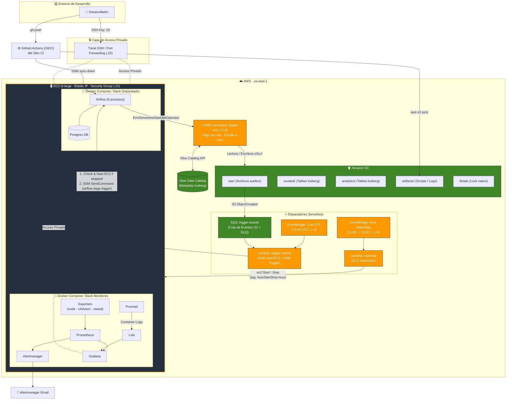

# Arquitectura de producción — pyspark_stack (híbrida en AWS)

> **Edición optimizada:** este documento describe responsabilidades, fronteras y flujos. Los
> procedimientos ejecutables viven en las guías 02 y 02b. Se corrigieron la semántica de DLQ, el
> alcance del endpoint S3 de la VPC y los permisos de Glue requeridos por Iceberg.
>
Referencia conceptual del único camino de producción. El *cómo* (Terraform, compose y monitoreo
listos para copiar) está en la [guía 02](02-produccion-aws-dataops-operativa-v3.md); este documento es el mapa y los
flujos.

Resumen: arquitectura híbrida. Airflow corre self-managed en una EC2 chica (`t3.large`) con Docker
como orquestador (Airflow + Postgres + monitoreo), y el cómputo Spark sale de la caja: corre en
**EMR Serverless** (pago por uso, escala a cero). Ya no hay HDFS en producción — todo el dato vive
en S3 como tablas **Apache Iceberg** (`curated/`/`analytics/`; `raw/` sigue siendo archivos sueltos)
sobre **Glue Data Catalog** (sin crawlers), que EMR Serverless y Athena comparten. Sobre esas tablas
corren **dbt** (transformaciones SQL versionadas) y **Great Expectations** (gate de calidad), ambos
disparados por Airflow. Lo complementan servicios AWS serverless: Lambda + EventBridge para disparar
DAGs por horario o por evento, para el auto start/stop, y con DLQ + AWS Budgets + Cost Anomaly
Detection + IAM Access Analyzer como gobierno de costo/resiliencia. Monitoreo con Prometheus +
Grafana + Alertmanager (métricas) y Loki + Promtail (logs). CI/CD con GitHub Actions + OIDC y
secretos en SSM/Secrets Manager. Usa EMR Serverless para el cómputo y Glue Data Catalog para Iceberg;
no usa MWAA, EMR-on-EC2 clásico ni crawlers de Glue.

## Configuración de referencia

| Parámetro | Valor | Dónde se fija |
|---|---|---|
| Región AWS | `us-east-1` | `var.aws_region`, guía 02 §5.1 |
| Availability Zone | `us-east-1a` (fija, para que el EBS `/data` no se recree) | `var.availability_zone`, guía 02 §5.1 |
| Instancia orquestadora | `t3.large` (Airflow + Postgres + monitoreo, sin Spark) | `var.instance_type`, guía 02 §5.1 |
| Motor Spark | EMR Serverless, `emr-7.5.0` | `release_label`, guía 02 §6.4 |
| Formato de tabla | Apache Iceberg sobre Glue Data Catalog | guía 02 §16.1 |
| IP del cliente | `${MY_IP_CIDR}` — única fuente de SSH (22) y HTTPS (443) | `var.my_ip_cidr`, guía 02 §5.1 |
| Dominio Airflow (opcional) | vacío por defecto = solo túnel SSH | `var.airflow_domain`, guía 02 §5.6 |
| Email de alertas | usado por DLQ, Budgets, Cost Anomaly Detection | `var.alert_email`, guía 02 §18 |

---

## 1. Diagrama

```text
════════════════════════════════════════════════════════════════════════════════════════════════════
                        ARQUITECTURA DE PRODUCCIÓN — pyspark_stack (AWS)
════════════════════════════════════════════════════════════════════════════════════════════════════

  💻 DESARROLLADOR (Laptop)
      │
      │  SSH Key (Puerto :22) + Túneles -L
      ▼
  🔒 ACCESO PRIVADO A UIs (Solo túnel SSH, nunca públicas)
      └── Airflow Web UI · Grafana · Prometheus · Loki
          (Spark UI vive en la consola de EMR Serverless; sin Jupyter en Prod)


 ───────────────────────────────────  AWS REGION: us-east-1  ───────────────────────────────────

  ⚡ DISPARADORES SERVERLESS (Triggers de Ejecución)
      │
      ├── [ Cron ETL ] ──────────► EventBridge (12:00 UTC, L-V) ──┐
      │                                                           │
      ├── [ Auto Start/Stop ] ───► EventBridge (11:00↑/22:00↓) ──┼─► Lambda: trigger-airflow
      │                                                           │    │ (SSM SendCommand)
      └── [ Event-Driven ] ──────► S3: ObjectCreated (raw/)       │    ▼
                                   │                              │  "airflow dags trigger"
                                   └──► SQS: trigger-events ──────┘

  ┌──────────────────────────────────────────────────────────────────────────────────────────────┐
  │ 🖥️ EC2 (t3.large) · Elastic IP · Docker Compose                                              │
  │                                                                                              │
  │   🐳 ORQUESTACIÓN                       📊 MONITOREO Y OBSERVABILIDAD                        │
  │   ├── Airflow (5 procesos)              ├── Prometheus ──► Alertmanager ──► 📧 Email         │
  │   └── Postgres DB (Backend)             ├── Grafana (Dashboards)                             │
  │                                         ├── Exporters (node, cAdvisor, statsd)               │
  │   [ EBS Volume: /data (gp3) ]           └── Promtail ──► Loki ──► Grafana (Logs)             │
  └───────────────────────────────┬──────────────────────────────────────────────────────────────┘
                                  │
                                  │ StartJobRun (EmrServerlessStartJobOperator)
                                  ▼
  ┌──────────────────────────────────────────────────────────────────────────────────────────────┐
  │ ⚡ EMR SERVERLESS (Spark Job Run)                                                             │
  │                                                                                              │
  │   • Aplicación PySpark / Iceberg · Pago por uso · Auto-escala a Cero                        │
  │   • Rol IAM Execution Least-Privilege                                                        │
  └───────────────────────────────┬──────────────────────────────────────────────────────────────┘
                                  │
                                  │ Lectura y Escritura (s3a://)
                                  ▼
  ┌──────────────────────────────────────────────────────────────────────────────────────────────┐
  │ 🪣 AMAZON S3 DATA LAKE & BUCKETS DE SOPORTE                                                   │
  │                                                                                              │
  │   ├── Data Lake:   s3://datalake/  ──► [ raw/ ]  ──► [ curated/ ]  ──► [ analytics/ ]      │
  │   │                                    (Archivos)     (Tablas Iceberg)   (Tablas Iceberg)    │
  │   ├── Artifacts:   s3://artifacts/ ──► [ scripts/ ]   [ logs/ ]                          │
  │   └── State:       s3://tfstate/   ──► Estado de Terraform (Lock Nativo S3)                 │
  └──────────────────────────────────────────────────────────────────────────────────────────────┘


 ────────────────────────────────────────────────────────────────────────────────────────────────
  🛡️ SEGURIDAD Y CONEXIÓN
  • Security Group: Ingress restringido EXCLUSIVAMENTE a tu IP pública en Puerto 22 (y 443 opt).
  • SSM Session Manager: Comandos remotos e invocación directa sin exponer APIs a Internet.
  • Credenciales: Cero Access Keys persistentes. Roles IAM e Instance Profiles dedicados.
════════════════════════════════════════════════════════════════════════════════════════════════════
```

### Versión Mermaid (se renderiza en GitHub / VS Code)




---

## 2. Componentes

| Componente | Dónde vive | Rol |
|---|---|---|
| Airflow (5 procesos) + Postgres | EC2 / Docker | Orquestación — dispara jobs Spark con `EmrServerlessStartJobOperator` |
| EMR Serverless (aplicación Spark) | AWS | Cómputo Spark bajo demanda |
| Rol de ejecución EMR Serverless | AWS | Permisos S3 del job (least-privilege) |
| Notebooks + papermill | EC2 / Docker | Ejecución programada de `.ipynb` desde DAGs (requiere instalar el provider — guía 02 §9.1); sin Jupyter interactivo en prod, exploración queda para el stack local |
| Prometheus + Alertmanager + Grafana + Loki | EC2 / Docker | Métricas, alertas y logs |
| node-exporter · cAdvisor · statsd-exporter · Promtail | EC2 / Docker | Exporters de host, contenedor, Airflow y logs |
| S3 data lake (raw / curated / analytics) | AWS | Almacenamiento durable — `curated/`/`analytics/` en formato **Iceberg** (raw/ sigue siendo archivos sueltos) |
| Glue Data Catalog | AWS | Catálogo de las tablas Iceberg — lo comparten Spark (EMR Serverless) y Athena, sin crawlers |
| Athena | AWS | Consumo SQL/BI + `MERGE`/time-travel sobre las tablas Iceberg (opcional, guía 02 §16) |
| dbt Core | EC2 (dispara Airflow) | Transformaciones SQL `curated → analytics`, target Athena o EMR Serverless según el caso (guía 02 §19) |
| Great Expectations | EC2 (dispara Airflow) | Gate de calidad de datos post-ETL, antes de promover `curated → analytics` (guía 02 §20) |
| OpenLineage | Airflow + dbt + Spark | Lineage hacia un backend HTTP autenticado; el transporte a archivo queda solo para evaluación |
| S3 artifacts | AWS | Scripts, logs, deploys, estado de dbt y eventos de lineage |
| SQS `trigger-events` | AWS | Cola primaria entre S3 y `trigger-airflow`: da el reintento automático si la EC2 está apagada (guía 02 §7.3) |
| Lambda `trigger-airflow` | AWS | Dispara DAGs vía SSM, con contrato de datos y auto-start de la EC2 |
| Lambda `startstop` | AWS | Prende y apaga la EC2 con guardia de DAGs activos |
| DLQ | AWS | SQS redrive para eventos S3; Scheduler DLQ para cron; destino async para invocaciones Lambda asíncronas |
| Rol OIDC `dbt_ci` (aparte del de deploy) | AWS + GitHub | Slim CI de dbt en cada PR, sin gate de aprobación, acotado a una database Glue `_ci` aislada de producción (guía 02 §11.1b) |
| SNS `alerts` | AWS | Destino de las alarmas de gobierno (DLQ, Budgets, Cost Anomaly) |
| EventBridge Scheduler | AWS | Cron de ETL y de start/stop |
| EC2 + EBS + Elastic IP + SG | AWS | Host del stack |
| IAM roles | AWS | Permisos least-privilege |
| S3 (tfstate) | AWS | Estado remoto de Terraform (lock con `use_lockfile`) |
| GitHub Actions + OIDC | AWS + GitHub | CI/CD: valida en PRs y despliega DAGs |
| Snapshots EBS (DLM) | AWS | Backups automáticos de `/data` |
| SSM Parameter Store / Secrets Manager | AWS | Secretos fuera del `.env` |
| AWS Budgets / Cost Anomaly Detection / Access Analyzer | AWS | Gobierno de costo y seguridad, gratis (guía 02 §18) |

> El Terraform de cada componente AWS y los archivos compose están, listos para copiar, en la
> [guía de producción](02-produccion-aws-dataops-operativa-v3.md), organizados sección por sección.

---

## 3. Flujos

### 3.1 Despliegue (una vez)
```
bootstrap (S3) → terraform apply (S3, EC2, IAM, Lambda, EventBridge, EIP)
→ rsync del proyecto a la EC2 (incluye docker-compose.prod.yml: standalone, sin Spark/HDFS)
→ docker compose -f docker-compose.prod.yml up -d --build
```

### 3.2 ETL disparado por EVENTO (event-driven)
```
Archivo llega a s3://datalake/raw/  →  S3 ObjectCreated  →  SQS (trigger-events)
  → Lambda trigger-airflow:
      1) contrato de datos (columnas esperadas, Range GET barato) — si falla, RECHAZA sin reintentar
      2) ¿EC2 running + SSM Online? no → ec2:StartInstances y devuelve error (SQS reintenta solo
         en ~6 min, ya con la EC2 arriba) · sí → SSM SendCommand → EC2:
      docker exec airflow-scheduler airflow dags trigger <dag> --conf '{bucket,key}'
  → DAG: EmrServerlessStartJobOperator(deferrable=True)
      → EMR Serverless lee s3a://…/raw → transforma → escribe s3a://…/curated
```
> Los DAGs lanzan Spark con `EmrServerlessStartJobOperator(deferrable=True)`. El triggerer espera
> sin ocupar un worker; no hace falta añadir un sensor separado para el mismo job.
>
> **Ya no se pierde en silencio si la EC2 está apagada.** S3 no invoca la Lambda directo: escribe
> en una cola SQS, y si el handler falla (EC2 todavía arrancando), el mensaje no se borra y vuelve
> a estar visible a los ~6 minutos — se reprocesa solo, sin intervención. Si falla 5 veces
> (~30 min), cae en la DLQ de la cola SQS primaria, con alarma → email. La
> alerta `DailyEtlMissing` (§3.4) sigue como red de seguridad de más arriba: por si el DAG corrió
> pero no produjo el resultado esperado, no solo por si nunca se disparó.
>
> **El retry es seguro, no duplica trabajo.** `airflow dags trigger` usa un `--run-id` determinístico
> (derivado de bucket+key, guía 02 §7.1): si el mismo archivo dispara el trigger dos veces —el
> reintento de arriba, o dos eventos S3 por algún motivo— Airflow rechaza el segundo intento de
> crear el mismo run en vez de duplicarlo. El DAG además tiene `max_active_runs=1`, así que ni
> siquiera un archivo distinto el mismo día dispara un segundo job de EMR en paralelo sobre el mismo
> `{{ ds }}`. Y la Lambda tiene `reserved_concurrent_executions=2`: un backfill de decenas de
> archivos no manda una avalancha de jobs contra el `maximum_capacity` de EMR Serverless (§6.4), los
> deja esperando en la cola.

### 3.3 ETL programado (cron)
```
EventBridge Scheduler (12:00 UTC, L-V — dentro de la ventana de encendido)
  →  Lambda trigger-airflow  →  SSM  →  Airflow dags trigger
```

### 3.4 Monitoreo (métricas + logs)
```
MÉTRICAS: node-exporter (host) · cAdvisor (contenedores) · statsd-exporter (Airflow)
  → Prometheus (scrape 15s)  → evalúa alerts.yml
  → Alertmanager  → email (INFRA: TargetDown, disco lleno, memoria · NEGOCIO: DAG falló, ETL diario no corrió [dead-man switch], job de EMR Serverless FAILED)
EMR SERVERLESS: métricas de job/aplicación vía CloudWatch · logs del driver/executors a
  s3://artifacts/emr/logs/ y/o CloudWatch Logs · estado visible en la task deferrable de Airflow
  · opcional: datasource CloudWatch en Grafana
LOGS:     Promtail (todos los contenedores)  →  Loki
Grafana ← Prometheus (métricas) + Loki (logs)   ·   dashboard "Overview" auto-provisionado
```

### 3.5 Ahorro (auto start/stop)
```
EventBridge Scheduler (11:00 UTC start / 22:00 UTC stop, L-V)
  → Lambda startstop  → ec2:StartInstances/StopInstances  (solo tag AutoStartStop=true)
Elastic IP mantiene la misma IP entre apagados.
```

### 3.6 CI/CD: local → servidor
```
laptop (edita dags/spark-apps/notebooks) → git push a main
  → GitHub Actions (OIDC, sin claves): CI valida (lint + terraform validate)
  → Deploy: aws s3 sync → s3://artifacts/deploy/  → SSM sync-down en la EC2
  → dag-processor detecta los DAGs (~30s) y corren solos (DAGS_ARE_PAUSED_AT_CREATION=False)
```

### 3.7 Ejecución de notebooks (papermill)
```
Notebook en ./notebooks (celda tag 'parameters')
  → DAG con PapermillOperator inyecta params y ejecuta el .ipynb
  → copia ejecutada (con outputs) a ./notebooks/notebook-output/
```
> El provider de papermill no viene en `requirements.txt`; hay que instalarlo según la
> [guía 02 §9.1](02-produccion-aws-dataops-operativa-v3.md#91-instalar-los-providers-de-airflow-amazon-papermill-y-sus-dependencias).

---

## 4. Red y seguridad

- **Ingress:** solo el puerto 22 (SSH) desde tu IP, más una excepción **opcional**: 443 (HTTPS)
  también restringido a tu IP si exponés la web de Airflow con TLS nativo (guía 02 §5.6 / guía
  02b §4.6; off por defecto). El resto de las UIs (Grafana, Prometheus, Loki) nunca se
  exponen a internet: se acceden por túnel SSH.
- **SSM Session Manager:** acceso e invocación de comandos (la Lambda dispara `airflow dags
  trigger`) sin abrir puertos ni exponer la API de Airflow.
- **Credenciales S3:** ninguna capa usa access keys en disco. Airflow usa el rol IAM de la EC2
  (instance profile) para operar S3 y disparar EMR Serverless; EMR Serverless usa su **propio rol
  de ejecución** least-privilege (`s3a://`, sin keys).
- **IAM least-privilege:** la Lambda de start/stop solo puede tocar instancias con
  `AutoStartStop=true`; la de trigger solo `ssm:SendCommand` sobre esa instancia. El rol de
  ejecución del job EMR Serverless queda acotado a los ARNs exactos del datalake y de artifacts
  (Get/Put/Delete + List/GetBucketLocation), CloudWatch Logs y las acciones de Glue necesarias
  sobre el catálogo, database y tablas Iceberg. El rol de la EC2 gana
  `emrserverless:StartJobRun/GetJobRun/StartApplication/GetApplication` scoped al ARN de la
  aplicación, y `iam:PassRole` del rol del job restringido por condición
  `iam:PassedToService = emr-serverless.amazonaws.com`.
- **S3:** buckets privados (`public_access_block`), cifrado en reposo (SSE), política solo-TLS y
  versionado. El **S3 VPC Gateway Endpoint** mantiene el tráfico EC2↔S3 en la red de AWS. No se
  aplica a EMR Serverless salvo que la aplicación use una configuración de red en tu VPC.
- **IMDSv2 + EBS:** metadata solo por IMDSv2 (`hop_limit` 2), volúmenes EBS cifrados, acceso al
  host solo por SSM (SG abre únicamente `:22` desde tu IP).
- **Logs de EMR Serverless:** cifrados y con retención definida (S3 y/o CloudWatch Logs).
- **Estado Terraform:** cifrado y versionado en S3; lock nativo de S3 (`use_lockfile`), sin DynamoDB.

---

## 5. Costo y capacidad de esta arquitectura (us-east-1)

> Precios aproximados on-demand, estimados en julio 2026 y sujetos a cambio — validá en
> [calculator.aws](https://calculator.aws). Escenario real: 2 GB/día, 3 corridas/semana (≈13/mes).

Desglose (producción con auto start/stop, 8 h × 22 días laborales):

| Ítem | auto start/stop (8h×22d) | 24/7 |
|---|---|---|
| EC2 `t3.large` (Airflow + Postgres + monitoreo) | ~$12 | ~$60 |
| EMR Serverless (pago por uso, ~13 corridas/mes) | ~$9 | ~$9 |
| EBS gp3 (root 40 + data 30) + snapshots DLM | ~$9 | ~$9 |
| S3 data lake + requests | ~$1.5 | ~$1.5 |
| IPv4 pública (EIP; AWS la cobra desde feb-2024, asociada o no) | ~$3.6 | ~$3.6 |
| Lambda + EventBridge + SSM | ~$0 (free tier) | ~$0 (free tier) |
| Athena (consumo SQL/BI, opcional) | ~$0 (opcional) | ~$0 (opcional) |
| **TOTAL** | **~$35/mes** | **~$83/mes** |

Desglose itemizado de EBS: root 40 ~$4, data 30 ~$3, snapshots ~$2. La EC2 ya no dimensiona por la
RAM de las JVMs de Spark (salieron a EMR Serverless): `t3.large` (2 vCPU / 8 GB) corre Airflow +
Postgres + monitoreo, que están casi idle en CPU → la familia burstable `t3` es la elección
correcta y más barata (antes se desaconsejaba `t3` porque las JVMs de Spark degradan en burstable
tras el start/stop; con Spark fuera de la caja ese motivo desaparece).

> **Nota.** A tu volumen exacto, EMR Serverless ronda ~$5 → total real ~$31 (start/stop) / ~$79
> (24/7). El auto start/stop ahora mueve **menos** la aguja que antes, porque desapareció la caja
> siempre-encendida de Spark: la diferencia entre $35 y $83 es solo la EC2 chica de Airflow.

El auto start/stop (Lambda `startstop` + EventBridge) sigue siendo una palanca, pero secundaria: el
cómputo pesado ya es pago por uso en EMR Serverless (escala a cero) y no depende de que la EC2 esté
prendida. El desglose ítem por ítem, con su Terraform, está en la
[guía de producción](02-produccion-aws-dataops-operativa-v3.md).

### Capacidad de procesamiento

La capacidad ya no es responsabilidad de la EC2: **EMR Serverless autoescala los workers por job**.
Para 2–5 GB alcanza una configuración chica, y maneja decenas o cientos de GB sin que redimensiones
nada — el techo de costo se pone con `maximum_capacity` en la aplicación (cold start ~1–2 min por
job, aceptable para ETL batch 3×/semana).

Esto reemplaza la vieja tabla de "escalá `instance_type`" (`m6i.2xlarge` / `r6i.2xlarge` /
`m6i.4xlarge`): con el cómputo en EMR Serverless no hay una sola máquina que redimensionar. Solo
para **TB sostenidos** un cluster dedicado (EMR-on-EC2 multi-nodo) sigue ganando, pero eso está
fuera del alcance de este proyecto.

---

## 6. Qué NO usa (y por qué)

| Servicio | Decisión | Motivo |
|---|---|---|
| **EMR Serverless** | ✅ Adoptado | El uso es chico e infrecuente (3×/sem, ~2–5 GB): una EC2 siempre prendida solo para tener Spark vivo no se justificaba. Pago por uso + escala a cero encaja |
| **MWAA** | ❌ No | Airflow managed no escala a cero (~$350+/mes fijos): caro a esta escala |
| **EMR-on-EC2 (clásico)** | ❌ No | Fleet de EC2 + recargo, pensado para TB sostenidos / multi-nodo |
| **Athena** | ✅ Opcional (adoptado) | Capa de consumo SQL/BI sobre las tablas Iceberg de `curated/`/`analytics/`, pago por consulta (~$5/TB → ~$0 a esta escala). Con Iceberg no es solo lectura: también `MERGE`/`UPDATE`/`DELETE` y time-travel (guía 02 §16.1). Se justifica si hay lectores SQL/BI, dbt (target Athena) o asserts de calidad en los DAGs; si el único consumidor es el próximo job Spark, no aporta |
| **Glue Data Catalog** | ✅ Adoptado (sin crawlers) | Es el catálogo de las tablas Iceberg: Spark (EMR Serverless) y Athena lo comparten. Iceberg registra/actualiza la metadata de tabla ahí solo, **sin crawlers ni jobs de Glue** — la tabla no se "descubre" escaneando S3, la escribe quien la crea (Spark o un `CREATE TABLE` de Athena) |
| **CloudWatch dashboards** | ❌ No (como viz primaria) | Monitoreo con Prometheus + Grafana (más portable y rico); CloudWatch se usa para métricas/logs de EMR Serverless |
| **HDFS en prod** | ❌ No | Reemplazado por S3 (`s3a://`); EMR Serverless lee/escribe S3 nativo |

No es un descarte dogmático: es un tradeoff con punto de cruce. Lo managed serverless (EMR
Serverless, Glue Python Shell, Lambda, Athena) es más barato y con menos ops en uso bajo o
esporádico; el self-managed gana cuando se consolidan varias cargas en una máquina ya paga y se
valora control, portabilidad y aprendizaje. Para **este** workload (chico e infrecuente) la
conclusión se inclina al pago por uso: por eso Spark pasó a EMR Serverless. La comparación de
costos, servicio por servicio y con punto de cruce, está en la
[guía de producción §2](02-produccion-aws-dataops-operativa-v3.md#2-costo).

---

## 7. Lakehouse (Iceberg) — adoptado

> Hasta hace poco esta sección era "mejoras futuras": Parquet suelto, sin catálogo. Ya no — se
> aplicó. Queda documentado acá porque cambia cómo se lee/escribe el dato, no solo qué servicio se
> prende.

**Qué cambió.** El ETL escribía `df.write.mode("overwrite").parquet(...)`: una carpeta por fecha,
sin atomicidad, sin forma de hacer un upsert sin reescribir todo. Ahora `curated/` y `analytics/`
son tablas **Apache Iceberg**: ACID, time-travel (`FOR VERSION AS OF`), `MERGE`/upsert incremental y
schema evolution — sin reescribir el pipeline desde cero.

**Por qué Iceberg y no Delta Lake** (la otra opción típica de lakehouse): Iceberg tiene integración
nativa con **Glue Data Catalog**, que este stack ya usa para Athena (§6). Eso significa que una tabla
que un job Spark de EMR Serverless escribe queda **inmediatamente disponible** para `MERGE`/`UPDATE`/
`DELETE`/time-travel **desde SQL en Athena**, no solo para lectura — Delta en Athena es
read-only (necesitarías Spark siempre para escribir). Con un solo motor de escritura (Spark) y dos de
lectura/escritura (Spark + Athena/dbt), Iceberg encaja mejor con este stack híbrido que Delta
path-based.

**Cómo queda montado** (detalle completo, Terraform y SQL: [guía 02 §16.1](02-produccion-aws-dataops-operativa-v3.md#161-tablas-iceberg-acid-time-travel-y-merge-desde-sql-sin-crawler) y [§6.4](02-produccion-aws-dataops-operativa-v3.md#64-cómputo-spark-emr-serverless)):
- El job Spark (EMR Serverless) escribe con `df.writeTo("glue_catalog.<db>.<tabla>")` en vez de
  `.write.parquet(...)`, usando el conector Iceberg embebido en el runtime `emr-7.5.0` (nada que
  instalar) apuntando al catálogo `GlueCatalog`.
- Ese mismo catálogo es el `aws_glue_catalog_database` que también usa Athena — una sola base de
  datos, sin crawlers: Iceberg registra/actualiza la metadata de tabla él solo en cada escritura.
- Desde Athena (engine v3) o desde **dbt** (§8, target `athena`) podés `SELECT`, `MERGE`, `UPDATE`,
  `DELETE` y consultar versiones anteriores de la misma tabla, sin tocar Spark.

**Mantenimiento — `OPTIMIZE`/`VACUUM` semanales, sin Spark.** Iceberg acumula snapshots y archivos
chicos con cada `MERGE`; sin compactación periódica, el *planning time* de las queries se degrada
solo, mes a mes. Un DAG semanal corre `OPTIMIZE ... REWRITE DATA USING BIN_PACK` y `VACUUM` vía
`AthenaOperator` — housekeeping, no parte del pipeline crítico. Detalle en
[guía 02 §16.1b](02-produccion-aws-dataops-operativa-v3.md#161b-mantenimiento-compactación-y-expiración-de-snapshots-auditoría-21).

---

## 8. dbt Core y Great Expectations — adoptados

Dos piezas más que se sumaron sobre las tablas Iceberg de §7, ambas disparadas por Airflow (nunca
un orquestador nuevo — sigue siendo el único). Detalle completo, Terraform y DAGs en la
[guía 02](02-produccion-aws-dataops-operativa-v3.md).

- **dbt Core** — transformaciones SQL versionadas `curated → analytics` mediante el target Athena.
  Los reprocesos pesados continúan como jobs PySpark de EMR Serverless orquestados por Airflow;
  EMR Serverless batch no expone por sí solo un endpoint SQL permanente para `dbt-spark`.
- **Great Expectations** — gate de calidad de datos: una task de Airflow corre un *checkpoint* sobre
  `curated/` después del ETL y antes de promoverlo a `analytics/`. Si falla, dispara la misma alerta
  de "DAG falló" que ya existe en Alertmanager (§3.4) — no es un canal de alertas nuevo, es una
  validación más estricta que el `SELECT count(*)` que ya había en Athena.

---

## 9. Gobierno, costo y resiliencia — adoptado

Cuatro piezas AWS-nativas que cierran huecos operativos que antes quedaban solo como advertencia en
el CI (`checkov` marcaba "Lambda sin DLQ" desde el día uno). Detalle en
[guía 02 §18](02-produccion-aws-dataops-operativa-v3.md#18-gobierno-costo-y-resiliencia-extras):

| Pieza | Qué resuelve |
|---|---|
| **DLQ por origen** | SQS redrive protege el camino S3; Scheduler DLQ protege cron; Lambda async destination protege invocaciones asíncronas directas |
| **AWS Budgets** | Aviso por email al 80%/100% del gasto mensual esperado — gratis |
| **Cost Anomaly Detection** | Detecta picos que no siguen el patrón histórico (p. ej. un job de EMR Serverless escalando workers de más) — gratis |
| **IAM Access Analyzer** | Detección temprana de recursos accesibles desde fuera de la cuenta — gratis, sin mantenimiento |

Todas notifican al mismo tema **SNS `alerts`**, con un único email de destino (`var.alert_email`).

---

## 10. Mejoras futuras

Lo que queda genuinamente fuera de alcance hoy — nada de esto está implementado, y ninguno se
justifica todavía a este volumen (~2 GB/día, 3 corridas/semana). Se listan para que quede explícito
que son decisiones tomadas, no huecos por descuido:

- **Alta disponibilidad de la EC2.** El diseño es de **un solo nodo**: si la instancia se cae fuera
  de la ventana de auto start/stop, nadie dispara los DAGs hasta que EventBridge la prenda de nuevo.
  Es la contrapartida directa de optimizar por costo (§5) sobre un workload chico — una segunda EC2
  en standby, o mover Airflow a algo gestionado, duplica el costo fijo para un beneficio que a este
  volumen no se nota. Se reconsideraría si el pipeline pasa a ser crítico de negocio.
- **Graviton (arm64).** La EC2 es `t3.large` (x86_64); `t4g.large` (arm64) es más barata a igual
  rendimiento, y casi todas las imágenes del stack (Postgres, Prometheus, Grafana, Loki, Promtail,
  node-exporter) publican multi-arch. Antes de migrar, confirmar arm64 en la imagen de Airflow y en
  cAdvisor — no verificado todavía.
- **Rotación automática de secretos.** Secrets Manager con rotación (guía 02 §13.1) está documentado
  pero comentado/opcional: hoy los secretos "fuertes" no rotan solos, se regeneran a mano si hace
  falta.
- **Postura de seguridad continua (GuardDuty / Security Hub / Config).** Access Analyzer (§9) cubre
  un caso puntual (recursos expuestos fuera de la cuenta); no hay detección de amenazas continua ni
  compliance-as-code. Para un proyecto de un solo operador probablemente no se justifica; sería la
  pieza que falta si esto crece a multi-usuario o multi-cuenta.

