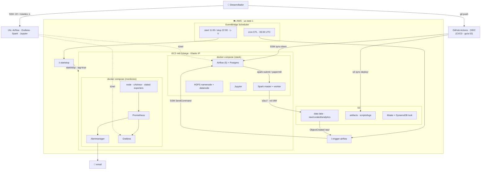

# Arquitectura de producción — pyspark_stack (híbrida en AWS)

Referencia de la arquitectura **implementada** en [`infra/prod/`](../infra/prod) +
[`docker-compose.prod.yml`](../docker-compose.prod.yml) + [`monitoring/`](../monitoring).

**Resumen:** el stack (Airflow + Spark + HDFS + Jupyter) corre *self-managed* en **una EC2** con
Docker. Alrededor, servicios AWS *serverless* lo complementan: **S3** como data lake, **Lambda +
EventBridge** para disparar los DAGs por horario o por evento. El monitoreo es **Prometheus +
Grafana + Alertmanager**. No usa MWAA, EMR ni Glue.

---

## 1. Diagrama

```
                                  ┌───────────────────────────────────────────┐
   Desarrollador                  │  AWS  (region us-east-1)                   │
      │  ssh -i key (22)          │                                           │
      │  + túneles -L             │   ┌─────────── EventBridge Scheduler ───┐  │
      ▼                           │   │  cron ETL      │  start/stop EC2     │  │
 ┌─────────┐  túnel SSH           │   └───────┬────────┴─────────┬──────────┘  │
 │ Grafana │◄───────────┐         │           ▼                  ▼             │
 │ Airflow │            │         │      ┌─────────┐        ┌──────────┐       │
 │ Jupyter │            │         │      │ Lambda  │        │ Lambda   │       │
 │ Spark   │            │         │      │ trigger │        │ startstop│       │
 └─────────┘            │         │      │ airflow │        └────┬─────┘       │
                        │         │      └────┬────┘             │ start/stop  │
                        │         │  SSM SendCommand             │ (tag=true)  │
                        │         │           │                  ▼             │
   ┌────────────────────┴─────────┼───────────▼──────────────────────────┐    │
   │  EC2  m6i.2xlarge  (Elastic IP)   docker compose                     │    │
   │  ┌──────────────────────────────────────────────────────────────┐   │    │
   │  │ Airflow (api·scheduler·dag-proc·triggerer·init) + Postgres     │   │    │
   │  │ Spark master + worker      HDFS namenode + datanode   Jupyter  │   │    │
   │  ├──────────────────────────────────────────────────────────────┤   │    │
   │  │ MONITOREO: Prometheus ─► Alertmanager ─► email                 │   │    │
   │  │            Grafana   node-exporter  cAdvisor  statsd-exporter  │   │    │
   │  └──────────────────────────────────────────────────────────────┘   │    │
   │        │ s3a:// (rol IAM, sin keys)        │ /data (EBS gp3)         │    │
   └────────┼───────────────────────────────────┴────────────────────────┘    │
            ▼                                                                   │
   ┌──────────────────┐        ┌──────────────────┐     ┌─────────────────┐    │
   │ S3 data lake     │        │ S3 artifacts     │     │ S3 + DynamoDB   │     │
   │ raw/curated/     │───────►│ scripts / logs   │     │ (tfstate+lock)  │     │
   │ analytics        │ evento │                  │     └─────────────────┘     │
   └────────┬─────────┘        └──────────────────┘                            │
            │ ObjectCreated (raw/) ─► Lambda trigger airflow                    │
            └───────────────────────────────────────────────────────────────  │
                                                                                │
   Security Group: SOLO 22 desde tu IP · UIs por túnel SSH · SSM sin puertos    │
   └────────────────────────────────────────────────────────────────────────  ┘
```

### Versión Mermaid (se renderiza en GitHub / VS Code)



---

## 2. Componentes

| Componente | Dónde vive | Rol | Archivo |
|---|---|---|---|
| Airflow (5 procesos) + Postgres | EC2 / Docker | Orquestación | [docker-compose.yml](../docker-compose.yml) |
| Spark master + worker | EC2 / Docker | Cómputo | [Dockerfile.spark](../Dockerfile.spark) |
| HDFS namenode + datanode | EC2 / Docker | Storage local | [docker-compose.yml](../docker-compose.yml) |
| Jupyter | EC2 / Docker | Notebooks interactivos | [Dockerfile.jupyter](../Dockerfile.jupyter) |
| Notebooks + papermill | EC2 / Docker | Ejecución programada de `.ipynb` desde DAGs | `dags/` · guía 02 §9 |
| Prometheus + Alertmanager + Grafana | EC2 / Docker | Monitoreo | [docker-compose.prod.yml](../docker-compose.prod.yml) |
| node-exporter · cAdvisor · statsd-exporter | EC2 / Docker | Métricas host/contenedor/Airflow | [monitoring/](../monitoring) |
| S3 data lake (raw/curated/analytics) | AWS | Almacenamiento durable | [infra/prod/s3.tf](../infra/prod/s3.tf) |
| S3 artifacts | AWS | Scripts + logs | [infra/prod/s3.tf](../infra/prod/s3.tf) |
| Lambda `trigger-airflow` | AWS | Dispara DAGs vía SSM | [infra/prod/orchestration.tf](../infra/prod/orchestration.tf) |
| Lambda `startstop` | AWS | Prende/apaga EC2 | [infra/prod/autostop.tf](../infra/prod/autostop.tf) |
| EventBridge Scheduler | AWS | Cron (ETL + start/stop) | orchestration.tf / autostop.tf |
| EC2 + EBS + Elastic IP + SG | AWS | Host del stack | [infra/prod/ec2.tf](../infra/prod/ec2.tf) |
| IAM roles | AWS | Permisos least-privilege | [infra/prod/iam.tf](../infra/prod/iam.tf) |
| S3 + DynamoDB (tfstate) | AWS | Estado Terraform remoto | [infra/bootstrap/main.tf](../infra/bootstrap/main.tf) |
| GitHub Actions + OIDC role | AWS + GitHub | CI/CD: valida y despliega (opcional) | guía 02 §11 |

---

## 3. Flujos

### 3.1 Despliegue (una vez)
```
bootstrap (S3+DynamoDB) → terraform apply (S3, EC2, IAM, Lambda, EventBridge, EIP)
→ rsync del proyecto a la EC2 → docker compose up -d --build
```

### 3.2 ETL disparado por EVENTO (event-driven)
```
Archivo llega a s3://datalake/raw/  →  S3 ObjectCreated
  → Lambda trigger-airflow  →  SSM SendCommand  →  EC2:
      docker exec airflow-scheduler airflow dags trigger <dag> --conf '{bucket,key}'
  → DAG: SparkSubmit → Spark lee s3a://…/raw → transforma → escribe s3a://…/curated
```

### 3.3 ETL programado (cron)
```
EventBridge Scheduler (06:00 UTC)  →  Lambda trigger-airflow  →  SSM  →  Airflow dags trigger
```

### 3.4 Monitoreo
```
node-exporter (host) · cAdvisor (contenedores) · statsd-exporter (Airflow) · Spark /metrics
  → Prometheus (scrape 15s)  → evalúa alerts.yml
  → Alertmanager  → email (críticas: TargetDown, disco lleno; warning: memoria, tasks fallidas)
Grafana ← Prometheus (dashboard "Overview" auto-provisionado)
```

### 3.5 Ahorro (auto start/stop)
```
EventBridge Scheduler (11:00 UTC start / 22:00 UTC stop, L-V)
  → Lambda startstop  → ec2:StartInstances/StopInstances  (solo tag AutoStartStop=true)
Elastic IP mantiene la misma IP entre apagados.
```

### 3.6 CI/CD: local → servidor (opcional, ver guía 02 §11)
```
laptop (edita dags/spark-apps/notebooks) → git push a main
  → GitHub Actions (OIDC, sin claves): CI valida (lint + terraform validate)
  → Deploy: aws s3 sync → s3://artifacts/deploy/  → SSM sync-down en la EC2
  → dag-processor detecta los DAGs (~30s) y corren solos (DAGS_ARE_PAUSED_AT_CREATION=False)
```

### 3.7 Ejecución de notebooks (papermill)
```
Notebook en ./notebooks (celda tag 'parameters')
  → DAG con PapermillOperator inyecta params y ejecuta el .ipynb
  → copia ejecutada (con outputs) a ./spark-apps/notebook-output/
```

---

## 4. Red y seguridad

- **Ingress:** solo el puerto **22 (SSH)** desde tu IP. Ninguna UI (Airflow, Grafana, Spark…)
  expuesta a internet — se acceden por **túnel SSH**.
- **SSM Session Manager:** acceso e invocación de comandos (la Lambda dispara `airflow dags
  trigger`) **sin abrir puertos** ni exponer la API de Airflow.
- **Credenciales S3:** Spark usa `s3a://` con el **rol IAM de la EC2** (instance profile). No hay
  access keys en disco.
- **IAM least-privilege:** la Lambda de start/stop solo puede tocar instancias con
  `AutoStartStop=true`; la de trigger solo `ssm:SendCommand` sobre esa instancia.
- **S3:** buckets privados (`public_access_block`), cifrado en reposo, política **solo-TLS**.
- **Estado Terraform:** cifrado y versionado en S3, lock en DynamoDB.

---

## 5. Costo aproximado (us-east-1)

| Item | US$/mes |
|---|---|
| EC2 `m6i.2xlarge` con **auto start/stop** (8h×22d) | ~70 |
| EBS gp3 (root 60 + data 200) | ~20 |
| S3 data lake (~50 GB) + requests | ~1.5 |
| Lambda + EventBridge + SSM | ~0 (free tier) |
| **Total** | **~90/mes** |

Sin auto start/stop (EC2 24/7) sería ~$300/mes. El monitoreo corre dentro de la EC2 (costo $0
adicional). Ver [docs/02-produccion-aws.md](02-produccion-aws.md) para la comparación con las
variantes serverless.

---

## 6. Qué NO usa (y por qué)

| Descartado | Motivo |
|---|---|
| **MWAA** | Airflow self-managed en EC2 = sin piso fijo (~$135/mes) ni límite de versión |
| **EMR / EMR Serverless** | Spark self-managed en EC2 (ya tenías el cluster) |
| **Glue Data Catalog** | El código usa `createOrReplaceTempView` (vistas temporales) — no hay tablas persistentes que catalogar |
| **CloudWatch dashboards** | Monitoreo con Prometheus + Grafana (más portable y rico) |

---

## 7. Mejoras futuras sugeridas

- **Grafana Loki + Promtail**: logs de Airflow/Spark dentro de Grafana (hoy solo métricas).
- **Snapshots EBS (DLM)**: backup automático de `/data` (HDFS + Postgres).
- **Spark History Server**: UI de jobs terminados (ya existe `Dockerfile.history`).
- **HDFS JMX exporter**: métricas ricas de HDFS en Prometheus.
- **CI/CD (GitHub Actions + OIDC)**: `terraform plan` en PRs + deploy de DAGs.
- **Secrets en SSM/Secrets Manager**: sacar Postgres/JWT/Grafana del `.env`.
- **Lakehouse (Iceberg/Delta) + Glue**: si migrás a tablas versionadas con `saveAsTable`.
