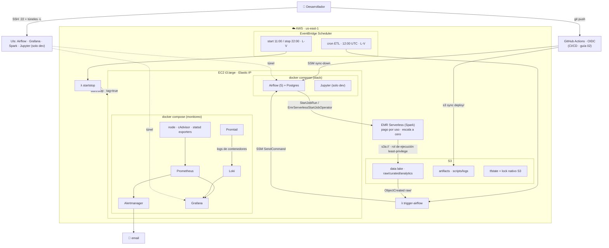

# Arquitectura de producción — pyspark_stack (híbrida en AWS)

Referencia conceptual del único camino de producción. El *cómo* (Terraform, compose y monitoreo
listos para copiar) está en la [guía 02](02-produccion-aws.md); este documento es el mapa y los
flujos.

Resumen: arquitectura híbrida. Airflow corre self-managed en una EC2 chica (`t3.large`) con Docker
como orquestador (Airflow + Postgres + monitoreo), y el cómputo Spark sale de la caja: corre en
**EMR Serverless** (pago por uso, escala a cero). Ya no hay HDFS en producción — todo el dato vive
en S3 (`s3a://` raw/curated/analytics) y EMR Serverless lo lee y escribe nativo. Lo complementan
servicios AWS serverless: S3 como data lake (`s3a://` con rol IAM) y Lambda + EventBridge para
disparar DAGs por horario o por evento y para el auto start/stop. Monitoreo con Prometheus +
Grafana + Alertmanager (métricas) y Loki + Promtail (logs). CI/CD con GitHub Actions + OIDC y
secretos en SSM/Secrets Manager. Usa EMR Serverless para el cómputo; no usa MWAA, EMR-on-EC2
clásico ni Glue.

---

## 1. Diagrama

```text
   DESARROLLADOR (laptop)
        │  ssh -i key (puerto 22)  +  túneles -L
        ▼
   UIs — solo por túnel SSH, nunca públicas:
        Airflow · Grafana · Spark · Jupyter (solo dev)


 ═══════════════════════════  AWS · us-east-1  ═══════════════════════════

   DISPARADORES (serverless) — dos caminos, ambos terminan disparando la EC2:

     cron ETL (12:00 UTC, L-V) ──────────►  Lambda trigger-airflow
                                                │  SSM SendCommand
                                                ▼  → "airflow dags trigger"

     start/stop (11:00 ↑ / 22:00 ↓, L-V) ─►  Lambda startstop
                                                │  ec2 start/stop
                                                ▼  (solo instancias tag=true)

   ┌─ EC2 · t3.large · Elastic IP · docker compose ────────────────────────
   │
   │   STACK (orquestador)             MONITOREO
   │   · Airflow (5) + Postgres        · Prometheus → Alertmanager → email
   │   · Jupyter (solo dev)            · Grafana (dashboards)
   │                                   · node-exporter · cAdvisor · statsd
   │                                   · Promtail → Loki → Grafana (logs)
   └───────────────────────────────────────────────────────────────────────
        │  StartJobRun (EmrServerlessStartJobOperator)   [ /data = EBS gp3, local ]
        ▼
   ┌─ EMR SERVERLESS (Spark) ───────────────────────────────
   │   aplicación SPARK · pago por uso · escala a cero
   └─────────────────────────────────────────────────────────
        │  s3a:// (rol de ejecución least-privilege)
        ▼
   ┌─ S3 DATA LAKE ─────────────
   │   raw/   curated/   analytics/
   └────────────────────────────
        │
        │  archivo nuevo en raw/  →  evento S3 "ObjectCreated"
        └───────────────────────►  Lambda trigger-airflow   (ciclo event-driven)

   Otros buckets:  S3 artifacts (scripts / logs)   ·   S3 tfstate (lock nativo S3)

   ─────────────────────────────────────────────────────────────────────────────
   SEGURIDAD:  el Security Group abre SOLO el puerto 22 desde tu IP (y 443,
               opcional, para la web de Airflow — guía 02 §5.6) ·
               el resto de las UIs va por túnel SSH · SSM opera sin abrir puertos
```

### Versión Mermaid (se renderiza en GitHub / VS Code)



---

## 2. Componentes

| Componente | Dónde vive | Rol |
|---|---|---|
| Airflow (5 procesos) + Postgres | EC2 / Docker | Orquestación — dispara jobs Spark con `EmrServerlessStartJobOperator` |
| EMR Serverless (aplicación Spark) | AWS | Cómputo Spark bajo demanda |
| Rol de ejecución EMR Serverless | AWS | Permisos S3 del job (least-privilege) |
| Jupyter | EC2 / Docker | Notebooks interactivos — bajo `profiles: ["dev"]`: en prod no arranca por defecto |
| Notebooks + papermill | EC2 / Docker | Ejecución programada de `.ipynb` desde DAGs (requiere instalar el provider — guía 02 §9.1) |
| Prometheus + Alertmanager + Grafana + Loki | EC2 / Docker | Métricas, alertas y logs |
| node-exporter · cAdvisor · statsd-exporter · Promtail | EC2 / Docker | Exporters de host, contenedor, Airflow y logs |
| S3 data lake (raw / curated / analytics) | AWS | Almacenamiento durable |
| S3 artifacts | AWS | Scripts, logs y deploys |
| Lambda `trigger-airflow` | AWS | Dispara DAGs vía SSM |
| Lambda `startstop` | AWS | Prende y apaga la EC2 |
| EventBridge Scheduler | AWS | Cron de ETL y de start/stop |
| EC2 + EBS + Elastic IP + SG | AWS | Host del stack |
| IAM roles | AWS | Permisos least-privilege |
| S3 (tfstate) | AWS | Estado remoto de Terraform (lock con `use_lockfile`) |
| GitHub Actions + OIDC | AWS + GitHub | CI/CD: valida en PRs y despliega DAGs |
| Snapshots EBS (DLM) | AWS | Backups automáticos de `/data` |
| SSM Parameter Store / Secrets Manager | AWS | Secretos fuera del `.env` |

> El Terraform de cada componente AWS y los archivos compose están, listos para copiar, en la
> [guía de producción](02-produccion-aws.md), organizados sección por sección.

---

## 3. Flujos

### 3.1 Despliegue (una vez)
```
bootstrap (S3) → terraform apply (S3, EC2, IAM, Lambda, EventBridge, EIP)
→ rsync del proyecto a la EC2 → docker compose up -d --build
```

### 3.2 ETL disparado por EVENTO (event-driven)
```
Archivo llega a s3://datalake/raw/  →  S3 ObjectCreated
  → Lambda trigger-airflow  →  SSM SendCommand  →  EC2:
      docker exec airflow-scheduler airflow dags trigger <dag> --conf '{bucket,key}'
  → DAG: EmrServerlessStartJobOperator → EMR Serverless lee s3a://…/raw → transforma
      → escribe s3a://…/curated  (EmrServerlessJobSensor espera el fin del job)
```
> Los DAGs lanzan Spark con `EmrServerlessStartJobOperator`
> (`airflow.providers.amazon.aws.operators.emr`) + `EmrServerlessJobSensor`, no con
> `spark-submit` local ni `BashOperator`. El Terraform de la aplicación EMR Serverless y del rol de
> ejecución está en la guía 02.
>
> Requiere la EC2 encendida: si está apagada por el auto start/stop (§3.5), el `SendCommand` no
> ejecuta y el evento se pierde en silencio. Dispará dentro de la ventana de encendido; la alerta
> `DailyEtlMissing` (§3.4) avisa si el ETL dejó de correr.

### 3.3 ETL programado (cron)
```
EventBridge Scheduler (12:00 UTC, L-V — dentro de la ventana de encendido)
  →  Lambda trigger-airflow  →  SSM  →  Airflow dags trigger
```

### 3.4 Monitoreo (métricas + logs)
```
MÉTRICAS: node-exporter (host) · cAdvisor (contenedores) · statsd-exporter (Airflow)
  → Prometheus (scrape 15s)  → evalúa alerts.yml
  → Alertmanager  → email (INFRA: TargetDown, disco lleno, memoria · NEGOCIO: DAG falló, ETL diario no corrió [dead-man switch], job de EMR Serverless FAILED)
EMR SERVERLESS: métricas de job/aplicación vía CloudWatch · logs del driver/executors a
  s3://artifacts/emr/logs/ y/o CloudWatch Logs · estado del job visible vía Airflow (EmrServerlessJobSensor)
  · opcional: datasource CloudWatch en Grafana
LOGS:     Promtail (todos los contenedores)  →  Loki
Grafana ← Prometheus (métricas) + Loki (logs)   ·   dashboard "Overview" auto-provisionado
```

### 3.5 Ahorro (auto start/stop)
```
EventBridge Scheduler (11:00 UTC start / 22:00 UTC stop, L-V)
  → Lambda startstop  → ec2:StartInstances/StopInstances  (solo tag AutoStartStop=true)
Elastic IP mantiene la misma IP entre apagados.
```

### 3.6 CI/CD: local → servidor
```
laptop (edita dags/spark-apps/notebooks) → git push a main
  → GitHub Actions (OIDC, sin claves): CI valida (lint + terraform validate)
  → Deploy: aws s3 sync → s3://artifacts/deploy/  → SSM sync-down en la EC2
  → dag-processor detecta los DAGs (~30s) y corren solos (DAGS_ARE_PAUSED_AT_CREATION=False)
```

### 3.7 Ejecución de notebooks (papermill)
```
Notebook en ./notebooks (celda tag 'parameters')
  → DAG con PapermillOperator inyecta params y ejecuta el .ipynb
  → copia ejecutada (con outputs) a ./notebooks/notebook-output/
```
> El provider de papermill no viene en `requirements.txt`; hay que instalarlo según la
> [guía 02 §9.1](02-produccion-aws.md#91-habilitar-papermill).

---

## 4. Red y seguridad

- **Ingress:** solo el puerto 22 (SSH) desde tu IP, más una excepción **opcional**: 443 (HTTPS)
  también restringido a tu IP si exponés la web de Airflow con TLS nativo (guía 02 §5.6 / guía
  02b §4.6; off por defecto). El resto de las UIs (Grafana, Prometheus, Loki, Jupyter…) nunca se
  exponen a internet: se acceden por túnel SSH.
- **SSM Session Manager:** acceso e invocación de comandos (la Lambda dispara `airflow dags
  trigger`) sin abrir puertos ni exponer la API de Airflow.
- **Credenciales S3:** ninguna capa usa access keys en disco. Airflow usa el rol IAM de la EC2
  (instance profile) para operar S3 y disparar EMR Serverless; EMR Serverless usa su **propio rol
  de ejecución** least-privilege (`s3a://`, sin keys).
- **IAM least-privilege:** la Lambda de start/stop solo puede tocar instancias con
  `AutoStartStop=true`; la de trigger solo `ssm:SendCommand` sobre esa instancia. El rol de
  ejecución del job EMR Serverless queda acotado a los ARNs exactos del datalake y de artifacts
  (Get/Put/Delete + List/GetBucketLocation) + CloudWatch Logs, **sin Glue**. El rol de la EC2 gana
  `emrserverless:StartJobRun/GetJobRun/StartApplication/GetApplication` scoped al ARN de la
  aplicación, y `iam:PassRole` del rol del job restringido por condición
  `iam:PassedToService = emr-serverless.amazonaws.com`.
- **S3:** buckets privados (`public_access_block`), cifrado en reposo (SSE), política solo-TLS,
  versionado. Un **S3 VPC Gateway Endpoint** (gratis) mantiene el tráfico EC2↔S3 y EMR
  Serverless↔S3 dentro de la red de AWS, sin salir a internet.
- **IMDSv2 + EBS:** metadata solo por IMDSv2 (`hop_limit` 2), volúmenes EBS cifrados, acceso al
  host solo por SSM (SG abre únicamente `:22` desde tu IP).
- **Logs de EMR Serverless:** cifrados y con retención definida (S3 y/o CloudWatch Logs).
- **Estado Terraform:** cifrado y versionado en S3; lock nativo de S3 (`use_lockfile`), sin DynamoDB.

---

## 5. Costo y capacidad de esta arquitectura (us-east-1)

> Precios aproximados on-demand, estimados en julio 2026 y sujetos a cambio — validá en
> [calculator.aws](https://calculator.aws). Escenario real: 2 GB/día, 3 corridas/semana (≈13/mes).

Desglose (producción con auto start/stop, 8 h × 22 días laborales):

| Ítem | auto start/stop (8h×22d) | 24/7 |
|---|---|---|
| EC2 `t3.large` (Airflow + Postgres + monitoreo) | ~$12 | ~$60 |
| EMR Serverless (pago por uso, ~13 corridas/mes) | ~$9 | ~$9 |
| EBS gp3 (root 40 + data 30) + snapshots DLM | ~$9 | ~$9 |
| S3 data lake + requests | ~$1.5 | ~$1.5 |
| IPv4 pública (EIP; AWS la cobra desde feb-2024, asociada o no) | ~$3.6 | ~$3.6 |
| Lambda + EventBridge + SSM | ~$0 (free tier) | ~$0 (free tier) |
| Athena (consumo SQL/BI, opcional) | ~$0 (opcional) | ~$0 (opcional) |
| **TOTAL** | **~$35/mes** | **~$83/mes** |

Desglose itemizado de EBS: root 40 ~$4, data 30 ~$3, snapshots ~$2. La EC2 ya no dimensiona por la
RAM de las JVMs de Spark (salieron a EMR Serverless): `t3.large` (2 vCPU / 8 GB) corre Airflow +
Postgres + monitoreo, que están casi idle en CPU → la familia burstable `t3` es la elección
correcta y más barata (antes se desaconsejaba `t3` porque las JVMs de Spark degradan en burstable
tras el start/stop; con Spark fuera de la caja ese motivo desaparece).

> **Nota.** A tu volumen exacto, EMR Serverless ronda ~$5 → total real ~$31 (start/stop) / ~$79
> (24/7). El auto start/stop ahora mueve **menos** la aguja que antes, porque desapareció la caja
> siempre-encendida de Spark: la diferencia entre $35 y $83 es solo la EC2 chica de Airflow.

El auto start/stop (Lambda `startstop` + EventBridge) sigue siendo una palanca, pero secundaria: el
cómputo pesado ya es pago por uso en EMR Serverless (escala a cero) y no depende de que la EC2 esté
prendida. El desglose ítem por ítem, con su Terraform, está en la
[guía de producción](02-produccion-aws.md).

### Capacidad de procesamiento

La capacidad ya no es responsabilidad de la EC2: **EMR Serverless autoescala los workers por job**.
Para 2–5 GB alcanza una configuración chica, y maneja decenas o cientos de GB sin que redimensiones
nada — el techo de costo se pone con `maximum_capacity` en la aplicación (cold start ~1–2 min por
job, aceptable para ETL batch 3×/semana).

Esto reemplaza la vieja tabla de "escalá `instance_type`" (`m6i.2xlarge` / `r6i.2xlarge` /
`m6i.4xlarge`): con el cómputo en EMR Serverless no hay una sola máquina que redimensionar. Solo
para **TB sostenidos** un cluster dedicado (EMR-on-EC2 multi-nodo) sigue ganando, pero eso está
fuera del alcance de este proyecto.

---

## 6. Qué NO usa (y por qué)

| Servicio | Decisión | Motivo |
|---|---|---|
| **EMR Serverless** | ✅ Adoptado | El uso es chico e infrecuente (3×/sem, ~2–5 GB): una EC2 siempre prendida solo para tener Spark vivo no se justificaba. Pago por uso + escala a cero encaja |
| **MWAA** | ❌ No | Airflow managed no escala a cero (~$350+/mes fijos): caro a esta escala |
| **EMR-on-EC2 (clásico)** | ❌ No | Fleet de EC2 + recargo, pensado para TB sostenidos / multi-nodo |
| **Athena** | ✅ Opcional (adoptado) | Capa de consumo SQL/BI sobre S3, pago por consulta (~$5/TB → ~$0 a esta escala). Requiere un catálogo mínimo; se resuelve con **partition projection** (una tabla DDL, sin crawlers). Se justifica si hay lectores SQL/BI o asserts de calidad en los DAGs; si el único consumidor es el próximo job Spark, no aporta |
| **Glue Data Catalog "pesado" (crawlers)** | ❌ No | El código usa vistas temporales / Delta path-based — no hay tablas que autodescubrir. El metastore por defecto de Athena *es* Glue Data Catalog: usar Athena adopta un catálogo mínimo (una tabla declarada a mano), pero **partition projection** evita crawlers y jobs de Glue |
| **CloudWatch dashboards** | ❌ No (como viz primaria) | Monitoreo con Prometheus + Grafana (más portable y rico); CloudWatch se usa para métricas/logs de EMR Serverless |
| **HDFS en prod** | ❌ No | Reemplazado por S3 (`s3a://`); EMR Serverless lee/escribe S3 nativo |

No es un descarte dogmático: es un tradeoff con punto de cruce. Lo managed serverless (EMR
Serverless, Glue Python Shell, Lambda, Athena) es más barato y con menos ops en uso bajo o
esporádico; el self-managed gana cuando se consolidan varias cargas en una máquina ya paga y se
valora control, portabilidad y aprendizaje. Para **este** workload (chico e infrecuente) la
conclusión se inclina al pago por uso: por eso Spark pasó a EMR Serverless. La comparación de
costos, servicio por servicio y con punto de cruce, está en la
[guía de producción §2](02-produccion-aws.md#2-costo).

---

## 7. Mejoras futuras

El diseño ya está completo. Observabilidad con logs (Loki), backups automáticos (snapshots EBS),
CI/CD, secretos gestionados e History Server están definidos en la
[guía 02](02-produccion-aws.md), listos para copiar (Terraform, `docker-compose.prod.yml` y
`monitoring/`): no requieren diseño adicional, pero se aplican al desplegar, no vienen en el repo
base. El History Server, en particular, viene comentado en el `docker-compose.yml` base.

La única evolución que queda fuera del alcance actual, y solo si el proyecto lo pide:

- **Lakehouse (Iceberg / Delta Lake).** Migrar de escrituras Parquet "sueltas" a tablas
  versionadas. Se detalla abajo.

### 7.1 Lakehouse (Iceberg / Delta Lake)

**Qué cambia.** Hoy el ETL escribe `df.write.mode("overwrite").parquet(...)`: una carpeta por
fecha, sin atomicidad. Un lakehouse lo reemplaza por una tabla versionada que suma ACID,
time-travel (rollback a versiones anteriores), MERGE/upsert (cargas incrementales en vez de
reprocesar todo) y schema evolution.

**Qué implica (3 piezas):** habilitar Delta/Iceberg en Spark vía `--packages` + configs, cambiar
la escritura a formato de tabla y decidir el catálogo. En producción estos `--packages` + configs
se pasan como `sparkSubmitParameters` del job de EMR Serverless (mismo Spark, misma sintaxis).
Ejemplo mínimo, path-based (sin catálogo, sin Glue), sobre el `sales_etl`:

```bash
# 1) habilitar Delta (mismos flags que van en sparkSubmitParameters del job EMR Serverless;
#    Spark → Scala 2.13; validá versión Delta compatible)
spark-submit --packages io.delta:delta-spark_2.13:4.0.0 \
  --conf spark.sql.extensions=io.delta.sql.DeltaSparkSessionExtension \
  --conf spark.sql.catalog.spark_catalog=org.apache.spark.sql.delta.catalog.DeltaCatalog  sales_etl_job.py
```

```python
# 2) escritura versionada (reemplaza al .parquet por fecha)
df_output.write.format("delta").mode("overwrite").save("s3a://…/curated/sales")

# 3) lo que habilita: time-travel, upsert incremental, evolución de esquema
spark.read.format("delta").option("versionAsOf", 3).load("s3a://…/curated/sales")     # rollback
from delta.tables import DeltaTable
DeltaTable.forPath(spark, "s3a://…/curated/sales").alias("t") \
  .merge(nuevos.alias("s"), "t.sale_id = s.sale_id") \
  .whenMatchedUpdateAll().whenNotMatchedInsertAll().execute()                          # upsert
```

**La decisión del catálogo.** El §6 descarta Glue porque hoy el código usa vistas temporales y no
hay tablas persistentes que catalogar; un lakehouse con `saveAsTable` cambiaría ese supuesto:

| Modo | Qué da | ¿Catálogo/Glue? |
|---|---|---|
| **Delta path-based** (ejemplo de arriba) | ACID + time-travel + MERGE + schema evolution entre jobs Spark | No — acceso por ruta; **cero** catálogo |
| **Athena + partition projection** | Lectura SQL/BI del `analytics/` desde motores externos, sin escribir Spark | Mínimo — una tabla DDL declarada a mano (el catálogo es Glue por defecto, pero **sin crawlers ni jobs de Glue**) |
| **`saveAsTable("curated.sales")`** | + llamar la tabla por nombre, descubrible por Athena/otros motores, autogestión de particiones | Sí — catálogo poblado por escritura (Glue, o self-hosted: Hive Metastore, Iceberg JDBC catalog sobre el Postgres existente, o REST) |

**Recomendación a esta escala:** Delta path-based sigue siendo el **default** para ACID/time-travel
entre jobs: da el 80% del beneficio (ACID, time-travel, upsert) con cero dependencia managed nueva.
Si además hace falta **lectura SQL/BI** del `analytics/`, **Athena + partition projection** es el
camino liviano: habilita consumo SQL sin Glue pesado (una tabla declarada a mano, sin crawlers),
manteniendo el principio de mínima dependencia managed — el "sin Glue" del §6 se reinterpreta como
"sin crawlers ni catálogo pesado", no como "cero catálogo". Así, `analytics/` (S3) queda consumible
por Athena → BI (QuickSight / Grafana / Metabase) sin tocar el pipeline. El `saveAsTable` + catálogo
poblado por escritura recién paga cuando varios motores leen lo mismo y hace falta autogestionar
particiones y descubrir tablas por nombre; y ni siquiera ahí obliga a Glue — un metastore propio
alcanza.
