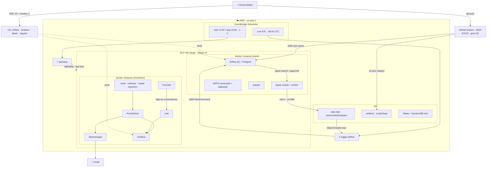

# Arquitectura de producción — pyspark_stack (híbrida en AWS)

Referencia conceptual del **único camino** de producción. El *cómo* (Terraform + compose
copy-paste, listos para `infra/prod/` + `docker-compose.prod.yml` + `monitoring/`) está en la
[guía 02](02-produccion-aws.md); este documento es el mapa y los flujos.

**Resumen:** el stack (Airflow + Spark + HDFS + Jupyter) corre *self-managed* en **una EC2** con
Docker. Alrededor, servicios AWS *serverless* lo complementan: **S3** como data lake (`s3a://` con
rol IAM), **Lambda + EventBridge** para disparar los DAGs por horario o por evento y para el auto
start/stop. El monitoreo es **Prometheus + Grafana + Alertmanager** (métricas) y **Loki + Promtail**
(logs), con **CI/CD (GitHub Actions + OIDC)** y **secretos en SSM/Secrets Manager**. No usa MWAA,
EMR ni Glue.

---

## 1. Diagrama

```
                                  ┌───────────────────────────────────────────┐
   Desarrollador                  │  AWS  (region us-east-1)                   │
      │  ssh -i key (22)          │                                           │
      │  + túneles -L             │   ┌─────────── EventBridge Scheduler ───┐  │
      ▼                           │   │  cron ETL      │  start/stop EC2     │  │
 ┌─────────┐  túnel SSH           │   └───────┬────────┴─────────┬──────────┘  │
 │ Grafana │◄───────────┐         │           ▼                  ▼             │
 │ Airflow │            │         │      ┌─────────┐        ┌──────────┐       │
 │ Jupyter │            │         │      │ Lambda  │        │ Lambda   │       │
 │ Spark   │            │         │      │ trigger │        │ startstop│       │
 └─────────┘            │         │      │ airflow │        └────┬─────┘       │
                        │         │      └────┬────┘             │ start/stop  │
                        │         │  SSM SendCommand             │ (tag=true)  │
                        │         │           │                  ▼             │
   ┌────────────────────┴─────────┼───────────▼──────────────────────────┐    │
   │  EC2  m6i.xlarge  (Elastic IP)    docker compose                     │    │
   │  ┌──────────────────────────────────────────────────────────────┐   │    │
   │  │ Airflow (api·scheduler·dag-proc·triggerer·init) + Postgres     │   │    │
   │  │ Spark master + worker      HDFS namenode + datanode   Jupyter  │   │    │
   │  ├──────────────────────────────────────────────────────────────┤   │    │
   │  │ MONITOREO: Prometheus ─► Alertmanager ─► email                 │   │    │
   │  │   Grafana  node-exporter  cAdvisor  statsd-exporter            │   │    │
   │  │   LOGS: Promtail ─► Loki ─► Grafana                            │   │    │
   │  └──────────────────────────────────────────────────────────────┘   │    │
   │        │ s3a:// (rol IAM, sin keys)        │ /data (EBS gp3)         │    │
   └────────┼───────────────────────────────────┴────────────────────────┘    │
            ▼                                                                   │
   ┌──────────────────┐        ┌──────────────────┐     ┌─────────────────┐    │
   │ S3 data lake     │        │ S3 artifacts     │     │ S3 + DynamoDB   │     │
   │ raw/curated/     │───────►│ scripts / logs   │     │ (tfstate+lock)  │     │
   │ analytics        │ evento │                  │     └─────────────────┘     │
   └────────┬─────────┘        └──────────────────┘                            │
            │ ObjectCreated (raw/) ─► Lambda trigger airflow                    │
            └───────────────────────────────────────────────────────────────  │
                                                                                │
   Security Group: SOLO 22 desde tu IP · UIs por túnel SSH · SSM sin puertos    │
   └────────────────────────────────────────────────────────────────────────  ┘
```

### Versión Mermaid (se renderiza en GitHub / VS Code)



---

## 2. Componentes

| Componente | Dónde vive | Rol |
|---|---|---|
| Airflow (5 procesos) + Postgres | EC2 / Docker | Orquestación |
| Spark master + worker | EC2 / Docker | Cómputo |
| HDFS namenode + datanode | EC2 / Docker | Storage local de trabajo |
| Jupyter | EC2 / Docker | Notebooks interactivos |
| Notebooks + papermill | EC2 / Docker | Ejecución programada de `.ipynb` desde DAGs |
| Prometheus + Alertmanager + Grafana + Loki | EC2 / Docker | Métricas, alertas y logs |
| node-exporter · cAdvisor · statsd-exporter · Promtail | EC2 / Docker | Exporters de host, contenedor, Airflow y logs |
| S3 data lake (raw / curated / analytics) | AWS | Almacenamiento durable |
| S3 artifacts | AWS | Scripts, logs y deploys |
| Lambda `trigger-airflow` | AWS | Dispara DAGs vía SSM |
| Lambda `startstop` | AWS | Prende y apaga la EC2 |
| EventBridge Scheduler | AWS | Cron de ETL y de start/stop |
| EC2 + EBS + Elastic IP + SG | AWS | Host del stack |
| IAM roles | AWS | Permisos least-privilege |
| S3 + DynamoDB (tfstate) | AWS | Estado remoto de Terraform |
| GitHub Actions + OIDC | AWS + GitHub | CI/CD: valida en PRs y despliega DAGs |
| Snapshots EBS (DLM) | AWS | Backups automáticos de `/data` |
| SSM Parameter Store / Secrets Manager | AWS | Secretos fuera del `.env` |

> El Terraform de cada componente AWS y los archivos compose están, listos para copiar, en la
> [guía de producción](02-produccion-aws.md), organizados sección por sección.

---

## 3. Flujos

### 3.1 Despliegue (una vez)
```
bootstrap (S3+DynamoDB) → terraform apply (S3, EC2, IAM, Lambda, EventBridge, EIP)
→ rsync del proyecto a la EC2 → docker compose up -d --build
```

### 3.2 ETL disparado por EVENTO (event-driven)
```
Archivo llega a s3://datalake/raw/  →  S3 ObjectCreated
  → Lambda trigger-airflow  →  SSM SendCommand  →  EC2:
      docker exec airflow-scheduler airflow dags trigger <dag> --conf '{bucket,key}'
  → DAG: SparkSubmit → Spark lee s3a://…/raw → transforma → escribe s3a://…/curated
```

### 3.3 ETL programado (cron)
```
EventBridge Scheduler (06:00 UTC)  →  Lambda trigger-airflow  →  SSM  →  Airflow dags trigger
```

### 3.4 Monitoreo (métricas + logs)
```
MÉTRICAS: node-exporter (host) · cAdvisor (contenedores) · statsd-exporter (Airflow) · Spark /metrics
  → Prometheus (scrape 15s)  → evalúa alerts.yml
  → Alertmanager  → email (críticas: TargetDown, disco lleno; warning: memoria, tasks fallidas)
LOGS:     Promtail (todos los contenedores)  →  Loki
Grafana ← Prometheus (métricas) + Loki (logs)   ·   dashboard "Overview" auto-provisionado
```

### 3.5 Ahorro (auto start/stop)
```
EventBridge Scheduler (11:00 UTC start / 22:00 UTC stop, L-V)
  → Lambda startstop  → ec2:StartInstances/StopInstances  (solo tag AutoStartStop=true)
Elastic IP mantiene la misma IP entre apagados.
```

### 3.6 CI/CD: local → servidor
```
laptop (edita dags/spark-apps/notebooks) → git push a main
  → GitHub Actions (OIDC, sin claves): CI valida (lint + terraform validate)
  → Deploy: aws s3 sync → s3://artifacts/deploy/  → SSM sync-down en la EC2
  → dag-processor detecta los DAGs (~30s) y corren solos (DAGS_ARE_PAUSED_AT_CREATION=False)
```

### 3.7 Ejecución de notebooks (papermill)
```
Notebook en ./notebooks (celda tag 'parameters')
  → DAG con PapermillOperator inyecta params y ejecuta el .ipynb
  → copia ejecutada (con outputs) a ./spark-apps/notebook-output/
```

---

## 4. Red y seguridad

- **Ingress:** solo el puerto **22 (SSH)** desde tu IP. Ninguna UI (Airflow, Grafana, Spark…)
  expuesta a internet — se acceden por **túnel SSH**.
- **SSM Session Manager:** acceso e invocación de comandos (la Lambda dispara `airflow dags
  trigger`) **sin abrir puertos** ni exponer la API de Airflow.
- **Credenciales S3:** Spark usa `s3a://` con el **rol IAM de la EC2** (instance profile). No hay
  access keys en disco.
- **IAM least-privilege:** la Lambda de start/stop solo puede tocar instancias con
  `AutoStartStop=true`; la de trigger solo `ssm:SendCommand` sobre esa instancia.
- **S3:** buckets privados (`public_access_block`), cifrado en reposo, política **solo-TLS**.
- **Estado Terraform:** cifrado y versionado en S3, lock en DynamoDB.

---

## 5. Costo y capacidad de esta arquitectura (us-east-1)

> Precios **aproximados** on-demand, sujetos a cambio — validá en
> [calculator.aws](https://calculator.aws). Escenario base: ~1 h de Spark/día, ~50 GB en el lake.

**Desglose (producción con auto start/stop, 8 h × 22 días laborales):**

| Item | Detalle | US$/mes |
|---|---|---|
| EC2 `m6i.xlarge` | 4 vCPU / 16 GB, encendida solo en horario | ~34 |
| EBS gp3 root 40 GB | disco del SO | ~4 |
| EBS gp3 data 200 GB | `/data` = HDFS + Postgres + Prometheus/Loki | ~16 |
| Snapshots EBS (DLM) | 7 días de retención de `/data` | ~2 |
| S3 data lake | ~50 GB + requests (con lifecycle a IA/Glacier) | ~1.5 |
| Elastic IP | gratis mientras está asociada a una instancia | ~0 |
| Lambda + EventBridge + SSM | trigger-airflow + startstop (free tier) | ~0 |
| Monitoreo (Prom/Grafana/Loki) | corre dentro de la misma EC2 | ~0 |
| **Total** | | **~58/mes** |

El tamaño de la EC2 lo manda la **RAM de las JVMs + Airflow + monitoreo**, no el dato (~50 MB es
trivial). `m6i.xlarge` (16 GB) corre el stack completo; por eso alcanza y se usa la familia `m6i`
(CPU constante) para que el rendimiento no caiga tras cada apagado/encendido.

**Escenarios de encendido** (lo único que mueve la aguja es cuánto está prendida la EC2):

| Escenario | Cómputo EC2 | Total aprox. |
|---|---|---|
| **Prod con auto start/stop** (8h×22d) | ~$34 | **~$58/mes** |
| EC2 **24/7** (sin apagar) | ~$140 | ~$164/mes |
| **Dev-lite** (`t3.large`, solo Spark+Jupyter, `docker-compose.dev.yml`) | ~$12 | **~$17/mes** |

El **auto start/stop** (Lambda `startstop` + EventBridge) es la palanca principal: convierte ~$140
fijos en ~$34. El resto (almacenamiento + servicios serverless) es marginal y casi constante. El
desglose ítem por ítem, con su Terraform, está en la [guía de producción](02-produccion-aws.md).

### Capacidad de procesamiento

**No hay un muro duro:** Spark procesa por particiones y **derrama a disco** lo que no cabe en RAM,
así que el límite no es un tope fijo sino **velocidad + disco**. Con la config de esta máquina
(`m6i.xlarge`; el worker ofrece **3 GB / 2 cores**; `/data` = 200 GB gp3 compartido con HDFS):

| Tamaño por job | Comportamiento | Veredicto |
|---|---|---|
| hasta ~1–2 GB | todo en memoria, sin *spill* | ⚡ rápido, ideal |
| ~2–20 GB | ETL normal (filtros, agregaciones, joins moderados); derrama algo | ✅ bien, minutos |
| ~20–50 GB | funciona pero lento; *shuffle* pesado, solo 2 tareas en paralelo | ⚠️ tolerable sin apuro |
| ~50–100 GB | solo si es ETL "narrow" (sin joins/groupBy grandes) | ⚠️ al filo |
| > 100 GB | runtimes largos, presión de disco | ❌ escalar la máquina/cluster |

**Lo que mueve el límite** no es tanto el tamaño como el tipo de operación: las *narrow* (map,
filter, `select`) escurren casi ilimitado; las *wide* (join, `groupBy`, `orderBy`, window) hacen
*shuffle* y son las que topan en memoria/disco. Con solo 2 cores el freno es tanto de **tiempo**
como de capacidad. **Referencia:** un job de ~50 MB usa <0.1% de esta máquina (≈1000x de margen).

**Si necesitás 20–50 GB "con normalidad" (o más), escalá la instancia** (mismo diseño; solo cambia
la variable `instance_type` en la guía de producción):

| Instancia | vCPU / RAM | Rango cómodo por job | Costo* |
|---|---|---|---|
| `m6i.xlarge` (actual) | 4 / 16 GB | hasta ~20 GB | ~$34/mes |
| **`m6i.2xlarge`** | 8 / 32 GB | **~20–50 GB con soltura**, pico ~100 GB | ~$68/mes |
| `r6i.2xlarge` (memory-optimized) | 8 / 64 GB | ~50–100 GB, ideal para joins/shuffles pesados | ~$90/mes |
| `m6i.4xlarge` | 16 / 64 GB | ~100–200 GB | ~$135/mes |

*Con auto start/stop (8h×22d). Al escalar, subí también lo que ofrece el worker de Spark
(`--memory` / `--cores`, en la guía de producción). Para datos grandes **recurrentes** (>200 GB),
un cluster multi-nodo rinde mejor que una sola máquina — ver los motivos en la sección anterior.

---

## 6. Qué NO usa (y por qué)

| Descartado | Motivo |
|---|---|
| **MWAA** | Airflow self-managed en EC2 = sin piso fijo (~$135/mes) ni límite de versión |
| **EMR / EMR Serverless** | Spark self-managed en EC2 (ya tenías el cluster) |
| **Glue Data Catalog** | El código usa `createOrReplaceTempView` (vistas temporales) — no hay tablas persistentes que catalogar |
| **CloudWatch dashboards** | Monitoreo con Prometheus + Grafana (más portable y rico) |

---

## 7. Mejoras futuras

El stack ya está completo. Observabilidad con logs (Loki), backups automáticos (snapshots EBS),
CI/CD, secretos gestionados e History Server están **definidos e implementados** en la guía de
producción — no son pendientes. La lista de componentes de arriba los cubre todos.

La única evolución que queda fuera del alcance actual, y solo si el proyecto lo pide:

- **Lakehouse (Iceberg / Delta Lake).** Migrar de vistas temporales a tablas versionadas
  (`saveAsTable`). Reintroduciría un catálogo de datos tipo Glue, descartado a propósito por las
  razones de la sección anterior.
