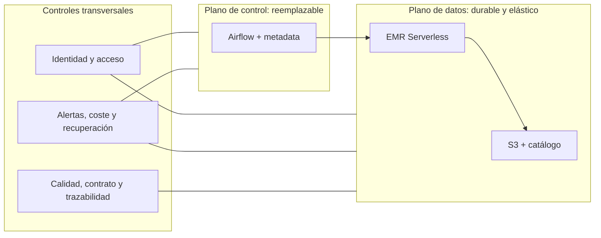
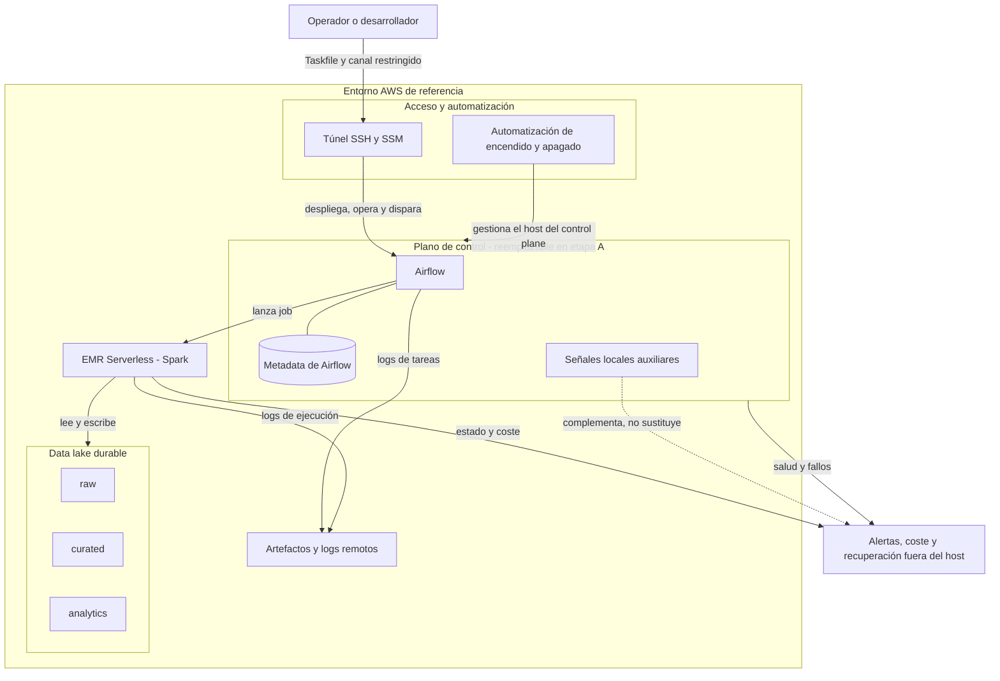

# Arquitectura de producción — decisiones y límites

> **En este documento: LEER, ~10 min.** No hay comandos, tamaños, precios ni recetas.
> **Salís con**: el alcance de cada plano, los compromisos aceptados y el criterio para cambiar
> de arquitectura.

La arquitectura responde **por qué y hasta dónde**; la [guía 02](02-produccion-aws-terraform.md)
responde **cómo materializar y operar**. Los [ADR](adr/README.md) son el registro normativo de cada
decisión: un cambio de arquitectura requiere un ADR que la sustituya y su actualización en la guía.

> [!IMPORTANT]
> Esta es una referencia de diseño. El checkout documental no materializa el stack local ni los
> artefactos AWS descritos por la guía 02. El estado efectivo vive en la
> [matriz de documentación](README.md); cada entorno debe ejecutar sus propios checkpoints.

## 1. Alcance y fronteras

El diseño separa aquello que persiste y escala del proceso que lo coordina:

```mermaid
flowchart LR
    subgraph control[Plano de control: reemplazable]
        airflow[Airflow + metadata]
    end
    subgraph data[Plano de datos: durable y elástico]
        storage[S3 + catálogo]
        compute[EMR Serverless]
    end
    subgraph guardrails[Controles transversales]
        access[Identidad y acceso]
        signal[Alertas, coste y recuperación]
        quality[Calidad, contrato y trazabilidad]
    end

    airflow --> compute --> storage
    access --- control
    access --- data
    signal --- control
    signal --- data
    quality --- data
```

### Vista de componentes y flujos de referencia

La vista anterior explica los límites. Esta segunda vista muestra cómo se relacionan los componentes
principales del diseño de referencia; no es inventario de recursos desplegados ni receta de
implementación. Para el estado efectivo, prevalece la [matriz de documentación](README.md).

```mermaid
flowchart TD
    operator[Operador o desarrollador]
    alerts[Alertas, coste y recuperación fuera del host]

    subgraph aws[Entorno AWS de referencia]
        subgraph operations[Acceso y automatización]
            access[Túnel SSH y SSM]
            lifecycle[Automatización de encendido y apagado]
        end

        subgraph control_plane[Plano de control - reemplazable en etapa A]
            airflow[Airflow]
            metadata[(Metadata de Airflow)]
            local_signal[Señales locales auxiliares]
            airflow --- metadata
        end

        emr[EMR Serverless - Spark]

        subgraph lake[Data lake durable]
            raw[raw]
            curated[curated]
            analytics[analytics]
        end
        artifacts[Artefactos y logs remotos]
    end

    operator -->|Taskfile y canal restringido| access
    access -->|despliega, opera y dispara| airflow
    lifecycle -->|gestiona el host del control plane| control_plane
    airflow -->|lanza job| emr
    emr -->|lee y escribe| lake
    airflow -->|logs de tareas| artifacts
    emr -->|logs de ejecución| artifacts
    control_plane -->|salud y fallos| alerts
    emr -->|estado y coste| alerts
    local_signal -.->|complementa, no sustituye| alerts
```

Lectura del flujo: el operador materializa y opera la plataforma con el Taskfile por canales
restringidos. Airflow delega el cómputo en EMR Serverless, que lee y escribe el data lake. El
almacenamiento durable y las señales críticas no dependen del host del plano de control. La guía
actual no materializa ingesta por eventos, SQS/DLQ, catálogo Glue ni un pipeline CI/CD; incorporarlos
requiere ampliar primero la arquitectura y la guía.

| Frontera | Decisión | Consecuencia deliberada |
|---|---|---|
| Plano de control | Airflow y su metadata comienzan juntos en un único host reemplazable | Hay un SPOF aceptado en etapa A; no se resuelve añadiendo contenedores al mismo host |
| Plano de datos | Almacenamiento durable y cómputo Spark bajo demanda quedan fuera del host de Airflow | El coste de Spark sigue al uso y la caída del orquestador no implica pérdida de datos |
| Disparo y acceso | La operación no depende de exponer públicamente la API de Airflow | El recorrido usa túnel SSH/SSM y acceso HTTPS opcional restringido al `/32` del operador |
| Señal crítica | Las alertas que deben sobrevivir al host viven fuera de él | Las herramientas de observabilidad locales son auxiliares, no un sustituto |

## 2. Decisión por etapas

| Etapa | Se usa cuando | Decisión | Límite que permanece |
|---|---|---|---|
| **A · Base de coste controlado** | Un equipo, batch con volumen bajo o irregular y RTO de horas | Plano de control single-node; plano de datos serverless | No promete alta disponibilidad del orquestador |
| **B · Control plane resiliente** | El RTO/RPO, varios equipos u operación fuera de horario ya no toleran el SPOF | Migrar Airflow/metadata a una opción HA gestionada | Calidad, gobierno y recuperación siguen siendo responsabilidad del producto de datos |
| **C · Multi-dominio o regulada** | PII sensible, auditoría, acceso granular o dominios múltiples | Separar cuentas y reforzar gobierno, claves y backups | Exige un modelo operativo; no se obtiene al activar un servicio aislado |

El volumen por sí solo no obliga a avanzar de etapa. El disparador es el riesgo aceptado: SLO,
RTO/RPO, clasificación de datos, número de operadores y coste de una interrupción.

## 3. Invariantes de diseño

- El cómputo Spark no comparte el host del orquestador.
- El almacenamiento de datos no depende de discos efímeros del plano de control.
- Una identidad tiene permisos mínimos para una responsabilidad; no se distribuyen access keys.
- Todo DAG y job es idempotente; cualquier disparo automático futuro debe definir reintento y recuperación antes de procesar datos reales.
- Ningún dataset se promueve sin owner, contrato, validaciones y un procedimiento de reversión.
- Un backup no cuenta como recuperación hasta que se prueba contra el RPO/RTO acordado.
- Un presupuesto, una alerta y un responsable son parte del sistema, no anexos operativos.

Estas invariantes no prescriben herramientas adicionales. Si una implementación las incumple, se
debe justificar explícitamente en un ADR y en el gate de producción.

## 4. Decisiones ratificadas

| Decisión | Por qué existe | Registro canónico |
|---|---|---|
| Spark fuera del control plane | Evitar cómputo ocioso y aislar recursos del orquestador | [ADR-001](adr/ADR-001-emr-serverless-para-spark.md) |
| Control plane single-node en A | Coste y complejidad proporcionales al SLO inicial | [ADR-002](adr/ADR-002-plano-de-control-single-node.md) |
| Operación privada, sin API pública de automatización | Reducir superficie de exposición; la variante event-driven quedó diferida | [ADR-003](adr/ADR-003-disparo-por-ssm-no-api-http.md) (alcance revisado) |
| State de Terraform con lock nativo de S3 | Estado único y bloqueo sin servicio adicional | [ADR-004](adr/ADR-004-backend-s3-con-use-lockfile.md) |
| Infraestructura compuesta por entorno y módulos | Límites claros entre componentes y contratos explícitos | [ADR-005](adr/ADR-005-composicion-envs-modules.md) |
| El creador de un recurso concede su acceso | Reducir dependencias cruzadas y permisos implícitos | [ADR-006](adr/ADR-006-el-modulo-que-crea-otorga.md) |
| Contexto operativo desde outputs | Eliminar IDs, IPs y nombres copiados a mano | [ADR-007](adr/ADR-007-contrato-de-variables-por-output.md) |
| Apagado consciente de jobs | No sacrificar ejecuciones para ahorrar coste | [ADR-008](adr/ADR-008-apagado-job-aware.md) |
| Evolución por etapas y gates | Hacer explícito cuándo A deja de ser suficiente | [ADR-009](adr/ADR-009-arquitectura-por-etapas-y-gates-de-produccion.md) |

## 5. Condiciones para datos reales

La etapa A no se autoriza con un despliegue exitoso. Antes de activar eventos o datos reales debe
existir evidencia de los siguientes resultados:

| Resultado | Pregunta que debe poder responderse |
|---|---|
| Propiedad y clasificación | ¿Quién responde por cada dataset, su PII, retención y consumidores? |
| Calidad y promoción | ¿Qué impide que un lote inválido llegue a datos curados y cómo se revierte? |
| Recuperación | ¿Se probó restaurar dentro del RPO/RTO aceptado? |
| Operación | ¿Un fallo llega a un responsable y puede reprocesarse de forma segura? |
| Coste | ¿Qué límite, señal y owner detienen o investigan un incremento anómalo? |
| Seguridad | ¿El acceso, los cambios de control y el ciclo de parches tienen dueño y evidencia? |

El detalle de controles y la evidencia requerida están en la guía 02: [gate de producción (§1.2)](02-produccion-aws-terraform.md#12-gate-de-producción-qué-falta-y-qué-no-se-negocia), [runbook (§10.8)](02-produccion-aws-terraform.md#108-runbook-de-puesta-en-producción), [calidad (§10.9)](02-produccion-aws-terraform.md#109-calidad-de-datos), [recuperación (§10.10.3)](02-produccion-aws-terraform.md#10103-recuperación) y [observabilidad (§11)](02-produccion-aws-terraform.md#11-observabilidad-prometheus-grafana-y-loki).

## 6. Dónde vive cada detalle

| Necesidad | Fuente de verdad |
|---|---|
| Arquitectura, límites, criterios de evolución y trade-offs | Este documento y los [ADR](adr/README.md) |
| Terraform, comandos, variables, despliegue, operación y runbook | [Guía 02](02-produccion-aws-terraform.md) |
| Estado de implementación frente a diseño | [Índice de documentación](README.md) |
| Diseño y operación del entorno reproducible local | [Stack local](01-stack-local.md) y [taller medallion](06-medallion-desde-cero.md) |

Si una decisión cambia, actualizá primero el ADR, después este documento y por último la guía de
implementación en el mismo cambio. Si solo cambian comandos, archivos o procedimientos, la
arquitectura no debe repetirlos: actualizá exclusivamente la guía 02.
