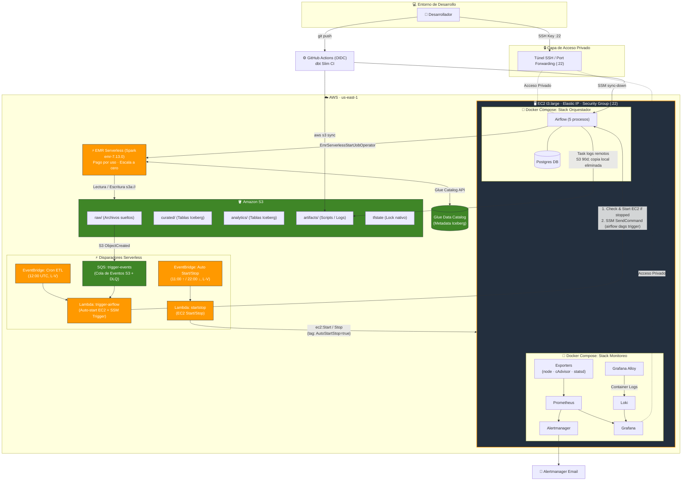

# Arquitectura de producción — híbrida en AWS

Mapa conceptual del camino de producción: responsabilidades, fronteras y flujos. El *cómo*
ejecutable está en la [guía 02](02-produccion-aws-terraform.md); acá está el porqué.

> **En este documento: LEER, ~25 min. No hay nada que ejecutar.**
> **Salís con**: entender **por qué** el stack de producción está armado así —y, más
> útil, qué se descartó y con qué criterio. El *cómo* ejecutable está en la
> [guía 02](02-produccion-aws-terraform.md).

> [!IMPORTANT]
> **Leé esto ANTES de la guía 02, no después.** La guía 02 pide explícitamente que no
> rediscutas las decisiones mientras la seguís, y este es el documento donde esas
> decisiones se justifican. Si empezás a aplicar Terraform preguntándote «¿por qué EMR
> Serverless y no un cluster?», vas a interrumpir el stand-up para resolver algo que
> está resuelto acá (y en la sección 6, *Qué no se usa y por qué*).

**Diseño de referencia:** Airflow y Postgres en una EC2 `t3.large`, Spark en EMR Serverless, datos
Parquet en S3, Glue Data Catalog, Lambdas/EventBridge/SQS para disparo y auto start/stop, secretos en
SSM y CI de validación sin permisos de escritura sobre AWS.

**Arquitectura objetivo:** tablas Iceberg en `curated/` y `analytics/`, dbt, Great Expectations,
OpenLineage y observabilidad con Prometheus, Grafana, Alertmanager, Loki y Grafana Alloy. Aparecen en los
diagramas para mostrar la evolución prevista; hoy son roadmap, no inventario desplegable.

**Cómo leer los diagramas, entonces**: mezclan las dos capas a propósito. Lo que está
desplegable y lo que es diseño lo separa la [matriz de estado](README.md), que es la
fuente de verdad — no estos diagramas. Ante una diferencia entre ambos, gana la matriz.
El [estándar de gobierno y operaciones](referencia/08-gobierno-operaciones-datos.md) define además
los controles humanos y de datos que ningún diagrama de infraestructura puede sustituir.

## Configuración de referencia

| Parámetro | Valor | Dónde se fija |
|---|---|---|
| Región AWS | `us-east-1` | `var.aws_region`, guía 02 §5.1 |
| Availability Zone | `us-east-1a` (fija, para que el EBS `/data` no se recree) | `var.availability_zone`, guía 02 §5.1 |
| Instancia orquestadora | `t3.large` (Airflow + Postgres + monitoreo, sin Spark) | `var.instance_type`, guía 02 §5.1 |
| Motor Spark | EMR Serverless, `emr-7.13.0` | `release_label`, guía 02 §6.4 |
| Formato actual / objetivo | Parquet / Apache Iceberg sobre Glue Data Catalog | guía 02 §16 |
| IP del cliente | `${MY_IP_CIDR}` — única fuente de SSH (22) y HTTPS (443) | `var.my_ip_cidr`, guía 02 §5.1 |
| Dominio de Airflow (opcional) | vacío por defecto = solo túnel SSH | `var.airflow_domain`, guía 02 §5.6 |
| Email de alertas | usado por DLQ, Budgets y Cost Anomaly Detection | `var.alert_email`, guía 02 §18 |

---

## 1. Diagrama


```mermaid
flowchart TD
    %% --- ACTORES Y ACCESO EXTERNO ---
    subgraph CLIENT["💻 Entorno de Desarrollo"]
        dev["👤 Desarrollador"]
    end

    subgraph ACCESS["🔒 Capa de Acceso Privado"]
        tunnel["Túnel SSH / Port Forwarding (:22)"]
    end

    %% --- INFRAESTRUCTURA AWS ---
    subgraph AWS["☁️ AWS · us-east-1"]

        %% DISPARADORES SERVERLESS
        subgraph TRIGGERS["⚡ Disparadores Serverless"]
            cronETL["EventBridge: Cron ETL<br/>(12:00 UTC, L-V)"]
            cronSS["EventBridge: Auto Start/Stop<br/>(11:00 ↑ / 22:00 ↓, L-V)"]
            sqs["SQS: trigger-events<br/>(Cola de Eventos S3 + DLQ)"]
            lTrig["Lambda: trigger-airflow<br/>(Auto-start EC2 + SSM Trigger)"]
            lSS["Lambda: startstop<br/>(EC2 Start/Stop)"]
        end

        %% INFRAESTRUCTURA EC2 (ORQUESTACIÓN Y MONITOREO)
        subgraph EC2["🖥️ EC2 t3.large · Elastic IP · Security Group (:22)"]

            subgraph ORCH["🐳 Docker Compose: Stack Orquestador"]
                af["Airflow (5 procesos)"]
                pg[("Postgres DB")]
                af --- pg
            end

            subgraph MON["🐳 Docker Compose: Stack Monitoreo"]
                exp["Exporters<br/>(node · cAdvisor · statsd)"]
                prom["Prometheus"]
                am["Alertmanager"]
                alloy["Grafana Alloy"]
                loki["Loki"]
                graf["Grafana"]

                exp --> prom
                prom --> am
                prom --> graf
                alloy -->|"Container Logs"| loki
                loki --> graf
            end
        end

        %% CÓMPUTO Y DATA LAKE
        emrs["⚡ EMR Serverless (Spark emr-7.13.0)<br/>Pago por uso · Escala a cero"]

        subgraph S3["🪣 Amazon S3"]
            raw["raw/ (Archivos sueltos)"]
            curated["curated/ (Tablas Iceberg)"]
            analytics["analytics/ (Tablas Iceberg)"]
            art["artifacts/ (Scripts / Logs)"]
            tf["tfstate (Lock nativo)"]
        end

        catalog[("Glue Data Catalog<br/>(Metadata Iceberg)")]
    end

    %% ALERTAS EXTERNAS Y CI/CD
    mail["📧 Alertmanager Email"]
    gha["⚙️ GitHub Actions (OIDC)<br/>dbt Slim CI"]

    %% --- FLUJOS Y CONEXIONES ---

    dev -->|"SSH Key :22"| tunnel
    tunnel -.-|"Acceso Privado"| af
    tunnel -.-|"Acceso Privado"| graf

    dev -->|"git push"| gha
    gha -->|"aws s3 sync"| art
    gha -->|"SSM sync-down"| af
    af -->|"Task logs remotos<br/>S3 90d; copia local eliminada"| art

    cronSS --> lSS
    lSS -->|"ec2:Start / Stop<br/>(tag: AutoStartStop=true)"| EC2

    cronETL --> lTrig
    raw -->|"S3 ObjectCreated"| sqs
    sqs --> lTrig
    lTrig -->|"1. Check & Start EC2 if stopped<br/>2. SSM SendCommand (airflow dags trigger)"| af

    af -->|"EmrServerlessStartJobOperator"| emrs
    emrs <-->|"Glue Catalog API"| catalog
    emrs -->|"Lectura / Escritura s3a://"| S3

    am --> mail

    classDef awsService fill:#FF9900,stroke:#232F3E,stroke-width:1px,color:#fff;
    classDef ec2Box fill:#232F3E,stroke:#FF9900,stroke-width:2px,color:#fff;
    classDef storage fill:#3F8627,stroke:#232F3E,stroke-width:1px,color:#fff;

    class lTrig,lSS,emrs,cronETL,cronSS awsService;
    class EC2 ec2Box;
    class S3,catalog,sqs storage
```

Las UIs (Airflow, Grafana, Prometheus, Loki) nunca se exponen a internet: se acceden por túnel SSH.
La única excepción opcional es la web de Airflow por HTTPS, restringida a la IP autorizada (§4). La
Spark UI vive en la consola de EMR Serverless, y en producción no hay Jupyter.

---

## 2. Componentes

| Componente | Dónde vive | Rol |
|---|---|---|
| Airflow (5 procesos) + Postgres | EC2 / Docker | Orquestación — dispara jobs Spark con `EmrServerlessStartJobOperator` |
| EMR Serverless (aplicación Spark) | AWS | Cómputo Spark bajo demanda |
| Rol de ejecución de EMR Serverless | AWS | Permisos S3 del job, least-privilege |
| Prometheus + Alertmanager + Grafana + Loki | EC2 / Docker | Métricas, alertas y logs |
| node-exporter · cAdvisor · statsd-exporter · Alloy | EC2 / Docker | Exporters de host, contenedor, Airflow y logs |
| S3 data lake (`raw` / `curated` / `analytics`) | AWS | Almacenamiento durable; `curated`/`analytics` como tablas **Iceberg** |
| Glue Data Catalog | AWS | Catálogo de las tablas Iceberg, compartido por Spark y Athena, sin crawlers |
| Athena | AWS | Consumo SQL/BI, `MERGE` y time-travel sobre Iceberg (opcional, guía 02 §16) |
| dbt Core | EC2, disparado por Airflow | Transformaciones SQL `curated → analytics` (guía 02 §19) |
| Great Expectations | EC2, disparado por Airflow | Opción futura para el gate `staging → curated`; no es requisito (guía 02 §20) |
| OpenLineage | Airflow + dbt + Spark | Lineage hacia un backend HTTP autenticado (guía 02 §22) |
| S3 artifacts | AWS | Scripts, logs, deploys, estado de dbt y eventos de lineage |
| SQS `trigger-events` | AWS | Cola entre S3 y `trigger-airflow`; da el reintento automático si la EC2 está apagada |
| Lambda `trigger-airflow` | AWS | Dispara DAGs vía SSM, con contrato de datos y auto-start de la EC2 |
| Lambda `startstop` | AWS | Prende y apaga la EC2 con guardia de DAGs activos |
| DLQ | AWS | Redrive de SQS para eventos S3, DLQ de Scheduler para cron, destino async para Lambda |
| Rol OIDC `dbt_ci` | AWS + GitHub | Slim CI de dbt por PR, acotado a una database Glue `_ci` aislada |
| SNS `alerts` | AWS | Destino único de las alarmas de CloudWatch — **roadmap**: la guía 02 §18.2 define qué alarmar, pero todavía no trae el topic ni las alarmas |
| EventBridge Scheduler | AWS | Cron de ETL y de start/stop |
| EC2 + EBS + Elastic IP + SG | AWS | Host del stack |
| IAM roles | AWS | Permisos least-privilege |
| S3 (tfstate) | AWS | Estado remoto de Terraform, con lock nativo (`use_lockfile`) |
| GitHub Actions + OIDC | AWS + GitHub | CI/CD: valida en PRs y despliega DAGs |
| Snapshots EBS (DLM) | AWS | Backups automáticos de `/data` |
| SSM Parameter Store | AWS | Secretos (`SecureString`) y config no secreta (`config/`) que la EC2 lee sin acceso al state (guía 02 §13.3b) |
| Outputs de Terraform + `scripts/prod-env.sh` | Repo | Contrato que convierte el state en variables de entorno: ningún comando lleva IDs ni IPs escritos (guía 02 §3.1) |
| Budgets · Cost Anomaly Detection · Access Analyzer | AWS | Gobierno de costo y seguridad, sin costo (guía 02 §18) |

> El Terraform de cada componente y los archivos Compose están, listos para copiar, en la
> [guía 02](02-produccion-aws-terraform.md), sección por sección.

---

## 3. Flujos

### 3.1 Despliegue (una sola vez)

```
bootstrap (S3) → terraform apply (S3, EC2, IAM, Lambda, EventBridge, EIP)
→ rsync del proyecto a la EC2 (incluye docker-compose.prod.yml: standalone, sin Spark ni HDFS)
→ docker compose -f docker-compose.prod.yml up -d --build
```

### 3.2 ETL disparado por evento

```
Productor carga orders/customers/products y al final publica raw/manifests/customer_etl/<lote>.json
  → S3 ObjectCreated filtrado por prefijo+sufijo → SQS (trigger-events)
  → Lambda trigger-airflow:
      1) valida manifest, conjunto exacto de objetos y columnas; un rechazo termina en DLQ
      2) ¿EC2 running y SSM Online? no → ec2:StartInstances y devuelve error (SQS reintenta solo
         en ~6 min, ya con la EC2 arriba) · sí → SSM SendCommand → EC2:
         docker exec airflow-scheduler airflow dags trigger <dag> --conf '{bucket,key,run_date}'
  → DAG: EmrServerlessStartJobOperator(deferrable=True)
      → EMR Serverless lee s3a://…/raw → transforma → escribe s3a://…/curated
```

Con `deferrable=True` el triggerer espera sin ocupar un worker; no hace falta un sensor aparte.

**Nada se pierde si la EC2 está apagada.** S3 no invoca la Lambda directo: escribe en una cola SQS.
Si el handler falla porque la EC2 está arrancando, el mensaje no se borra y vuelve a estar visible a
los ~6 minutos. Tras 5 intentos (~30 min) cae en la DLQ, con alarma por email. El dead-man switch
`DailyEtlMissing` queda como roadmap explícito (§3.4); no se cuenta como control
operativo hasta que exista su regla y una prueba de alerta.

**El retry no duplica trabajo.** `airflow dags trigger` usa un `--run-id` determinístico derivado de
bucket+key+versionId+sequencer (guía 02 §7.1): un retry conserva el run id, pero una versión nueva
de la misma key se puede reprocesar. El DAG tiene además `max_active_runs=1`, así que dos manifests
no escriben en paralelo sobre la misma partición. Y la Lambda declara
`reserved_concurrent_executions=2`: un backfill de decenas de archivos no dispara una avalancha
contra el `maximum_capacity` de EMR Serverless, los deja esperando en cola.

### 3.3 ETL programado (cron)

```
EventBridge Scheduler (12:00 UTC, L-V — dentro de la ventana de encendido)
  →  Lambda trigger-airflow  →  SSM  →  airflow dags trigger
```

### 3.4 Monitoreo

```
MÉTRICAS: node-exporter (host) · cAdvisor (contenedores) · statsd-exporter (Airflow)
  → Prometheus (scrape 15s) → evalúa alerts.yml
  → Alertmanager → email
       ROADMAP LOCAL: disco /data lleno y heartbeat del scheduler
EMR SERVERLESS: métricas por CloudWatch · logs del driver/executors en s3://artifacts/emr/logs/
  y/o CloudWatch Logs · estado visible en la task deferrable de Airflow
LOGS: Grafana Alloy (todos los contenedores) → Loki
Grafana ← Prometheus (métricas) + Loki (logs) · dashboard "Overview" auto-provisionado
ALARMAS AWS IMPLEMENTADAS: mensajes en DLQ → CloudWatch → SNS; Budgets y anomalías → email
ROADMAP AWS: errores/throttles Lambda, edad SQS, job EMR FAILED y dead-man switch del ETL
```

### 3.5 Ahorro: auto start/stop

```
EventBridge Scheduler (11:00 UTC start / 22:00 UTC stop, L-V)
  → Lambda startstop → ec2:StartInstances/StopInstances (solo con tag AutoStartStop=true)
La Elastic IP mantiene la misma dirección entre apagados.
```

### 3.6 CI/CD

```
laptop (edita dags/, spark-apps/, notebooks/) → git push a main
  → GitHub Actions (OIDC, sin claves): CI valida (lint + tests + terraform validate)
  → Deploy: aws s3 sync → s3://artifacts/deploy/ → SSM sync-down en la EC2
  → el dag-processor detecta los DAGs (~30s) y corren solos
```

---

## 4. Red y seguridad

- **Ingress:** solo el puerto 22 (SSH) desde tu IP, más una excepción **opcional**: el 443 (HTTPS),
  también restringido a tu IP, si exponés la web de Airflow con TLS nativo (guía 02 §5.6; apagado por
  defecto). Grafana, Prometheus y Loki nunca se exponen: solo túnel SSH.
- **SSM Session Manager:** acceso e invocación de comandos —la Lambda dispara `airflow dags
  trigger`— sin abrir puertos ni exponer la API de Airflow.
- **Credenciales:** ninguna capa usa access keys en disco. Airflow usa el rol IAM de la EC2 (instance
  profile) para S3 y para disparar EMR Serverless; EMR Serverless usa **su propio** rol de ejecución
  least-privilege.
- **IAM least-privilege:** la Lambda de start/stop solo toca instancias con `AutoStartStop=true`; la
  de trigger solo hace `ssm:SendCommand` sobre esa instancia. El rol del job EMR queda acotado a los
  ARNs exactos del datalake y de artifacts, CloudWatch Logs y las acciones de Glue necesarias. El rol
  de la EC2 gana `emrserverless:StartJobRun/GetJobRun/StartApplication/GetApplication` scoped al ARN
  de la aplicación, y `iam:PassRole` del rol del job restringido por la condición
  `iam:PassedToService = emr-serverless.amazonaws.com`.
- **S3:** buckets privados (`public_access_block`), cifrado en reposo, política solo-TLS y
  versionado. El **S3 VPC Gateway Endpoint** mantiene el tráfico EC2↔S3 dentro de la red de AWS; no
  aplica a EMR Serverless salvo que la aplicación use una configuración de red en tu VPC.
- **IMDSv2 y EBS:** metadata solo por IMDSv2 (`hop_limit` 2) y volúmenes EBS cifrados.
- **Logs:** Airflow sube task logs cifrados a `artifacts/logs/airflow/` y elimina la copia local;
  EMR usa S3/CloudWatch. S3 conserva ambos 90 días, CloudWatch 14–30 días, Loki 7 días y Docker
  rota `3 × 10 MiB` por contenedor. Las alertas de `/data` disparan al 80% y 90%.
- **Estado de Terraform:** cifrado y versionado en S3, con lock nativo (`use_lockfile`), sin
  DynamoDB.

---

## 5. Costo y capacidad

> Precios aproximados on-demand en us-east-1, estimados en julio de 2026 y sujetos a cambio;
> validalos en [calculator.aws](https://calculator.aws). Escenario: 2 GB/día, 3 corridas por semana
> (~13/mes).

| Ítem | auto start/stop (8h × 22d) | 24/7 |
|---|---|---|
| EC2 `t3.large` (Airflow + Postgres + monitoreo) | ~$12 | ~$60 |
| EMR Serverless (pago por uso, ~13 corridas/mes) | ~$9 | ~$9 |
| EBS gp3 (root 40 + data 30) + snapshots DLM | ~$9 | ~$9 |
| S3 data lake + requests | ~$1.5 | ~$1.5 |
| IPv4 pública (EIP; AWS la cobra desde feb-2024, asociada o no) | ~$3.6 | ~$3.6 |
| Lambda + EventBridge + SSM | ~$0 (free tier) | ~$0 (free tier) |
| Athena (consumo SQL/BI, opcional) | ~$0 | ~$0 |
| **Total** | **~$35/mes** | **~$83/mes** |

La EC2 ya no dimensiona por la RAM de las JVMs de Spark, que salieron a EMR Serverless: `t3.large`
(2 vCPU / 8 GB) corre Airflow, Postgres y monitoreo, casi idle en CPU, así que la familia burstable
`t3` es la elección correcta y más barata. Antes se desaconsejaba `t3` porque las JVMs de Spark
degradan en burstable tras un start/stop; con Spark fuera de la caja ese motivo desaparece.

El auto start/stop sigue siendo una palanca, pero secundaria: el cómputo pesado ya es pago por uso y
escala a cero. La diferencia entre $35 y $83 es solo la EC2 chica del orquestador.

**Capacidad.** Ya no es responsabilidad de la EC2: **EMR Serverless autoescala los workers por job**.
Para 2–5 GB alcanza una configuración chica, y maneja decenas o cientos de GB sin redimensionar nada;
el techo de costo se pone con `maximum_capacity` en la aplicación (cold start de 1–2 min por job,
aceptable para batch 3×/semana). Solo para **TB sostenidos** un cluster dedicado
(EMR-on-EC2 multi-nodo) seguiría ganando, y eso está fuera del alcance de este proyecto.

---

## 6. Qué no se usa y por qué

| Servicio | Decisión | Motivo |
|---|---|---|
| **EMR Serverless** | Adoptado | Uso chico e infrecuente (3×/sem, 2–5 GB): una EC2 siempre encendida solo para tener Spark vivo no se justifica. Pago por uso y escala a cero encajan |
| **MWAA** | No | Airflow gestionado no escala a cero (~$350+/mes fijos) |
| **EMR-on-EC2 clásico** | No | Fleet de EC2 más recargo, pensado para TB sostenidos y multi-nodo |
| **Athena** | Opcional, adoptado | Capa de consumo SQL/BI sobre Iceberg, pago por consulta (~$5/TB → ~$0 a esta escala). Con Iceberg no es solo lectura: también `MERGE`, `UPDATE`, `DELETE` y time-travel. Se justifica si hay lectores SQL/BI, dbt o asserts de calidad; si el único consumidor es el próximo job Spark, no aporta |
| **Glue Data Catalog** | Adoptado, sin crawlers | Es el catálogo de las tablas Iceberg: Spark y Athena lo comparten. Iceberg registra y actualiza la metadata solo, sin crawlers ni jobs de Glue |
| **CloudWatch dashboards** | No, como visualización primaria | Prometheus + Grafana es más portable y rico; CloudWatch se usa para métricas y logs de EMR Serverless |
| **HDFS en producción** | No | Reemplazado por S3 (`s3a://`); EMR Serverless lee y escribe S3 nativo |

No es un descarte dogmático, es un tradeoff con punto de cruce. Lo managed serverless (EMR
Serverless, Lambda, Athena) sale más barato y con menos ops en uso bajo o esporádico; el
self-managed gana cuando se consolidan varias cargas en una máquina ya paga y se valora control,
portabilidad y aprendizaje. Para **este** workload la conclusión se inclina al pago por uso. La
comparación servicio por servicio está en la
[guía 02 §2](02-produccion-aws-terraform.md#2-costo).

---

## 7. Lakehouse con Iceberg — roadmap

Hoy el ETL escribe `df.write.mode("overwrite").parquet(...)`: una carpeta por fecha, sin atomicidad
y sin forma de hacer un upsert que no reescriba todo. El objetivo es que `curated/` y `analytics/`
sean tablas **Apache Iceberg**: ACID, time-travel (`FOR VERSION AS OF`), `MERGE` incremental y
evolución de esquema, sin reescribir el pipeline desde cero.

**Por qué Iceberg y no Delta Lake.** Iceberg tiene integración nativa con **Glue Data Catalog**, que
este stack ya usa para Athena (§6). Una tabla que escribe un job Spark de EMR Serverless queda
**inmediatamente disponible** para `MERGE`, `UPDATE`, `DELETE` y time-travel **desde SQL en Athena**,
no solo para lectura: Delta en Athena es read-only y necesitarías Spark para escribir. Con un motor
de escritura (Spark) y dos de lectura/escritura (Spark y Athena/dbt), Iceberg encaja mejor en este
stack híbrido.

**Cómo quedaría montado** (Terraform y SQL en la
[guía 02 §16](02-produccion-aws-terraform.md#16-athena-e-iceberg) y
[guía 02 §6.4](02-produccion-aws-terraform.md#64-cómputo-spark-emr-serverless)):

- El job Spark escribe con `df.writeTo("glue_catalog.<db>.<tabla>")` en vez de `.write.parquet(...)`,
  usando el conector Iceberg embebido en el runtime `emr-7.13.0` — no hay nada que instalar.
- Ese mismo catálogo es el `aws_glue_catalog_database` que usa Athena: una sola base de datos, sin
  crawlers, porque Iceberg registra y actualiza la metadata en cada escritura.
- Desde Athena (engine v3) o desde dbt (target `athena`) se puede `SELECT`, `MERGE`, `UPDATE`,
  `DELETE` y consultar versiones anteriores, sin tocar Spark.

**Mantenimiento obligatorio.** Iceberg acumula snapshots y archivos chicos con cada `MERGE`; sin
compactación periódica el *planning time* de las queries se degrada mes a mes. Un DAG semanal corre
`OPTIMIZE ... REWRITE DATA USING BIN_PACK` y `VACUUM` vía `AthenaOperator`: es housekeeping, no parte
del pipeline crítico. Detalle en
[guía 02 §16.3](02-produccion-aws-terraform.md#163-mantenimiento-iceberg).

> Se puede practicar todo esto sin AWS: el
> [ejemplo 21 de la guía 04](04-ejemplos-locales.md) monta un catálogo Iceberg local con el mismo
> SQL.

---

## 8. dbt Core y Great Expectations — roadmap

Dos piezas sobre las tablas Iceberg de §7, ambas disparadas por Airflow —nunca por un orquestador
nuevo—. Detalle completo en la [guía 02](02-produccion-aws-terraform.md).

- **dbt Core:** transformaciones SQL versionadas `curated → analytics` con el target Athena. Los
  reprocesos pesados siguen siendo jobs PySpark en EMR Serverless orquestados por Airflow, porque EMR
  Serverless batch no expone un endpoint SQL permanente para `dbt-spark`.
- **Great Expectations:** opción para suites grandes. El gate correcto corre sobre staging después
  del ETL y antes de promover a `curated/`; los controles PySpark/SQL ya pueden cumplir el contrato
  sin incorporar otra herramienta. Si falla, el lote queda sin publicar y el DAG termina en error.

---

## 9. Gobierno, costo y resiliencia

Cuatro piezas AWS-nativas que cierran huecos operativos. Detalle en la
[guía 02 §18](02-produccion-aws-terraform.md#18-gobierno-resiliencia-y-costos):

Ownership, clasificación, SLO, incidentes y autorización de datos reales se gobiernan en la
[referencia 08](referencia/08-gobierno-operaciones-datos.md); crear alarmas no asigna responsables.

| Pieza | Qué resuelve |
|---|---|
| **DLQ por origen** | El redrive de SQS protege el camino S3; la DLQ de Scheduler protege el cron; el destino async de Lambda protege las invocaciones asíncronas |
| **AWS Budgets** | Aviso por email al 80% y al 100% del gasto mensual esperado — sin costo |
| **Cost Anomaly Detection** | Detecta picos fuera del patrón histórico, como un job de EMR escalando de más — sin costo |
| **IAM Access Analyzer** | Detección temprana de recursos accesibles desde fuera de la cuenta — sin costo ni mantenimiento |

Budgets y Cost Anomaly notifican **directo por email** a `var.alert_email` mediante sus respectivas
suscripciones (guía 02 §18.3–§18.4). Las alarmas CloudWatch de las DLQ usan el topic SNS `alerts` y
su suscripción confirmada; las señales adicionales de Lambda, SQS y EMR siguen marcadas como roadmap.

---

## 10. Fuera de alcance

Decisiones tomadas, no huecos por descuido. Nada de esto se justifica al volumen actual (~2 GB/día,
3 corridas por semana):

- **Alta disponibilidad de la EC2.** El diseño es de **un solo nodo**: si la instancia se cae fuera
  de la ventana de auto start/stop, nadie dispara los DAGs hasta que EventBridge la vuelva a
  prender. Es la contrapartida directa de optimizar por costo (§5). Se reconsideraría si el pipeline
  pasara a ser crítico de negocio.
- **Graviton (arm64).** `t4g.large` es más barata a igual rendimiento, y casi todas las imágenes del
  stack publican multi-arch. Antes de migrar hay que confirmar arm64 en la imagen de Airflow y en
  cAdvisor.
- **Rotación automática de secretos.** Secrets Manager con rotación está documentado pero opcional:
  hoy los secretos no rotan solos, se regeneran a mano.
- **Postura de seguridad continua (GuardDuty, Security Hub, Config).** Access Analyzer (§9) cubre un
  caso puntual; no hay detección de amenazas continua ni compliance-as-code. Sería la pieza faltante
  si esto creciera a multiusuario o multicuenta.
