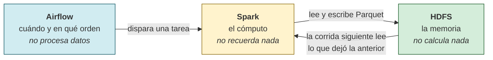
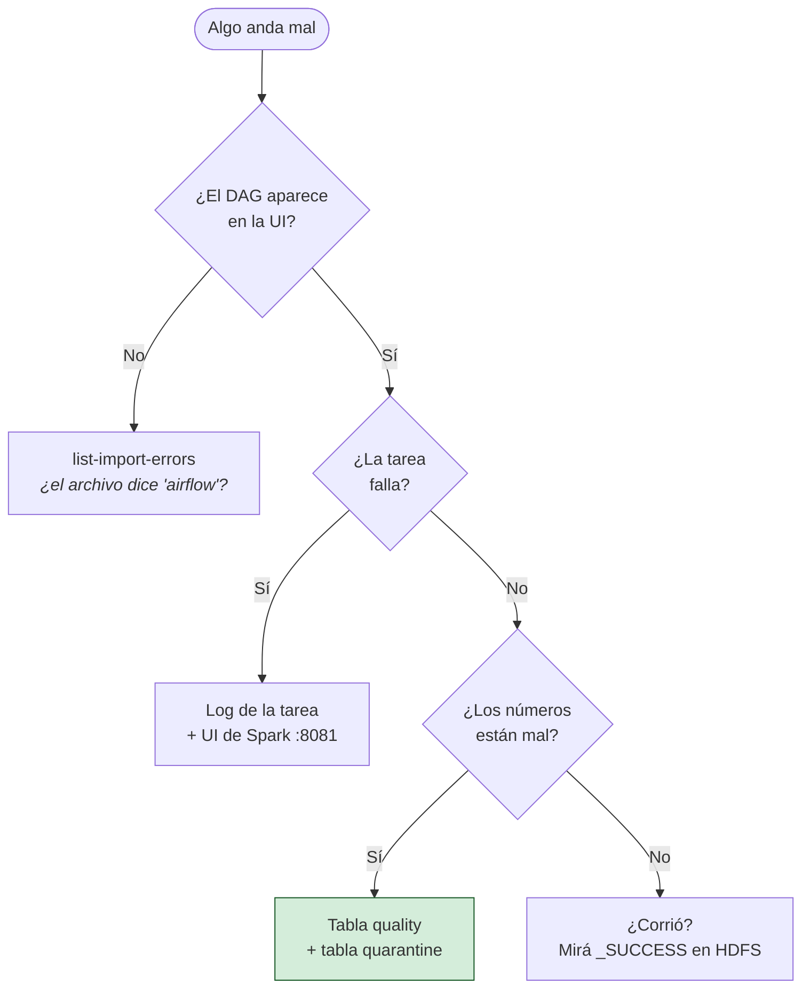

# 06 — Medallion desde cero: 15 proyectos, copy-paste, en orden

> **En este documento: CONSTRUIR, ~12 h repartidas en 15 sesiones.** No es una
> referencia: es un taller. Cada sección deja un archivo nuevo en tu repo y algo
> nuevo en HDFS.
> **Salís con**: los 15 pipelines corriendo, escritos por vos, y —lo que importa—
> sabiendo *por qué* cada línea está donde está. Al final hay un proyecto 16 sin
> solución.

Este es el único documento del repositorio que contiene el código de los pipelines.
`dags/` está vacío a propósito: **lo llenás vos**, sección por sección. La guía es la
fuente, tu checkout es el resultado.

## Cómo se lee

Cada proyecto tiene la misma estructura de cuatro bloques, siempre en el mismo orden:

| Bloque | Qué hacés |
|---|---|
| **El problema** | Leés el caso de negocio y la técnica nueva que trae. Dos minutos |
| **El código** | Copiás el archivo completo al path que dice el encabezado. Sin editar nada |
| **Corrélo** | Ejecutás el DAG y verificás la salida en HDFS |
| **Lo que aprendiste** | La técnica nueva, aislada, y el error que evita |

**Copiá el archivo entero, siempre.** Desde el proyecto 02 en adelante vas a
reconocer el 60 % del archivo: es el mismo esqueleto. Eso es deliberado — el
esqueleto se vuelve automático y tu atención queda libre para la parte nueva, que la
prosa siempre señala. No copies "solo lo nuevo": los archivos son autónomos y se
corren enteros.

> [!IMPORTANT]
> **No saltees el orden.** El proyecto 07 asume patrones del 03, y el 15 asume el 13.
> Si venís por un patrón puntual, usá el [catálogo de patrones](#31-catálogo-de-patrones-qué-usar-y-cuándo)
> del final, que dice en qué proyecto vive cada uno.

## Índice

**Parte 0 · Antes de escribir código**
- [§1 · Qué vas a construir](#1-qué-vas-a-construir)
- [§2 · Quién hace qué: el modelo mental](#2-quién-hace-qué-el-modelo-mental)
- [§3 · Preparar el entorno, una sola vez](#3-preparar-el-entorno-una-sola-vez)

**Parte 1 · El primer contacto**
- [§4 · Proyecto 00 · `hello_lakehouse`](#4-proyecto-00--hello_lakehouse)
- [§5 · Las seis reglas que ese archivo ya te enseñó](#5-las-seis-reglas-que-ese-archivo-ya-te-enseñó)

**Parte 2 · El primer medallion, y el runtime que nace de él**
- [§6 · Proyecto 01a · Customer 360, versión ingenua](#6-proyecto-01a--customer-360-versión-ingenua)
- [§7 · Los cinco defectos de la v0](#7-los-cinco-defectos-de-la-v0)
- [§8 · Runtime, pieza 1: `LakehouseConfig`](#8-runtime-pieza-1-lakehouseconfig)
- [§9 · Runtime, pieza 2: `SparkSessionFactory`](#9-runtime-pieza-2-sparksessionfactory)
- [§10 · Runtime, pieza 3: `HdfsLakehouseStorage`](#10-runtime-pieza-3-hdfslakehousestorage)
- [§11 · Runtime, pieza 4: `QualityGate` y la cuarentena](#11-runtime-pieza-4-qualitygate-y-la-cuarentena)
- [§12 · Runtime, pieza 5: la fachada y los puertos](#12-runtime-pieza-5-la-fachada-y-los-puertos)
- [§13 · `runtime.py` completo](#13-runtimepy-completo)
- [§14 · Proyecto 01 · Customer 360 definitivo](#14-proyecto-01--customer-360-definitivo)

**Parte 3 · La escalera: un patrón nuevo por proyecto**
- [§15 · Proyecto 02 · Daily Sales](#15-proyecto-02--daily-sales)
- [§16 · Proyecto 03 · Web Events](#16-proyecto-03--web-events)
- [§17 · Proyecto 04 · Product Catalog](#17-proyecto-04--product-catalog)
- [§18 · Proyecto 05 · Inventory Snapshot](#18-proyecto-05--inventory-snapshot)
- [§19 · Proyecto 06 · Support Tickets](#19-proyecto-06--support-tickets)
- [§20 · Proyecto 07 · Payment Reconciliation](#20-proyecto-07--payment-reconciliation)
- [§21 · Proyecto 08 · Supplier Performance](#21-proyecto-08--supplier-performance)
- [§22 · Proyecto 09 · Marketing Attribution](#22-proyecto-09--marketing-attribution)
- [§23 · Proyecto 10 · Fraud Signals](#23-proyecto-10--fraud-signals)
- [§24 · Proyecto 11 · Demand Forecasting](#24-proyecto-11--demand-forecasting)
- [§25 · Proyecto 12 · Customer Churn Features](#25-proyecto-12--customer-churn-features)
- [§26 · Proyecto 13 · Order Fulfillment OTIF](#26-proyecto-13--order-fulfillment-otif)
- [§27 · Proyecto 14 · AML Transaction Monitoring](#27-proyecto-14--aml-transaction-monitoring)
- [§28 · Proyecto 15 · Subscription Revenue](#28-proyecto-15--subscription-revenue)

**Parte 4 · Metodología**
- [§29 · Cómo se diseña un pipeline nuevo](#29-cómo-se-diseña-un-pipeline-nuevo)
- [§30 · Las cinco decisiones de rendimiento](#30-las-cinco-decisiones-de-rendimiento)
- [§31 · Catálogo de patrones: qué usar y cuándo](#31-catálogo-de-patrones-qué-usar-y-cuándo)
- [§32 · Diagnóstico: dónde mirás cuando falla](#32-diagnóstico-dónde-mirás-cuando-falla)
- [§33 · Antipatrones](#33-antipatrones)
- [§34 · Qué cambia cuando esto va a producción](#34-qué-cambia-cuando-esto-va-a-producción)
- [§35 · Proyecto 16: tu turno, sin solución](#35-proyecto-16-tu-turno-sin-solución)

---

# Parte 0 · Antes de escribir código

## 1. Qué vas a construir

Quince pipelines de datos autónomos. Cada uno toma una fuente cruda, la vuelve
confiable y publica una tabla que alguien puede consultar sin preguntarte nada.

Todos siguen la misma arquitectura, **medallion**, que es apenas una convención de tres
capas con una regla estricta: **cada capa solo lee de la anterior**.

```text
fuente → Bronze → Silver → Gold
                    ├→ quality      (cuántas filas entraron, cuántas se publicaron)
                    └→ quarantine   (las filas rechazadas, con el motivo)
```

| Capa | Qué contiene | Regla de oro |
|---|---|---|
| **Bronze** | La fuente tal como llegó, más metadata de linaje | No se corrige nada. Si el origen mandó basura, Bronze la guarda |
| **Silver** | Tipada, validada, deduplicada, una fila por entidad | Acá vive toda la lógica de calidad |
| **Gold** | Agregada, con nombres de negocio, lista para consumir | Nadie que consuma Gold necesita saber cómo se llamaban las columnas originales |
| **quality** | Un registro por corrida: recibidas, rechazadas, publicadas | Es la evidencia auditable de que el lote se controló |
| **quarantine** | Las filas rechazadas, cada una con `_reject_reason` | Rechazar no es borrar. Alguien tiene que poder investigar |

Por qué tres capas y no una: **porque los errores llegan tarde**. Cuando en marzo
descubrís que el campo `currency` venía en minúscula desde enero, con Bronze intacto
reprocesás; sin Bronze, perdiste el dato original y no hay vuelta atrás.

Los quince proyectos, en el orden en que los vas a escribir:

| # | Proyecto | Modo de carga | La técnica nueva que trae |
|---|---|---|---|
| 00 | `hello_lakehouse` | Ejercicio aislado | Airflow dispara, Spark calcula, HDFS guarda |
| 01 | Customer 360 | Snapshot | Las tres capas, la cuarentena y el gate de calidad |
| 02 | Daily Sales | Incremental | CSV, `decimal` para dinero, deduplicación por clave compuesta |
| 03 | Web Events | Incremental | Cadencia horaria, taxonomía cerrada, particiones derivadas |
| 04 | Product Catalog | Snapshot | Quedarse con la última versión de una entidad |
| 05 | Inventory Snapshot | Snapshot | Invariantes de balance: rechazar lo aritméticamente imposible |
| 06 | Support Tickets | Incremental | Aritmética de tiempo y SLA variable por prioridad |
| 07 | Payment Reconciliation | Snapshot | Tolerancia de redondeo y clasificación del descuadre |
| 08 | Supplier Performance | Incremental | Cadencia semanal y scorecard acumulado |
| 09 | Marketing Attribution | Snapshot | Pesos fraccionarios y reparto de un importe |
| 10 | Fraud Signals | Incremental | Bandas construidas en Python, ventanas de tiempo con `F.window` |
| 11 | Demand Forecasting | Snapshot | Multi-fuente, join por rango de fechas, ventanas móviles y **fuga de datos** |
| 12 | Customer Churn Features | Snapshot | Feature store, PII hasheada, score explicable |
| 13 | Order Fulfillment OTIF | Incremental | Reconciliar tres sistemas y `left_anti` |
| 14 | AML Transaction Monitoring | Incremental | Ventana por tiempo real (`rangeBetween`), reglas con nombre |
| 15 | Subscription Revenue | Incremental | CDC compactado por secuencia, conversión FX, dos tablas Gold |

La dificultad sube de forma deliberada: del 01 al 10 cada proyecto tiene **una** fuente
y agrega **un** concepto; del 11 al 15 aparecen varias fuentes por proyecto y la
complejidad pasa a ser de modelado, no de sintaxis.

## 2. Quién hace qué: el modelo mental

El error más caro de un novato con este stack es no tener claro **dónde corre cada
cosa**. Tres piezas, tres responsabilidades que no se pisan:



**Airflow** decide *cuándo* corre algo y *en qué orden*. Nada más. Cuando escribís
`bronze >> silver >> gold`, Airflow no sabe qué es Bronze: sabe que si la primera
tarea falla, no arranca la segunda. Un DAG que procesa datos dentro del proceso de
Airflow es un DAG mal escrito — Airflow tiene que quedar libre para orquestar.

**Spark** hace el cómputo y es **amnésico**: cuando la tarea termina, la sesión muere y
en memoria no queda nada. Todo lo que la corrida siguiente necesite tiene que estar
escrito en disco. Por eso cada capa **escribe** su resultado en vez de pasárselo a la
siguiente en memoria.

**HDFS** es la memoria persistente del sistema: las capas sobreviven a que se recreen los
contenedores mientras conserves sus volúmenes. Este laboratorio tiene un NameNode y un DataNode,
así que no ofrece alta disponibilidad ni tolerancia real a la caída del almacenamiento; su objetivo
es que practiques el contrato de rutas, lecturas y escrituras que Spark comparte entre tareas.

Traducido a las tres funciones que vas a escribir quince veces:

```text
Airflow llama a bronze_ingest("2026-01-05")
    └─ abre una sesión Spark
    └─ Spark lee la fuente y escribe .../bronze/proyecto/run_date=2026-01-05
    └─ cierra la sesión Spark          ← acá no queda nada en memoria

Airflow llama a silver_conform("2026-01-05")
    └─ abre OTRA sesión Spark
    └─ lee de HDFS lo que dejó bronze  ← el único puente entre las dos tareas
    └─ escribe .../silver/...
    └─ cierra
```

**El único puente entre dos tareas es HDFS.** Esa frase explica el 90 % del diseño que
viene: por qué cada función abre y cierra su sesión, por qué `run_date` viaja como
argumento, y por qué las rutas tienen que ser deterministas.

### La fecha lo es todo

Mirá dónde aparece `run_date` en el esquema de arriba: en la ruta. Cada corrida diaria escribe
en un directorio como `run_date=2026-01-05`; una corrida intradía usa una clave como
`run_date=2026-01-05T14-30`. Ambas escriben siempre en modo `overwrite`.

De ahí sale la propiedad más valiosa de un pipeline: **la idempotencia**. Correr el
mismo intervalo dos veces produce exactamente el mismo resultado que correrlo una vez.

Es lo que te permite reprocesar sin miedo. Sin idempotencia, cada reintento —y Airflow
reintenta solo— duplicaría filas, y un pipeline que duplica en silencio es peor que uno
que se cae.

### Incremental no significa `append`

Ocho de los quince proyectos de Medallion (02, 03, 06, 08, 10, 13, 14 y 15) procesan
**solo el delta que llegó para la corrida**: ventas, eventos, cambios de tickets,
recepciones, señales, eventos logísticos, transacciones o CDC. Es aproximadamente el
53 % de los ejemplos. Los otros siete mantienen el comportamiento de **snapshot**:
recalculan el estado o la foto completa de su fecha porque ese es el contrato natural de
un maestro, inventario, conciliación, atribución o feature store.

El código de ambos modos conserva la misma escritura:

```python
RUNTIME.write(frame, "silver", run_date)
```

No hay `mode("append")`. El delta de `2026-01-06` —o de `2026-01-06T14-30` en un DAG
intradía— queda en su propia partición y el reintento del mismo intervalo hace `overwrite`
**solo sobre esa partición**. Así se acumula el histórico sin duplicar filas:

```text
silver/daily_sales/run_date=2026-01-05  ← delta ya confirmado
silver/daily_sales/run_date=2026-01-06  ← delta de la corrida actual
```

Los DAGs diarios reciben `{{ ds }}`. Los cuatro DAGs intradía reciben
`{{ data_interval_start.strftime('%Y-%m-%dT%H-%M') }}`; usar `{{ ds }}` allí haría que todas las
corridas del día se pisaran. `run_date` es el nombre histórico del argumento, pero su contrato real
es **clave estable del intervalo**.

En los ejemplos incrementales, la URI de entrada debe apuntar al lote de la ventana de
la corrida —no a todo el histórico— y debe incluir un identificador estable
(`order_id`, `event_id`, `ticket_id`, etc.). Silver deduplica ese lote antes de
publicarlo. Para consultar el acumulado, Spark puede leer las particiones del proyecto:

```python
history = spark.read.parquet(
    "hdfs://hdfs-namenode:9000/lakehouse/silver/daily_sales"
)
```

La partición `run_date` queda disponible como columna. Un snapshot también conserva
histórico por fecha, pero su entrada representa una foto completa, no novedades. No se
mezclan ambos contratos: hacerlo convertiría borrados y correcciones en filas
duplicadas o, peor, en estado viejo sin aviso.

## 3. Preparar el entorno, una sola vez

Necesitás Docker. El stack completo tiene un techo aproximado de 11.1 GiB; el detalle y el escalado
de capacidad están en la [guía 01](01-stack-local.md).

```bash
cp .env.example .env
chmod 600 .env
# Generá cuatro valores distintos y pegalos en .env:
openssl rand -hex 32
task local:up
```

Verificá que las cuatro UI responden:

```bash
task local:urls
task local:credentials   # imprime usuario y contraseña de Airflow
```

| UI | URL | Para qué la vas a usar |
|---|---|---|
| Airflow | http://localhost:8082 | Disparar DAGs y leer logs de tareas |
| Spark master | http://localhost:8081 | Ver los jobs corriendo y sus etapas |
| HDFS | http://localhost:9870 | Navegar el lakehouse con el mouse (*Utilities → Browse the file system*) |
| Jupyter | http://localhost:8888 | Explorar un Parquet a mano antes de escribir el DAG |

El Compose ya te inyecta el contrato de ejecución en los contenedores de Airflow. No
tenés que configurar nada de esto — pero sí conviene que sepas que existe, porque el
código lo asume:

```text
LAKEHOUSE_ROOT=hdfs://hdfs-namenode:9000/lakehouse
SPARK_MASTER=spark://spark-master:7077
HADOOP_CONF_DIR=/opt/hadoop/etc/hadoop
PYSPARK_PYTHON=python3.14
PYTHONPATH=/opt/airflow/dags:/opt/spark-apps/projects
```

Creá las dos carpetas donde va a vivir tu código:

```bash
mkdir -p dags/guia dags/medallion dags/medallion_dags
```

`dags/guia/` es el andamio de aprendizaje: dos archivos que vas a borrar al final.
`dags/medallion/` es la infraestructura compartida que construís en la Parte 2.
`dags/medallion_dags/` son los quince proyectos.

✅ **Gate de la sección**: `task local:urls` muestra Airflow, HDFS y Spark *arriba*; si
tenés activo el perfil `dev`, también muestra Jupyter. Podés entrar a Airflow con las
credenciales que imprime `task local:credentials`.

---

# Parte 1 · El primer contacto

## 4. Proyecto 00 · `hello_lakehouse`

> **Todavía no usa `runtime.py`.** Este primer ejercicio solo demuestra el recorrido
> Airflow → Spark → HDFS. La infraestructura compartida se construye después; por eso
> este archivo crea Spark y su ruta de salida de forma explícita.

**El problema.** Ninguno todavía. Este archivo existe para probar que las tres piezas
se hablan: Airflow arranca una tarea, la tarea abre Spark, Spark escribe en HDFS. Son
45 líneas y contienen, en miniatura, todas las decisiones que vas a repetir quince
veces.

**El código.** Creá `dags/guia/hello_lakehouse_dag.py`:

```python
"""HOLA LAKEHOUSE — el DAG más chico que usa las tres piezas."""

from __future__ import annotations

from datetime import timedelta

import pendulum
from airflow.providers.standard.operators.python import PythonOperator
from airflow.sdk import DAG

LAKEHOUSE = "hdfs://hdfs-namenode:9000/lakehouse"


def write_greeting(run_date: str) -> None:
    """Crea dos filas en Spark y las deja en HDFS como Parquet."""
    from pyspark.sql import SparkSession

    spark = (
        SparkSession.builder.appName("hello-lakehouse")
        .master("spark://spark-master:7077")
        .config("spark.hadoop.fs.defaultFS", "hdfs://hdfs-namenode:9000")
        .getOrCreate()
    )
    try:
        rows = spark.createDataFrame(
            [("hola", 1), ("lakehouse", 2)], "palabra string, orden int"
        )
        rows.write.mode("overwrite").parquet(f"{LAKEHOUSE}/hello/run_date={run_date}")
    finally:
        spark.stop()


with DAG(
    dag_id="hello_lakehouse",
    description="Airflow dispara, Spark calcula, HDFS guarda",
    doc_md=__doc__,
    start_date=pendulum.datetime(2026, 1, 1, tz="UTC"),
    schedule=None,
    catchup=False,
    max_active_runs=1,
    dagrun_timeout=timedelta(minutes=30),
    default_args={"owner": "aprendiz", "retries": 0},
    tags=["guia", "hola"],
) as dag:
    PythonOperator(
        task_id="write_greeting",
        python_callable=write_greeting,
        op_kwargs={"run_date": "{{ ds }}"},
    )
```

**Corrélo.** Definí este atajo en tu terminal — el stack local usa dos archivos Compose
y vas a escribir este comando muchas veces:

```bash
dc() { docker compose -f docker-compose.yml -f docker-compose.local-hardened.yml "$@"; }
```

Airflow reparsea la carpeta `dags/` cada pocos segundos, así que el DAG aparece solo.
Confirmá que lo tomó sin errores de import y dispará una corrida:

```bash
dc exec airflow-scheduler airflow dags list | grep hello_lakehouse
dc exec airflow-scheduler airflow dags trigger hello_lakehouse
```

Mirá el resultado en HDFS:

```bash
dc exec hdfs-namenode hdfs dfs -ls -R /lakehouse/hello
```

Tenés que ver un directorio `run_date=<hoy>` con un `_SUCCESS` y uno o más archivos
`part-*.snappy.parquet`. Ese `_SUCCESS` vacío es la señal de que Spark terminó de
escribir: **un directorio con datos pero sin `_SUCCESS` es una escritura interrumpida**,
y es lo primero que mirás cuando algo aguas abajo lee menos filas de las que esperaba.

✅ **Gate**: existe `/lakehouse/hello/run_date=<hoy>/_SUCCESS`.

## 5. Las seis reglas que ese archivo ya te enseñó

Volvé al código de arriba y buscá cada una. No son estilo: cada una evita un fallo
concreto que ya le pasó a alguien.

### 5.1 El archivo tiene que decir la palabra `airflow`

Para no ejecutar Python arbitrario, Airflow abre cada archivo de `dags/` en *safe mode*
y lo descarta si no encuentra las cadenas `airflow` y `dag`. En nuestro archivo la
aporta el `import`, así que sale gratis.

> **Gotcha.** El día que escribas un DAG que no importe nada de `airflow` —por ejemplo
> uno armado solo con el decorador `@dag` que reexportaste desde otro módulo— el
> archivo **desaparece de la UI sin ningún error**. No hay traza, no hay import error:
> simplemente no está. Si un DAG "no aparece" y el archivo está bien, esto es lo
> primero que revisás.

### 5.2 Los imports de PySpark van *dentro* de la función

```python
def write_greeting(run_date: str) -> None:
    from pyspark.sql import SparkSession   # ← adentro, no arriba
```

Todo lo que está en el cuerpo del módulo lo ejecuta el **dag-processor** cada vez que
reparsea el archivo, cada pocos segundos, para los quince DAGs. Importar PySpark ahí
arriba le suma cientos de milisegundos y bastante memoria a cada parseo, y no aporta
nada: el que necesita PySpark es el proceso que corre la tarea, no el que la programa.

La regla general: **arriba solo va lo que Airflow necesita para armar el grafo**
(`DAG`, el operador, `pendulum`, tus constantes). Lo demás va adentro.

### 5.3 `spark.stop()` va en un `finally`

```python
    try:
        ...
    finally:
        spark.stop()
```

Si la transformación explota y la sesión no se cierra, el driver queda vivo reteniendo
sus cores en el master de Spark. Con `max_active_runs=1` un solo driver zombi puede
dejar el pipeline sin recursos indefinidamente. El `finally` es lo que hace que un
fallo sea *solo* un fallo.

### 5.4 La fecha viene de Airflow, no de `date.today()`

```python
        op_kwargs={"run_date": "{{ ds }}"},
```

`{{ ds }}` es una plantilla Jinja que Airflow reemplaza, en el momento de ejecutar,
por la fecha lógica de *esa* corrida en formato `YYYY-MM-DD`.

Si adentro de la función usaras `date.today()`, un reproceso de la semana pasada
escribiría en la partición de hoy y la pisaría. Con `{{ ds }}`, reprocesar el 5 de enero
escribe en `run_date=2026-01-05`, hoy y dentro de un año.

### 5.5 Nada pesado a nivel de módulo

Fuera de las funciones no hay ni una lectura, ni una llamada a un servicio, ni un
`getOrCreate()`. Solo constantes y la definición del DAG. Un `spark = ...` a nivel de
módulo abriría una sesión **en el dag-processor**, en cada parseo, para siempre.

### 5.6 Idempotencia: `overwrite` sobre una ruta con la fecha adentro

```python
        rows.write.mode("overwrite").parquet(f"{LAKEHOUSE}/hello/run_date={run_date}")
```

Estas dos decisiones juntas —modo `overwrite` y `run_date` en la ruta— son lo que hace
que reintentar sea seguro. `append` sobre la misma ruta duplicaría filas en cada
reintento; `overwrite` sin la fecha en la ruta borraría el histórico.

Los tres parámetros del DAG que acompañan esto:

| Parámetro | Por qué está |
|---|---|
| `catchup=False` | Al activar el DAG, Airflow no dispara de golpe todas las corridas desde `start_date` |
| `max_active_runs=1` | Dos corridas del mismo pipeline escribiendo a la vez se pisan |
| `dagrun_timeout` | Una corrida colgada libera el cupo en vez de bloquear el pipeline para siempre |

---

# Parte 2 · El primer medallion, y el runtime que nace de él

Acá pasa lo más importante de la guía y es fácil saltearlo por impaciencia: vas a
escribir un pipeline **mal**, correrlo, y recién entonces arreglarlo. Si en vez de eso
copiás directo la versión final, te vas a llevar código que funciona y ninguna razón
para que sea así.

## 6. Proyecto 01a · Customer 360, versión ingenua

> **Todavía no usa `runtime.py`, a propósito.** Esta v0 repite la creación de Spark y
> las rutas HDFS para que los defectos sean visibles. En las secciones §8–§13 se extrae
> esa repetición a `runtime.py`; el Customer 360 definitivo y los proyectos 02–15 sí lo
> importan mediante `from medallion import MedallionRuntime`.

**El problema.** El CRM exporta el maestro de clientes. Marketing quiere el valor de
vida acumulado por segmento, todos los días. Tres capas, una fuente, cero sutilezas.

**El código.** Creá `dags/guia/customer_360_v0_dag.py`:

```python
"""MEDALLION v0 — Customer 360 escrito a mano, sin infraestructura compartida."""

from __future__ import annotations

from datetime import timedelta

import pendulum
from airflow.providers.standard.operators.python import PythonOperator
from airflow.sdk import DAG

SAMPLE_SCHEMA = (
    "customer_id string, full_name string, email string, segment string, "
    "updated_at string, lifetime_value double"
)
SAMPLE_CUSTOMERS = [
    ("C001", "Ana Torres", "ana@example.com", "retail", "2026-01-05T10:00:00Z", 1250.50),
    ("C002", "Luis Pérez", "luis@example.com", "business", "2026-01-05T11:00:00Z", 4890.00),
]


def bronze_ingest(run_date: str) -> None:
    """Aterriza el maestro CRM tal como llega."""
    from pyspark.sql import SparkSession
    from pyspark.sql import functions as F

    spark = (
        SparkSession.builder.appName("customer_360_v0-bronze")
        .master("spark://spark-master:7077")
        .config("spark.hadoop.fs.defaultFS", "hdfs://hdfs-namenode:9000")
        .getOrCreate()
    )
    try:
        source = spark.createDataFrame(SAMPLE_CUSTOMERS, SAMPLE_SCHEMA)
        bronze = source.withColumn("_ingested_at", F.current_timestamp())
        bronze.write.mode("overwrite").parquet(
            f"hdfs://hdfs-namenode:9000/lakehouse/bronze/customer_360/run_date={run_date}"
        )
    finally:
        spark.stop()


def silver_conform(run_date: str) -> None:
    """Tipifica y filtra lo que no sirve."""
    from pyspark.sql import SparkSession
    from pyspark.sql import functions as F

    spark = (
        SparkSession.builder.appName("customer_360_v0-silver")
        .master("spark://spark-master:7077")
        .config("spark.hadoop.fs.defaultFS", "hdfs://hdfs-namenode:9000")
        .getOrCreate()
    )
    try:
        silver = (
            spark.read.parquet(
                f"hdfs://hdfs-namenode:9000/lakehouse/bronze/customer_360/run_date={run_date}"
            )
            .withColumn("updated_at", F.to_timestamp("updated_at"))
            .withColumn("lifetime_value", F.col("lifetime_value").cast("decimal(18,2)"))
            .withColumn("email", F.lower(F.trim("email")))
            .withColumn("segment", F.lower(F.trim("segment")))
            .filter(F.col("customer_id").isNotNull())
            .filter(F.col("lifetime_value") >= 0)
        )
        silver.write.mode("overwrite").parquet(
            f"hdfs://hdfs-namenode:9000/lakehouse/silver/customer_360/run_date={run_date}"
        )
    finally:
        spark.stop()


def gold_publish(run_date: str) -> None:
    """Agrega valor de vida por segmento."""
    from pyspark.sql import SparkSession
    from pyspark.sql import functions as F

    spark = (
        SparkSession.builder.appName("customer_360_v0-gold")
        .master("spark://spark-master:7077")
        .config("spark.hadoop.fs.defaultFS", "hdfs://hdfs-namenode:9000")
        .getOrCreate()
    )
    try:
        gold = (
            spark.read.parquet(
                f"hdfs://hdfs-namenode:9000/lakehouse/silver/customer_360/run_date={run_date}"
            )
            .groupBy("segment")
            .agg(
                F.countDistinct("customer_id").alias("active_customers"),
                F.round(F.sum("lifetime_value"), 2).alias("total_lifetime_value"),
            )
        )
        gold.write.mode("overwrite").parquet(
            f"hdfs://hdfs-namenode:9000/lakehouse/gold/customer_360/run_date={run_date}"
        )
    finally:
        spark.stop()


with DAG(
    dag_id="medallion_customer_360_v0",
    description="Primera versión: correcta a medias y sin nada compartido",
    doc_md=__doc__,
    start_date=pendulum.datetime(2026, 1, 1, tz="UTC"),
    schedule=None,
    catchup=False,
    max_active_runs=1,
    dagrun_timeout=timedelta(hours=1),
    default_args={"owner": "aprendiz", "retries": 0},
    tags=["guia", "medallion", "v0"],
) as dag:
    bronze = PythonOperator(
        task_id="bronze_ingest",
        python_callable=bronze_ingest,
        op_kwargs={"run_date": "{{ ds }}"},
    )
    silver = PythonOperator(
        task_id="silver_conform",
        python_callable=silver_conform,
        op_kwargs={"run_date": "{{ ds }}"},
    )
    gold = PythonOperator(
        task_id="gold_publish",
        python_callable=gold_publish,
        op_kwargs={"run_date": "{{ ds }}"},
    )
    bronze >> silver >> gold
```

**Corrélo.**

```bash
dc exec airflow-scheduler airflow dags trigger medallion_customer_360_v0
dc exec hdfs-namenode hdfs dfs -ls /lakehouse/gold/customer_360
```

Funciona. Las tres capas están en HDFS, Gold tiene dos segmentos con su valor de vida,
y si lo corrés dos veces da lo mismo. Como primer pipeline es correcto.

Y aun así, este archivo no puede ir a producción. Vale la pena entender exactamente por
qué, porque los cinco defectos que tiene son los cinco que vas a encontrar en el 90 %
del código de datos que te toque mantener.

## 7. Los cinco defectos de la v0

### Defecto 1 · La ruta se escribe a mano, seis veces

```python
f"hdfs://hdfs-namenode:9000/lakehouse/bronze/customer_360/run_date={run_date}"
```

Aparece seis veces en un archivo, y va a aparecer noventa veces en quince. Escribí
`custmer_360` una sola vez en la lectura de Silver y no pasa nada visible: Spark lee un
directorio que no existe y falla con un error de path, o peor, si el typo está en una
**escritura**, el dato se guarda en un lugar nuevo y la capa siguiente lee la versión
vieja sin quejarse de nada.

Una ruta que se puede escribir mal es un bug esperando su turno. La ruta tiene que
**construirse**, y el constructor tiene que rechazar lo que no es válido.

### Defecto 2 · Rechazar es borrar

```python
            .filter(F.col("customer_id").isNotNull())
            .filter(F.col("lifetime_value") >= 0)
```

Esas dos líneas descartan filas y no dejan rastro. Cuando el negocio pregunte "¿por qué
el cliente C009 no está en el reporte?", la única respuesta posible es "se filtró en
algún lado". No sabés cuántas filas se cayeron, ni por qué, ni cuáles.

Filtrar sin registrar convierte un problema de datos en un misterio. Las filas
rechazadas van a **cuarentena**, cada una con el motivo.

### Defecto 3 · Nadie controla el volumen

Si mañana el CRM exporta un archivo truncado con 3 clientes en vez de 40 000, este
pipeline publica un Gold con 3 clientes, marca la tarea en verde y el reporte de
marketing muestra una caída del 99 % que alguien va a interpretar como un dato real.

Un pipeline tiene que **saber en qué rango vive** y detenerse cuando se sale. Ese es el
trabajo del gate de calidad: publicar los conteos y frenar el lote cuando no cierran.

### Defecto 4 · No deduplica, y el error es silencioso

Si el export del CRM trae dos versiones del mismo cliente —una corrección, un reenvío—
este código las suma a las dos. `countDistinct("customer_id")` da bien, pero
`sum("lifetime_value")` cuenta el cliente dos veces.

Es el peor tipo de bug de datos: no falla, no avisa, y el número está mal. Silver tiene
que garantizar **una fila por entidad**, y elegir cuál explícitamente.

### Defecto 5 · La configuración de Spark, repetida

El bloque `SparkSession.builder...` aparece tres veces en el archivo. El día que
agregues una configuración —el codec de compresión, el ejecutable de Python de los
executors— tenés que tocar tres lugares por archivo. Por quince archivos: 45 lugares
donde uno se te va a olvidar.

### La regla de corte

Los cinco defectos se arreglan con código nuevo, y ahí aparece la pregunta que define la
arquitectura: **¿qué va a un módulo compartido y qué se queda en el DAG?**

> Va al runtime lo que es **idéntico en los quince proyectos**: cómo se abre una sesión,
> cómo se arma una ruta, cómo se escribe un Parquet, cómo se publica el conteo de
> calidad. Se queda en el DAG **toda decisión de negocio**: qué es una fila válida, cuál
> es la clave de la entidad, qué versión gana cuando hay duplicados, qué umbral de
> rechazo tolera *este* dominio.

La prueba es simple: si al escribir el proyecto 07 tenés que agregarle un parámetro a
una función del runtime para que contemple *tu* caso, esa función no era infraestructura
— era negocio disfrazado, y va en tu DAG.

Por eso el defecto 4 (deduplicar) **no** se arregla en el runtime: la clave de Customer
360 es `customer_id`, la de Daily Sales es `(order_id, sku)`, y el criterio de recencia
cambia en cada uno. Es negocio.

Las cinco secciones siguientes construyen el runtime, una clase por vez. Al final, el
archivo completo.

## 8. Runtime, pieza 1: `LakehouseConfig`

Arregla el **defecto 1**. En vez de escribir rutas, las pedís; y pedir una ruta
imposible falla en el acto.

Abrí `dags/medallion/runtime.py` y empezá por el encabezado y las constantes:

```python
"""Infrastructure services shared by every local medallion data product.

Business transformations stay in each DAG.  This module owns only cross-cutting
infrastructure concerns: Spark sessions, HDFS locations, idempotent writes and
quality-gate reporting.
"""

from __future__ import annotations

import os
import re
from dataclasses import dataclass, field
from datetime import datetime
from typing import Protocol
from urllib.parse import urlparse

DEFAULT_HDFS_ROOT = "hdfs://hdfs-namenode:9000/lakehouse"
SUPPORTED_LAYERS = frozenset(
    {"bronze", "silver", "gold", "quality", "quarantine"}
)
SAFE_NAME = re.compile(r"^[a-z0-9][a-z0-9_-]*$")
```

Y a continuación la clase:

```python
@dataclass(frozen=True)
class LakehouseConfig:
    """Validated physical configuration for one data product."""

    project: str
    root: str = field(
        default_factory=lambda: os.getenv("LAKEHOUSE_ROOT", DEFAULT_HDFS_ROOT)
    )

    def __post_init__(self) -> None:
        if not SAFE_NAME.fullmatch(self.project):
            raise ValueError(f"Invalid medallion project name: {self.project!r}")

        parsed = urlparse(self.root)
        allow_test_storage = os.getenv("MEDALLION_ALLOW_NON_HDFS_FOR_TESTS") == "true"
        if parsed.scheme != "hdfs" and not allow_test_storage:
            raise ValueError(
                "LAKEHOUSE_ROOT must use hdfs://; set "
                "MEDALLION_ALLOW_NON_HDFS_FOR_TESTS=true only in isolated tests"
            )
        if parsed.scheme == "hdfs" and not parsed.netloc:
            raise ValueError("LAKEHOUSE_ROOT must include the HDFS namenode authority")

        object.__setattr__(self, "root", self.root.rstrip("/"))

    @property
    def filesystem_uri(self) -> str:
        parsed = urlparse(self.root)
        if parsed.scheme == "hdfs":
            return f"hdfs://{parsed.netloc}"
        return "file:///"

    def location(self, layer: str, run_date: str, dataset: str | None = None) -> str:
        if layer not in SUPPORTED_LAYERS:
            raise ValueError(f"Unsupported medallion layer: {layer!r}")
        run_format = "%Y-%m-%dT%H-%M" if "T" in run_date else "%Y-%m-%d"
        datetime.strptime(run_date, run_format)
        if dataset is not None and not SAFE_NAME.fullmatch(dataset):
            raise ValueError(f"Invalid dataset name: {dataset!r}")

        suffix = f"/{dataset}" if dataset else ""
        return f"{self.root}/{layer}/{self.project}/run_date={run_date}{suffix}"
```

**`frozen=True` no es decoración.** Una configuración es un *valor*, no un objeto con
vida propia. Congelada, nadie puede cambiarle el `project` a la mitad de una tarea y
mandar Silver al directorio de otro dominio. El único lugar donde se permite escribir es
`__post_init__`, con `object.__setattr__`, y solo para normalizar la barra final.

**Toda la validación vive en el constructor.** Esa es la idea de fondo: si el objeto
existe, sus datos son válidos, y ninguna función de más abajo necesita volver a
comprobarlos. Compará con la alternativa —validar dentro de cada método que arma una
ruta— y contá cuántas veces habría que repetir el mismo `if`.

Cada validación tapa un agujero concreto:

| Validación | Qué evita |
|---|---|
| `SAFE_NAME` sobre `project` y `dataset` | Un nombre con `../` escapando del lakehouse, o un espacio que rompe la ruta |
| `layer not in SUPPORTED_LAYERS` | Que `"sliver"` cree en silencio un árbol nuevo que nadie va a mirar |
| `datetime.strptime(run_date, run_format)` | Que una fecha o clave intradía inválida se materialice como directorio |
| `parsed.scheme != "hdfs"` | Que un pipeline escriba en el disco efímero del contenedor y pierda todo al recrearlo |
| `not parsed.netloc` | Un `hdfs:///ruta` sin namenode, que falla mucho más lejos y con un error críptico |

**El detalle del `default_factory`.** Podría parecer equivalente escribir
`root: str = os.getenv("LAKEHOUSE_ROOT", DEFAULT_HDFS_ROOT)`, pero no lo es: ese default
se evaluaría **una vez, al importar el módulo**. Con `default_factory` la variable de
entorno se lee al construir cada instancia, que es lo que permite que un test la cambie.

**La puerta de escape se nombra fuerte a propósito.**
`MEDALLION_ALLOW_NON_HDFS_FOR_TESTS` es larga y dice lo que es porque el default seguro
—solo HDFS— tiene que ser el que se obtiene por omisión. Quien quiera saltárselo tiene
que escribir la excusa completa.

## 9. Runtime, pieza 2: `SparkSessionFactory`

Arregla el **defecto 5**: la configuración de Spark en un solo lugar.

```python
class SparkSessionFactory:
    """Creates consistently configured Spark drivers for a project."""

    def __init__(self, config: LakehouseConfig) -> None:
        self._config = config

    def create(self, stage: str):
        if not SAFE_NAME.fullmatch(stage):
            raise ValueError(f"Invalid Spark stage name: {stage!r}")

        from pyspark.sql import SparkSession

        builder = (
            SparkSession.builder.appName(f"{self._config.project}-{stage}")
            .master(os.getenv("SPARK_MASTER", "spark://spark-master:7077"))
            .config("spark.hadoop.fs.defaultFS", self._config.filesystem_uri)
            .config("spark.sql.sources.partitionOverwriteMode", "dynamic")
            .config("spark.sql.parquet.compression.codec", "snappy")
        )
        # A standalone Spark driver serializes the Python executable name with
        # each job. Make the executor contract explicit when the deployment
        # defines it, while keeping local unit tests independent of a path such
        # as `python3.14`.
        executor_python = os.getenv("PYSPARK_PYTHON")
        if executor_python:
            builder = builder.config("spark.pyspark.python", executor_python)

        return builder.getOrCreate()
```

**El nombre de la app es tu herramienta de diagnóstico.** `customer_360-silver` en la UI
de Spark (http://localhost:8081) te dice de un vistazo qué proyecto y qué etapa está
consumiendo los cores. Con quince pipelines y un nombre genérico tipo `pyspark-shell`,
esa pantalla es inútil.

Las tres configuraciones no son arbitrarias:

- `spark.hadoop.fs.defaultFS` sale de la config, no está escrita a mano. Una ruta
  relativa dentro de un job resuelve contra este valor.
- `partitionOverwriteMode=dynamic` hace que un `overwrite` sobre una tabla particionada
  reemplace **solo las particiones que la escritura toca**, en vez de vaciar la tabla
  entera. Es la diferencia entre reprocesar un día y borrar el histórico.
- `snappy` como codec: comprime menos que gzip pero los archivos siguen siendo
  divisibles, así que Spark puede paralelizar la lectura. Para datos que se leen muchas
  veces, es el default correcto.

**El bloque de `PYSPARK_PYTHON` merece atención**, porque es el error más confuso de
este stack. El driver de Airflow corre con Python 3.14; los executors, si nadie les dice
otra cosa, arrancan con el `python3` de su imagen, que es 3.10. Cuando el driver
serializa una función y el executor la deserializa con otra versión, el error que ves no
menciona ninguna versión de Python: habla de protocolos de pickle o de un worker que
murió. Declararlo acá lo elimina de raíz.

Que se declare **solo si la variable existe** es lo que permite correr esta misma clase
en un test local, donde no hay ningún `python3.14` en el PATH.

## 10. Runtime, pieza 3: `HdfsLakehouseStorage`

```python
class HdfsLakehouseStorage:
    """Single gateway for every DataFrame persisted by the DAGs."""

    def __init__(self, config: LakehouseConfig) -> None:
        self._config = config

    def path(self, layer: str, run_date: str, dataset: str | None = None) -> str:
        return self._config.location(layer, run_date, dataset)

    @property
    def project(self) -> str:
        return self._config.project

    def write(
        self, frame, layer: str, run_date: str, dataset: str | None = None
    ) -> None:
        destination = self.path(layer, run_date, dataset)
        (
            frame.write.mode("overwrite")
            .option("compression", "snappy")
            .parquet(destination)
        )
```

Es la clase más chica y la que más disciplina impone: **toda escritura del stack pasa
por acá**. Con veinte líneas comprás tres cosas.

**Idempotencia por construcción.** `mode("overwrite")` está escrito una vez, en un lugar
donde nadie lo va a cambiar por accidente. En la v0 dependía de que quince autores se
acordaran de no escribir `append`.

**Un solo punto de cambio de formato.** El día que este lakehouse pase a tablas Iceberg,
o a S3 con otro layout, se toca `write()` y los quince DAGs no se enteran. Esa es la
única razón por la que existe una clase envolviendo dos líneas de PySpark.

**Las lecturas también quedan validadas**, porque `path()` delega en
`config.location()`. Cuando un DAG hace `spark.read.parquet(RUNTIME.path("silver",
run_date))`, la ruta pasó por el mismo control que la escritura, y una capa mal escrita
falla antes de tocar HDFS.

## 11. Runtime, pieza 4: `QualityGate` y la cuarentena

Arregla los **defectos 2 y 3**.

```python
@dataclass(frozen=True)
class QualityCounts:
    received: int
    rejected: int
    published: int

    @property
    def rejected_ratio(self) -> float:
        return self.rejected / self.received if self.received else 1.0


class QualityGate:
    """Publishes auditable counts and stops batches outside their data SLO."""

    def __init__(self, storage: DataFrameStorage) -> None:
        self._storage = storage

    def publish_and_validate(
        self,
        spark,
        run_date: str,
        *,
        received: int,
        rejected: int,
        published: int,
        max_rejected_ratio: float,
    ) -> None:
        if not 0 <= max_rejected_ratio <= 1:
            raise ValueError("max_rejected_ratio must be between 0 and 1")

        counts = QualityCounts(received, rejected, published)
        metrics = spark.createDataFrame(
            [
                (
                    run_date,
                    counts.received,
                    counts.rejected,
                    counts.published,
                    counts.rejected_ratio,
                    max_rejected_ratio,
                )
            ],
            [
                "run_date",
                "received",
                "rejected",
                "published",
                "rejected_ratio",
                "max_rejected_ratio",
            ],
        )
        self._storage.write(metrics, "quality", run_date)

        if (
            counts.received == 0
            or counts.published == 0
            or counts.rejected_ratio > max_rejected_ratio
        ):
            raise ValueError(
                f"{self._storage.project} quality gate failed: "
                f"received={counts.received}, rejected={counts.rejected}, "
                f"published={counts.published}, rejected_ratio={counts.rejected_ratio:.2%}"
            )
```

**`received == 0` da ratio 1.0, no 0/0.** Es una decisión de negocio metida en tres
palabras: un lote sin filas no es un lote perfecto, es un lote fallido. La aritmética
ingenua diría "cero rechazadas sobre cero recibidas, todo bien" y publicaría un Gold
vacío en verde.

**El orden importa: escribe la métrica y después valida.** Al revés —validar primero,
escribir si pasa— el lote que falla no dejaría ninguna evidencia, y la métrica del lote
fallido es justamente la que necesitás para el postmortem. Con este orden, `quality/`
tiene una fila por corrida, hayan pasado o no.

**Tres condiciones de fallo, no una:**

| Condición | El escenario real |
|---|---|
| `received == 0` | La fuente no exportó nada, o la ruta cambió y nadie avisó |
| `published == 0` | Llegaron filas y **todas** se rechazaron: cambió el contrato del origen |
| `rejected_ratio > max` | Degradación parcial: el 8 % viene con la moneda en un formato nuevo |

**El gate levanta una excepción y ahí termina su trabajo.** No manda mails ni reintenta:
la tarea de Airflow falla, se aplica el `retries` del DAG y la alerta sale por donde ya
salen todas. El gate no reimplementa nada de lo que el orquestador ya hace bien.

Y la contraparte del gate es la **cuarentena**: las filas rechazadas se escriben con su
`_reject_reason` antes de publicar Silver. Rechazar deja de ser borrar. Cuando alguien
pregunta por el cliente C009, la respuesta está en un directorio:

```bash
dc exec hdfs-namenode hdfs dfs -ls /lakehouse/quarantine/customer_360/run_date=<fecha>
```

## 12. Runtime, pieza 5: la fachada y los puertos

Falta cerrar el runtime con la clase que usan los DAGs, y con los tres `Protocol` que la
hacen testeable. Estos van **arriba** en el archivo, después de las constantes:

```python
class SessionProvider(Protocol):
    """Minimal dependency required by transformations that need Spark."""

    def create(self, stage: str): ...


class DataFrameStorage(Protocol):
    """Storage port; HDFS is the production adapter used by this stack."""

    @property
    def project(self) -> str: ...

    def path(self, layer: str, run_date: str, dataset: str | None = None) -> str: ...

    def write(
        self, frame, layer: str, run_date: str, dataset: str | None = None
    ) -> None: ...


class QualityPolicy(Protocol):
    """Quality port kept independent from Airflow and business transformations."""

    def publish_and_validate(
        self,
        spark,
        run_date: str,
        *,
        received: int,
        rejected: int,
        published: int,
        max_rejected_ratio: float,
    ) -> None: ...
```

Y la fachada va al final del archivo:

```python
class MedallionRuntime:
    """Facade composed from focused services; transformations depend on this API."""

    def __init__(
        self,
        project: str,
        *,
        sessions: SessionProvider | None = None,
        storage: DataFrameStorage | None = None,
        quality: QualityPolicy | None = None,
    ) -> None:
        config = LakehouseConfig(project)
        self._sessions = sessions or SparkSessionFactory(config)
        self._storage = storage or HdfsLakehouseStorage(config)
        self._quality = quality or QualityGate(self._storage)

    def spark(self, stage: str):
        return self._sessions.create(stage)

    def path(self, layer: str, run_date: str, dataset: str | None = None) -> str:
        return self._storage.path(layer, run_date, dataset)

    def write(
        self, frame, layer: str, run_date: str, dataset: str | None = None
    ) -> None:
        self._storage.write(frame, layer, run_date, dataset)

    def enforce_quality(
        self,
        spark,
        run_date: str,
        *,
        received: int,
        rejected: int,
        published: int,
        max_rejected_ratio: float,
    ) -> None:
        self._quality.publish_and_validate(
            spark,
            run_date,
            received=received,
            rejected=rejected,
            published=published,
            max_rejected_ratio=max_rejected_ratio,
        )
```

**Por qué `Protocol` y no clases base.** Un `Protocol` es tipado *estructural*: cualquier
objeto que tenga esos métodos ya cumple, sin heredar de nada. Eso es lo que te permite
escribir un test del gate de calidad con un storage de mentira de diez líneas —que
guarda los DataFrames en una lista— sin levantar HDFS ni Spark. Con una clase base
abstracta habría que heredarla, y el acoplamiento vuelve por la ventana.

**Por qué una fachada y no usar las tres clases desde el DAG.** Los quince DAGs dependen
de exactamente cuatro métodos: `spark`, `path`, `write`, `enforce_quality`. Esa
superficie chica es lo que hace que reemplazar `HdfsLakehouseStorage` por otra
implementación no toque ni una línea de los pipelines.

**Los `| None` con default son la inyección de dependencias completa**, sin ninguna
biblioteca: en producción `MedallionRuntime("customer_360")` compone lo real; en un test
le pasás los dobles que quieras.

## 13. `runtime.py` completo

Este es el archivo entero, con las piezas en el orden en que van. Si veniste
copiando bloque por bloque, comparalo; si preferís, copiá este y listo.

**`dags/medallion/runtime.py`**

```python
"""Infrastructure services shared by every local medallion data product.

Business transformations stay in each DAG.  This module owns only cross-cutting
infrastructure concerns: Spark sessions, HDFS locations, idempotent writes and
quality-gate reporting.
"""

from __future__ import annotations

import os
import re
from dataclasses import dataclass, field
from datetime import datetime
from typing import Protocol
from urllib.parse import urlparse

DEFAULT_HDFS_ROOT = "hdfs://hdfs-namenode:9000/lakehouse"
SUPPORTED_LAYERS = frozenset(
    {"bronze", "silver", "gold", "quality", "quarantine"}
)
SAFE_NAME = re.compile(r"^[a-z0-9][a-z0-9_-]*$")


class SessionProvider(Protocol):
    """Minimal dependency required by transformations that need Spark."""

    def create(self, stage: str): ...


class DataFrameStorage(Protocol):
    """Storage port; HDFS is the production adapter used by this stack."""

    @property
    def project(self) -> str: ...

    def path(self, layer: str, run_date: str, dataset: str | None = None) -> str: ...

    def write(
        self, frame, layer: str, run_date: str, dataset: str | None = None
    ) -> None: ...


class QualityPolicy(Protocol):
    """Quality port kept independent from Airflow and business transformations."""

    def publish_and_validate(
        self,
        spark,
        run_date: str,
        *,
        received: int,
        rejected: int,
        published: int,
        max_rejected_ratio: float,
    ) -> None: ...


@dataclass(frozen=True)
class LakehouseConfig:
    """Validated physical configuration for one data product."""

    project: str
    root: str = field(
        default_factory=lambda: os.getenv("LAKEHOUSE_ROOT", DEFAULT_HDFS_ROOT)
    )

    def __post_init__(self) -> None:
        if not SAFE_NAME.fullmatch(self.project):
            raise ValueError(f"Invalid medallion project name: {self.project!r}")

        parsed = urlparse(self.root)
        allow_test_storage = os.getenv("MEDALLION_ALLOW_NON_HDFS_FOR_TESTS") == "true"
        if parsed.scheme != "hdfs" and not allow_test_storage:
            raise ValueError(
                "LAKEHOUSE_ROOT must use hdfs://; set "
                "MEDALLION_ALLOW_NON_HDFS_FOR_TESTS=true only in isolated tests"
            )
        if parsed.scheme == "hdfs" and not parsed.netloc:
            raise ValueError("LAKEHOUSE_ROOT must include the HDFS namenode authority")

        object.__setattr__(self, "root", self.root.rstrip("/"))

    @property
    def filesystem_uri(self) -> str:
        parsed = urlparse(self.root)
        if parsed.scheme == "hdfs":
            return f"hdfs://{parsed.netloc}"
        return "file:///"

    def location(self, layer: str, run_date: str, dataset: str | None = None) -> str:
        if layer not in SUPPORTED_LAYERS:
            raise ValueError(f"Unsupported medallion layer: {layer!r}")
        run_format = "%Y-%m-%dT%H-%M" if "T" in run_date else "%Y-%m-%d"
        datetime.strptime(run_date, run_format)
        if dataset is not None and not SAFE_NAME.fullmatch(dataset):
            raise ValueError(f"Invalid dataset name: {dataset!r}")

        suffix = f"/{dataset}" if dataset else ""
        return f"{self.root}/{layer}/{self.project}/run_date={run_date}{suffix}"


class SparkSessionFactory:
    """Creates consistently configured Spark drivers for a project."""

    def __init__(self, config: LakehouseConfig) -> None:
        self._config = config

    def create(self, stage: str):
        if not SAFE_NAME.fullmatch(stage):
            raise ValueError(f"Invalid Spark stage name: {stage!r}")

        from pyspark.sql import SparkSession

        builder = (
            SparkSession.builder.appName(f"{self._config.project}-{stage}")
            .master(os.getenv("SPARK_MASTER", "spark://spark-master:7077"))
            .config("spark.hadoop.fs.defaultFS", self._config.filesystem_uri)
            .config("spark.sql.sources.partitionOverwriteMode", "dynamic")
            .config("spark.sql.parquet.compression.codec", "snappy")
        )
        # A standalone Spark driver serializes the Python executable name with
        # each job. Make the executor contract explicit when the deployment
        # defines it, while keeping local unit tests independent of a path such
        # as `python3.14`.
        executor_python = os.getenv("PYSPARK_PYTHON")
        if executor_python:
            builder = builder.config("spark.pyspark.python", executor_python)

        return builder.getOrCreate()


class HdfsLakehouseStorage:
    """Single gateway for every DataFrame persisted by the DAGs."""

    def __init__(self, config: LakehouseConfig) -> None:
        self._config = config

    def path(self, layer: str, run_date: str, dataset: str | None = None) -> str:
        return self._config.location(layer, run_date, dataset)

    @property
    def project(self) -> str:
        return self._config.project

    def write(
        self, frame, layer: str, run_date: str, dataset: str | None = None
    ) -> None:
        destination = self.path(layer, run_date, dataset)
        (
            frame.write.mode("overwrite")
            .option("compression", "snappy")
            .parquet(destination)
        )


@dataclass(frozen=True)
class QualityCounts:
    received: int
    rejected: int
    published: int

    @property
    def rejected_ratio(self) -> float:
        return self.rejected / self.received if self.received else 1.0


class QualityGate:
    """Publishes auditable counts and stops batches outside their data SLO."""

    def __init__(self, storage: DataFrameStorage) -> None:
        self._storage = storage

    def publish_and_validate(
        self,
        spark,
        run_date: str,
        *,
        received: int,
        rejected: int,
        published: int,
        max_rejected_ratio: float,
    ) -> None:
        if not 0 <= max_rejected_ratio <= 1:
            raise ValueError("max_rejected_ratio must be between 0 and 1")

        counts = QualityCounts(received, rejected, published)
        metrics = spark.createDataFrame(
            [
                (
                    run_date,
                    counts.received,
                    counts.rejected,
                    counts.published,
                    counts.rejected_ratio,
                    max_rejected_ratio,
                )
            ],
            [
                "run_date",
                "received",
                "rejected",
                "published",
                "rejected_ratio",
                "max_rejected_ratio",
            ],
        )
        self._storage.write(metrics, "quality", run_date)

        if (
            counts.received == 0
            or counts.published == 0
            or counts.rejected_ratio > max_rejected_ratio
        ):
            raise ValueError(
                f"{self._storage.project} quality gate failed: "
                f"received={counts.received}, rejected={counts.rejected}, "
                f"published={counts.published}, rejected_ratio={counts.rejected_ratio:.2%}"
            )


class MedallionRuntime:
    """Facade composed from focused services; transformations depend on this API."""

    def __init__(
        self,
        project: str,
        *,
        sessions: SessionProvider | None = None,
        storage: DataFrameStorage | None = None,
        quality: QualityPolicy | None = None,
    ) -> None:
        config = LakehouseConfig(project)
        self._sessions = sessions or SparkSessionFactory(config)
        self._storage = storage or HdfsLakehouseStorage(config)
        self._quality = quality or QualityGate(self._storage)

    def spark(self, stage: str):
        return self._sessions.create(stage)

    def path(self, layer: str, run_date: str, dataset: str | None = None) -> str:
        return self._storage.path(layer, run_date, dataset)

    def write(
        self, frame, layer: str, run_date: str, dataset: str | None = None
    ) -> None:
        self._storage.write(frame, layer, run_date, dataset)

    def enforce_quality(
        self,
        spark,
        run_date: str,
        *,
        received: int,
        rejected: int,
        published: int,
        max_rejected_ratio: float,
    ) -> None:
        self._quality.publish_and_validate(
            spark,
            run_date,
            received=received,
            rejected=rejected,
            published=published,
            max_rejected_ratio=max_rejected_ratio,
        )
```

Y el `__init__.py` que convierte la carpeta en un paquete importable. Existe por el
`PYTHONPATH=/opt/airflow/dags` que inyecta el Compose: por eso los DAGs pueden escribir
`from medallion import MedallionRuntime`.

**`dags/medallion/__init__.py`**

```python
"""Infraestructura compartida por los proyectos medallion."""
from medallion.runtime import MedallionRuntime

__all__ = ["MedallionRuntime"]
```

### Qué ejemplos lo usan

La separación es deliberada y queda así:

| Ejemplo | ¿Importa `MedallionRuntime`? | Motivo |
|---|---|---|
| Proyecto 00 · `hello_lakehouse` | No | Es el primer contacto: muestra Spark y HDFS sin abstracciones. |
| Proyecto 01a · Customer 360 v0 | No | Expone la duplicación que el runtime viene a eliminar. |
| Proyecto 01 definitivo y proyectos 02–15 | Sí | Todos declaran `RUNTIME = MedallionRuntime(PROJECT)` y usan `spark`, `path`, `write` y `enforce_quality`. |

Por eso, antes de copiar el proyecto 01 definitivo, creá los dos archivos de esta
sección: `dags/medallion/runtime.py` y `dags/medallion/__init__.py`. Si falta uno, el
import del DAG fallará; no hay que reemplazarlo por rutas HDFS escritas a mano.

✅ **Gate**: el import resuelve dentro del contenedor.

```bash
dc exec airflow-scheduler python -c "from medallion import MedallionRuntime; print(MedallionRuntime('customer_360').path('silver', '2026-01-05'))"
```

Tiene que imprimir
`hdfs://hdfs-namenode:9000/lakehouse/silver/customer_360/run_date=2026-01-05`.
Probá también que rechaza lo inválido: cambiá `'silver'` por `'sliver'` y tiene que
tirar `Unsupported medallion layer`.

## 14. Proyecto 01 · Customer 360 definitivo

**El problema.** El mismo del §6, ahora bien resuelto. Este archivo es la **plantilla de
los catorce que siguen**: leelo con más atención que ningún otro, porque a partir del
próximo la prosa solo va a marcar las diferencias.

**El código.** Creá `dags/medallion_dags/customer_360_medallion_dag.py`:

```python
"""MEDALLION E2E — Pipeline Customer 360."""

from __future__ import annotations

import os
from datetime import timedelta

import pendulum
from airflow.providers.standard.operators.python import PythonOperator
from airflow.sdk import DAG
from medallion import MedallionRuntime

PROJECT = "customer_360"
RUNTIME = MedallionRuntime(PROJECT)

MAX_REJECT_RATIO = 0.05
EMAIL_PATTERN = r"^[^@\s]+@[^@\s]+\.[^@\s]+$"
# Un lote sin fuente configurada corre igual con estas filas: el stack local
# nunca depende de un origen externo.
SOURCE_ENV_VAR = "CUSTOMER_360_SOURCE_URI"
SAMPLE_SCHEMA = (
    "customer_id string, full_name string, email string, segment string, "
    "updated_at string, lifetime_value double"
)
SAMPLE_CUSTOMERS = [
    ("C001", "Ana Torres", "ana@example.com", "retail", "2026-01-05T10:00:00Z", 1250.50),
    ("C002", "Luis Pérez", "luis@example.com", "business", "2026-01-05T11:00:00Z", 4890.00),
]


def bronze_ingest(run_date: str) -> None:
    """Captura el maestro CRM sin alterar y agrega metadata de linaje."""
    from pyspark.sql import functions as F

    spark = RUNTIME.spark("bronze")
    try:
        source_uri = os.getenv(SOURCE_ENV_VAR)
        source = (
            spark.read.json(source_uri)
            if source_uri
            else spark.createDataFrame(SAMPLE_CUSTOMERS, SAMPLE_SCHEMA)
        )
        columns = [
            F.coalesce(F.col(c).cast("string"), F.lit("∅"))
            for c in sorted(source.columns)
        ]
        bronze = (
            source.withColumn("_ingested_at", F.current_timestamp())
            .withColumn("_source", F.lit("crm_customer_master"))
            .withColumn("_contract_version", F.lit("1.0.0"))
            .withColumn("_record_hash", F.sha2(F.concat_ws("||", *columns), 256))
        )
        RUNTIME.write(bronze, "bronze", run_date)
    finally:
        spark.stop()


def silver_conform(run_date: str) -> None:
    """Valida PII mínima, tipifica, deduplica y separa registros rechazados."""
    from pyspark.sql import Window
    from pyspark.sql import functions as F

    spark = RUNTIME.spark("silver")
    try:
        frame = (
            spark.read.parquet(RUNTIME.path("bronze", run_date))
            .withColumn("updated_at", F.to_timestamp("updated_at"))
            .withColumn("lifetime_value", F.col("lifetime_value").cast("decimal(18,2)"))
            .withColumn("email", F.lower(F.trim("email")))
            .withColumn("segment", F.lower(F.trim("segment")))
        )
        reason = (
            F.when(
                F.col("customer_id").isNull() | (F.trim("customer_id") == ""),
                "missing_customer_id",
            )
            .when(~F.col("email").rlike(EMAIL_PATTERN), "invalid_email")
            .when(F.col("updated_at").isNull(), "invalid_updated_at")
            .when(
                F.col("lifetime_value").isNull() | (F.col("lifetime_value") < 0),
                "invalid_lifetime_value",
            )
        )
        # Cacheado: los tres counts de abajo recalcularían el hash y la ventana.
        checked = frame.withColumn("_reject_reason", reason).cache()
        rejected = checked.filter(F.col("_reject_reason").isNotNull())
        accepted = checked.filter(F.col("_reject_reason").isNull()).drop(
            "_reject_reason"
        )
        window = Window.partitionBy("customer_id").orderBy(
            F.col("updated_at").desc(), F.col("_ingested_at").desc()
        )
        silver = (
            accepted.withColumn("_rn", F.row_number().over(window))
            .filter("_rn = 1")
            .drop("_rn")
            .cache()
        )
        received, rejected_count, published = (
            checked.count(),
            rejected.count(),
            silver.count(),
        )
        RUNTIME.write(rejected, "quarantine", run_date)
        RUNTIME.enforce_quality(
            spark,
            run_date,
            received=received,
            rejected=rejected_count,
            published=published,
            max_rejected_ratio=MAX_REJECT_RATIO,
        )
        RUNTIME.write(silver, "silver", run_date)
    finally:
        spark.stop()


def gold_publish(run_date: str) -> None:
    """Publica la tabla de consumo de valor y distribución por segmento."""
    from pyspark.sql import functions as F

    spark = RUNTIME.spark("gold")
    try:
        gold = (
            spark.read.parquet(RUNTIME.path("silver", run_date))
            .groupBy("segment")
            .agg(
                F.countDistinct("customer_id").alias("active_customers"),
                F.round(F.sum("lifetime_value"), 2).alias("total_lifetime_value"),
                F.round(F.avg("lifetime_value"), 2).alias("avg_lifetime_value"),
            )
            .withColumn("as_of_date", F.lit(run_date).cast("date"))
        )
        RUNTIME.write(gold, "gold", run_date)
    finally:
        spark.stop()


with DAG(
    dag_id="medallion_customer_360",
    description="CRM customer master to governed Customer 360 serving model",
    doc_md=__doc__,
    start_date=pendulum.datetime(2026, 1, 1, tz="UTC"),
    schedule="0 5 * * *",
    catchup=False,
    max_active_runs=1,
    # Un driver Spark colgado no debe retener el único run permitido.
    dagrun_timeout=timedelta(hours=2),
    default_args={
        "owner": "customer-data",
        "retries": 2,
        "retry_delay": timedelta(minutes=3),
        "execution_timeout": timedelta(minutes=45),
    },
    tags=["medallion", "customer", "pii"],
) as dag:
    bronze = PythonOperator(
        task_id="bronze_ingest",
        python_callable=bronze_ingest,
        op_kwargs={"run_date": "{{ ds }}"},
    )
    silver = PythonOperator(
        task_id="silver_conform",
        python_callable=silver_conform,
        op_kwargs={"run_date": "{{ ds }}"},
    )
    gold = PythonOperator(
        task_id="gold_publish",
        python_callable=gold_publish,
        op_kwargs={"run_date": "{{ ds }}"},
    )
    bronze >> silver >> gold
```

Ya podés borrar el andamio:

```bash
rm dags/guia/customer_360_v0_dag.py
```

### Lo que cambió, y por qué

#### El runtime se instancia una vez, a nivel de módulo

```python
PROJECT = "customer_360"
RUNTIME = MedallionRuntime(PROJECT)
```

Contradice en apariencia la regla 5.5 ("nada pesado a nivel de módulo"), pero no la
viola: el constructor solo valida strings y guarda una configuración. No abre sesiones
ni toca la red. Ese trabajo lo hace `RUNTIME.spark(...)`, y eso sí está adentro de cada
función.

El beneficio es que una ruta mal escrita —un `PROJECT` con mayúsculas, por ejemplo—
falla **en el parseo del DAG**, aparece como import error en la UI y nunca llega a
ejecutarse.

#### La fuente es opcional, el fixture es el default

```python
        source_uri = os.getenv(SOURCE_ENV_VAR)
        source = (
            spark.read.json(source_uri)
            if source_uri
            else spark.createDataFrame(SAMPLE_CUSTOMERS, SAMPLE_SCHEMA)
        )
```

Sin configurar nada, el DAG corre con dos filas de ejemplo. Apuntándole
`CUSTOMER_360_SOURCE_URI` en `ops/sources.env` a un archivo en HDFS, corre con tu dato
real. **El pipeline nunca depende de un origen externo para poder ejecutarse**, y eso es
lo que hace que un checkout recién clonado funcione y que el CI pueda validarlo.

#### Bronze agrega linaje y no toca ni una columna

```python
        bronze = (
            source.withColumn("_ingested_at", F.current_timestamp())
            .withColumn("_source", F.lit("crm_customer_master"))
            .withColumn("_contract_version", F.lit("1.0.0"))
            .withColumn("_record_hash", F.sha2(F.concat_ws("||", *columns), 256))
        )
```

Las cuatro columnas con guion bajo son metadata, no dato. Cada una responde una pregunta
que alguien va a hacer en algún momento: *¿cuándo entró?*, *¿de dónde vino?*, *¿bajo qué
versión del contrato?*, *¿es idéntica a la que ya teníamos?*.

El `_record_hash` tiene dos detalles que valen su propio párrafo:

```python
        columns = [
            F.coalesce(F.col(c).cast("string"), F.lit("∅"))
            for c in sorted(source.columns)
        ]
```

**`sorted(...)`**: el hash tiene que depender del contenido, no del orden en que el
origen decidió mandar las columnas hoy. Sin ordenar, el día que el CRM reordene su
export, todos los hashes cambian y cualquier detección de cambios da falsos positivos.

**El `coalesce` con `∅`**: sin él, `concat_ws` ignora los nulos, y una fila
`("A", null, "C")` produciría el mismo hash que `("A", "", "C")` — un nulo y un string
vacío colapsarían en el mismo registro. El centinela los mantiene distintos.

#### El motivo del rechazo se calcula una vez, en cascada

```python
        reason = (
            F.when(F.col("customer_id").isNull() | (F.trim("customer_id") == ""), "missing_customer_id")
            .when(~F.col("email").rlike(EMAIL_PATTERN), "invalid_email")
            .when(F.col("updated_at").isNull(), "invalid_updated_at")
            .when(F.col("lifetime_value").isNull() | (F.col("lifetime_value") < 0), "invalid_lifetime_value")
        )
```

Esto es una expresión de columna, todavía no ejecuta nada. Tres propiedades que la hacen
mejor que una cadena de `.filter()`:

1. **Es en cascada**: gana el primer `when` que matchea, así que cada fila rechazada
   tiene **un** motivo, el más específico. Una fila sin `customer_id` no aparece además
   como email inválido.
2. **Es una sola pasada**: `_reject_reason is null` separa aceptadas de rechazadas sin
   recorrer los datos dos veces.
3. **Los motivos son un vocabulario cerrado**. Un `group by _reject_reason` sobre la
   cuarentena te dice al instante qué se rompió del lado del origen.

La expresión `~F.col("email").rlike(EMAIL_PATTERN)` merece una advertencia: valida
*forma*, no existencia. Es un control de contrato, no de verdad — ningún regex sabe si
la casilla existe.

#### `.cache()`, y por qué exactamente ahí

```python
        checked = frame.withColumn("_reject_reason", reason).cache()
```

Spark es perezoso: `checked` es un plan, no datos. Las tres líneas siguientes
—`checked.count()`, `rejected.count()`, `silver.count()`— son **acciones**, y cada
acción reejecuta el plan completo desde el principio: releer el Parquet de Bronze,
recalcular el SHA-256, reevaluar la cascada de `when`. Tres veces.

El `.cache()` materializa el resultado la primera vez y las otras dos lo leen de
memoria. Los dos `cache()` de esta función están puestos justo antes de los puntos donde
el mismo DataFrame se consume varias veces; no es un adorno que se pone por las dudas.

> **Gotcha.** Cachear todo es peor que no cachear nada: cada DataFrame cacheado ocupa
> memoria de executor que le sacás al cómputo. La regla es **cachear solo lo que se
> consume dos o más veces**, y solo si recomputarlo es caro.

#### La deduplicación es explícita, y la decisión está a la vista

```python
        window = Window.partitionBy("customer_id").orderBy(
            F.col("updated_at").desc(), F.col("_ingested_at").desc()
        )
        silver = accepted.withColumn("_rn", F.row_number().over(window)).filter("_rn = 1").drop("_rn")
```

Este patrón —`row_number` sobre una ventana, quedarse con el 1— aparece en los quince
proyectos. Se lee así: *particioná por la clave de la entidad, ordená por recencia,
quedate con la primera*.

Las dos claves de ordenamiento no son redundantes: `updated_at` es la verdad del origen
y `_ingested_at` es el desempate de nuestro lado, para cuando el origen manda dos filas
con el mismo timestamp. Sin desempate, el ganador sería arbitrario y el pipeline dejaría
de ser determinista: dos corridas idénticas podrían publicar valores distintos.

> **Gotcha.** `dropDuplicates(["customer_id"])` parece hacer lo mismo con menos código,
> pero **no elige** cuál fila sobrevive: se queda con la que llegue primero. Para un
> maestro de clientes, eso significa que a veces gana la versión vieja. Usá siempre la
> ventana.

#### El umbral de rechazo es una constante de negocio

```python
MAX_REJECT_RATIO = 0.05
```

Vive en el DAG, no en el runtime, porque es una decisión de dominio. Un 5 % en un
maestro de clientes es tolerable; en el proyecto 07, que maneja dinero, el mismo número
sería una catástrofe (allá vale 0.005). Cuando escribas un proyecto propio, este número
sale de una conversación con el dueño del dato, no de copiar el del vecino.

#### Los parámetros del DAG son un contrato operativo

```python
    default_args={
        "owner": "customer-data",
        "retries": 2,
        "retry_delay": timedelta(minutes=3),
        "execution_timeout": timedelta(minutes=45),
    },
    tags=["medallion", "customer", "pii"],
```

`owner` es a quién llamar a las tres de la mañana. `retries: 2` absorbe los fallos
transitorios —un executor que se cae, HDFS que no responde por un segundo— sin
despertar a nadie; es seguro precisamente porque el pipeline es idempotente.
`execution_timeout` mata la tarea colgada, y el tag `pii` es lo que hace que este DAG
aparezca en una auditoría de datos personales.

**Corrélo.**

```bash
dc exec airflow-scheduler airflow dags trigger medallion_customer_360
```

Verificá las cinco capas:

```bash
for capa in bronze silver gold quality quarantine; do
  dc exec hdfs-namenode hdfs dfs -ls "/lakehouse/$capa/customer_360"
done
```

Y leé la métrica de calidad de la corrida — cualquier Parquet se puede consultar desde
el contenedor de Spark:

```bash
dc exec spark-master /opt/spark/bin/spark-sql -e \
  "SELECT * FROM parquet.\`hdfs://hdfs-namenode:9000/lakehouse/quality/customer_360\`"
```

✅ **Gate de la Parte 2**: las cinco capas existen para la fecha de hoy, `quality` tiene
una fila con `received=2, rejected=0, published=2`, y `quarantine` existe aunque esté
vacío. Ese directorio vacío es una buena señal: significa que la cuarentena se escribe
siempre, no solo cuando hay problemas.

---

# Parte 3 · La escalera: un patrón nuevo por proyecto

De acá en adelante el ritmo cambia. Ya conocés el esqueleto, así que la prosa deja de
explicarlo y se concentra en **lo que cada proyecto trae de nuevo**. Seguís copiando el
archivo completo: son autónomos y se corren enteros.

Dos atajos para el resto de la guía:

```bash
correr() { dc exec airflow-scheduler airflow dags trigger "medallion_$1"; }
ver()    { dc exec hdfs-namenode hdfs dfs -ls -R "/lakehouse/gold/$1"; }
```

Y un tercero que te va a ahorrar mucho tiempo: **el bucle corto**. Ejecuta las tres
funciones del DAG en orden, en el proceso del scheduler, sin pasar por el planificador
de Airflow. Un ciclo de prueba baja de minutos a segundos:

```bash
corto() {
  dc exec -T -e DAG_ID="medallion_$1" -e RUN_DATE="${2:-$(date -u +%F)}" airflow-scheduler python -c '
import os
from airflow.dag_processing.dagbag import DagBag
bag = DagBag("/opt/airflow/dags", include_examples=False)
assert not bag.import_errors, bag.import_errors
dag = bag.dags[os.environ["DAG_ID"]]
for task in dag.task_group.topological_sort():
    task.python_callable(run_date=os.environ["RUN_DATE"])
'
}
```

Ese `assert not bag.import_errors` es, además, la forma más rápida de ver por qué un DAG
no aparece en la UI: imprime el traceback completo del archivo que no compila.

Usá `corto` mientras desarrollás y `correr` cuando quieras ver el DAG de verdad, con
reintentos y logs por tarea. La diferencia entre los dos es exactamente lo que Airflow
aporta.

## 15. Proyecto 02 · Daily Sales

**El problema.** El POS de las tiendas y el ecommerce exportan líneas de venta. Comercial
quiere ingresos, unidades y ticket medio por canal, todos los días a las 3 AM.

**Modo de carga: incremental.** La URI contiene únicamente las líneas nuevas o
corregidas de la fecha lógica; la clave `(order_id, sku)` hace seguro reintentar el lote.

**Nuevo en este proyecto**

- CSV con encabezado en vez de JSON.
- `decimal` para importes de dinero.
- Clave de deduplicación **compuesta**: la entidad no es el pedido, es la línea.
- Una columna derivada en Silver (`line_amount`) que Gold reutiliza.
- Un promedio que se calcula mal en casi todos lados.

**El código.** `dags/medallion_dags/daily_sales_medallion_dag.py`

```python
"""MEDALLION E2E — Pipeline Daily Sales."""

from __future__ import annotations

import os
from datetime import timedelta

import pendulum
from airflow.providers.standard.operators.python import PythonOperator
from airflow.sdk import DAG
from medallion import MedallionRuntime

PROJECT = "daily_sales"
RUNTIME = MedallionRuntime(PROJECT)

MAX_REJECT_RATIO = 0.02
SUPPORTED_CURRENCIES = ["PEN", "USD"]
SOURCE_ENV_VAR = "DAILY_SALES_SOURCE_URI"
SAMPLE_SCHEMA = (
    "order_id string, channel string, sku string, sold_at string, "
    "quantity bigint, unit_price double, currency string"
)
SAMPLE_SALES = [
    ("O-1001", "store", "SKU-1", "2026-01-05T14:10:00Z", 2, 59.90, "PEN"),
    ("O-1002", "web", "SKU-2", "2026-01-05T15:20:00Z", 1, 249.00, "PEN"),
]


def bronze_ingest(run_date: str) -> None:
    """Aterriza las líneas de POS y ecommerce tal como se exportan."""
    from pyspark.sql import functions as F

    spark = RUNTIME.spark("bronze")
    try:
        uri = os.getenv(SOURCE_ENV_VAR)
        # Incremental: la URI corresponde únicamente al lote de esta fecha lógica.
        source = (
            spark.read.option("header", True).csv(uri)
            if uri
            else spark.createDataFrame(SAMPLE_SALES, SAMPLE_SCHEMA)
        )
        columns = [
            F.coalesce(F.col(c).cast("string"), F.lit("∅"))
            for c in sorted(source.columns)
        ]
        bronze = (
            source.withColumn("_ingested_at", F.current_timestamp())
            .withColumn("_source", F.lit("pos_and_ecommerce"))
            .withColumn("_contract_version", F.lit("1.0.0"))
            .withColumn("_record_hash", F.sha2(F.concat_ws("||", *columns), 256))
        )
        RUNTIME.write(bronze, "bronze", run_date)
    finally:
        spark.stop()


def silver_conform(run_date: str) -> None:
    """Tipifica importes, rechaza líneas invendibles y deduplica por pedido y SKU."""
    from pyspark.sql import Window
    from pyspark.sql import functions as F

    spark = RUNTIME.spark("silver")
    try:
        frame = (
            spark.read.parquet(RUNTIME.path("bronze", run_date))
            .withColumn("sold_at", F.to_timestamp("sold_at"))
            .withColumn("quantity", F.col("quantity").cast("int"))
            .withColumn("unit_price", F.col("unit_price").cast("decimal(18,2)"))
            .withColumn("channel", F.lower(F.trim("channel")))
            .withColumn("currency", F.upper(F.trim("currency")))
            .withColumn(
                "line_amount", F.round(F.col("quantity") * F.col("unit_price"), 2)
            )
        )
        reason = (
            F.when(F.col("order_id").isNull(), "missing_order_id")
            .when(F.col("sku").isNull(), "missing_sku")
            .when(F.col("sold_at").isNull(), "invalid_sold_at")
            .when(
                (F.col("quantity") <= 0) | (F.col("unit_price") < 0), "invalid_amount"
            )
            .when(
                ~F.col("currency").isin(SUPPORTED_CURRENCIES), "unsupported_currency"
            )
        )
        # Cacheado: los tres counts de abajo releerían Parquet y rehashearían.
        checked = frame.withColumn("_reject_reason", reason).cache()
        rejected = checked.filter(F.col("_reject_reason").isNotNull())
        accepted = checked.filter(F.col("_reject_reason").isNull()).drop(
            "_reject_reason"
        )
        window = Window.partitionBy("order_id", "sku").orderBy(
            F.col("sold_at").desc(), F.col("_ingested_at").desc()
        )
        silver = (
            accepted.withColumn("_rn", F.row_number().over(window))
            .filter("_rn = 1")
            .drop("_rn")
            .cache()
        )
        received, invalid, published = (
            checked.count(),
            rejected.count(),
            silver.count(),
        )
        RUNTIME.write(rejected, "quarantine", run_date)
        RUNTIME.enforce_quality(
            spark,
            run_date,
            received=received,
            rejected=invalid,
            published=published,
            max_rejected_ratio=MAX_REJECT_RATIO,
        )
        RUNTIME.write(silver, "silver", run_date)
    finally:
        spark.stop()


def gold_publish(run_date: str) -> None:
    """Publica ingresos, unidades y ticket medio por canal."""
    from pyspark.sql import functions as F

    spark = RUNTIME.spark("gold")
    try:
        gold = spark.read.parquet(RUNTIME.path("silver", run_date)).groupBy(
            F.to_date("sold_at").alias("sale_date"), "channel", "currency"
        ).agg(
            F.countDistinct("order_id").alias("orders"),
            F.sum("quantity").alias("units"),
            F.round(F.sum("line_amount"), 2).alias("gross_revenue"),
            F.round(F.sum("line_amount") / F.countDistinct("order_id"), 2).alias(
                "average_order_value"
            ),
        )
        RUNTIME.write(gold, "gold", run_date)
    finally:
        spark.stop()


with DAG(
    dag_id="medallion_daily_sales",
    description="POS and ecommerce sales to daily channel KPIs",
    doc_md=__doc__,
    start_date=pendulum.datetime(2026, 1, 1, tz="UTC"),
    schedule="0 3 * * *",
    catchup=False,
    max_active_runs=1,
    dagrun_timeout=timedelta(hours=2),
    default_args={
        "owner": "commercial-analytics",
        "retries": 2,
        "retry_delay": timedelta(minutes=3),
        "execution_timeout": timedelta(minutes=45),
    },
    tags=["medallion", "sales", "finance"],
) as dag:
    bronze = PythonOperator(
        task_id="bronze_ingest",
        python_callable=bronze_ingest,
        op_kwargs={"run_date": "{{ ds }}"},
    )
    silver = PythonOperator(
        task_id="silver_conform",
        python_callable=silver_conform,
        op_kwargs={"run_date": "{{ ds }}"},
    )
    gold = PythonOperator(
        task_id="gold_publish",
        python_callable=gold_publish,
        op_kwargs={"run_date": "{{ ds }}"},
    )
    bronze >> silver >> gold
```

**Corrélo.** `corto daily_sales && ver daily_sales`

### Lo nuevo, en detalle

#### `decimal` para dinero, `double` para todo lo demás

```python
            .withColumn("unit_price", F.col("unit_price").cast("decimal(18,2)"))
```

`double` es punto flotante binario y no puede representar `0.1` de forma exacta. Sumá
un millón de líneas de venta en `double` y el total se va unos centavos; conciliá contra
el sistema contable y no cierra. `decimal(18,2)` es aritmética decimal exacta: 18
dígitos, 2 decimales.

La regla: **si es plata, `decimal`**. Para ratios, tasas y scores —`fill_rate`,
`risk_score`— `double` está perfecto y es más rápido.

#### CSV: leé todo como texto y casteá vos

```python
            spark.read.option("header", True).csv(uri)
```

Sin `inferSchema`, todas las columnas llegan como string y el casteo es explícito en
Silver. Es deliberado. `inferSchema=True` recorre el archivo entero una vez más solo
para adivinar tipos, y —mucho peor— **los adivina distinto según el contenido del día**:
una columna que hoy trae solo enteros llega como `int` y mañana, con un decimal, llega
como `double`. El esquema de tu Bronze cambia sin que nadie haya tocado nada.

Bronze guarda texto; Silver decide los tipos. Ese reparto es lo que hace que el contrato
sea tuyo y no del archivo del día.

#### La clave compuesta define la granularidad

```python
        window = Window.partitionBy("order_id", "sku").orderBy(...)
```

Un pedido tiene varias líneas, una por SKU. Deduplicar solo por `order_id` borraría
líneas legítimas y bajaría los ingresos en silencio. La pregunta que hay que contestar
antes de escribir esta línea es siempre la misma: **¿qué combinación de columnas
identifica una fila única en esta tabla?** Esa es la granularidad, y todo lo demás
depende de ella.

#### El ticket medio que casi todos calculan mal

```python
            F.round(F.sum("line_amount") / F.countDistinct("order_id"), 2).alias("average_order_value"),
```

La tentación es `F.avg("line_amount")`. Pero eso da el **importe medio por línea**, no
por pedido: un pedido de tres artículos entra tres veces al promedio. Con carritos
grandes los dos números difieren mucho y el segundo no significa nada para el negocio.

Es el error más caro de esta guía, porque no falla nunca: publica un número plausible y
equivocado. Cada vez que escribas un promedio, preguntate **por unidad de qué** está
promediando.

#### Moneda como lista blanca

```python
SUPPORTED_CURRENCIES = ["PEN", "USD"]
...
            .when(~F.col("currency").isin(SUPPORTED_CURRENCIES), "unsupported_currency")
```

El día que el ecommerce empiece a vender en EUR, esas filas se van a cuarentena con
`unsupported_currency` y el gate avisa. La alternativa —aceptar cualquier moneda— sumaría
euros y soles en la misma columna `gross_revenue`. **Un vocabulario cerrado convierte un
cambio de negocio en una alerta en vez de en un número mal sumado.**

## 16. Proyecto 03 · Web Events

**El problema.** El SDK de tracking manda eventos de navegación. Producto quiere tráfico
y engagement por hora, dispositivo y tipo de evento. Corre cada hora.

**Modo de carga: incremental.** Cada ejecución recibe los eventos de su ventana horaria;
`event_id` evita republicar un evento repetido dentro del lote.

**Nuevo en este proyecto**

- Cadencia horaria y lo que eso rompe.
- JSON Lines como formato de entrada.
- Taxonomía cerrada de eventos.
- Columnas de partición derivadas de un timestamp.
- Un umbral de rechazo más laxo, y la razón.

**El código.** `dags/medallion_dags/web_events_medallion_dag.py`

```python
"""MEDALLION E2E — Pipeline Web Events."""

from __future__ import annotations

import os
from datetime import timedelta

import pendulum
from airflow.providers.standard.operators.python import PythonOperator
from airflow.sdk import DAG
from medallion import MedallionRuntime

PROJECT = "web_events"
RUNTIME = MedallionRuntime(PROJECT)

MAX_REJECT_RATIO = 0.05
KNOWN_EVENTS = ["page_view", "add_to_cart", "checkout", "purchase"]
SOURCE_ENV_VAR = "WEB_EVENTS_SOURCE_URI"
SAMPLE_SCHEMA = (
    "event_id string, session_id string, user_id string, event_name string, "
    "page_path string, event_at string, device_type string"
)
SAMPLE_EVENTS = [
    ("E-1001", "S-101", "U-101", "page_view", "/products/sku-1", "2026-01-05T12:00:00Z", "desktop"),
    ("E-1002", "S-101", "U-101", "add_to_cart", "/products/sku-1", "2026-01-05T12:02:00Z", "desktop"),
]


def bronze_ingest(run_date: str) -> None:
    """Aterriza los eventos del SDK tal como llegan y agrega linaje."""
    from pyspark.sql import functions as F

    spark = RUNTIME.spark("bronze")
    try:
        uri = os.getenv(SOURCE_ENV_VAR)
        # Incremental: la URI corresponde únicamente a la ventana horaria del DAG.
        source = (
            spark.read.json(uri)
            if uri
            else spark.createDataFrame(SAMPLE_EVENTS, SAMPLE_SCHEMA)
        )
        hashed = [
            F.coalesce(F.col(c).cast("string"), F.lit("∅"))
            for c in sorted(source.columns)
        ]
        bronze = (
            source.withColumn("_ingested_at", F.current_timestamp())
            .withColumn("_source", F.lit("web_tracking_sdk"))
            .withColumn("_contract_version", F.lit("1.0.0"))
            .withColumn("_record_hash", F.sha2(F.concat_ws("||", *hashed), 256))
        )
        RUNTIME.write(bronze, "bronze", run_date)
    finally:
        spark.stop()


def silver_conform(run_date: str) -> None:
    """Descarta eventos fuera de la taxonomía y deduplica reenvíos."""
    from pyspark.sql import Window
    from pyspark.sql import functions as F

    spark = RUNTIME.spark("silver")
    try:
        frame = (
            spark.read.parquet(RUNTIME.path("bronze", run_date))
            .withColumn("event_at", F.to_timestamp("event_at"))
            .withColumn("event_name", F.lower(F.trim("event_name")))
            .withColumn("device_type", F.lower(F.trim("device_type")))
        )
        reason = (
            F.when(
                F.col("event_id").isNull() | F.col("session_id").isNull(),
                "missing_event_key",
            )
            .when(F.col("event_at").isNull(), "invalid_event_at")
            .when(~F.col("event_name").isin(KNOWN_EVENTS), "unknown_event")
            .when(~F.col("page_path").startswith("/"), "invalid_page_path")
        )
        # Cacheado: los tres counts de abajo releerían Parquet y rehashearían.
        checked = frame.withColumn("_reject_reason", reason).cache()
        rejected = checked.filter(F.col("_reject_reason").isNotNull())
        accepted = checked.filter(F.col("_reject_reason").isNull()).drop(
            "_reject_reason"
        )
        window = Window.partitionBy("event_id").orderBy(
            F.col("event_at").desc(), F.col("_ingested_at").desc()
        )
        silver = (
            accepted.withColumn("_rn", F.row_number().over(window))
            .filter("_rn = 1")
            .drop("_rn")
            .withColumn("event_date", F.to_date("event_at"))
            .withColumn("event_hour", F.hour("event_at"))
            .cache()
        )
        received, invalid, published = (
            checked.count(),
            rejected.count(),
            silver.count(),
        )
        RUNTIME.write(rejected, "quarantine", run_date)
        RUNTIME.enforce_quality(
            spark,
            run_date,
            received=received,
            rejected=invalid,
            published=published,
            max_rejected_ratio=MAX_REJECT_RATIO,
        )
        RUNTIME.write(silver, "silver", run_date)
    finally:
        spark.stop()


def gold_publish(run_date: str) -> None:
    """Publica tráfico y engagement por hora, dispositivo y evento."""
    from pyspark.sql import functions as F

    spark = RUNTIME.spark("gold")
    try:
        gold = spark.read.parquet(RUNTIME.path("silver", run_date)).groupBy(
            "event_date", "event_hour", "device_type", "event_name"
        ).agg(
            F.countDistinct("event_id").alias("events"),
            F.countDistinct("session_id").alias("sessions"),
            F.countDistinct("user_id").alias("identified_users"),
        )
        RUNTIME.write(gold, "gold", run_date)
    finally:
        spark.stop()


with DAG(
    dag_id="medallion_web_events",
    description="Web tracking events to product analytics aggregates",
    doc_md=__doc__,
    start_date=pendulum.datetime(2026, 1, 1, tz="UTC"),
    schedule="@hourly",
    catchup=False,
    max_active_runs=1,
    dagrun_timeout=timedelta(hours=2),
    default_args={
        "owner": "product-analytics",
        "retries": 2,
        "retry_delay": timedelta(minutes=2),
        "execution_timeout": timedelta(minutes=45),
    },
    tags=["medallion", "web", "events"],
) as dag:
    bronze = PythonOperator(
        task_id="bronze_ingest",
        python_callable=bronze_ingest,
        op_kwargs={"run_date": "{{ data_interval_start.strftime('%Y-%m-%dT%H-%M') }}"},
    )
    silver = PythonOperator(
        task_id="silver_conform",
        python_callable=silver_conform,
        op_kwargs={"run_date": "{{ data_interval_start.strftime('%Y-%m-%dT%H-%M') }}"},
    )
    gold = PythonOperator(
        task_id="gold_publish",
        python_callable=gold_publish,
        op_kwargs={"run_date": "{{ data_interval_start.strftime('%Y-%m-%dT%H-%M') }}"},
    )
    bronze >> silver >> gold
```

**Corrélo.** `corto web_events && ver web_events`

Este es además el pipeline que valida `task local:smoke`, así que si algo del stack está
roto, se nota acá primero.

### Lo nuevo, en detalle

#### JSON Lines, no JSON

`spark.read.json()` espera **un objeto por línea**, sin corchete envolvente y sin comas
entre objetos:

```text
{"event_id": "E-1001", "session_id": "S-101", ...}
{"event_id": "E-1002", "session_id": "S-101", ...}
```

Un array JSON clásico (`[{...}, {...}]`) no se puede dividir en bloques independientes,
así que no se puede leer en paralelo. Este formato sí: cada línea es autónoma y Spark
reparte el archivo entre executors. Si le pasás un JSON normal, o falla o te devuelve
una sola fila con todo adentro.

#### Derivar las columnas de partición en Silver

```python
            .withColumn("event_date", F.to_date("event_at"))
            .withColumn("event_hour", F.hour("event_at"))
```

Gold agrupa por hora, y agrupar por `F.hour("event_at")` directamente ahí obligaría a
recalcularlo en cada consulta. Derivarlo una vez en Silver es más barato y —lo que
importa más— **convierte una expresión en una columna que alguien puede consultar y
filtrar**. La regla: si una expresión aparece en el `groupBy` de Gold, casi siempre
merece ser columna en Silver.

#### La taxonomía cerrada es un contrato con el equipo de producto

```python
KNOWN_EVENTS = ["page_view", "add_to_cart", "checkout", "purchase"]
```

Cuando alguien de producto instrumente `purchase_v2` sin avisar, esos eventos caen en
cuarentena con `unknown_event` y aparecen en la métrica de calidad. Sin la lista, se
mezclarían con los buenos y el embudo de conversión mostraría una caída inexplicable.

#### Por qué acá el umbral es 5 % y en ventas era 2 %

```python
MAX_REJECT_RATIO = 0.05
```

Los datos de tracking son ruidosos por naturaleza: bots, sesiones cortadas, SDK
desactualizado en un dispositivo viejo. Un 5 % de basura es la operación normal, y poner
0.01 haría que el pipeline se caiga todos los días hasta que alguien lo suba o —el peor
final— lo apague.

**Un umbral que se viola siempre no protege nada: entrena a la gente a ignorarlo.** El
número sale de medir el comportamiento real de la fuente durante unas semanas, no de una
aspiración.

> **El DAG es horario y su clave también.** `{{ ds }}` no alcanza: las 24 corridas del día
> recibirían la misma fecha y `overwrite` conservaría solo la última. Por eso este DAG pasa
> `data_interval_start` como `YYYY-MM-DDTHH-MM`; cada intervalo escribe una ruta independiente y
> reintentar el mismo intervalo continúa siendo idempotente. La fecha de negocio sigue dentro de
> las columnas `event_date`/`event_hour`, no se deduce del nombre físico de la partición.
> Lo que **no** podés es dejarlo como está y suponer que se acumula.

## 17. Proyecto 04 · Product Catalog

**El problema.** El PIM exporta el catálogo completo cada noche. Comercial quiere saber
cuántos SKU vendibles hay por categoría y cómo se dispersan los precios.

**Nuevo en este proyecto**

- Una **dimensión**, no un hecho: el archivo describe entidades, no eventos.
- Una columna booleana derivada de un estado.
- Estadísticas de dispersión en Gold.

**El código.** `dags/medallion_dags/product_catalog_medallion_dag.py`

```python
"""MEDALLION E2E — Pipeline Product Catalog."""

from __future__ import annotations

import os
from datetime import timedelta

import pendulum
from airflow.providers.standard.operators.python import PythonOperator
from airflow.sdk import DAG
from medallion import MedallionRuntime

PROJECT = "product_catalog"
RUNTIME = MedallionRuntime(PROJECT)

MAX_REJECT_RATIO = 0.02
VALID_STATUSES = ["draft", "active", "discontinued"]
SOURCE_ENV_VAR = "PRODUCT_CATALOG_SOURCE_URI"
SAMPLE_SCHEMA = (
    "sku string, product_name string, category string, status string, "
    "updated_at string, list_price double, currency string"
)
SAMPLE_PRODUCTS = [
    ("SKU-1", "Wireless Mouse", "accessories", "active", "2026-01-05T01:00:00Z", 59.90, "PEN"),
    ("SKU-2", "Mechanical Keyboard", "hardware", "active", "2026-01-05T01:00:00Z", 249.00, "PEN"),
]


def bronze_ingest(run_date: str) -> None:
    """Aterriza el catálogo tal como lo exporta el PIM."""
    from pyspark.sql import functions as F

    spark = RUNTIME.spark("bronze")
    try:
        uri = os.getenv(SOURCE_ENV_VAR)
        source = (
            spark.read.json(uri)
            if uri
            else spark.createDataFrame(SAMPLE_PRODUCTS, SAMPLE_SCHEMA)
        )
        hashed = [
            F.coalesce(F.col(c).cast("string"), F.lit("∅"))
            for c in sorted(source.columns)
        ]
        bronze = (
            source.withColumn("_ingested_at", F.current_timestamp())
            .withColumn("_source", F.lit("product_information_management"))
            .withColumn("_contract_version", F.lit("1.0.0"))
            .withColumn("_record_hash", F.sha2(F.concat_ws("||", *hashed), 256))
        )
        RUNTIME.write(bronze, "bronze", run_date)
    finally:
        spark.stop()


def silver_conform(run_date: str) -> None:
    """Tipifica precios, valida el contrato y conserva la última versión del SKU."""
    from pyspark.sql import Window
    from pyspark.sql import functions as F

    spark = RUNTIME.spark("silver")
    try:
        frame = (
            spark.read.parquet(RUNTIME.path("bronze", run_date))
            .withColumn("updated_at", F.to_timestamp("updated_at"))
            .withColumn("list_price", F.col("list_price").cast("decimal(18,2)"))
            .withColumn("category", F.lower(F.trim("category")))
            .withColumn("status", F.lower(F.trim("status")))
            .withColumn("currency", F.upper(F.trim("currency")))
        )
        reason = (
            F.when(F.col("sku").isNull() | (F.trim("sku") == ""), "missing_sku")
            .when(F.col("product_name").isNull(), "missing_product_name")
            .when(F.col("updated_at").isNull(), "invalid_updated_at")
            .when(F.col("list_price") < 0, "negative_price")
            .when(~F.col("status").isin(VALID_STATUSES), "unknown_status")
        )
        # Cacheado: los tres counts de abajo releerían Parquet y rehashearían.
        checked = frame.withColumn("_reject_reason", reason).cache()
        rejected = checked.filter(F.col("_reject_reason").isNotNull())
        accepted = checked.filter(F.col("_reject_reason").isNull()).drop(
            "_reject_reason"
        )
        window = Window.partitionBy("sku").orderBy(
            F.col("updated_at").desc(), F.col("_ingested_at").desc()
        )
        silver = (
            accepted.withColumn("_rn", F.row_number().over(window))
            .filter("_rn = 1")
            .drop("_rn")
            .withColumn("is_sellable", F.col("status") == "active")
            .cache()
        )
        received, invalid, published = (
            checked.count(),
            rejected.count(),
            silver.count(),
        )
        RUNTIME.write(rejected, "quarantine", run_date)
        RUNTIME.enforce_quality(
            spark,
            run_date,
            received=received,
            rejected=invalid,
            published=published,
            max_rejected_ratio=MAX_REJECT_RATIO,
        )
        RUNTIME.write(silver, "silver", run_date)
    finally:
        spark.stop()


def gold_publish(run_date: str) -> None:
    """Publica amplitud del surtido y dispersión de precios por categoría."""
    from pyspark.sql import functions as F

    spark = RUNTIME.spark("gold")
    try:
        gold = (
            spark.read.parquet(RUNTIME.path("silver", run_date))
            .groupBy("category", "currency")
            .agg(
                F.countDistinct("sku").alias("catalog_skus"),
                F.sum(F.col("is_sellable").cast("int")).alias("sellable_skus"),
                F.round(F.avg("list_price"), 2).alias("avg_list_price"),
                F.round(F.min("list_price"), 2).alias("min_list_price"),
                F.round(F.max("list_price"), 2).alias("max_list_price"),
            )
            .withColumn("as_of_date", F.lit(run_date).cast("date"))
        )
        RUNTIME.write(gold, "gold", run_date)
    finally:
        spark.stop()


with DAG(
    dag_id="medallion_product_catalog",
    description="PIM catalogue to governed sellable-product metrics",
    doc_md=__doc__,
    start_date=pendulum.datetime(2026, 1, 1, tz="UTC"),
    schedule="0 1 * * *",
    catchup=False,
    max_active_runs=1,
    dagrun_timeout=timedelta(hours=2),
    default_args={
        "owner": "product-data",
        "retries": 2,
        "retry_delay": timedelta(minutes=3),
        "execution_timeout": timedelta(minutes=45),
    },
    tags=["medallion", "catalog", "product"],
) as dag:
    bronze = PythonOperator(
        task_id="bronze_ingest",
        python_callable=bronze_ingest,
        op_kwargs={"run_date": "{{ ds }}"},
    )
    silver = PythonOperator(
        task_id="silver_conform",
        python_callable=silver_conform,
        op_kwargs={"run_date": "{{ ds }}"},
    )
    gold = PythonOperator(
        task_id="gold_publish",
        python_callable=gold_publish,
        op_kwargs={"run_date": "{{ ds }}"},
    )
    bronze >> silver >> gold
```

**Corrélo.** `corto product_catalog && ver product_catalog`

### Lo nuevo, en detalle

#### Hecho contra dimensión, y por qué cambia el código

Los proyectos 02 y 03 procesaban **hechos**: cosas que pasaron, con un timestamp, que se
acumulan. Este procesa una **dimensión**: el estado actual de un conjunto de entidades.

La diferencia práctica está en la deduplicación. En un hecho, dos filas con la misma
clave son un error del origen. En una dimensión, son **historia**: dos versiones del
mismo SKU, y la más reciente es la verdad de hoy.

```python
        window = Window.partitionBy("sku").orderBy(
            F.col("updated_at").desc(), F.col("_ingested_at").desc()
        )
```

El código es el mismo; la intención es distinta, y por eso conviene nombrarla.

#### Lo que a esta tabla le falta para ser una SCD tipo 2

Esta Silver responde *¿cómo está el SKU-1 hoy?*. No responde *¿qué precio tenía el
SKU-1 el 3 de marzo?* — para eso necesitarías columnas de validez (`valid_from`,
`valid_to`, `is_current`) y no descartar las versiones viejas.

No lo hacemos acá, y la razón es que **Bronze ya conserva el histórico**: cada
`run_date` guarda el catálogo tal como estaba ese día. Reconstruir la historia es
posible; simplemente no es el trabajo de Silver. Cuando el negocio pida consultar
precios históricos con frecuencia, eso justifica una SCD tipo 2; antes, es complejidad
sin cliente.

#### El estado se convierte en una pregunta de negocio

```python
            .withColumn("is_sellable", F.col("status") == "active")
```

`status` es vocabulario del PIM (`draft`, `active`, `discontinued`). `is_sellable` es
vocabulario del negocio. Traducir uno en otro en Silver hace que Gold, y cualquiera que
consulte, no necesite saber que existe un estado llamado `draft`.

Es el trabajo menos glamoroso de un ingeniero de datos y el que más valor entrega:
**que nadie aguas abajo tenga que aprender el vocabulario del sistema de origen.**

#### Mínimo, medio y máximo cuentan una historia que el promedio esconde

```python
                F.round(F.avg("list_price"), 2).alias("avg_list_price"),
                F.round(F.min("list_price"), 2).alias("min_list_price"),
                F.round(F.max("list_price"), 2).alias("max_list_price"),
```

Un promedio solo oculta la forma de la distribución. Con el mínimo y el máximo al lado,
un precio de 0.01 o de 99 999 en una categoría salta a la vista — y suele ser un error
de carga del PIM, no un producto real. **Publicar los extremos junto al promedio
convierte a Gold en un detector de anomalías gratis.**

## 18. Proyecto 05 · Inventory Snapshot

**El problema.** El WMS exporta cada madrugada el stock por almacén y SKU. Operaciones
quiere saber qué reponer.

**Nuevo en este proyecto**

- Un snapshot: dato que **no se suma en el tiempo**.
- Casteo de varias columnas con un bucle de Python.
- Invariantes aritméticas como control de calidad.

**El código.** `dags/medallion_dags/inventory_snapshot_medallion_dag.py`

```python
"""MEDALLION E2E — Pipeline Inventory Snapshot."""

from __future__ import annotations

import os
from datetime import timedelta

import pendulum
from airflow.providers.standard.operators.python import PythonOperator
from airflow.sdk import DAG
from medallion import MedallionRuntime

PROJECT = "inventory_snapshot"
RUNTIME = MedallionRuntime(PROJECT)

MAX_REJECT_RATIO = 0.02
QUANTITY_COLUMNS = ("on_hand_qty", "reserved_qty", "reorder_point")
SOURCE_ENV_VAR = "INVENTORY_SNAPSHOT_SOURCE_URI"
SAMPLE_SCHEMA = (
    "warehouse_id string, sku string, snapshot_at string, "
    "on_hand_qty bigint, reserved_qty bigint, reorder_point bigint"
)
SAMPLE_SNAPSHOTS = [
    ("LIM-01", "SKU-1", "2026-01-05T02:00:00Z", 25, 5, 10),
    ("CAL-01", "SKU-2", "2026-01-05T02:00:00Z", 8, 2, 12),
]


def bronze_ingest(run_date: str) -> None:
    """Aterriza el snapshot del WMS tal como se exporta."""
    from pyspark.sql import functions as F

    spark = RUNTIME.spark("bronze")
    try:
        uri = os.getenv(SOURCE_ENV_VAR)
        source = (
            spark.read.option("header", True).csv(uri)
            if uri
            else spark.createDataFrame(SAMPLE_SNAPSHOTS, SAMPLE_SCHEMA)
        )
        hashed = [
            F.coalesce(F.col(c).cast("string"), F.lit("∅"))
            for c in sorted(source.columns)
        ]
        bronze = (
            source.withColumn("_ingested_at", F.current_timestamp())
            .withColumn("_source", F.lit("warehouse_management_system"))
            .withColumn("_contract_version", F.lit("1.0.0"))
            .withColumn("_record_hash", F.sha2(F.concat_ws("||", *hashed), 256))
        )
        RUNTIME.write(bronze, "bronze", run_date)
    finally:
        spark.stop()


def silver_conform(run_date: str) -> None:
    """Rechaza balances imposibles y conserva el snapshot más reciente por SKU."""
    from pyspark.sql import Window
    from pyspark.sql import functions as F

    spark = RUNTIME.spark("silver")
    try:
        frame = spark.read.parquet(RUNTIME.path("bronze", run_date)).withColumn(
            "snapshot_at", F.to_timestamp("snapshot_at")
        )
        for column in QUANTITY_COLUMNS:
            frame = frame.withColumn(column, F.col(column).cast("long"))
        reason = (
            F.when(
                F.col("warehouse_id").isNull() | F.col("sku").isNull(),
                "missing_inventory_key",
            )
            .when(F.col("snapshot_at").isNull(), "invalid_snapshot_at")
            .when(
                (F.col("on_hand_qty") < 0)
                | (F.col("reserved_qty") < 0)
                | (F.col("reserved_qty") > F.col("on_hand_qty")),
                "invalid_stock_balance",
            )
        )
        # Cacheado: los tres counts de abajo releerían Parquet y rehashearían.
        checked = frame.withColumn("_reject_reason", reason).cache()
        rejected = checked.filter(F.col("_reject_reason").isNotNull())
        accepted = checked.filter(F.col("_reject_reason").isNull()).drop(
            "_reject_reason"
        )
        window = Window.partitionBy("warehouse_id", "sku").orderBy(
            F.col("snapshot_at").desc(), F.col("_ingested_at").desc()
        )
        silver = (
            accepted.withColumn("_rn", F.row_number().over(window))
            .filter("_rn = 1")
            .drop("_rn")
            .withColumn("available_qty", F.col("on_hand_qty") - F.col("reserved_qty"))
            .withColumn(
                "needs_replenishment", F.col("available_qty") <= F.col("reorder_point")
            )
            .cache()
        )
        received, invalid, published = (
            checked.count(),
            rejected.count(),
            silver.count(),
        )
        RUNTIME.write(rejected, "quarantine", run_date)
        RUNTIME.enforce_quality(
            spark,
            run_date,
            received=received,
            rejected=invalid,
            published=published,
            max_rejected_ratio=MAX_REJECT_RATIO,
        )
        RUNTIME.write(silver, "silver", run_date)
    finally:
        spark.stop()


def gold_publish(run_date: str) -> None:
    """Publica cobertura de stock y presión de reposición por almacén."""
    from pyspark.sql import functions as F

    spark = RUNTIME.spark("gold")
    try:
        gold = (
            spark.read.parquet(RUNTIME.path("silver", run_date))
            .groupBy("warehouse_id")
            .agg(
                F.countDistinct("sku").alias("sku_count"),
                F.sum("on_hand_qty").alias("on_hand_units"),
                F.sum("available_qty").alias("available_units"),
                F.sum(F.col("needs_replenishment").cast("int")).alias(
                    "skus_to_replenish"
                ),
            )
            .withColumn("snapshot_date", F.lit(run_date).cast("date"))
        )
        RUNTIME.write(gold, "gold", run_date)
    finally:
        spark.stop()


with DAG(
    dag_id="medallion_inventory_snapshot",
    description="Warehouse stock snapshots to replenishment KPIs",
    doc_md=__doc__,
    start_date=pendulum.datetime(2026, 1, 1, tz="UTC"),
    schedule="0 2 * * *",
    catchup=False,
    max_active_runs=1,
    dagrun_timeout=timedelta(hours=2),
    default_args={
        "owner": "supply-chain",
        "retries": 2,
        "retry_delay": timedelta(minutes=3),
        "execution_timeout": timedelta(minutes=45),
    },
    tags=["medallion", "inventory", "supply-chain"],
) as dag:
    bronze = PythonOperator(
        task_id="bronze_ingest",
        python_callable=bronze_ingest,
        op_kwargs={"run_date": "{{ ds }}"},
    )
    silver = PythonOperator(
        task_id="silver_conform",
        python_callable=silver_conform,
        op_kwargs={"run_date": "{{ ds }}"},
    )
    gold = PythonOperator(
        task_id="gold_publish",
        python_callable=gold_publish,
        op_kwargs={"run_date": "{{ ds }}"},
    )
    bronze >> silver >> gold
```

**Corrélo.** `corto inventory_snapshot && ver inventory_snapshot`

### Lo nuevo, en detalle

#### Un snapshot no se suma en el tiempo

Si sumás las ventas del lunes y del martes, obtenés las ventas de dos días. Si sumás el
stock del lunes y el del martes, no obtenés nada: obtenés un número sin significado.

Un snapshot se **compara** entre fechas o se toma el último, nunca se acumula. Por eso
Gold de este proyecto agrupa solo por `warehouse_id` y estampa `snapshot_date` como
columna: está diciendo explícitamente *esta foto corresponde a este día*.

Vale la pena tenerlo presente porque el error de sumar snapshots es frecuente y produce
números enormes que alguien tarde o temprano pone en una diapositiva.

#### Castear varias columnas con un bucle

```python
QUANTITY_COLUMNS = ("on_hand_qty", "reserved_qty", "reorder_point")
...
        for column in QUANTITY_COLUMNS:
            frame = frame.withColumn(column, F.col(column).cast("long"))
```

Esto es Python armando un plan de Spark, no un bucle sobre los datos: se ejecuta una vez,
al construir el DataFrame, y produce exactamente el mismo plan que tres `.withColumn()`
encadenados. **Nada de esto recorre filas.**

Es un patrón que vale la pena reconocer porque reaparece en los proyectos 10, 12 y 14,
donde el bucle arma reglas de riesgo en vez de casteos.

#### Las invariantes son el control de calidad más barato que existe

```python
            .when(
                (F.col("on_hand_qty") < 0)
                | (F.col("reserved_qty") < 0)
                | (F.col("reserved_qty") > F.col("on_hand_qty")),
                "invalid_stock_balance",
            )
```

No hace falta conocer el negocio para saber que no se pueden reservar 10 unidades de un
SKU del que hay 8. Es aritmética: **una relación que tiene que valer siempre, sin
importar el dato**.

Estas reglas son las mejores que vas a escribir, porque no tienen falsos positivos: si
saltan, hay un bug del lado del origen, garantizado. Antes de escribir cualquier
validación estadística —"el volumen no debería bajar más de 30 %"— agotá las
invariantes.

#### La decisión de negocio se calcula una vez y viaja como columna

```python
            .withColumn("available_qty", F.col("on_hand_qty") - F.col("reserved_qty"))
            .withColumn("needs_replenishment", F.col("available_qty") <= F.col("reorder_point"))
```

`needs_replenishment` no es un dato del WMS: es una conclusión. Calcularla en Silver
significa que la regla de reposición está escrita **en un solo lugar**. Si cada consumidor
la reimplementara en su consulta, en seis meses habría cuatro definiciones distintas de
"hay que reponer" y ninguna coincidiría con las otras.

## 19. Proyecto 06 · Support Tickets

**El problema.** La plataforma de soporte exporta los casos. El equipo quiere backlog y
cumplimiento de SLA por categoría y prioridad. El SLA no es uno solo: depende de la
prioridad del caso.

**Modo de carga: incremental.** La fuente entrega tickets creados o modificados desde la
última ventana; Silver elige la versión más reciente de cada `ticket_id` del lote.

**Nuevo en este proyecto**

- Aritmética de tiempo real (horas entre dos timestamps).
- Un umbral que **varía por fila**, armado desde un diccionario de Python.
- Lógica de tres valores: verdadero, falso y *todavía no se sabe*.

**El código.** `dags/medallion_dags/support_tickets_medallion_dag.py`

```python
"""MEDALLION E2E — Pipeline Support Tickets."""

from __future__ import annotations

import os
from datetime import timedelta

import pendulum
from airflow.providers.standard.operators.python import PythonOperator
from airflow.sdk import DAG
from medallion import MedallionRuntime

PROJECT = "support_tickets"
RUNTIME = MedallionRuntime(PROJECT)

MAX_REJECT_RATIO = 0.03
SECONDS_PER_HOUR = 3600
# Horas para resolver según prioridad declarada; "low" es además el respaldo.
SLA_TARGET_HOURS = {"urgent": 2, "high": 4, "normal": 12, "low": 24}
VALID_STATUSES = ["open", "pending", "resolved", "closed"]
OPEN_STATUSES = ["open", "pending"]
SOURCE_ENV_VAR = "SUPPORT_TICKETS_SOURCE_URI"
SAMPLE_SCHEMA = (
    "ticket_id string, customer_id string, category string, priority string, "
    "opened_at string, resolved_at string, status string"
)
SAMPLE_TICKETS = [
    ("TK-1001", "C-101", "billing", "high", "2026-01-05T08:00:00Z", "2026-01-05T10:00:00Z", "resolved"),
    ("TK-1002", "C-102", "technical", "normal", "2026-01-05T09:00:00Z", None, "open"),
]


def bronze_ingest(run_date: str) -> None:
    """Aterriza los casos de soporte tal como los exporta la plataforma."""
    from pyspark.sql import functions as F

    spark = RUNTIME.spark("bronze")
    try:
        uri = os.getenv(SOURCE_ENV_VAR)
        # Incremental: la URI trae altas y cambios desde la ventana anterior.
        source = (
            spark.read.json(uri)
            if uri
            else spark.createDataFrame(SAMPLE_TICKETS, SAMPLE_SCHEMA)
        )
        hashed = [
            F.coalesce(F.col(c).cast("string"), F.lit("∅"))
            for c in sorted(source.columns)
        ]
        bronze = (
            source.withColumn("_ingested_at", F.current_timestamp())
            .withColumn("_source", F.lit("customer_support_platform"))
            .withColumn("_contract_version", F.lit("1.0.0"))
            .withColumn("_record_hash", F.sha2(F.concat_ws("||", *hashed), 256))
        )
        RUNTIME.write(bronze, "bronze", run_date)
    finally:
        spark.stop()


def silver_conform(run_date: str) -> None:
    """Valida el contrato del caso y mide la resolución contra su SLA."""
    from pyspark.sql import Window
    from pyspark.sql import functions as F

    spark = RUNTIME.spark("silver")
    try:
        frame = (
            spark.read.parquet(RUNTIME.path("bronze", run_date))
            .withColumn("opened_at", F.to_timestamp("opened_at"))
            .withColumn("resolved_at", F.to_timestamp("resolved_at"))
            .withColumn("category", F.lower(F.trim("category")))
            .withColumn("priority", F.lower(F.trim("priority")))
            .withColumn("status", F.lower(F.trim("status")))
        )
        reason = (
            F.when(
                F.col("ticket_id").isNull() | F.col("customer_id").isNull(),
                "missing_ticket_key",
            )
            .when(F.col("opened_at").isNull(), "invalid_opened_at")
            .when(~F.col("priority").isin(list(SLA_TARGET_HOURS)), "unknown_priority")
            .when(~F.col("status").isin(VALID_STATUSES), "unknown_status")
            .when(F.col("resolved_at") < F.col("opened_at"), "resolution_before_open")
        )
        sla_target = F.lit(SLA_TARGET_HOURS["low"])
        for priority, hours in SLA_TARGET_HOURS.items():
            sla_target = F.when(F.col("priority") == priority, hours).otherwise(
                sla_target
            )
        # Cacheado: los tres counts de abajo releerían Parquet y rehashearían.
        checked = frame.withColumn("_reject_reason", reason).cache()
        rejected = checked.filter(F.col("_reject_reason").isNotNull())
        accepted = checked.filter(F.col("_reject_reason").isNull()).drop(
            "_reject_reason"
        )
        # Un caso sin resolver se ordena por el momento en que se abrió.
        window = Window.partitionBy("ticket_id").orderBy(
            F.coalesce(F.col("resolved_at"), F.col("opened_at")).desc(),
            F.col("_ingested_at").desc(),
        )
        silver = (
            accepted.withColumn("_rn", F.row_number().over(window))
            .filter("_rn = 1")
            .drop("_rn")
            .withColumn(
                "resolution_hours",
                F.when(
                    F.col("resolved_at").isNotNull(),
                    F.round(
                        (
                            F.unix_timestamp("resolved_at")
                            - F.unix_timestamp("opened_at")
                        )
                        / SECONDS_PER_HOUR,
                        2,
                    ),
                ),
            )
            .withColumn("sla_target_hours", sla_target)
            .withColumn(
                "within_sla",
                F.when(
                    F.col("resolved_at").isNotNull(),
                    F.col("resolution_hours") <= F.col("sla_target_hours"),
                ),
            )
            .cache()
        )
        received, invalid, published = (
            checked.count(),
            rejected.count(),
            silver.count(),
        )
        RUNTIME.write(rejected, "quarantine", run_date)
        RUNTIME.enforce_quality(
            spark,
            run_date,
            received=received,
            rejected=invalid,
            published=published,
            max_rejected_ratio=MAX_REJECT_RATIO,
        )
        RUNTIME.write(silver, "silver", run_date)
    finally:
        spark.stop()


def gold_publish(run_date: str) -> None:
    """Publica backlog y cumplimiento de SLA por categoría y prioridad."""
    from pyspark.sql import functions as F

    spark = RUNTIME.spark("gold")
    try:
        gold = spark.read.parquet(RUNTIME.path("silver", run_date)).groupBy(
            F.to_date("opened_at").alias("opened_date"), "category", "priority"
        ).agg(
            F.countDistinct("ticket_id").alias("tickets"),
            F.sum(F.col("status").isin(OPEN_STATUSES).cast("int")).alias(
                "open_backlog"
            ),
            F.round(F.avg("resolution_hours"), 2).alias("avg_resolution_hours"),
            F.round(F.avg(F.col("within_sla").cast("double")), 4).alias(
                "sla_compliance_rate"
            ),
        )
        RUNTIME.write(gold, "gold", run_date)
    finally:
        spark.stop()


with DAG(
    dag_id="medallion_support_tickets",
    description="Support cases to SLA and backlog service metrics",
    doc_md=__doc__,
    start_date=pendulum.datetime(2026, 1, 1, tz="UTC"),
    schedule="0 3 * * *",
    catchup=False,
    max_active_runs=1,
    dagrun_timeout=timedelta(hours=2),
    default_args={
        "owner": "customer-operations",
        "retries": 2,
        "retry_delay": timedelta(minutes=3),
        "execution_timeout": timedelta(minutes=45),
    },
    tags=["medallion", "support", "sla"],
) as dag:
    bronze = PythonOperator(
        task_id="bronze_ingest",
        python_callable=bronze_ingest,
        op_kwargs={"run_date": "{{ ds }}"},
    )
    silver = PythonOperator(
        task_id="silver_conform",
        python_callable=silver_conform,
        op_kwargs={"run_date": "{{ ds }}"},
    )
    gold = PythonOperator(
        task_id="gold_publish",
        python_callable=gold_publish,
        op_kwargs={"run_date": "{{ ds }}"},
    )
    bronze >> silver >> gold
```

**Corrélo.** `corto support_tickets && ver support_tickets`

### Lo nuevo, en detalle

#### Restar timestamps: `unix_timestamp`, no `datediff`

```python
                    F.round((F.unix_timestamp("resolved_at") - F.unix_timestamp("opened_at")) / SECONDS_PER_HOUR, 2),
```

`datediff` devuelve **días enteros** y para un SLA de 2 horas no sirve: un caso resuelto
en 90 minutos daría 0 días, igual que uno resuelto en 10 minutos.

`unix_timestamp` convierte cada instante a segundos desde 1970; la resta da segundos
exactos y la división los lleva a horas. La constante `SECONDS_PER_HOUR = 3600` está
nombrada porque un `3600` suelto en medio de una expresión es exactamente el tipo de
número que alguien cambia por error.

#### Un umbral distinto por fila, sin `join`

```python
SLA_TARGET_HOURS = {"urgent": 2, "high": 4, "normal": 12, "low": 24}
...
        sla_target = F.lit(SLA_TARGET_HOURS["low"])
        for priority, hours in SLA_TARGET_HOURS.items():
            sla_target = F.when(F.col("priority") == priority, hours).otherwise(sla_target)
```

Cuatro líneas de Python producen una expresión `CASE WHEN` anidada. La alternativa sería
crear un DataFrame de referencia y hacer un `join`, lo que agregaría un shuffle completo
para consultar una tabla de cuatro filas.

**Para una tabla de referencia chica y estable, construí la expresión; para una grande o
que cambia, hacé el `join`.** El corte práctico está en si el mapa cabe cómodamente en
el código y cambia pocas veces al año.

El valor inicial es `SLA_TARGET_HOURS["low"]` para que ninguna fila quede con `null`
—aunque la validación ya garantiza que la prioridad es conocida, un default explícito
evita que un cambio futuro en la validación abra un agujero silencioso.

#### Lo más importante: `when` sin `otherwise` devuelve `null`, y eso está bien

```python
            .withColumn(
                "within_sla",
                F.when(
                    F.col("resolved_at").isNotNull(),
                    F.col("resolution_hours") <= F.col("sla_target_hours"),
                ),
            )
```

No hay `.otherwise(...)`, así que un caso sin resolver tiene `within_sla = null`.

Esa decisión vale más que todo el resto del archivo. Un ticket abierto **no incumplió el
SLA**: todavía no se sabe. Si escribieras `.otherwise(False)`, cada caso abierto contaría
como incumplimiento y el porcentaje de SLA sería falso — y cuanto más backlog, más falso.

Después, `F.avg("within_sla")` **ignora los nulos**, así que la tasa se calcula sobre los
casos que efectivamente se resolvieron, que es la pregunta correcta.

`null` no es un valor faltante que hay que rellenar: es información. La usás cuando la
respuesta honesta es *todavía no*.

#### Ordenar filas que pueden no tener la columna de orden

```python
        window = Window.partitionBy("ticket_id").orderBy(
            F.coalesce(F.col("resolved_at"), F.col("opened_at")).desc(),
            F.col("_ingested_at").desc(),
        )
```

Si ordenaras solo por `resolved_at`, los casos abiertos —todos con `null`— quedarían en
un orden indefinido y la deduplicación dejaría de ser determinista. El `coalesce` les da
una clave de orden razonable: si no se resolvió, vale el momento en que se abrió.

## 20. Proyecto 07 · Payment Reconciliation

**El problema.** Los gateways de pago exportan lo que liquidaron. Finanzas necesita saber
si lo liquidado coincide con lo que se cobró, y cuánto es la diferencia cuando no.

**Nuevo en este proyecto**

- La distinción entre **rechazar** y **clasificar**.
- Tolerancia de redondeo: nunca compares dinero con `==`.
- Un umbral de rechazo de dinero: 0.5 %.

**El código.** `dags/medallion_dags/payment_reconciliation_medallion_dag.py`

```python
"""MEDALLION E2E — Pipeline Payment Reconciliation."""

from __future__ import annotations

import os
from datetime import timedelta

import pendulum
from airflow.providers.standard.operators.python import PythonOperator
from airflow.sdk import DAG
from medallion import MedallionRuntime

PROJECT = "payment_reconciliation"
RUNTIME = MedallionRuntime(PROJECT)

# Dinero: medio punto porcentual de rechazos ya detiene el lote.
MAX_REJECT_RATIO = 0.005
# El ruido de redondeo por debajo de un centavo no es un descuadre.
MATCH_TOLERANCE = 0.01
VALID_STATUSES = ["approved", "settled", "declined", "refunded"]
SOURCE_ENV_VAR = "PAYMENT_RECONCILIATION_SOURCE_URI"
SAMPLE_SCHEMA = (
    "payment_id string, order_id string, provider string, processed_at string, "
    "status string, order_amount double, settled_amount double, currency string"
)
SAMPLE_PAYMENTS = [
    ("P-1001", "O-1001", "gateway-a", "2026-01-05T20:01:00Z", "approved", 119.80, 119.80, "PEN"),
    ("P-1002", "O-1002", "gateway-b", "2026-01-05T20:02:00Z", "settled", 249.00, 249.00, "PEN"),
]


def bronze_ingest(run_date: str) -> None:
    """Aterriza cada export del gateway tal como se recibe."""
    from pyspark.sql import functions as F

    spark = RUNTIME.spark("bronze")
    try:
        uri = os.getenv(SOURCE_ENV_VAR)
        source = (
            spark.read.option("header", True).csv(uri)
            if uri
            else spark.createDataFrame(SAMPLE_PAYMENTS, SAMPLE_SCHEMA)
        )
        hashed = [
            F.coalesce(F.col(c).cast("string"), F.lit("∅"))
            for c in sorted(source.columns)
        ]
        bronze = (
            source.withColumn("_ingested_at", F.current_timestamp())
            .withColumn("_source", F.lit("payment_gateway_exports"))
            .withColumn("_contract_version", F.lit("1.0.0"))
            .withColumn("_record_hash", F.sha2(F.concat_ws("||", *hashed), 256))
        )
        RUNTIME.write(bronze, "bronze", run_date)
    finally:
        spark.stop()


def silver_conform(run_date: str) -> None:
    """Valida el contrato del pago y clasifica cada diferencia de liquidación."""
    from pyspark.sql import Window
    from pyspark.sql import functions as F

    spark = RUNTIME.spark("silver")
    try:
        frame = (
            spark.read.parquet(RUNTIME.path("bronze", run_date))
            .withColumn("processed_at", F.to_timestamp("processed_at"))
            .withColumn("order_amount", F.col("order_amount").cast("decimal(18,2)"))
            .withColumn("settled_amount", F.col("settled_amount").cast("decimal(18,2)"))
            .withColumn("status", F.lower(F.trim("status")))
            .withColumn("currency", F.upper(F.trim("currency")))
        )
        reason = (
            F.when(
                F.col("payment_id").isNull() | F.col("order_id").isNull(),
                "missing_payment_key",
            )
            .when(F.col("processed_at").isNull(), "invalid_processed_at")
            .when(~F.col("status").isin(VALID_STATUSES), "unknown_status")
            .when(
                (F.col("order_amount") < 0) | (F.col("settled_amount") < 0),
                "negative_amount",
            )
        )
        # Cacheado: los tres counts de abajo releerían Parquet y rehashearían.
        checked = frame.withColumn("_reject_reason", reason).cache()
        rejected = checked.filter(F.col("_reject_reason").isNotNull())
        accepted = checked.filter(F.col("_reject_reason").isNull()).drop(
            "_reject_reason"
        )
        window = Window.partitionBy("payment_id").orderBy(
            F.col("processed_at").desc(), F.col("_ingested_at").desc()
        )
        silver = (
            accepted.withColumn("_rn", F.row_number().over(window))
            .filter("_rn = 1")
            .drop("_rn")
            .withColumn(
                "variance_amount",
                F.round(F.col("order_amount") - F.col("settled_amount"), 2),
            )
            .withColumn(
                "reconciliation_status",
                F.when(
                    F.abs(F.col("variance_amount")) <= F.lit(MATCH_TOLERANCE), "matched"
                ).otherwise("mismatch"),
            )
            .cache()
        )
        received, invalid, published = (
            checked.count(),
            rejected.count(),
            silver.count(),
        )
        RUNTIME.write(rejected, "quarantine", run_date)
        RUNTIME.enforce_quality(
            spark,
            run_date,
            received=received,
            rejected=invalid,
            published=published,
            max_rejected_ratio=MAX_REJECT_RATIO,
        )
        RUNTIME.write(silver, "silver", run_date)
    finally:
        spark.stop()


def gold_publish(run_date: str) -> None:
    """Publica lo liquidado frente a lo esperado por proveedor y día."""
    from pyspark.sql import functions as F

    spark = RUNTIME.spark("gold")
    try:
        gold = (
            spark.read.parquet(RUNTIME.path("silver", run_date))
            .groupBy(
                F.to_date("processed_at").alias("business_date"),
                "provider",
                "currency",
                "reconciliation_status",
            )
            .agg(
                F.countDistinct("payment_id").alias("payments"),
                F.round(F.sum("order_amount"), 2).alias("expected_amount"),
                F.round(F.sum("settled_amount"), 2).alias("settled_amount"),
                F.round(F.sum("variance_amount"), 2).alias("variance_amount"),
            )
        )
        RUNTIME.write(gold, "gold", run_date)
    finally:
        spark.stop()


with DAG(
    dag_id="medallion_payment_reconciliation",
    description="Gateway settlements to finance reconciliation controls",
    doc_md=__doc__,
    start_date=pendulum.datetime(2026, 1, 1, tz="UTC"),
    schedule="0 4 * * *",
    catchup=False,
    max_active_runs=1,
    dagrun_timeout=timedelta(hours=2),
    default_args={
        "owner": "finance-platform",
        "retries": 3,
        "retry_delay": timedelta(minutes=3),
        "execution_timeout": timedelta(minutes=45),
    },
    tags=["medallion", "payments", "reconciliation"],
) as dag:
    bronze = PythonOperator(
        task_id="bronze_ingest",
        python_callable=bronze_ingest,
        op_kwargs={"run_date": "{{ ds }}"},
    )
    silver = PythonOperator(
        task_id="silver_conform",
        python_callable=silver_conform,
        op_kwargs={"run_date": "{{ ds }}"},
    )
    gold = PythonOperator(
        task_id="gold_publish",
        python_callable=gold_publish,
        op_kwargs={"run_date": "{{ ds }}"},
    )
    bronze >> silver >> gold
```

**Corrélo.** `corto payment_reconciliation && ver payment_reconciliation`

### Lo nuevo, en detalle

#### Un descuadre **no** es un error de datos

Este es el concepto central del proyecto, y se ve en que `mismatch` va a **Silver**, no a
cuarentena:

```python
            .withColumn(
                "reconciliation_status",
                F.when(F.abs(F.col("variance_amount")) <= F.lit(MATCH_TOLERANCE), "matched").otherwise("mismatch"),
            )
```

La regla de corte:

| Situación | Dónde va | Por qué |
|---|---|---|
| No puedo interpretar la fila (falta el ID, la fecha no parsea, el estado no existe) | **Cuarentena** | Es un problema *de datos*: el origen incumplió el contrato |
| Entiendo la fila perfectamente y dice algo malo (liquidaron 90 de 100) | **Silver, clasificada** | Es un problema *de negocio*: el dato es correcto y describe un hecho que alguien tiene que resolver |

Confundir las dos es un error caro en las dos direcciones. Mandar los descuadres a
cuarentena los esconde justo de la gente que los necesita ver. Dejar pasar filas
ilegibles como si fueran válidas contamina los totales.

**Cuarentena responde "¿puedo confiar en este dato?". Gold responde "¿qué me está
diciendo?".**

#### Nunca compares importes con `==`

```python
MATCH_TOLERANCE = 0.01
```

Aun con `decimal`, las diferencias de redondeo entre sistemas son inevitables: el
gateway redondea la comisión, vos redondeás el impuesto, y el total difiere en un
centavo. Una igualdad estricta marcaría eso como descuadre y ahogaría a Finanzas en
falsos positivos.

La tolerancia es **una decisión de negocio, no técnica**: la fija quien va a investigar
los descuadres. Un centavo por pago acá; en otro contexto puede ser el 0.1 % del importe.
Nombrala y ponela arriba, donde se pueda discutir.

#### 0.5 % de rechazo, y por qué es tan bajo

```python
MAX_REJECT_RATIO = 0.005
```

Compará con el 5 % de Web Events. Ahí un evento perdido es ruido estadístico; acá una
fila rechazada es un pago del que no sabemos nada, y cien pagos ilegibles en un lote de
veinte mil ya son un incidente que alguien tiene que mirar hoy.

**El umbral se deriva del costo de equivocarse, no del volumen.**

#### Gold agrupa por el estado de conciliación

```python
            .groupBy(F.to_date("processed_at").alias("business_date"), "provider", "currency", "reconciliation_status")
```

Al incluir `reconciliation_status` en el `groupBy`, cada día y proveedor aparece en dos
filas: lo conciliado y lo que no. Ese layout hace que la pregunta de control —*¿cuánto
dinero está en disputa con el gateway B?*— sea un filtro, no un cálculo.

## 21. Proyecto 08 · Supplier Performance

**El problema.** El ERP registra las recepciones de mercadería. Compras revisa a los
proveedores una vez por semana, los lunes a las 6 AM.

**Modo de carga: incremental.** Cada lunes entra la semana de recepciones cerrada; el
scorecard de Gold conserva una partición por semana para construir la tendencia.

**Nuevo en este proyecto**

- Cadencia semanal, y qué significa `{{ ds }}` cuando el DAG no es diario.
- El idioma para calcular una **tasa** a partir de un booleano.
- Un scorecard: la tabla Gold pensada para una reunión.

**El código.** `dags/medallion_dags/supplier_performance_medallion_dag.py`

```python
"""MEDALLION E2E — Pipeline Supplier Performance."""

from __future__ import annotations

import os
from datetime import timedelta

import pendulum
from airflow.providers.standard.operators.python import PythonOperator
from airflow.sdk import DAG
from medallion import MedallionRuntime

PROJECT = "supplier_performance"
RUNTIME = MedallionRuntime(PROJECT)

MAX_REJECT_RATIO = 0.03
UNIT_COLUMNS = ("ordered_units", "accepted_units", "delay_days")
SOURCE_ENV_VAR = "SUPPLIER_PERFORMANCE_SOURCE_URI"
SAMPLE_SCHEMA = (
    "delivery_id string, supplier_id string, delivered_at string, "
    "ordered_units bigint, accepted_units bigint, delay_days bigint"
)
SAMPLE_DELIVERIES = [
    ("D-1001", "SUP-01", "2026-01-05T08:00:00Z", 100, 98, 2),
    ("D-1002", "SUP-02", "2026-01-05T08:15:00Z", 80, 70, 4),
]


def bronze_ingest(run_date: str) -> None:
    """Aterriza las recepciones del ERP tal como se exportan."""
    from pyspark.sql import functions as F

    spark = RUNTIME.spark("bronze")
    try:
        uri = os.getenv(SOURCE_ENV_VAR)
        # Incremental: una corrida semanal recibe solo sus nuevas recepciones.
        source = (
            spark.read.option("header", True).csv(uri)
            if uri
            else spark.createDataFrame(SAMPLE_DELIVERIES, SAMPLE_SCHEMA)
        )
        hashed = [
            F.coalesce(F.col(c).cast("string"), F.lit("∅"))
            for c in sorted(source.columns)
        ]
        bronze = (
            source.withColumn("_ingested_at", F.current_timestamp())
            .withColumn("_source", F.lit("procurement_erp"))
            .withColumn("_contract_version", F.lit("1.0.0"))
            .withColumn("_record_hash", F.sha2(F.concat_ws("||", *hashed), 256))
        )
        RUNTIME.write(bronze, "bronze", run_date)
    finally:
        spark.stop()


def silver_conform(run_date: str) -> None:
    """Rechaza recepciones descuadradas y deriva fill rate y puntualidad."""
    from pyspark.sql import Window
    from pyspark.sql import functions as F

    spark = RUNTIME.spark("silver")
    try:
        frame = spark.read.parquet(RUNTIME.path("bronze", run_date)).withColumn(
            "delivered_at", F.to_timestamp("delivered_at")
        )
        for column in UNIT_COLUMNS:
            frame = frame.withColumn(column, F.col(column).cast("int"))
        reason = (
            F.when(
                F.col("delivery_id").isNull() | F.col("supplier_id").isNull(),
                "missing_delivery_key",
            )
            .when(F.col("delivered_at").isNull(), "invalid_delivered_at")
            .when(
                (F.col("ordered_units") <= 0)
                | (F.col("accepted_units") < 0)
                | (F.col("accepted_units") > F.col("ordered_units")),
                "invalid_unit_balance",
            )
            .when(F.col("delay_days") < 0, "negative_delay")
        )
        # Cacheado: los tres counts de abajo releerían Parquet y rehashearían.
        checked = frame.withColumn("_reject_reason", reason).cache()
        rejected = checked.filter(F.col("_reject_reason").isNotNull())
        accepted = checked.filter(F.col("_reject_reason").isNull()).drop(
            "_reject_reason"
        )
        window = Window.partitionBy("delivery_id").orderBy(
            F.col("delivered_at").desc(), F.col("_ingested_at").desc()
        )
        silver = (
            accepted.withColumn("_rn", F.row_number().over(window))
            .filter("_rn = 1")
            .drop("_rn")
            .withColumn(
                "fill_rate",
                F.round(F.col("accepted_units") / F.col("ordered_units"), 4),
            )
            .withColumn("on_time", F.col("delay_days") == 0)
            .cache()
        )
        received, invalid, published = (
            checked.count(),
            rejected.count(),
            silver.count(),
        )
        RUNTIME.write(rejected, "quarantine", run_date)
        RUNTIME.enforce_quality(
            spark,
            run_date,
            received=received,
            rejected=invalid,
            published=published,
            max_rejected_ratio=MAX_REJECT_RATIO,
        )
        RUNTIME.write(silver, "silver", run_date)
    finally:
        spark.stop()


def gold_publish(run_date: str) -> None:
    """Publica el scorecard de proveedores usado en las revisiones de compras."""
    from pyspark.sql import functions as F

    spark = RUNTIME.spark("gold")
    try:
        gold = (
            spark.read.parquet(RUNTIME.path("silver", run_date))
            .groupBy("supplier_id")
            .agg(
                F.countDistinct("delivery_id").alias("deliveries"),
                F.round(F.avg("fill_rate"), 4).alias("avg_fill_rate"),
                F.round(F.avg(F.col("on_time").cast("double")), 4).alias(
                    "on_time_delivery_rate"
                ),
                F.round(F.avg("delay_days"), 2).alias("avg_delay_days"),
            )
            .withColumn("scorecard_date", F.lit(run_date).cast("date"))
        )
        RUNTIME.write(gold, "gold", run_date)
    finally:
        spark.stop()


with DAG(
    dag_id="medallion_supplier_performance",
    description="Procurement deliveries to supplier scorecards",
    doc_md=__doc__,
    start_date=pendulum.datetime(2026, 1, 1, tz="UTC"),
    schedule="0 6 * * 1",
    catchup=False,
    max_active_runs=1,
    dagrun_timeout=timedelta(hours=2),
    default_args={
        "owner": "procurement",
        "retries": 2,
        "retry_delay": timedelta(minutes=3),
        "execution_timeout": timedelta(minutes=45),
    },
    tags=["medallion", "supplier", "procurement"],
) as dag:
    bronze = PythonOperator(
        task_id="bronze_ingest",
        python_callable=bronze_ingest,
        op_kwargs={"run_date": "{{ ds }}"},
    )
    silver = PythonOperator(
        task_id="silver_conform",
        python_callable=silver_conform,
        op_kwargs={"run_date": "{{ ds }}"},
    )
    gold = PythonOperator(
        task_id="gold_publish",
        python_callable=gold_publish,
        op_kwargs={"run_date": "{{ ds }}"},
    )
    bronze >> silver >> gold
```

**Corrélo.** `corto supplier_performance && ver supplier_performance`

### Lo nuevo, en detalle

#### `avg` de un booleano casteado es una proporción

```python
                F.round(F.avg(F.col("on_time").cast("double")), 4).alias("on_time_delivery_rate"),
```

`true` casteado a `double` es 1.0 y `false` es 0.0, así que el promedio de la columna
**es** la proporción de entregas puntuales. Es más corto y más rápido que
`sum(cast(int)) / count(*)`, y aparece en todos los proyectos que reportan tasas.

El complemento, cuando querés el conteo en vez de la proporción, es
`F.sum(F.col("on_time").cast("int"))`. Los dos idiomas juntos cubren casi todo lo que un
scorecard necesita.

#### Dos ratios, dos tipos

```python
            .withColumn("fill_rate", F.round(F.col("accepted_units") / F.col("ordered_units"), 4))
```

`fill_rate` queda en `double` con cuatro decimales, mientras que en el proyecto 02 los
importes eran `decimal`. No es inconsistencia: **`decimal` es para lo que hay que sumar
sin perder centavos; `double` es para lo que hay que comparar y promediar.** Un ratio
nunca se suma.

#### `0 6 * * 1`: el lunes, y lo que eso implica

Con cadencia semanal, `{{ ds }}` es la fecha del lunes de esa corrida. La ruta sigue
siendo `run_date=<lunes>`, así que en HDFS queda un directorio por semana, no por día
— la convención de particionado no cambia, cambia la densidad.

Lo que sí cambia es el costo de `catchup`. Con `catchup=True` un DAG diario apagado un
mes dispara 30 corridas; uno semanal dispara 4. Y al revés: si el DAG semanal estuvo
caído tres semanas, **te faltan tres puntos del scorecard y nadie lo va a notar** hasta
la reunión, porque no hay una corrida diaria fallando en rojo todos los días.

Cuanto menos frecuente el DAG, más importa monitorear que efectivamente corrió.

#### Gold sin fecha en el `groupBy`

```python
            .groupBy("supplier_id")
            ...
            .withColumn("scorecard_date", F.lit(run_date).cast("date"))
```

A diferencia de los proyectos anteriores, no se agrupa por día: el scorecard es **una
fila por proveedor**, que es exactamente la forma que quiere quien lo va a mirar en una
reunión. La fecha se estampa como columna para poder comparar semanas.

Diseñar Gold "para el consumidor" es literal: la unidad de agrupación tiene que ser la
unidad de decisión.

## 22. Proyecto 09 · Marketing Attribution

**El problema.** La plataforma de medición emite touchpoints con un peso de atribución
cada uno. Growth quiere el ingreso atribuido por canal y campaña.

**Nuevo en este proyecto**

- Pesos fraccionarios que reparten un importe.
- Validación de rango con `between`.
- El límite de la validación fila por fila — y es el punto más importante de la sección.

**El código.** `dags/medallion_dags/marketing_attribution_medallion_dag.py`

```python
"""MEDALLION E2E — Pipeline Marketing Attribution."""

from __future__ import annotations

import os
from datetime import timedelta

import pendulum
from airflow.providers.standard.operators.python import PythonOperator
from airflow.sdk import DAG
from medallion import MedallionRuntime

PROJECT = "marketing_attribution"
RUNTIME = MedallionRuntime(PROJECT)

MAX_REJECT_RATIO = 0.03
SOURCE_ENV_VAR = "MARKETING_ATTRIBUTION_SOURCE_URI"
SAMPLE_SCHEMA = (
    "touchpoint_id string, customer_id string, channel string, campaign string, "
    "touch_at string, attribution_weight double, conversion_revenue double"
)
SAMPLE_TOUCHPOINTS = [
    ("T-1001", "C-101", "email", "welcome-q1", "2026-01-05T09:00:00Z", 0.40, 250.00),
    ("T-1002", "C-102", "paid_search", "brand-sem", "2026-01-05T09:15:00Z", 1.00, 120.00),
]


def bronze_ingest(run_date: str) -> None:
    """Aterriza los touchpoints tal como los emite la plataforma de medición."""
    from pyspark.sql import functions as F

    spark = RUNTIME.spark("bronze")
    try:
        uri = os.getenv(SOURCE_ENV_VAR)
        source = (
            spark.read.json(uri)
            if uri
            else spark.createDataFrame(SAMPLE_TOUCHPOINTS, SAMPLE_SCHEMA)
        )
        hashed = [
            F.coalesce(F.col(c).cast("string"), F.lit("∅"))
            for c in sorted(source.columns)
        ]
        bronze = (
            source.withColumn("_ingested_at", F.current_timestamp())
            .withColumn("_source", F.lit("marketing_measurement_platform"))
            .withColumn("_contract_version", F.lit("1.0.0"))
            .withColumn("_record_hash", F.sha2(F.concat_ws("||", *hashed), 256))
        )
        RUNTIME.write(bronze, "bronze", run_date)
    finally:
        spark.stop()


def silver_conform(run_date: str) -> None:
    """Valida los pesos de atribución y reparte el ingreso entre touchpoints."""
    from pyspark.sql import Window
    from pyspark.sql import functions as F

    spark = RUNTIME.spark("silver")
    try:
        frame = (
            spark.read.parquet(RUNTIME.path("bronze", run_date))
            .withColumn("touch_at", F.to_timestamp("touch_at"))
            .withColumn(
                "attribution_weight", F.col("attribution_weight").cast("double")
            )
            .withColumn(
                "conversion_revenue", F.col("conversion_revenue").cast("decimal(18,2)")
            )
            .withColumn("channel", F.lower(F.trim("channel")))
            .withColumn("campaign", F.lower(F.trim("campaign")))
        )
        reason = (
            F.when(
                F.col("touchpoint_id").isNull() | F.col("customer_id").isNull(),
                "missing_touchpoint_key",
            )
            .when(F.col("touch_at").isNull(), "invalid_touch_at")
            .when(
                ~F.col("attribution_weight").between(0.0, 1.0),
                "invalid_attribution_weight",
            )
            .when(F.col("conversion_revenue") < 0, "negative_revenue")
        )
        # Cacheado: los tres counts de abajo releerían Parquet y rehashearían.
        checked = frame.withColumn("_reject_reason", reason).cache()
        rejected = checked.filter(F.col("_reject_reason").isNotNull())
        accepted = checked.filter(F.col("_reject_reason").isNull()).drop(
            "_reject_reason"
        )
        window = Window.partitionBy("touchpoint_id").orderBy(
            F.col("touch_at").desc(), F.col("_ingested_at").desc()
        )
        silver = (
            accepted.withColumn("_rn", F.row_number().over(window))
            .filter("_rn = 1")
            .drop("_rn")
            .withColumn(
                "attributed_revenue",
                F.round(F.col("conversion_revenue") * F.col("attribution_weight"), 2),
            )
            .cache()
        )
        received, invalid, published = (
            checked.count(),
            rejected.count(),
            silver.count(),
        )
        RUNTIME.write(rejected, "quarantine", run_date)
        RUNTIME.enforce_quality(
            spark,
            run_date,
            received=received,
            rejected=invalid,
            published=published,
            max_rejected_ratio=MAX_REJECT_RATIO,
        )
        RUNTIME.write(silver, "silver", run_date)
    finally:
        spark.stop()


def gold_publish(run_date: str) -> None:
    """Publica ingreso atribuido y alcance por canal y campaña."""
    from pyspark.sql import functions as F

    spark = RUNTIME.spark("gold")
    try:
        gold = (
            spark.read.parquet(RUNTIME.path("silver", run_date))
            .groupBy(
                F.to_date("touch_at").alias("attribution_date"), "channel", "campaign"
            )
            .agg(
                F.countDistinct("customer_id").alias("reached_customers"),
                F.countDistinct("touchpoint_id").alias("touchpoints"),
                F.round(F.sum("attributed_revenue"), 2).alias("attributed_revenue"),
                F.round(F.avg("attribution_weight"), 4).alias("avg_weight"),
            )
        )
        RUNTIME.write(gold, "gold", run_date)
    finally:
        spark.stop()


with DAG(
    dag_id="medallion_marketing_attribution",
    description="Marketing touchpoints to campaign attribution KPIs",
    doc_md=__doc__,
    start_date=pendulum.datetime(2026, 1, 1, tz="UTC"),
    schedule="0 6 * * *",
    catchup=False,
    max_active_runs=1,
    dagrun_timeout=timedelta(hours=2),
    default_args={
        "owner": "growth-analytics",
        "retries": 2,
        "retry_delay": timedelta(minutes=3),
        "execution_timeout": timedelta(minutes=45),
    },
    tags=["medallion", "marketing", "attribution"],
) as dag:
    bronze = PythonOperator(
        task_id="bronze_ingest",
        python_callable=bronze_ingest,
        op_kwargs={"run_date": "{{ ds }}"},
    )
    silver = PythonOperator(
        task_id="silver_conform",
        python_callable=silver_conform,
        op_kwargs={"run_date": "{{ ds }}"},
    )
    gold = PythonOperator(
        task_id="gold_publish",
        python_callable=gold_publish,
        op_kwargs={"run_date": "{{ ds }}"},
    )
    bronze >> silver >> gold
```

**Corrélo.** `corto marketing_attribution && ver marketing_attribution`

### Lo nuevo, en detalle

#### Repartir un importe entre varios responsables

```python
            .withColumn("attributed_revenue", F.round(F.col("conversion_revenue") * F.col("attribution_weight"), 2))
```

Un cliente ve un mail, después un anuncio, después entra directo y compra. Los tres
touchpoints contribuyeron; el modelo de atribución decide en qué proporción. Si los pesos
son 0.4 / 0.4 / 0.2, una venta de 250 se reparte en 100 / 100 / 50.

El cálculo es una multiplicación. Lo difícil es la invariante que viene después.

#### El límite de validar fila por fila

```python
            .when(~F.col("attribution_weight").between(0.0, 1.0), "invalid_attribution_weight")
```

Esta validación garantiza que **cada peso** está entre 0 y 1. Lo que **no** puede
garantizar es la propiedad que de verdad importa: que los pesos de una misma conversión
**sumen 1**.

Si el modelo emite 0.4 / 0.4 / 0.4 para una venta de 250, las tres filas pasan la
validación individualmente y el ingreso atribuido total da 300 sobre una venta de 250.
El pipeline inventó 50 de ingresos y nadie se entera.

Es la lección general del proyecto: **hay invariantes que solo existen a nivel de
conjunto**, y ninguna cascada de `when` las alcanza. Verificarla requiere agregar
primero y comparar después:

```python
        # Control de conjunto: los pesos de una conversión tienen que sumar 1.
        por_conversion = accepted.groupBy("customer_id", "conversion_id").agg(
            F.sum("attribution_weight").alias("total_weight")
        )
        descuadradas = por_conversion.filter(F.abs(F.col("total_weight") - 1.0) > 0.001)
```

No está en este DAG porque el fixture no trae `conversion_id` —el modelo de datos de
ejemplo es plano—, pero es exactamente el control que agregarías con datos reales. Fijate
que reaparece la tolerancia del proyecto 07: sumar `double` nunca da 1.0 exacto.

#### `avg_weight` en Gold es un detector

```python
                F.round(F.avg("attribution_weight"), 4).alias("avg_weight"),
```

Un peso medio que se mueve de 0.35 a 0.9 de un mes a otro significa que el modelo de
atribución cambió, aunque nadie lo haya anunciado. Publicar el promedio del peso al lado
del ingreso atribuido es lo que permite explicar un salto en la métrica sin abrir una
investigación.

## 23. Proyecto 10 · Fraud Signals

**El problema.** El modelo de fraude emite alertas scoreadas. Riesgo quiere la exposición
por ventana de 15 minutos, banda de riesgo, país y método de pago. Corre cada 15 minutos.

**Modo de carga: incremental.** La entrada es el micro-lote de quince minutos y no un
histórico completo; `signal_id` identifica de forma estable cada señal.

**Nuevo en este proyecto**

- Ventanas de tiempo con `F.window` (agrupar por intervalo, no por fila).
- Bandas construidas con un bucle, y por qué va **al revés**.
- Cadencia de 15 minutos y su `dagrun_timeout`.

**El código.** `dags/medallion_dags/fraud_signals_medallion_dag.py`

```python
"""MEDALLION E2E — Pipeline Fraud Signals."""

from __future__ import annotations

import os
from datetime import timedelta

import pendulum
from airflow.providers.standard.operators.python import PythonOperator
from airflow.sdk import DAG
from medallion import MedallionRuntime

PROJECT = "fraud_signals"
RUNTIME = MedallionRuntime(PROJECT)

MAX_REJECT_RATIO = 0.01
ALERT_WINDOW = "15 minutes"
# Umbrales de score, de la banda más alta a la más baja.
RISK_BANDS = (("critical", 0.85), ("high", 0.60), ("medium", 0.30))
SOURCE_ENV_VAR = "FRAUD_SIGNALS_SOURCE_URI"
SAMPLE_SCHEMA = (
    "alert_id string, payment_id string, payment_method string, country string, "
    "detected_at string, risk_score double, transaction_amount double"
)
SAMPLE_ALERTS = [
    ("A-901", "P-1001", "card", "PE", "2026-01-05T15:00:00Z", 0.18, 120.50),
    ("A-902", "P-1002", "card", "US", "2026-01-05T15:01:00Z", 0.92, 3800.00),
]


def bronze_ingest(run_date: str) -> None:
    """Aterriza las alertas scoreadas junto a la versión del modelo que las produjo."""
    from pyspark.sql import functions as F

    spark = RUNTIME.spark("bronze")
    try:
        uri = os.getenv(SOURCE_ENV_VAR)
        # Incremental: la fuente entrega el micro-lote de los últimos 15 minutos.
        source = (
            spark.read.json(uri)
            if uri
            else spark.createDataFrame(SAMPLE_ALERTS, SAMPLE_SCHEMA)
        )
        hashed = [
            F.coalesce(F.col(c).cast("string"), F.lit("∅"))
            for c in sorted(source.columns)
        ]
        bronze = (
            source.withColumn("_ingested_at", F.current_timestamp())
            .withColumn("_source", F.lit("fraud_scoring_engine"))
            .withColumn("_model_version", F.lit("risk-v3.2"))
            .withColumn("_record_hash", F.sha2(F.concat_ws("||", *hashed), 256))
        )
        RUNTIME.write(bronze, "bronze", run_date)
    finally:
        spark.stop()


def silver_conform(run_date: str) -> None:
    """Rechaza scores fuera de rango, deduplica alertas y asigna la banda de riesgo."""
    from pyspark.sql import Window
    from pyspark.sql import functions as F

    spark = RUNTIME.spark("silver")
    try:
        frame = (
            spark.read.parquet(RUNTIME.path("bronze", run_date))
            .withColumn("detected_at", F.to_timestamp("detected_at"))
            .withColumn("risk_score", F.col("risk_score").cast("double"))
            .withColumn(
                "transaction_amount", F.col("transaction_amount").cast("decimal(18,2)")
            )
            .withColumn("country", F.upper(F.trim("country")))
            .withColumn("payment_method", F.lower(F.trim("payment_method")))
        )
        reason = (
            F.when(
                F.col("alert_id").isNull() | F.col("payment_id").isNull(),
                "missing_business_key",
            )
            .when(F.col("detected_at").isNull(), "invalid_detected_at")
            .when(~F.col("risk_score").between(0.0, 1.0), "risk_score_out_of_range")
            .when(F.col("transaction_amount") < 0, "negative_amount")
        )
        # La banda se arma desde la más baja para que la más alta quede arriba.
        risk_band = F.lit("low")
        for band, threshold in reversed(RISK_BANDS):
            risk_band = F.when(F.col("risk_score") >= threshold, band).otherwise(
                risk_band
            )
        # Cacheado: los tres counts de abajo releerían Parquet y rehashearían.
        checked = frame.withColumn("_reject_reason", reason).cache()
        rejected = checked.filter(F.col("_reject_reason").isNotNull())
        accepted = checked.filter(F.col("_reject_reason").isNull()).drop(
            "_reject_reason"
        )
        window = Window.partitionBy("alert_id").orderBy(
            F.col("detected_at").desc(), F.col("_ingested_at").desc()
        )
        silver = (
            accepted.withColumn("_rn", F.row_number().over(window))
            .filter("_rn = 1")
            .drop("_rn")
            .withColumn("risk_band", risk_band)
            .cache()
        )
        received, invalid, published = (
            checked.count(),
            rejected.count(),
            silver.count(),
        )
        RUNTIME.write(rejected, "quarantine", run_date)
        RUNTIME.enforce_quality(
            spark,
            run_date,
            received=received,
            rejected=invalid,
            published=published,
            max_rejected_ratio=MAX_REJECT_RATIO,
        )
        RUNTIME.write(silver, "silver", run_date)
    finally:
        spark.stop()


def gold_publish(run_date: str) -> None:
    """Publica exposición por ventana, banda de riesgo, país y método de pago."""
    from pyspark.sql import functions as F

    spark = RUNTIME.spark("gold")
    try:
        gold = spark.read.parquet(RUNTIME.path("silver", run_date)).groupBy(
            F.window("detected_at", ALERT_WINDOW).alias("time_window"),
            "risk_band",
            "country",
            "payment_method",
        ).agg(
            F.countDistinct("alert_id").alias("alerts"),
            F.round(F.sum("transaction_amount"), 2).alias("exposed_amount"),
            F.round(F.avg("risk_score"), 4).alias("avg_risk_score"),
            F.max("risk_score").alias("max_risk_score"),
        )
        RUNTIME.write(gold, "gold", run_date)
    finally:
        spark.stop()


with DAG(
    dag_id="medallion_fraud_signals",
    description="Fraud model signals to investigation-ready risk aggregates",
    doc_md=__doc__,
    start_date=pendulum.datetime(2026, 1, 1, tz="UTC"),
    schedule="*/15 * * * *",
    catchup=False,
    max_active_runs=1,
    # Corre cada 15 minutos: un run colgado no debe bloquear la hora siguiente.
    dagrun_timeout=timedelta(minutes=45),
    default_args={
        "owner": "risk-platform",
        "retries": 3,
        "retry_delay": timedelta(minutes=2),
        "execution_timeout": timedelta(minutes=15),
    },
    tags=["medallion", "fraud", "risk"],
) as dag:
    bronze = PythonOperator(
        task_id="bronze_ingest",
        python_callable=bronze_ingest,
        op_kwargs={"run_date": "{{ data_interval_start.strftime('%Y-%m-%dT%H-%M') }}"},
    )
    silver = PythonOperator(
        task_id="silver_conform",
        python_callable=silver_conform,
        op_kwargs={"run_date": "{{ data_interval_start.strftime('%Y-%m-%dT%H-%M') }}"},
    )
    gold = PythonOperator(
        task_id="gold_publish",
        python_callable=gold_publish,
        op_kwargs={"run_date": "{{ data_interval_start.strftime('%Y-%m-%dT%H-%M') }}"},
    )
    bronze >> silver >> gold
```

**Corrélo.** `corto fraud_signals && ver fraud_signals`

### Lo nuevo, en detalle

#### El bucle va al revés, y es la línea más sutil de la guía

```python
RISK_BANDS = (("critical", 0.85), ("high", 0.60), ("medium", 0.30))
...
        risk_band = F.lit("low")
        for band, threshold in reversed(RISK_BANDS):
            risk_band = F.when(F.col("risk_score") >= threshold, band).otherwise(risk_band)
```

Cada vuelta **envuelve** la expresión anterior, así que la última en construirse queda
por fuera y se evalúa primero. Recorriendo al revés —medium, high, critical— el `when`
más externo termina siendo el de `critical`, que es el que tiene que ganar.

Si iteraras en el orden natural de la tupla, el `when` más externo sería `medium`, y un
score de 0.92 se etiquetaría como `medium` porque también cumple `>= 0.30`. El código
compila, corre, y clasifica mal las alertas más graves.

**Cuando construís condiciones anidadas en un bucle, el orden de construcción es el
inverso del orden de prioridad.** Vale la pena releer esto la próxima vez que escribas
un `for` que arma un `when`.

Notá que la constante lista las bandas de mayor a menor —como se leen— y el `reversed()`
está en el código. Al revés (constante invertida, bucle directo) funcionaría igual, pero
la constante dejaría de leerse de forma natural.

#### `F.window`: agrupar por intervalo de tiempo

```python
        gold = spark.read.parquet(...).groupBy(
            F.window("detected_at", ALERT_WINDOW).alias("time_window"),
            ...
```

`F.window(columna, "15 minutes")` asigna cada fila a un intervalo fijo y devuelve un
**struct con `start` y `end`**. Agrupar por esa columna produce ventanas *tumbling*:
contiguas y sin solaparse.

Dos cosas que conviene saber:

- Es **tiempo del evento**, no de procesamiento: una alerta que llega tarde cae en la
  ventana a la que pertenece por su `detected_at`, no en la ventana actual. Es lo
  correcto para analítica.
- Como es un struct, quien consulte Gold lo lee con `time_window.start`. Si preferís dos
  columnas planas, `F.col("time_window.start")` y `.end` en un `select` posterior.

Cuando necesites ventanas **solapadas** —cada 5 minutos, mirando los últimos 15— existe
`F.window(col, "15 minutes", "5 minutes")`. Y para ventanas relativas a *cada fila*, que
es otra cosa, el proyecto 14.

#### La versión del modelo es linaje, no dato

El Bronze de este proyecto aterriza la versión del modelo que produjo cada alerta. Cuando
la tasa de alertas se duplique de un día para el otro, la primera pregunta va a ser *¿se
desplegó un modelo nuevo?*, y la respuesta tiene que estar en la tabla, no en el registro
de despliegues de otro equipo.

**Todo score debería viajar con la versión de lo que lo produjo.** Sin eso, comparar dos
períodos es comparar dos cosas distintas sin saberlo.

#### Cadencia de 15 minutos y su timeout

```python
    schedule="*/15 * * * *",
    # Corre cada 15 minutos: un run colgado no debe bloquear la hora siguiente.
    dagrun_timeout=timedelta(minutes=45),
```

Con `max_active_runs=1` y corridas cada 15 minutos, una que se cuelgue bloquea todas las
siguientes. El timeout de 45 minutos —tres cadencias— es el que garantiza que el
pipeline se recupere solo.

**La regla: `dagrun_timeout` tiene que ser un múltiplo chico del intervalo del
schedule.** En un DAG diario, dos horas está bien; en uno cada 15 minutos, dos horas
significa ocho corridas perdidas antes de que el sistema reaccione.

---

Los cinco proyectos que siguen cambian de naturaleza. Hasta acá cada uno tenía **una**
fuente y agregaba **una** técnica; de acá en adelante hay varias fuentes por proyecto y
la dificultad deja de ser sintáctica: es de modelado. La pregunta ya no es *¿cómo se
escribe esto en PySpark?* sino *¿a qué granularidad tiene que estar cada cosa antes de
poder juntarlas?*

## 24. Proyecto 11 · Demand Forecasting

**El problema.** Con el histórico de ventas, las promociones vigentes y el stock actual,
Operaciones quiere una demanda estimada para mañana y una propuesta de reposición por
SKU.

**Nuevo en este proyecto**

- Tres fuentes en Bronze, cada una en su propio dataset.
- Un `join` por **rango de fechas**, no por igualdad.
- Desambiguar columnas homónimas después de un `join`.
- Ventanas móviles: `lag`, `avg` y `stddev_pop` sobre los días anteriores.
- **Fuga de datos**, que es el concepto más importante de esta sección.

**El código.** `dags/medallion_dags/demand_forecasting_medallion_dag.py`

```python
"""MEDALLION E2E — Pipeline Demand Forecasting."""

from __future__ import annotations

import os
from datetime import date, timedelta

import pendulum
from airflow.providers.standard.operators.python import PythonOperator
from airflow.sdk import DAG
from medallion import MedallionRuntime

PROJECT = "demand_forecasting"
RUNTIME = MedallionRuntime(PROJECT)

MAX_REJECT_RATIO = 0.01
# Días de historia detrás de la media móvil y su dispersión.
TREND_DAYS = 7
HISTORY_DAYS = 14
# Cuánto de un descuento se traduce en demanda adicional.
PROMOTION_ELASTICITY = 1.5


def bronze_ingest(run_date: str) -> None:
    """Land sales history, promotions and current inventory as separate contracts."""
    from pyspark.sql import functions as F

    spark = RUNTIME.spark("bronze")
    try:
        sales_uri = os.getenv("DEMAND_SALES_SOURCE_URI")
        promotions_uri = os.getenv("DEMAND_PROMOTIONS_SOURCE_URI")
        inventory_uri = os.getenv("DEMAND_INVENTORY_SOURCE_URI")
        # Sin URI configurada genera dos semanas de historia: suficiente para
        # que la media y la desviación de 7 días signifiquen algo.
        as_of = date.fromisoformat(run_date)
        fixture_sales = []
        for offset in range(HISTORY_DAYS):
            business_date = (as_of - timedelta(days=HISTORY_DAYS - 1 - offset)).isoformat()
            fixture_sales.append(
                (f"L-{offset:02d}-1", "SKU-1", "LIM-01", business_date, 10 + offset % 4, 59.90)
            )
            fixture_sales.append(
                (f"L-{offset:02d}-2", "SKU-2", "LIM-01", business_date, 5 + offset % 3, 249.00)
            )
        sales = (
            spark.read.option("header", True).csv(sales_uri)
            if sales_uri
            else spark.createDataFrame(
                fixture_sales,
                "sales_line_id string, sku string, warehouse_id string, "
                "business_date string, units bigint, unit_price double",
            )
        )
        promotions = (
            spark.read.json(promotions_uri)
            if promotions_uri
            else spark.createDataFrame(
                [
                    ("PROMO-1", "SKU-1", run_date, run_date, 0.10),
                    ("PROMO-2", "SKU-2", run_date, run_date, 0.00),
                ],
                "promotion_id string, sku string, start_date string, "
                "end_date string, discount_rate double",
            )
        )
        inventory = (
            spark.read.json(inventory_uri)
            if inventory_uri
            else spark.createDataFrame(
                [
                    ("SKU-1", "LIM-01", run_date, 18, 5),
                    ("SKU-2", "LIM-01", run_date, 20, 4),
                ],
                "sku string, warehouse_id string, snapshot_date string, "
                "available_qty bigint, supplier_lead_days bigint",
            )
        )
        for name, source in {
            "sales": sales,
            "promotions": promotions,
            "inventory": inventory,
        }.items():
            values = [
                F.coalesce(F.col(c).cast("string"), F.lit("∅"))
                for c in sorted(source.columns)
            ]
            bronze = (
                source.withColumn("_ingested_at", F.current_timestamp())
                .withColumn("_source_dataset", F.lit(name))
                .withColumn("_contract_version", F.lit("1.0.0"))
                .withColumn("_record_hash", F.sha2(F.concat_ws("||", *values), 256))
            )
            RUNTIME.write(bronze, "bronze", run_date, name)
    finally:
        spark.stop()


def silver_demand_features(run_date: str) -> None:
    """Conform daily demand and enrich it with promotion and stock context."""
    from pyspark.sql import functions as F

    spark = RUNTIME.spark("silver")
    try:
        sales = (
            spark.read.parquet(RUNTIME.path("bronze", run_date, "sales"))
            .withColumn("business_date", F.to_date("business_date"))
            .withColumn("units", F.col("units").cast("long"))
            .withColumn("unit_price", F.col("unit_price").cast("decimal(18,2)"))
            .cache()
        )
        promotions = spark.read.parquet(
            RUNTIME.path("bronze", run_date, "promotions")
        ).select(
            "promotion_id",
            "sku",
            F.to_date("start_date").alias("start_date"),
            F.to_date("end_date").alias("end_date"),
            F.col("discount_rate").cast("double").alias("discount_rate"),
        )
        inventory = spark.read.parquet(
            RUNTIME.path("bronze", run_date, "inventory")
        ).select(
            "sku",
            "warehouse_id",
            F.to_date("snapshot_date").alias("snapshot_date"),
            F.col("available_qty").cast("long").alias("available_qty"),
            F.col("supplier_lead_days").cast("int").alias("supplier_lead_days"),
        )
        invalid = sales.filter(
            F.col("sales_line_id").isNull()
            | F.col("sku").isNull()
            | F.col("business_date").isNull()
            | (F.col("units") < 0)
            | (F.col("unit_price") < 0)
        )
        clean_sales = sales.join(
            invalid.select("sales_line_id"), "sales_line_id", "left_anti"
        )
        daily = clean_sales.groupBy("sku", "warehouse_id", "business_date").agg(
            F.sum("units").alias("units_sold"),
            F.round(F.sum(F.col("units") * F.col("unit_price")), 2).alias(
                "gross_revenue"
            ),
        )
        enriched = (
            daily.join(
                promotions,
                (daily.sku == promotions.sku)
                & daily.business_date.between(
                    promotions.start_date, promotions.end_date
                ),
                "left",
            )
            .drop(promotions.sku)
            .join(inventory, ["sku", "warehouse_id"], "left")
            .fillna({"discount_rate": 0.0})
            .cache()
        )
        received, rejected, published = (
            sales.count(),
            invalid.count(),
            enriched.count(),
        )
        quarantined = invalid.withColumn(
            "_reject_reason", F.lit("invalid_sales_contract")
        )
        RUNTIME.write(quarantined, "quarantine", run_date)
        RUNTIME.enforce_quality(
            spark,
            run_date,
            received=received,
            rejected=rejected,
            published=published,
            max_rejected_ratio=MAX_REJECT_RATIO,
        )
        RUNTIME.write(enriched, "silver", run_date)
    finally:
        spark.stop()


def gold_publish(run_date: str) -> None:
    """Publish statistical demand features, next-day forecast and reorder proposal."""
    from pyspark.sql import Window
    from pyspark.sql import functions as F

    spark = RUNTIME.spark("gold")
    try:
        by_sku = Window.partitionBy("sku", "warehouse_id")
        chronological = by_sku.orderBy("business_date")
        # Solo días pasados: la demanda de hoy no debe filtrarse en su propio forecast.
        trend = chronological.rowsBetween(-TREND_DAYS, -1)
        features = (
            spark.read.parquet(RUNTIME.path("silver", run_date))
            .withColumn("demand_lag_1d", F.lag("units_sold", 1).over(chronological))
            .withColumn("demand_avg_7d", F.round(F.avg("units_sold").over(trend), 2))
            .withColumn(
                "demand_stddev_7d",
                F.round(F.stddev_pop("units_sold").over(trend), 2),
            )
            .withColumn(
                "_rn",
                F.row_number().over(by_sku.orderBy(F.col("business_date").desc())),
            )
            .filter("_rn = 1")
            .drop("_rn")
            .withColumn(
                "baseline_forecast",
                F.coalesce("demand_avg_7d", "demand_lag_1d", "units_sold"),
            )
            .withColumn(
                "forecast_units_next_day",
                F.ceil(
                    F.col("baseline_forecast")
                    * (
                        F.lit(1.0)
                        + F.col("discount_rate") * F.lit(PROMOTION_ELASTICITY)
                    )
                ),
            )
            .withColumn(
                "safety_stock",
                F.ceil(
                    F.coalesce("demand_stddev_7d", F.lit(0.0))
                    * F.sqrt(F.col("supplier_lead_days"))
                ),
            )
            .withColumn(
                "reorder_qty",
                F.greatest(
                    F.lit(0),
                    F.col("forecast_units_next_day") * F.col("supplier_lead_days")
                    + F.col("safety_stock")
                    - F.col("available_qty"),
                ),
            )
            .withColumn(
                "stockout_risk",
                F.col("available_qty") < F.col("forecast_units_next_day"),
            )
            .withColumn("forecast_date", F.date_add(F.lit(run_date).cast("date"), 1))
        )
        RUNTIME.write(features, "gold", run_date, "sku_forecast")
        replenishment_summary = features.groupBy("warehouse_id").agg(
            F.countDistinct("sku").alias("forecasted_skus"),
            F.sum(F.col("stockout_risk").cast("int")).alias("skus_at_stockout_risk"),
            F.sum("reorder_qty").alias("proposed_reorder_units"),
        )
        RUNTIME.write(replenishment_summary, "gold", run_date, "replenishment_summary")
    finally:
        spark.stop()


with DAG(
    dag_id="medallion_demand_forecasting",
    description="Sales, promotion and inventory demand-sensing with replenishment proposals",
    doc_md=__doc__,
    start_date=pendulum.datetime(2026, 1, 1, tz="UTC"),
    schedule="0 2 * * *",
    catchup=False,
    max_active_runs=1,
    dagrun_timeout=timedelta(hours=2),
    default_args={
        "owner": "demand-planning",
        "retries": 2,
        "retry_delay": timedelta(minutes=5),
        "execution_timeout": timedelta(minutes=45),
    },
    tags=["medallion", "forecasting", "inventory", "feature-engineering"],
) as dag:
    bronze = PythonOperator(
        task_id="bronze_ingest",
        python_callable=bronze_ingest,
        op_kwargs={"run_date": "{{ ds }}"},
    )
    silver = PythonOperator(
        task_id="silver_demand_features",
        python_callable=silver_demand_features,
        op_kwargs={"run_date": "{{ ds }}"},
    )
    gold = PythonOperator(
        task_id="gold_publish",
        python_callable=gold_publish,
        op_kwargs={"run_date": "{{ ds }}"},
    )
    bronze >> silver >> gold
```

**Corrélo.** `corto demand_forecasting && ver demand_forecasting`

### Lo nuevo, en detalle

#### Un dataset por fuente en Bronze

```python
        for name, source in {"sales": sales, "promotions": promotions, "inventory": inventory}.items():
            ...
            RUNTIME.write(bronze, "bronze", run_date, name)
```

Ese cuarto argumento es el `dataset` de `LakehouseConfig.location()`, y produce
`/lakehouse/bronze/demand_forecasting/run_date=<fecha>/sales`.

**Bronze nunca junta fuentes.** Cada origen conserva su contrato, su esquema y su
`_record_hash` propio. Si el ERP cambia el formato de promociones, lo que se rompe es un
dataset, no el aterrizaje completo. Unir es trabajo de Silver, y es reversible; unir en
Bronze es irreversible.

#### `join` por rango: potente y peligroso

```python
            daily.join(
                promotions,
                (daily.sku == promotions.sku)
                & daily.business_date.between(promotions.start_date, promotions.end_date),
                "left",
            )
```

Una promoción vale entre dos fechas, así que la condición no puede ser una igualdad. Este
es un *non-equi join*, y Spark no puede resolverlo con las estrategias baratas: por cada
fila de ventas evalúa el rango contra las promociones candidatas.

Acá está acotado porque hay una igualdad por `sku` que reduce muchísimo el espacio de
comparación, y porque la tabla de promociones es chica. **Un join por rango sin ninguna
condición de igualdad, sobre dos tablas grandes, es un producto cartesiano disfrazado** y
es una de las formas más comunes de colgar un cluster.

Antes de escribir uno, preguntate cuántas filas produce en el peor caso.

#### Desambiguar columnas homónimas

```python
            .drop(promotions.sku)
```

Después del join hay dos columnas `sku`, una de cada lado. `drop("sku")` con un string
sería ambiguo; `promotions.sku` referencia **la columna de ese DataFrame concreto** y
elimina exactamente esa.

Cuando el join es por igualdad y los nombres coinciden, la forma corta —
`.join(inventory, ["sku", "warehouse_id"], "left")`, con lista de strings— fusiona las
columnas y el problema no existe. Esa forma es preferible siempre que se pueda.

#### Las tres ventanas, y el `-1` que evita la fuga

```python
        by_sku = Window.partitionBy("sku", "warehouse_id")
        chronological = by_sku.orderBy("business_date")
        # Solo días pasados: la demanda de hoy no debe filtrarse en su propio forecast.
        trend = chronological.rowsBetween(-TREND_DAYS, -1)
```

Tres definiciones que se componen: la partición, el orden, y el marco de filas.

`rowsBetween(-7, -1)` significa *las siete filas anteriores a esta, sin incluir esta*. Ese
`-1` final es todo el punto. Con `rowsBetween(-7, 0)` el promedio incluiría la demanda
del día que estás intentando predecir.

Eso se llama **fuga de datos** (*data leakage*) y es el error más traicionero del
modelado predictivo: el forecast sale espectacular en las pruebas, porque está mirando la
respuesta, y falla en producción, donde el dato de mañana todavía no existe.

> **La regla, que vale para cualquier feature predictiva**: si la vas a usar para
> predecir el momento T, solo puede construirse con información disponible **antes** de
> T. Cada vez que escribas una ventana en un contexto predictivo, mirá el borde derecho
> del marco: tiene que ser `-1`, nunca `0`.

`F.lag("units_sold", 1)` sigue la misma lógica y es un caso particular: la fila anterior.

#### La escalera de degradación con `coalesce`

```python
            .withColumn("baseline_forecast", F.coalesce("demand_avg_7d", "demand_lag_1d", "units_sold"))
```

Un SKU nuevo no tiene siete días de historia, así que `demand_avg_7d` es `null`. En vez de
propagar el nulo hasta la propuesta de reposición, `coalesce` baja un escalón: si no hay
promedio, usá el día anterior; si tampoco, usá hoy.

**Explicitar la degradación es mejor que un nulo o que un cero.** Un cero diría "no hay
demanda" —falso— y un nulo rompería toda la aritmética que viene después. Este patrón
resuelve el *cold start* de cualquier feature basada en historia.

#### Del feature a la decisión

```python
            .withColumn("safety_stock", F.ceil(F.coalesce("demand_stddev_7d", F.lit(0.0)) * F.sqrt(F.col("supplier_lead_days"))))
            .withColumn("reorder_qty", F.greatest(F.lit(0), ...))
```

El stock de seguridad crece con la **variabilidad** de la demanda y con la raíz del
tiempo de reposición: es la fórmula clásica de inventarios, simplificada. La raíz
cuadrada sale de que la varianza se acumula linealmente en el tiempo y el desvío es su
raíz.

`F.greatest(F.lit(0), ...)` es el guardarraíl: si ya tenés stock de sobra, la propuesta
es 0, nunca un número negativo. Los `F.ceil` aparecen porque no se piden 3.7 unidades.

Y Gold cierra con la lección de diseño del proyecto: **dos tablas**, el detalle por SKU
para el sistema de compras y el resumen por almacén para quien mira el tablero. Los dos
salen del mismo cálculo, así que no pueden contradecirse.

## 25. Proyecto 12 · Customer Churn Features

**El problema.** Con CRM, suscripciones, uso del producto y tickets de soporte, hay que
publicar **una fila por cliente** con los indicadores de salud y un score de riesgo de
fuga explicable.

**Nuevo en este proyecto**

- Una *feature store*: una fila por entidad, con fecha de corte.
- El error clásico de las multi-fuente: agregar **antes** de unir.
- PII: el correo se queda en Bronze y aguas abajo viaja el hash.
- `fillna` selectivo — y qué **no** hay que rellenar.

**El código.** `dags/medallion_dags/customer_churn_features_medallion_dag.py`

```python
"""MEDALLION E2E — Pipeline Customer Churn Features."""

from __future__ import annotations

import os
from datetime import timedelta

import pendulum
from airflow.providers.standard.operators.python import PythonOperator
from airflow.sdk import DAG
from medallion import MedallionRuntime

PROJECT = "customer_churn_features"
RUNTIME = MedallionRuntime(PROJECT)

MAX_REJECT_RATIO = 0.02
USAGE_WINDOW_DAYS = 30
OPEN_TICKET_STATUSES = ["open", "pending"]
HIGH_PRIORITIES = ["high", "urgent"]


def bronze_ingest(run_date: str) -> None:
    """Ingest CRM, subscription, product-usage and support sources independently."""
    from pyspark.sql import functions as F

    spark = RUNTIME.spark("bronze")
    try:
        customers_uri = os.getenv("CHURN_CUSTOMERS_SOURCE_URI")
        subscriptions_uri = os.getenv("CHURN_SUBSCRIPTIONS_SOURCE_URI")
        usage_uri = os.getenv("CHURN_USAGE_SOURCE_URI")
        tickets_uri = os.getenv("CHURN_TICKETS_SOURCE_URI")
        # Sin URIs configuradas corre con estas filas: C-1002 casi no usa el
        # producto y tiene un ticket urgente abierto, la señal que busca el score.
        customers = (
            spark.read.json(customers_uri)
            if customers_uri
            else spark.createDataFrame(
                [
                    ("C-1001", "enterprise", "ana@company.pe", f"{run_date}T08:00:00Z"),
                    ("C-1002", "smb", "luis@business.pe", f"{run_date}T08:05:00Z"),
                ],
                "customer_id string, segment string, email string, updated_at string",
            )
        )
        subscriptions = (
            spark.read.json(subscriptions_uri)
            if subscriptions_uri
            else spark.createDataFrame(
                [
                    ("S-1001", "C-1001", "pro", "active", f"{run_date}T08:10:00Z", 499.0),
                    ("S-1002", "C-1002", "basic", "past_due", f"{run_date}T08:12:00Z", 99.0),
                ],
                "subscription_id string, customer_id string, plan string, "
                "status string, effective_at string, mrr double",
            )
        )
        usage = (
            spark.read.option("header", True).csv(usage_uri)
            if usage_uri
            else spark.createDataFrame(
                [
                    ("U-1001", "C-1001", run_date, 18, 7),
                    ("U-1002", "C-1002", run_date, 1, 1),
                ],
                "usage_id string, customer_id string, activity_date string, "
                "sessions bigint, active_users bigint",
            )
        )
        tickets = (
            spark.read.json(tickets_uri)
            if tickets_uri
            else spark.createDataFrame(
                [
                    ("T-1001", "C-1001", "resolved", "normal", f"{run_date}T09:00:00Z"),
                    ("T-1002", "C-1002", "open", "urgent", f"{run_date}T09:10:00Z"),
                ],
                "ticket_id string, customer_id string, status string, "
                "priority string, opened_at string",
            )
        )

        for name, source in {
            "customers": customers,
            "subscriptions": subscriptions,
            "usage": usage,
            "tickets": tickets,
        }.items():
            values = [
                F.coalesce(F.col(c).cast("string"), F.lit("∅"))
                for c in sorted(source.columns)
            ]
            bronze = (
                source.withColumn("_ingested_at", F.current_timestamp())
                .withColumn("_source_dataset", F.lit(name))
                .withColumn("_contract_version", F.lit("1.0.0"))
                .withColumn("_record_hash", F.sha2(F.concat_ws("||", *values), 256))
            )
            RUNTIME.write(bronze, "bronze", run_date, name)
    finally:
        spark.stop()


def silver_feature_engineering(run_date: str) -> None:
    """Conform sources and build one leakage-safe feature row per customer."""
    from pyspark.sql import Window
    from pyspark.sql import functions as F

    spark = RUNTIME.spark("silver")
    try:
        as_of = F.lit(run_date).cast("date")
        customers = (
            spark.read.parquet(RUNTIME.path("bronze", run_date, "customers"))
            .withColumn("updated_at", F.to_timestamp("updated_at"))
            .withColumn("segment", F.lower(F.trim("segment")))
            # El correo en claro se queda en Bronze; aguas abajo solo viaja el hash.
            .withColumn("email_hash", F.sha2(F.lower(F.trim("email")), 256))
            .select("customer_id", "segment", "email_hash", "updated_at")
            .cache()
        )
        subscriptions = (
            spark.read.parquet(RUNTIME.path("bronze", run_date, "subscriptions"))
            .withColumn("effective_at", F.to_timestamp("effective_at"))
            .withColumn("mrr", F.col("mrr").cast("decimal(18,2)"))
            .withColumn("status", F.lower(F.trim("status")))
        )
        latest_window = Window.partitionBy("customer_id").orderBy(
            F.col("effective_at").desc()
        )
        latest_subscription = (
            subscriptions.withColumn("_rn", F.row_number().over(latest_window))
            .filter("_rn = 1")
            .select(
                "subscription_id",
                "customer_id",
                "plan",
                "status",
                "effective_at",
                "mrr",
            )
        )
        usage_30d = (
            spark.read.parquet(RUNTIME.path("bronze", run_date, "usage"))
            .withColumn("activity_date", F.to_date("activity_date"))
            .withColumn("sessions", F.col("sessions").cast("long"))
            .withColumn("active_users", F.col("active_users").cast("long"))
            .filter(F.col("activity_date") >= F.date_sub(as_of, USAGE_WINDOW_DAYS - 1))
            .groupBy("customer_id")
            .agg(
                F.sum("sessions").alias("sessions_30d"),
                F.max("activity_date").alias("last_activity_date"),
                F.max("active_users").alias("peak_active_users_30d"),
            )
        )
        ticket_features = (
            spark.read.parquet(RUNTIME.path("bronze", run_date, "tickets"))
            .withColumn("opened_at", F.to_timestamp("opened_at"))
            .groupBy("customer_id")
            .agg(
                F.sum(F.col("status").isin(OPEN_TICKET_STATUSES).cast("int")).alias(
                    "open_tickets"
                ),
                F.sum(F.col("priority").isin(HIGH_PRIORITIES).cast("int")).alias(
                    "high_priority_tickets"
                ),
            )
        )
        features = (
            customers.join(latest_subscription, "customer_id", "left")
            .join(usage_30d, "customer_id", "left")
            .join(ticket_features, "customer_id", "left")
            .fillna(
                {
                    "sessions_30d": 0,
                    "peak_active_users_30d": 0,
                    "open_tickets": 0,
                    "high_priority_tickets": 0,
                }
            )
            .withColumn(
                "days_since_activity", F.datediff(as_of, "last_activity_date")
            )
            .withColumn("feature_as_of_date", as_of)
        )
        invalid = features.filter(
            F.col("customer_id").isNull()
            | F.col("subscription_id").isNull()
            | F.col("mrr").isNull()
            | (F.col("mrr") < 0)
        )
        valid = features.join(
            invalid.select("customer_id"), "customer_id", "left_anti"
        ).cache()
        received, rejected, published = (
            customers.count(),
            invalid.count(),
            valid.count(),
        )
        quarantined = invalid.withColumn(
            "_reject_reason", F.lit("invalid_customer_or_subscription_contract")
        )
        RUNTIME.write(quarantined, "quarantine", run_date)
        RUNTIME.enforce_quality(
            spark,
            run_date,
            received=received,
            rejected=rejected,
            published=published,
            max_rejected_ratio=MAX_REJECT_RATIO,
        )
        RUNTIME.write(valid, "silver", run_date)
    finally:
        spark.stop()


def gold_publish(run_date: str) -> None:
    """Publish customer-level health scores and an operational risk summary."""
    from pyspark.sql import functions as F

    spark = RUNTIME.spark("gold")
    try:
        # Peso y causa van juntos: la banda en la que cae un cliente es explicable.
        rules = (
            (F.col("status") == "past_due", 0.40),
            (F.col("sessions_30d") < 3, 0.25),
            (F.col("days_since_activity") > 14, 0.20),
            (F.col("high_priority_tickets") > 0, 0.15),
        )
        weighted = F.lit(0.0)
        for condition, weight in rules:
            weighted = weighted + F.when(condition, weight).otherwise(0.0)

        scored = (
            spark.read.parquet(RUNTIME.path("silver", run_date))
            .withColumn("churn_risk_score", F.round(F.least(F.lit(1.0), weighted), 2))
            .withColumn(
                "risk_band",
                F.when(F.col("churn_risk_score") >= 0.70, "critical")
                .when(F.col("churn_risk_score") >= 0.40, "high")
                .when(F.col("churn_risk_score") >= 0.20, "medium")
                .otherwise("low"),
            )
        )
        RUNTIME.write(scored, "gold", run_date, "customer_scores")
        risk_summary = scored.groupBy("segment", "plan", "risk_band").agg(
            F.countDistinct("customer_id").alias("customers"),
            F.round(F.sum("mrr"), 2).alias("mrr_at_risk"),
            F.round(F.avg("churn_risk_score"), 3).alias("avg_risk_score"),
        )
        RUNTIME.write(risk_summary, "gold", run_date, "risk_summary")
    finally:
        spark.stop()


with DAG(
    dag_id="medallion_customer_churn_features",
    description="Multi-source customer health features and explainable churn-risk scoring",
    doc_md=__doc__,
    start_date=pendulum.datetime(2026, 1, 1, tz="UTC"),
    schedule="0 7 * * *",
    catchup=False,
    max_active_runs=1,
    dagrun_timeout=timedelta(hours=2),
    default_args={
        "owner": "customer-intelligence",
        "retries": 2,
        "retry_delay": timedelta(minutes=4),
        "execution_timeout": timedelta(minutes=45),
    },
    tags=["medallion", "churn", "feature-engineering", "pii"],
) as dag:
    bronze = PythonOperator(
        task_id="bronze_ingest",
        python_callable=bronze_ingest,
        op_kwargs={"run_date": "{{ ds }}"},
    )
    silver = PythonOperator(
        task_id="silver_feature_engineering",
        python_callable=silver_feature_engineering,
        op_kwargs={"run_date": "{{ ds }}"},
    )
    gold = PythonOperator(
        task_id="gold_publish",
        python_callable=gold_publish,
        op_kwargs={"run_date": "{{ ds }}"},
    )
    bronze >> silver >> gold
```

**Corrélo.** `corto customer_churn_features && ver customer_churn_features`

### Lo nuevo, en detalle

#### Agregá primero, uní después. Siempre.

Mirá el orden de las operaciones en `silver_feature_engineering`: cada fuente se lleva a
**grano de cliente** antes de tocar el join.

```python
        usage_30d = (spark.read.parquet(...).filter(...).groupBy("customer_id").agg(...))
        ticket_features = (spark.read.parquet(...).groupBy("customer_id").agg(...))
        features = (
            customers.join(latest_subscription, "customer_id", "left")
            .join(usage_30d, "customer_id", "left")
            .join(ticket_features, "customer_id", "left")
        )
```

Al revés —unir el detalle y agregar después— un cliente con 3 tickets y 30 días de uso
produce **90 filas**, y cada `sum` sobre esa explosión cuenta todo múltiples veces. El
resultado no es un error visible: es un número inflado con forma de dato.

**Esta es la causa número uno de métricas mal calculadas en pipelines multi-fuente.** La
regla, sin excepciones:

> Antes de un `join`, cada lado tiene que estar en el grano de la clave del `join`, o ser
> una dimensión con una fila por clave. Si los dos lados tienen varias filas por clave, lo
> que estás escribiendo es una multiplicación.

`latest_subscription` cumple la regla por el otro camino: la ventana con `row_number` lo
reduce a una fila por cliente antes del join.

#### La PII cruza una frontera y no vuelve

```python
            # El correo en claro se queda en Bronze; aguas abajo solo viaja el hash.
            .withColumn("email_hash", F.sha2(F.lower(F.trim("email")), 256))
            .select("customer_id", "segment", "email_hash", "updated_at")
```

El `select` explícito es la frontera: de ahí para abajo, el correo en claro no existe.
Bronze lo conserva —es el dato tal como llegó, y su acceso se restringe a nivel de
directorio—, pero Silver y Gold, que son las capas que se comparten, llevan solo el hash.

Hashear en vez de descartar mantiene lo que servía del campo: podés deduplicar por correo
y cruzar con otro sistema que aplique el mismo hash, sin exponer el dato. El `lower` y el
`trim` antes del hash son obligatorios — sin normalizar, `Ana@x.com` y `ana@x.com`
producen hashes distintos y el cruce falla.

#### `fillna`, y sobre todo qué no rellenar

```python
            .fillna({"sessions_30d": 0, "peak_active_users_30d": 0, "open_tickets": 0, "high_priority_tickets": 0})
```

Después de un `left join`, la ausencia de match deja nulos. Para un **conteo**, ese nulo
significa cero: un cliente sin tickets tiene cero tickets, y dejarlo nulo rompería
cualquier comparación numérica.

Fijate lo que **no** está en el diccionario: `last_activity_date` y, por lo tanto,
`days_since_activity`. Un cliente que nunca tuvo actividad no tiene "0 días desde su
última actividad" — eso diría que estuvo activo hoy, lo contrario de la verdad. Su valor
honesto es `null`.

**Rellenar un nulo con un valor plausible es la forma más rápida de inventar un dato.**
Rellená conteos; pensá dos veces antes de rellenar fechas, importes o categorías.

#### La fecha de corte hace utilizable a la tabla

```python
        as_of = F.lit(run_date).cast("date")
        ...
            .filter(F.col("activity_date") >= F.date_sub(as_of, USAGE_WINDOW_DAYS - 1))
            .withColumn("feature_as_of_date", as_of)
```

Todas las ventanas se calculan contra `as_of`, que es la fecha de la corrida, no la de
hoy. Es la misma disciplina del `{{ ds }}` del §5.4, llevada a las features: reprocesar el
5 de enero tiene que producir las features **como se veían el 5 de enero**.

Sin `feature_as_of_date` en la tabla, una fila de features es inutilizable para entrenar
un modelo: no se puede saber contra qué momento comparar el resultado.

#### El score explicable, versión simple

```python
        rules = (
            (F.col("status") == "past_due", 0.40),
            (F.col("sessions_30d") < 3, 0.25),
            ...
        )
        weighted = F.lit(0.0)
        for condition, weight in rules:
            weighted = weighted + F.when(condition, weight).otherwise(0.0)
```

Acá el bucle **suma** en vez de anidar, así que —a diferencia del proyecto 10— el orden
no importa. `F.least(F.lit(1.0), weighted)` acota el resultado a 1.0 aunque los pesos
sumen más.

El motivo de usar reglas con pesos en vez de un modelo entrenado es deliberado: cuando el
equipo comercial pregunte *por qué* este cliente está en `critical`, la respuesta es una
lista de condiciones que se cumplieron. Un modelo daría mejor precisión y ninguna
conversación posible. El proyecto 14 lleva esta idea un paso más allá y publica las reglas
que se dispararon.

## 26. Proyecto 13 · Order Fulfillment OTIF

**El problema.** Tres sistemas distintos —OMS (pedidos), WMS (preparación) y el
transportista (entrega)— describen el mismo pedido. Logística quiere saber cuántos
pedidos llegaron **a tiempo y completos** (OTIF: *on time, in full*), quién falla y
cuánto dinero está en juego.

**Modo de carga: incremental.** OMS, WMS y transportista entregan los eventos nuevos o
actualizados de cada ventana; la reconciliación publica la partición del lote sin volver
a calcular los pedidos cerrados de fechas anteriores.

**Nuevo en este proyecto**

- Reconciliar tres sistemas en una fila de ciclo de vida por pedido.
- Funciones auxiliares locales, definidas dentro de la tarea.
- `left_anti`: el idioma para "todo menos estas claves".
- Invariantes **entre** sistemas.
- Dos tablas Gold con propósitos distintos: analizar y actuar.

**El código.** `dags/medallion_dags/order_fulfillment_otif_medallion_dag.py`

```python
"""MEDALLION E2E — Pipeline Order Fulfillment OTIF."""

from __future__ import annotations

import os
from datetime import timedelta

import pendulum
from airflow.providers.standard.operators.python import PythonOperator
from airflow.sdk import DAG
from medallion import MedallionRuntime

PROJECT = "order_fulfillment_otif"
RUNTIME = MedallionRuntime(PROJECT)

MAX_REJECT_RATIO = 0.01
SECONDS_PER_HOUR = 3600


def bronze_ingest(run_date: str) -> None:
    """Land OMS orders, WMS fulfillment and carrier delivery events."""
    from pyspark.sql import functions as F

    spark = RUNTIME.spark("bronze")
    try:
        orders_uri = os.getenv("OTIF_ORDERS_SOURCE_URI")
        fulfillment_uri = os.getenv("OTIF_FULFILLMENT_SOURCE_URI")
        delivery_uri = os.getenv("OTIF_DELIVERY_SOURCE_URI")
        # Incremental: cada URI contiene solo eventos nuevos o actualizados del lote.
        # Sin URIs configuradas corre con estas filas: el segundo pedido llega
        # incompleto y fuera de fecha, que es el caso que mide el OTIF.
        orders = (
            spark.read.json(orders_uri)
            if orders_uri
            else spark.createDataFrame(
                [
                    ("O-1001", "C-1001", "LIM-01", f"{run_date}T08:00:00Z", run_date, 10, 500.0),
                    ("O-1002", "C-1002", "LIM-01", f"{run_date}T08:10:00Z", run_date, 8, 800.0),
                ],
                "order_id string, customer_id string, warehouse_id string, "
                "ordered_at string, promised_date string, ordered_units bigint, "
                "order_value double",
            )
        )
        fulfillment = (
            spark.read.json(fulfillment_uri)
            if fulfillment_uri
            else spark.createDataFrame(
                [
                    ("F-1001", "O-1001", f"{run_date}T09:00:00Z", f"{run_date}T11:00:00Z", 10),
                    ("F-1002", "O-1002", f"{run_date}T10:00:00Z", f"{run_date}T14:00:00Z", 6),
                ],
                "fulfillment_id string, order_id string, picked_at string, "
                "shipped_at string, shipped_units bigint",
            )
        )
        delivery = (
            spark.read.option("header", True).csv(delivery_uri)
            if delivery_uri
            else spark.createDataFrame(
                [
                    ("S-1001", "O-1001", "carrier-a", f"{run_date}T18:00:00Z", 10, "delivered"),
                    ("S-1002", "O-1002", "carrier-b", f"{run_date}T23:00:00Z", 6, "delivered"),
                ],
                "shipment_id string, order_id string, carrier string, "
                "delivered_at string, delivered_units bigint, delivery_status string",
            )
        )
        for name, source in {
            "orders": orders,
            "fulfillment": fulfillment,
            "delivery": delivery,
        }.items():
            values = [
                F.coalesce(F.col(c).cast("string"), F.lit("∅"))
                for c in sorted(source.columns)
            ]
            bronze = (
                source.withColumn("_ingested_at", F.current_timestamp())
                .withColumn("_source_dataset", F.lit(name))
                .withColumn("_contract_version", F.lit("1.0.0"))
                .withColumn("_record_hash", F.sha2(F.concat_ws("||", *values), 256))
            )
            RUNTIME.write(bronze, "bronze", run_date, name)
    finally:
        spark.stop()


def silver_order_lifecycle(run_date: str) -> None:
    """Reconcile units and create one conformed lifecycle row per order."""
    from pyspark.sql import Window
    from pyspark.sql import functions as F

    spark = RUNTIME.spark("silver")
    try:

        def latest_per_order(frame, recency: str):
            """Una sola fila por pedido: la más reciente del sistema de origen."""
            window = Window.partitionBy("order_id").orderBy(
                F.col(recency).desc(), F.col("_ingested_at").desc()
            )
            return (
                frame.withColumn("_rn", F.row_number().over(window))
                .filter("_rn = 1")
                .drop("_rn", "_ingested_at")
            )

        def elapsed_hours(start: str, end: str):
            return F.round(
                (F.unix_timestamp(end) - F.unix_timestamp(start)) / SECONDS_PER_HOUR, 2
            )

        orders = spark.read.parquet(RUNTIME.path("bronze", run_date, "orders")).select(
            "order_id",
            "customer_id",
            "warehouse_id",
            F.to_timestamp("ordered_at").alias("ordered_at"),
            F.to_date("promised_date").alias("promised_date"),
            F.col("ordered_units").cast("long").alias("ordered_units"),
            F.col("order_value").cast("decimal(18,2)").alias("order_value"),
        ).cache()
        fulfillment = spark.read.parquet(
            RUNTIME.path("bronze", run_date, "fulfillment")
        ).select(
            "fulfillment_id",
            "order_id",
            F.to_timestamp("picked_at").alias("picked_at"),
            F.to_timestamp("shipped_at").alias("shipped_at"),
            F.col("shipped_units").cast("long").alias("shipped_units"),
            "_ingested_at",
        )
        delivery = spark.read.parquet(
            RUNTIME.path("bronze", run_date, "delivery")
        ).select(
            "shipment_id",
            "order_id",
            F.lower("carrier").alias("carrier"),
            F.to_timestamp("delivered_at").alias("delivered_at"),
            F.col("delivered_units").cast("long").alias("delivered_units"),
            F.lower("delivery_status").alias("delivery_status"),
            "_ingested_at",
        )
        lifecycle = (
            orders.join(latest_per_order(fulfillment, "shipped_at"), "order_id", "left")
            .join(latest_per_order(delivery, "delivered_at"), "order_id", "left")
            .withColumn(
                "fill_rate",
                F.round(F.col("delivered_units") / F.col("ordered_units"), 4),
            )
            .withColumn("on_time", F.to_date("delivered_at") <= F.col("promised_date"))
            .withColumn("in_full", F.col("delivered_units") >= F.col("ordered_units"))
            .withColumn("otif", F.col("on_time") & F.col("in_full"))
            .withColumn(
                "order_to_ship_hours", elapsed_hours("ordered_at", "shipped_at")
            )
            .withColumn("transit_hours", elapsed_hours("shipped_at", "delivered_at"))
            .withColumn(
                "failure_reason",
                F.when(F.col("delivered_at").isNull(), "not_delivered")
                .when(~F.col("in_full"), "short_shipment")
                .when(~F.col("on_time"), "late_delivery")
                .otherwise("none"),
            )
        )
        # Las unidades solo pueden bajar: pedidas >= enviadas >= entregadas.
        invalid = lifecycle.filter(
            F.col("order_id").isNull()
            | F.col("ordered_at").isNull()
            | F.col("promised_date").isNull()
            | (F.col("ordered_units") <= 0)
            | (F.col("shipped_units") < 0)
            | (F.col("delivered_units") < 0)
            | (F.col("shipped_units") > F.col("ordered_units"))
            | (F.col("delivered_units") > F.col("shipped_units"))
        )
        valid = lifecycle.join(
            invalid.select("order_id"), "order_id", "left_anti"
        ).cache()
        received, rejected, published = orders.count(), invalid.count(), valid.count()
        quarantined = invalid.withColumn(
            "_reject_reason", F.lit("invalid_order_or_unit_reconciliation")
        )
        RUNTIME.write(quarantined, "quarantine", run_date)
        RUNTIME.enforce_quality(
            spark,
            run_date,
            received=received,
            rejected=rejected,
            published=published,
            max_rejected_ratio=MAX_REJECT_RATIO,
        )
        RUNTIME.write(valid, "silver", run_date)
    finally:
        spark.stop()


def gold_publish(run_date: str) -> None:
    """Publish carrier/warehouse scorecards and actionable order exceptions."""
    from pyspark.sql import functions as F

    spark = RUNTIME.spark("gold")
    try:
        lifecycle = spark.read.parquet(RUNTIME.path("silver", run_date))
        otif_scorecard = lifecycle.groupBy(
            F.to_date("ordered_at").alias("order_date"), "warehouse_id", "carrier"
        ).agg(
            F.countDistinct("order_id").alias("orders"),
            F.round(F.avg(F.col("otif").cast("double")), 4).alias("otif_rate"),
            F.round(F.avg("fill_rate"), 4).alias("avg_fill_rate"),
            F.round(F.avg("order_to_ship_hours"), 2).alias("avg_order_to_ship_hours"),
            F.round(F.avg("transit_hours"), 2).alias("avg_transit_hours"),
            F.round(
                F.sum(F.when(~F.col("otif"), F.col("order_value")).otherwise(0)), 2
            ).alias("revenue_at_risk"),
        )
        order_exceptions = lifecycle.filter(
            ~F.col("otif") | F.col("delivered_at").isNull()
        ).select(
            "order_id",
            "customer_id",
            "warehouse_id",
            "carrier",
            "promised_date",
            "failure_reason",
            "order_value",
        )
        RUNTIME.write(otif_scorecard, "gold", run_date, "otif_scorecard")
        RUNTIME.write(order_exceptions, "gold", run_date, "order_exceptions")
    finally:
        spark.stop()


with DAG(
    dag_id="medallion_order_fulfillment_otif",
    description="OMS, WMS and carrier lifecycle reconciliation with OTIF scorecards",
    doc_md=__doc__,
    start_date=pendulum.datetime(2026, 1, 1, tz="UTC"),
    schedule="0 */2 * * *",
    catchup=False,
    max_active_runs=1,
    dagrun_timeout=timedelta(hours=2),
    default_args={
        "owner": "logistics-analytics",
        "retries": 2,
        "retry_delay": timedelta(minutes=4),
        "execution_timeout": timedelta(minutes=45),
    },
    tags=["medallion", "logistics", "otif", "reconciliation"],
) as dag:
    bronze = PythonOperator(
        task_id="bronze_ingest",
        python_callable=bronze_ingest,
        op_kwargs={"run_date": "{{ data_interval_start.strftime('%Y-%m-%dT%H-%M') }}"},
    )
    silver = PythonOperator(
        task_id="silver_order_lifecycle",
        python_callable=silver_order_lifecycle,
        op_kwargs={"run_date": "{{ data_interval_start.strftime('%Y-%m-%dT%H-%M') }}"},
    )
    gold = PythonOperator(
        task_id="gold_publish",
        python_callable=gold_publish,
        op_kwargs={"run_date": "{{ data_interval_start.strftime('%Y-%m-%dT%H-%M') }}"},
    )
    bronze >> silver >> gold
```

**Corrélo.** `corto order_fulfillment_otif && ver order_fulfillment_otif`

### Lo nuevo, en detalle

#### Funciones auxiliares dentro de la tarea

```python
        def latest_per_order(frame, recency: str):
            """Una sola fila por pedido: la más reciente del sistema de origen."""
            window = Window.partitionBy("order_id").orderBy(F.col(recency).desc(), F.col("_ingested_at").desc())
            return frame.withColumn("_rn", F.row_number().over(window)).filter("_rn = 1").drop("_rn", "_ingested_at")
```

El mismo patrón se aplica a preparación y a entrega, con distinta columna de recencia. Una
función local lo dice una vez.

Que esté **dentro** de `silver_order_lifecycle` y no en el runtime es la regla de corte
del §7 en acción: `latest_per_order` asume que la clave es `order_id`, y eso es una
decisión de este dominio. En el runtime tendría que recibir la clave, la recencia y el
desempate por parámetro — y a esa altura ya no simplifica nada, solo agrega una capa.

**Una abstracción que necesita tres parámetros para servir a dos casos no es una
abstracción: es un `if` con disfraz.**

`elapsed_hours` sigue la misma lógica y encapsula la aritmética del §19.

#### Preparar cada lado antes de unir, otra vez

```python
            orders.join(latest_per_order(fulfillment, "shipped_at"), "order_id", "left")
                  .join(latest_per_order(delivery, "delivered_at"), "order_id", "left")
```

Es la lección del §25 en otro contexto: un pedido puede tener varios registros de envío
—reintentos, correcciones del WMS—, así que cada lado se reduce a una fila **antes** del
join. Sin eso, un pedido con dos envíos aparecería dos veces y todos los conteos OTIF
saldrían inflados.

El `left join` desde `orders` también es una decisión: **el universo son los pedidos**. Un
envío sin pedido es un problema del origen, no una fila del reporte; un pedido sin entrega
es exactamente lo que este reporte tiene que mostrar.

#### Invariantes entre sistemas

```python
        # Las unidades solo pueden bajar: pedidas >= enviadas >= entregadas.
        invalid = lifecycle.filter(
            ...
            | (F.col("shipped_units") > F.col("ordered_units"))
            | (F.col("delivered_units") > F.col("shipped_units"))
        )
```

Las invariantes del proyecto 05 vivían dentro de una fila de un solo sistema. Estas
cruzan tres sistemas, y por eso son más valiosas: **son la única forma de detectar que
dos sistemas se desincronizaron**. Que el WMS diga que envió 12 unidades de un pedido de
10 no lo puede ver ninguno de los dos sistemas por separado.

Cada vez que reconcilies sistemas, escribí primero las desigualdades que tienen que valer
entre ellos. Suelen encontrar más problemas reales que cualquier validación de formato.

#### `left_anti`: todo menos estas claves

```python
        valid = lifecycle.join(invalid.select("order_id"), "order_id", "left_anti").cache()
```

`left_anti` devuelve las filas de la izquierda que **no** tienen match en la derecha. Es
el complemento exacto del conjunto rechazado.

Se prefiere sobre reevaluar la condición negada porque **la condición se escribe una sola
vez**. Si tuvieras `invalid = filter(cond)` y `valid = filter(~cond)`, el día que alguien
agregue una regla a `cond` y se olvide de la negación, hay filas que quedan en las dos
tablas o en ninguna. Con `left_anti` eso es imposible por construcción.

También es más seguro que un `NOT IN` de SQL, que trata los nulos de forma
contraintuitiva y puede devolver el conjunto vacío sin avisar.

#### Una métrica compuesta obliga a publicar sus componentes

```python
            .withColumn("on_time", F.to_date("delivered_at") <= F.col("promised_date"))
            .withColumn("in_full", F.col("delivered_units") >= F.col("ordered_units"))
            .withColumn("otif", F.col("on_time") & F.col("in_full"))
            .withColumn("failure_reason", F.when(F.col("delivered_at").isNull(), "not_delivered")
                        .when(~F.col("in_full"), "short_shipment")
                        .when(~F.col("on_time"), "late_delivery")
                        .otherwise("none"))
```

OTIF es un solo número y por eso a la gerencia le gusta. Pero "OTIF 87 %" no le dice a
nadie qué arreglar: ¿llegan tarde o llegan incompletos? Son dos problemas con dos dueños
distintos.

Por eso `on_time` e `in_full` se publican por separado, y `failure_reason` colapsa el
diagnóstico en una etiqueta accionable. La cascada está ordenada por gravedad: no
entregado gana sobre incompleto, e incompleto gana sobre tarde.

**Toda métrica compuesta tiene que viajar con sus componentes.** Si no, se convierte en un
número que se mira y no se puede accionar.

#### Dos tablas Gold: una para analizar, otra para actuar

```python
        RUNTIME.write(otif_scorecard, "gold", run_date, "otif_scorecard")
        RUNTIME.write(order_exceptions, "gold", run_date, "order_exceptions")
```

`otif_scorecard` está agregado por día, almacén y transportista: sirve para ver
tendencias y negociar con el transportista. `order_exceptions` es **fila por pedido**, con
el cliente y el motivo: sirve para que alguien levante el teléfono hoy.

Las dos salen del mismo Silver, así que no pueden contradecirse — y esa es la razón de
publicar las dos desde el mismo pipeline en vez de dejar que operaciones se arme su propia
consulta.

`revenue_at_risk` merece una mención por el idioma:

```python
            F.round(F.sum(F.when(~F.col("otif"), F.col("order_value")).otherwise(0)), 2).alias("revenue_at_risk"),
```

**Agregación condicional**: sumar una columna solo para las filas que cumplen algo, sin
filtrar el DataFrame. Es lo que permite tener, en la misma fila del scorecard, el total y
el subtotal en riesgo.

## 27. Proyecto 14 · AML Transaction Monitoring

**El problema.** Monitoreo antilavado. Con los pagos, los perfiles KYC y una lista de
jurisdicciones vigiladas, hay que producir alertas **explicables**: cada una tiene que
decir qué reglas la dispararon. Corre cada 30 minutos.

**Modo de carga: incremental.** Los pagos son el delta de treinta minutos; KYC y la
watchlist son referencias que pueden refrescarse como snapshot junto con ese micro-lote.

**Nuevo en este proyecto**

- La tercera clase de ventana: `rangeBetween` sobre tiempo real.
- Enriquecer con una lista de referencia y su default.
- Reglas que llevan **su nombre y su peso juntos**.
- Dos motivos de cuarentena distintos en el mismo lote.

**El código.** `dags/medallion_dags/aml_transaction_monitoring_medallion_dag.py`

```python
"""MEDALLION E2E — Pipeline AML Transaction Monitoring."""

from __future__ import annotations

import os
from datetime import timedelta

import pendulum
from airflow.providers.standard.operators.python import PythonOperator
from airflow.sdk import DAG
from medallion import MedallionRuntime

PROJECT = "aml_transaction_monitoring"
RUNTIME = MedallionRuntime(PROJECT)

# Una transacción que no llega a Silver es un punto ciego del monitoreo.
MAX_REJECT_RATIO = 0.005
SUPPORTED_CURRENCIES = ["USD", "PEN", "EUR"]
VELOCITY_WINDOW_SECONDS = 24 * 60 * 60
ALERT_THRESHOLD = 0.60
CRITICAL_THRESHOLD = 0.85
STALE_KYC_DAYS = 365


def bronze_ingest(run_date: str) -> None:
    """Land payments, KYC profiles and jurisdiction watchlists with source lineage."""
    from pyspark.sql import functions as F

    spark = RUNTIME.spark("bronze")
    try:
        transactions_uri = os.getenv("AML_TRANSACTIONS_SOURCE_URI")
        customers_uri = os.getenv("AML_CUSTOMERS_SOURCE_URI")
        watchlist_uri = os.getenv("AML_WATCHLIST_SOURCE_URI")
        # Incremental en pagos; KYC y watchlist son referencias refrescables.
        # Sin URIs configuradas corre con estas filas: dos transferencias a una
        # jurisdicción vigilada, justo por debajo del umbral de reporte.
        transactions = (
            spark.read.json(transactions_uri)
            if transactions_uri
            else spark.createDataFrame(
                [
                    ("TX-1001", "C-1001", "A-PE-01", "A-US-77", "PE", "US", f"{run_date}T10:00:00Z", 900.0, "USD", "wire"),
                    ("TX-1002", "C-1002", "A-PE-02", "A-XR-99", "PE", "XR", f"{run_date}T10:02:00Z", 12500.0, "USD", "wire"),
                    ("TX-1003", "C-1002", "A-PE-02", "A-XR-98", "PE", "XR", f"{run_date}T10:04:00Z", 9800.0, "USD", "wire"),
                ],
                "transaction_id string, customer_id string, origin_account string, "
                "beneficiary_account string, origin_country string, "
                "beneficiary_country string, event_at string, amount double, "
                "currency string, channel string",
            )
        )
        customers = (
            spark.read.json(customers_uri)
            if customers_uri
            else spark.createDataFrame(
                [
                    ("C-1001", "low", "verified", run_date, "PE"),
                    ("C-1002", "high", "verified", run_date, "PE"),
                ],
                "customer_id string, kyc_risk string, kyc_status string, "
                "kyc_review_date string, residence_country string",
            )
        )
        watchlist = (
            spark.read.option("header", True).csv(watchlist_uri)
            if watchlist_uri
            else spark.createDataFrame(
                [("XR", "restricted", 0.50), ("XZ", "high_risk", 0.30)],
                "country_code string, risk_category string, jurisdiction_weight double",
            )
        )
        for name, source in {
            "transactions": transactions,
            "customers": customers,
            "watchlist": watchlist,
        }.items():
            values = [
                F.coalesce(F.col(c).cast("string"), F.lit("∅"))
                for c in sorted(source.columns)
            ]
            bronze = (
                source.withColumn("_ingested_at", F.current_timestamp())
                .withColumn("_source_dataset", F.lit(name))
                .withColumn("_contract_version", F.lit("1.0.0"))
                .withColumn("_record_hash", F.sha2(F.concat_ws("||", *values), 256))
            )
            RUNTIME.write(bronze, "bronze", run_date, name)
    finally:
        spark.stop()


def silver_risk_features(run_date: str) -> None:
    """Validate contracts and compute 24-hour velocity plus KYC/jurisdiction features."""
    from pyspark.sql import Window
    from pyspark.sql import functions as F

    spark = RUNTIME.spark("silver")
    try:
        transactions = spark.read.parquet(
            RUNTIME.path("bronze", run_date, "transactions")
        ).select(
            "transaction_id",
            "customer_id",
            "origin_account",
            "beneficiary_account",
            F.upper("origin_country").alias("origin_country"),
            F.upper("beneficiary_country").alias("beneficiary_country"),
            F.to_timestamp("event_at").alias("event_at"),
            F.col("amount").cast("decimal(18,2)").alias("amount"),
            F.upper("currency").alias("currency"),
            F.lower("channel").alias("channel"),
            "_ingested_at",
        ).cache()
        customers = spark.read.parquet(
            RUNTIME.path("bronze", run_date, "customers")
        ).select(
            "customer_id",
            F.lower("kyc_risk").alias("kyc_risk"),
            F.lower("kyc_status").alias("kyc_status"),
            F.to_date("kyc_review_date").alias("kyc_review_date"),
            F.upper("residence_country").alias("residence_country"),
        )
        watchlist = spark.read.parquet(
            RUNTIME.path("bronze", run_date, "watchlist")
        ).select(
            F.upper("country_code").alias("watchlist_country"),
            "risk_category",
            F.col("jurisdiction_weight").cast("double").alias("jurisdiction_weight"),
        )
        invalid = transactions.filter(
            F.col("transaction_id").isNull()
            | F.col("customer_id").isNull()
            | F.col("event_at").isNull()
            | F.col("amount").isNull()
            | (F.col("amount") <= 0)
            | ~F.col("currency").isin(SUPPORTED_CURRENCIES)
        )
        clean = transactions.join(
            invalid.select("transaction_id"), "transaction_id", "left_anti"
        )
        dedupe = Window.partitionBy("transaction_id").orderBy(
            F.col("event_at").desc(), F.col("_ingested_at").desc()
        )
        clean = (
            clean.withColumn("_rn", F.row_number().over(dedupe))
            .filter("_rn = 1")
            .drop("_rn")
        )
        # La misma ventana de 24 h alimenta el conteo y el importe acumulado.
        last_24h = (
            Window.partitionBy("customer_id")
            .orderBy("_event_epoch")
            .rangeBetween(-VELOCITY_WINDOW_SECONDS, 0)
        )
        velocity = (
            clean.withColumn("_event_epoch", F.col("event_at").cast("long"))
            .withColumn("transactions_24h", F.count("*").over(last_24h))
            .withColumn("amount_24h", F.sum("amount").over(last_24h))
            .drop("_event_epoch")
        )
        features = (
            velocity.join(customers, "customer_id", "left")
            .join(
                watchlist,
                velocity.beneficiary_country == watchlist.watchlist_country,
                "left",
            )
            .drop("watchlist_country")
            .fillna({"jurisdiction_weight": 0.0, "risk_category": "standard"})
            .withColumn(
                "kyc_age_days",
                F.datediff(F.lit(run_date[:10]).cast("date"), "kyc_review_date"),
            )
        )
        # Un pago sin perfil KYC no se puede screenear: es excepción, no dato válido.
        missing_kyc = features.filter(F.col("kyc_status").isNull())
        valid = features.filter(F.col("kyc_status").isNotNull()).cache()
        rejected = invalid.count() + missing_kyc.count()
        received, published = transactions.count(), valid.count()
        invalid_transactions = invalid.withColumn(
            "_reject_reason", F.lit("invalid_transaction_contract")
        )
        missing_kyc_records = missing_kyc.withColumn(
            "_reject_reason", F.lit("customer_without_kyc")
        )
        RUNTIME.write(invalid_transactions, "quarantine", run_date, "transactions")
        RUNTIME.write(missing_kyc_records, "quarantine", run_date, "missing_kyc")
        RUNTIME.enforce_quality(
            spark,
            run_date,
            received=received,
            rejected=rejected,
            published=published,
            max_rejected_ratio=MAX_REJECT_RATIO,
        )
        RUNTIME.write(valid, "silver", run_date)
    finally:
        spark.stop()


def gold_publish(run_date: str) -> None:
    """Apply explainable rules and publish case-level alerts plus control totals."""
    from pyspark.sql import functions as F

    spark = RUNTIME.spark("gold")
    try:
        features = spark.read.parquet(RUNTIME.path("silver", run_date))
        is_alert = F.col("risk_score") >= ALERT_THRESHOLD
        # Cada regla lleva junto el peso que suma y el nombre que reporta: el
        # score nunca es mayor que lo que la alerta puede explicar.
        rules = (
            (F.col("amount") >= 10000, "large_transaction", F.lit(0.30)),
            (F.col("amount_24h") >= 20000, "high_24h_value", F.lit(0.25)),
            (F.col("transactions_24h") >= 3, "high_velocity", F.lit(0.15)),
            (F.col("kyc_risk") == "high", "high_kyc_risk", F.lit(0.20)),
            (F.col("kyc_age_days") > STALE_KYC_DAYS, "stale_kyc_review", F.lit(0.10)),
            (
                F.col("jurisdiction_weight") > 0,
                "watched_jurisdiction",
                F.col("jurisdiction_weight"),
            ),
        )
        weighted = F.lit(0.0)
        for condition, _name, weight in rules:
            weighted = weighted + F.when(condition, weight).otherwise(F.lit(0.0))

        scored = features.withColumn(
            "risk_score", F.round(F.least(F.lit(1.0), weighted), 2)
        ).withColumn(
            "triggered_rules",
            F.array_compact(
                F.array(*[F.when(condition, name) for condition, name, _ in rules])
            ),
        )
        alerts = scored.filter(is_alert).withColumn(
            "alert_priority",
            F.when(F.col("risk_score") >= CRITICAL_THRESHOLD, "critical").otherwise(
                "high"
            ),
        )
        RUNTIME.write(alerts, "gold", run_date, "alerts")

        control_summary = scored.groupBy(
            F.to_date("event_at").alias("business_date"), "channel", "currency"
        ).agg(
            F.countDistinct("transaction_id").alias("transactions_screened"),
            F.sum(is_alert.cast("int")).alias("alerts_created"),
            F.round(F.sum("amount"), 2).alias("screened_amount"),
            F.round(F.sum(F.when(is_alert, F.col("amount")).otherwise(0)), 2).alias(
                "alerted_amount"
            ),
        )
        RUNTIME.write(control_summary, "gold", run_date, "control_summary")
    finally:
        spark.stop()


with DAG(
    dag_id="medallion_aml_transaction_monitoring",
    description="Transaction, KYC and watchlist enrichment with explainable AML alerts",
    doc_md=__doc__,
    start_date=pendulum.datetime(2026, 1, 1, tz="UTC"),
    schedule="*/30 * * * *",
    catchup=False,
    max_active_runs=1,
    dagrun_timeout=timedelta(hours=1),
    default_args={
        "owner": "financial-crime-data",
        "retries": 3,
        "retry_delay": timedelta(minutes=2),
        "execution_timeout": timedelta(minutes=20),
    },
    tags=["medallion", "aml", "risk", "financial-crime"],
) as dag:
    bronze = PythonOperator(
        task_id="bronze_ingest",
        python_callable=bronze_ingest,
        op_kwargs={"run_date": "{{ data_interval_start.strftime('%Y-%m-%dT%H-%M') }}"},
    )
    silver = PythonOperator(
        task_id="silver_risk_features",
        python_callable=silver_risk_features,
        op_kwargs={"run_date": "{{ data_interval_start.strftime('%Y-%m-%dT%H-%M') }}"},
    )
    gold = PythonOperator(
        task_id="gold_publish",
        python_callable=gold_publish,
        op_kwargs={"run_date": "{{ data_interval_start.strftime('%Y-%m-%dT%H-%M') }}"},
    )
    bronze >> silver >> gold
```

**Corrélo.** `corto aml_transaction_monitoring && ver aml_transaction_monitoring`

### Lo nuevo, en detalle

#### La tercera ventana, y con esta se cierra el trío

```python
        last_24h = (
            Window.partitionBy("customer_id")
            .orderBy("_event_epoch")
            .rangeBetween(-VELOCITY_WINDOW_SECONDS, 0)
        )
        velocity = (
            clean.withColumn("_event_epoch", F.col("event_at").cast("long"))
            .withColumn("transactions_24h", F.count("*").over(last_24h))
            .withColumn("amount_24h", F.sum("amount").over(last_24h))
            .drop("_event_epoch")
        )
```

`rangeBetween` no cuenta filas: cuenta **valores de la columna de orden**. Como la columna
es el instante en segundos, `rangeBetween(-86400, 0)` significa literalmente *las últimas
24 horas relativas al momento de esta fila*.

Ahora ya viste las tres, y elegir bien entre ellas es la mitad del trabajo de una feature
temporal:

| Ventana | Qué mide | Dónde la viste |
|---|---|---|
| `rowsBetween(-7, -1)` | Un número fijo de **filas** vecinas | Proyecto 11 · media móvil de 7 días |
| `F.window(col, "15 minutes")` | Cubetas de calendario, fijas y compartidas | Proyecto 10 · exposición por ventana |
| `rangeBetween(-86400, 0)` | Un intervalo de tiempo **relativo a cada fila** | Este proyecto · velocidad 24 h |

La confusión típica es usar `rowsBetween(-9, 0)` para "las últimas 10 transacciones" y
llamarlo "las últimas 24 horas". Son cosas distintas: si el cliente hizo 200 operaciones
en una hora, las 10 filas anteriores cubren minutos, no un día.

**El casteo a `long` es obligatorio.** `rangeBetween` necesita una columna de orden
numérica para poder sumarle y restarle el rango; con un `timestamp` directamente falla. Por
eso `_event_epoch` se crea, se usa y se descarta en la misma cadena.

Y las dos features usan **la misma definición de ventana**, así que Spark la resuelve una
sola vez para las dos.

#### La lista de referencia y su default

```python
            .join(watchlist, velocity.beneficiary_country == watchlist.watchlist_country, "left")
            .drop("watchlist_country")
            .fillna({"jurisdiction_weight": 0.0, "risk_category": "standard"})
```

La columna se renombra a `watchlist_country` al leerla justamente para poder unirla por
comparación explícita y después descartarla sin ambigüedad.

El `fillna` traduce la ausencia: un país que no está en la lista de vigilancia no es un
dato faltante, es un país **estándar con peso cero**. Si el nulo siguiera vivo, la suma de
pesos del score daría `null` para la mayoría de las transacciones y el monitoreo entero
quedaría ciego. Es el reverso exacto de la advertencia del §25: acá el default sí es
correcto, y lo es porque *significa* algo.

#### Sin KYC no se puede screenear: cuarentena, no Silver

```python
        # Un pago sin perfil KYC no se puede screenear: es excepción, no dato válido.
        missing_kyc = features.filter(F.col("kyc_status").isNull())
        valid = features.filter(F.col("kyc_status").isNotNull()).cache()
        ...
        RUNTIME.write(invalid_transactions, "quarantine", run_date, "transactions")
        RUNTIME.write(missing_kyc_records, "quarantine", run_date, "missing_kyc")
```

Dos motivos distintos, dos datasets de cuarentena. Uno es una transacción que incumple su
contrato; el otro es una transacción perfecta cuyo cliente no tiene perfil.

Separarlos importa porque **los arregla gente distinta**: el primero es del equipo de
pagos, el segundo del de onboarding. Una cuarentena con un solo cajón obliga a alguien a
filtrar por `_reject_reason` para saber a quién llamar.

Y el umbral es coherente con eso:

```python
# Una transacción que no llega a Silver es un punto ciego del monitoreo.
MAX_REJECT_RATIO = 0.005
```

En un contexto regulatorio, una transacción no screeneada no es una fila perdida: es una
transacción que nadie miró.

#### Reglas que llevan su nombre y su peso juntos

```python
        rules = (
            (F.col("amount") >= 10000, "large_transaction", F.lit(0.30)),
            (F.col("amount_24h") >= 20000, "high_24h_value", F.lit(0.25)),
            ...
            (F.col("jurisdiction_weight") > 0, "watched_jurisdiction", F.col("jurisdiction_weight")),
        )
        weighted = F.lit(0.0)
        for condition, _name, weight in rules:
            weighted = weighted + F.when(condition, weight).otherwise(F.lit(0.0))

        scored = features.withColumn("risk_score", F.round(F.least(F.lit(1.0), weighted), 2)).withColumn(
            "triggered_rules",
            F.array_compact(F.array(*[F.when(condition, name) for condition, name, _ in rules])),
        )
```

Esta tupla de tres elementos es la mejor idea del proyecto. El score y su explicación se
construyen **desde la misma fuente**, recorriéndola dos veces: una sumando pesos, otra
juntando nombres.

Es imposible que diverjan. La alternativa —calcular el score en un lado y la lista de
motivos en otro— sobrevive hasta el primer cambio de umbral que alguien aplica en un lugar
y no en el otro; y ahí tenés alertas cuyo score no coincide con lo que dicen que lo
causó. En un contexto regulado, eso no es un bug de datos: es un hallazgo de auditoría.

Fijate el detalle final: `F.array(...)` con `when` **sin `otherwise`** produce nulos para
las reglas que no se dispararon, y `F.array_compact` los elimina. El resultado es un array
con exactamente los nombres que aplicaron. Es la lección del `null` del §19 usada como
herramienta.

La última regla usa `F.col("jurisdiction_weight")` como peso en vez de un literal: el
riesgo lo aporta la lista de referencia, no el código. Cambiar la vigilancia de un país es
actualizar un archivo, no desplegar.

#### Umbral de alerta y umbral de criticidad son dos decisiones

```python
ALERT_THRESHOLD = 0.60
CRITICAL_THRESHOLD = 0.85
```

El primero define **cuánto trabajo se genera**: bajarlo llena la cola de casos. El segundo
define **qué se atiende primero**. Son perillas independientes, con dueños distintos, y
por eso son dos constantes y no un `if` anidado en medio del código.

## 28. Proyecto 15 · Subscription Revenue

**El problema.** El cierre. Eventos CDC de suscripciones, facturas, cuentas y tipos de
cambio diarios. Finanzas quiere MRR y ARR en dólares por segmento, plan y país, más el
puente que explica **por qué** el ingreso recurrente se movió.

**Modo de carga: incremental.** Los eventos de suscripción son CDC; `source_sequence`
permite compactar cambios nuevos sin confundirlos con una foto completa del estado.

**Nuevo en este proyecto**

- CDC: compactar un flujo de cambios de estado.
- Una secuencia de origen como criterio de desempate autoritativo.
- Agregar **antes** de compactar, para no perder historia.
- Conversión de moneda con un `join` por fecha y divisa.
- Integridad referencial como una clase de rechazo aparte.
- Un puente de movimientos con importes con signo.

**El código.** `dags/medallion_dags/subscription_revenue_medallion_dag.py`

```python
"""MEDALLION E2E — Pipeline Subscription Revenue."""

from __future__ import annotations

import os
from datetime import timedelta

import pendulum
from airflow.providers.standard.operators.python import PythonOperator
from airflow.sdk import DAG
from medallion import MedallionRuntime

PROJECT = "subscription_revenue"
RUNTIME = MedallionRuntime(PROJECT)

# Reporte de ingresos: un uno por ciento de eventos sin conciliar detiene el lote.
MAX_REJECT_RATIO = 0.01
MONTHS_PER_YEAR = 12
KNOWN_EVENT_TYPES = ["created", "upgraded", "downgraded", "renewed", "cancelled"]
# Cómo mueve cada evento del ciclo de vida el ingreso recurrente.
MRR_MOVEMENTS = {
    "created": "new_mrr",
    "upgraded": "expansion_mrr",
    "downgraded": "contraction_mrr",
    "cancelled": "churned_mrr",
}


def bronze_ingest(run_date: str) -> None:
    """Land subscription CDC events, invoices, customer accounts and daily FX."""
    from pyspark.sql import functions as F

    spark = RUNTIME.spark("bronze")
    try:
        events_uri = os.getenv("SUBSCRIPTION_EVENTS_SOURCE_URI")
        invoices_uri = os.getenv("SUBSCRIPTION_INVOICES_SOURCE_URI")
        accounts_uri = os.getenv("SUBSCRIPTION_ACCOUNTS_SOURCE_URI")
        fx_uri = os.getenv("SUBSCRIPTION_FX_SOURCE_URI")
        # Incremental: los eventos llegan como CDC y conservan source_sequence.
        # Sin URIs configuradas corre con estas filas: S-1002 se crea y se
        # cancela el mismo día, que es el caso que compacta el CDC.
        events = (
            spark.read.json(events_uri)
            if events_uri
            else spark.createDataFrame(
                [
                    ("EV-1001", "S-1001", "C-1001", "created", f"{run_date}T08:00:00Z", "pro", "active", 499.0, "PEN", 1),
                    ("EV-1002", "S-1002", "C-1002", "created", f"{run_date}T08:05:00Z", "basic", "active", 99.0, "USD", 1),
                    ("EV-1003", "S-1002", "C-1002", "cancelled", f"{run_date}T18:00:00Z", "basic", "cancelled", 99.0, "USD", 2),
                ],
                "event_id string, subscription_id string, customer_id string, "
                "event_type string, effective_at string, plan string, status string, "
                "mrr double, currency string, source_sequence bigint",
            )
        )
        invoices = (
            spark.read.json(invoices_uri)
            if invoices_uri
            else spark.createDataFrame(
                [
                    ("INV-1001", "S-1001", "C-1001", run_date, "paid", 499.0, 90.0, "PEN"),
                    ("INV-1002", "S-1002", "C-1002", run_date, "open", 99.0, 0.0, "USD"),
                ],
                "invoice_id string, subscription_id string, customer_id string, "
                "invoice_date string, invoice_status string, gross_amount double, "
                "tax_amount double, currency string",
            )
        )
        accounts = (
            spark.read.json(accounts_uri)
            if accounts_uri
            else spark.createDataFrame(
                [("C-1001", "enterprise", "PE"), ("C-1002", "smb", "US")],
                "customer_id string, segment string, billing_country string",
            )
        )
        fx = (
            spark.read.option("header", True).csv(fx_uri)
            if fx_uri
            else spark.createDataFrame(
                [(run_date, "PEN", 0.27), (run_date, "USD", 1.00)],
                "rate_date string, currency string, usd_rate double",
            )
        )
        for name, source in {
            "events": events,
            "invoices": invoices,
            "accounts": accounts,
            "fx": fx,
        }.items():
            values = [
                F.coalesce(F.col(c).cast("string"), F.lit("∅"))
                for c in sorted(source.columns)
            ]
            bronze = (
                source.withColumn("_ingested_at", F.current_timestamp())
                .withColumn("_source_dataset", F.lit(name))
                .withColumn("_contract_version", F.lit("1.0.0"))
                .withColumn("_record_hash", F.sha2(F.concat_ws("||", *values), 256))
            )
            RUNTIME.write(bronze, "bronze", run_date, name)
    finally:
        spark.stop()


def silver_revenue_model(run_date: str) -> None:
    """Compact CDC, normalize currency and reconcile subscriptions to invoices."""
    from pyspark.sql import Window
    from pyspark.sql import functions as F

    spark = RUNTIME.spark("silver")
    try:
        events = spark.read.parquet(
            RUNTIME.path("bronze", run_date, "events")
        ).select(
            "event_id",
            "subscription_id",
            "customer_id",
            F.lower("event_type").alias("event_type"),
            F.to_timestamp("effective_at").alias("effective_at"),
            F.lower("plan").alias("plan"),
            F.lower("status").alias("status"),
            F.col("mrr").cast("decimal(18,2)").alias("mrr"),
            F.upper("currency").alias("currency"),
            F.col("source_sequence").cast("long").alias("source_sequence"),
            "_ingested_at",
        ).cache()
        invoices = spark.read.parquet(
            RUNTIME.path("bronze", run_date, "invoices")
        ).select(
            "invoice_id",
            "subscription_id",
            "customer_id",
            F.to_date("invoice_date").alias("invoice_date"),
            F.lower("invoice_status").alias("invoice_status"),
            F.col("gross_amount").cast("decimal(18,2)").alias("gross_amount"),
            F.col("tax_amount").cast("decimal(18,2)").alias("tax_amount"),
            F.upper("currency").alias("invoice_currency"),
        )
        accounts = spark.read.parquet(
            RUNTIME.path("bronze", run_date, "accounts")
        ).select(
            "customer_id",
            F.lower("segment").alias("segment"),
            F.upper("billing_country").alias("billing_country"),
        )
        fx = spark.read.parquet(RUNTIME.path("bronze", run_date, "fx")).select(
            F.to_date("rate_date").alias("rate_date"),
            F.upper("currency").alias("fx_currency"),
            F.col("usd_rate").cast("decimal(18,6)").alias("usd_rate"),
        )
        invalid_events = events.filter(
            F.col("event_id").isNull()
            | F.col("subscription_id").isNull()
            | F.col("customer_id").isNull()
            | F.col("effective_at").isNull()
            | (F.col("mrr") < 0)
            | ~F.col("event_type").isin(KNOWN_EVENT_TYPES)
        )
        clean_events = events.join(
            invalid_events.select("event_id"), "event_id", "left_anti"
        )
        # La secuencia de origen decide el ganador; los timestamps solo desempatan.
        latest_window = Window.partitionBy("subscription_id").orderBy(
            F.col("source_sequence").desc(),
            F.col("effective_at").desc(),
            F.col("_ingested_at").desc(),
        )
        latest = (
            clean_events.withColumn("_rn", F.row_number().over(latest_window))
            .filter("_rn = 1")
            .drop("_rn", "_ingested_at")
        )
        event_metrics = clean_events.groupBy("subscription_id").agg(
            F.sum((F.col("event_type") == "created").cast("int")).alias(
                "created_events"
            ),
            F.sum((F.col("event_type") == "cancelled").cast("int")).alias(
                "cancelled_events"
            ),
            F.max("source_sequence").alias("latest_source_sequence"),
        )
        invoice_revenue = (
            invoices.join(
                fx,
                (invoices.invoice_date == fx.rate_date)
                & (invoices.invoice_currency == fx.fx_currency),
                "left",
            )
            .withColumn("net_amount", F.col("gross_amount") - F.col("tax_amount"))
            .withColumn(
                "net_revenue_usd", F.round(F.col("net_amount") * F.col("usd_rate"), 2)
            )
            .groupBy("subscription_id", "customer_id")
            .agg(
                F.round(F.sum("net_revenue_usd"), 2).alias("invoiced_revenue_usd"),
                F.sum((F.col("invoice_status") == "paid").cast("int")).alias(
                    "paid_invoices"
                ),
                F.countDistinct("invoice_id").alias("invoices"),
                F.sum(F.col("usd_rate").isNull().cast("int")).alias("missing_fx_rows"),
            )
        )
        model = (
            latest.join(
                fx,
                (F.to_date(latest.effective_at) == fx.rate_date)
                & (latest.currency == fx.fx_currency),
                "left",
            )
            .drop("rate_date", "fx_currency")
            .join(event_metrics, "subscription_id", "left")
            .join(invoice_revenue, ["subscription_id", "customer_id"], "left")
            .join(accounts, "customer_id", "left")
            .withColumn("is_active", F.col("status") == "active")
            .withColumn("mrr_usd", F.round(F.col("mrr") * F.col("usd_rate"), 2))
            .withColumn("arr_usd", F.round(F.col("mrr_usd") * MONTHS_PER_YEAR, 2))
            .withColumn("as_of_date", F.lit(run_date).cast("date"))
        )
        # Ingreso sin cuenta o sin tipo de cambio no se puede reportar en USD.
        missing_reference = model.filter(
            F.col("segment").isNull()
            | F.col("usd_rate").isNull()
            | (F.coalesce(F.col("missing_fx_rows"), F.lit(0)) > 0)
        )
        valid = model.join(
            missing_reference.select("subscription_id"), "subscription_id", "left_anti"
        ).cache()
        received = events.count()
        rejected = invalid_events.count() + missing_reference.count()
        published = valid.count()
        invalid_event_records = invalid_events.withColumn(
            "_reject_reason", F.lit("invalid_subscription_event")
        )
        missing_reference_records = missing_reference.withColumn(
            "_reject_reason", F.lit("missing_account_or_fx_reference")
        )
        RUNTIME.write(invalid_event_records, "quarantine", run_date, "events")
        RUNTIME.write(missing_reference_records, "quarantine", run_date, "references")
        RUNTIME.enforce_quality(
            spark,
            run_date,
            received=received,
            rejected=rejected,
            published=published,
            max_rejected_ratio=MAX_REJECT_RATIO,
        )
        RUNTIME.write(valid, "silver", run_date)
    finally:
        spark.stop()


def gold_publish(run_date: str) -> None:
    """Publish SaaS revenue KPIs and the recurring-revenue movement bridge."""
    from pyspark.sql import functions as F

    spark = RUNTIME.spark("gold")
    try:
        model = spark.read.parquet(RUNTIME.path("silver", run_date))
        active_mrr = F.when(F.col("is_active"), F.col("mrr_usd")).otherwise(0)
        revenue_kpis = model.groupBy(
            "as_of_date", "segment", "plan", "billing_country"
        ).agg(
            F.countDistinct("subscription_id").alias("subscriptions"),
            F.sum(F.col("is_active").cast("int")).alias("active_subscriptions"),
            F.round(F.sum(active_mrr), 2).alias("mrr_usd"),
            F.round(
                F.sum(F.when(F.col("is_active"), F.col("arr_usd")).otherwise(0)), 2
            ).alias("arr_usd"),
            F.round(F.sum("invoiced_revenue_usd"), 2).alias("invoiced_revenue_usd"),
            F.round(
                F.sum("paid_invoices") / F.greatest(F.sum("invoices"), F.lit(1)), 4
            ).alias("invoice_collection_rate"),
        )
        RUNTIME.write(revenue_kpis, "gold", run_date, "revenue_kpis")

        movement_type = F.lit("retained_mrr")
        for event_type, movement in MRR_MOVEMENTS.items():
            movement_type = F.when(
                F.col("event_type") == event_type, movement
            ).otherwise(movement_type)
        mrr_movement_bridge = model.select(
            "as_of_date",
            "subscription_id",
            "customer_id",
            "segment",
            "plan",
            movement_type.alias("movement_type"),
            # Una cancelación resta el ingreso recurrente que se llevó.
            F.when(F.col("event_type") == "cancelled", -F.abs(F.col("mrr_usd")))
            .otherwise(F.col("mrr_usd"))
            .alias("mrr_movement_usd"),
        )
        RUNTIME.write(mrr_movement_bridge, "gold", run_date, "mrr_movement_bridge")
    finally:
        spark.stop()


with DAG(
    dag_id="medallion_subscription_revenue",
    description="Subscription CDC, billing and FX reconciliation to SaaS revenue metrics",
    doc_md=__doc__,
    start_date=pendulum.datetime(2026, 1, 1, tz="UTC"),
    schedule="0 5 * * *",
    catchup=False,
    max_active_runs=1,
    dagrun_timeout=timedelta(hours=2),
    default_args={
        "owner": "revenue-data",
        "retries": 3,
        "retry_delay": timedelta(minutes=4),
        "execution_timeout": timedelta(minutes=45),
    },
    tags=["medallion", "subscriptions", "revenue", "cdc"],
) as dag:
    bronze = PythonOperator(
        task_id="bronze_ingest",
        python_callable=bronze_ingest,
        op_kwargs={"run_date": "{{ ds }}"},
    )
    silver = PythonOperator(
        task_id="silver_revenue_model",
        python_callable=silver_revenue_model,
        op_kwargs={"run_date": "{{ ds }}"},
    )
    gold = PythonOperator(
        task_id="gold_publish",
        python_callable=gold_publish,
        op_kwargs={"run_date": "{{ ds }}"},
    )
    bronze >> silver >> gold
```

**Corrélo.** `corto subscription_revenue && ver subscription_revenue`

### Lo nuevo, en detalle

#### CDC: el flujo dice cambios, la tabla dice estado

Una fuente CDC (*change data capture*) no manda el estado actual: manda **cada cambio**.
Una suscripción creada, mejorada de plan y cancelada son tres filas. Compactar es quedarse
con el estado final.

```python
        # La secuencia de origen decide el ganador; los timestamps solo desempatan.
        latest_window = Window.partitionBy("subscription_id").orderBy(
            F.col("source_sequence").desc(),
            F.col("effective_at").desc(),
            F.col("_ingested_at").desc(),
        )
```

Es el mismo `row_number` de siempre, con un orden de tres niveles y una jerarquía
deliberada: **manda `source_sequence`**, un contador monótono que asigna el sistema de
origen.

Por qué no alcanza el timestamp: dos eventos pueden compartir el mismo segundo, y en un
sistema distribuido los relojes de dos nodos difieren. Con timestamps solos, una
cancelación puede terminar ordenada antes que el alta que la precedió, y la suscripción
queda marcada como activa. La secuencia no tiene ese problema porque es monótona **por
construcción**.

Cuando integres una fuente CDC, la primera pregunta al equipo que la emite es: *¿cuál es
la columna que ordena los cambios sin ambigüedad?*

#### Agregar antes de compactar, o perdés la historia

```python
        event_metrics = clean_events.groupBy("subscription_id").agg(
            F.sum((F.col("event_type") == "created").cast("int")).alias("created_events"),
            F.sum((F.col("event_type") == "cancelled").cast("int")).alias("cancelled_events"),
            F.max("source_sequence").alias("latest_source_sequence"),
        )
```

Esta agregación corre sobre `clean_events` —**todos** los eventos— y no sobre `latest`.

Es intencional y es el complemento exacto de la lección del §25. Allá había que agregar
antes de unir para no multiplicar filas. Acá hay que agregar **antes de compactar** para no
perder información: una suscripción creada y cancelada el mismo día se compacta a una sola
fila `cancelled`, y si Finanzas pregunta cuántas altas hubo, esa fila ya no lo sabe.

> **Compactá para el estado; agregá antes de compactar para la historia.** Las dos cosas
> se necesitan, y salen del mismo DataFrame en dos ramas distintas.

#### Conversión de moneda: `join` por fecha **y** divisa

```python
            latest.join(
                fx,
                (F.to_date(latest.effective_at) == fx.rate_date) & (latest.currency == fx.fx_currency),
                "left",
            )
```

Un tipo de cambio vale para una divisa **en un día**, así que la clave del join es
compuesta. Un join solo por divisa aplicaría la cotización de cualquier día y los importes
históricos cambiarían en cada reproceso — el pipeline dejaría de ser idempotente sin que
nadie tocara el código.

Las columnas de `fx` se renombraron a `rate_date` y `fx_currency` al leerlas, para poder
escribir la condición sin ambigüedad y descartarlas después con `.drop()`.

#### Integridad referencial: una clase de rechazo propia

```python
        # Ingreso sin cuenta o sin tipo de cambio no se puede reportar en USD.
        missing_reference = model.filter(
            F.col("segment").isNull()
            | F.col("usd_rate").isNull()
            | (F.coalesce(F.col("missing_fx_rows"), F.lit(0)) > 0)
        )
        valid = model.join(missing_reference.select("subscription_id"), "subscription_id", "left_anti").cache()
```

Estas filas **no tienen nada malo**. El evento es perfecto; lo que falta es el dato de
referencia con el que habría que interpretarlo. Sin cotización no hay importe en dólares, y
publicar un `null` en la columna `mrr_usd` de un reporte financiero es peor que no publicar
la fila.

Por eso hay dos datasets de cuarentena, con dos motivos que apuntan a dos responsables
distintos: `invalid_subscription_event` es del equipo de facturación,
`missing_account_or_fx_reference` es de quien mantiene las tablas maestras.

El detalle de `missing_fx_rows` es fino y vale la pena verlo:

```python
                F.sum(F.col("usd_rate").isNull().cast("int")).alias("missing_fx_rows"),
```

Se cuenta **dentro** de la agregación de facturas. Sin eso, una factura sin cotización
aportaría `null` a la suma de ingresos y el total quedaría mal sin ninguna señal. Contarlo
propaga el problema de calidad a través de la agregación, para que el filtro de más abajo
pueda actuar.

**Cuando agregues datos que pueden tener nulos por un `join` fallido, contá los nulos en la
misma agregación.** Es la única forma de que el problema sobreviva al `groupBy`.

#### El puente de movimientos: signos que hacen que la suma cierre

```python
MRR_MOVEMENTS = {"created": "new_mrr", "upgraded": "expansion_mrr", "downgraded": "contraction_mrr", "cancelled": "churned_mrr"}
...
            # Una cancelación resta el ingreso recurrente que se llevó.
            F.when(F.col("event_type") == "cancelled", -F.abs(F.col("mrr_usd")))
            .otherwise(F.col("mrr_usd"))
            .alias("mrr_movement_usd"),
```

El *MRR movement bridge* es la tabla estándar con la que Finanzas explica una variación:
MRR inicial + altas + expansión − contracción − bajas = MRR final. Que los movimientos
negativos lleven signo negativo es lo que hace que la suma cierre sin casos especiales.

El `-F.abs(...)` no es redundante: garantiza el signo **sin importar cómo lo haya
registrado el origen**. Si el sistema de facturación empieza a emitir las cancelaciones ya
en negativo, un simple `-col` las volvería positivas y el puente dejaría de cerrar. `abs`
primero, signo después: la expresión es correcta bajo las dos convenciones.

El armado de `movement_type` con un bucle sobre el diccionario es el patrón del §19, ahora
con un valor base (`retained_mrr`) que cubre los eventos que no mueven el MRR.

---

✅ **Gate de la Parte 3**: los quince proyectos existen y el stack los reconoce.

```bash
ls dags/medallion_dags/*_medallion_dag.py | wc -l     # tiene que dar 15
dc exec airflow-scheduler airflow dags list-import-errors
task local:smoke
```

`list-import-errors` tiene que salir vacío y el smoke tiene que terminar en
`Smoke medallion OK`. Si querés correr los quince de punta a punta:

```bash
for p in customer_360 daily_sales web_events product_catalog inventory_snapshot \
         support_tickets payment_reconciliation supplier_performance \
         marketing_attribution fraud_signals demand_forecasting \
         customer_churn_features order_fulfillment_otif \
         aml_transaction_monitoring subscription_revenue; do
  echo "── $p"; corto "$p" || echo "FALLÓ: $p"
done
```

Y ya podés borrar el último andamio:

```bash
rm -rf dags/guia
```

---

# Parte 4 · Metodología

Copiaste quince pipelines. Esta parte es la que hace que el decimosexto lo puedas
escribir solo.

## 29. Cómo se diseña un pipeline nuevo

Antes de abrir el editor, nueve preguntas. Contestarlas lleva media hora y ahorra las dos
semanas de reescribir un pipeline que resolvió el problema equivocado.

**1 · ¿Cuál es la pregunta de negocio, y quién la hace?**
Con nombre y apellido. Si no hay alguien esperando el resultado, no escribas el pipeline
— vas a mantenerlo para siempre igual. *Ejemplo: "Compras necesita saber qué proveedores
incumplen para la revisión de los lunes".*

**2 · ¿Cuál es el grano de Gold?**
La unidad de decisión de esa persona. Un scorecard que se mira por proveedor es una fila
por proveedor (§21); un reporte de excepciones que alguien tiene que llamar es una fila
por pedido (§26). El grano equivocado obliga al consumidor a reagregar, y ahí es donde
aparecen las definiciones paralelas.

**3 · ¿Cuáles son las fuentes y cuál es el contrato de cada una?**
Formato, claves, frecuencia, volumen esperado y —lo que más se olvida— **quién la
mantiene**. Ese nombre es a quién le vas a escribir cuando el esquema cambie.

**4 · ¿Qué identifica una fila única en Silver?**
La clave de la entidad y el criterio de recencia, con desempate. Si no lo podés
responder, todavía no entendés el dominio (§14, §15).

**5 · ¿Qué hace inválida a una fila?**
Empezá por las **invariantes** —lo aritméticamente imposible (§18)— y después las de
dominio. Escribilas en cascada, de la más específica a la más general.

**6 · ¿Qué es un problema de datos y qué es un problema de negocio?**
Cuarentena para lo que no podés interpretar; Silver clasificado para lo que entendés y
está mal (§20). Confundirlos esconde justo lo que alguien necesita ver.

**7 · ¿Cuál es el umbral de rechazo, y de dónde sale?**
Del costo de equivocarse, no del volumen. Y del comportamiento medido de la fuente, no de
una aspiración: un umbral que se viola todos los días no protege nada (§16, §20).

**8 · ¿Con qué cadencia corre, y cuál es su `dagrun_timeout`?**
El timeout, un múltiplo chico del intervalo (§23). Y si es poco frecuente, ¿cómo te
enterás de que **no** corrió? (§21).

**9 · ¿Qué pasa si corre dos veces?**
Si la respuesta no es "exactamente lo mismo", volvé al §5.6 antes de escribir una línea.

### La plantilla en blanco

Con las nueve respuestas, el esqueleto se llena solo. Copiá esto como punto de partida:

```python
"""MEDALLION E2E — Pipeline <Nombre>."""

from __future__ import annotations

import os
from datetime import timedelta

import pendulum
from airflow.providers.standard.operators.python import PythonOperator
from airflow.sdk import DAG
from medallion import MedallionRuntime

PROJECT = "<proyecto>"                 # pregunta 1
RUNTIME = MedallionRuntime(PROJECT)

MAX_REJECT_RATIO = 0.0                 # pregunta 7: y el comentario de por qué
SOURCE_ENV_VAR = "<PROYECTO>_SOURCE_URI"
SAMPLE_SCHEMA = "..."                  # pregunta 3
SAMPLE_ROWS = [...]                    # que incluya al menos una fila problemática


def bronze_ingest(run_date: str) -> None:
    """<Qué aterriza, tal como llega.>"""
    from pyspark.sql import functions as F

    spark = RUNTIME.spark("bronze")
    try:
        uri = os.getenv(SOURCE_ENV_VAR)
        source = spark.read.json(uri) if uri else spark.createDataFrame(SAMPLE_ROWS, SAMPLE_SCHEMA)
        columns = [F.coalesce(F.col(c).cast("string"), F.lit("∅")) for c in sorted(source.columns)]
        bronze = (
            source.withColumn("_ingested_at", F.current_timestamp())
            .withColumn("_source", F.lit("<sistema de origen>"))
            .withColumn("_contract_version", F.lit("1.0.0"))
            .withColumn("_record_hash", F.sha2(F.concat_ws("||", *columns), 256))
        )
        RUNTIME.write(bronze, "bronze", run_date)
    finally:
        spark.stop()


def silver_conform(run_date: str) -> None:
    """<Qué valida, qué deduplica y qué deriva.>"""
    from pyspark.sql import Window
    from pyspark.sql import functions as F

    spark = RUNTIME.spark("silver")
    try:
        frame = spark.read.parquet(RUNTIME.path("bronze", run_date))  # + casteos
        reason = F.when(..., "<motivo>")                              # pregunta 5, en cascada
        checked = frame.withColumn("_reject_reason", reason).cache()
        rejected = checked.filter(F.col("_reject_reason").isNotNull())
        accepted = checked.filter(F.col("_reject_reason").isNull()).drop("_reject_reason")
        window = Window.partitionBy(...).orderBy(...)                 # pregunta 4
        silver = (
            accepted.withColumn("_rn", F.row_number().over(window))
            .filter("_rn = 1")
            .drop("_rn")
            .cache()
        )
        received, invalid, published = checked.count(), rejected.count(), silver.count()
        RUNTIME.write(rejected, "quarantine", run_date)
        RUNTIME.enforce_quality(
            spark, run_date,
            received=received, rejected=invalid, published=published,
            max_rejected_ratio=MAX_REJECT_RATIO,
        )
        RUNTIME.write(silver, "silver", run_date)
    finally:
        spark.stop()


def gold_publish(run_date: str) -> None:
    """<Qué publica y para quién.>"""
    from pyspark.sql import functions as F

    spark = RUNTIME.spark("gold")
    try:
        gold = spark.read.parquet(RUNTIME.path("silver", run_date)).groupBy(...).agg(...)  # pregunta 2
        RUNTIME.write(gold, "gold", run_date)
    finally:
        spark.stop()


with DAG(
    dag_id="medallion_<proyecto>",
    description="<una línea>",
    doc_md=__doc__,
    start_date=pendulum.datetime(2026, 1, 1, tz="UTC"),
    schedule="<cron>",                 # pregunta 8
    catchup=False,
    max_active_runs=1,
    dagrun_timeout=timedelta(hours=2),
    default_args={
        "owner": "<equipo>",
        "retries": 2,
        "retry_delay": timedelta(minutes=3),
        "execution_timeout": timedelta(minutes=45),
    },
    tags=["medallion", "<dominio>"],
) as dag:
    bronze = PythonOperator(task_id="bronze_ingest", python_callable=bronze_ingest, op_kwargs={"run_date": "{{ ds }}"})
    silver = PythonOperator(task_id="silver_conform", python_callable=silver_conform, op_kwargs={"run_date": "{{ ds }}"})
    gold = PythonOperator(task_id="gold_publish", python_callable=gold_publish, op_kwargs={"run_date": "{{ ds }}"})
    bronze >> silver >> gold
```

Un detalle del comentario de `SAMPLE_ROWS`: **que el fixture incluya una fila
problemática**. Los proyectos 13 y 15 lo hacen —un pedido incompleto y fuera de fecha,
una suscripción creada y cancelada el mismo día— y por eso su camino de excepción se
ejercita en cada corrida en vez de descubrirse en producción.

## 30. Las cinco decisiones de rendimiento

Con volúmenes de laboratorio nada de esto se nota. Con datos reales, estas cinco explican
casi toda la diferencia entre un pipeline de tres minutos y uno de tres horas.

**1 · Cacheá solo lo que se consume dos o más veces.**
Ese es el criterio, y no hay otro. Cada DataFrame cacheado ocupa memoria de executor que
le sacás al cómputo. En Silver hay dos `cache()` porque hay dos DataFrames que alimentan
varios `count()` (§14); en Gold no hay ninguno porque cada cosa se lee una vez.

**2 · Lo caro es el shuffle: reducí filas antes de llegar a él.**
`join`, `groupBy` y `Window` mueven datos entre executors por la red. Todo lo que
descarte filas —filtros, `select` de las columnas que realmente usás, agregaciones
previas— **antes** del shuffle reduce el trabajo proporcionalmente. Por eso las lecturas
de los proyectos multi-fuente empiezan con un `select` explícito en vez de traer todo.

**3 · Para unir con una tabla chica, `broadcast`.**
Si un lado del join entra cómodo en la memoria de un executor —una lista de países, un
catálogo de planes, tipos de cambio de un día—, `F.broadcast(chica)` la copia entera a
cada executor y elimina el shuffle del lado grande:

```python
from pyspark.sql import functions as F
grande.join(F.broadcast(chica), "clave", "left")
```

Spark lo aplica solo cuando puede estimar el tamaño, y con Parquet en HDFS a veces no
puede. Marcarlo explícitamente en los joins con tablas de referencia es de las
optimizaciones más rentables que existen.

**4 · Cuidado con los archivos chicos.**
Cada partición de salida es un archivo. Un `groupBy` produce 200 particiones por defecto,
y si el resultado son 50 filas, HDFS termina con 200 archivos de 2 KB. El namenode guarda
metadata de cada uno en memoria: muchos archivos chicos lo degradan más que pocos grandes.

```python
gold.coalesce(1).write...    # para resultados agregados y chicos
```

`coalesce(n)` reduce particiones sin shuffle; `repartition(n)` lo hace con shuffle pero
deja tamaños parejos. Para Gold agregado, `coalesce` casi siempre.

**5 · Nunca escribas una UDF de Python si `F.*` puede hacerlo.**
Las funciones de `pyspark.sql.functions` se ejecutan dentro de la JVM y el optimizador las
entiende. Una UDF de Python serializa cada fila hacia un intérprete de Python y de vuelta,
y es una caja negra para el optimizador: puede ser un orden de magnitud más lenta.

Todo lo que hicieron estos quince proyectos —hashes, ventanas, cascadas de reglas,
aritmética de fechas— se resolvió sin una sola UDF. Es casi siempre posible.

## 31. Catálogo de patrones: qué usar y cuándo

La tabla de consulta. Cuando estés escribiendo el proyecto propio y no te acuerdes cómo se
hacía algo, es acá.

| Patrón | Cuándo lo usás | Dónde está |
|---|---|---|
| Incremental por partición `run_date` | La fuente entrega el delta de cada ventana | §2, §15, §16, §19, §21, §23, §26, §27, §28 |
| Snapshot por partición `run_date` | La fuente representa el estado completo de la fecha | §2, §14, §17, §18, §20, §22, §24, §25 |
| Bronze inmutable con linaje | Siempre | §14 |
| `_record_hash` con `sorted` y centinela | Detectar cambios reales entre corridas | §14 |
| Cascada de `when` para `_reject_reason` | Siempre que valides | §14 |
| Cuarentena con motivo | Siempre que rechaces | §11, §14 |
| Gate de calidad con tres condiciones | Siempre | §11 |
| `row_number` sobre ventana para deduplicar | Siempre que la clave pueda repetirse | §14 |
| Clave de deduplicación compuesta | Cuando el grano no es una sola columna | §15 |
| `decimal` para dinero, `double` para ratios | Siempre | §15, §21 |
| Leer CSV como texto y castear en Silver | Cualquier CSV | §15 |
| Vocabulario cerrado con `isin` | Categorías que el origen puede ampliar sin avisar | §15, §16 |
| Columnas de partición derivadas | Cuando Gold agrupa por una expresión de fecha | §16 |
| Última versión de la entidad | Dimensiones y maestros | §17 |
| Invariantes aritméticas | Antes que cualquier validación estadística | §18, §26 |
| Bucle de Python que arma un plan | Castear N columnas, armar N reglas | §18, §19, §23 |
| Aritmética de tiempo con `unix_timestamp` | Diferencias menores a un día | §19 |
| Umbral por fila desde un diccionario | Tabla de referencia chica y estable | §19 |
| `when` sin `otherwise` para "todavía no se sabe" | SLA de casos abiertos, resultados pendientes | §19, §27 |
| `coalesce` en el `orderBy` de la ventana | La columna de orden puede ser nula | §19 |
| Clasificar en vez de rechazar | El dato es correcto y describe algo malo | §20 |
| Tolerancia en vez de igualdad | Cualquier comparación de importes | §20 |
| `avg` de booleano casteado = tasa | Cualquier scorecard | §21 |
| Agregación condicional (`sum(when(...))`) | Total y subtotal en la misma fila | §26 |
| Invariante de conjunto (agregar y comparar) | Pesos que suman 1, totales que cierran | §22 |
| Bandas anidadas con bucle `reversed` | Clasificar por umbrales | §23 |
| `F.window` (tumbling) | Agrupar por intervalo de calendario | §23 |
| `rowsBetween(-N, -1)` | Media móvil sin fuga de datos | §24 |
| `rangeBetween(-segundos, 0)` | "Las últimas 24 h" relativas a cada fila | §27 |
| Un dataset por fuente en Bronze | Siempre que haya más de una fuente | §24 |
| `join` por rango de fechas | Vigencias, promociones, tarifas | §24 |
| Desambiguar con `df.columna` | Columnas homónimas tras un join | §24 |
| Escalera de degradación con `coalesce` | Cold start de features históricas | §24 |
| Agregar antes de unir | **Siempre** en multi-fuente | §25 |
| Hashear PII en la frontera de Silver | Datos personales | §25 |
| `fillna` solo para conteos | Después de `left join` | §25 |
| Fecha de corte (`as_of`) en las features | Cualquier tabla de features | §25 |
| Score por reglas con pesos | Cuando hay que explicar el resultado | §25, §27 |
| Funciones auxiliares locales a la tarea | El patrón se repite dentro de un solo DAG | §26 |
| `left_anti` para el complemento | Separar válidas de rechazadas | §26, §28 |
| Métrica compuesta con sus componentes | OTIF, cualquier índice | §26 |
| Dos tablas Gold: análisis y acción | Cuando hay dos consumidores distintos | §24, §26 |
| Reglas que llevan nombre y peso juntos | Alertas que hay que justificar | §27 |
| `array_compact` sobre `when` sin `otherwise` | Lista de reglas disparadas | §27 |
| Cuarentenas separadas por responsable | Dos causas con dos dueños | §27, §28 |
| Compactar CDC por secuencia de origen | Fuentes de cambios | §28 |
| Agregar antes de compactar | Cuando la historia importa | §28 |
| `join` por fecha **y** divisa | Conversión de moneda | §28 |
| Contar nulos dentro de la agregación | El `join` pudo fallar | §28 |
| Importes con signo en un puente | Explicar una variación | §28 |

## 32. Diagnóstico: dónde mirás cuando falla

Cuatro síntomas cubren casi todo. La clave es no empezar por el log más largo.



### El DAG no aparece

```bash
dc exec airflow-scheduler airflow dags list-import-errors
```

Si sale vacío pero el DAG tampoco está, el archivo no pasó el *safe mode*: no contiene
las cadenas `airflow` y `dag` (§5.1). Si sale con traceback, es un error de sintaxis o un
import que no resuelve — típicamente `from medallion import ...` cuando el paquete no
está en `dags/medallion/`.

### La tarea falla

El log de la tarea, en la UI de Airflow, tiene la excepción de Python. Dos casos que
cuestan tiempo si no los reconocés:

| Síntoma en el log | Causa real |
|---|---|
| `Python in worker has different version` o un worker que muere sin explicación | Driver y executor con distinto Python (§9) |
| `Path does not exist` en Silver | Bronze no escribió: mirá si su `_SUCCESS` está |
| `quality gate failed: received=0` | La fuente no entregó nada, o cambió de ruta |
| `Unsupported medallion layer` / `Invalid dataset name` | Un typo, y el runtime lo atajó antes de tocar HDFS |

Si la excepción es de Spark y no de Python, la UI del master (http://localhost:8081) tiene
el detalle por etapa: qué job estaba corriendo, cuántas tareas fallaron y en qué executor.

### Los números están mal

Acá es donde la arquitectura devuelve la inversión. **No abras el log: consultá las dos
tablas que el pipeline escribe para esto.**

```bash
# ¿Cuántas filas entraron y cuántas se publicaron?
dc exec spark-master /opt/spark/bin/spark-sql -e \
  "SELECT * FROM parquet.\`hdfs://hdfs-namenode:9000/lakehouse/quality/<proyecto>\` ORDER BY run_date DESC"

# ¿Por qué se rechazaron?
dc exec spark-master /opt/spark/bin/spark-sql -e \
  "SELECT _reject_reason, count(*) FROM parquet.\`hdfs://hdfs-namenode:9000/lakehouse/quarantine/<proyecto>\` GROUP BY 1"
```

Ese `group by _reject_reason` contesta en un segundo lo que en un pipeline sin cuarentena
son dos horas de agregar `print()` y reprocesar. Es la razón de ser del §11.

Y si los conteos están bien pero el número final no cierra, el sospechoso número uno es
una multiplicación por `join` (§25): contá filas antes y después de cada join.

### ¿Corrió?

```bash
dc exec hdfs-namenode hdfs dfs -ls /lakehouse/gold/<proyecto>/
```

Un directorio sin `_SUCCESS` es una escritura interrumpida, no un resultado. Y un
directorio que no existe para la fecha de ayer, en un DAG diario, significa que la corrida
nunca se disparó — mirá el scheduler, no el código.

Para operar HDFS con más detalle —subir un archivo, exportar un resultado o inspeccionar una
salida— use los comandos de preparación de la [sección 3](#3-preparar-el-entorno-una-sola-vez) y
el diagnóstico de esta sección.

## 33. Antipatrones

Cada uno de estos produce código que funciona hoy y falla de forma silenciosa después.

| Antipatrón | Por qué duele | Qué hacer |
|---|---|---|
| `filter()` que descarta sin registrar | Nadie sabe qué se perdió ni por qué | Cuarentena con motivo (§7) |
| `date.today()` dentro de la tarea | Reprocesar pisa la partición equivocada | `{{ ds }}` (§5.4) |
| `mode("append")` sobre una ruta ya publicada | Cada reintento duplica | Delta en una partición `run_date` nueva y `overwrite` sobre esa fecha (§2, §5.6) |
| `dropDuplicates(["id"])` | No elegís cuál fila gana | `row_number` sobre ventana (§14) |
| `double` para dinero | Los centavos se van y la conciliación no cierra | `decimal(18,2)` (§15) |
| `inferSchema=True` | El esquema cambia según el dato del día | Leer texto, castear en Silver (§15) |
| `avg(monto_de_linea)` como ticket medio | Promedia por línea, no por pedido | Dividir por `countDistinct` de la clave (§15) |
| Unir primero y agregar después | Multiplica filas y todo suma de más | Agregar a grano de clave antes del join (§25) |
| `rowsBetween(-7, 0)` en una feature predictiva | Fuga de datos: el modelo mira la respuesta | Cerrar el marco en `-1` (§24) |
| `fillna(0)` sobre fechas o importes | Inventa un dato con forma de dato | Rellenar conteos; dejar nulo lo desconocido (§25) |
| `otherwise(False)` para lo pendiente | Cuenta lo no resuelto como incumplido | `when` sin `otherwise` (§19) |
| Comparar importes con `==` | Falsos descuadres por redondeo | Tolerancia explícita (§20) |
| Bucle de `when` sin invertir el orden | La banda más grave nunca gana | `reversed()` (§23) |
| Score y explicación calculados por separado | Divergen al primer cambio de umbral | Una sola fuente de reglas (§27) |
| Umbral de rechazo que se viola siempre | Entrena a la gente a ignorar la alerta | Medir la fuente y ajustar (§16) |
| Sesión Spark o lectura a nivel de módulo | Se ejecuta en cada parseo, para siempre | Todo dentro de la función (§5.5) |
| `spark.stop()` sin `finally` | Drivers zombi reteniendo cores | `try/finally` (§5.3) |
| UDF de Python para algo que `F.*` resuelve | Un orden de magnitud más lenta | `pyspark.sql.functions` (§30) |
| Abstraer en el runtime lo que varía por proyecto | Una función con seis parámetros que nadie entiende | La regla de corte (§7) |

## 34. Qué cambia cuando esto va a producción

Lo que **no** cambia es casi todo: la arquitectura medallion, las tres funciones por
pipeline, la cuarentena, el gate de calidad, la idempotencia por `run_date` y los quince
archivos de DAG tal como los escribiste.

Lo que cambia es el sustrato, y está concentrado en un solo archivo:

| Local | AWS | Impacto en tu código |
|---|---|---|
| HDFS | S3 | `LakehouseConfig` tiene que aceptar `s3://` además de `hdfs://` |
| Spark standalone | EMR Serverless | `SparkSessionFactory` deja de fijar un `master` |
| Airflow en Docker Compose | Airflow en una EC2 chica | Ninguno |
| `PythonOperator` con el driver local | Disparo del job en EMR | Cambian los operadores del DAG, no las transformaciones |

Que la lista sea tan corta es la consecuencia directa del §12: los quince DAGs dependen de
cuatro métodos de una fachada. Cambiar de HDFS a S3 es cambiar una validación y una
configuración.

El diseño completo de esa migración —red, IAM, EMR Serverless, operación y costos— está en la
[guía 02](02-produccion-aws-terraform.md), y el porqué de cada decisión en la
[guía 03](03-arquitectura.md) y en los [ADR](adr/README.md).

> [!IMPORTANT]
> La guía 02 es una fuente ejecutable **no materializada ni validada E2E en este checkout**.
> Copiá sus bloques en orden, revisá cada plan y completá sus checkpoints antes de tratarla como
> un runbook probado para una cuenta AWS concreta.

## 35. Proyecto 16: tu turno, sin solución

Último ejercicio. No hay código en esta sección — solo el enunciado, como te lo daría el
negocio, y el criterio con el que vas a saber si lo resolviste bien.

### El pedido

> *"Cuando un cliente desconoce un cargo en su tarjeta, se abre una disputa. Cada red de
> tarjetas nos da un plazo distinto para responder con evidencia, y si se nos pasa,
> perdemos automáticamente el dinero. Necesito dos cosas: un tablero semanal de cuánto
> estamos perdiendo por red y por motivo, y una lista diaria de las disputas que están por
> vencer para que el equipo las trabaje hoy."*
>
> — Jefatura de Riesgo de Pagos

### Las fuentes

**1 · `disputes` (JSON Lines, CDC).** El sistema de disputas emite un evento por cada
cambio de estado.

```text
dispute_id, payment_id, network, reason_code, event_type, event_at,
disputed_amount, currency, source_sequence
```
`event_type` ∈ `opened`, `evidence_submitted`, `won`, `lost`, `expired`.

**2 · `payments` (Parquet o JSON).** El pago original que se disputa.

```text
payment_id, customer_id, merchant_id, processed_at, order_amount, currency
```

**3 · `network_rules` (CSV).** Los plazos por red, que cambian pocas veces al año.

```text
network, reason_code, response_deadline_days, auto_loss_on_expiry
```

### Lo que tenés que publicar

**`gold/dispute_scorecard`** — agregado por semana, red y motivo: disputas abiertas,
ganadas, perdidas, vencidas; importe en disputa; importe perdido; tasa de éxito.

**`gold/disputes_due`** — fila por disputa todavía sin resolver, con el cliente, el
comercio, el importe, la fecha límite y los días que faltan, ordenable por urgencia.

### Criterio de aceptación

Marcá cada uno. Al lado está la sección donde está la técnica, por si te trabás.

- [ ] Las tres fuentes aterrizan en Bronze **cada una en su dataset**, sin unirse (§24).
- [ ] El CDC se compacta por `source_sequence`, no por timestamp (§28).
- [ ] Los conteos de `opened` / `won` / `lost` se calculan **antes** de compactar (§28).
- [ ] Cada lado está en grano de `dispute_id` antes de cualquier `join` (§25).
- [ ] El plazo sale de `network_rules` unido por `(network, reason_code)`; una disputa sin
      regla aplicable **no** se publica con un plazo inventado (§28).
- [ ] La fecha límite se calcula con aritmética de fechas sobre `opened_at`, y los días
      restantes contra `{{ ds }}`, no contra hoy (§19, §25).
- [ ] Una disputa sin resolver tiene resultado `null`, no `false` (§19).
- [ ] Las invariantes están escritas: el importe disputado no puede superar al del pago;
      `evidence_submitted` no puede preceder a `opened` (§18, §26).
- [ ] Los importes son `decimal`; la tasa de éxito es `double` (§15, §21).
- [ ] Cuarentena con motivos distintos para "evento inválido" y "sin regla de red" (§27).
- [ ] `MAX_REJECT_RATIO` bajo —esto es dinero— con un comentario que diga por qué (§20).
- [ ] Las dos tablas Gold salen del mismo Silver (§26).
- [ ] Correrlo dos veces con el mismo `{{ ds }}` produce exactamente lo mismo (§5.6).
- [ ] `task local:check` pasa y `dags list-import-errors` sale vacío.

### La pregunta que decide si entendiste

Una disputa se abre el lunes con plazo de 7 días y se pierde el viernes por falta de
evidencia. Cuando reproceses el miércoles de esa semana, `disputes_due` **tiene que
mostrarla como pendiente con 4 días restantes** — porque el miércoles eso era verdad.

Si tu pipeline la muestra como perdida, estás usando el estado de hoy para describir el
pasado, y ese es exactamente el error que la Parte 3 dedicó cinco proyectos a evitar.

---

## Y ahora

Tenés quince pipelines que escribiste vos, un runtime que entendés porque lo armaste
pieza por pieza, y un método para el número dieciséis.

Lo que sigue depende de qué quieras hacer:

- **Meter tu propio dato**: usá la [sección 3](#3-preparar-el-entorno-una-sola-vez) para subirlo a
  HDFS y `ops/sources.env` para apuntar el `*_SOURCE_URI` al proyecto que corresponda.
- **Entender el stack que estuviste usando**: [guía 01](01-stack-local.md), el
  `docker-compose.yml` bloque por bloque.
- **Llevarlo a AWS**: [guía 03](03-arquitectura.md) para el porqué y
  [guía 02](02-produccion-aws-terraform.md) para el cómo.
