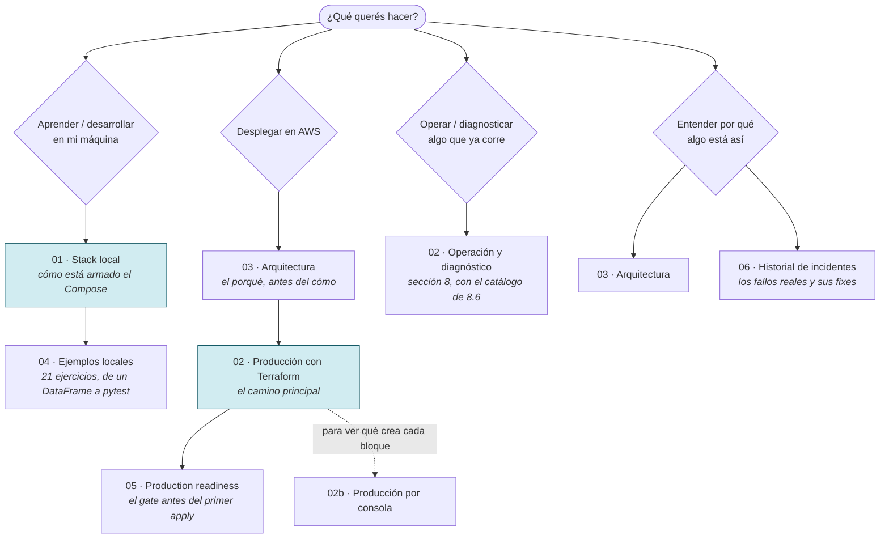

# Documentación de `pyspark_stack`

> **En este documento: ORIENTARSE, ~5 min.** Es el índice y la matriz de estado, no
> un tutorial.
> **Salís con**: sabiendo qué documento abrir, en qué orden, y —lo más importante—
> qué de todo esto **ya funciona** y qué es todavía diseño.

Esta carpeta separa lo que ya funciona de la arquitectura objetivo. Un componente se considera
**implementado** solo cuando existe como código versionado y está cubierto por una validación
repetible. Lo marcado como **roadmap** no forma parte todavía del runbook de producción.

> [!IMPORTANT]
> **La columna «Estado» es la que evita el error caro.** «Guía completa» significa que
> el documento está entero y es coherente, **no** que se desplegó y se validó de punta
> a punta en AWS. Antes de ejecutar una sección, mirá acá. Un bloque marcado *roadmap*
> es una decisión de diseño escrita para el día que la implementes, no un
> procedimiento probado.

### Cómo está ordenada la carpeta

Arriba quedan **solo los cuatro documentos que se leen de punta a punta**. Lo que se
consulta —el material de referencia— vive un nivel adentro, para que abrir `docs/`
muestre el camino y no el inventario.

```
docs/
├── 01-stack-local.md                  desarrollo local
├── 02-produccion-aws-terraform.md     producción en AWS: la guía completa
├── 03-arquitectura.md                 el porqué
├── 04-ejemplos-locales.md             tutorial
├── adr/                               decisiones estructurales, con sus alternativas descartadas
└── referencia/                        consulta: 02b, readiness, incidentes, secuencia
```

| Documento | Propósito | Estado |
|---|---|---|
| [01 — Stack local](01-stack-local.md) | Anatomía del Compose y de los contenedores | Implementado |
| [02 — Producción con Terraform](02-produccion-aws-terraform.md) | Arquitectura objetivo y runbook IaC, §1–§22 en un solo documento | Guía completa; sin desplegar |
| [03 — Arquitectura](03-arquitectura.md) | Vista lógica, seguridad y evolución | Implementado + roadmap |
| [04 — Ejemplos locales](04-ejemplos-locales.md) | Tutorial progresivo de 21 ejercicios | Implementado |

Las decisiones que no se rediscuten mientras seguís las guías están en
[`adr/`](adr/README.md) — ocho ADR con su contexto, sus consecuencias y lo que se descartó.

Y en [`referencia/`](referencia), lo que se abre cuando hace falta:

| Documento | Propósito | Estado |
|---|---|---|
| [02b — Producción por consola](referencia/02b-produccion-aws-consola.md) | El mismo camino, sin IaC | Referencia; sin desplegar |
| [05 — Production readiness](referencia/05-production-readiness.md) | Controles previos al primer despliegue | Implementado |
| [06 — Historial de incidentes](referencia/06-historial-de-incidentes.md) | Fallos del stack local y sus fixes | Histórico |
| [07 — Secuencia de ejecución](referencia/07-secuencia-de-ejecucion.md) | Dependencias entre comandos y lectura DevOps de la guía 02 | Análisis |

### Cómo está organizada la guía 02

Es **un solo documento** con numeración continua de §1 a §22, en el orden en que se
construye la plataforma: cada sección usa lo que dejó la anterior. Se recorre en seis
tramos, y el [índice](02-produccion-aws-terraform.md#índice) enlaza sección por sección.

La infraestructura se escribe como **composición Terraform**: `infra/envs/prod/` instancia
módulos y no declara un solo `resource`; los doce módulos de `infra/modules/` tienen interfaz
propia (`variables.tf` / `outputs.tf`). Cada sección repite el mismo bucle: pegar el módulo,
validarlo aislado, componerlo y aplicarlo con `-target`.

| Tramo | Secciones | Qué resuelve |
|---|---|---|
| [1 · Fundamentos](02-produccion-aws-terraform.md#1-panorama-de-la-arquitectura) | §1–§4 | Panorama, costo, prerrequisitos y el **contrato de variables** (guía 02 §3.1) |
| [2 · Núcleo EC2](02-produccion-aws-terraform.md#5-núcleo-ec2-con-docker) | §5 | Red, IAM, EC2+EBS, auto start/stop, deploy y HTTPS |
| [3 · Datos y cómputo](02-produccion-aws-terraform.md#6-data-lake-en-s3) | §6–§7 | Buckets, backups, EMR Serverless y los disparadores |
| [4 · Operación](02-produccion-aws-terraform.md#8-operación-diaria-y-diagnóstico) | §8–§10 | Día a día, diagnóstico, patrones DataOps y despliegue |
| [5 · Entrega y hardening](02-produccion-aws-terraform.md#11-cicd-con-github-actions-y-oidc) | §11–§15 | CI/CD con OIDC, observabilidad, secretos, Compose y runbook |
| [6 · Evolución](02-produccion-aws-terraform.md#16-athena-e-iceberg) | §16–§22 + apéndices | Athena, gobierno, costos y lo marcado *roadmap* |

## Por dónde empezar

No se leen en orden numérico: se leen según qué querés hacer hoy.



**El orden que sí importa**: 01 → 04 → 03 → 02 → 05. El stack local es el
prerrequisito real del de producción —se desarrolla acá y se despliega allá—, y la
guía 02 arranca con un gate explícito que lo verifica. Saltar directo a 02 sin un DAG
que corra en local funciona hasta el primer error, y ahí se paga en minutos de EMR lo
que en Docker cuesta segundos.

**02 y 02b son caminos alternativos para lo mismo, no complementarios.** 02
(Terraform) es el camino principal y la fuente de verdad. 02b (consola) sirve para
*entender* qué crea cada bloque, o para una cuenta donde no podés correr Terraform.
**No los mezcles sobre el mismo recurso**: si algo lo creaste a mano y lo querés en
Terraform, va `terraform import` antes del siguiente `apply`.

## Convenciones comunes a todas las guías

| Convención | Qué significa |
|---|---|
| **Dónde corre el bloque** | Tres contextos, no intercambiables: tu máquina (el default), dentro de la EC2 (`# EN LA EC2`, credenciales del rol de instancia) o GitHub Actions con OIDC. Un bloque de CI ejecutado en local no demuestra nada: prueba tus permisos de admin, no los del rol de OIDC |
| **`task` arriba, desplegable abajo** | Los bloques ejecutables de la guía 02 muestran la task que corrés y, en «Qué corre por dentro», el `terraform`/`aws` equivalente. Las tasks de producción se escriben en [guía 02 §3.0b](02-produccion-aws-terraform.md#30b-el-orquestador-de-comandos-taskfileyml); las locales ya están en el repo. Son las mismas que corre el CI |
| **En esta sección / Salís con** | El encabezado de cada sección dice si toca **leer**, **ejecutar** o **consultar**, y cuánto lleva. Las de «consultar» no se leen de corrido |
| **Mapa del camino** | Prerrequisitos, diagrama de pasos y reglas de la sección, antes del primer comando |
| ✅ **Gate** | El criterio de aceptación de una sección. Si no lo cumplís, no sigas a la siguiente |
| > **Gotcha** | Un fallo real que ya pasó, con su causa. Están donde muerden, no en un anexo |
| *Roadmap* | Diseño, no runbook. No está implementado ni validado |

## Qué contiene el repositorio

El repositorio versiona **únicamente el proyecto local**: Compose, Dockerfiles, DAGs, jobs PySpark,
notebooks y tests. Todo lo de producción se crea siguiendo la guía 02 (o la 02b), que trae el
contenido íntegro de cada archivo.

| Capacidad | Dónde vive |
|---|---|
| Spark, HDFS, Jupyter y Airflow en local | Repositorio — implementado |
| Contexto de producción en variables de entorno (`scripts/prod-env.sh`) | Repositorio — implementado; contrato en guía 02 §3.1 |
| Orquestador de comandos (`Taskfile.yml`) | Repositorio — implementación completa; guía 02 explica su crecimiento por etapas |
| Terraform de EC2, S3, EMR Serverless, IAM y automatización | Guía 02 §4–§7 |
| DAG de Airflow contra EMR Serverless | Guía 02 §9.4 |
| Jobs Spark para EMR Serverless | Guía 02 §6.4 |
| Compose de producción y carga de secretos desde SSM | Guía 02 §13.4 y §14.1 |
| Validación en CI y despliegue con OIDC | Guía 02 §11 |
| Observabilidad Prometheus/Grafana/Loki | Guía 02 §12 y §14.2 — roadmap |
| Tablas Iceberg | Guía 02 §16 — roadmap; el job de referencia escribe Parquet |
| dbt, Great Expectations y OpenLineage | Guía 02 §19–§22 — roadmap |

## Regla de mantenimiento

Los comandos, políticas y configuraciones ejecutables viven en sus archivos canónicos. La
documentación explica decisiones y enlaza esos archivos; no mantiene una segunda copia que pueda
divergir. Cada cambio de arquitectura debe actualizar esta matriz.

Los comandos de las guías **no llevan valores escritos a mano**: leen variables de entorno que
produce Terraform (contrato en la [guía 02 §3.1](02-produccion-aws-terraform.md#31-contrato-de-variables-de-entorno-léalo-antes-de-copiar-cualquier-comando)).
Dos validadores lo mantienen sano y corren sin credenciales AWS:

```bash
task doc:check                        # los dos, y es lo que corre el CI
```

```bash
python3 scripts/check-doc-links.py    # enlaces, anclas y referencias §
python3 scripts/check-doc-env.py      # contrato de variables y bloques de comandos
```

`check-doc-links.py` comprueba que los enlaces relativos apunten a archivos que existen, que las
anclas `#seccion` correspondan a un encabezado real (con las reglas de slug de GitHub) y que cada
`§X.Y` exista — sea local o cruzada (`guía 02 §13.4`, `docs/01 §8.5`). Las guías se renumeran al
editarlas y una referencia rota es invisible leyendo de corrido.

`check-doc-env.py` verifica que ninguna variable se use antes de la sección que la crea (las guías
son incrementales), que todo `$VAR` exista como output o venga de `prod-env.sh`, que los bloques
` ``` ` estén balanceados, que cada bloque bash parsee con `bash -n`, que ningún comando lleve un
nombre de recurso, un account id o una ruta SSH escritos a mano, que `prod-env.sh` no vuelva a
pegarse dentro de la guía (es un archivo versionado: se enlaza) y que cada task del bloque de §11
esté **literal** en `Taskfile.yml` (ese bloque es la fuente de verdad; el archivo se pega, no se
reescribe). También limita los pasos visibles a dos comandos y las explicaciones a cuatro líneas.
Al agregar un recurso, declarás su `output` donde se crea y usás la variable en MAYÚSCULAS.

Los dos leen cada guía **en su orden de secciones**, que es el orden de dependencias: un `output`
declarado en §5 está disponible para los comandos de §8, pero usarlo al revés sigue siendo un error,
y el mensaje dice en qué sección aparece recién. Si agregás, movés o renombrás un documento,
actualizá la lista `GUIDES` de `check-doc-links.py` y `DOC_ORDER` de `check-doc-env.py`: ahí las
entradas son **rutas relativas a `docs/`** (`referencia/02b-produccion-aws-consola.md`), y ambos
validadores recorren el árbol completo, subcarpetas incluidas.
