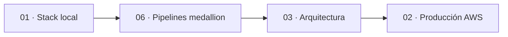

# Documentación de `pyspark_stack`

> **En este documento: ORIENTARSE, ~5 min.** Este es el índice y el contrato de mantenimiento.

Este repositorio contiene **solo documentación canónica**. “Guía completa” significa que reúne los
bloques necesarios para construir el entorno; no significa que esos archivos existan en el checkout,
que AWS esté desplegado ni que se haya realizado una validación end-to-end.

## Documentos

```text
docs/
├── 01-stack-local.md                  construcción y operación local
├── 02-produccion-aws-terraform.md     construcción y operación en AWS
├── 03-arquitectura.md                 decisiones y límites de producción
├── 06-medallion-desde-cero.md         taller de pipelines PySpark
├── adr/                               decisiones estructurales
└── README.md                          este índice
```

| Documento | Fuente canónica de | Estado en este checkout |
|---|---|---|
| [01 — Stack local](01-stack-local.md) | Dockerfiles, Compose, configuración y tareas locales | Guía; runtime no materializado |
| [06 — Medallion](06-medallion-desde-cero.md) | Runtime, DAGs y quince proyectos de datos | Guía/taller; código no materializado |
| [03 — Arquitectura](03-arquitectura.md) | Topología, invariantes, riesgos y criterio de evolución | Referencia vigente |
| [02 — Producción](02-produccion-aws-terraform.md) | Terraform, scripts, DAG/job EMR, Compose y operación AWS | Guía; infraestructura no materializada ni validada E2E |
| [ADR](adr/README.md) | Razones y consecuencias de decisiones estructurales | Registro de decisiones |

## Orden de lectura



El orden operativo sí importa: primero se valida el código en local; después se revisan los límites
de la arquitectura; finalmente se materializa producción. La guía 02 crea recursos facturables y
exige avanzar por checkpoints.

## Organización de la guía 02

La guía de producción tiene once secciones acumulativas:

| Sección | Resultado |
|---|---|
| [1](02-produccion-aws-terraform.md#1-arquitectura-y-prerrequisitos) | Arquitectura, gate, costo y prerrequisitos |
| [2](02-produccion-aws-terraform.md#2-configuración-de-aws-y-contrato-de-variables) | Contexto operativo derivado de outputs |
| [3](02-produccion-aws-terraform.md#3-terraform-y-estado-remoto) | Backend y composición Terraform |
| [4](02-produccion-aws-terraform.md#4-infraestructura-base-red-iam-y-ec2) | Red, IAM, EC2 y automatización de encendido/apagado |
| [5](02-produccion-aws-terraform.md#5-airflow-en-producción) | Airflow productivo y acceso controlado |
| [6](02-produccion-aws-terraform.md#6-s3-y-cómputo-con-emr-serverless) | Data lake, backups y EMR Serverless |
| [7](02-produccion-aws-terraform.md#7-dag-de-airflow-para-emr-serverless) | DAG de integración contra EMR |
| [8](02-produccion-aws-terraform.md#8-validación-técnica-y-end-to-end) | Smoke, E2E, operación y diagnóstico |
| [9](02-produccion-aws-terraform.md#9-flujo-diario-de-desarrollo-y-despliegue) | Flujo de entrega y rollback |
| [10](02-produccion-aws-terraform.md#10-operación-seguridad-y-limpieza) | Secretos, Compose canónico, calidad, recuperación y teardown |
| [11](02-produccion-aws-terraform.md#11-observabilidad-prometheus-grafana-y-loki) | Alertas y observabilidad |

## Convenciones comunes

| Marca | Significado |
|---|---|
| **CREAR/COPIAR** | Crear la ruta indicada con el bloque completo |
| **AGREGAR** | Ampliar el archivo sin borrar lo construido antes |
| **REEMPLAZAR** | Sustituir únicamente el bloque identificado |
| **EJECUTAR** | Correr desde el contexto indicado: local, EC2 o CI |
| **VALIDAR/Checkpoint** | No avanzar hasta obtener el resultado esperado |
| **Referencia** | Explicación; no se materializa ni ejecuta |

## Regla de mantenimiento

- El código de local vive en las guías 01 y 06; el de producción, en la guía 02.
- La guía 03 debe describir exactamente la topología que construye la guía 02.
- Un cambio estructural actualiza el ADR correspondiente, la arquitectura y la guía ejecutable en
  el mismo cambio.
- No se versionan copias materializadas para “demostrar” la guía. La demostración válida consiste
  en extraer sus bloques a un workspace temporal, validar sintaxis y ejecutar los checkpoints del
  entorno correspondiente.
- Roadmap o componentes diferidos deben declararse como tales y no aparecer en diagramas como si
  ya fueran parte del recorrido ejecutable.
