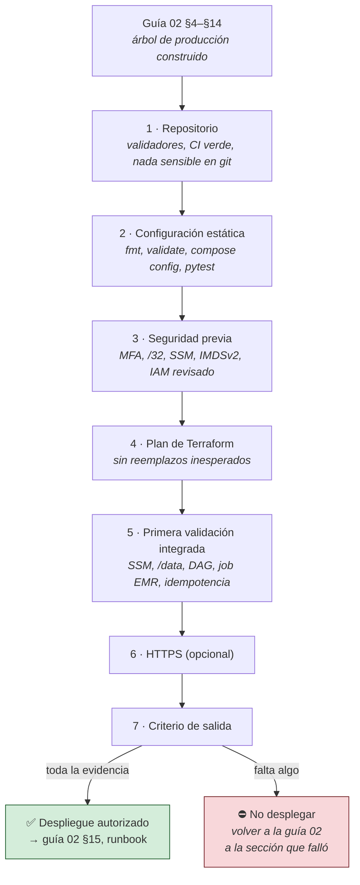

# Checklist de preparación para producción

> **En este documento: VERIFICAR, ~45 min. No ejecuta ningún cambio en AWS.**
> **Salís con**: una decisión binaria —desplegar o no— respaldada por evidencia, en vez
> de por la sensación de que «parece que está todo».

> [!IMPORTANT]
> **Este checklist es un gate, no una guía.** Se corre **después** de haber construido
> el árbol de producción siguiendo la [guía 02](../02-produccion-aws-terraform.md) y
> **antes** del runbook de puesta en producción
> ([02 §15](../02-produccion-aws-terraform.md#15-runbook-de-puesta-en-producción)). Si un control no
> pasa, el fix está en la guía 02 — acá solo se verifica.

**La regla que hace útil a este documento**: una casilla sin evidencia guardada es una
casilla sin marcar. «Me parece que sí» no es un control — la salida del comando, sí.
Guardá esa salida, y registrá cada excepción con responsable, fecha de vencimiento y
riesgo aceptado. Una excepción sin fecha no es una excepción: es un problema que
acordaron olvidar.

Se aplica sobre el árbol de producción completo: `infra/`, `docker-compose.prod.yml`,
`scripts/` y los workflows de CI/CD.

## 1. Repositorio

- [ ] `task doc:check` termina sin errores: `check-doc-links.py` (enlaces, anclas y referencias
      `§`, locales y cruzadas) y `check-doc-env.py` (contrato de variables: orden incremental,
      nombres, fences, sintaxis `bash -n` y ausencia de literales en los comandos).
- [ ] `task --list` muestra las tasks de producción de [guía 02 §3.0b](../02-produccion-aws-terraform.md#30b-el-orquestador-de-comandos-taskfileyml),
      no solo las locales: si faltan, el `Taskfile.yml` quedó sin la mitad de producción.
- [ ] `./scripts/prod-env.sh --check` muestra todas las obligatorias con valor, y el `ACCOUNT_ID`
      es el de la cuenta de producción esperada.
- [ ] CI está verde sobre el commit candidato.
- [ ] El árbol de trabajo está limpio y el commit está etiquetado.
- [ ] No hay `.env`, `infra/envs/prod/prod.env`, `*.tfvars`, `*.tfstate`, claves ni certificados
      versionados (`git status --porcelain --ignored=no` limpio tras un `apply`).
- [ ] Las imágenes y dependencias fueron revisadas y sus actualizaciones son deliberadas.

## 2. Configuración estática

- [ ] `task infra:validate` termina sin errores: cubre el `fmt -check` de `infra/`, el
      `init -backend=false && validate` de **cada** módulo y el del entorno.
- [ ] `docker compose config --quiet` valida el stack local.
- [ ] El Compose de producción valida con valores de prueba, nunca con secretos reales.
- [ ] Si se usa el override de observabilidad, `monitoring/` existe y ambos archivos validan juntos.
- [ ] El override HTTPS solo se usa después de emitir y verificar el certificado.
- [ ] `pytest -q tests/test_dag_integrity.py` no reporta errores de importación.

## 3. Seguridad previa

- [ ] La cuenta usa MFA y no se opera con el usuario root.
- [ ] El backend de Terraform existe y tiene versionado, cifrado y bloqueo.
- [ ] `my_ip_cidr` es `/32` y corresponde a la IP autorizada.
- [ ] Los secretos en SSM existen y son `SecureString`; la config no secreta bajo
      `/<prefijo>/config/` existe y es `String` (inventario en guía 02 §13.4).
- [ ] `aws ssm get-parameters-by-path --path /<prefijo>/config --recursive` devuelve todas las
      variables que el Compose declara con `:?` — si falta una, el arranque aborta.
- [ ] Ningún secreto productivo usa los valores de `.env.example`.
- [ ] Se revisó el plan IAM, en particular `iam:PassRole`, SSM y el acceso a S3.
- [ ] IMDSv2, cifrado EBS, bloqueo público de S3 y política TLS-only aparecen en el plan.

## 4. Plan de Terraform

- [ ] Se guardó el plan (`task infra:plan`, o el `release:check` completo) y se revisó el resumen.
- [ ] No hay reemplazo inesperado de EC2, EBS, buckets, roles ni reglas de red.
- [ ] Toda operación destructiva está justificada y respaldada.
- [ ] Costos, región, AZ, horarios UTC y retención coinciden con el entorno.
- [ ] Otra persona revisó el plan si el entorno contiene datos reales.

## 5. Primera validación integrada

- [ ] SSM muestra la instancia como `Online`.
- [ ] `/data` corresponde al EBS esperado y persiste tras un stop/start.
- [ ] `scripts/load-secrets.sh` genera un `.env` con modo `0600`.
- [ ] Airflow importa `customer_etl_emr` sin errores.
- [ ] Los entrypoints de EMR están en el bucket de artifacts.
- [ ] Un job pequeño termina y escribe únicamente en el prefijo esperado.
- [ ] Un segundo intento con la misma entrada no duplica el resultado.
- [ ] Los logs de Airflow, Lambda y EMR permiten reconstruir la ejecución.
- [ ] El autoapagado no corta DAGs activos y el cierre forzado respeta el horario acordado.

## 6. HTTPS (opcional)

- [ ] El DNS resuelve a la Elastic IP correcta.
- [ ] El certificado y la clave existen bajo `/data/certs` y sus symlinks resuelven.
- [ ] Las cinco variables HTTPS (`AIRFLOW_DOMAIN`, `AIRFLOW_BASE_URL`,
      `AIRFLOW_EXECUTION_API_URL`, `AIRFLOW_SSL_CERT`, `AIRFLOW_SSL_KEY`) están **publicadas en
      SSM**, no solo escritas a mano en el `.env` de la EC2: `load-secrets.sh` regenera ese
      archivo desde cero y borraría las líneas manuales, dejando el arranque HTTPS roto
      (guía 02 §5.6).
- [ ] Se usa `docker-compose.prod.https.yml`.
- [ ] El puerto 443 solo acepta la IP autorizada y el 8082 no está expuesto en el security group.

## 7. Criterio de salida

El primer despliegue se acepta únicamente con evidencia de: smoke test, prueba end-to-end,
persistencia tras reinicio, restauración de backup y teardown ensayado en un entorno sin datos.

Iceberg, monitoreo, dbt, calidad y lineage no bloquean la primera versión porque son roadmap: cada
uno debe llegar con su propio cambio, sus pruebas y su criterio de aceptación.
